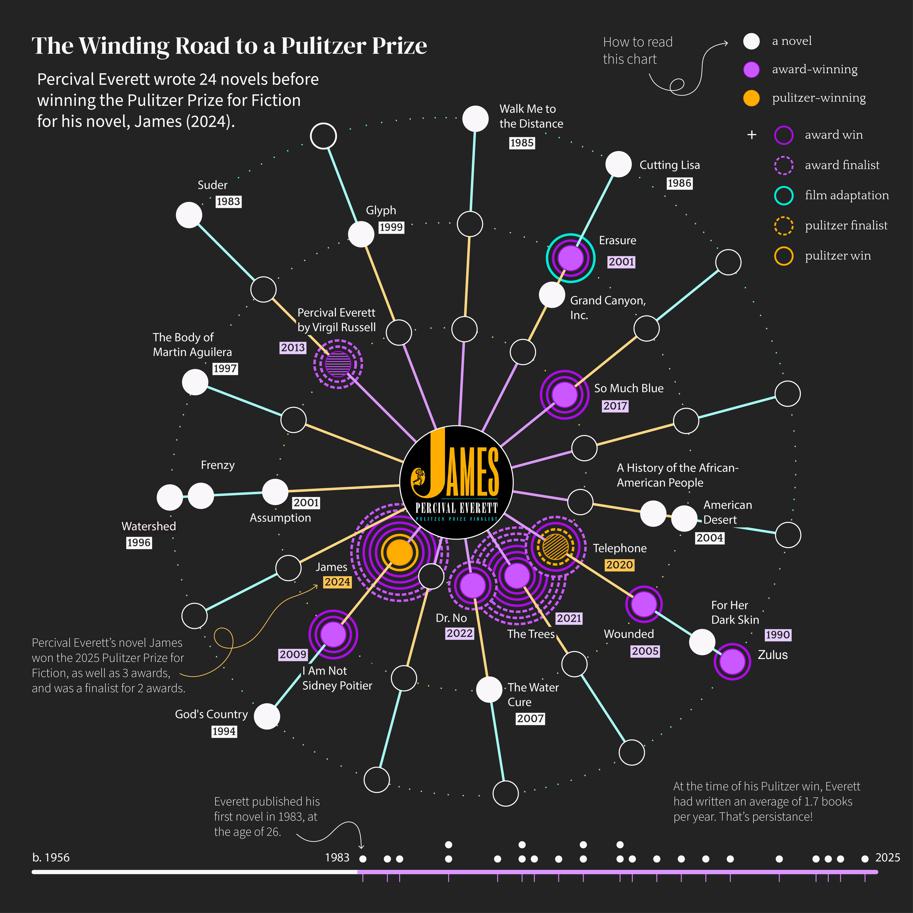

<head>
    <meta charset="UTF-8">
    <meta name="viewport" content="width=device-width, initial-scale=1.0">
    <link href="https://fonts.googleapis.com/css2?family=Quattrocento&display=swap" rel="stylesheet">
    <link href="https://fonts.googleapis.com/css2?family=DM+Serif+Display&display=swap" rel="stylesheet">
    <link href="https://fonts.googleapis.com/css?family=Source+Sans+Pro:400,700&display=swap" rel="stylesheet">
</head>

<h2>James: 2025 Pulitzer Prize for Fiction</h2>

The 2025 Pulitzer Prize for Fiction was awarded to Percival Everett for his novel, James (2024). This work is a reconsideration of Mark Twain's "Adventures of Huckleberry Finn" told from the perspective of the character Jim. Both poignant and satirical, it illustrates the power of language and injustices of racist social constructs. 📚

As Everett's 24th published novel, its accolades reflect a long-term persistence to his writing career. With each prolific decade, he received more literary recognition. 🏆

► Hover over the colored circles 🟣 to see literary recognition by novel (works best on desktop).

<!-- Load image that I want used for web preview, but take no action -->

<!-- Pulitzer SVG -->

<svg id="Artboard7:_Take_4" data-name="Artboard7: Take 4" xmlns="http://www.w3.org/2000/svg" xmlns:xlink="http://www.w3.org/1999/xlink" viewBox="0 0 2600 2600">
    <defs>
    <pattern id="_10_lpi_30_2" data-name="10 lpi 30% 2" x="0" y="0" width="72" height="72" patternTransform="translate(4801.5 -306.03)" patternUnits="userSpaceOnUse" viewBox="0 0 72 72">
        <g>
            <rect class="cls-37" width="72" height="72"/>
            <rect class="cls-53" x="53.17" y="47.61" width="90.83" height="96.39"/>
            <rect class="cls-53" x="-18.83" y="47.61" width="90.83" height="96.39"/>
            <g>
            <rect class="cls-53" x="53.17" y="-24.39" width="90.83" height="96.39"/>
            <line class="cls-38" x1="71.75" y1="68.4" x2="144.25" y2="68.4"/>
            <line class="cls-38" x1="71.75" y1="54" x2="144.25" y2="54"/>
            <line class="cls-38" x1="71.75" y1="39.6" x2="144.25" y2="39.6"/>
            <line class="cls-38" x1="71.75" y1="25.2" x2="144.25" y2="25.2"/>
            <line class="cls-38" x1="71.75" y1="10.8" x2="144.25" y2="10.8"/>
            <line class="cls-38" x1="71.75" y1="61.2" x2="144.25" y2="61.2"/>
            <line class="cls-38" x1="71.75" y1="46.8" x2="144.25" y2="46.8"/>
            <line class="cls-38" x1="71.75" y1="32.4" x2="144.25" y2="32.4"/>
            <line class="cls-38" x1="71.75" y1="18" x2="144.25" y2="18"/>
            <line class="cls-38" x1="71.75" y1="3.6" x2="144.25" y2="3.6"/>
            </g>
            <g>
            <rect class="cls-53" x="-18.83" y="-24.39" width="90.83" height="96.39"/>
            <line class="cls-38" x1="-.25" y1="68.4" x2="72.25" y2="68.4"/>
            <line class="cls-38" x1="-.25" y1="54" x2="72.25" y2="54"/>
            <line class="cls-38" x1="-.25" y1="39.6" x2="72.25" y2="39.6"/>
            <line class="cls-38" x1="-.25" y1="25.2" x2="72.25" y2="25.2"/>
            <line class="cls-38" x1="-.25" y1="10.8" x2="72.25" y2="10.8"/>
            <line class="cls-38" x1="-.25" y1="61.2" x2="72.25" y2="61.2"/>
            <line class="cls-38" x1="-.25" y1="46.8" x2="72.25" y2="46.8"/>
            <line class="cls-38" x1="-.25" y1="32.4" x2="72.25" y2="32.4"/>
            <line class="cls-38" x1="-.25" y1="18" x2="72.25" y2="18"/>
            <line class="cls-38" x1="-.25" y1="3.6" x2="72.25" y2="3.6"/>
            </g>
            <g>
            <line class="cls-38" x1="-72.25" y1="68.4" x2=".25" y2="68.4"/>
            <line class="cls-38" x1="-72.25" y1="54" x2=".25" y2="54"/>
            <line class="cls-38" x1="-72.25" y1="39.6" x2=".25" y2="39.6"/>
            <line class="cls-38" x1="-72.25" y1="25.2" x2=".25" y2="25.2"/>
            <line class="cls-38" x1="-72.25" y1="10.8" x2=".25" y2="10.8"/>
            <line class="cls-38" x1="-72.25" y1="61.2" x2=".25" y2="61.2"/>
            <line class="cls-38" x1="-72.25" y1="46.8" x2=".25" y2="46.8"/>
            <line class="cls-38" x1="-72.25" y1="32.4" x2=".25" y2="32.4"/>
            <line class="cls-38" x1="-72.25" y1="18" x2=".25" y2="18"/>
            <line class="cls-38" x1="-72.25" y1="3.6" x2=".25" y2="3.6"/>
            </g>
        </g>
    </pattern>
    <pattern id="_10_lpi_30_" data-name="10 lpi 30%" x="0" y="0" width="72" height="72" patternTransform="translate(7657.88 -5853.26) rotate(-35.91)" patternUnits="userSpaceOnUse" viewBox="0 0 72 72">
        <g>
            <rect class="cls-37" width="72" height="72"/>
            <rect class="cls-53" x="53.17" y="47.61" width="90.83" height="96.39"/>
            <rect class="cls-53" x="-18.83" y="47.61" width="90.83" height="96.39"/>
            <g>
            <rect class="cls-53" x="53.17" y="-24.39" width="90.83" height="96.39"/>
            <line class="cls-39" x1="71.75" y1="68.4" x2="144.25" y2="68.4"/>
            <line class="cls-39" x1="71.75" y1="54" x2="144.25" y2="54"/>
            <line class="cls-39" x1="71.75" y1="39.6" x2="144.25" y2="39.6"/>
            <line class="cls-39" x1="71.75" y1="25.2" x2="144.25" y2="25.2"/>
            <line class="cls-39" x1="71.75" y1="10.8" x2="144.25" y2="10.8"/>
            <line class="cls-39" x1="71.75" y1="61.2" x2="144.25" y2="61.2"/>
            <line class="cls-39" x1="71.75" y1="46.8" x2="144.25" y2="46.8"/>
            <line class="cls-39" x1="71.75" y1="32.4" x2="144.25" y2="32.4"/>
            <line class="cls-39" x1="71.75" y1="18" x2="144.25" y2="18"/>
            <line class="cls-39" x1="71.75" y1="3.6" x2="144.25" y2="3.6"/>
            </g>
            <g>
            <rect class="cls-53" x="-18.83" y="-24.39" width="90.83" height="96.39"/>
            <line class="cls-39" x1="-.25" y1="68.4" x2="72.25" y2="68.4"/>
            <line class="cls-39" x1="-.25" y1="54" x2="72.25" y2="54"/>
            <line class="cls-39" x1="-.25" y1="39.6" x2="72.25" y2="39.6"/>
            <line class="cls-39" x1="-.25" y1="25.2" x2="72.25" y2="25.2"/>
            <line class="cls-39" x1="-.25" y1="10.8" x2="72.25" y2="10.8"/>
            <line class="cls-39" x1="-.25" y1="61.2" x2="72.25" y2="61.2"/>
            <line class="cls-39" x1="-.25" y1="46.8" x2="72.25" y2="46.8"/>
            <line class="cls-39" x1="-.25" y1="32.4" x2="72.25" y2="32.4"/>
            <line class="cls-39" x1="-.25" y1="18" x2="72.25" y2="18"/>
            <line class="cls-39" x1="-.25" y1="3.6" x2="72.25" y2="3.6"/>
            </g>
            <g>
            <line class="cls-39" x1="-72.25" y1="68.4" x2=".25" y2="68.4"/>
            <line class="cls-39" x1="-72.25" y1="54" x2=".25" y2="54"/>
            <line class="cls-39" x1="-72.25" y1="39.6" x2=".25" y2="39.6"/>
            <line class="cls-39" x1="-72.25" y1="25.2" x2=".25" y2="25.2"/>
            <line class="cls-39" x1="-72.25" y1="10.8" x2=".25" y2="10.8"/>
            <line class="cls-39" x1="-72.25" y1="61.2" x2=".25" y2="61.2"/>
            <line class="cls-39" x1="-72.25" y1="46.8" x2=".25" y2="46.8"/>
            <line class="cls-39" x1="-72.25" y1="32.4" x2=".25" y2="32.4"/>
            <line class="cls-39" x1="-72.25" y1="18" x2=".25" y2="18"/>
            <line class="cls-39" x1="-72.25" y1="3.6" x2=".25" y2="3.6"/>
            </g>
        </g>
    </pattern>
    </defs>
    <g id="Chart">
        <g id="spiral">
        <g>
            <circle id="start-c" class="cls-99" cx="539.65" cy="614.17" r="2"/>
            <circle class="cls-90" cx="557.08" cy="598.54" r="2"/>
            <circle class="cls-89" cx="576.85" cy="581.63" r="2"/>
            <circle class="cls-118" cx="598.96" cy="563.68" r="2"/>
            <circle class="cls-121" cx="623.41" cy="544.94" r="2"/>
            <circle class="cls-123" cx="650.21" cy="525.66" r="2"/>
            <circle class="cls-122" cx="679.35" cy="506.06" r="2"/>
            <circle class="cls-120" cx="710.84" cy="486.4" r="2"/>
            <circle class="cls-119" cx="744.69" cy="466.93" r="2"/>
            <circle class="cls-92" cx="780.88" cy="447.87" r="2"/>
            <circle class="cls-91" cx="819.43" cy="429.48" r="2"/>
            <circle class="cls-93" cx="860.33" cy="411.99" r="2"/>
            <circle class="cls-94" cx="903.6" cy="395.66" r="2"/>
            <circle class="cls-88" cx="950.5" cy="380.33" r="2"/>
            <circle class="cls-74" cx="997.72" cy="367.29" r="2"/>
            <circle class="cls-75" cx="1043.32" cy="356.89" r="2"/>
            <circle class="cls-69" cx="1087.09" cy="348.85" r="2"/>
            <circle class="cls-68" cx="1128.79" cy="342.93" r="2"/>
            <circle class="cls-70" cx="1168.22" cy="338.87" r="2"/>
            <circle class="cls-71" cx="1205.15" cy="336.4" r="2"/>
            <circle class="cls-82" cx="1239.36" cy="335.27" r="2"/>
            <circle class="cls-81" cx="1270.62" cy="335.22" r="2"/>
            <circle class="cls-67" cx="1298.72" cy="335.99" r="2"/>
            <circle class="cls-67" cx="1323.44" cy="337.32" r="2"/>
            <circle class="cls-95" cx="1344.55" cy="338.95" r="2"/>
            <circle class="cls-95" cx="1375.3" cy="342.14" r="2"/>
            <circle class="cls-96" cx="1424.02" cy="349.11" r="2"/>
            <circle class="cls-97" cx="1470.17" cy="357.92" r="2"/>
            <circle class="cls-98" cx="1513.66" cy="368.23" r="2"/>
            <circle class="cls-275" cx="1554.4" cy="379.7" r="2"/>
            <circle class="cls-274" cx="1592.28" cy="392" r="2"/>
            <circle class="cls-234" cx="1627.2" cy="404.79" r="2"/>
            <circle class="cls-233" cx="1659.07" cy="417.73" r="2"/>
            <circle class="cls-308" cx="1687.79" cy="430.48" r="2"/>
            <circle class="cls-308" cx="1713.26" cy="442.71" r="2"/>
            <circle class="cls-273" cx="1735.38" cy="454.08" r="2"/>
            <circle class="cls-273" cx="1754.06" cy="464.25" r="2"/>
            <circle class="cls-309" cx="1781.5" cy="480.17" r="2"/>
            <circle class="cls-309" cx="1821.88" cy="505.78" r="2"/>
            <circle class="cls-310" cx="1859.31" cy="532.02" r="2"/>
            <circle class="cls-269" cx="1893.84" cy="558.58" r="2"/>
            <circle class="cls-268" cx="1925.53" cy="585.13" r="2"/>
            <circle class="cls-240" cx="1954.44" cy="611.35" r="2"/>
            <circle class="cls-239" cx="1980.6" cy="636.93" r="2"/>
            <circle class="cls-100" cx="2004.09" cy="661.55" r="2"/>
            <circle class="cls-100" cx="2024.94" cy="684.88" r="2"/>
            <circle class="cls-105" cx="2043.23" cy="706.61" r="2"/>
            <circle class="cls-105" cx="2058.99" cy="726.42" r="2"/>
            <circle class="cls-115" cx="2072.28" cy="743.99" r="2"/>
            <circle class="cls-115" cx="2096.41" cy="778.12" r="2"/>
            <circle class="cls-101" cx="2122.74" cy="819.17" r="2"/>
            <circle class="cls-101" cx="2145.9" cy="859.35" r="2"/>
            <circle class="cls-80" cx="2166.1" cy="898.33" r="2"/>
            <circle class="cls-109" cx="2183.53" cy="935.76" r="2"/>
            <circle class="cls-110" cx="2198.41" cy="971.32" r="2"/>
            <circle class="cls-231" cx="2210.93" cy="1004.67" r="2"/>
            <circle class="cls-231" cx="2221.3" cy="1035.46" r="2"/>
            <circle class="cls-271" cx="2229.72" cy="1063.38" r="2"/>
            <circle class="cls-271" cx="2236.4" cy="1088.09" r="2"/>
            <circle class="cls-86" cx="2241.55" cy="1109.24" r="2"/>
            <circle class="cls-86" cx="2246.89" cy="1133.93" r="2"/>
            <circle class="cls-73" cx="2255.33" cy="1181.62" r="2"/>
            <circle class="cls-73" cx="2261.15" cy="1227.47" r="2"/>
            <circle class="cls-72" cx="2264.68" cy="1271.27" r="2"/>
            <circle class="cls-78" cx="2266.19" cy="1312.84" r="2"/>
            <circle class="cls-79" cx="2266.01" cy="1351.97" r="2"/>
            <circle class="cls-76" cx="2264.42" cy="1388.48" r="2"/>
            <circle class="cls-76" cx="2261.74" cy="1422.17" r="2"/>
            <circle class="cls-77" cx="2258.26" cy="1452.85" r="2"/>
            <circle class="cls-77" cx="2254.29" cy="1480.32" r="2"/>
            <circle class="cls-87" cx="2250.12" cy="1504.38" r="2"/>
            <circle class="cls-87" cx="2246.06" cy="1524.85" r="2"/>
            <circle class="cls-85" cx="2234.51" cy="1573.53" r="2"/>
            <circle class="cls-83" cx="2220.92" cy="1620.08" r="2"/>
            <circle class="cls-246" cx="2205.92" cy="1663.45" r="2"/>
            <circle class="cls-246" cx="2189.96" cy="1703.56" r="2"/>
            <circle class="cls-267" cx="2173.47" cy="1740.31" r="2"/>
            <circle class="cls-272" cx="2156.88" cy="1773.63" r="2"/>
            <circle class="cls-272" cx="2140.64" cy="1803.42" r="2"/>
            <circle class="cls-250" cx="2125.18" cy="1829.6" r="2"/>
            <circle class="cls-249" cx="2110.93" cy="1852.08" r="2"/>
            <circle class="cls-270" cx="2098.34" cy="1870.78" r="2"/>
            <circle class="cls-270" cx="2087.84" cy="1885.6" r="2"/>
            <circle class="cls-114" cx="2059.09" cy="1923.25" r="2"/>
            <circle class="cls-114" cx="2028.8" cy="1959.01" r="2"/>
            <circle class="cls-84" cx="1998.42" cy="1991.49" r="2"/>
            <circle class="cls-84" cx="1968.33" cy="2020.81" r="2"/>
            <circle class="cls-124" cx="1938.93" cy="2047.08" r="2"/>
            <circle class="cls-125" cx="1910.59" cy="2070.39" r="2"/>
            <circle class="cls-257" cx="1883.7" cy="2090.85" r="2"/>
            <circle class="cls-206" cx="1858.64" cy="2108.56" r="2"/>
            <circle class="cls-206" cx="1835.81" cy="2123.63" r="2"/>
            <circle class="cls-106" cx="1815.58" cy="2136.16" r="2"/>
            <circle class="cls-106" cx="1794.07" cy="2148.69" r="2"/>
            <circle class="cls-258" cx="1750.15" cy="2171.92" r="2"/>
            <circle class="cls-259" cx="1707.37" cy="2191.74" r="2"/>
            <circle class="cls-102" cx="1666.08" cy="2208.43" r="2"/>
            <circle class="cls-102" cx="1626.64" cy="2222.26" r="2"/>
            <circle class="cls-108" cx="1589.4" cy="2233.52" r="2"/>
            <circle class="cls-108" cx="1554.74" cy="2242.48" r="2"/>
            <circle class="cls-211" cx="1523" cy="2249.42" r="2"/>
            <circle class="cls-212" cx="1494.54" cy="2254.63" r="2"/>
            <circle class="cls-218" cx="1469.72" cy="2258.38" r="2"/>
            <circle class="cls-219" cx="1448.9" cy="2260.95" r="2"/>
            <circle class="cls-219" cx="1412.39" cy="2264.24" r="2"/>
            <circle class="cls-236" cx="1364.56" cy="2266.27" r="2"/>
            <circle class="cls-236" cx="1319.2" cy="2265.84" r="2"/>
            <circle class="cls-237" cx="1276.52" cy="2263.34" r="2"/>
            <circle class="cls-237" cx="1236.73" cy="2259.17" r="2"/>
            <circle class="cls-223" cx="1200.03" cy="2253.72" r="2"/>
            <circle class="cls-223" cx="1166.63" cy="2247.4" r="2"/>
            <circle class="cls-224" cx="1136.71" cy="2240.6" r="2"/>
            <circle class="cls-225" cx="1110.5" cy="2233.71" r="2"/>
            <circle class="cls-266" cx="1088.2" cy="2227.14" r="2"/>
            <circle class="cls-265" cx="1061.62" cy="2218.44" r="2"/>
            <circle class="cls-253" cx="1014.84" cy="2200.78" r="2"/>
            <circle class="cls-260" cx="971.64" cy="2181.7" r="2"/>
            <circle class="cls-260" cx="932.04" cy="2161.7" r="2"/>
            <circle class="cls-113" cx="896.11" cy="2141.32" r="2"/>
            <circle class="cls-113" cx="863.88" cy="2121.09" r="2"/>
            <circle class="cls-107" cx="835.4" cy="2101.51" r="2"/>
            <circle class="cls-107" cx="810.71" cy="2083.13" r="2"/>
            <circle class="cls-242" cx="789.86" cy="2066.46" r="2"/>
            <circle class="cls-241" cx="772.89" cy="2052.04" r="2"/>
            <circle class="cls-247" cx="755.69" cy="2036.54" r="2"/>
            <circle class="cls-248" cx="720.77" cy="2002.3" r="2"/>
            <circle class="cls-245" cx="689.58" cy="1968.09" r="2"/>
            <circle class="cls-244" cx="661.95" cy="1934.39" r="2"/>
            <circle class="cls-243" cx="637.7" cy="1901.64" r="2"/>
            <circle class="cls-104" cx="616.65" cy="1870.32" r="2"/>
            <circle class="cls-104" cx="598.63" cy="1840.89" r="2"/>
            <circle class="cls-103" cx="583.46" cy="1813.8" r="2"/>
            <circle class="cls-103" cx="570.96" cy="1789.51" r="2"/>
            <circle class="cls-252" cx="560.96" cy="1768.48" r="2"/>
            <circle class="cls-251" cx="549.39" cy="1742" r="2"/>
            <circle class="cls-214" cx="531.7" cy="1695.7" r="2"/>
            <circle class="cls-215" cx="517.56" cy="1651.19" r="2"/>
            <circle class="cls-217" cx="506.57" cy="1608.9" r="2"/>
            <circle class="cls-216" cx="498.35" cy="1569.21" r="2"/>
            <circle class="cls-255" cx="492.51" cy="1532.56" r="2"/>
            <circle class="cls-254" cx="488.65" cy="1499.33" r="2"/>
            <circle class="cls-256" cx="486.38" cy="1469.96" r="2"/>
            <circle class="cls-220" cx="485.31" cy="1444.84" r="2"/>
            <circle class="cls-220" cx="485.05" cy="1424.39" r="2"/>
            <circle class="cls-112" cx="486" cy="1385.73" r="2"/>
            <circle class="cls-111" cx="489.69" cy="1338.26" r="2"/>
            <circle class="cls-116" cx="495.69" cy="1293.87" r="2"/>
            <circle class="cls-117" cx="503.47" cy="1252.76" r="2"/>
            <circle class="cls-182" cx="512.52" cy="1215.13" r="2"/>
            <circle class="cls-181" cx="522.34" cy="1181.19" r="2"/>
            <circle class="cls-203" cx="532.4" cy="1151.12" r="2"/>
            <circle class="cls-202" cx="542.2" cy="1125.13" r="2"/>
            <circle class="cls-170" cx="551.22" cy="1103.41" r="2"/>
            <circle class="cls-171" cx="562.69" cy="1078.21" r="2"/>
            <circle class="cls-198" cx="585.48" cy="1033.98" r="2"/>
            <circle class="cls-127" cx="609.33" cy="993.82" r="2"/>
            <circle class="cls-199" cx="633.6" cy="957.72" r="2"/>
            <circle class="cls-173" cx="657.67" cy="925.65" r="2"/>
            <circle class="cls-172" cx="680.89" cy="897.6" r="2"/>
            <circle class="cls-195" cx="702.64" cy="873.56" r="2"/>
            <circle class="cls-194" cx="722.26" cy="853.5" r="2"/>
            <circle class="cls-201" cx="739.14" cy="837.4" r="2"/>
            <circle class="cls-200" cx="754.89" cy="823.28" r="2"/>
            <circle class="cls-158" cx="793.22" cy="791.97" r="2"/>
            <circle class="cls-183" cx="830.99" cy="764.85" r="2"/>
            <circle class="cls-180" cx="867.63" cy="741.62" r="2"/>
            <circle class="cls-187" cx="902.59" cy="722" r="2"/>
            <circle class="cls-186" cx="935.28" cy="705.71" r="2"/>
            <circle class="cls-185" cx="965.16" cy="692.46" r="2"/>
            <circle class="cls-184" cx="991.65" cy="681.98" r="2"/>
            <circle class="cls-190" cx="1014.2" cy="673.99" r="2"/>
            <circle class="cls-189" cx="1037.1" cy="666.71" r="2"/>
            <circle class="cls-196" cx="1085.21" cy="653.99" r="2"/>
            <circle class="cls-197" cx="1130.92" cy="644.96" r="2"/>
            <circle class="cls-177" cx="1173.78" cy="639.09" r="2"/>
            <circle class="cls-178" cx="1213.36" cy="635.86" r="2"/>
            <circle class="cls-191" cx="1249.21" cy="634.72" r="2"/>
            <circle class="cls-191" cx="1280.88" cy="635.15" r="2"/>
            <circle class="cls-232" cx="1307.92" cy="636.61" r="2"/>
            <circle class="cls-209" cx="1329.9" cy="638.57" r="2"/>
            <circle class="cls-210" cx="1361.95" cy="642.69" r="2"/>
            <circle class="cls-226" cx="1409.57" cy="651.49" r="2"/>
            <circle class="cls-227" cx="1453.41" cy="662.51" r="2"/>
            <circle class="cls-230" cx="1493.26" cy="675.05" r="2"/>
            <circle class="cls-229" cx="1528.95" cy="688.45" r="2"/>
            <circle class="cls-207" cx="1560.28" cy="702" r="2"/>
            <circle class="cls-208" cx="1587.06" cy="715.03" r="2"/>
            <circle class="cls-213" cx="1609.11" cy="726.84" r="2"/>
            <circle class="cls-213" cx="1626.23" cy="736.75" r="2"/>
            <circle class="cls-238" cx="1667.33" cy="763.29" r="2"/>
            <circle class="cls-238" cx="1704.8" cy="791.19" r="2"/>
            <circle class="cls-235" cx="1737.82" cy="819.14" r="2"/>
            <circle class="cls-168" cx="1766.51" cy="846.39" r="2"/>
            <circle class="cls-169" cx="1790.97" cy="872.19" r="2"/>
            <circle class="cls-193" cx="1811.32" cy="895.79" r="2"/>
            <circle class="cls-192" cx="1827.66" cy="916.43" r="2"/>
            <circle class="cls-175" cx="1840.11" cy="933.36" r="2"/>
            <circle class="cls-176" cx="1863.47" cy="968.42" r="2"/>
            <circle class="cls-167" cx="1887.55" cy="1010.17" r="2"/>
            <circle class="cls-167" cx="1907.19" cy="1050.09" r="2"/>
            <circle class="cls-179" cx="1922.84" cy="1087.42" r="2"/>
            <circle class="cls-179" cx="1934.95" cy="1121.43" r="2"/>
            <circle class="cls-174" cx="1943.99" cy="1151.37" r="2"/>
            <circle class="cls-174" cx="1950.39" cy="1176.51" r="2"/>
            <circle class="cls-228" cx="1954.63" cy="1196.1" r="2"/>
            <circle class="cls-221" cx="1961.34" cy="1236.08" r="2"/>
            <circle class="cls-222" cx="1966.08" cy="1282.89" r="2"/>
            <circle class="cls-130" cx="1967.56" cy="1326.35" r="2"/>
            <circle class="cls-129" cx="1966.47" cy="1366" r="2"/>
            <circle class="cls-128" cx="1963.52" cy="1401.41" r="2"/>
            <circle class="cls-128" cx="1959.4" cy="1432.11" r="2"/>
            <circle class="cls-147" cx="1954.82" cy="1457.66" r="2"/>
            <circle class="cls-147" cx="1950.49" cy="1477.59" r="2"/>
            <circle class="cls-141" cx="1937.64" cy="1524.44" r="2"/>
            <circle class="cls-141" cx="1922.02" cy="1568.61" r="2"/>
            <circle class="cls-134" cx="1905.01" cy="1607.98" r="2"/>
            <circle class="cls-134" cx="1887.56" cy="1642.4" r="2"/>
            <circle class="cls-152" cx="1870.6" cy="1671.7" r="2"/>
            <circle class="cls-139" cx="1855.08" cy="1695.71" r="2"/>
            <circle class="cls-138" cx="1841.94" cy="1714.27" r="2"/>
            <circle class="cls-140" cx="1822.97" cy="1738.68" r="2"/>
            <circle class="cls-140" cx="1790.93" cy="1774.98" r="2"/>
            <circle class="cls-142" cx="1759.08" cy="1806.16" r="2"/>
            <circle class="cls-142" cx="1728.39" cy="1832.45" r="2"/>
            <circle class="cls-144" cx="1699.79" cy="1854.12" r="2"/>
            <circle class="cls-143" cx="1674.24" cy="1871.42" r="2"/>
            <circle class="cls-205" cx="1652.69" cy="1884.59" r="2"/>
            <circle class="cls-205" cx="1633.39" cy="1895.34" r="2"/>
            <circle class="cls-204" cx="1588.3" cy="1917.06" r="2"/>
            <circle class="cls-204" cx="1545.43" cy="1933.76" r="2"/>
            <circle class="cls-135" cx="1505.65" cy="1946.11" r="2"/>
            <circle class="cls-137" cx="1469.81" cy="1954.79" r="2"/>
            <circle class="cls-136" cx="1438.78" cy="1960.49" r="2"/>
            <circle class="cls-131" cx="1413.43" cy="1963.87" r="2"/>
            <circle class="cls-131" cx="1394.44" cy="1965.63" r="2"/>
            <circle class="cls-132" cx="1344.11" cy="1967.29" r="2"/>
            <circle class="cls-132" cx="1297.98" cy="1965.08" r="2"/>
            <circle class="cls-163" cx="1256.62" cy="1960.06" r="2"/>
            <circle class="cls-163" cx="1220.56" cy="1953.25" r="2"/>
            <circle class="cls-159" cx="1190.35" cy="1945.72" r="2"/>
            <circle class="cls-160" cx="1166.55" cy="1938.51" r="2"/>
            <circle class="cls-157" cx="1144.36" cy="1930.68" r="2"/>
            <circle class="cls-157" cx="1098.87" cy="1911.25" r="2"/>
            <circle class="cls-155" cx="1058.96" cy="1890.18" r="2"/>
            <circle class="cls-188" cx="1024.69" cy="1868.72" r="2"/>
            <circle class="cls-188" cx="996.14" cy="1848.1" r="2"/>
            <circle class="cls-145" cx="973.37" cy="1829.57" r="2"/>
            <circle class="cls-146" cx="956.46" cy="1814.38" r="2"/>
            <circle class="cls-161" cx="931.43" cy="1789.3" r="2"/>
            <circle class="cls-161" cx="900.27" cy="1752.98" r="2"/>
            <circle class="cls-166" cx="874.91" cy="1718.04" r="2"/>
            <circle class="cls-166" cx="854.89" cy="1685.76" r="2"/>
            <circle class="cls-162" cx="839.71" cy="1657.4" r="2"/>
            <circle class="cls-162" cx="828.91" cy="1634.24" r="2"/>
            <circle class="cls-154" cx="820.01" cy="1612.45" r="2"/>
            <circle class="cls-153" cx="804.57" cy="1565.65" r="2"/>
            <circle class="cls-133" cx="794.33" cy="1522.24" r="2"/>
            <circle class="cls-148" cx="788.3" cy="1483.24" r="2"/>
            <circle class="cls-148" cx="785.44" cy="1449.67" r="2"/>
            <circle class="cls-165" cx="784.73" cy="1422.55" r="2"/>
            <circle class="cls-165" cx="785.16" cy="1402.89" r="2"/>
            <circle class="cls-156" cx="789.8" cy="1352.24" r="2"/>
            <circle class="cls-156" cx="798.22" cy="1307.11" r="2"/>
            <circle class="cls-151" cx="808.81" cy="1268.35" r="2"/>
            <circle class="cls-151" cx="819.98" cy="1236.61" r="2"/>
            <circle class="cls-150" cx="830.15" cy="1212.54" r="2"/>
            <circle class="cls-149" cx="839.02" cy="1194.26" r="2"/>
            <circle class="cls-279" cx="863.06" cy="1152.53" r="2"/>
            <circle class="cls-286" cx="888.17" cy="1117.05" r="2"/>
            <circle class="cls-286" cx="912.84" cy="1087.68" r="2"/>
            <circle class="cls-297" cx="935.56" cy="1064.29" r="2"/>
            <circle class="cls-297" cx="954.84" cy="1046.75" r="2"/>
            <circle class="cls-289" cx="980.63" cy="1026.1" r="2"/>
            <circle class="cls-289" cx="1021.75" cy="998.58" r="2"/>
            <circle class="cls-305" cx="1059.85" cy="978.03" r="2"/>
            <circle class="cls-305" cx="1092.99" cy="963.54" r="2"/>
            <circle class="cls-301" cx="1119.21" cy="954.19" r="2"/>
            <circle class="cls-300" cx="1136.57" cy="949.07" r="2"/>
            <circle class="cls-282" cx="1182.99" cy="939.15" r="2"/>
            <circle class="cls-285" cx="1227.31" cy="934.32" r="2"/>
            <circle class="cls-304" cx="1265.65" cy="933.66" r="2"/>
            <circle class="cls-280" cx="1296.72" cy="935.56" r="2"/>
            <circle class="cls-280" cx="1319.25" cy="938.38" r="2"/>
            <circle class="cls-298" cx="1359.2" cy="946.52" r="2"/>
            <circle class="cls-298" cx="1403.09" cy="960.11" r="2"/>
            <circle class="cls-293" cx="1439.34" cy="975.35" r="2"/>
            <circle class="cls-293" cx="1467.37" cy="989.96" r="2"/>
            <circle class="cls-284" cx="1486.61" cy="1001.7" r="2"/>
            <circle class="cls-283" cx="1519.21" cy="1025.33" r="2"/>
            <circle class="cls-277" cx="1552.94" cy="1055.5" r="2"/>
            <circle class="cls-276" cx="1578.86" cy="1083.85" r="2"/>
            <circle class="cls-287" cx="1597.43" cy="1107.94" r="2"/>
            <circle class="cls-288" cx="1609.07" cy="1125.34" r="2"/>
            <circle class="cls-299" cx="1632.71" cy="1168.67" r="2"/>
            <circle class="cls-278" cx="1649.29" cy="1209.81" r="2"/>
            <circle class="cls-278" cx="1659.26" cy="1244.14" r="2"/>
            <circle class="cls-306" cx="1664.33" cy="1268.99" r="2"/>
            <circle class="cls-306" cx="1667.95" cy="1299.49" r="2"/>
            <circle class="cls-60" cx="1668.57" cy="1346.85" r="2"/>
            <circle class="cls-59" cx="1664.52" cy="1386.06" r="2"/>
            <circle class="cls-307" cx="1658.65" cy="1415.33" r="2"/>
            <circle class="cls-281" cx="1652.57" cy="1436.71" r="2"/>
            <circle class="cls-303" cx="1634.95" cy="1481.02" r="2"/>
            <circle class="cls-302" cx="1615.43" cy="1516.46" r="2"/>
            <circle class="cls-62" cx="1597.19" cy="1542.73" r="2"/>
            <circle class="cls-61" cx="1582.68" cy="1560.35" r="2"/>
            <circle class="cls-58" cx="1545.71" cy="1595.63" r="2"/>
            <circle class="cls-64" cx="1511.44" cy="1619.8" r="2"/>
            <circle class="cls-63" cx="1484.97" cy="1634.3" r="2"/>
            <circle class="cls-66" cx="1463.58" cy="1644" r="2"/>
            <circle class="cls-65" cx="1418.05" cy="1659.54" r="2"/>
            <circle class="cls-261" cx="1380.7" cy="1667" r="2"/>
            <circle class="cls-262" cx="1354.5" cy="1669.26" r="2"/>
            <circle class="cls-295" cx="1316.63" cy="1667.42" r="2"/>
            <circle class="cls-296" cx="1273.13" cy="1659.11" r="2"/>
            <circle class="cls-291" cx="1242.69" cy="1649.03" r="2"/>
            <circle class="cls-292" cx="1220.68" cy="1638.95" r="2"/>
            <circle class="cls-264" cx="1184.3" cy="1616.35" r="2"/>
            <circle class="cls-263" cx="1157" cy="1593.39" r="2"/>
            <circle id="end-c" class="cls-294" cx="1138.34" cy="1573.63" r="2"/>
        </g>
        </g>
        <g id="cirlces_in_bg" data-name="cirlces in bg">
        <circle id="_1990-1" data-name="1990-1" class="cls-23" cx="2086.12" cy="1884.51" r="50"/>
        <circle id="_2001-2-A" data-name="2001-2-A" class="cls-22" cx="1625.45" cy="735.27" r="67.5"/>
        <circle id="_2001-1" data-name="2001-1" class="cls-23" cx="1625.45" cy="735.27" r="50"/>
        <circle id="_2005-1" data-name="2005-1" class="cls-23" cx="1834.33" cy="1721" r="50"/>
        <circle id="_2009-2" data-name="2009-2" class="cls-23" cx="949.34" cy="1807.02" r="67.5"/>
        <circle id="_2009-1" data-name="2009-1" class="cls-23" cx="949.34" cy="1807.02" r="50"/>
        <g id="_2013-2" data-name="2013-2">
            <circle class="cls-53" cx="963.07" cy="1037.07" r="67.5"/>
            <circle class="cls-25" cx="963.07" cy="1037.07" r="67.5"/>
        </g>
        <circle id="_2013-1" data-name="2013-1" class="cls-35" cx="963.07" cy="1037.07" r="50"/>
        <circle id="_2017-2" data-name="2017-2" class="cls-23" cx="1608.31" cy="1124.34" r="67.5"/>
        <circle id="_2017-1" data-name="2017-1" class="cls-23" cx="1608.31" cy="1124.34" r="50"/>
        <g id="_2021-F-6" data-name="2021-F-6">
            <circle class="cls-53" cx="1472.73" cy="1639.98" r="137.5"/>
            <circle class="cls-12" cx="1472.73" cy="1639.98" r="137.5"/>
        </g>
        <g id="_2021-F-5" data-name="2021-F-5">
            <circle class="cls-53" cx="1472.73" cy="1639.98" r="120"/>
            <circle class="cls-24" cx="1472.73" cy="1639.98" r="120"/>
        </g>
        <g id="_2021-F-4" data-name="2021-F-4">
            <circle class="cls-53" cx="1472.73" cy="1639.98" r="102.5"/>
            <circle class="cls-16" cx="1472.73" cy="1639.98" r="102.5"/>
        </g>
        <circle id="_2021-3" data-name="2021-3" class="cls-23" cx="1472.73" cy="1639.98" r="85"/>
        <circle id="_2021-2" data-name="2021-2" class="cls-23" cx="1472.73" cy="1639.98" r="67.5"/>
        <circle id="_2021-1" data-name="2021-1" class="cls-23" cx="1472.73" cy="1639.98" r="50"/>
        <g id="_2020-3" data-name="2020-3">
            <circle class="cls-53" cx="1582.46" cy="1557.43" r="85"/>
            <circle class="cls-7" cx="1582.46" cy="1557.43" r="85"/>
        </g>
        <circle id="_2020-2" data-name="2020-2" class="cls-23" cx="1582.46" cy="1557.43" r="67.5"/>
        <g id="_2020-1" data-name="2020-1">
            <circle class="cls-53" cx="1582.46" cy="1557.43" r="50"/>
            <circle class="cls-18" cx="1582.46" cy="1557.43" r="50"/>
        </g>
        <g id="_2022-2" data-name="2022-2">
            <circle class="cls-53" cx="1346.5" cy="1667.58" r="67.5"/>
            <circle class="cls-25" cx="1346.5" cy="1667.58" r="67.5" transform="translate(-515.23 2729.57) rotate(-80.78)"/>
        </g>
        <circle id="_2022-1" data-name="2022-1" class="cls-23" cx="1346.5" cy="1667.58" r="50"/>
        <g id="_2021-F-6-2" data-name="2021-F-6">
            <circle class="cls-53" cx="1138.34" cy="1573.63" r="137.5"/>
            <circle class="cls-12" cx="1138.34" cy="1573.63" r="137.5"/>
        </g>
        <g id="_2024-F-5" data-name="2024-F-5">
            <circle class="cls-53" cx="1138.34" cy="1573.63" r="120"/>
            <circle class="cls-24" cx="1138.34" cy="1573.63" r="120"/>
        </g>
        <circle id="_2024-F-4" data-name="2024-F-4" class="cls-23" cx="1138.34" cy="1573.63" r="102.5"/>
        <circle id="_2024-3" data-name="2024-3" class="cls-23" cx="1138.34" cy="1573.63" r="85"/>
        <circle id="_2024-2" data-name="2024-2" class="cls-23" cx="1138.34" cy="1573.63" r="67.5"/>
        <circle id="_2024-1" data-name="2024-1" class="cls-21" cx="1138.34" cy="1573.63" r="50"/>
        </g>
        <g id="lines:_layer_1" data-name="lines: layer 1">
        <line class="cls-32" x1="564.61" y1="638.61" x2="1300" y2="1374"/>
        <line class="cls-32" x1="934.47" y1="421.75" x2="1300" y2="1374"/>
        <line class="cls-32" x1="1352.34" y1="375.37" x2="1300" y2="1374"/>
        <line class="cls-32" x1="1744.91" y1="500.81" x2="1300" y2="1374"/>
        <line class="cls-32" x1="2046.06" y1="769.85" x2="1300" y2="1374"/>
        <line class="cls-32" x1="2207.97" y1="1130.71" x2="1300" y2="1374"/>
        <line class="cls-32" x1="2208.67" y1="1517.92" x2="1300" y2="1374"/>
        <line class="cls-32" x1="2054.8" y1="1864.18" x2="1300" y2="1374"/>
        <line class="cls-32" x1="1779.28" y1="2112.03" x2="1300" y2="1374"/>
        <line class="cls-32" x1="1434.53" y1="2223.41" x2="1300" y2="1374"/>
        <line class="cls-32" x1="1082.59" y1="2185.38" x2="1300" y2="1374"/>
        <line class="cls-32" x1="783.96" y1="2011.26" x2="1300" y2="1374"/>
        <line class="cls-32" x1="587.19" y1="1737.19" x2="1300" y2="1374"/>
        <line class="cls-32" x1="521.07" y1="1414.82" x2="1300" y2="1374"/>
        <line class="cls-32" x1="590.48" y1="1101.64" x2="1300" y2="1374"/>
        </g>
        <g id="lines:_layer_2" data-name="lines: layer 2">
        <line class="cls-33" x1="776.74" y1="850.74" x2="1300" y2="1374"/>
        <line class="cls-33" x1="1041.98" y1="701.82" x2="1300" y2="1374"/>
        <line class="cls-33" x1="1336.64" y1="674.96" x2="1300" y2="1374"/>
        <line class="cls-33" x1="1608.71" y1="768.12" x2="1300" y2="1374"/>
        <line class="cls-33" x1="1812.92" y1="958.65" x2="1300" y2="1374"/>
        <line class="cls-33" x1="1918.19" y1="1208.36" x2="1300" y2="1374"/>
        <line class="cls-33" x1="1912.37" y1="1470.99" x2="1300" y2="1374"/>
        <line class="cls-33" x1="1803.2" y1="1700.78" x2="1300" y2="1374"/>
        <line class="cls-33" x1="1615.89" y1="1860.43" x2="1300" y2="1374"/>
        <line class="cls-33" x1="1387.6" y1="1927.11" x2="1300" y2="1374"/>
        <line class="cls-33" x1="1160.24" y1="1895.6" x2="1300" y2="1374"/>
        <line class="cls-33" x1="972.75" y1="1778.12" x2="1300" y2="1374"/>
        <line class="cls-33" x1="854.5" y1="1601" x2="1300" y2="1374"/>
        <line class="cls-33" x1="820.66" y1="1399.12" x2="1300" y2="1374"/>
        <line class="cls-33" x1="870.55" y1="1209.15" x2="1300" y2="1374"/>
        </g>
        <g id="lines:_layer_3" data-name="lines: layer 3">
        <line class="cls-34" x1="988.87" y1="1062.87" x2="1300" y2="1374"/>
        <line class="cls-34" x1="1149.49" y1="981.9" x2="1300" y2="1374"/>
        <line class="cls-34" x1="1320.93" y1="974.55" x2="1300" y2="1374"/>
        <line class="cls-34" x1="1472.52" y1="1035.42" x2="1300" y2="1374"/>
        <line class="cls-34" x1="1579.77" y1="1147.44" x2="1300" y2="1374"/>
        <line class="cls-34" x1="1628.41" y1="1286" x2="1300" y2="1374"/>
        <line class="cls-34" x1="1616.06" y1="1424.06" x2="1300" y2="1374"/>
        <line class="cls-34" x1="1551.6" y1="1537.39" x2="1300" y2="1374"/>
        <line class="cls-34" x1="1452.5" y1="1608.83" x2="1300" y2="1374"/>
        <line class="cls-34" x1="1340.67" y1="1630.8" x2="1300" y2="1374"/>
        <line class="cls-34" x1="1237.88" y1="1605.82" x2="1300" y2="1374"/>
        <line class="cls-34" x1="1161.55" y1="1544.97" x2="1300" y2="1374"/>
        </g>
        <g id="james-book-cover-2">
        <circle class="cls-5" cx="1300" cy="1374" r="161.63"/>
        </g>
        <g id="Nodes">
        <circle id="c-1983" class="cls-31" cx="538.42" cy="612.41" r="36"/>
        <circle id="c-1984" class="cls-6" cx="921.29" cy="387.42" r="36"/>
        <circle id="c-1985" class="cls-31" cx="1354.28" cy="338.22" r="36"/>
        <circle id="c-1986" class="cls-31" cx="1761.84" cy="467.6" r="36"/>
        <circle id="c-1987" class="cls-28" cx="2074.45" cy="746.87" r="36"/>
        <circle id="c-1988" class="cls-28" cx="2243.37" cy="1121.23" r="36"/>
        <circle id="c-1989" class="cls-28" cx="2244.71" cy="1523.63" r="36"/>
        <circle id="c-1990" class="cls-29 tooltip_circle" cx="2086.12" cy="1884.51" r="36" tooltip='Zulus (1990) \n <b>🏆 Winner:</b> New American Writing Award'/>
        <circle id="c-1990-2" class="cls-31" cx="2000.02" cy="1828.6" r="36"/>
        <circle id="c-1991" class="cls-28" cx="1799.49" cy="2143.14" r="36"/>
        <circle id="c-1992" class="cls-28" cx="1440.32" cy="2259.97" r="36"/>
        <circle id="c-1993" class="cls-28" cx="1073.06" cy="2220.95" r="36"/>
        <circle id="c-1994" class="cls-31" cx="760.45" cy="2040.29" r="36"/>
        <circle id="c-1995" class="cls-28" cx="554.06" cy="1754.08" r="36"/>
        <circle id="c-1996" class="cls-31" cx="483.84" cy="1416.77" r="36"/>
        <circle id="c-1996-2" class="cls-31" cx="572.24" cy="1412.14" r="36"/>
        <circle id="c-1997" class="cls-31" cx="555.9" cy="1088.37" r="36"/>
        <circle id="c-1998" class="cls-28" cx="750.38" cy="824.38" r="36"/>
        <circle id="c-1999" class="cls-31" cx="1028.67" cy="667.15" r="36"/>
        <circle id="c-2000" class="cls-28" cx="1338.58" cy="637.93" r="36"/>
        <circle id="c-2001" class="cls-29 tooltip_circle" cx="1625.45" cy="735.27" r="36" tooltip='Erasure (2001) \n <b>🏆 Winner:</b> Hurston/Wright Legacy Award \n <b> 🎞 Film Adaptation:</b> American Fiction'/>
        <circle id="c-2001-2" class="cls-31" cx="1572.31" cy="839.57" r="36"/>
        <circle id="c-2002" class="cls-28" cx="1841.58" cy="935.44" r="36"/>
        <circle id="c-2003" class="cls-28" cx="1954.24" cy="1198.7" r="36"/>
        <circle id="c-2004" class="cls-31" cx="1949.02" cy="1476.8" r="36"/>
        <circle id="c-2004-2" class="cls-31" cx="1860.61" cy="1462.79" r="36"/>
        <circle id="c-2005" class="cls-29 tooltip_circle" cx="1834.33" cy="1721" r="36" tooltip='Wounded (2005) \n <b>🏆 Winner:</b> PEN Center USA Award for Fiction'/>
        <circle id="c-2006" class="cls-28" cx="1636.06" cy="1891.48" r="36"/>
        <circle id="c-2007" class="cls-31" cx="1393.42" cy="1963.85" r="36"/>
        <circle id="c-2008" class="cls-28" cx="1150.57" cy="1931.67" r="36"/>
        <circle id="c-2009" class="cls-29 tooltip_circle" cx="949.34" cy="1807.02" r="36" tooltip='I Am Not Sidney Poitier (2009) \n <b>🏆 Winner:</b> Hurston/Wright Legacy Award for Fiction \n <b>🏆 Winner:</b> Believer Book Award'/>
        <circle id="c-2010" class="cls-28" cx="821.54" cy="1617.79" r="36"/>
        <circle id="c-2011" class="cls-31" cx="783.93" cy="1401.05" r="36"/>
        <circle id="c-2012" class="cls-28" cx="836.05" cy="1195.91" r="36"/>
        <circle id="c-2013" class="cls-15 tooltip_circle" cx="963.07" cy="1037.07" r="36" tooltip='Assumption (2013) \n <b>🏅 Finalist:</b> PEN / Faulkner Award for Fiction \n <b>🏅 Finalist:</b> Los Angeles Times Book Prize'/>
        <circle id="c-2014" class="cls-28" cx="1136.13" cy="947.1" r="36"/>
        <circle id="c-2015" class="cls-28" cx="1322.88" cy="937.41" r="36"/>
        <circle id="c-2016" class="cls-28" cx="1489.28" cy="1002.52" r="36"/>
        <circle id="c-2017" class="cls-29 tooltip_circle" cx="1608.31" cy="1124.34" r="36" tooltip='So Much Blue (2017) \n <b>🏆 Winner:</b> PEN Oakland (Josephine Miles) Award \n \n <b>🏆 Winner:</b> California Book Awards (Silver Medal) for Fiction'/>
        <circle id="c-2018" class="cls-28" cx="1664.45" cy="1276.34" r="36"/>
        <circle id="c-2019" class="cls-28" cx="1652.92" cy="1429.9" r="36"/>
        <circle id="c-2020" class="cls-8 tooltip_circle" cx="1582.46" cy="1557.43" r="36" tooltip='Telephone (2020) \n <b>🏆 Winner:</b>  Hurston/Wright Legacy Award for Fiction \n <b>✨ Finalist:</b> Pulitzer Prize for Fiction \n <b>🏅 Finalist:</b> CLMP Firecracker Award'/>
        <circle id="c-2021" class="cls-29 tooltip_circle" cx="1472.73" cy="1639.98" r="36" tooltip='The Trees (2021) \n <b>🏆 Winner:</b> Anisfield-Wolf Book Award \n <b>🏆 Winner:</b> Bollinger Everyman Wodehouse Prize \n <b>🏆 Winner:</b> Hurston/Wright Legacy Award \n <b>🏅 Finalist:</b> CLMP Firecracker Award \n <b>🏅 Finalist:</b> Joyce Carol Oates Literary Prize \n <b>🏅 Finalist:</b> Maya Angelou Book Award'/>
        <circle id="c-2022" class="cls-29 tooltip_circle" cx="1346.5" cy="1667.58" r="36" tooltip='Dr. No (2022) \n <b>🏆 Winner:</b> PEN/ Jean Stein Book Award \n <b>🏅 Finalist:</b> NBCC (National Book Critics Circle) Award for Fiction'/>
        <circle id="c-2023" class="cls-28" cx="1228.3" cy="1641.57" r="36"/>
        <circle id="c-2024" class="cls-30 tooltip_circle" cx="1138.34" cy="1573.63" r="36" tooltip='James (2024) \n <b>🌟 Winner:</b> Pulitzer Prize for Fiction \n <b>🏆 Winner:</b> National Book Award \n <b>🏆 Winner:</b>California Book Award \n <b>🏆 Winner:</b> Kirkus Prize for Fiction \n <b>🏅 Finalist:</b> PEN/Faulkner Award for Fiction \n <b>🏅 Finalist:</b> Aspen Words Literary Prize'/>
        </g>
        <g id="Text">
        <g>
            <rect class="cls-53" x="559.15" y="506.93" width="93.26" height="42.05" rx="7" ry="7"/>
            <text class="cls-45" transform="translate(563.15 538.22)"><tspan x="0" y="0">Suder</tspan></text>
        </g>
        <g>
            <rect class="cls-53" x="1418.63" y="289.97" width="194.47" height="84.05" rx="7" ry="7"/>
            <text class="cls-45" transform="translate(1422.63 321.26)"><tspan class="cls-359" x="0" y="0">W</tspan><tspan x="28.46" y="0">alk </tspan><tspan class="cls-328" x="77.42" y="0">M</tspan><tspan x="105.77" y="0">e </tspan><tspan class="cls-324" x="130.72" y="0">t</tspan><tspan x="142.1" y="0">o </tspan><tspan x="0" y="42">the Distan</tspan><tspan class="cls-326" x="149.2" y="42">c</tspan><tspan x="164.67" y="42">e</tspan></text>
        </g>
        <text class="cls-45" transform="translate(1822.11 480.74)"><tspan class="cls-320" x="0" y="0">C</tspan><tspan class="cls-369" x="19.88" y="0">utting Lisa</tspan></text>
        <text class="cls-44" transform="translate(2158.54 1876.75)"><tspan x="0" y="0">Zulus</tspan></text>
        <g>
            <rect class="cls-53" x="2021.43" y="1703.28" width="148.75" height="84.05" rx="7" ry="7"/>
            <text class="cls-45" transform="translate(2025.43 1734.57)"><tspan class="cls-317" x="0" y="0">F</tspan><tspan x="15.96" y="0">or Her </tspan><tspan x="0" y="42">Da</tspan><tspan class="cls-315" x="40.18" y="42">r</tspan><tspan x="51.76" y="42">k S</tspan><tspan class="cls-368" x="92.85" y="42">k</tspan><tspan x="109.86" y="42">in</tspan></text>
        </g>
        <text class="cls-45" transform="translate(498.56 2045.2)"><tspan class="cls-367" x="0" y="0">G</tspan><tspan x="22.78" y="0">od&apos;s </tspan><tspan class="cls-347" x="89.6" y="0">C</tspan><tspan x="109.51" y="0">ou</tspan><tspan class="cls-344" x="148.01" y="0">n</tspan><tspan x="167.3" y="0">t</tspan><tspan class="cls-56" x="178.88" y="0">r</tspan><tspan x="191.2" y="0">y</tspan></text>
        <text class="cls-45" transform="translate(572.24 1335.6)"><tspan class="cls-335" x="0" y="0">F</tspan><tspan class="cls-356" x="16.14" y="0">r</tspan><tspan x="27.23" y="0">en</tspan><tspan class="cls-4" x="64.19" y="0">z</tspan><tspan x="80.01" y="0">y</tspan></text>
        <g>
            <rect class="cls-126" x="341.95" y="1478.71" width="164.1" height="42.04" rx="7" ry="7"/>
            <text class="cls-45" transform="translate(345.95 1510.01)"><tspan class="cls-360" x="0" y="0">W</tspan><tspan class="cls-344" x="28.46" y="0">a</tspan><tspan class="cls-326" x="45.19" y="0">t</tspan><tspan class="cls-331" x="56.56" y="0">ershed</tspan></text>
        </g>
        <g>
            <rect class="cls-53" x="431.3" y="940.67" width="234.69" height="84.05" rx="7" ry="7"/>
            <text class="cls-45" transform="translate(435.34 971.96)"><tspan class="cls-346" x="0" y="0">T</tspan><tspan x="17.15" y="0">he </tspan><tspan class="cls-315" x="61.53" y="0">B</tspan><tspan x="80.64" y="0">ody of </tspan><tspan class="cls-330" x="0" y="42">M</tspan><tspan x="28.35" y="42">a</tspan><tspan class="cls-3" x="45.22" y="42">r</tspan><tspan x="57.5" y="42">tin </tspan><tspan class="cls-320" x="104.12" y="42">A</tspan><tspan x="125.12" y="42">guile</tspan><tspan class="cls-353" x="197.96" y="42">r</tspan><tspan x="209.23" y="42">a</tspan></text>
        </g>
        <text class="cls-45" transform="translate(1042.61 609.99)"><tspan x="0" y="0">Glyph</tspan></text>
        <text class="cls-45" transform="translate(1705.77 695.63)"><tspan x="0" y="0">E</tspan><tspan class="cls-352" x="17.22" y="0">r</tspan><tspan x="28.49" y="0">asu</tspan><tspan class="cls-356" x="78.5" y="0">r</tspan><tspan x="89.6" y="0">e</tspan></text>
        <g id="Grand_Canyon_Inc." data-name="Grand Canyon, Inc.">
            <rect id="bg_of_title" data-name="bg of title" class="cls-53" x="1720.28" y="839.57" width="121.3" height="36"/>
            <g>
            <text class="cls-51" transform="translate(1624.28 866.86)"><tspan x="0" y="0">G</tspan><tspan class="cls-353" x="22.61" y="0">r</tspan><tspan x="33.88" y="0">and </tspan><tspan class="cls-346" x="97.33" y="0">C</tspan><tspan x="117.39" y="0">a</tspan><tspan class="cls-365" x="134.26" y="0">n</tspan><tspan class="cls-356" x="153.23" y="0">y</tspan><tspan x="169.36" y="0">on, </tspan><tspan class="cls-336" x="0" y="42">I</tspan><tspan x="8.71" y="42">n</tspan><tspan class="cls-356" x="28.14" y="42">c</tspan><tspan x="43.47" y="42">.</tspan></text>
            <text class="cls-45" transform="translate(1624.28 866.86)"><tspan x="0" y="0">G</tspan><tspan class="cls-353" x="22.61" y="0">r</tspan><tspan x="33.88" y="0">and </tspan><tspan class="cls-346" x="97.33" y="0">C</tspan><tspan x="117.39" y="0">a</tspan><tspan class="cls-365" x="134.26" y="0">n</tspan><tspan class="cls-356" x="153.23" y="0">y</tspan><tspan x="169.36" y="0">on, </tspan><tspan class="cls-336" x="0" y="42">I</tspan><tspan x="8.71" y="42">n</tspan><tspan class="cls-356" x="28.14" y="42">c</tspan><tspan x="43.47" y="42">.</tspan></text>
            </g>
        </g>
        <g>
            <rect class="cls-53" x="1998.94" y="1417.87" width="155.21" height="84.05" rx="7" ry="7"/>
            <text class="cls-45" transform="translate(2002.94 1449.17)"><tspan class="cls-2" x="0" y="0">A</tspan><tspan x="21.32" y="0">me</tspan><tspan class="cls-315" x="68.04" y="0">r</tspan><tspan x="79.62" y="0">ican </tspan><tspan class="cls-315" x="0" y="42">D</tspan><tspan x="23.45" y="42">ese</tspan><tspan class="cls-4" x="72.38" y="42">r</tspan><tspan x="84.66" y="42">t</tspan></text>
        </g>
        <g>
            <rect class="cls-53" x="1752.34" y="1312.4" width="363" height="84.04" rx="7" ry="7"/>
            <text class="cls-45" transform="translate(1756.34 1343.7)"><tspan x="0" y="0">A </tspan><tspan class="cls-336" x="28.84" y="0">H</tspan><tspan x="52.01" y="0">is</tspan><tspan class="cls-326" x="74.06" y="0">t</tspan><tspan x="85.43" y="0">o</tspan><tspan class="cls-56" x="104.65" y="0">r</tspan><tspan x="116.97" y="0">y of the </tspan><tspan class="cls-346" x="233.69" y="0">A</tspan><tspan x="254.87" y="0">f</tspan><tspan class="cls-314" x="265.09" y="0">r</tspan><tspan class="cls-369" x="276.67" y="0">ican- </tspan><tspan class="cls-2" x="0" y="42">A</tspan><tspan x="21.32" y="42">me</tspan><tspan class="cls-315" x="68.04" y="42">r</tspan><tspan x="79.62" y="42">ican </tspan><tspan class="cls-327" x="147.21" y="42">P</tspan><tspan x="164.95" y="42">eople</tspan></text>
        </g>
        <g>
            <rect class="cls-53" x="1715.99" y="1785.36" width="151.39" height="42.04" rx="7" ry="7"/>
            <text class="cls-45" transform="translate(1719.99 1816.66)"><tspan class="cls-360" x="0" y="0">W</tspan><tspan x="28.46" y="0">ounded</tspan></text>
        </g>
        <g>
            <rect class="cls-53" x="1442.43" y="1937.51" width="161.26" height="84.05" rx="7" ry="7"/>
            <text class="cls-45" transform="translate(1446.46 1968.8)"><tspan class="cls-346" x="0" y="0">T</tspan><tspan x="17.15" y="0">he</tspan><tspan class="cls-333" x="54.11" y="0"> </tspan><tspan class="cls-360" x="60.27" y="0">W</tspan><tspan class="cls-344" x="88.72" y="0">a</tspan><tspan class="cls-324" x="105.45" y="0">t</tspan><tspan x="116.83" y="0">er </tspan><tspan class="cls-320" x="0" y="42">C</tspan><tspan x="19.88" y="42">u</tspan><tspan class="cls-356" x="39.16" y="42">r</tspan><tspan x="50.26" y="42">e</tspan></text>
        </g>
        <g>
            <rect class="cls-53" x="856.97" y="1890.15" width="210" height="84.04" rx="7" ry="7"/>
            <text class="cls-45" transform="translate(860.97 1921.45)"><tspan x="0" y="0">I </tspan><tspan class="cls-2" x="15.78" y="0">A</tspan><tspan x="37.1" y="0">m Not </tspan><tspan x="0" y="42">Sidney </tspan><tspan class="cls-327" x="106.05" y="42">P</tspan><tspan x="123.79" y="42">oitier</tspan></text>
        </g>
        <g>
            <rect class="cls-53" x="706.9" y="1454.18" width="183.73" height="42.04" rx="7" ry="7"/>
            <text class="cls-45" transform="translate(710.9 1485.47)"><tspan class="cls-324" x="0" y="0">A</tspan><tspan x="21.21" y="0">ssumption</tspan></text>
        </g>
        <g>
            <rect class="cls-53" x="843.17" y="869.98" width="237.79" height="84.04" rx="7" ry="7"/>
            <text class="cls-45" transform="translate(847.17 901.27)"><tspan class="cls-327" x="0" y="0">P</tspan><tspan x="17.75" y="0">e</tspan><tspan class="cls-356" x="35.28" y="0">r</tspan><tspan x="46.37" y="0">ci</tspan><tspan class="cls-344" x="70.24" y="0">v</tspan><tspan x="86.94" y="0">al </tspan><tspan class="cls-346" x="119.49" y="0">E</tspan><tspan class="cls-356" x="136.46" y="0">v</tspan><tspan x="152.95" y="0">e</tspan><tspan class="cls-356" x="170.48" y="0">r</tspan><tspan x="181.58" y="0">ett </tspan><tspan class="cls-346" x="0" y="42">b</tspan><tspan x="19.67" y="42">y</tspan><tspan class="cls-333" x="36.15" y="42"> </tspan><tspan class="cls-338" x="42.31" y="42">V</tspan><tspan x="61.28" y="42">i</tspan><tspan class="cls-343" x="69.47" y="42">r</tspan><tspan class="cls-326" x="80.64" y="42">g</tspan><tspan x="99.99" y="42">il Russell</tspan></text>
        </g>
        <text class="cls-45" transform="translate(1692.38 1116.99)"><tspan class="cls-330" x="0" y="0">S</tspan><tspan x="17.46" y="0">o </tspan><tspan class="cls-351" x="44.1" y="0">M</tspan><tspan x="72.34" y="0">uch Blue</tspan></text>
        <text class="cls-45" transform="translate(1688.92 1572.48)"><tspan class="cls-361" x="0" y="0">T</tspan><tspan x="14.91" y="0">elephone</tspan></text>
        <text class="cls-45" transform="translate(1240.84 1771.02)"><tspan x="0" y="0">D</tspan><tspan class="cls-366" x="23.31" y="0">r</tspan><tspan x="32.9" y="0">. No</tspan></text>
        <g>
            <rect class="cls-53" x="1440.56" y="1785.36" width="143.97" height="42.04" rx="7" ry="7"/>
            <text class="cls-45" transform="translate(1444.59 1816.66)"><tspan class="cls-346" x="0" y="0">T</tspan><tspan x="17.15" y="0">he</tspan><tspan class="cls-40" x="54.11" y="0"> </tspan><tspan class="cls-350" x="60.09" y="0">T</tspan><tspan class="cls-356" x="75.91" y="0">r</tspan><tspan x="87.01" y="0">ees</tspan></text>
        </g>
        <text class="cls-45" transform="translate(899.34 1625.54)"><tspan x="0" y="0">James</tspan></text>
        </g>
        <g id="Dates">
        <g>
            <rect class="cls-50" x="614.27" y="557.48" width="74.08" height="34.88"/>
            <text class="cls-52" transform="translate(618.27 584.04)"><tspan x="0" y="0">1983</tspan></text>
        </g>
        <g>
            <rect class="cls-50" x="1450.36" y="390.46" width="73.7" height="34.88"/>
            <text class="cls-52" transform="translate(1454.36 417.02)"><tspan x="0" y="0">1985</tspan></text>
        </g>
        <g>
            <rect class="cls-50" x="1898.88" y="505.38" width="74.21" height="34.88"/>
            <text class="cls-52" transform="translate(1902.88 531.94)"><tspan x="0" y="0">1986</tspan></text>
        </g>
        <g>
            <rect class="cls-290" x="2178.17" y="1791.76" width="76.35" height="34.88"/>
            <text class="cls-52" transform="translate(2182.17 1818.32)"><tspan x="0" y="0">1990</tspan></text>
        </g>
        <g>
            <rect class="cls-50" x="602.29" y="2066.68" width="73.22" height="34.88"/>
            <text class="cls-52" transform="translate(606.29 2093.24)"><tspan x="0" y="0">1994</tspan></text>
        </g>
        <g>
            <rect class="cls-50" x="359.56" y="1529.04" width="73.57" height="34.88"/>
            <text class="cls-52" transform="translate(363.56 1555.6)"><tspan x="0" y="0">1996</tspan></text>
        </g>
        <g>
            <rect class="cls-50" x="605.24" y="1033.34" width="72.77" height="34.88"/>
            <text class="cls-52" transform="translate(609.24 1059.9)"><tspan x="0" y="0">1997</tspan></text>
        </g>
        <g>
            <rect class="cls-50" x="1078.19" y="631.08" width="73.57" height="34.88"/>
            <text class="cls-52" transform="translate(1082.19 657.64)"><tspan x="0" y="0">1999</tspan></text>
        </g>
        <g id="_2001" data-name="2001">
            <rect class="cls-290" x="1729.93" y="729.42" width="79.55" height="34.88"/>
            <text class="cls-52" transform="translate(1733.93 755.98)"><tspan x="0" y="0">2001</tspan></text>
        </g>
        <g>
            <rect class="cls-50" x="1979.72" y="1515.66" width="84.16" height="34.88"/>
            <text class="cls-52" transform="translate(1983.72 1542.22)"><tspan x="0" y="0">2004</tspan></text>
        </g>
        <g>
            <rect class="cls-290" x="1795.49" y="1838.04" width="84" height="34.88"/>
            <text class="cls-52" transform="translate(1799.49 1864.6)"><tspan x="0" y="0">2005</tspan></text>
        </g>
        <g>
            <rect class="cls-50" x="1468.73" y="2030.13" width="83.71" height="34.88"/>
            <text class="cls-52" transform="translate(1472.73 2056.69)"><tspan x="0" y="0">2007</tspan></text>
        </g>
        <g>
            <rect class="cls-290" x="792.45" y="1847.96" width="84.51" height="34.88"/>
            <text class="cls-52" transform="translate(796.45 1874.52)"><tspan x="0" y="0">2009</tspan></text>
        </g>
        <g>
            <rect class="cls-50" x="832.05" y="1415.47" width="79.55" height="34.88"/>
            <text class="cls-52" transform="translate(836.05 1442.03)"><tspan x="0" y="0">2001</tspan></text>
        </g>
        <g>
            <rect class="cls-290" x="796.05" y="973.64" width="76.64" height="34.88"/>
            <text class="cls-52" transform="translate(800.05 1000.2)"><tspan x="0" y="0">2013</tspan></text>
        </g>
        <g>
            <rect class="cls-290" x="1714.27" y="1139.76" width="75.97" height="34.88"/>
            <text class="cls-52" transform="translate(1718.27 1166.32)"><tspan x="0" y="0">2017</tspan></text>
        </g>
        <g>
            <rect class="cls-294" x="1722.36" y="1592.53" width="84.93" height="34.88"/>
            <text class="cls-52" transform="translate(1726.36 1619.09)"><tspan x="0" y="0">2020</tspan></text>
        </g>
        <g>
            <rect class="cls-290" x="1582.02" y="1744.44" width="77.18" height="34.88"/>
            <text class="cls-52" transform="translate(1586.02 1771)"><tspan x="0" y="0">2021</tspan></text>
        </g>
        <g>
            <rect class="cls-290" x="1268.05" y="1787.23" width="82.56" height="34.88"/>
            <text class="cls-52" transform="translate(1272.05 1813.79)"><tspan x="0" y="0">2022</tspan></text>
        </g>
        <g>
            <rect class="cls-294" x="920.3" y="1641.02" width="81.79" height="34.88"/>
            <text class="cls-52" transform="translate(924.3 1667.58)"><tspan x="0" y="0">2024</tspan></text>
        </g>
        </g>
    </g>
    <g id="Timeline">
        <g id="dots_on_timeline" data-name="dots on timeline">
        <circle class="cls-50" cx="1033.47" cy="2446.33" r="10.13"/>
        <circle class="cls-50" cx="1103.23" cy="2446.33" r="10.13"/>
        <circle class="cls-50" cx="1138.11" cy="2446.33" r="10.13"/>
        <circle id="_1990-1-2" data-name="1990-1" class="cls-50" cx="1277.63" cy="2446.33" r="10.13"/>
        <circle id="_1990-2" data-name="1990-2" class="cls-50" cx="1277.63" cy="2405.78" r="10.13"/>
        <circle class="cls-50" cx="1417.14" cy="2446.33" r="10.13"/>
        <circle id="_1996-1" data-name="1996-1" class="cls-50" cx="1486.9" cy="2446.33" r="10.13"/>
        <circle id="_1996-2" data-name="1996-2" class="cls-50" cx="1486.9" cy="2405.78" r="10.13"/>
        <circle class="cls-50" cx="1521.78" cy="2446.33" r="10.13"/>
        <circle class="cls-50" cx="1591.06" cy="2446.7" r="10.13"/>
        <circle id="_2001-1-2" data-name="2001-1" class="cls-50" cx="1661.3" cy="2446.33" r="10.13"/>
        <circle id="_2001-2" data-name="2001-2" class="cls-50" cx="1661.3" cy="2405.78" r="10.13"/>
        <circle id="_2004-1" data-name="2004-1" class="cls-50" cx="1765.94" cy="2446.33" r="10.13"/>
        <circle id="_2004-2" data-name="2004-2" class="cls-50" cx="1765.94" cy="2405.78" r="10.13"/>
        <circle class="cls-50" cx="1800.82" cy="2446.33" r="10.13"/>
        <circle class="cls-50" cx="1870.58" cy="2446.33" r="10.13"/>
        <circle class="cls-50" cx="1940.33" cy="2446.33" r="10.13"/>
        <circle class="cls-50" cx="2010.09" cy="2446.33" r="10.13"/>
        <circle class="cls-50" cx="2079.85" cy="2446.33" r="10.13"/>
        <circle class="cls-50" cx="2219.37" cy="2446.33" r="10.13"/>
        <circle class="cls-50" cx="2324.01" cy="2446.33" r="10.13"/>
        <circle class="cls-50" cx="2358.89" cy="2446.33" r="10.13"/>
        <circle class="cls-50" cx="2393.77" cy="2446.33" r="10.13"/>
        <circle class="cls-50" cx="2463.52" cy="2446.33" r="10.13"/>
        </g>
        <rect id="timeline-full" class="cls-50" x="90" y="2477.52" width="2411.14" height="11.96" rx="5.98" ry="5.98"/>
        <g id="ticks">
        <line class="cls-17" x1="1033.47" y1="2488.73" x2="1033.47" y2="2511.83"/>
        <line class="cls-17" x1="1103.23" y1="2488.73" x2="1103.23" y2="2511.83"/>
        <line class="cls-17" x1="1138.11" y1="2488.73" x2="1138.11" y2="2511.83"/>
        <line class="cls-17" x1="1277.63" y1="2488.73" x2="1277.63" y2="2511.83"/>
        <line class="cls-17" x1="1417.15" y1="2488.73" x2="1417.15" y2="2511.83"/>
        <line class="cls-17" x1="1486.9" y1="2488.73" x2="1486.9" y2="2511.83"/>
        <line class="cls-17" x1="1521.78" y1="2488.73" x2="1521.78" y2="2511.83"/>
        <line class="cls-17" x1="1591.07" y1="2488.73" x2="1591.07" y2="2511.83"/>
        <line class="cls-17" x1="1661.3" y1="2488.73" x2="1661.3" y2="2511.83"/>
        <line class="cls-17" x1="1765.94" y1="2488.73" x2="1765.94" y2="2511.83"/>
        <line class="cls-17" x1="1800.82" y1="2488.73" x2="1800.82" y2="2511.83"/>
        <line class="cls-17" x1="1870.58" y1="2488.73" x2="1870.58" y2="2511.83"/>
        <line class="cls-17" x1="1940.34" y1="2488.73" x2="1940.34" y2="2511.83"/>
        <line class="cls-17" x1="2010.09" y1="2488.73" x2="2010.09" y2="2511.83"/>
        <line class="cls-17" x1="2079.85" y1="2488.73" x2="2079.85" y2="2511.83"/>
        <line class="cls-17" x1="2219.37" y1="2488.73" x2="2219.37" y2="2511.83"/>
        <line class="cls-17" x1="2324.01" y1="2488.73" x2="2324.01" y2="2511.83"/>
        <line class="cls-17" x1="2358.89" y1="2488.73" x2="2358.89" y2="2511.83"/>
        <line class="cls-17" x1="2393.77" y1="2488.73" x2="2393.77" y2="2511.83"/>
        <line class="cls-17" x1="2463.52" y1="2488.73" x2="2463.52" y2="2511.83"/>
        </g>
        <rect id="novel-writing" class="cls-164" x="1016.99" y="2477.5" width="1484.14" height="12" rx="6" ry="6"/>
        <text class="cls-47" transform="translate(91.65 2453.47)"><tspan class="cls-322" x="0" y="0">b</tspan><tspan class="cls-370" x="19.32" y="0">. 1956</tspan></text>
        <text class="cls-47" transform="translate(2492.4 2453.47)"><tspan x="0" y="0">2025</tspan></text>
        <text class="cls-47" transform="translate(923.85 2453.47)"><tspan x="0" y="0">1983</tspan></text>
    </g>
    <g id="Title">
        <g>
        <text class="cls-49" transform="translate(90 153.1)"><tspan x="0" y="0">The</tspan><tspan class="cls-321" x="119.98" y="0"> </tspan><tspan class="cls-318" x="133.56" y="0">W</tspan><tspan x="195.86" y="0">inding </tspan><tspan class="cls-339" x="408.58" y="0">R</tspan><tspan class="cls-325" x="451.42" y="0">o</tspan><tspan x="489.15" y="0">ad </tspan><tspan class="cls-2" x="580.85" y="0">t</tspan><tspan x="605.91" y="0">o a Puli</tspan><tspan class="cls-329" x="829.7" y="0">t</tspan><tspan x="855.39" y="0">zer </tspan><tspan class="cls-344" x="969.55" y="0">P</tspan><tspan x="1008.82" y="0">rize</tspan></text>
        <text class="cls-42" transform="translate(105.04 241.28)"><tspan class="cls-323" x="0" y="0">P</tspan><tspan x="27.15" y="0">e</tspan><tspan class="cls-357" x="51.95" y="0">r</tspan><tspan x="68.85" y="0">ci</tspan><tspan class="cls-57" x="104" y="0">v</tspan><tspan x="126.4" y="0">al </tspan><tspan class="cls-354" x="174.35" y="0">E</tspan><tspan class="cls-345" x="200.2" y="0">v</tspan><tspan x="223.4" y="0">e</tspan><tspan class="cls-357" x="248.2" y="0">re</tspan><tspan class="cls-57" x="289.4" y="0">t</tspan><tspan x="305.35" y="0">t w</tspan><tspan class="cls-357" x="368.19" y="0">r</tspan><tspan class="cls-364" x="385.09" y="0">o</tspan><tspan class="cls-341" x="411.34" y="0">t</tspan><tspan x="427.59" y="0">e 24 n</tspan><tspan class="cls-345" x="549.44" y="0">ov</tspan><tspan x="599.54" y="0">els be</tspan><tspan class="cls-354" x="720.54" y="0">f</tspan><tspan x="734.64" y="0">o</tspan><tspan class="cls-357" x="761.74" y="0">r</tspan><tspan x="778.64" y="0">e </tspan><tspan x="0" y="60">winning the Pulit</tspan><tspan class="cls-354" x="354.44" y="60">z</tspan><tspan x="375.19" y="60">er Pri</tspan><tspan class="cls-357" x="485.49" y="60">z</tspan><tspan x="506.24" y="60">e </tspan><tspan class="cls-354" x="541.04" y="60">f</tspan><tspan x="555.14" y="60">or Fi</tspan><tspan class="cls-357" x="646.74" y="60">c</tspan><tspan x="669.04" y="60">tion </tspan><tspan class="cls-354" x="0" y="120">f</tspan><tspan x="14.1" y="120">or his n</tspan><tspan class="cls-342" x="166.45" y="120">ov</tspan><tspan x="216.55" y="120">el, James (2024).</tspan></text>
        </g>
    </g>
    <g id="Legend">
        <circle id="c-1986-2" data-name="c-1986" class="cls-14" cx="2140.23" cy="117.5" r="22.5"/>
        <circle id="c-1986-3" data-name="c-1986" class="cls-13" cx="2140.23" cy="198.5" r="22.5"/>
        <circle id="c-1986-4" data-name="c-1986" class="cls-9" cx="2140.23" cy="279.5" r="22.5"/>
        <text class="cls-41" transform="translate(2199.51 127.48)"><tspan x="0" y="0">a n</tspan><tspan class="cls-343" x="47.07" y="0">o</tspan><tspan class="cls-346" x="67.2" y="0">v</tspan><tspan x="84.98" y="0">el</tspan></text>
        <text class="cls-41" transform="translate(2199.51 208.48)"><tspan class="cls-346" x="0" y="0">a</tspan><tspan class="cls-352" x="17.11" y="0">w</tspan><tspan x="45.6" y="0">a</tspan><tspan class="cls-324" x="62.96" y="0">r</tspan><tspan class="cls-316" x="77.03" y="0">d</tspan><tspan class="cls-311" x="97.68" y="0">-</tspan><tspan class="cls-369" x="113.47" y="0">winning</tspan></text>
        <text class="cls-41" transform="translate(2199.51 289.48)"><tspan x="0" y="0">pulitze</tspan><tspan class="cls-317" x="107.87" y="0">r</tspan><tspan class="cls-311" x="121.06" y="0">-</tspan><tspan x="136.85" y="0">winning</tspan></text>
        <circle id="c-1986-5" data-name="c-1986" class="cls-11" cx="2232.51" cy="385.23" r="25"/>
        <g id="c-1986-6" data-name="c-1986">
        <circle class="cls-26" cx="2232.51" cy="471.23" r="25"/>
        </g>
        <circle id="c-1986-7" data-name="c-1986" class="cls-36" cx="2232.51" cy="557.23" r="25"/>
        <g id="c-1986-8" data-name="c-1986">
        <circle class="cls-27" cx="2232.51" cy="643.23" r="25" transform="translate(-76.21 903.31) rotate(-22.5)"/>
        </g>
        <circle id="c-1986-9" data-name="c-1986" class="cls-10" cx="2232.51" cy="729.23" r="25"/>
        <text class="cls-41" transform="translate(2293.04 395.21)"><tspan class="cls-346" x="0" y="0">a</tspan><tspan class="cls-352" x="17.11" y="0">w</tspan><tspan x="45.6" y="0">a</tspan><tspan class="cls-324" x="62.96" y="0">r</tspan><tspan class="cls-369" x="77.03" y="0">d</tspan><tspan class="cls-340" x="98" y="0"> </tspan><tspan x="105.42" y="0">win</tspan></text>
        <text class="cls-41" transform="translate(2293.04 481.21)"><tspan class="cls-346" x="0" y="0">a</tspan><tspan class="cls-352" x="17.11" y="0">w</tspan><tspan x="45.6" y="0">a</tspan><tspan class="cls-324" x="62.96" y="0">r</tspan><tspan class="cls-369" x="77.03" y="0">d finalist</tspan></text>
        <text class="cls-41" transform="translate(2293.04 567.21)"><tspan x="0" y="0">film adaptation</tspan></text>
        <text class="cls-41" transform="translate(2293.04 653.21)"><tspan x="0" y="0">pulitze</tspan><tspan class="cls-54" x="107.87" y="0">r</tspan><tspan x="121.34" y="0" xml:space="preserve"> finalist</tspan></text>
        <text class="cls-41" transform="translate(2293.04 739.21)"><tspan x="0" y="0">pulitze</tspan><tspan class="cls-54" x="107.87" y="0">r</tspan><tspan class="cls-340" x="121.34" y="0"> </tspan><tspan class="cls-369" x="128.76" y="0">win</tspan></text>
        <text class="cls-46" transform="translate(1716.82 132.46)"><tspan x="0" y="0">How </tspan><tspan class="cls-348" x="84.21" y="0">t</tspan><tspan class="cls-319" x="96.47" y="0">o </tspan><tspan class="cls-1" x="126.57" y="0">r</tspan><tspan class="cls-337" x="139.07" y="0">e</tspan><tspan x="158.18" y="0">ad </tspan><tspan x="0" y="49.2">this chart</tspan></text>
        <g id="arrow">
        <g>
            <path class="cls-19" d="m1848.77,209.68c4.76,11.82,10.65,23.61,20.69,31.82,17.13,14.77,51.5,23.27,71.26,9.54,12.27-8.9,8.46-25.99-7.35-26.48-6.16-.17-12.82,2.76-17.57,7.57-12.61,12.72-8.64,30.68,8.56,36.58,22.78,7.89,49.51-.5,62.26-21.42,21.05-32.73,5.13-67.72,22.72-95.16,13.34-20.63,38.68-26.89,61.78-29.65"/>
            <polygon class="cls-50" points="2065.6 131.48 2064.06 130.2 2070.36 122.61 2062.33 116.88 2063.49 115.25 2073.27 122.23 2065.6 131.48"/>
        </g>
        </g>
        <text class="cls-43" transform="translate(2125.38 398.33)"><tspan x="0" y="0">+</tspan></text>
    </g>
    <g id="Annotations">
        <text class="cls-48" transform="translate(1917.45 2250.93)"><tspan class="cls-347" x="0" y="0">A</tspan><tspan x="18.5" y="0">t the time of his Pulit</tspan><tspan class="cls-355" x="315.79" y="0">z</tspan><tspan x="329.9" y="0">er win, </tspan><tspan class="cls-355" x="432.61" y="0">E</tspan><tspan x="450.75" y="0">ve</tspan><tspan class="cls-355" x="483.62" y="0">re</tspan><tspan class="cls-313" x="511.59" y="0">t</tspan><tspan x="522.03" y="0">t </tspan><tspan x="0" y="43.2">had wri</tspan><tspan class="cls-312" x="107.42" y="43.2">t</tspan><tspan class="cls-347" x="117.86" y="43.2">t</tspan><tspan x="128.63" y="43.2">en an ave</tspan><tspan class="cls-55" x="266.69" y="43.2">r</tspan><tspan x="277.27" y="43.2">a</tspan><tspan class="cls-347" x="294.91" y="43.2">g</tspan><tspan x="311.97" y="43.2">e of 1.7 books </tspan><tspan x="0" y="86.4">per y</tspan><tspan class="cls-339" x="71.03" y="86.4">e</tspan><tspan x="87.8" y="86.4">a</tspan><tspan class="cls-332" x="105.44" y="86.4">r</tspan><tspan x="115.45" y="86.4">. Th</tspan><tspan class="cls-347" x="168.26" y="86.4">a</tspan><tspan x="185.51" y="86.4">t</tspan><tspan class="cls-363" x="196.67" y="86.4">’</tspan><tspan x="202.39" y="86.4">s persi</tspan><tspan class="cls-312" x="295.09" y="86.4">s</tspan><tspan class="cls-349" x="308.91" y="86.4">t</tspan><tspan x="319.28" y="86.4">an</tspan><tspan class="cls-362" x="356" y="86.4">c</tspan><tspan x="371.52" y="86.4">e!</tspan></text>
        <g id="arrow-annotation-1">
        <g>
            <path class="cls-20" d="m511.93,1917.83c7.97,5.31,30.98,12.39,54.46,7.49,41.17-8.59,79.7-36.82,93.54-77.04,5.82-16.98,5.85-38.11-7.52-51.21-8.99-9.27-24.86-12.25-34.75-3.35-8.58,7.42-9.46,21-4.17,31.01,12.81,24.51,46.14,24.58,69.4,16.44,18.22-6.06,34.55-17.07,47.64-31.06,39.63-43.79,48.4-93.94,110.44-112.18,7.88-2.77,20.2-7.45,27.72-10.74,14.28-6.25,19.03-8.98,33.95-20.11"/>
            <polygon class="cls-294" points="902.11 1677.58 900.15 1677.2 902.01 1667.52 892.22 1666.37 892.45 1664.38 904.38 1665.78 902.11 1677.58"/>
        </g>
        </g>
        <text class="cls-48" transform="translate(609.38 2294.08)"><tspan class="cls-355" x="0" y="0">E</tspan><tspan x="18.14" y="0">ve</tspan><tspan class="cls-355" x="51.01" y="0">re</tspan><tspan class="cls-313" x="78.98" y="0">t</tspan><tspan x="89.42" y="0">t published his </tspan><tspan x="0" y="43.2">fir</tspan><tspan class="cls-312" x="28.87" y="43.2">s</tspan><tspan x="42.69" y="43.2">t novel in 1983, </tspan><tspan class="cls-347" x="266.04" y="43.2">a</tspan><tspan x="283.28" y="43.2">t </tspan><tspan x="0" y="86.4">the a</tspan><tspan class="cls-347" x="72.32" y="86.4">g</tspan><tspan x="89.39" y="86.4">e of 26.</tspan></text>
        <g id="arrow-annotation-2">
        <g>
            <path class="cls-19" d="m844.39,2375.11c6.18,4.98,12.39,9.92,19.18,13.66,18.33,10.5,41.88,10.39,60.02-.47,20.96-11.75,33.61-35.35,56.2-44.79,18.06-7.57,34.85.31,41.87,18.6,6.42,16.55,6.48,35.83,7.4,53.58"/>
            <polygon class="cls-50" points="1020.59 2409.46 1021.99 2408.03 1029.04 2414.92 1035.4 2407.38 1036.93 2408.67 1029.18 2417.85 1020.59 2409.46"/>
        </g>
        </g>
        <text class="cls-48" transform="translate(90 1841.64)"><tspan class="cls-334" x="0" y="0">P</tspan><tspan x="18.76" y="0">e</tspan><tspan class="cls-355" x="36.11" y="0">r</tspan><tspan x="47.09" y="0">ci</tspan><tspan class="cls-312" x="71.39" y="0">v</tspan><tspan x="86.18" y="0">al </tspan><tspan class="cls-358" x="119.48" y="0">E</tspan><tspan x="137.63" y="0">ve</tspan><tspan class="cls-355" x="170.49" y="0">re</tspan><tspan class="cls-312" x="198.47" y="0">t</tspan><tspan x="208.91" y="0">t</tspan><tspan class="cls-363" x="220.07" y="0">’</tspan><tspan x="225.79" y="0">s novel James </tspan><tspan x="0" y="43.2">won the 2025 Pulit</tspan><tspan class="cls-355" x="267.12" y="43.2">z</tspan><tspan x="281.23" y="43.2">er Pri</tspan><tspan class="cls-355" x="356.32" y="43.2">z</tspan><tspan x="370.43" y="43.2">e </tspan><tspan class="cls-355" x="394.98" y="43.2">f</tspan><tspan x="403.98" y="43.2">or </tspan><tspan x="0" y="86.4">Fi</tspan><tspan class="cls-355" x="25.27" y="86.4">c</tspan><tspan x="41.04" y="86.4">tion, as well as 3 a</tspan><tspan class="cls-355" x="300.49" y="86.4">w</tspan><tspan x="324.68" y="86.4">a</tspan><tspan class="cls-355" x="342.32" y="86.4">r</tspan><tspan x="353.3" y="86.4">ds, </tspan><tspan x="0" y="129.6">and </tspan><tspan class="cls-355" x="63.47" y="129.6">w</tspan><tspan x="87.66" y="129.6">as a finali</tspan><tspan class="cls-312" x="222.76" y="129.6">s</tspan><tspan x="236.59" y="129.6">t </tspan><tspan class="cls-355" x="254.95" y="129.6">f</tspan><tspan x="263.95" y="129.6">or 2 a</tspan><tspan class="cls-355" x="343.72" y="129.6">w</tspan><tspan x="367.91" y="129.6">a</tspan><tspan class="cls-355" x="385.55" y="129.6">r</tspan><tspan x="396.53" y="129.6">ds. </tspan></text>
    </g>
</svg>

<!-- Image overlay 

-->

 <!-- Import hover script -->

