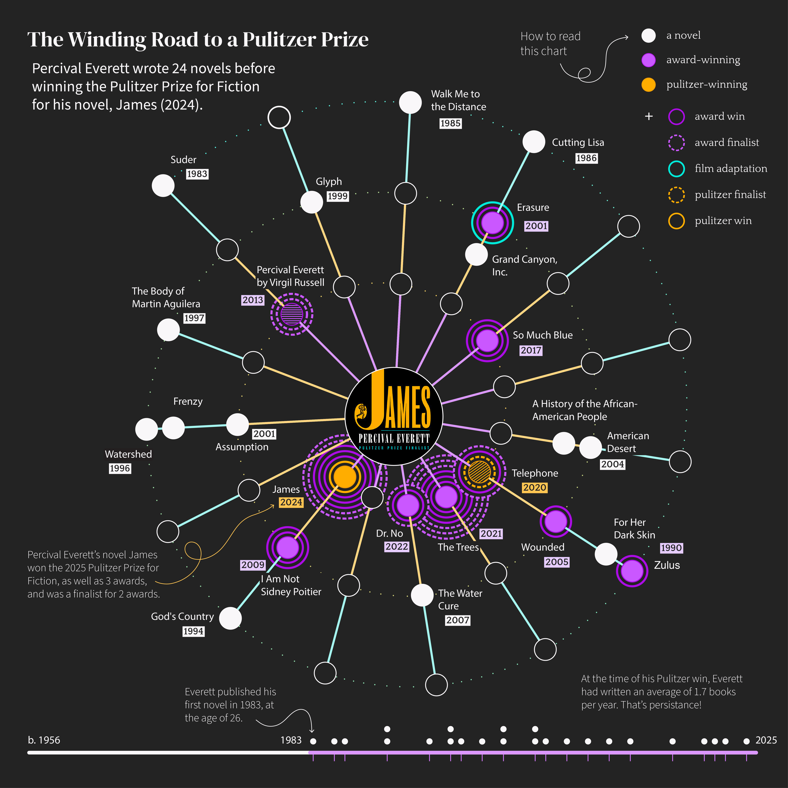

<head>
    <meta charset="UTF-8">
    <meta name="viewport" content="width=device-width, initial-scale=1.0">
    <!-- Open Graph Meta Tags for Link Previews -->
    <meta property="og:title" content="James: 2025 Pulitzer Prize for Fiction">
    <meta property="og:description" content="A data visualization of Percival Everett's novels.">
    <meta property="og:image" content="./images/webPreview2.jpg" />
    <meta property="og:url" content="https://awalmer.github.io/vis/pulitzer">
    <meta property="og:type" content="website">
    <!-- Google Fonts -->
    <link href="https://fonts.googleapis.com/css2?family=Quattrocento&display=swap" rel="stylesheet">
    <link href="https://fonts.googleapis.com/css2?family=DM+Serif+Display&display=swap" rel="stylesheet">
    <link href="https://fonts.googleapis.com/css?family=Source+Sans+Pro:400,700&display=swap" rel="stylesheet">
</head>

<h2>James: 2025 Pulitzer Prize for Fiction</h2>

The 2025 Pulitzer Prize for Fiction was awarded to Percival Everett for his novel, James (2024). This work is a reconsideration of Mark Twain's "Adventures of Huckleberry Finn" told from the perspective of the character Jim. Both poignant and satirical, it illustrates the power of language and injustices of racist social constructs. 📚

As Everett's 24th published novel, its accolades reflect a long-term persistence in his writing career. With each prolific decade, he received more literary recognition. 🏆

► Hover over the colored circles 🟣 to see literary recognition by novel.   (Note: this feature works best on desktop).

<!-- Load image that I want used for web preview, but take no action -->

<!-- Pulitzer SVG -->

<svg id="Pulitzer_Artboard" data-name="Pulitzer_Artboard" xmlns="http://www.w3.org/2000/svg" xmlns:xlink="http://www.w3.org/1999/xlink" viewBox="0 0 2600 2600">
    <defs>
    <pattern id="_10_lpi_30_2" data-name="10 lpi 30% 2" x="0" y="0" width="72" height="72" patternTransform="translate(1347.09 2933.6)" patternUnits="userSpaceOnUse" viewBox="0 0 72 72">
      <g>
        <rect class="cls-61" width="72" height="72"/>
        <rect class="cls-66" x="53.17" y="47.61" width="90.83" height="96.39"/>
        <rect class="cls-66" x="-18.83" y="47.61" width="90.83" height="96.39"/>
        <g>
          <rect class="cls-66" x="53.17" y="-24.39" width="90.83" height="96.39"/>
          <line class="cls-63" x1="71.75" y1="68.4" x2="144.25" y2="68.4"/>
          <line class="cls-63" x1="71.75" y1="54" x2="144.25" y2="54"/>
          <line class="cls-63" x1="71.75" y1="39.6" x2="144.25" y2="39.6"/>
          <line class="cls-63" x1="71.75" y1="25.2" x2="144.25" y2="25.2"/>
          <line class="cls-63" x1="71.75" y1="10.8" x2="144.25" y2="10.8"/>
          <line class="cls-63" x1="71.75" y1="61.2" x2="144.25" y2="61.2"/>
          <line class="cls-63" x1="71.75" y1="46.8" x2="144.25" y2="46.8"/>
          <line class="cls-63" x1="71.75" y1="32.4" x2="144.25" y2="32.4"/>
          <line class="cls-63" x1="71.75" y1="18" x2="144.25" y2="18"/>
          <line class="cls-63" x1="71.75" y1="3.6" x2="144.25" y2="3.6"/>
        </g>
        <g>
          <rect class="cls-66" x="-18.83" y="-24.39" width="90.83" height="96.39"/>
          <line class="cls-63" x1="-.25" y1="68.4" x2="72.25" y2="68.4"/>
          <line class="cls-63" x1="-.25" y1="54" x2="72.25" y2="54"/>
          <line class="cls-63" x1="-.25" y1="39.6" x2="72.25" y2="39.6"/>
          <line class="cls-63" x1="-.25" y1="25.2" x2="72.25" y2="25.2"/>
          <line class="cls-63" x1="-.25" y1="10.8" x2="72.25" y2="10.8"/>
          <line class="cls-63" x1="-.25" y1="61.2" x2="72.25" y2="61.2"/>
          <line class="cls-63" x1="-.25" y1="46.8" x2="72.25" y2="46.8"/>
          <line class="cls-63" x1="-.25" y1="32.4" x2="72.25" y2="32.4"/>
          <line class="cls-63" x1="-.25" y1="18" x2="72.25" y2="18"/>
          <line class="cls-63" x1="-.25" y1="3.6" x2="72.25" y2="3.6"/>
        </g>
        <g>
          <line class="cls-63" x1="-72.25" y1="68.4" x2=".25" y2="68.4"/>
          <line class="cls-63" x1="-72.25" y1="54" x2=".25" y2="54"/>
          <line class="cls-63" x1="-72.25" y1="39.6" x2=".25" y2="39.6"/>
          <line class="cls-63" x1="-72.25" y1="25.2" x2=".25" y2="25.2"/>
          <line class="cls-63" x1="-72.25" y1="10.8" x2=".25" y2="10.8"/>
          <line class="cls-63" x1="-72.25" y1="61.2" x2=".25" y2="61.2"/>
          <line class="cls-63" x1="-72.25" y1="46.8" x2=".25" y2="46.8"/>
          <line class="cls-63" x1="-72.25" y1="32.4" x2=".25" y2="32.4"/>
          <line class="cls-63" x1="-72.25" y1="18" x2=".25" y2="18"/>
          <line class="cls-63" x1="-72.25" y1="3.6" x2=".25" y2="3.6"/>
        </g>
      </g>
    </pattern>
    <pattern id="_10_lpi_30_" data-name="10 lpi 30%" x="0" y="0" width="72" height="72" patternTransform="translate(4148.27 -2600.21) rotate(-35.91)" patternUnits="userSpaceOnUse" viewBox="0 0 72 72">
      <g>
        <rect class="cls-61" width="72" height="72"/>
        <rect class="cls-66" x="53.17" y="47.61" width="90.83" height="96.39"/>
        <rect class="cls-66" x="-18.83" y="47.61" width="90.83" height="96.39"/>
        <g>
          <rect class="cls-66" x="53.17" y="-24.39" width="90.83" height="96.39"/>
          <line class="cls-64" x1="71.75" y1="68.4" x2="144.25" y2="68.4"/>
          <line class="cls-64" x1="71.75" y1="54" x2="144.25" y2="54"/>
          <line class="cls-64" x1="71.75" y1="39.6" x2="144.25" y2="39.6"/>
          <line class="cls-64" x1="71.75" y1="25.2" x2="144.25" y2="25.2"/>
          <line class="cls-64" x1="71.75" y1="10.8" x2="144.25" y2="10.8"/>
          <line class="cls-64" x1="71.75" y1="61.2" x2="144.25" y2="61.2"/>
          <line class="cls-64" x1="71.75" y1="46.8" x2="144.25" y2="46.8"/>
          <line class="cls-64" x1="71.75" y1="32.4" x2="144.25" y2="32.4"/>
          <line class="cls-64" x1="71.75" y1="18" x2="144.25" y2="18"/>
          <line class="cls-64" x1="71.75" y1="3.6" x2="144.25" y2="3.6"/>
        </g>
        <g>
          <rect class="cls-66" x="-18.83" y="-24.39" width="90.83" height="96.39"/>
          <line class="cls-64" x1="-.25" y1="68.4" x2="72.25" y2="68.4"/>
          <line class="cls-64" x1="-.25" y1="54" x2="72.25" y2="54"/>
          <line class="cls-64" x1="-.25" y1="39.6" x2="72.25" y2="39.6"/>
          <line class="cls-64" x1="-.25" y1="25.2" x2="72.25" y2="25.2"/>
          <line class="cls-64" x1="-.25" y1="10.8" x2="72.25" y2="10.8"/>
          <line class="cls-64" x1="-.25" y1="61.2" x2="72.25" y2="61.2"/>
          <line class="cls-64" x1="-.25" y1="46.8" x2="72.25" y2="46.8"/>
          <line class="cls-64" x1="-.25" y1="32.4" x2="72.25" y2="32.4"/>
          <line class="cls-64" x1="-.25" y1="18" x2="72.25" y2="18"/>
          <line class="cls-64" x1="-.25" y1="3.6" x2="72.25" y2="3.6"/>
        </g>
        <g>
          <line class="cls-64" x1="-72.25" y1="68.4" x2=".25" y2="68.4"/>
          <line class="cls-64" x1="-72.25" y1="54" x2=".25" y2="54"/>
          <line class="cls-64" x1="-72.25" y1="39.6" x2=".25" y2="39.6"/>
          <line class="cls-64" x1="-72.25" y1="25.2" x2=".25" y2="25.2"/>
          <line class="cls-64" x1="-72.25" y1="10.8" x2=".25" y2="10.8"/>
          <line class="cls-64" x1="-72.25" y1="61.2" x2=".25" y2="61.2"/>
          <line class="cls-64" x1="-72.25" y1="46.8" x2=".25" y2="46.8"/>
          <line class="cls-64" x1="-72.25" y1="32.4" x2=".25" y2="32.4"/>
          <line class="cls-64" x1="-72.25" y1="18" x2=".25" y2="18"/>
          <line class="cls-64" x1="-72.25" y1="3.6" x2=".25" y2="3.6"/>
        </g>
      </g>
    </pattern>
  </defs>
  <path id="spiral-timeline" class="cls-62" d="m1103.93,1573.26c67.48,86.26,268.92,132.96,446.43,14.35,97.01-64.82,131.67-159.97,125.89-311.62-7.16-141.57-169.37-309.08-315.77-338.95-135.51-32.83-255.9,3.14-372.41,77.7-224.63,138.27-243.02,469.41-119.39,695.17,209.92,383.34,802.4,312.93,1005.77-44.75,162.1-285.09,83.8-632.37-146.54-857.56-278.87-272.63-779.24-230.6-1054.84,88.04-203.28,235.02-223.46,489.25-167.92,727.67,89.39,383.78,468.48,710.19,956.4,640.19,811.17-116.38,1074.24-1129.53,491.66-1655.35-253.51-228.81-601.51-333.3-940.01-250.27-172.34,42.28-292.14,95.11-473.18,254.17"/>
  <g>
    <line class="cls-30" x1="566.2" y1="638.24" x2="567.97" y2="640"/>
    <line class="cls-43" x1="578.69" y1="650.72" x2="744.85" y2="816.88"/>
    <line class="cls-30" x1="750.21" y1="822.24" x2="751.98" y2="824.01"/>
  </g>
  <g>
    <line class="cls-30" x1="936.06" y1="421.37" x2="936.95" y2="423.71"/>
    <line class="cls-19" x1="942.39" y1="437.87" x2="1026.64" y2="657.36"/>
    <line class="cls-30" x1="1029.36" y1="664.44" x2="1030.26" y2="666.78"/>
  </g>
  <g>
    <line class="cls-30" x1="1353.93" y1="375" x2="1353.8" y2="377.49"/>
    <line class="cls-58" x1="1353" y1="392.64" x2="1340.69" y2="627.49"/>
    <line class="cls-30" x1="1340.3" y1="635.06" x2="1340.17" y2="637.56"/>
  </g>
  <g>
    <line class="cls-30" x1="1746.5" y1="500.44" x2="1745.37" y2="502.67"/>
    <line class="cls-27" x1="1738.47" y1="516.2" x2="1631.62" y2="725.9"/>
    <line class="cls-30" x1="1628.18" y1="732.67" x2="1627.04" y2="734.9"/>
  </g>
  <g>
    <line class="cls-30" x1="2047.65" y1="769.48" x2="2045.71" y2="771.05"/>
    <line class="cls-39" x1="2033.91" y1="780.61" x2="1851.01" y2="928.71"/>
    <line class="cls-30" x1="1845.11" y1="933.49" x2="1843.17" y2="935.06"/>
  </g>
  <g>
    <line class="cls-30" x1="2209.56" y1="1130.34" x2="2207.15" y2="1130.98"/>
    <line class="cls-11" x1="2192.51" y1="1134.91" x2="1965.57" y2="1195.71"/>
    <line class="cls-30" x1="1958.25" y1="1197.68" x2="1955.84" y2="1198.32"/>
  </g>
  <g>
    <line class="cls-30" x1="2210.26" y1="1517.55" x2="2207.79" y2="1517.16"/>
    <line class="cls-59" x1="2192.81" y1="1514.78" x2="1960.57" y2="1478"/>
    <line class="cls-30" x1="1953.08" y1="1476.81" x2="1950.61" y2="1476.42"/>
  </g>
  <g>
    <line class="cls-30" x1="2056.39" y1="1863.8" x2="2054.3" y2="1862.44"/>
    <line class="cls-53" x1="2041.57" y1="1854.18" x2="1844.38" y2="1726.12"/>
    <line class="cls-30" x1="1838.02" y1="1721.99" x2="1835.92" y2="1720.62"/>
  </g>
  <g>
    <line class="cls-30" x1="1780.87" y1="2111.66" x2="1779.51" y2="2109.56"/>
    <line class="cls-52" x1="1771.25" y1="2096.83" x2="1643.14" y2="1899.57"/>
    <line class="cls-30" x1="1639.01" y1="1893.2" x2="1637.65" y2="1891.11"/>
  </g>
  <g>
    <line class="cls-30" x1="1436.12" y1="2223.04" x2="1435.73" y2="2220.57"/>
    <line class="cls-56" x1="1433.36" y1="2205.59" x2="1396.59" y2="1973.44"/>
    <line class="cls-30" x1="1395.4" y1="1965.95" x2="1395.01" y2="1963.48"/>
  </g>
  <g>
    <line class="cls-30" x1="1084.18" y1="2185" x2="1084.83" y2="2182.59"/>
    <line class="cls-3" x1="1088.75" y1="2167.95" x2="1149.56" y2="1941.03"/>
    <line class="cls-30" x1="1151.52" y1="1933.71" x2="1152.16" y2="1931.29"/>
  </g>
  <g>
    <line class="cls-30" x1="785.55" y1="2010.89" x2="787.12" y2="2008.94"/>
    <line class="cls-38" x1="796.66" y1="1997.16" x2="944.59" y2="1814.49"/>
    <line class="cls-30" x1="949.36" y1="1808.59" x2="950.93" y2="1806.65"/>
  </g>
  <g>
    <line class="cls-30" x1="588.79" y1="1736.82" x2="591.01" y2="1735.68"/>
    <line class="cls-23" x1="604.54" y1="1728.79" x2="814.14" y2="1621.99"/>
    <line class="cls-30" x1="820.91" y1="1618.55" x2="823.13" y2="1617.41"/>
  </g>
  <g>
    <line class="cls-30" x1="480.41" y1="1418.28" x2="482.91" y2="1418.14"/>
    <line class="cls-5" x1="498.17" y1="1417.26" x2="775.39" y2="1401.26"/>
    <line class="cls-30" x1="783.02" y1="1400.82" x2="785.52" y2="1400.67"/>
  </g>
  <g>
    <line class="cls-30" x1="592.07" y1="1101.27" x2="594.4" y2="1102.16"/>
    <line class="cls-51" x1="608.57" y1="1107.6" x2="828.22" y2="1191.92"/>
    <line class="cls-30" x1="835.31" y1="1194.64" x2="837.64" y2="1195.53"/>
  </g>
  <g>
    <line class="cls-31" x1="778.33" y1="850.37" x2="780.1" y2="852.14"/>
    <line class="cls-49" x1="790.85" y1="862.89" x2="957.51" y2="1029.55"/>
    <line class="cls-31" x1="962.89" y1="1034.92" x2="964.66" y2="1036.69"/>
  </g>
  <g>
    <line class="cls-31" x1="1043.57" y1="701.45" x2="1044.46" y2="703.78"/>
    <line class="cls-44" x1="1049.9" y1="717.94" x2="1134.11" y2="937.31"/>
    <line class="cls-31" x1="1136.82" y1="944.39" x2="1137.72" y2="946.72"/>
  </g>
  <g>
    <line class="cls-31" x1="1338.23" y1="674.59" x2="1338.1" y2="677.08"/>
    <line class="cls-37" x1="1337.3" y1="692.23" x2="1325" y2="926.96"/>
    <line class="cls-31" x1="1324.6" y1="934.54" x2="1324.47" y2="937.03"/>
  </g>
  <g>
    <line class="cls-31" x1="1610.3" y1="767.74" x2="1609.17" y2="769.97"/>
    <line class="cls-8" x1="1602.28" y1="783.5" x2="1495.45" y2="993.16"/>
    <line class="cls-31" x1="1492" y1="999.92" x2="1490.87" y2="1002.15"/>
  </g>
  <g>
    <line class="cls-31" x1="1814.51" y1="958.28" x2="1812.56" y2="959.85"/>
    <line class="cls-36" x1="1800.76" y1="969.41" x2="1617.74" y2="1117.61"/>
    <line class="cls-31" x1="1611.84" y1="1122.39" x2="1609.9" y2="1123.97"/>
  </g>
  <g>
    <line class="cls-31" x1="1919.78" y1="1207.98" x2="1917.37" y2="1208.63"/>
    <line class="cls-55" x1="1902.73" y1="1212.55" x2="1675.78" y2="1273.36"/>
    <line class="cls-31" x1="1668.46" y1="1275.32" x2="1666.05" y2="1275.97"/>
  </g>
  <g>
    <line class="cls-31" x1="1913.96" y1="1470.62" x2="1911.49" y2="1470.23"/>
    <line class="cls-25" x1="1896.52" y1="1467.85" x2="1664.46" y2="1431.1"/>
    <line class="cls-31" x1="1656.98" y1="1429.91" x2="1654.51" y2="1429.52"/>
  </g>
  <g>
    <line class="cls-31" x1="1804.79" y1="1700.41" x2="1802.7" y2="1699.05"/>
    <line class="cls-1" x1="1789.96" y1="1690.78" x2="1592.51" y2="1562.55"/>
    <line class="cls-31" x1="1586.14" y1="1558.42" x2="1584.05" y2="1557.06"/>
  </g>
  <g>
    <line class="cls-31" x1="1617.48" y1="1860.06" x2="1616.12" y2="1857.96"/>
    <line class="cls-4" x1="1607.86" y1="1845.24" x2="1479.81" y2="1648.06"/>
    <line class="cls-31" x1="1475.68" y1="1641.7" x2="1474.32" y2="1639.61"/>
  </g>
  <g>
    <line class="cls-31" x1="1389.19" y1="1926.73" x2="1388.8" y2="1924.26"/>
    <line class="cls-20" x1="1386.43" y1="1909.29" x2="1349.67" y2="1677.16"/>
    <line class="cls-31" x1="1348.48" y1="1669.68" x2="1348.09" y2="1667.21"/>
  </g>
  <g>
    <line class="cls-31" x1="1161.83" y1="1895.23" x2="1162.48" y2="1892.81"/>
    <line class="cls-42" x1="1166.4" y1="1878.15" x2="1227.28" y2="1650.94"/>
    <line class="cls-31" x1="1229.25" y1="1643.61" x2="1229.9" y2="1641.2"/>
  </g>
  <g>
    <line class="cls-31" x1="974.34" y1="1777.74" x2="975.92" y2="1775.8"/>
    <line class="cls-2" x1="985.47" y1="1764" x2="1133.58" y2="1581.1"/>
    <line class="cls-31" x1="1138.36" y1="1575.2" x2="1139.93" y2="1573.26"/>
  </g>
  <g>
    <line class="cls-31" x1="856.09" y1="1600.62" x2="858.31" y2="1599.49"/>
    <line class="cls-12" x1="871.68" y1="1592.68" x2="1292.68" y2="1378.17"/>
    <line class="cls-31" x1="1299.36" y1="1374.76" x2="1301.59" y2="1373.63"/>
  </g>
  <g>
    <line class="cls-31" x1="822.25" y1="1398.75" x2="824.75" y2="1398.62"/>
    <line class="cls-12" x1="839.72" y1="1397.83" x2="1291.6" y2="1374.15"/>
    <line class="cls-31" x1="1299.09" y1="1373.76" x2="1301.59" y2="1373.63"/>
  </g>
  <g>
    <line class="cls-31" x1="872.14" y1="1208.78" x2="874.48" y2="1209.67"/>
    <line class="cls-12" x1="888.48" y1="1215.05" x2="1292.25" y2="1370.04"/>
    <line class="cls-31" x1="1299.26" y1="1372.73" x2="1301.59" y2="1373.63"/>
  </g>
  <g>
    <line class="cls-32" x1="990.46" y1="1062.5" x2="992.23" y2="1064.27"/>
    <line class="cls-16" x1="1002.84" y1="1074.87" x2="1294.52" y2="1366.56"/>
    <line class="cls-32" x1="1299.82" y1="1371.86" x2="1301.59" y2="1373.63"/>
  </g>
  <g>
    <line class="cls-32" x1="1151.08" y1="981.52" x2="1151.97" y2="983.86"/>
    <line class="cls-16" x1="1157.35" y1="997.86" x2="1298.01" y2="1364.29"/>
    <line class="cls-32" x1="1300.69" y1="1371.29" x2="1301.59" y2="1373.63"/>
  </g>
  <g>
    <line class="cls-32" x1="1322.53" y1="974.17" x2="1322.39" y2="976.67"/>
    <line class="cls-16" x1="1321.61" y1="991.65" x2="1302.11" y2="1363.64"/>
    <line class="cls-32" x1="1301.72" y1="1371.13" x2="1301.59" y2="1373.63"/>
  </g>
  <g>
    <line class="cls-32" x1="1474.11" y1="1035.04" x2="1472.97" y2="1037.27"/>
    <line class="cls-16" x1="1466.16" y1="1050.64" x2="1306.13" y2="1364.72"/>
    <line class="cls-32" x1="1302.73" y1="1371.4" x2="1301.59" y2="1373.63"/>
  </g>
  <g>
    <line class="cls-32" x1="1581.36" y1="1147.07" x2="1579.42" y2="1148.64"/>
    <line class="cls-16" x1="1567.76" y1="1158.08" x2="1309.36" y2="1367.33"/>
    <line class="cls-32" x1="1303.53" y1="1372.05" x2="1301.59" y2="1373.63"/>
  </g>
  <g>
    <line class="cls-32" x1="1630.01" y1="1285.63" x2="1627.59" y2="1286.28"/>
    <line class="cls-16" x1="1613.1" y1="1290.16" x2="1311.25" y2="1371.04"/>
    <line class="cls-32" x1="1304.01" y1="1372.98" x2="1301.59" y2="1373.63"/>
  </g>
  <g>
    <line class="cls-32" x1="1617.65" y1="1423.69" x2="1615.18" y2="1423.29"/>
    <line class="cls-16" x1="1600.37" y1="1420.95" x2="1311.47" y2="1375.19"/>
    <line class="cls-32" x1="1304.06" y1="1374.02" x2="1301.59" y2="1373.63"/>
  </g>
  <g>
    <line class="cls-32" x1="1553.19" y1="1537.02" x2="1551.1" y2="1535.66"/>
    <line class="cls-16" x1="1538.52" y1="1527.49" x2="1309.98" y2="1379.07"/>
    <line class="cls-32" x1="1303.69" y1="1374.99" x2="1301.59" y2="1373.63"/>
  </g>
  <g>
    <line class="cls-32" x1="1454.09" y1="1608.45" x2="1452.73" y2="1606.36"/>
    <line class="cls-16" x1="1444.56" y1="1593.78" x2="1307.04" y2="1382.01"/>
    <line class="cls-32" x1="1302.95" y1="1375.72" x2="1301.59" y2="1373.63"/>
  </g>
  <g>
    <line class="cls-32" x1="1342.26" y1="1630.43" x2="1341.87" y2="1627.96"/>
    <line class="cls-16" x1="1339.53" y1="1613.14" x2="1303.16" y2="1383.5"/>
    <line class="cls-32" x1="1301.98" y1="1376.1" x2="1301.59" y2="1373.63"/>
  </g>
  <circle id="_1990-1" data-name="1990-1" class="cls-35" cx="2087.71" cy="1884.14" r="50"/>
  <circle id="_2001-2-A" data-name="2001-2-A" class="cls-34" cx="1627.04" cy="734.9" r="67.5"/>
  <circle id="_2001-1" data-name="2001-1" class="cls-35" cx="1627.04" cy="734.9" r="50"/>
  <circle id="_2005-1" data-name="2005-1" class="cls-35" cx="1835.92" cy="1720.62" r="50"/>
  <circle id="_2009-2" data-name="2009-2" class="cls-35" cx="950.93" cy="1806.65" r="67.5"/>
  <circle id="_2009-1" data-name="2009-1" class="cls-35" cx="950.93" cy="1806.65" r="50"/>
  <g id="_2013-2" data-name="2013-2">
    <circle class="cls-66" cx="964.66" cy="1036.69" r="67.5"/>
    <circle class="cls-41" cx="964.66" cy="1036.69" r="67.5"/>
  </g>
  <circle id="_2013-1" data-name="2013-1" class="cls-57" cx="964.66" cy="1036.69" r="50"/>
  <circle id="_2017-2" data-name="2017-2" class="cls-35" cx="1609.9" cy="1123.97" r="67.5"/>
  <circle id="_2017-1" data-name="2017-1" class="cls-35" cx="1609.9" cy="1123.97" r="50"/>
  <g id="_2021-F-6" data-name="2021-F-6">
    <circle class="cls-66" cx="1474.32" cy="1639.61" r="137.5"/>
    <circle class="cls-17" cx="1474.32" cy="1639.61" r="137.5"/>
  </g>
  <g id="_2021-F-5" data-name="2021-F-5">
    <circle class="cls-66" cx="1474.32" cy="1639.61" r="120"/>
    <circle class="cls-40" cx="1474.32" cy="1639.61" r="120"/>
  </g>
  <g id="_2021-F-4" data-name="2021-F-4">
    <circle class="cls-66" cx="1474.32" cy="1639.61" r="102.5"/>
    <circle class="cls-24" cx="1474.32" cy="1639.61" r="102.5"/>
  </g>
  <circle id="_2021-3" data-name="2021-3" class="cls-35" cx="1474.32" cy="1639.61" r="85"/>
  <circle id="_2021-2" data-name="2021-2" class="cls-35" cx="1474.32" cy="1639.61" r="67.5"/>
  <circle id="_2021-1" data-name="2021-1" class="cls-35" cx="1474.32" cy="1639.61" r="50"/>
  <g id="_2020-3" data-name="2020-3">
    <circle class="cls-66" cx="1584.05" cy="1557.06" r="85"/>
    <circle class="cls-9" cx="1584.05" cy="1557.06" r="85"/>
  </g>
  <circle id="_2020-2" data-name="2020-2" class="cls-35" cx="1584.05" cy="1557.06" r="67.5"/>
  <g id="_2020-1" data-name="2020-1">
    <circle class="cls-66" cx="1584.05" cy="1557.06" r="50"/>
    <circle class="cls-28" cx="1584.05" cy="1557.06" r="50"/>
  </g>
  <g id="_2022-2" data-name="2022-2">
    <circle class="cls-66" cx="1348.09" cy="1667.21" r="67.5"/>
    <circle class="cls-41" cx="1348.09" cy="1667.21" r="67.5"/>
  </g>
  <circle id="_2022-1" data-name="2022-1" class="cls-35" cx="1348.09" cy="1667.21" r="50"/>
  <g id="_2021-F-6-2" data-name="2021-F-6">
    <circle class="cls-66" cx="1139.93" cy="1573.26" r="137.5"/>
    <circle class="cls-17" cx="1139.93" cy="1573.26" r="137.5"/>
  </g>
  <g id="_2024-F-5" data-name="2024-F-5">
    <circle class="cls-66" cx="1139.93" cy="1573.26" r="120"/>
    <circle class="cls-40" cx="1139.93" cy="1573.26" r="120"/>
  </g>
  <circle id="_2024-F-4" data-name="2024-F-4" class="cls-35" cx="1139.93" cy="1573.26" r="102.5"/>
  <circle id="_2024-3" data-name="2024-3" class="cls-35" cx="1139.93" cy="1573.26" r="85"/>
  <circle id="_2024-2" data-name="2024-2" class="cls-35" cx="1139.93" cy="1573.26" r="67.5"/>
  <circle id="_2024-1" data-name="2024-1" class="cls-33" cx="1139.93" cy="1573.26" r="50"/>
  <circle class="cls-6" cx="1301.59" cy="1373.63" r="161.63"/>
  <circle id="c-1983" class="cls-54" cx="540.01" cy="612.04" r="36"/>
  <circle id="c-1984" class="cls-47" cx="922.88" cy="387.05" r="36"/>
  <circle id="c-1985" class="cls-54" cx="1355.87" cy="337.85" r="36"/>
  <circle id="c-1986" class="cls-54" cx="1763.43" cy="467.22" r="36"/>
  <circle id="c-1987" class="cls-47" cx="2076.04" cy="746.49" r="36"/>
  <circle id="c-1988" class="cls-47" cx="2244.96" cy="1120.85" r="36"/>
  <circle id="c-1989" class="cls-47" cx="2246.3" cy="1523.25" r="36"/>
  <circle id="c-1990" class="cls-48 tooltip_circle" cx="2087.71" cy="1884.14" r="36" tooltip='Zulus (1990) \n <b>🏆 Winner:</b> New American Writing Award'/>
  <circle id="c-1990-2" class="cls-54" cx="2020.99" cy="1968.38" r="36"/>
  <circle id="c-1991" class="cls-47" cx="1801.08" cy="2142.77" r="36"/>
  <circle id="c-1992" class="cls-47" cx="1441.91" cy="2259.6" r="36"/>
  <circle id="c-1993" class="cls-47" cx="1074.65" cy="2220.58" r="36"/>
  <circle id="c-1994" class="cls-54" cx="762.04" cy="2039.92" r="36"/>
  <circle id="c-1995" class="cls-47" cx="555.65" cy="1753.7" r="36"/>
  <circle id="c-1996" class="cls-54" cx="484.07" cy="1507.15" r="36"/>
  <circle id="c-1996-2" class="cls-54" cx="476.53" cy="1419.12" r="36"/>
  <circle id="c-1997" class="cls-54" cx="557.49" cy="1087.99" r="36"/>
  <circle id="c-1998" class="cls-47" cx="751.98" cy="824.01" r="36"/>
  <circle id="c-1999" class="cls-54" cx="1030.26" cy="666.78" r="36"/>
  <circle id="c-2000" class="cls-47" cx="1340.17" cy="637.56" r="36"/>
  <circle id="c-2001" class="cls-48 tooltip_circle" cx="1627.04" cy="734.9" r="36" tooltip='Erasure (2001) \n <b>🏆 Winner:</b> Hurston/Wright Legacy Award \n <b> 🎞 Film Adaptation:</b> American Fiction'/>
  <circle id="c-2001-2" class="cls-54" cx="1727.22" cy="802.85" r="36"/>
  <circle id="c-2002" class="cls-47" cx="1840.17" cy="937.06" r="36"/>
  <circle id="c-2003" class="cls-47" cx="1946.84" cy="1198.32" r="36"/>
  <circle id="c-2004" class="cls-54" cx="1950.61" cy="1476.42" r="36"/>
  <circle id="c-2004-2" class="cls-54" cx="1919.7" cy="1560.7" r="36"/>
  <circle id="c-2005" class="cls-48 tooltip_circle" cx="1835.92" cy="1720.62" r="36" tooltip='Wounded (2005) \n <b>🏆 Winner:</b> PEN Center USA Award for Fiction'/>
  <circle id="c-2006" class="cls-47" cx="1637.65" cy="1891.11" r="36"/>
  <circle id="c-2007" class="cls-54" cx="1395.01" cy="1963.48" r="36"/>
  <circle id="c-2008" class="cls-47" cx="1152.16" cy="1931.29" r="36"/>
  <circle id="c-2009" class="cls-48 tooltip_circle" cx="950.93" cy="1806.65" r="36" tooltip='I Am Not Sidney Poitier (2009) \n <b>🏆 Winner:</b> Hurston/Wright Legacy Award for Fiction \n <b>🏆 Winner:</b> Believer Book Award'/>
  <circle id="c-2010" class="cls-47" cx="823.13" cy="1617.41" r="36"/>
  <circle id="c-2011" class="cls-54" cx="791.31" cy="1400.32" r="36"/>
  <circle id="c-2012" class="cls-47" cx="837.64" cy="1195.53" r="36"/>
  <circle id="c-2013" class="cls-22 tooltip_circle" cx="964.66" cy="1036.69" r="36" tooltip='Assumption (2013) \n <b>🏅 Finalist:</b> PEN / Faulkner Award for Fiction \n <b>🏅 Finalist:</b> Los Angeles Times Book Prize'/>
  <circle id="c-2014" class="cls-47" cx="1137.72" cy="946.72" r="36"/>
  <circle id="c-2015" class="cls-47" cx="1324.47" cy="937.03" r="36"/>
  <circle id="c-2016" class="cls-47" cx="1490.87" cy="1002.15" r="36"/>
  <circle id="c-2017" class="cls-48 tooltip_circle" cx="1609.9" cy="1123.97" r="36" tooltip='So Much Blue (2017) \n <b>🏆 Winner:</b> PEN Oakland (Josephine Miles) Award \n <b>🏆 Winner:</b> California Book Awards (Silver Medal) for Fiction'/>
  <circle id="c-2018" class="cls-47" cx="1676.68" cy="1271.14" r="36"/>
  <circle id="c-2019" class="cls-47" cx="1663.21" cy="1425.66" r="36"/>
  <circle id="c-2020" class="cls-10 tooltip_circle" cx="1584.05" cy="1557.06" r="36" tooltip='Telephone (2020) \n <b>🏆 Winner:</b>  Hurston/Wright Legacy Award for Fiction \n <b>✨ Finalist:</b> Pulitzer Prize for Fiction \n <b>🏅 Finalist:</b> CLMP Firecracker Award'/>
  <circle id="c-2021" class="cls-48 tooltip_circle" cx="1474.32" cy="1639.61" r="36" tooltip='The Trees (2021) \n <b>🏆 Winner:</b> Anisfield-Wolf Book Award \n <b>🏆 Winner:</b> Bollinger Everyman Wodehouse Prize \n <b>🏆 Winner:</b> Hurston/Wright Legacy Award \n <b>🏅 Finalist:</b> CLMP Firecracker Award \n <b>🏅 Finalist:</b> Joyce Carol Oates Literary Prize \n <b>🏅 Finalist:</b> Maya Angelou Book Award'/>
  <circle id="c-2022" class="cls-48 tooltip_circle" cx="1348.09" cy="1667.21" r="36" tooltip='Dr. No (2022) \n <b>🏆 Winner:</b> PEN/ Jean Stein Book Award \n <b>🏅 Finalist:</b> NBCC (National Book Critics Circle) Award for Fiction'/>
  <circle id="c-2023" class="cls-47" cx="1229.9" cy="1641.2" r="36"/>
  <circle id="c-2024" class="cls-50 tooltip_circle" cx="1139.93" cy="1573.26" r="36" tooltip='James (2024) \n <b>🌟 Winner:</b> Pulitzer Prize for Fiction \n <b>🏆 Winner:</b> National Book Award \n <b>🏆 Winner:</b>California Book Award \n <b>🏆 Winner:</b> Kirkus Prize for Fiction \n <b>🏅 Finalist:</b> PEN/Faulkner Award for Fiction \n <b>🏅 Finalist:</b> Aspen Words Literary Prize'/>
  <g>
    <rect class="cls-66" x="552.5" y="510.17" width="93.26" height="42.05" rx="7" ry="7"/>
    <g>
      <path class="cls-65" d="m558.74,537.76c1.37.84,3.36,1.54,5.46,1.54,3.12,0,4.94-1.64,4.94-4.03,0-2.21-1.26-3.46-4.45-4.69-3.85-1.37-6.23-3.36-6.23-6.69,0-3.67,3.05-6.41,7.63-6.41,2.42,0,4.17.56,5.22,1.16l-.84,2.49c-.77-.42-2.35-1.12-4.48-1.12-3.22,0-4.45,1.92-4.45,3.54,0,2.21,1.44,3.29,4.69,4.55,3.99,1.54,6.02,3.47,6.02,6.93,0,3.64-2.7,6.79-8.26,6.79-2.27,0-4.76-.67-6.02-1.5l.77-2.56Z"/>
      <path class="cls-65" d="m590.49,536.85c0,1.75.04,3.29.14,4.62h-2.73l-.17-2.77h-.07c-.81,1.37-2.59,3.15-5.6,3.15-2.66,0-5.85-1.47-5.85-7.42v-9.91h3.08v9.38c0,3.22.98,5.39,3.78,5.39,2.06,0,3.5-1.43,4.06-2.8.18-.46.28-1.02.28-1.58v-10.4h3.08v12.32Z"/>
      <path class="cls-65" d="m610.23,516.61v20.48c0,1.51.04,3.22.14,4.38h-2.77l-.14-2.94h-.07c-.95,1.89-3.01,3.33-5.78,3.33-4.1,0-7.25-3.47-7.25-8.61-.04-5.63,3.46-9.1,7.6-9.1,2.59,0,4.34,1.23,5.11,2.59h.07v-10.12h3.08Zm-3.08,14.81c0-.39-.04-.91-.14-1.3-.46-1.96-2.14-3.57-4.45-3.57-3.19,0-5.08,2.8-5.08,6.55,0,3.43,1.68,6.27,5.01,6.27,2.06,0,3.96-1.37,4.52-3.67.1-.42.14-.84.14-1.33v-2.94Z"/>
      <path class="cls-65" d="m617.05,533.56c.07,4.17,2.73,5.88,5.81,5.88,2.21,0,3.54-.38,4.69-.88l.53,2.21c-1.08.49-2.94,1.05-5.64,1.05-5.22,0-8.33-3.43-8.33-8.54s3.01-9.14,7.95-9.14c5.53,0,7,4.87,7,7.98,0,.63-.07,1.12-.1,1.44h-11.9Zm9.03-2.21c.04-1.96-.81-5.01-4.27-5.01-3.12,0-4.48,2.87-4.73,5.01h9Z"/>
      <path class="cls-65" d="m632.87,529.81c0-2-.03-3.71-.14-5.29h2.7l.1,3.33h.14c.77-2.28,2.62-3.71,4.69-3.71.35,0,.59.04.88.11v2.91c-.31-.07-.63-.11-1.05-.11-2.17,0-3.71,1.65-4.13,3.96-.07.42-.14.91-.14,1.44v9.03h-3.05v-11.66Z"/>
    </g>
  </g>
  <g>
    <rect class="cls-66" x="1420.22" y="289.59" width="194.47" height="84.05" rx="7" ry="7"/>
    <g>
      <path class="cls-65" d="m1430.73,320.89l-5.99-23.59h3.22l2.8,11.94c.7,2.94,1.33,5.88,1.75,8.16h.07c.38-2.35,1.12-5.15,1.92-8.19l3.15-11.9h3.19l2.87,11.97c.67,2.8,1.29,5.6,1.65,8.09h.07c.49-2.59,1.16-5.22,1.89-8.16l3.12-11.9h3.12l-6.69,23.59h-3.19l-2.98-12.29c-.73-3.01-1.23-5.32-1.54-7.7h-.07c-.42,2.35-.94,4.66-1.82,7.7l-3.36,12.29h-3.19Z"/>
      <path class="cls-65" d="m1464.61,320.89l-.25-2.14h-.1c-.94,1.33-2.77,2.52-5.18,2.52-3.43,0-5.18-2.42-5.18-4.87,0-4.1,3.64-6.34,10.19-6.3v-.35c0-1.4-.38-3.92-3.85-3.92-1.58,0-3.22.49-4.41,1.26l-.7-2.03c1.4-.91,3.43-1.5,5.57-1.5,5.18,0,6.44,3.54,6.44,6.93v6.34c0,1.47.07,2.91.28,4.06h-2.8Zm-.46-8.65c-3.36-.07-7.18.53-7.18,3.82,0,2,1.33,2.94,2.91,2.94,2.21,0,3.61-1.4,4.1-2.84.1-.31.17-.67.17-.98v-2.94Z"/>
      <path class="cls-65" d="m1472.1,296.03h3.08v24.85h-3.08v-24.85Z"/>
      <path class="cls-65" d="m1483.41,311.72h.07c.42-.6,1.01-1.33,1.5-1.93l4.97-5.85h3.71l-6.55,6.97,7.46,9.98h-3.75l-5.85-8.12-1.58,1.75v6.37h-3.05v-24.85h3.05v15.68Z"/>
      <path class="cls-65" d="m1524.18,310.53c-.17-3.29-.39-7.25-.35-10.19h-.1c-.81,2.77-1.79,5.71-2.98,8.96l-4.17,11.45h-2.31l-3.82-11.24c-1.12-3.33-2.07-6.37-2.73-9.17h-.07c-.07,2.94-.24,6.9-.45,10.43l-.63,10.12h-2.91l1.65-23.59h3.89l4.03,11.41c.98,2.91,1.79,5.5,2.38,7.95h.11c.59-2.38,1.43-4.97,2.48-7.95l4.2-11.41h3.89l1.47,23.59h-2.98l-.59-10.36Z"/>
      <path class="cls-65" d="m1534.26,312.98c.07,4.17,2.73,5.88,5.81,5.88,2.21,0,3.54-.38,4.69-.88l.53,2.21c-1.09.49-2.94,1.05-5.64,1.05-5.22,0-8.33-3.43-8.33-8.54s3.01-9.14,7.95-9.14c5.53,0,7,4.87,7,7.98,0,.63-.07,1.12-.1,1.44h-11.9Zm9.03-2.21c.04-1.96-.81-5.01-4.27-5.01-3.12,0-4.48,2.87-4.73,5.01h9Z"/>
      <path class="cls-65" d="m1561.21,299.08v4.87h4.41v2.35h-4.41v9.14c0,2.1.6,3.29,2.31,3.29.81,0,1.4-.1,1.79-.21l.14,2.31c-.6.24-1.54.42-2.73.42-1.44,0-2.59-.46-3.33-1.3-.88-.91-1.19-2.42-1.19-4.41v-9.24h-2.63v-2.35h2.63v-4.06l3.01-.8Z"/>
      <path class="cls-65" d="m1584.21,312.28c0,6.27-4.34,9-8.44,9-4.59,0-8.12-3.36-8.12-8.72,0-5.67,3.71-9,8.4-9s8.16,3.54,8.16,8.72Zm-13.44.17c0,3.71,2.14,6.51,5.15,6.51s5.15-2.77,5.15-6.58c0-2.87-1.44-6.51-5.08-6.51s-5.22,3.36-5.22,6.58Z"/>
      <path class="cls-65" d="m1430.49,341.08v4.87h4.41v2.35h-4.41v9.14c0,2.1.6,3.29,2.31,3.29.8,0,1.4-.1,1.79-.21l.14,2.31c-.59.24-1.54.42-2.73.42-1.43,0-2.59-.46-3.33-1.3-.88-.91-1.19-2.42-1.19-4.41v-9.24h-2.63v-2.35h2.63v-4.06l3.01-.8Z"/>
      <path class="cls-65" d="m1438.36,338.03h3.08v10.57h.07c.49-.88,1.26-1.65,2.21-2.17.91-.52,2-.88,3.15-.88,2.27,0,5.92,1.4,5.92,7.25v10.08h-3.08v-9.73c0-2.73-1.02-5.04-3.92-5.04-2,0-3.57,1.4-4.13,3.08-.18.42-.21.88-.21,1.47v10.22h-3.08v-24.85Z"/>
      <path class="cls-65" d="m1459.5,354.98c.07,4.17,2.73,5.88,5.81,5.88,2.21,0,3.54-.38,4.69-.88l.52,2.21c-1.09.49-2.94,1.05-5.64,1.05-5.22,0-8.33-3.43-8.33-8.54s3.01-9.14,7.95-9.14c5.53,0,7,4.87,7,7.98,0,.63-.07,1.12-.1,1.44h-11.9Zm9.03-2.21c.03-1.96-.81-5.01-4.27-5.01-3.12,0-4.48,2.87-4.73,5.01h9Z"/>
      <path class="cls-65" d="m1482.85,339.61c1.86-.28,4.06-.49,6.48-.49,4.38,0,7.49,1.02,9.56,2.94,2.1,1.93,3.33,4.66,3.33,8.47s-1.19,7-3.4,9.17c-2.21,2.21-5.85,3.4-10.43,3.4-2.17,0-3.99-.1-5.53-.28v-23.21Zm3.05,20.86c.77.14,1.89.17,3.08.17,6.51,0,10.05-3.64,10.05-10.01.04-5.57-3.12-9.1-9.56-9.1-1.58,0-2.77.14-3.57.31v18.62Z"/>
      <path class="cls-65" d="m1509.48,341.19c.04,1.05-.73,1.89-1.96,1.89-1.08,0-1.86-.84-1.86-1.89s.81-1.93,1.93-1.93,1.89.84,1.89,1.93Zm-3.43,21.7v-16.94h3.08v16.94h-3.08Z"/>
      <path class="cls-65" d="m1513.82,359.74c.91.6,2.52,1.23,4.06,1.23,2.24,0,3.29-1.12,3.29-2.52,0-1.47-.88-2.28-3.15-3.12-3.05-1.08-4.48-2.77-4.48-4.8,0-2.73,2.21-4.97,5.85-4.97,1.71,0,3.22.49,4.17,1.05l-.77,2.24c-.67-.42-1.89-.98-3.47-.98-1.82,0-2.83,1.05-2.83,2.31,0,1.4,1.01,2.03,3.22,2.87,2.94,1.12,4.45,2.59,4.45,5.11,0,2.98-2.31,5.08-6.34,5.08-1.86,0-3.57-.46-4.76-1.16l.77-2.35Z"/>
      <path class="cls-65" d="m1531.81,341.08v4.87h4.41v2.35h-4.41v9.14c0,2.1.59,3.29,2.31,3.29.81,0,1.4-.1,1.79-.21l.14,2.31c-.6.24-1.54.42-2.73.42-1.44,0-2.59-.46-3.33-1.3-.88-.91-1.19-2.42-1.19-4.41v-9.24h-2.62v-2.35h2.62v-4.06l3.01-.8Z"/>
      <path class="cls-65" d="m1549.07,362.89l-.25-2.14h-.1c-.95,1.33-2.77,2.52-5.18,2.52-3.43,0-5.18-2.42-5.18-4.87,0-4.1,3.64-6.34,10.19-6.3v-.35c0-1.4-.39-3.92-3.85-3.92-1.58,0-3.22.49-4.41,1.26l-.7-2.03c1.4-.91,3.43-1.5,5.57-1.5,5.18,0,6.44,3.54,6.44,6.93v6.34c0,1.47.07,2.91.28,4.06h-2.8Zm-.46-8.65c-3.36-.07-7.18.53-7.18,3.82,0,2,1.33,2.94,2.91,2.94,2.21,0,3.61-1.4,4.1-2.84.1-.31.17-.67.17-.98v-2.94Z"/>
      <path class="cls-65" d="m1556.55,350.53c0-1.75-.04-3.19-.14-4.59h2.73l.18,2.8h.07c.84-1.61,2.8-3.19,5.6-3.19,2.35,0,5.99,1.4,5.99,7.21v10.12h-3.08v-9.77c0-2.73-1.01-5.01-3.92-5.01-2.03,0-3.61,1.44-4.13,3.15-.14.38-.21.91-.21,1.44v10.19h-3.08v-12.36Z"/>
      <path class="cls-65" d="m1588.06,362.26c-.81.42-2.59.98-4.87.98-5.11,0-8.44-3.47-8.44-8.65s3.57-9,9.1-9c1.82,0,3.43.46,4.27.88l-.7,2.38c-.74-.42-1.89-.8-3.57-.8-3.89,0-5.99,2.87-5.99,6.41,0,3.92,2.52,6.34,5.88,6.34,1.75,0,2.91-.46,3.78-.84l.53,2.31Z"/>
      <path class="cls-65" d="m1593.16,354.98c.07,4.17,2.73,5.88,5.81,5.88,2.21,0,3.54-.38,4.69-.88l.52,2.21c-1.08.49-2.94,1.05-5.64,1.05-5.22,0-8.33-3.43-8.33-8.54s3.01-9.14,7.95-9.14c5.53,0,7,4.87,7,7.98,0,.63-.07,1.12-.11,1.44h-11.9Zm9.03-2.21c.04-1.96-.8-5.01-4.27-5.01-3.12,0-4.48,2.87-4.73,5.01h9Z"/>
    </g>
  </g>
  <g>
    <path class="cls-65" d="m1834.95,436.96c-1.12.56-3.36,1.12-6.23,1.12-6.65,0-11.66-4.2-11.66-11.94s5.01-12.39,12.32-12.39c2.94,0,4.8.63,5.6,1.05l-.73,2.49c-1.16-.56-2.8-.98-4.76-.98-5.53,0-9.21,3.54-9.21,9.73,0,5.78,3.33,9.49,9.07,9.49,1.85,0,3.75-.39,4.97-.98l.63,2.42Z"/>
    <path class="cls-65" d="m1852.42,433.11c0,1.75.04,3.29.14,4.62h-2.73l-.17-2.77h-.07c-.81,1.37-2.59,3.15-5.6,3.15-2.66,0-5.85-1.47-5.85-7.42v-9.91h3.08v9.38c0,3.22.98,5.39,3.78,5.39,2.06,0,3.5-1.44,4.06-2.8.18-.46.28-1.02.28-1.58v-10.4h3.08v12.32Z"/>
    <path class="cls-65" d="m1861.24,415.92v4.87h4.41v2.35h-4.41v9.14c0,2.1.6,3.29,2.31,3.29.81,0,1.4-.1,1.79-.21l.14,2.31c-.6.24-1.54.42-2.73.42-1.44,0-2.59-.46-3.33-1.3-.88-.91-1.19-2.42-1.19-4.41v-9.24h-2.62v-2.35h2.62v-4.06l3.01-.8Z"/>
    <path class="cls-65" d="m1872.82,415.92v4.87h4.41v2.35h-4.41v9.14c0,2.1.6,3.29,2.31,3.29.81,0,1.4-.1,1.79-.21l.14,2.31c-.6.24-1.54.42-2.73.42-1.44,0-2.59-.46-3.33-1.3-.88-.91-1.19-2.42-1.19-4.41v-9.24h-2.63v-2.35h2.63v-4.06l3.01-.8Z"/>
    <path class="cls-65" d="m1884.13,416.03c.04,1.05-.73,1.89-1.96,1.89-1.08,0-1.85-.84-1.85-1.89s.81-1.93,1.93-1.93,1.89.84,1.89,1.93Zm-3.43,21.7v-16.94h3.08v16.94h-3.08Z"/>
    <path class="cls-65" d="m1888.89,425.37c0-1.75-.04-3.19-.14-4.59h2.73l.18,2.8h.07c.84-1.61,2.8-3.19,5.6-3.19,2.35,0,5.99,1.4,5.99,7.21v10.12h-3.08v-9.77c0-2.73-1.02-5.01-3.92-5.01-2.03,0-3.61,1.44-4.13,3.15-.14.38-.21.91-.21,1.44v10.19h-3.08v-12.36Z"/>
    <path class="cls-65" d="m1922.91,420.79c-.07,1.23-.14,2.59-.14,4.66v9.84c0,3.89-.77,6.27-2.42,7.74-1.64,1.54-4.03,2.03-6.16,2.03s-4.27-.49-5.64-1.4l.77-2.35c1.12.7,2.87,1.33,4.97,1.33,3.15,0,5.46-1.65,5.46-5.92v-1.89h-.07c-.94,1.58-2.76,2.84-5.39,2.84-4.2,0-7.21-3.57-7.21-8.26,0-5.74,3.75-9,7.63-9,2.94,0,4.55,1.54,5.29,2.94h.07l.14-2.56h2.7Zm-3.19,6.69c0-.53-.04-.98-.17-1.4-.56-1.79-2.07-3.26-4.31-3.26-2.94,0-5.04,2.49-5.04,6.41,0,3.33,1.68,6.09,5,6.09,1.89,0,3.61-1.19,4.27-3.15.18-.53.25-1.12.25-1.65v-3.04Z"/>
    <path class="cls-65" d="m1935.4,414.14h3.05v21.04h10.08v2.56h-13.13v-23.59Z"/>
    <path class="cls-65" d="m1955.25,416.03c.04,1.05-.73,1.89-1.96,1.89-1.08,0-1.85-.84-1.85-1.89s.81-1.93,1.93-1.93,1.89.84,1.89,1.93Zm-3.43,21.7v-16.94h3.08v16.94h-3.08Z"/>
    <path class="cls-65" d="m1959.58,434.58c.91.6,2.52,1.23,4.06,1.23,2.24,0,3.29-1.12,3.29-2.52,0-1.47-.88-2.28-3.15-3.12-3.05-1.08-4.48-2.77-4.48-4.8,0-2.73,2.21-4.97,5.85-4.97,1.72,0,3.22.49,4.17,1.05l-.77,2.24c-.67-.42-1.89-.98-3.46-.98-1.82,0-2.84,1.05-2.84,2.31,0,1.4,1.02,2.03,3.22,2.87,2.94,1.12,4.45,2.59,4.45,5.11,0,2.98-2.31,5.08-6.34,5.08-1.85,0-3.57-.46-4.76-1.16l.77-2.35Z"/>
    <path class="cls-65" d="m1983.25,437.73l-.25-2.14h-.1c-.94,1.33-2.77,2.52-5.18,2.52-3.43,0-5.18-2.42-5.18-4.87,0-4.1,3.64-6.34,10.19-6.3v-.35c0-1.4-.38-3.92-3.85-3.92-1.58,0-3.22.49-4.41,1.26l-.7-2.03c1.4-.91,3.43-1.5,5.57-1.5,5.18,0,6.44,3.54,6.44,6.93v6.34c0,1.47.07,2.91.28,4.06h-2.8Zm-.46-8.65c-3.36-.07-7.18.53-7.18,3.82,0,2,1.33,2.94,2.91,2.94,2.21,0,3.61-1.4,4.1-2.84.1-.31.17-.67.17-.98v-2.94Z"/>
  </g>
  <g>
    <path class="cls-65" d="m2183.76,1945.39l15.44-19.29h-14.31v-2.99h18.7v2.92l-15.53,19.19h15.53v2.99h-19.82v-2.82Z"/>
    <path class="cls-65" d="m2209.67,1929.91v12.15c0,.93.14,1.7.43,2.29.53,1.09,1.53,1.64,2.98,1.64,2.09,0,3.51-.96,4.26-2.87.41-1.03.62-2.43.62-4.22v-8.99h3.08v18.3h-2.91l.03-2.7c-.39.7-.88,1.28-1.46,1.76-1.15.96-2.55,1.44-4.19,1.44-2.56,0-4.3-.87-5.23-2.61-.5-.93-.75-2.18-.75-3.74v-12.44h3.14Z"/>
    <path class="cls-65" d="m2226.14,1923.11h3.08v25.1h-3.08v-25.1Z"/>
    <path class="cls-65" d="m2236.91,1929.91v12.15c0,.93.14,1.7.43,2.29.53,1.09,1.53,1.64,2.98,1.64,2.09,0,3.51-.96,4.26-2.87.41-1.03.62-2.43.62-4.22v-8.99h3.08v18.3h-2.91l.03-2.7c-.39.7-.88,1.28-1.46,1.76-1.15.96-2.55,1.44-4.19,1.44-2.56,0-4.3-.87-5.23-2.61-.5-.93-.75-2.18-.75-3.74v-12.44h3.14Z"/>
    <path class="cls-65" d="m2255.13,1942.47c.09,1.03.35,1.81.79,2.36.79.99,2.16,1.49,4.12,1.49,1.16,0,2.19-.25,3.07-.74.88-.5,1.33-1.26,1.33-2.3,0-.79-.35-1.38-1.06-1.79-.45-.25-1.34-.54-2.67-.87l-2.48-.62c-1.59-.39-2.76-.82-3.51-1.3-1.34-.83-2.01-1.98-2.01-3.45,0-1.73.63-3.13,1.9-4.2,1.26-1.07,2.96-1.61,5.1-1.61,2.79,0,4.81.81,6.04,2.43.77,1.03,1.15,2.13,1.13,3.32h-2.91c-.06-.69-.31-1.32-.75-1.89-.72-.8-1.98-1.21-3.76-1.21-1.19,0-2.09.22-2.7.66s-.92,1.03-.92,1.75c0,.79.4,1.43,1.21,1.91.46.28,1.15.53,2.05.75l2.07.5c2.25.54,3.76,1.05,4.53,1.56,1.2.79,1.79,2.02,1.79,3.71s-.63,3.04-1.88,4.22c-1.25,1.18-3.16,1.78-5.72,1.78-2.76,0-4.71-.62-5.86-1.85-1.15-1.24-1.76-2.77-1.84-4.59h2.96Z"/>
  </g>
  <g>
    <rect class="cls-66" x="1823.23" y="1931.02" width="148.75" height="84.05" rx="7" ry="7"/>
    <g>
      <path class="cls-65" d="m1829.89,1938.72h12.71v2.56h-9.66v7.84h8.93v2.52h-8.93v10.68h-3.04v-23.59Z"/>
      <path class="cls-65" d="m1861.08,1953.7c0,6.27-4.34,9-8.44,9-4.59,0-8.12-3.36-8.12-8.72,0-5.67,3.71-9,8.4-9s8.16,3.54,8.16,8.72Zm-13.44.17c0,3.71,2.14,6.51,5.15,6.51s5.15-2.77,5.15-6.58c0-2.87-1.44-6.51-5.08-6.51s-5.22,3.36-5.22,6.58Z"/>
      <path class="cls-65" d="m1864.96,1950.66c0-2-.03-3.71-.14-5.29h2.7l.11,3.33h.14c.77-2.28,2.63-3.71,4.69-3.71.35,0,.6.03.88.1v2.91c-.31-.07-.63-.1-1.05-.1-2.17,0-3.71,1.65-4.13,3.96-.07.42-.14.91-.14,1.44v9.03h-3.05v-11.66Z"/>
      <path class="cls-65" d="m1886.98,1938.72v9.87h11.41v-9.87h3.08v23.59h-3.08v-11.06h-11.41v11.06h-3.05v-23.59h3.05Z"/>
      <path class="cls-65" d="m1908.36,1954.4c.07,4.17,2.73,5.88,5.81,5.88,2.21,0,3.54-.38,4.69-.88l.52,2.21c-1.09.49-2.94,1.05-5.64,1.05-5.22,0-8.33-3.43-8.33-8.54s3.01-9.14,7.95-9.14c5.53,0,7,4.87,7,7.98,0,.63-.07,1.12-.1,1.44h-11.9Zm9.03-2.21c.03-1.96-.81-5.01-4.27-5.01-3.12,0-4.48,2.87-4.73,5.01h9Z"/>
      <path class="cls-65" d="m1924.18,1950.66c0-2-.04-3.71-.14-5.29h2.7l.1,3.33h.14c.77-2.28,2.63-3.71,4.69-3.71.35,0,.6.03.88.1v2.91c-.31-.07-.63-.1-1.05-.1-2.17,0-3.71,1.65-4.13,3.96-.07.42-.14.91-.14,1.44v9.03h-3.04v-11.66Z"/>
      <path class="cls-65" d="m1829.89,1981.04c1.85-.28,4.06-.49,6.48-.49,4.38,0,7.49,1.02,9.56,2.94,2.1,1.93,3.33,4.66,3.33,8.47s-1.19,7-3.4,9.17c-2.21,2.21-5.85,3.4-10.43,3.4-2.17,0-3.99-.1-5.53-.28v-23.21Zm3.04,20.86c.77.14,1.89.17,3.08.17,6.51,0,10.05-3.64,10.05-10.01.03-5.57-3.12-9.1-9.56-9.1-1.57,0-2.76.14-3.57.31v18.62Z"/>
      <path class="cls-65" d="m1862.48,2004.31l-.25-2.14h-.1c-.95,1.33-2.77,2.52-5.18,2.52-3.43,0-5.18-2.42-5.18-4.87,0-4.1,3.64-6.34,10.19-6.3v-.35c0-1.4-.39-3.92-3.85-3.92-1.58,0-3.22.49-4.41,1.26l-.7-2.03c1.4-.91,3.43-1.5,5.57-1.5,5.18,0,6.44,3.54,6.44,6.93v6.34c0,1.47.07,2.91.28,4.06h-2.8Zm-.46-8.65c-3.36-.07-7.18.53-7.18,3.82,0,2,1.33,2.94,2.91,2.94,2.21,0,3.61-1.4,4.1-2.84.11-.31.18-.67.18-.98v-2.94Z"/>
      <path class="cls-65" d="m1869.97,1992.66c0-2-.04-3.71-.14-5.29h2.7l.1,3.33h.14c.77-2.28,2.63-3.71,4.69-3.71.35,0,.59.03.88.1v2.91c-.32-.07-.63-.1-1.05-.1-2.17,0-3.71,1.65-4.13,3.96-.07.42-.14.91-.14,1.44v9.03h-3.05v-11.66Z"/>
      <path class="cls-65" d="m1884.6,1995.14h.07c.42-.6,1.02-1.33,1.5-1.93l4.97-5.85h3.71l-6.55,6.97,7.46,9.98h-3.75l-5.85-8.12-1.58,1.75v6.37h-3.04v-24.85h3.04v15.68Z"/>
      <path class="cls-65" d="m1905.07,2000.6c1.37.84,3.36,1.54,5.46,1.54,3.12,0,4.94-1.65,4.94-4.03,0-2.21-1.26-3.47-4.45-4.69-3.85-1.37-6.23-3.36-6.23-6.69,0-3.68,3.05-6.41,7.63-6.41,2.42,0,4.17.56,5.22,1.16l-.84,2.49c-.77-.42-2.35-1.12-4.48-1.12-3.22,0-4.45,1.92-4.45,3.54,0,2.21,1.44,3.29,4.69,4.55,3.99,1.54,6.02,3.47,6.02,6.93,0,3.64-2.7,6.79-8.26,6.79-2.27,0-4.76-.67-6.02-1.51l.77-2.56Z"/>
      <path class="cls-65" d="m1925.69,1995.14h.07c.42-.6,1.02-1.33,1.51-1.93l4.97-5.85h3.71l-6.55,6.97,7.46,9.98h-3.75l-5.85-8.12-1.58,1.75v6.37h-3.05v-24.85h3.05v15.68Z"/>
      <path class="cls-65" d="m1943.08,1982.61c.04,1.05-.74,1.89-1.96,1.89-1.09,0-1.86-.84-1.86-1.89s.81-1.93,1.93-1.93,1.89.84,1.89,1.93Zm-3.43,21.7v-16.94h3.08v16.94h-3.08Z"/>
      <path class="cls-65" d="m1947.84,1991.96c0-1.75-.03-3.19-.14-4.59h2.73l.17,2.8h.07c.84-1.61,2.8-3.19,5.6-3.19,2.35,0,5.99,1.4,5.99,7.21v10.12h-3.08v-9.77c0-2.73-1.02-5.01-3.92-5.01-2.03,0-3.61,1.44-4.13,3.15-.14.38-.21.91-.21,1.44v10.19h-3.08v-12.36Z"/>
    </g>
  </g>
  <g>
    <path class="cls-65" d="m520.77,2043.77c-1.37.49-4.06,1.3-7.25,1.3-3.57,0-6.51-.91-8.82-3.12-2.03-1.96-3.29-5.11-3.29-8.79.04-7.04,4.87-12.18,12.78-12.18,2.73,0,4.87.59,5.88,1.08l-.74,2.49c-1.26-.56-2.83-1.02-5.22-1.02-5.74,0-9.49,3.57-9.49,9.49s3.61,9.52,9.1,9.52c2,0,3.36-.28,4.06-.63v-7.04h-4.8v-2.45h7.77v11.34Z"/>
    <path class="cls-65" d="m540.82,2036.21c0,6.27-4.34,9-8.44,9-4.59,0-8.12-3.36-8.12-8.72,0-5.67,3.71-9,8.4-9s8.16,3.54,8.16,8.72Zm-13.44.17c0,3.71,2.14,6.51,5.15,6.51s5.15-2.77,5.15-6.58c0-2.87-1.43-6.51-5.08-6.51s-5.22,3.36-5.22,6.58Z"/>
    <path class="cls-65" d="m559.33,2019.97v20.48c0,1.51.04,3.22.14,4.38h-2.77l-.14-2.94h-.07c-.95,1.89-3.01,3.33-5.78,3.33-4.1,0-7.25-3.47-7.25-8.61-.04-5.64,3.47-9.1,7.6-9.1,2.59,0,4.34,1.23,5.11,2.59h.07v-10.12h3.08Zm-3.08,14.81c0-.39-.04-.91-.14-1.3-.46-1.96-2.14-3.57-4.45-3.57-3.19,0-5.08,2.8-5.08,6.55,0,3.43,1.68,6.27,5.01,6.27,2.06,0,3.96-1.37,4.52-3.68.1-.42.14-.84.14-1.33v-2.94Z"/>
    <path class="cls-65" d="m566.72,2020.84l-.59,8.4h-1.89l-.56-8.4h3.04Z"/>
    <path class="cls-65" d="m570.6,2041.67c.91.6,2.52,1.23,4.06,1.23,2.24,0,3.29-1.12,3.29-2.52,0-1.47-.88-2.28-3.15-3.12-3.05-1.08-4.48-2.77-4.48-4.8,0-2.73,2.21-4.97,5.85-4.97,1.71,0,3.22.49,4.17,1.05l-.77,2.24c-.67-.42-1.89-.98-3.47-.98-1.82,0-2.83,1.05-2.83,2.31,0,1.4,1.01,2.03,3.22,2.87,2.94,1.12,4.45,2.59,4.45,5.11,0,2.98-2.31,5.08-6.34,5.08-1.86,0-3.57-.46-4.76-1.16l.77-2.35Z"/>
    <path class="cls-65" d="m608.89,2044.05c-1.12.56-3.36,1.12-6.23,1.12-6.65,0-11.66-4.2-11.66-11.94s5.01-12.39,12.32-12.39c2.94,0,4.8.63,5.6,1.05l-.74,2.49c-1.16-.56-2.8-.98-4.76-.98-5.53,0-9.21,3.54-9.21,9.73,0,5.78,3.33,9.49,9.07,9.49,1.86,0,3.75-.39,4.97-.98l.63,2.42Z"/>
    <path class="cls-65" d="m627.55,2036.21c0,6.27-4.34,9-8.44,9-4.58,0-8.12-3.36-8.12-8.72,0-5.67,3.71-9,8.4-9s8.16,3.54,8.16,8.72Zm-13.44.17c0,3.71,2.13,6.51,5.15,6.51s5.15-2.77,5.15-6.58c0-2.87-1.44-6.51-5.08-6.51s-5.21,3.36-5.21,6.58Z"/>
    <path class="cls-65" d="m645.61,2040.2c0,1.75.04,3.29.14,4.62h-2.73l-.17-2.77h-.07c-.81,1.37-2.59,3.15-5.6,3.15-2.66,0-5.85-1.47-5.85-7.42v-9.91h3.08v9.38c0,3.22.98,5.39,3.78,5.39,2.07,0,3.5-1.44,4.06-2.8.17-.46.28-1.02.28-1.58v-10.4h3.08v12.32Z"/>
    <path class="cls-65" d="m650.72,2032.47c0-1.75-.03-3.19-.14-4.59h2.73l.17,2.8h.07c.84-1.61,2.8-3.19,5.6-3.19,2.35,0,5.99,1.4,5.99,7.21v10.12h-3.08v-9.77c0-2.73-1.02-5.01-3.92-5.01-2.03,0-3.61,1.44-4.13,3.15-.14.38-.21.91-.21,1.44v10.19h-3.08v-12.36Z"/>
    <path class="cls-65" d="m673.71,2023.02v4.87h4.41v2.35h-4.41v9.14c0,2.1.59,3.29,2.31,3.29.81,0,1.4-.1,1.79-.21l.14,2.31c-.6.24-1.54.42-2.73.42-1.44,0-2.59-.46-3.33-1.3-.88-.91-1.19-2.42-1.19-4.41v-9.24h-2.62v-2.35h2.62v-4.06l3.01-.8Z"/>
    <path class="cls-65" d="m681.59,2033.17c0-2-.04-3.71-.14-5.29h2.7l.1,3.33h.14c.77-2.28,2.63-3.71,4.69-3.71.35,0,.59.03.88.1v2.91c-.32-.07-.63-.1-1.05-.1-2.17,0-3.71,1.65-4.13,3.96-.07.42-.14.91-.14,1.44v9.03h-3.05v-11.66Z"/>
    <path class="cls-65" d="m695.03,2027.88l3.71,10.01c.38,1.12.8,2.45,1.08,3.47h.07c.31-1.02.67-2.31,1.08-3.54l3.36-9.94h3.25l-4.62,12.08c-2.21,5.81-3.71,8.79-5.81,10.61-1.51,1.33-3.01,1.85-3.78,2l-.77-2.59c.77-.25,1.79-.73,2.7-1.51.84-.67,1.89-1.85,2.59-3.43.14-.31.25-.56.25-.73s-.07-.42-.21-.81l-6.27-15.61h3.36Z"/>
  </g>
  <g>
    <path class="cls-65" d="m539.72,1461.03h12.71v2.56h-9.66v7.84h8.93v2.52h-8.93v10.68h-3.05v-23.59Z"/>
    <path class="cls-65" d="m555.75,1472.97c0-2-.04-3.71-.14-5.29h2.7l.1,3.33h.14c.77-2.28,2.63-3.71,4.69-3.71.35,0,.6.03.88.1v2.91c-.31-.07-.63-.1-1.05-.1-2.17,0-3.71,1.65-4.13,3.96-.07.42-.14.91-.14,1.44v9.03h-3.04v-11.66Z"/>
    <path class="cls-65" d="m568.56,1476.71c.07,4.17,2.73,5.88,5.81,5.88,2.21,0,3.54-.38,4.69-.88l.52,2.21c-1.08.49-2.94,1.05-5.64,1.05-5.22,0-8.33-3.43-8.33-8.54s3.01-9.14,7.95-9.14c5.53,0,7,4.87,7,7.98,0,.63-.07,1.12-.11,1.44h-11.9Zm9.03-2.21c.04-1.96-.8-5.01-4.27-5.01-3.12,0-4.48,2.87-4.73,5.01h9Z"/>
    <path class="cls-65" d="m584.38,1472.27c0-1.75-.03-3.19-.14-4.59h2.73l.17,2.8h.07c.84-1.61,2.8-3.19,5.6-3.19,2.35,0,5.99,1.4,5.99,7.21v10.12h-3.08v-9.77c0-2.73-1.02-5.01-3.92-5.01-2.03,0-3.61,1.44-4.13,3.15-.14.38-.21.91-.21,1.44v10.19h-3.08v-12.36Z"/>
    <path class="cls-65" d="m601.88,1482.84l7.67-9.98c.74-.91,1.44-1.72,2.21-2.63v-.07h-9.17v-2.49h12.92l-.04,1.93-7.56,9.84c-.7.95-1.4,1.79-2.17,2.66v.07h9.91v2.45h-13.76v-1.79Z"/>
    <path class="cls-65" d="m620.75,1467.68l3.71,10.01c.38,1.12.81,2.45,1.08,3.47h.07c.31-1.02.67-2.31,1.08-3.54l3.36-9.94h3.26l-4.62,12.08c-2.21,5.81-3.71,8.79-5.81,10.61-1.5,1.33-3.01,1.85-3.78,2l-.77-2.59c.77-.25,1.79-.73,2.69-1.51.84-.67,1.89-1.85,2.59-3.43.14-.31.25-.56.25-.73s-.07-.42-.21-.81l-6.27-15.61h3.36Z"/>
  </g>
  <g>
    <rect class="cls-67" x="342.53" y="1313.35" width="164.1" height="42.05" rx="7" ry="7"/>
    <g>
      <path class="cls-65" d="m353.05,1344.65l-5.99-23.59h3.22l2.8,11.94c.7,2.94,1.33,5.88,1.75,8.16h.07c.38-2.34,1.12-5.15,1.92-8.19l3.15-11.9h3.19l2.87,11.97c.67,2.8,1.3,5.6,1.65,8.09h.07c.49-2.59,1.16-5.22,1.89-8.16l3.12-11.9h3.12l-6.69,23.59h-3.19l-2.97-12.29c-.74-3.01-1.23-5.32-1.54-7.7h-.07c-.42,2.34-.95,4.66-1.82,7.7l-3.36,12.29h-3.19Z"/>
      <path class="cls-65" d="m386.93,1344.65l-.25-2.14h-.1c-.94,1.33-2.77,2.52-5.18,2.52-3.43,0-5.18-2.42-5.18-4.87,0-4.1,3.64-6.34,10.19-6.3v-.35c0-1.4-.38-3.92-3.85-3.92-1.58,0-3.22.49-4.41,1.26l-.7-2.03c1.4-.91,3.43-1.5,5.57-1.5,5.18,0,6.44,3.54,6.44,6.93v6.34c0,1.47.07,2.91.28,4.06h-2.8Zm-.46-8.65c-3.36-.07-7.18.53-7.18,3.82,0,2,1.33,2.94,2.91,2.94,2.21,0,3.61-1.4,4.1-2.83.1-.32.17-.67.17-.98v-2.94Z"/>
      <path class="cls-65" d="m397.99,1322.84v4.87h4.41v2.35h-4.41v9.14c0,2.1.59,3.29,2.31,3.29.81,0,1.4-.1,1.79-.21l.14,2.31c-.6.25-1.54.42-2.73.42-1.44,0-2.59-.46-3.33-1.29-.88-.91-1.19-2.42-1.19-4.41v-9.24h-2.62v-2.35h2.62v-4.06l3.01-.8Z"/>
      <path class="cls-65" d="m407.37,1336.74c.07,4.17,2.73,5.88,5.81,5.88,2.21,0,3.54-.38,4.69-.88l.52,2.21c-1.08.49-2.94,1.05-5.64,1.05-5.21,0-8.33-3.43-8.33-8.54s3.01-9.14,7.95-9.14c5.53,0,7,4.87,7,7.98,0,.63-.07,1.12-.11,1.44h-11.9Zm9.03-2.21c.04-1.96-.8-5.01-4.27-5.01-3.12,0-4.48,2.87-4.73,5.01h9Z"/>
      <path class="cls-65" d="m423.19,1332.99c0-2-.04-3.71-.14-5.29h2.7l.1,3.33h.14c.77-2.28,2.63-3.71,4.69-3.71.35,0,.6.04.88.11v2.91c-.31-.07-.63-.11-1.05-.11-2.17,0-3.71,1.65-4.13,3.96-.07.42-.14.91-.14,1.44v9.03h-3.04v-11.66Z"/>
      <path class="cls-65" d="m434.21,1341.5c.91.59,2.52,1.22,4.06,1.22,2.24,0,3.29-1.12,3.29-2.52,0-1.47-.88-2.28-3.15-3.12-3.05-1.08-4.48-2.76-4.48-4.79,0-2.73,2.21-4.97,5.85-4.97,1.72,0,3.22.49,4.17,1.05l-.77,2.24c-.67-.42-1.89-.98-3.46-.98-1.82,0-2.84,1.05-2.84,2.31,0,1.4,1.02,2.03,3.22,2.87,2.94,1.12,4.45,2.59,4.45,5.11,0,2.98-2.31,5.08-6.34,5.08-1.85,0-3.57-.46-4.76-1.16l.77-2.34Z"/>
      <path class="cls-65" d="m448.49,1319.8h3.08v10.57h.07c.49-.88,1.26-1.64,2.21-2.17.91-.52,2-.88,3.15-.88,2.28,0,5.92,1.4,5.92,7.25v10.08h-3.08v-9.73c0-2.73-1.01-5.04-3.92-5.04-2,0-3.57,1.4-4.13,3.08-.17.42-.21.88-.21,1.47v10.22h-3.08v-24.85Z"/>
      <path class="cls-65" d="m469.63,1336.74c.07,4.17,2.73,5.88,5.81,5.88,2.21,0,3.54-.38,4.69-.88l.53,2.21c-1.09.49-2.94,1.05-5.64,1.05-5.22,0-8.33-3.43-8.33-8.54s3.01-9.14,7.95-9.14c5.53,0,7,4.87,7,7.98,0,.63-.07,1.12-.1,1.44h-11.9Zm9.03-2.21c.03-1.96-.81-5.01-4.27-5.01-3.12,0-4.48,2.87-4.73,5.01h9Z"/>
      <path class="cls-65" d="m500.08,1319.8v20.48c0,1.51.04,3.22.14,4.38h-2.77l-.14-2.94h-.07c-.95,1.89-3.01,3.33-5.78,3.33-4.1,0-7.25-3.47-7.25-8.61-.04-5.63,3.46-9.1,7.6-9.1,2.59,0,4.34,1.23,5.11,2.59h.07v-10.12h3.08Zm-3.08,14.81c0-.39-.04-.91-.14-1.3-.46-1.96-2.14-3.57-4.45-3.57-3.19,0-5.08,2.8-5.08,6.55,0,3.43,1.68,6.27,5.01,6.27,2.06,0,3.96-1.37,4.52-3.67.1-.42.14-.84.14-1.33v-2.94Z"/>
    </g>
  </g>
  <g>
    <rect class="cls-66" x="432.9" y="940.29" width="234.69" height="84.05" rx="7" ry="7"/>
    <g>
      <path class="cls-65" d="m444.07,950.59h-7.18v-2.59h17.47v2.59h-7.21v21h-3.08v-21Z"/>
      <path class="cls-65" d="m456.64,946.74h3.08v10.57h.07c.49-.88,1.26-1.65,2.21-2.17.91-.52,2-.88,3.15-.88,2.28,0,5.92,1.4,5.92,7.25v10.08h-3.08v-9.73c0-2.73-1.01-5.04-3.92-5.04-2,0-3.57,1.4-4.13,3.08-.17.42-.21.88-.21,1.47v10.22h-3.08v-24.85Z"/>
      <path class="cls-65" d="m477.78,963.68c.07,4.17,2.73,5.88,5.81,5.88,2.21,0,3.54-.38,4.69-.88l.53,2.21c-1.08.49-2.94,1.05-5.64,1.05-5.22,0-8.33-3.43-8.33-8.54s3.01-9.14,7.95-9.14c5.53,0,7,4.87,7,7.98,0,.63-.07,1.12-.1,1.44h-11.9Zm9.03-2.21c.04-1.96-.81-5.01-4.27-5.01-3.12,0-4.48,2.87-4.73,5.01h9Z"/>
      <path class="cls-65" d="m501.12,948.31c1.33-.28,3.43-.49,5.57-.49,3.04,0,5.01.53,6.48,1.72,1.23.91,1.96,2.31,1.96,4.17,0,2.27-1.5,4.27-3.99,5.18v.07c2.24.56,4.87,2.42,4.87,5.92,0,2.03-.8,3.57-2,4.73-1.65,1.5-4.31,2.21-8.16,2.21-2.1,0-3.71-.14-4.73-.28v-23.21Zm3.05,9.66h2.77c3.22,0,5.11-1.68,5.11-3.96,0-2.77-2.1-3.85-5.18-3.85-1.4,0-2.21.1-2.7.21v7.6Zm0,11.31c.6.1,1.47.14,2.56.14,3.15,0,6.06-1.15,6.06-4.59,0-3.22-2.77-4.55-6.09-4.55h-2.52v9Z"/>
      <path class="cls-65" d="m535.46,962.98c0,6.27-4.34,9-8.44,9-4.59,0-8.12-3.36-8.12-8.72,0-5.67,3.71-9,8.4-9s8.16,3.54,8.16,8.72Zm-13.44.17c0,3.71,2.14,6.51,5.15,6.51s5.15-2.77,5.15-6.58c0-2.87-1.44-6.51-5.08-6.51s-5.22,3.36-5.22,6.58Z"/>
      <path class="cls-65" d="m553.97,946.74v20.48c0,1.51.04,3.22.14,4.38h-2.77l-.14-2.94h-.07c-.95,1.89-3.01,3.33-5.78,3.33-4.1,0-7.25-3.47-7.25-8.61-.04-5.64,3.46-9.1,7.6-9.1,2.59,0,4.34,1.23,5.11,2.59h.07v-10.12h3.08Zm-3.08,14.81c0-.39-.04-.91-.14-1.3-.46-1.96-2.14-3.57-4.45-3.57-3.19,0-5.08,2.8-5.08,6.55,0,3.43,1.68,6.27,5.01,6.27,2.06,0,3.96-1.37,4.52-3.68.1-.42.14-.84.14-1.33v-2.94Z"/>
      <path class="cls-65" d="m560.2,954.65l3.71,10.01c.39,1.12.81,2.45,1.09,3.47h.07c.32-1.02.67-2.31,1.08-3.54l3.36-9.94h3.26l-4.62,12.08c-2.21,5.81-3.71,8.79-5.81,10.61-1.5,1.33-3.01,1.85-3.78,2l-.77-2.59c.77-.25,1.79-.73,2.7-1.5.84-.67,1.89-1.86,2.59-3.43.14-.31.25-.56.25-.73s-.07-.42-.21-.81l-6.27-15.61h3.36Z"/>
      <path class="cls-65" d="m598.32,962.98c0,6.27-4.34,9-8.44,9-4.58,0-8.12-3.36-8.12-8.72,0-5.67,3.71-9,8.4-9s8.16,3.54,8.16,8.72Zm-13.44.17c0,3.71,2.13,6.51,5.15,6.51s5.15-2.77,5.15-6.58c0-2.87-1.44-6.51-5.08-6.51s-5.22,3.36-5.22,6.58Z"/>
      <path class="cls-65" d="m602.51,971.59v-14.6h-2.38v-2.35h2.38v-.81c0-2.38.52-4.55,1.96-5.92,1.16-1.12,2.7-1.58,4.13-1.58,1.09,0,2.03.25,2.63.49l-.42,2.38c-.46-.21-1.09-.39-1.96-.39-2.63,0-3.29,2.31-3.29,4.9v.91h4.1v2.35h-4.1v14.6h-3.04Z"/>
      <path class="cls-65" d="m459.47,1003.23c-.17-3.29-.39-7.25-.35-10.19h-.1c-.81,2.77-1.79,5.71-2.98,8.96l-4.17,11.45h-2.31l-3.82-11.24c-1.12-3.33-2.07-6.37-2.73-9.17h-.07c-.07,2.94-.24,6.9-.45,10.43l-.63,10.12h-2.91l1.65-23.59h3.89l4.03,11.41c.98,2.91,1.79,5.5,2.38,7.95h.11c.59-2.38,1.43-4.97,2.48-7.95l4.2-11.41h3.89l1.47,23.59h-2.98l-.59-10.36Z"/>
      <path class="cls-65" d="m477.22,1013.59l-.25-2.14h-.1c-.94,1.33-2.77,2.52-5.18,2.52-3.43,0-5.18-2.42-5.18-4.87,0-4.1,3.64-6.34,10.19-6.3v-.35c0-1.4-.38-3.92-3.85-3.92-1.58,0-3.22.49-4.41,1.26l-.7-2.03c1.4-.91,3.43-1.5,5.57-1.5,5.18,0,6.44,3.54,6.44,6.93v6.34c0,1.47.07,2.91.28,4.06h-2.8Zm-.46-8.65c-3.36-.07-7.18.52-7.18,3.82,0,2,1.33,2.94,2.91,2.94,2.21,0,3.61-1.4,4.1-2.84.1-.31.17-.67.17-.98v-2.94Z"/>
      <path class="cls-65" d="m484.7,1001.93c0-2-.03-3.71-.14-5.29h2.7l.11,3.33h.14c.77-2.28,2.63-3.71,4.69-3.71.35,0,.6.03.88.1v2.91c-.31-.07-.63-.1-1.05-.1-2.17,0-3.71,1.65-4.13,3.96-.07.42-.14.91-.14,1.44v9.03h-3.05v-11.66Z"/>
      <path class="cls-65" d="m500.7,991.78v4.87h4.41v2.35h-4.41v9.14c0,2.1.6,3.29,2.31,3.29.8,0,1.4-.1,1.79-.21l.14,2.31c-.59.24-1.54.42-2.73.42-1.43,0-2.59-.46-3.33-1.3-.88-.91-1.19-2.42-1.19-4.41v-9.24h-2.63v-2.35h2.63v-4.06l3.01-.81Z"/>
      <path class="cls-65" d="m512,991.89c.04,1.05-.74,1.89-1.96,1.89-1.09,0-1.86-.84-1.86-1.89s.81-1.93,1.93-1.93,1.89.84,1.89,1.93Zm-3.43,21.7v-16.94h3.08v16.94h-3.08Z"/>
      <path class="cls-65" d="m516.76,1001.23c0-1.75-.03-3.19-.14-4.59h2.73l.17,2.8h.07c.84-1.61,2.8-3.19,5.6-3.19,2.35,0,5.99,1.4,5.99,7.21v10.12h-3.08v-9.77c0-2.73-1.02-5.01-3.92-5.01-2.03,0-3.61,1.44-4.13,3.15-.14.38-.21.91-.21,1.44v10.19h-3.08v-12.36Z"/>
      <path class="cls-65" d="m547.53,1006.17l-2.45,7.42h-3.15l8.02-23.59h3.68l8.05,23.59h-3.26l-2.52-7.42h-8.37Zm7.74-2.38l-2.31-6.79c-.52-1.54-.88-2.94-1.23-4.31h-.07c-.35,1.4-.73,2.83-1.19,4.27l-2.31,6.83h7.11Z"/>
      <path class="cls-65" d="m579.2,996.65c-.07,1.23-.14,2.59-.14,4.66v9.84c0,3.89-.77,6.27-2.42,7.74-1.65,1.54-4.03,2.03-6.16,2.03s-4.27-.49-5.64-1.4l.77-2.35c1.12.7,2.87,1.33,4.97,1.33,3.15,0,5.46-1.65,5.46-5.92v-1.89h-.07c-.95,1.58-2.77,2.84-5.39,2.84-4.2,0-7.21-3.57-7.21-8.26,0-5.74,3.75-9,7.63-9,2.94,0,4.55,1.54,5.29,2.94h.07l.14-2.56h2.7Zm-3.19,6.69c0-.53-.04-.98-.18-1.4-.56-1.79-2.06-3.26-4.31-3.26-2.94,0-5.04,2.49-5.04,6.41,0,3.33,1.68,6.09,5.01,6.09,1.89,0,3.61-1.19,4.27-3.15.17-.53.25-1.12.25-1.65v-3.04Z"/>
      <path class="cls-65" d="m598.35,1008.97c0,1.75.04,3.29.14,4.62h-2.73l-.17-2.77h-.07c-.8,1.36-2.59,3.15-5.6,3.15-2.66,0-5.85-1.47-5.85-7.42v-9.91h3.08v9.38c0,3.22.98,5.39,3.78,5.39,2.06,0,3.5-1.44,4.06-2.8.18-.46.28-1.02.28-1.58v-10.4h3.08v12.32Z"/>
      <path class="cls-65" d="m606.89,991.89c.04,1.05-.73,1.89-1.96,1.89-1.08,0-1.86-.84-1.86-1.89s.81-1.93,1.93-1.93,1.89.84,1.89,1.93Zm-3.43,21.7v-16.94h3.08v16.94h-3.08Z"/>
      <path class="cls-65" d="m611.65,988.74h3.08v24.85h-3.08v-24.85Z"/>
      <path class="cls-65" d="m621.62,1005.68c.07,4.17,2.73,5.88,5.81,5.88,2.21,0,3.54-.38,4.69-.88l.53,2.21c-1.08.49-2.94,1.05-5.64,1.05-5.22,0-8.33-3.43-8.33-8.54s3.01-9.14,7.95-9.14c5.53,0,7,4.87,7,7.98,0,.63-.07,1.12-.1,1.44h-11.9Zm9.03-2.21c.04-1.96-.81-5.01-4.27-5.01-3.12,0-4.48,2.87-4.73,5.01h9Z"/>
      <path class="cls-65" d="m637.44,1001.93c0-2-.03-3.71-.14-5.29h2.7l.1,3.33h.14c.77-2.28,2.62-3.71,4.69-3.71.35,0,.59.03.88.1v2.91c-.31-.07-.63-.1-1.05-.1-2.17,0-3.71,1.65-4.13,3.96-.07.42-.14.91-.14,1.44v9.03h-3.05v-11.66Z"/>
      <path class="cls-65" d="m658.09,1013.59l-.25-2.14h-.1c-.95,1.33-2.77,2.52-5.18,2.52-3.43,0-5.18-2.42-5.18-4.87,0-4.1,3.64-6.34,10.19-6.3v-.35c0-1.4-.39-3.92-3.85-3.92-1.58,0-3.22.49-4.41,1.26l-.7-2.03c1.4-.91,3.43-1.5,5.57-1.5,5.18,0,6.44,3.54,6.44,6.93v6.34c0,1.47.07,2.91.28,4.06h-2.8Zm-.46-8.65c-3.36-.07-7.18.52-7.18,3.82,0,2,1.33,2.94,2.91,2.94,2.21,0,3.61-1.4,4.1-2.84.1-.31.17-.67.17-.98v-2.94Z"/>
    </g>
  </g>
  <g>
    <path class="cls-65" d="m1064.82,608.56c-1.37.49-4.06,1.3-7.25,1.3-3.57,0-6.51-.91-8.82-3.12-2.03-1.96-3.29-5.11-3.29-8.79.03-7.04,4.87-12.18,12.78-12.18,2.73,0,4.87.59,5.88,1.08l-.73,2.49c-1.26-.56-2.84-1.02-5.22-1.02-5.74,0-9.49,3.57-9.49,9.49s3.61,9.52,9.1,9.52c2,0,3.36-.28,4.06-.63v-7.04h-4.8v-2.45h7.77v11.34Z"/>
    <path class="cls-65" d="m1069.36,584.76h3.08v24.85h-3.08v-24.85Z"/>
    <path class="cls-65" d="m1078.74,592.67l3.71,10.01c.38,1.12.8,2.45,1.08,3.47h.07c.31-1.02.67-2.31,1.08-3.54l3.36-9.94h3.25l-4.62,12.08c-2.21,5.81-3.71,8.79-5.81,10.61-1.51,1.33-3.01,1.85-3.78,2l-.77-2.59c.77-.25,1.79-.73,2.7-1.51.84-.67,1.89-1.85,2.59-3.43.14-.31.25-.56.25-.73s-.07-.42-.21-.81l-6.27-15.61h3.36Z"/>
    <path class="cls-65" d="m1094.11,598.2c0-2.17-.07-3.92-.14-5.53h2.77l.14,2.91h.07c1.26-2.06,3.26-3.29,6.02-3.29,4.1,0,7.18,3.47,7.18,8.61,0,6.09-3.71,9.1-7.7,9.1-2.24,0-4.2-.98-5.22-2.66h-.07v9.21h-3.05v-18.34Zm3.05,4.52c0,.45.07.88.14,1.26.56,2.14,2.42,3.61,4.62,3.61,3.25,0,5.15-2.66,5.15-6.55,0-3.4-1.79-6.3-5.04-6.3-2.1,0-4.06,1.5-4.66,3.82-.1.38-.21.84-.21,1.26v2.91Z"/>
    <path class="cls-65" d="m1114.02,584.76h3.08v10.57h.07c.49-.88,1.26-1.65,2.21-2.17.91-.52,2-.88,3.15-.88,2.28,0,5.92,1.4,5.92,7.25v10.08h-3.08v-9.73c0-2.73-1.02-5.04-3.92-5.04-2,0-3.57,1.4-4.13,3.08-.18.42-.21.88-.21,1.47v10.22h-3.08v-24.85Z"/>
  </g>
  <g>
    <path class="cls-65" d="m1709.6,656.45h-9.17v8.51h10.22v2.56h-13.27v-23.59h12.74v2.56h-9.7v7.46h9.17v2.52Z"/>
    <path class="cls-65" d="m1714.49,655.85c0-2-.04-3.71-.14-5.29h2.7l.1,3.33h.14c.77-2.28,2.63-3.71,4.69-3.71.35,0,.59.04.88.11v2.91c-.32-.07-.63-.11-1.05-.11-2.17,0-3.71,1.65-4.13,3.96-.07.42-.14.91-.14,1.44v9.03h-3.05v-11.66Z"/>
    <path class="cls-65" d="m1735.15,667.51l-.25-2.14h-.11c-.94,1.33-2.77,2.52-5.18,2.52-3.43,0-5.18-2.42-5.18-4.87,0-4.1,3.64-6.34,10.19-6.3v-.35c0-1.4-.38-3.92-3.85-3.92-1.58,0-3.22.49-4.41,1.26l-.7-2.03c1.4-.91,3.43-1.5,5.57-1.5,5.18,0,6.44,3.54,6.44,6.93v6.34c0,1.47.07,2.91.28,4.06h-2.8Zm-.46-8.65c-3.36-.07-7.18.53-7.18,3.82,0,2,1.33,2.94,2.91,2.94,2.21,0,3.61-1.4,4.1-2.83.1-.32.18-.67.18-.98v-2.94Z"/>
    <path class="cls-65" d="m1742.21,664.36c.91.59,2.52,1.22,4.06,1.22,2.24,0,3.29-1.12,3.29-2.52,0-1.47-.88-2.28-3.15-3.12-3.05-1.08-4.48-2.76-4.48-4.79,0-2.73,2.21-4.97,5.85-4.97,1.72,0,3.22.49,4.17,1.05l-.77,2.24c-.67-.42-1.89-.98-3.46-.98-1.82,0-2.84,1.05-2.84,2.31,0,1.4,1.02,2.03,3.22,2.87,2.94,1.12,4.45,2.59,4.45,5.11,0,2.98-2.31,5.08-6.34,5.08-1.85,0-3.57-.46-4.76-1.16l.77-2.34Z"/>
    <path class="cls-65" d="m1770.67,662.89c0,1.75.04,3.29.14,4.62h-2.73l-.17-2.77h-.07c-.8,1.37-2.59,3.15-5.6,3.15-2.66,0-5.85-1.47-5.85-7.42v-9.91h3.08v9.38c0,3.22.98,5.39,3.78,5.39,2.06,0,3.5-1.43,4.06-2.8.18-.46.28-1.02.28-1.58v-10.4h3.08v12.32Z"/>
    <path class="cls-65" d="m1775.78,655.85c0-2-.03-3.71-.14-5.29h2.7l.11,3.33h.14c.77-2.28,2.63-3.71,4.69-3.71.35,0,.6.04.88.11v2.91c-.31-.07-.63-.11-1.05-.11-2.17,0-3.71,1.65-4.13,3.96-.07.42-.14.91-.14,1.44v9.03h-3.05v-11.66Z"/>
    <path class="cls-65" d="m1788.59,659.6c.07,4.17,2.73,5.88,5.81,5.88,2.21,0,3.54-.38,4.69-.88l.53,2.21c-1.08.49-2.94,1.05-5.64,1.05-5.22,0-8.33-3.43-8.33-8.54s3.01-9.14,7.95-9.14c5.53,0,7,4.87,7,7.98,0,.63-.07,1.12-.1,1.44h-11.9Zm9.03-2.21c.04-1.96-.81-5.01-4.27-5.01-3.12,0-4.48,2.87-4.73,5.01h9Z"/>
  </g>
  <g id="Grand_Canyon_Inc." data-name="Grand Canyon, Inc.">
    <rect id="bg_of_title" data-name="bg of title" class="cls-66" x="1690.91" y="853.76" width="121.3" height="36"/>
    <g>
      <g>
        <path class="cls-66" d="m1615.53,880.01c-1.37.49-4.06,1.29-7.25,1.29-3.57,0-6.51-.91-8.82-3.12-2.03-1.96-3.29-5.11-3.29-8.79.04-7.04,4.87-12.18,12.78-12.18,2.73,0,4.87.59,5.88,1.08l-.73,2.49c-1.26-.56-2.84-1.02-5.22-1.02-5.74,0-9.49,3.57-9.49,9.49s3.61,9.52,9.1,9.52c2,0,3.36-.28,4.06-.63v-7.04h-4.8v-2.45h7.77v11.34Z"/>
        <path class="cls-66" d="m1620.08,869.4c0-2-.03-3.71-.14-5.29h2.7l.11,3.33h.14c.77-2.28,2.63-3.71,4.69-3.71.35,0,.6.03.88.1v2.91c-.31-.07-.63-.1-1.05-.1-2.17,0-3.71,1.64-4.13,3.96-.07.42-.14.91-.14,1.44v9.03h-3.05v-11.66Z"/>
        <path class="cls-66" d="m1640.73,881.06l-.25-2.13h-.1c-.95,1.33-2.77,2.52-5.18,2.52-3.43,0-5.18-2.42-5.18-4.87,0-4.09,3.64-6.33,10.19-6.3v-.35c0-1.4-.39-3.92-3.85-3.92-1.58,0-3.22.49-4.41,1.26l-.7-2.03c1.4-.91,3.43-1.5,5.57-1.5,5.18,0,6.44,3.54,6.44,6.93v6.33c0,1.47.07,2.91.28,4.06h-2.8Zm-.46-8.65c-3.36-.07-7.18.53-7.18,3.82,0,2,1.33,2.94,2.91,2.94,2.21,0,3.61-1.4,4.1-2.84.11-.31.18-.67.18-.98v-2.94Z"/>
        <path class="cls-66" d="m1648.22,868.7c0-1.75-.04-3.18-.14-4.58h2.73l.18,2.8h.07c.84-1.61,2.8-3.18,5.6-3.18,2.35,0,5.99,1.4,5.99,7.21v10.12h-3.08v-9.77c0-2.73-1.02-5.01-3.92-5.01-2.03,0-3.61,1.44-4.13,3.15-.14.38-.21.91-.21,1.44v10.19h-3.08v-12.36Z"/>
        <path class="cls-66" d="m1682.28,856.21v20.48c0,1.5.03,3.22.14,4.38h-2.77l-.14-2.94h-.07c-.94,1.89-3.01,3.33-5.78,3.33-4.1,0-7.25-3.47-7.25-8.61-.03-5.64,3.47-9.1,7.6-9.1,2.59,0,4.34,1.22,5.11,2.59h.07v-10.12h3.08Zm-3.08,14.81c0-.38-.03-.91-.14-1.29-.46-1.96-2.13-3.57-4.45-3.57-3.19,0-5.08,2.8-5.08,6.55,0,3.43,1.68,6.27,5,6.27,2.07,0,3.96-1.37,4.52-3.68.11-.42.14-.84.14-1.33v-2.94Z"/>
        <path class="cls-66" d="m1711.39,880.29c-1.12.56-3.36,1.12-6.23,1.12-6.65,0-11.66-4.2-11.66-11.94s5.01-12.39,12.32-12.39c2.94,0,4.8.63,5.6,1.05l-.73,2.49c-1.16-.56-2.8-.98-4.76-.98-5.53,0-9.21,3.54-9.21,9.73,0,5.78,3.33,9.49,9.07,9.49,1.86,0,3.75-.38,4.97-.98l.63,2.42Z"/>
        <path class="cls-66" d="m1724.24,881.06l-.25-2.13h-.11c-.94,1.33-2.77,2.52-5.18,2.52-3.43,0-5.18-2.42-5.18-4.87,0-4.09,3.64-6.33,10.19-6.3v-.35c0-1.4-.38-3.92-3.85-3.92-1.58,0-3.22.49-4.41,1.26l-.7-2.03c1.4-.91,3.43-1.5,5.57-1.5,5.18,0,6.44,3.54,6.44,6.93v6.33c0,1.47.07,2.91.28,4.06h-2.8Zm-.46-8.65c-3.36-.07-7.18.53-7.18,3.82,0,2,1.33,2.94,2.91,2.94,2.21,0,3.61-1.4,4.1-2.84.1-.31.18-.67.18-.98v-2.94Z"/>
        <path class="cls-66" d="m1731.73,868.7c0-1.75-.03-3.18-.14-4.58h2.73l.17,2.8h.07c.84-1.61,2.8-3.18,5.6-3.18,2.34,0,5.99,1.4,5.99,7.21v10.12h-3.08v-9.77c0-2.73-1.02-5.01-3.92-5.01-2.03,0-3.61,1.44-4.13,3.15-.14.38-.21.91-.21,1.44v10.19h-3.08v-12.36Z"/>
        <path class="cls-66" d="m1751.82,864.12l3.71,10.01c.39,1.12.81,2.45,1.09,3.47h.07c.32-1.02.67-2.31,1.08-3.54l3.36-9.94h3.26l-4.62,12.08c-2.21,5.81-3.71,8.79-5.81,10.61-1.5,1.33-3.01,1.85-3.78,2l-.77-2.59c.77-.25,1.79-.73,2.7-1.5.84-.67,1.89-1.86,2.59-3.43.14-.31.25-.56.25-.73s-.07-.42-.21-.81l-6.27-15.61h3.36Z"/>
        <path class="cls-66" d="m1782.16,872.45c0,6.27-4.34,9-8.44,9-4.58,0-8.12-3.36-8.12-8.72,0-5.67,3.71-9,8.4-9s8.16,3.54,8.16,8.72Zm-13.44.17c0,3.71,2.13,6.51,5.15,6.51s5.15-2.77,5.15-6.58c0-2.87-1.44-6.51-5.08-6.51s-5.22,3.36-5.22,6.58Z"/>
        <path class="cls-66" d="m1786.05,868.7c0-1.75-.04-3.18-.14-4.58h2.73l.18,2.8h.07c.84-1.61,2.8-3.18,5.6-3.18,2.35,0,5.99,1.4,5.99,7.21v10.12h-3.08v-9.77c0-2.73-1.02-5.01-3.92-5.01-2.03,0-3.61,1.44-4.13,3.15-.14.38-.21.91-.21,1.44v10.19h-3.08v-12.36Z"/>
        <path class="cls-66" d="m1803.48,885.36c.77-2.07,1.71-5.81,2.1-8.37l3.43-.35c-.8,2.98-2.34,6.86-3.33,8.51l-2.21.21Z"/>
        <path class="cls-66" d="m1600.62,899.47v23.59h-3.05v-23.59h3.05Z"/>
        <path class="cls-66" d="m1606.18,910.7c0-1.75-.04-3.18-.14-4.58h2.73l.18,2.8h.07c.84-1.61,2.8-3.18,5.6-3.18,2.35,0,5.99,1.4,5.99,7.21v10.12h-3.08v-9.77c0-2.73-1.02-5.01-3.92-5.01-2.03,0-3.61,1.44-4.13,3.15-.14.38-.21.91-.21,1.44v10.19h-3.08v-12.36Z"/>
        <path class="cls-66" d="m1637.68,922.43c-.8.42-2.59.98-4.87.98-5.11,0-8.44-3.47-8.44-8.65s3.57-9,9.1-9c1.82,0,3.43.46,4.27.88l-.7,2.38c-.74-.42-1.89-.8-3.57-.8-3.89,0-5.99,2.87-5.99,6.41,0,3.92,2.52,6.34,5.88,6.34,1.75,0,2.91-.46,3.78-.84l.52,2.31Z"/>
        <path class="cls-66" d="m1640.2,921.24c0-1.29.88-2.21,2.1-2.21s2.07.91,2.07,2.21-.81,2.21-2.1,2.21c-1.23,0-2.06-.95-2.06-2.21Z"/>
      </g>
      <g>
        <path class="cls-65" d="m1615.53,880.01c-1.37.49-4.06,1.29-7.25,1.29-3.57,0-6.51-.91-8.82-3.12-2.03-1.96-3.29-5.11-3.29-8.79.04-7.04,4.87-12.18,12.78-12.18,2.73,0,4.87.59,5.88,1.08l-.73,2.49c-1.26-.56-2.84-1.02-5.22-1.02-5.74,0-9.49,3.57-9.49,9.49s3.61,9.52,9.1,9.52c2,0,3.36-.28,4.06-.63v-7.04h-4.8v-2.45h7.77v11.34Z"/>
        <path class="cls-65" d="m1620.08,869.4c0-2-.03-3.71-.14-5.29h2.7l.11,3.33h.14c.77-2.28,2.63-3.71,4.69-3.71.35,0,.6.03.88.1v2.91c-.31-.07-.63-.1-1.05-.1-2.17,0-3.71,1.64-4.13,3.96-.07.42-.14.91-.14,1.44v9.03h-3.05v-11.66Z"/>
        <path class="cls-65" d="m1640.73,881.06l-.25-2.13h-.1c-.95,1.33-2.77,2.52-5.18,2.52-3.43,0-5.18-2.42-5.18-4.87,0-4.09,3.64-6.33,10.19-6.3v-.35c0-1.4-.39-3.92-3.85-3.92-1.58,0-3.22.49-4.41,1.26l-.7-2.03c1.4-.91,3.43-1.5,5.57-1.5,5.18,0,6.44,3.54,6.44,6.93v6.33c0,1.47.07,2.91.28,4.06h-2.8Zm-.46-8.65c-3.36-.07-7.18.53-7.18,3.82,0,2,1.33,2.94,2.91,2.94,2.21,0,3.61-1.4,4.1-2.84.11-.31.18-.67.18-.98v-2.94Z"/>
        <path class="cls-65" d="m1648.22,868.7c0-1.75-.04-3.18-.14-4.58h2.73l.18,2.8h.07c.84-1.61,2.8-3.18,5.6-3.18,2.35,0,5.99,1.4,5.99,7.21v10.12h-3.08v-9.77c0-2.73-1.02-5.01-3.92-5.01-2.03,0-3.61,1.44-4.13,3.15-.14.38-.21.91-.21,1.44v10.19h-3.08v-12.36Z"/>
        <path class="cls-65" d="m1682.28,856.21v20.48c0,1.5.03,3.22.14,4.38h-2.77l-.14-2.94h-.07c-.94,1.89-3.01,3.33-5.78,3.33-4.1,0-7.25-3.47-7.25-8.61-.03-5.64,3.47-9.1,7.6-9.1,2.59,0,4.34,1.22,5.11,2.59h.07v-10.12h3.08Zm-3.08,14.81c0-.38-.03-.91-.14-1.29-.46-1.96-2.13-3.57-4.45-3.57-3.19,0-5.08,2.8-5.08,6.55,0,3.43,1.68,6.27,5,6.27,2.07,0,3.96-1.37,4.52-3.68.11-.42.14-.84.14-1.33v-2.94Z"/>
        <path class="cls-65" d="m1711.39,880.29c-1.12.56-3.36,1.12-6.23,1.12-6.65,0-11.66-4.2-11.66-11.94s5.01-12.39,12.32-12.39c2.94,0,4.8.63,5.6,1.05l-.73,2.49c-1.16-.56-2.8-.98-4.76-.98-5.53,0-9.21,3.54-9.21,9.73,0,5.78,3.33,9.49,9.07,9.49,1.86,0,3.75-.38,4.97-.98l.63,2.42Z"/>
        <path class="cls-65" d="m1724.24,881.06l-.25-2.13h-.11c-.94,1.33-2.77,2.52-5.18,2.52-3.43,0-5.18-2.42-5.18-4.87,0-4.09,3.64-6.33,10.19-6.3v-.35c0-1.4-.38-3.92-3.85-3.92-1.58,0-3.22.49-4.41,1.26l-.7-2.03c1.4-.91,3.43-1.5,5.57-1.5,5.18,0,6.44,3.54,6.44,6.93v6.33c0,1.47.07,2.91.28,4.06h-2.8Zm-.46-8.65c-3.36-.07-7.18.53-7.18,3.82,0,2,1.33,2.94,2.91,2.94,2.21,0,3.61-1.4,4.1-2.84.1-.31.18-.67.18-.98v-2.94Z"/>
        <path class="cls-65" d="m1731.73,868.7c0-1.75-.03-3.18-.14-4.58h2.73l.17,2.8h.07c.84-1.61,2.8-3.18,5.6-3.18,2.34,0,5.99,1.4,5.99,7.21v10.12h-3.08v-9.77c0-2.73-1.02-5.01-3.92-5.01-2.03,0-3.61,1.44-4.13,3.15-.14.38-.21.91-.21,1.44v10.19h-3.08v-12.36Z"/>
        <path class="cls-65" d="m1751.82,864.12l3.71,10.01c.39,1.12.81,2.45,1.09,3.47h.07c.32-1.02.67-2.31,1.08-3.54l3.36-9.94h3.26l-4.62,12.08c-2.21,5.81-3.71,8.79-5.81,10.61-1.5,1.33-3.01,1.85-3.78,2l-.77-2.59c.77-.25,1.79-.73,2.7-1.5.84-.67,1.89-1.86,2.59-3.43.14-.31.25-.56.25-.73s-.07-.42-.21-.81l-6.27-15.61h3.36Z"/>
        <path class="cls-65" d="m1782.16,872.45c0,6.27-4.34,9-8.44,9-4.58,0-8.12-3.36-8.12-8.72,0-5.67,3.71-9,8.4-9s8.16,3.54,8.16,8.72Zm-13.44.17c0,3.71,2.13,6.51,5.15,6.51s5.15-2.77,5.15-6.58c0-2.87-1.44-6.51-5.08-6.51s-5.22,3.36-5.22,6.58Z"/>
        <path class="cls-65" d="m1786.05,868.7c0-1.75-.04-3.18-.14-4.58h2.73l.18,2.8h.07c.84-1.61,2.8-3.18,5.6-3.18,2.35,0,5.99,1.4,5.99,7.21v10.12h-3.08v-9.77c0-2.73-1.02-5.01-3.92-5.01-2.03,0-3.61,1.44-4.13,3.15-.14.38-.21.91-.21,1.44v10.19h-3.08v-12.36Z"/>
        <path class="cls-65" d="m1803.48,885.36c.77-2.07,1.71-5.81,2.1-8.37l3.43-.35c-.8,2.98-2.34,6.86-3.33,8.51l-2.21.21Z"/>
        <path class="cls-65" d="m1600.62,899.47v23.59h-3.05v-23.59h3.05Z"/>
        <path class="cls-65" d="m1606.18,910.7c0-1.75-.04-3.18-.14-4.58h2.73l.18,2.8h.07c.84-1.61,2.8-3.18,5.6-3.18,2.35,0,5.99,1.4,5.99,7.21v10.12h-3.08v-9.77c0-2.73-1.02-5.01-3.92-5.01-2.03,0-3.61,1.44-4.13,3.15-.14.38-.21.91-.21,1.44v10.19h-3.08v-12.36Z"/>
        <path class="cls-65" d="m1637.68,922.43c-.8.42-2.59.98-4.87.98-5.11,0-8.44-3.47-8.44-8.65s3.57-9,9.1-9c1.82,0,3.43.46,4.27.88l-.7,2.38c-.74-.42-1.89-.8-3.57-.8-3.89,0-5.99,2.87-5.99,6.41,0,3.92,2.52,6.34,5.88,6.34,1.75,0,2.91-.46,3.78-.84l.52,2.31Z"/>
        <path class="cls-65" d="m1640.2,921.24c0-1.29.88-2.21,2.1-2.21s2.07.91,2.07,2.21-.81,2.21-2.1,2.21c-1.23,0-2.06-.95-2.06-2.21Z"/>
      </g>
    </g>
  </g>
  <g>
    <rect class="cls-66" x="1980.64" y="1545.87" width="155.21" height="84.05" rx="7" ry="7"/>
    <g>
      <path class="cls-65" d="m1991.12,1569.74l-2.45,7.42h-3.15l8.02-23.59h3.68l8.05,23.59h-3.26l-2.52-7.42h-8.37Zm7.74-2.38l-2.31-6.79c-.52-1.54-.88-2.94-1.23-4.31h-.07c-.35,1.4-.73,2.83-1.19,4.27l-2.31,6.83h7.11Z"/>
      <path class="cls-65" d="m2008.51,1564.81c0-1.75-.04-3.19-.14-4.59h2.7l.14,2.73h.1c.95-1.61,2.52-3.12,5.32-3.12,2.31,0,4.06,1.4,4.8,3.4h.07c.52-.94,1.19-1.68,1.89-2.21,1.02-.77,2.14-1.19,3.75-1.19,2.24,0,5.57,1.47,5.57,7.35v9.98h-3.01v-9.59c0-3.26-1.19-5.22-3.67-5.22-1.75,0-3.12,1.3-3.64,2.8-.14.42-.25.98-.25,1.54v10.47h-3.01v-10.15c0-2.7-1.19-4.66-3.54-4.66-1.92,0-3.33,1.54-3.82,3.08-.17.46-.24.98-.24,1.5v10.22h-3.01v-12.36Z"/>
      <path class="cls-65" d="m2039.42,1569.25c.07,4.17,2.73,5.88,5.81,5.88,2.21,0,3.54-.38,4.69-.88l.52,2.21c-1.09.49-2.94,1.05-5.64,1.05-5.22,0-8.33-3.43-8.33-8.54s3.01-9.14,7.95-9.14c5.53,0,7,4.87,7,7.98,0,.63-.07,1.12-.1,1.44h-11.9Zm9.03-2.21c.03-1.96-.81-5.01-4.27-5.01-3.12,0-4.48,2.87-4.73,5.01h9Z"/>
      <path class="cls-65" d="m2055.24,1565.51c0-2-.04-3.71-.14-5.29h2.7l.1,3.33h.14c.77-2.28,2.63-3.71,4.69-3.71.35,0,.6.03.88.1v2.91c-.31-.07-.63-.1-1.05-.1-2.17,0-3.71,1.65-4.13,3.96-.07.42-.14.91-.14,1.44v9.03h-3.04v-11.66Z"/>
      <path class="cls-65" d="m2070.25,1555.46c.04,1.05-.73,1.89-1.96,1.89-1.08,0-1.86-.84-1.86-1.89s.81-1.93,1.93-1.93,1.89.84,1.89,1.93Zm-3.43,21.7v-16.94h3.08v16.94h-3.08Z"/>
      <path class="cls-65" d="m2087.09,1576.53c-.81.42-2.59.98-4.87.98-5.11,0-8.44-3.47-8.44-8.65s3.57-9,9.1-9c1.82,0,3.43.46,4.27.88l-.7,2.38c-.74-.42-1.89-.8-3.57-.8-3.89,0-5.99,2.87-5.99,6.41,0,3.92,2.52,6.34,5.88,6.34,1.75,0,2.91-.46,3.78-.84l.53,2.31Z"/>
      <path class="cls-65" d="m2100.07,1577.16l-.25-2.14h-.1c-.95,1.33-2.77,2.52-5.18,2.52-3.43,0-5.18-2.42-5.18-4.87,0-4.1,3.64-6.34,10.19-6.3v-.35c0-1.4-.39-3.92-3.85-3.92-1.58,0-3.22.49-4.41,1.26l-.7-2.03c1.4-.91,3.43-1.5,5.57-1.5,5.18,0,6.44,3.54,6.44,6.93v6.34c0,1.47.07,2.91.28,4.06h-2.8Zm-.46-8.65c-3.36-.07-7.18.53-7.18,3.82,0,2,1.33,2.94,2.91,2.94,2.21,0,3.61-1.4,4.1-2.84.1-.31.17-.67.17-.98v-2.94Z"/>
      <path class="cls-65" d="m2107.56,1564.81c0-1.75-.04-3.19-.14-4.59h2.73l.18,2.8h.07c.84-1.61,2.8-3.19,5.6-3.19,2.35,0,5.99,1.4,5.99,7.21v10.12h-3.08v-9.77c0-2.73-1.01-5.01-3.92-5.01-2.03,0-3.61,1.44-4.13,3.15-.14.38-.21.91-.21,1.44v10.19h-3.08v-12.36Z"/>
      <path class="cls-65" d="m1987.3,1595.89c1.85-.28,4.06-.49,6.48-.49,4.38,0,7.49,1.02,9.56,2.94,2.1,1.93,3.33,4.66,3.33,8.47s-1.19,7-3.4,9.17c-2.21,2.21-5.85,3.4-10.43,3.4-2.17,0-3.99-.1-5.53-.28v-23.21Zm3.05,20.86c.77.14,1.89.17,3.08.17,6.51,0,10.05-3.64,10.05-10.01.03-5.57-3.12-9.1-9.56-9.1-1.58,0-2.77.14-3.57.31v18.62Z"/>
      <path class="cls-65" d="m2012.36,1611.25c.07,4.17,2.73,5.88,5.81,5.88,2.21,0,3.54-.38,4.69-.88l.52,2.21c-1.09.49-2.94,1.05-5.64,1.05-5.22,0-8.33-3.43-8.33-8.54s3.01-9.14,7.95-9.14c5.53,0,7,4.87,7,7.98,0,.63-.07,1.12-.1,1.44h-11.9Zm9.03-2.21c.03-1.96-.81-5.01-4.27-5.01-3.12,0-4.48,2.87-4.73,5.01h9Z"/>
      <path class="cls-65" d="m2027.76,1616.01c.91.6,2.52,1.23,4.06,1.23,2.24,0,3.29-1.12,3.29-2.52,0-1.47-.88-2.28-3.15-3.12-3.05-1.08-4.48-2.77-4.48-4.8,0-2.73,2.21-4.97,5.85-4.97,1.71,0,3.22.49,4.17,1.05l-.77,2.24c-.67-.42-1.89-.98-3.47-.98-1.82,0-2.83,1.05-2.83,2.31,0,1.4,1.01,2.03,3.22,2.87,2.94,1.12,4.45,2.59,4.45,5.11,0,2.98-2.31,5.08-6.34,5.08-1.86,0-3.57-.46-4.76-1.16l.77-2.35Z"/>
      <path class="cls-65" d="m2043.76,1611.25c.07,4.17,2.73,5.88,5.81,5.88,2.21,0,3.54-.38,4.69-.88l.52,2.21c-1.09.49-2.94,1.05-5.64,1.05-5.22,0-8.33-3.43-8.33-8.54s3.01-9.14,7.95-9.14c5.53,0,7,4.87,7,7.98,0,.63-.07,1.12-.1,1.44h-11.9Zm9.03-2.21c.03-1.96-.81-5.01-4.27-5.01-3.12,0-4.48,2.87-4.73,5.01h9Z"/>
      <path class="cls-65" d="m2059.58,1607.51c0-2-.04-3.71-.14-5.29h2.7l.1,3.33h.14c.77-2.28,2.63-3.71,4.69-3.71.35,0,.6.03.88.1v2.91c-.31-.07-.63-.1-1.05-.1-2.17,0-3.71,1.65-4.13,3.96-.07.42-.14.91-.14,1.44v9.03h-3.04v-11.66Z"/>
      <path class="cls-65" d="m2075.57,1597.36v4.87h4.41v2.35h-4.41v9.14c0,2.1.6,3.29,2.31,3.29.81,0,1.4-.1,1.79-.21l.14,2.31c-.6.24-1.54.42-2.73.42-1.44,0-2.59-.46-3.33-1.3-.88-.91-1.19-2.42-1.19-4.41v-9.24h-2.62v-2.35h2.62v-4.06l3.01-.8Z"/>
    </g>
  </g>
  <g>
    <rect class="cls-66" x="1788.28" y="1330.11" width="363" height="84.05" rx="7" ry="7"/>
    <g>
      <path class="cls-65" d="m1798.75,1353.99l-2.45,7.42h-3.15l8.02-23.59h3.68l8.05,23.59h-3.25l-2.52-7.42h-8.37Zm7.74-2.38l-2.31-6.79c-.52-1.54-.88-2.94-1.23-4.3h-.07c-.35,1.4-.74,2.83-1.19,4.27l-2.31,6.83h7.11Z"/>
      <path class="cls-65" d="m1826.82,1337.81v9.87h11.41v-9.87h3.08v23.59h-3.08v-11.06h-11.41v11.06h-3.05v-23.59h3.05Z"/>
      <path class="cls-65" d="m1850.27,1339.7c.04,1.05-.74,1.89-1.96,1.89-1.09,0-1.86-.84-1.86-1.89s.81-1.92,1.93-1.92,1.89.84,1.89,1.92Zm-3.43,21.7v-16.94h3.08v16.94h-3.08Z"/>
      <path class="cls-65" d="m1854.61,1358.26c.91.6,2.52,1.23,4.06,1.23,2.24,0,3.29-1.12,3.29-2.52,0-1.47-.88-2.28-3.15-3.12-3.05-1.08-4.48-2.77-4.48-4.8,0-2.73,2.21-4.97,5.85-4.97,1.72,0,3.22.49,4.17,1.05l-.77,2.24c-.67-.42-1.89-.98-3.47-.98-1.82,0-2.84,1.05-2.84,2.31,0,1.4,1.02,2.03,3.22,2.87,2.94,1.12,4.45,2.59,4.45,5.11,0,2.98-2.31,5.08-6.34,5.08-1.86,0-3.57-.46-4.76-1.16l.77-2.35Z"/>
      <path class="cls-65" d="m1872.6,1339.6v4.87h4.41v2.34h-4.41v9.14c0,2.1.6,3.29,2.31,3.29.81,0,1.4-.11,1.79-.21l.14,2.31c-.6.24-1.54.42-2.73.42-1.44,0-2.59-.46-3.33-1.3-.88-.91-1.19-2.42-1.19-4.41v-9.24h-2.62v-2.34h2.62v-4.06l3.01-.8Z"/>
      <path class="cls-65" d="m1895.6,1352.8c0,6.27-4.34,9-8.44,9-4.59,0-8.12-3.36-8.12-8.72,0-5.67,3.71-9,8.4-9s8.16,3.54,8.16,8.72Zm-13.44.17c0,3.71,2.14,6.51,5.15,6.51s5.15-2.77,5.15-6.58c0-2.87-1.44-6.51-5.08-6.51s-5.22,3.36-5.22,6.58Z"/>
      <path class="cls-65" d="m1899.48,1349.75c0-2-.04-3.71-.14-5.29h2.7l.1,3.33h.14c.77-2.28,2.63-3.71,4.69-3.71.35,0,.6.03.88.1v2.91c-.31-.07-.63-.1-1.05-.1-2.17,0-3.71,1.64-4.13,3.96-.07.42-.14.91-.14,1.44v9.03h-3.04v-11.66Z"/>
      <path class="cls-65" d="m1912.92,1344.47l3.71,10.01c.39,1.12.81,2.45,1.09,3.47h.07c.31-1.02.67-2.31,1.08-3.54l3.36-9.94h3.26l-4.62,12.08c-2.21,5.81-3.71,8.79-5.81,10.61-1.51,1.33-3.01,1.85-3.78,2l-.77-2.59c.77-.25,1.79-.73,2.7-1.5.84-.67,1.89-1.86,2.59-3.43.14-.31.25-.56.25-.73s-.07-.42-.21-.81l-6.27-15.61h3.36Z"/>
      <path class="cls-65" d="m1951.04,1352.8c0,6.27-4.34,9-8.44,9-4.59,0-8.12-3.36-8.12-8.72,0-5.67,3.71-9,8.4-9s8.16,3.54,8.16,8.72Zm-13.44.17c0,3.71,2.14,6.51,5.15,6.51s5.15-2.77,5.15-6.58c0-2.87-1.44-6.51-5.08-6.51s-5.22,3.36-5.22,6.58Z"/>
      <path class="cls-65" d="m1955.24,1361.41v-14.6h-2.38v-2.34h2.38v-.81c0-2.38.52-4.55,1.96-5.92,1.16-1.12,2.7-1.58,4.13-1.58,1.08,0,2.03.25,2.62.49l-.42,2.38c-.46-.21-1.08-.38-1.96-.38-2.63,0-3.29,2.31-3.29,4.9v.91h4.1v2.34h-4.1v14.6h-3.04Z"/>
      <path class="cls-65" d="m1976.27,1339.6v4.87h4.41v2.34h-4.41v9.14c0,2.1.6,3.29,2.31,3.29.81,0,1.4-.11,1.79-.21l.14,2.31c-.6.24-1.54.42-2.73.42-1.44,0-2.59-.46-3.33-1.3-.88-.91-1.19-2.42-1.19-4.41v-9.24h-2.62v-2.34h2.62v-4.06l3.01-.8Z"/>
      <path class="cls-65" d="m1984.15,1336.55h3.08v10.57h.07c.49-.88,1.26-1.65,2.21-2.17.91-.53,2-.88,3.15-.88,2.28,0,5.92,1.4,5.92,7.25v10.08h-3.08v-9.73c0-2.73-1.01-5.04-3.92-5.04-2,0-3.57,1.4-4.13,3.08-.17.42-.21.88-.21,1.47v10.22h-3.08v-24.85Z"/>
      <path class="cls-65" d="m2005.29,1353.5c.07,4.17,2.73,5.88,5.81,5.88,2.21,0,3.54-.38,4.69-.88l.53,2.21c-1.08.49-2.94,1.05-5.64,1.05-5.22,0-8.33-3.43-8.33-8.54s3.01-9.14,7.95-9.14c5.53,0,7,4.87,7,7.98,0,.63-.07,1.12-.1,1.44h-11.9Zm9.03-2.21c.04-1.96-.81-5-4.27-5-3.12,0-4.48,2.87-4.73,5h9Z"/>
      <path class="cls-65" d="m2032.45,1353.99l-2.45,7.42h-3.15l8.02-23.59h3.68l8.05,23.59h-3.26l-2.52-7.42h-8.37Zm7.74-2.38l-2.31-6.79c-.52-1.54-.88-2.94-1.23-4.3h-.07c-.35,1.4-.73,2.83-1.19,4.27l-2.31,6.83h7.11Z"/>
      <path class="cls-65" d="m2050.02,1361.41v-14.6h-2.38v-2.34h2.38v-.81c0-2.38.53-4.55,1.96-5.92,1.15-1.12,2.7-1.58,4.13-1.58,1.08,0,2.03.25,2.62.49l-.42,2.38c-.46-.21-1.08-.38-1.96-.38-2.63,0-3.29,2.31-3.29,4.9v.91h4.1v2.34h-4.1v14.6h-3.05Z"/>
      <path class="cls-65" d="m2059.92,1349.75c0-2-.03-3.71-.14-5.29h2.7l.11,3.33h.14c.77-2.28,2.63-3.71,4.69-3.71.35,0,.6.03.88.1v2.91c-.31-.07-.63-.1-1.05-.1-2.17,0-3.71,1.64-4.13,3.96-.07.42-.14.91-.14,1.44v9.03h-3.05v-11.66Z"/>
      <path class="cls-65" d="m2074.94,1339.7c.04,1.05-.73,1.89-1.96,1.89-1.08,0-1.86-.84-1.86-1.89s.81-1.92,1.93-1.92,1.89.84,1.89,1.92Zm-3.43,21.7v-16.94h3.08v16.94h-3.08Z"/>
      <path class="cls-65" d="m2091.77,1360.78c-.81.42-2.59.98-4.87.98-5.11,0-8.44-3.47-8.44-8.65s3.57-9,9.1-9c1.82,0,3.43.46,4.27.88l-.7,2.38c-.73-.42-1.89-.8-3.57-.8-3.89,0-5.99,2.87-5.99,6.41,0,3.92,2.52,6.34,5.88,6.34,1.75,0,2.91-.46,3.78-.84l.53,2.31Z"/>
      <path class="cls-65" d="m2104.76,1361.41l-.25-2.13h-.1c-.95,1.33-2.77,2.52-5.18,2.52-3.43,0-5.18-2.42-5.18-4.87,0-4.09,3.64-6.33,10.19-6.3v-.35c0-1.4-.39-3.92-3.85-3.92-1.58,0-3.22.49-4.41,1.26l-.7-2.03c1.4-.91,3.43-1.5,5.57-1.5,5.18,0,6.44,3.54,6.44,6.93v6.33c0,1.47.07,2.91.28,4.06h-2.8Zm-.46-8.65c-3.36-.07-7.18.53-7.18,3.82,0,2,1.33,2.94,2.91,2.94,2.21,0,3.61-1.4,4.1-2.84.1-.31.17-.67.17-.98v-2.94Z"/>
      <path class="cls-65" d="m2112.24,1349.05c0-1.75-.03-3.18-.14-4.58h2.73l.17,2.8h.07c.84-1.61,2.8-3.18,5.6-3.18,2.35,0,5.99,1.4,5.99,7.21v10.12h-3.08v-9.77c0-2.73-1.02-5.01-3.92-5.01-2.03,0-3.61,1.44-4.13,3.15-.14.38-.21.91-.21,1.44v10.19h-3.08v-12.36Z"/>
      <path class="cls-65" d="m2138.81,1350.8v2.27h-8.65v-2.27h8.65Z"/>
      <path class="cls-65" d="m1798.75,1395.99l-2.45,7.42h-3.15l8.02-23.59h3.68l8.05,23.59h-3.25l-2.52-7.42h-8.37Zm7.74-2.38l-2.31-6.79c-.52-1.54-.88-2.94-1.23-4.3h-.07c-.35,1.4-.74,2.83-1.19,4.27l-2.31,6.83h7.11Z"/>
      <path class="cls-65" d="m1816.15,1391.05c0-1.75-.03-3.18-.14-4.58h2.7l.14,2.73h.1c.95-1.61,2.52-3.12,5.32-3.12,2.31,0,4.06,1.4,4.8,3.39h.07c.52-.94,1.19-1.68,1.89-2.21,1.02-.77,2.14-1.19,3.75-1.19,2.24,0,5.57,1.47,5.57,7.35v9.98h-3.01v-9.59c0-3.25-1.19-5.22-3.68-5.22-1.75,0-3.12,1.3-3.64,2.8-.14.42-.25.98-.25,1.54v10.47h-3.01v-10.15c0-2.7-1.19-4.66-3.54-4.66-1.93,0-3.33,1.54-3.82,3.08-.17.46-.25.98-.25,1.5v10.22h-3.01v-12.36Z"/>
      <path class="cls-65" d="m1847.05,1395.5c.07,4.17,2.73,5.88,5.81,5.88,2.21,0,3.54-.38,4.69-.88l.52,2.21c-1.08.49-2.94,1.05-5.64,1.05-5.22,0-8.33-3.43-8.33-8.54s3.01-9.14,7.95-9.14c5.53,0,7,4.87,7,7.98,0,.63-.07,1.12-.11,1.44h-11.9Zm9.03-2.21c.04-1.96-.8-5-4.27-5-3.12,0-4.48,2.87-4.73,5h9Z"/>
      <path class="cls-65" d="m1862.87,1391.75c0-2-.03-3.71-.14-5.29h2.7l.11,3.33h.14c.77-2.28,2.63-3.71,4.69-3.71.35,0,.6.03.88.1v2.91c-.31-.07-.63-.1-1.05-.1-2.17,0-3.71,1.64-4.13,3.96-.07.42-.14.91-.14,1.44v9.03h-3.05v-11.66Z"/>
      <path class="cls-65" d="m1877.89,1381.7c.04,1.05-.74,1.89-1.96,1.89-1.09,0-1.86-.84-1.86-1.89s.81-1.92,1.93-1.92,1.89.84,1.89,1.92Zm-3.43,21.7v-16.94h3.08v16.94h-3.08Z"/>
      <path class="cls-65" d="m1894.73,1402.78c-.81.42-2.59.98-4.87.98-5.11,0-8.44-3.47-8.44-8.65s3.57-9,9.1-9c1.82,0,3.43.46,4.27.88l-.7,2.38c-.73-.42-1.89-.8-3.57-.8-3.89,0-5.99,2.87-5.99,6.41,0,3.92,2.52,6.34,5.88,6.34,1.75,0,2.91-.46,3.78-.84l.53,2.31Z"/>
      <path class="cls-65" d="m1907.71,1403.41l-.25-2.13h-.1c-.94,1.33-2.77,2.52-5.18,2.52-3.43,0-5.18-2.42-5.18-4.87,0-4.09,3.64-6.33,10.19-6.3v-.35c0-1.4-.38-3.92-3.85-3.92-1.58,0-3.22.49-4.41,1.26l-.7-2.03c1.4-.91,3.43-1.5,5.57-1.5,5.18,0,6.44,3.54,6.44,6.93v6.33c0,1.47.07,2.91.28,4.06h-2.8Zm-.46-8.65c-3.36-.07-7.18.53-7.18,3.82,0,2,1.33,2.94,2.91,2.94,2.21,0,3.61-1.4,4.1-2.84.1-.31.17-.67.17-.98v-2.94Z"/>
      <path class="cls-65" d="m1915.2,1391.05c0-1.75-.03-3.18-.14-4.58h2.73l.17,2.8h.07c.84-1.61,2.8-3.18,5.6-3.18,2.35,0,5.99,1.4,5.99,7.21v10.12h-3.08v-9.77c0-2.73-1.02-5.01-3.92-5.01-2.03,0-3.61,1.44-4.13,3.15-.14.38-.21.91-.21,1.44v10.19h-3.08v-12.36Z"/>
      <path class="cls-65" d="m1942.15,1380.09c1.47-.25,3.4-.46,5.85-.46,3.01,0,5.22.7,6.62,1.96,1.3,1.12,2.07,2.83,2.07,4.94s-.63,3.82-1.82,5.04c-1.61,1.71-4.24,2.59-7.21,2.59-.91,0-1.75-.04-2.45-.21v9.45h-3.04v-23.31Zm3.04,11.38c.67.17,1.51.24,2.52.24,3.68,0,5.92-1.79,5.92-5.04s-2.21-4.62-5.57-4.62c-1.33,0-2.35.1-2.87.24v9.17Z"/>
      <path class="cls-65" d="m1961.5,1395.5c.07,4.17,2.73,5.88,5.81,5.88,2.21,0,3.54-.38,4.69-.88l.52,2.21c-1.09.49-2.94,1.05-5.64,1.05-5.22,0-8.33-3.43-8.33-8.54s3.01-9.14,7.95-9.14c5.53,0,7,4.87,7,7.98,0,.63-.07,1.12-.1,1.44h-11.9Zm9.03-2.21c.03-1.96-.81-5-4.27-5-3.12,0-4.48,2.87-4.73,5h9Z"/>
      <path class="cls-65" d="m1992.65,1394.8c0,6.27-4.34,9-8.44,9-4.59,0-8.12-3.36-8.12-8.72,0-5.67,3.71-9,8.4-9s8.16,3.54,8.16,8.72Zm-13.44.17c0,3.71,2.14,6.51,5.15,6.51s5.15-2.77,5.15-6.58c0-2.87-1.44-6.51-5.08-6.51s-5.22,3.36-5.22,6.58Z"/>
      <path class="cls-65" d="m1996.54,1392c0-2.17-.07-3.92-.14-5.53h2.77l.14,2.91h.07c1.26-2.07,3.26-3.29,6.02-3.29,4.1,0,7.18,3.46,7.18,8.61,0,6.09-3.71,9.1-7.7,9.1-2.24,0-4.2-.98-5.22-2.66h-.07v9.21h-3.04v-18.34Zm3.04,4.52c0,.46.07.88.14,1.26.56,2.14,2.42,3.61,4.62,3.61,3.26,0,5.15-2.66,5.15-6.54,0-3.4-1.79-6.3-5.04-6.3-2.1,0-4.06,1.5-4.66,3.82-.1.38-.21.84-.21,1.26v2.91Z"/>
      <path class="cls-65" d="m2016.45,1378.55h3.08v24.85h-3.08v-24.85Z"/>
      <path class="cls-65" d="m2026.43,1395.5c.07,4.17,2.73,5.88,5.81,5.88,2.21,0,3.54-.38,4.69-.88l.52,2.21c-1.09.49-2.94,1.05-5.64,1.05-5.22,0-8.33-3.43-8.33-8.54s3.01-9.14,7.95-9.14c5.53,0,7,4.87,7,7.98,0,.63-.07,1.12-.1,1.44h-11.9Zm9.03-2.21c.03-1.96-.81-5-4.27-5-3.12,0-4.48,2.87-4.73,5h9Z"/>
    </g>
  </g>
  <g>
    <rect class="cls-66" x="1717.58" y="1784.99" width="151.39" height="42.04" rx="7" ry="7"/>
    <g>
      <path class="cls-65" d="m1728.09,1816.29l-5.99-23.59h3.22l2.8,11.94c.7,2.94,1.33,5.88,1.75,8.16h.07c.38-2.35,1.12-5.15,1.92-8.19l3.15-11.9h3.19l2.87,11.97c.67,2.8,1.29,5.6,1.65,8.09h.07c.49-2.59,1.16-5.22,1.89-8.16l3.12-11.9h3.12l-6.69,23.59h-3.19l-2.98-12.29c-.73-3.01-1.23-5.32-1.54-7.7h-.07c-.42,2.35-.94,4.66-1.82,7.7l-3.36,12.29h-3.19Z"/>
      <path class="cls-65" d="m1767.92,1807.68c0,6.27-4.34,9-8.44,9-4.59,0-8.12-3.36-8.12-8.72,0-5.67,3.71-9,8.4-9s8.16,3.54,8.16,8.72Zm-13.44.17c0,3.71,2.14,6.51,5.15,6.51s5.15-2.77,5.15-6.58c0-2.87-1.44-6.51-5.08-6.51s-5.22,3.36-5.22,6.58Z"/>
      <path class="cls-65" d="m1785.98,1811.67c0,1.75.04,3.29.14,4.62h-2.73l-.17-2.76h-.07c-.81,1.37-2.59,3.15-5.6,3.15-2.66,0-5.85-1.47-5.85-7.42v-9.91h3.08v9.38c0,3.22.98,5.39,3.78,5.39,2.06,0,3.5-1.44,4.06-2.8.18-.46.28-1.01.28-1.58v-10.4h3.08v12.32Z"/>
      <path class="cls-65" d="m1791.09,1803.93c0-1.75-.03-3.18-.14-4.58h2.73l.17,2.8h.07c.84-1.61,2.8-3.18,5.6-3.18,2.34,0,5.99,1.4,5.99,7.21v10.12h-3.08v-9.77c0-2.73-1.02-5.01-3.92-5.01-2.03,0-3.61,1.44-4.13,3.15-.14.38-.21.91-.21,1.44v10.19h-3.08v-12.36Z"/>
      <path class="cls-65" d="m1825.15,1791.43v20.48c0,1.5.04,3.22.14,4.38h-2.77l-.14-2.94h-.07c-.95,1.89-3.01,3.33-5.78,3.33-4.1,0-7.25-3.47-7.25-8.61-.04-5.64,3.46-9.1,7.6-9.1,2.59,0,4.34,1.22,5.11,2.59h.07v-10.12h3.08Zm-3.08,14.81c0-.38-.04-.91-.14-1.29-.46-1.96-2.14-3.57-4.45-3.57-3.19,0-5.08,2.8-5.08,6.55,0,3.43,1.68,6.27,5.01,6.27,2.06,0,3.96-1.37,4.52-3.68.1-.42.14-.84.14-1.33v-2.94Z"/>
      <path class="cls-65" d="m1831.97,1808.38c.07,4.17,2.73,5.88,5.81,5.88,2.21,0,3.54-.38,4.69-.88l.53,2.21c-1.08.49-2.94,1.05-5.64,1.05-5.22,0-8.33-3.43-8.33-8.54s3.01-9.14,7.95-9.14c5.53,0,7,4.87,7,7.98,0,.63-.07,1.12-.1,1.44h-11.9Zm9.03-2.21c.04-1.96-.81-5-4.27-5-3.12,0-4.48,2.87-4.73,5h9Z"/>
      <path class="cls-65" d="m1862.42,1791.43v20.48c0,1.5.04,3.22.14,4.38h-2.77l-.14-2.94h-.07c-.95,1.89-3.01,3.33-5.78,3.33-4.1,0-7.25-3.47-7.25-8.61-.04-5.64,3.46-9.1,7.6-9.1,2.59,0,4.34,1.22,5.11,2.59h.07v-10.12h3.08Zm-3.08,14.81c0-.38-.04-.91-.14-1.29-.46-1.96-2.14-3.57-4.45-3.57-3.19,0-5.08,2.8-5.08,6.55,0,3.43,1.68,6.27,5.01,6.27,2.06,0,3.96-1.37,4.52-3.68.1-.42.14-.84.14-1.33v-2.94Z"/>
    </g>
  </g>
  <g>
    <rect class="cls-66" x="1451.77" y="1933.26" width="161.26" height="84.05" rx="7" ry="7"/>
    <g>
      <path class="cls-65" d="m1462.94,1943.55h-7.18v-2.59h17.47v2.59h-7.21v21h-3.08v-21Z"/>
      <path class="cls-65" d="m1475.51,1939.7h3.08v10.57h.07c.49-.88,1.26-1.65,2.21-2.17.91-.52,2-.88,3.15-.88,2.28,0,5.92,1.4,5.92,7.25v10.08h-3.08v-9.73c0-2.73-1.01-5.04-3.92-5.04-2,0-3.57,1.4-4.13,3.08-.17.42-.21.88-.21,1.47v10.22h-3.08v-24.85Z"/>
      <path class="cls-65" d="m1496.65,1956.64c.07,4.17,2.73,5.88,5.81,5.88,2.21,0,3.54-.38,4.69-.88l.53,2.21c-1.08.49-2.94,1.05-5.64,1.05-5.22,0-8.33-3.43-8.33-8.54s3.01-9.14,7.95-9.14c5.53,0,7,4.87,7,7.98,0,.63-.07,1.12-.1,1.44h-11.9Zm9.03-2.21c.04-1.96-.81-5.01-4.27-5.01-3.12,0-4.48,2.87-4.73,5.01h9Z"/>
      <path class="cls-65" d="m1522.58,1964.56l-5.99-23.59h3.22l2.8,11.94c.7,2.94,1.33,5.88,1.75,8.16h.07c.39-2.35,1.12-5.15,1.93-8.19l3.15-11.9h3.19l2.87,11.97c.67,2.8,1.3,5.6,1.65,8.09h.07c.49-2.59,1.16-5.22,1.89-8.16l3.12-11.9h3.12l-6.69,23.59h-3.19l-2.98-12.29c-.74-3.01-1.23-5.32-1.54-7.7h-.07c-.42,2.35-.95,4.66-1.82,7.7l-3.36,12.29h-3.19Z"/>
      <path class="cls-65" d="m1556.46,1964.56l-.25-2.14h-.1c-.95,1.33-2.77,2.52-5.18,2.52-3.43,0-5.18-2.42-5.18-4.87,0-4.1,3.64-6.34,10.19-6.3v-.35c0-1.4-.39-3.92-3.85-3.92-1.58,0-3.22.49-4.41,1.26l-.7-2.03c1.4-.91,3.43-1.5,5.57-1.5,5.18,0,6.44,3.54,6.44,6.93v6.34c0,1.47.07,2.91.28,4.06h-2.8Zm-.46-8.65c-3.36-.07-7.18.53-7.18,3.82,0,2,1.33,2.94,2.91,2.94,2.21,0,3.61-1.4,4.1-2.84.1-.31.17-.67.17-.98v-2.94Z"/>
      <path class="cls-65" d="m1567.52,1942.75v4.87h4.41v2.35h-4.41v9.14c0,2.1.6,3.29,2.31,3.29.8,0,1.4-.1,1.79-.21l.14,2.31c-.59.24-1.54.42-2.73.42-1.43,0-2.59-.46-3.33-1.3-.88-.91-1.19-2.42-1.19-4.41v-9.24h-2.63v-2.35h2.63v-4.06l3.01-.8Z"/>
      <path class="cls-65" d="m1576.9,1956.64c.07,4.17,2.73,5.88,5.81,5.88,2.21,0,3.54-.38,4.69-.88l.53,2.21c-1.09.49-2.94,1.05-5.64,1.05-5.22,0-8.33-3.43-8.33-8.54s3.01-9.14,7.95-9.14c5.53,0,7,4.87,7,7.98,0,.63-.07,1.12-.1,1.44h-11.9Zm9.03-2.21c.04-1.96-.81-5.01-4.27-5.01-3.12,0-4.48,2.87-4.73,5.01h9Z"/>
      <path class="cls-65" d="m1592.72,1952.9c0-2-.04-3.71-.14-5.29h2.7l.1,3.33h.14c.77-2.28,2.63-3.71,4.69-3.71.35,0,.59.03.88.1v2.91c-.32-.07-.63-.1-1.05-.1-2.17,0-3.71,1.65-4.13,3.96-.07.42-.14.91-.14,1.44v9.03h-3.05v-11.66Z"/>
      <path class="cls-65" d="m1474.95,2005.79c-1.12.56-3.36,1.12-6.23,1.12-6.65,0-11.66-4.2-11.66-11.94s5.01-12.39,12.32-12.39c2.94,0,4.8.63,5.6,1.05l-.74,2.49c-1.16-.56-2.8-.98-4.76-.98-5.53,0-9.21,3.54-9.21,9.73,0,5.78,3.33,9.49,9.07,9.49,1.86,0,3.75-.39,4.97-.98l.63,2.42Z"/>
      <path class="cls-65" d="m1492.42,2001.93c0,1.75.04,3.29.14,4.62h-2.73l-.18-2.77h-.07c-.81,1.37-2.59,3.15-5.6,3.15-2.66,0-5.85-1.47-5.85-7.42v-9.91h3.08v9.38c0,3.22.98,5.39,3.78,5.39,2.07,0,3.5-1.44,4.06-2.8.17-.46.28-1.02.28-1.58v-10.4h3.08v12.32Z"/>
      <path class="cls-65" d="m1497.52,1994.9c0-2-.04-3.71-.14-5.29h2.7l.1,3.33h.14c.77-2.28,2.63-3.71,4.69-3.71.35,0,.6.03.88.1v2.91c-.31-.07-.63-.1-1.05-.1-2.17,0-3.71,1.65-4.13,3.96-.07.42-.14.91-.14,1.44v9.03h-3.04v-11.66Z"/>
      <path class="cls-65" d="m1510.33,1998.64c.07,4.17,2.73,5.88,5.81,5.88,2.21,0,3.54-.38,4.69-.88l.52,2.21c-1.08.49-2.94,1.05-5.64,1.05-5.22,0-8.33-3.43-8.33-8.54s3.01-9.14,7.95-9.14c5.53,0,7,4.87,7,7.98,0,.63-.07,1.12-.11,1.44h-11.9Zm9.03-2.21c.04-1.96-.8-5.01-4.27-5.01-3.12,0-4.48,2.87-4.73,5.01h9Z"/>
    </g>
  </g>
  <g>
    <rect class="cls-66" x="838.6" y="1898.85" width="210" height="84.05" rx="7" ry="7"/>
    <g>
      <path class="cls-65" d="m848.31,1906.55v23.59h-3.04v-23.59h3.04Z"/>
      <path class="cls-65" d="m864.86,1922.72l-2.45,7.42h-3.15l8.02-23.59h3.68l8.05,23.59h-3.25l-2.52-7.42h-8.37Zm7.74-2.38l-2.31-6.79c-.52-1.54-.88-2.94-1.23-4.31h-.07c-.35,1.4-.74,2.83-1.19,4.27l-2.31,6.83h7.11Z"/>
      <path class="cls-65" d="m882.26,1917.79c0-1.75-.03-3.19-.14-4.59h2.7l.14,2.73h.1c.95-1.61,2.52-3.12,5.32-3.12,2.31,0,4.06,1.4,4.8,3.4h.07c.52-.94,1.19-1.68,1.89-2.21,1.02-.77,2.14-1.19,3.75-1.19,2.24,0,5.57,1.47,5.57,7.35v9.98h-3.01v-9.59c0-3.26-1.19-5.22-3.68-5.22-1.75,0-3.12,1.3-3.64,2.8-.14.42-.25.98-.25,1.54v10.47h-3.01v-10.15c0-2.7-1.19-4.66-3.54-4.66-1.92,0-3.33,1.54-3.82,3.08-.17.46-.25.98-.25,1.5v10.22h-3.01v-12.36Z"/>
      <path class="cls-65" d="m918.97,1930.14v-23.59h3.33l7.56,11.94c1.75,2.77,3.12,5.25,4.24,7.67l.07-.04c-.28-3.15-.35-6.02-.35-9.7v-9.87h2.87v23.59h-3.08l-7.49-11.97c-1.65-2.63-3.22-5.32-4.41-7.88l-.1.04c.17,2.98.24,5.81.24,9.73v10.08h-2.87Z"/>
      <path class="cls-65" d="m957.23,1921.53c0,6.27-4.34,9-8.44,9-4.58,0-8.12-3.36-8.12-8.72,0-5.67,3.71-9,8.4-9s8.16,3.54,8.16,8.72Zm-13.44.17c0,3.71,2.13,6.51,5.15,6.51s5.15-2.77,5.15-6.58c0-2.87-1.44-6.51-5.08-6.51s-5.21,3.36-5.21,6.58Z"/>
      <path class="cls-65" d="m964.82,1908.34v4.87h4.41v2.35h-4.41v9.14c0,2.1.6,3.29,2.31,3.29.81,0,1.4-.1,1.79-.21l.14,2.31c-.6.24-1.54.42-2.73.42-1.44,0-2.59-.46-3.33-1.3-.88-.91-1.19-2.42-1.19-4.41v-9.24h-2.62v-2.35h2.62v-4.06l3.01-.8Z"/>
      <path class="cls-65" d="m844.84,1968.43c1.37.84,3.36,1.54,5.46,1.54,3.12,0,4.94-1.65,4.94-4.03,0-2.21-1.26-3.47-4.45-4.69-3.85-1.37-6.23-3.36-6.23-6.69,0-3.68,3.05-6.41,7.63-6.41,2.42,0,4.17.56,5.22,1.16l-.84,2.49c-.77-.42-2.35-1.12-4.48-1.12-3.22,0-4.45,1.92-4.45,3.54,0,2.21,1.44,3.29,4.69,4.55,3.99,1.54,6.02,3.47,6.02,6.93,0,3.64-2.7,6.79-8.26,6.79-2.27,0-4.76-.67-6.02-1.51l.77-2.56Z"/>
      <path class="cls-65" d="m865.84,1950.44c.04,1.05-.74,1.89-1.96,1.89-1.08,0-1.86-.84-1.86-1.89s.81-1.93,1.93-1.93,1.89.84,1.89,1.93Zm-3.43,21.7v-16.94h3.08v16.94h-3.08Z"/>
      <path class="cls-65" d="m885.23,1947.29v20.48c0,1.51.04,3.22.14,4.38h-2.77l-.14-2.94h-.07c-.95,1.89-3.01,3.33-5.78,3.33-4.1,0-7.25-3.47-7.25-8.61-.04-5.64,3.47-9.1,7.6-9.1,2.59,0,4.34,1.23,5.11,2.59h.07v-10.12h3.08Zm-3.08,14.81c0-.39-.04-.91-.14-1.3-.46-1.96-2.14-3.57-4.45-3.57-3.19,0-5.08,2.8-5.08,6.55,0,3.43,1.68,6.27,5.01,6.27,2.06,0,3.96-1.37,4.52-3.68.1-.42.14-.84.14-1.33v-2.94Z"/>
      <path class="cls-65" d="m890.34,1959.79c0-1.75-.04-3.19-.14-4.59h2.73l.18,2.8h.07c.84-1.61,2.8-3.19,5.6-3.19,2.35,0,5.99,1.4,5.99,7.21v10.12h-3.08v-9.77c0-2.73-1.02-5.01-3.92-5.01-2.03,0-3.61,1.44-4.13,3.15-.14.38-.21.91-.21,1.44v10.19h-3.08v-12.36Z"/>
      <path class="cls-65" d="m911.48,1964.23c.07,4.17,2.73,5.88,5.81,5.88,2.21,0,3.54-.38,4.69-.88l.52,2.21c-1.08.49-2.94,1.05-5.64,1.05-5.21,0-8.33-3.43-8.33-8.54s3.01-9.14,7.95-9.14c5.53,0,7,4.87,7,7.98,0,.63-.07,1.12-.11,1.44h-11.9Zm9.03-2.21c.04-1.96-.8-5.01-4.27-5.01-3.12,0-4.48,2.87-4.73,5.01h9Z"/>
      <path class="cls-65" d="m928.42,1955.2l3.71,10.01c.38,1.12.81,2.45,1.08,3.47h.07c.31-1.02.67-2.31,1.08-3.54l3.36-9.94h3.26l-4.62,12.08c-2.21,5.81-3.71,8.79-5.81,10.61-1.5,1.33-3.01,1.85-3.78,2l-.77-2.59c.77-.25,1.79-.73,2.7-1.51.84-.67,1.89-1.85,2.59-3.43.14-.31.25-.56.25-.73s-.07-.42-.21-.81l-6.27-15.61h3.36Z"/>
      <path class="cls-65" d="m951.31,1948.83c1.47-.25,3.4-.46,5.85-.46,3.01,0,5.22.7,6.62,1.96,1.29,1.12,2.06,2.83,2.06,4.94s-.63,3.82-1.82,5.04c-1.61,1.71-4.24,2.59-7.21,2.59-.91,0-1.75-.04-2.45-.21v9.45h-3.05v-23.31Zm3.05,11.38c.67.17,1.5.24,2.52.24,3.68,0,5.92-1.79,5.92-5.04s-2.21-4.62-5.57-4.62c-1.33,0-2.35.1-2.87.24v9.17Z"/>
      <path class="cls-65" d="m984.28,1963.53c0,6.27-4.34,9-8.44,9-4.59,0-8.12-3.36-8.12-8.72,0-5.67,3.71-9,8.4-9s8.16,3.54,8.16,8.72Zm-13.44.17c0,3.71,2.14,6.51,5.15,6.51s5.15-2.77,5.15-6.58c0-2.87-1.44-6.51-5.08-6.51s-5.22,3.36-5.22,6.58Z"/>
      <path class="cls-65" d="m991.6,1950.44c.03,1.05-.73,1.89-1.96,1.89-1.08,0-1.85-.84-1.85-1.89s.81-1.93,1.93-1.93,1.89.84,1.89,1.93Zm-3.43,21.7v-16.94h3.08v16.94h-3.08Z"/>
      <path class="cls-65" d="m1000.07,1950.34v4.87h4.41v2.35h-4.41v9.14c0,2.1.6,3.29,2.31,3.29.81,0,1.4-.1,1.79-.21l.14,2.31c-.6.24-1.54.42-2.73.42-1.44,0-2.59-.46-3.33-1.3-.88-.91-1.19-2.42-1.19-4.41v-9.24h-2.62v-2.35h2.62v-4.06l3.01-.8Z"/>
      <path class="cls-65" d="m1011.37,1950.44c.03,1.05-.73,1.89-1.96,1.89-1.08,0-1.85-.84-1.85-1.89s.81-1.93,1.93-1.93,1.89.84,1.89,1.93Zm-3.43,21.7v-16.94h3.08v16.94h-3.08Z"/>
      <path class="cls-65" d="m1017.85,1964.23c.07,4.17,2.73,5.88,5.81,5.88,2.21,0,3.54-.38,4.69-.88l.52,2.21c-1.08.49-2.94,1.05-5.64,1.05-5.21,0-8.33-3.43-8.33-8.54s3.01-9.14,7.95-9.14c5.53,0,7,4.87,7,7.98,0,.63-.07,1.12-.11,1.44h-11.9Zm9.03-2.21c.04-1.96-.8-5.01-4.27-5.01-3.12,0-4.48,2.87-4.73,5.01h9Z"/>
      <path class="cls-65" d="m1033.67,1960.49c0-2-.03-3.71-.14-5.29h2.7l.11,3.33h.14c.77-2.28,2.62-3.71,4.69-3.71.35,0,.6.03.88.1v2.91c-.31-.07-.63-.1-1.05-.1-2.17,0-3.71,1.65-4.13,3.96-.07.42-.14.91-.14,1.44v9.03h-3.05v-11.66Z"/>
    </g>
  </g>
  <g>
    <rect class="cls-66" x="697.92" y="1463.78" width="183.73" height="42.04" rx="7" ry="7"/>
    <g>
      <path class="cls-65" d="m708.39,1487.66l-2.45,7.42h-3.15l8.02-23.59h3.68l8.05,23.59h-3.26l-2.52-7.42h-8.37Zm7.74-2.38l-2.31-6.79c-.52-1.54-.88-2.94-1.23-4.3h-.07c-.35,1.4-.73,2.83-1.19,4.27l-2.31,6.83h7.11Z"/>
      <path class="cls-65" d="m725.26,1491.93c.91.6,2.52,1.23,4.06,1.23,2.24,0,3.29-1.12,3.29-2.52,0-1.47-.88-2.28-3.15-3.12-3.05-1.08-4.48-2.77-4.48-4.8,0-2.73,2.21-4.97,5.85-4.97,1.72,0,3.22.49,4.17,1.05l-.77,2.24c-.67-.42-1.89-.98-3.46-.98-1.82,0-2.84,1.05-2.84,2.31,0,1.4,1.02,2.03,3.22,2.87,2.94,1.12,4.45,2.59,4.45,5.11,0,2.98-2.31,5.08-6.34,5.08-1.85,0-3.57-.46-4.76-1.16l.77-2.35Z"/>
      <path class="cls-65" d="m739.12,1491.93c.91.6,2.52,1.23,4.06,1.23,2.24,0,3.29-1.12,3.29-2.52,0-1.47-.88-2.28-3.15-3.12-3.05-1.08-4.48-2.77-4.48-4.8,0-2.73,2.21-4.97,5.85-4.97,1.71,0,3.22.49,4.17,1.05l-.77,2.24c-.67-.42-1.89-.98-3.47-.98-1.82,0-2.83,1.05-2.83,2.31,0,1.4,1.01,2.03,3.22,2.87,2.94,1.12,4.45,2.59,4.45,5.11,0,2.98-2.31,5.08-6.34,5.08-1.86,0-3.57-.46-4.76-1.16l.77-2.35Z"/>
      <path class="cls-65" d="m767.58,1490.46c0,1.75.04,3.29.14,4.62h-2.73l-.17-2.76h-.07c-.81,1.37-2.59,3.15-5.6,3.15-2.66,0-5.85-1.47-5.85-7.42v-9.91h3.08v9.38c0,3.22.98,5.39,3.78,5.39,2.07,0,3.5-1.44,4.06-2.8.17-.46.28-1.01.28-1.58v-10.4h3.08v12.32Z"/>
      <path class="cls-65" d="m772.69,1482.72c0-1.75-.04-3.18-.14-4.58h2.7l.14,2.73h.1c.95-1.61,2.52-3.12,5.32-3.12,2.31,0,4.06,1.4,4.8,3.39h.07c.52-.94,1.19-1.68,1.89-2.21,1.02-.77,2.14-1.19,3.75-1.19,2.24,0,5.57,1.47,5.57,7.35v9.98h-3.01v-9.59c0-3.25-1.19-5.22-3.67-5.22-1.75,0-3.12,1.3-3.64,2.8-.14.42-.25.98-.25,1.54v10.47h-3.01v-10.15c0-2.7-1.19-4.66-3.54-4.66-1.92,0-3.33,1.54-3.82,3.08-.17.46-.24.98-.24,1.5v10.22h-3.01v-12.36Z"/>
      <path class="cls-65" d="m801.88,1483.67c0-2.17-.07-3.92-.14-5.53h2.77l.14,2.91h.07c1.26-2.07,3.25-3.29,6.02-3.29,4.1,0,7.18,3.46,7.18,8.61,0,6.09-3.71,9.1-7.7,9.1-2.24,0-4.2-.98-5.22-2.66h-.07v9.21h-3.05v-18.34Zm3.05,4.52c0,.46.07.88.14,1.26.56,2.14,2.42,3.61,4.62,3.61,3.26,0,5.15-2.66,5.15-6.54,0-3.4-1.79-6.3-5.04-6.3-2.1,0-4.06,1.5-4.66,3.82-.11.38-.21.84-.21,1.26v2.91Z"/>
      <path class="cls-65" d="m825.5,1473.27v4.87h4.41v2.34h-4.41v9.14c0,2.1.6,3.29,2.31,3.29.81,0,1.4-.11,1.79-.21l.14,2.31c-.6.24-1.54.42-2.73.42-1.44,0-2.59-.46-3.33-1.3-.88-.91-1.19-2.42-1.19-4.41v-9.24h-2.63v-2.34h2.63v-4.06l3.01-.8Z"/>
      <path class="cls-65" d="m836.81,1473.37c.04,1.05-.73,1.89-1.96,1.89-1.08,0-1.86-.84-1.86-1.89s.81-1.92,1.93-1.92,1.89.84,1.89,1.92Zm-3.43,21.7v-16.94h3.08v16.94h-3.08Z"/>
      <path class="cls-65" d="m856.9,1486.47c0,6.27-4.34,9-8.44,9-4.58,0-8.12-3.36-8.12-8.72,0-5.67,3.71-9,8.4-9s8.16,3.54,8.16,8.72Zm-13.44.17c0,3.71,2.13,6.51,5.15,6.51s5.15-2.77,5.15-6.58c0-2.87-1.44-6.51-5.08-6.51s-5.22,3.36-5.22,6.58Z"/>
      <path class="cls-65" d="m860.78,1482.72c0-1.75-.04-3.18-.14-4.58h2.73l.18,2.8h.07c.84-1.61,2.8-3.18,5.6-3.18,2.35,0,5.99,1.4,5.99,7.21v10.12h-3.08v-9.77c0-2.73-1.02-5.01-3.92-5.01-2.03,0-3.61,1.44-4.13,3.15-.14.38-.21.91-.21,1.44v10.19h-3.08v-12.36Z"/>
    </g>
  </g>
  <g>
    <rect class="cls-66" x="844.76" y="869.6" width="237.79" height="84.05" rx="7" ry="7"/>
    <g>
      <path class="cls-65" d="m851.42,877.59c1.47-.25,3.4-.46,5.85-.46,3.01,0,5.22.7,6.62,1.96,1.3,1.12,2.06,2.83,2.06,4.94s-.63,3.82-1.82,5.04c-1.61,1.71-4.24,2.59-7.21,2.59-.91,0-1.75-.03-2.45-.21v9.45h-3.05v-23.31Zm3.05,11.38c.67.17,1.51.24,2.52.24,3.68,0,5.92-1.79,5.92-5.04s-2.21-4.62-5.57-4.62c-1.33,0-2.35.1-2.87.24v9.17Z"/>
      <path class="cls-65" d="m870.78,892.99c.07,4.17,2.73,5.88,5.81,5.88,2.21,0,3.54-.38,4.69-.88l.53,2.21c-1.09.49-2.94,1.05-5.64,1.05-5.22,0-8.33-3.43-8.33-8.54s3.01-9.14,7.95-9.14c5.53,0,7,4.87,7,7.98,0,.63-.07,1.12-.1,1.44h-11.9Zm9.03-2.21c.04-1.96-.81-5.01-4.27-5.01-3.12,0-4.48,2.87-4.73,5.01h9Z"/>
      <path class="cls-65" d="m886.6,889.24c0-2-.04-3.71-.14-5.29h2.7l.1,3.33h.14c.77-2.28,2.63-3.71,4.69-3.71.35,0,.59.03.88.1v2.91c-.32-.07-.63-.1-1.05-.1-2.17,0-3.71,1.65-4.13,3.96-.07.42-.14.91-.14,1.44v9.03h-3.05v-11.66Z"/>
      <path class="cls-65" d="m909.77,900.27c-.81.42-2.59.98-4.87.98-5.11,0-8.44-3.47-8.44-8.65s3.57-9,9.1-9c1.82,0,3.43.46,4.27.88l-.7,2.38c-.73-.42-1.89-.81-3.57-.81-3.89,0-5.99,2.87-5.99,6.41,0,3.92,2.52,6.34,5.88,6.34,1.75,0,2.91-.46,3.78-.84l.52,2.31Z"/>
      <path class="cls-65" d="m916.8,879.2c.04,1.05-.73,1.89-1.96,1.89-1.08,0-1.86-.84-1.86-1.89s.81-1.93,1.93-1.93,1.89.84,1.89,1.93Zm-3.43,21.7v-16.94h3.08v16.94h-3.08Z"/>
      <path class="cls-65" d="m922.75,883.96l3.33,9.52c.56,1.54,1.01,2.94,1.36,4.34h.1c.39-1.4.88-2.8,1.44-4.34l3.29-9.52h3.22l-6.65,16.94h-2.94l-6.44-16.94h3.29Z"/>
      <path class="cls-65" d="m947.64,900.9l-.25-2.14h-.1c-.95,1.33-2.77,2.52-5.18,2.52-3.43,0-5.18-2.42-5.18-4.87,0-4.1,3.64-6.34,10.19-6.3v-.35c0-1.4-.39-3.92-3.85-3.92-1.58,0-3.22.49-4.41,1.26l-.7-2.03c1.4-.91,3.43-1.5,5.57-1.5,5.18,0,6.44,3.54,6.44,6.93v6.34c0,1.47.07,2.91.28,4.06h-2.8Zm-.46-8.65c-3.36-.07-7.18.52-7.18,3.82,0,2,1.33,2.94,2.91,2.94,2.21,0,3.61-1.4,4.1-2.84.1-.31.17-.67.17-.98v-2.94Z"/>
      <path class="cls-65" d="m955.13,876.05h3.08v24.85h-3.08v-24.85Z"/>
      <path class="cls-65" d="m983.13,889.84h-9.17v8.51h10.22v2.56h-13.27v-23.59h12.74v2.56h-9.7v7.46h9.17v2.52Z"/>
      <path class="cls-65" d="m988.97,883.96l3.33,9.52c.56,1.54,1.02,2.94,1.37,4.34h.1c.39-1.4.88-2.8,1.44-4.34l3.29-9.52h3.22l-6.65,16.94h-2.94l-6.44-16.94h3.29Z"/>
      <path class="cls-65" d="m1005.98,892.99c.07,4.17,2.73,5.88,5.81,5.88,2.21,0,3.54-.38,4.69-.88l.52,2.21c-1.09.49-2.94,1.05-5.64,1.05-5.22,0-8.33-3.43-8.33-8.54s3.01-9.14,7.95-9.14c5.53,0,7,4.87,7,7.98,0,.63-.07,1.12-.1,1.44h-11.9Zm9.03-2.21c.03-1.96-.81-5.01-4.27-5.01-3.12,0-4.48,2.87-4.73,5.01h9Z"/>
      <path class="cls-65" d="m1021.8,889.24c0-2-.04-3.71-.14-5.29h2.7l.1,3.33h.14c.77-2.28,2.63-3.71,4.69-3.71.35,0,.6.03.88.1v2.91c-.31-.07-.63-.1-1.05-.1-2.17,0-3.71,1.65-4.13,3.96-.07.42-.14.91-.14,1.44v9.03h-3.04v-11.66Z"/>
      <path class="cls-65" d="m1034.61,892.99c.07,4.17,2.73,5.88,5.81,5.88,2.21,0,3.54-.38,4.69-.88l.52,2.21c-1.08.49-2.94,1.05-5.64,1.05-5.22,0-8.33-3.43-8.33-8.54s3.01-9.14,7.95-9.14c5.53,0,7,4.87,7,7.98,0,.63-.07,1.12-.11,1.44h-11.9Zm9.03-2.21c.04-1.96-.8-5.01-4.27-5.01-3.12,0-4.48,2.87-4.73,5.01h9Z"/>
      <path class="cls-65" d="m1054.14,879.09v4.87h4.41v2.35h-4.41v9.14c0,2.1.6,3.29,2.31,3.29.8,0,1.4-.1,1.79-.21l.14,2.31c-.59.24-1.54.42-2.73.42-1.43,0-2.59-.46-3.33-1.3-.88-.91-1.19-2.42-1.19-4.41v-9.24h-2.63v-2.35h2.63v-4.06l3.01-.81Z"/>
      <path class="cls-65" d="m1065.72,879.09v4.87h4.41v2.35h-4.41v9.14c0,2.1.59,3.29,2.31,3.29.81,0,1.4-.1,1.79-.21l.14,2.31c-.6.24-1.54.42-2.73.42-1.44,0-2.59-.46-3.33-1.3-.88-.91-1.19-2.42-1.19-4.41v-9.24h-2.62v-2.35h2.62v-4.06l3.01-.81Z"/>
      <path class="cls-65" d="m851.18,942.9c.07-1.16.14-2.87.14-4.38v-20.48h3.05v10.64h.07c1.08-1.89,3.04-3.12,5.78-3.12,4.2,0,7.18,3.5,7.14,8.65,0,6.06-3.82,9.07-7.6,9.07-2.45,0-4.41-.95-5.67-3.19h-.1l-.14,2.8h-2.66Zm3.19-6.79c0,.38.07.77.14,1.12.6,2.14,2.38,3.6,4.62,3.6,3.22,0,5.15-2.62,5.15-6.51,0-3.4-1.75-6.3-5.04-6.3-2.1,0-4.06,1.44-4.69,3.78-.07.35-.17.77-.17,1.26v3.05Z"/>
      <path class="cls-65" d="m872.11,925.96l3.71,10.01c.38,1.12.81,2.45,1.08,3.47h.07c.31-1.02.67-2.31,1.08-3.54l3.36-9.94h3.26l-4.62,12.08c-2.21,5.81-3.71,8.79-5.81,10.61-1.5,1.33-3.01,1.85-3.78,2l-.77-2.59c.77-.25,1.79-.73,2.69-1.5.84-.67,1.89-1.86,2.59-3.43.14-.31.25-.56.25-.73s-.07-.42-.21-.81l-6.27-15.61h3.36Z"/>
      <path class="cls-65" d="m898.92,942.9l-7.7-23.59h3.29l3.68,11.62c1.02,3.19,1.89,6.06,2.52,8.82h.07c.67-2.73,1.65-5.71,2.7-8.79l3.99-11.66h3.26l-8.44,23.59h-3.36Z"/>
      <path class="cls-65" d="m916.03,921.2c.04,1.05-.74,1.89-1.96,1.89-1.09,0-1.86-.84-1.86-1.89s.81-1.93,1.93-1.93,1.89.84,1.89,1.93Zm-3.43,21.7v-16.94h3.08v16.94h-3.08Z"/>
      <path class="cls-65" d="m920.79,931.24c0-2-.03-3.71-.14-5.29h2.7l.11,3.33h.14c.77-2.28,2.63-3.71,4.69-3.71.35,0,.6.03.88.1v2.91c-.31-.07-.63-.1-1.05-.1-2.17,0-3.71,1.65-4.13,3.96-.07.42-.14.91-.14,1.44v9.03h-3.05v-11.66Z"/>
      <path class="cls-65" d="m946.55,925.96c-.07,1.23-.14,2.59-.14,4.66v9.84c0,3.89-.77,6.27-2.42,7.74-1.65,1.54-4.03,2.03-6.16,2.03s-4.27-.49-5.64-1.4l.77-2.35c1.12.7,2.87,1.33,4.97,1.33,3.15,0,5.46-1.65,5.46-5.92v-1.89h-.07c-.95,1.58-2.77,2.84-5.39,2.84-4.2,0-7.21-3.57-7.21-8.26,0-5.74,3.75-9,7.63-9,2.94,0,4.55,1.54,5.29,2.94h.07l.14-2.56h2.7Zm-3.19,6.69c0-.53-.04-.98-.18-1.4-.56-1.79-2.06-3.26-4.31-3.26-2.94,0-5.04,2.49-5.04,6.41,0,3.33,1.68,6.09,5.01,6.09,1.89,0,3.61-1.19,4.27-3.15.17-.53.25-1.12.25-1.65v-3.04Z"/>
      <path class="cls-65" d="m954.74,921.2c.04,1.05-.73,1.89-1.96,1.89-1.08,0-1.85-.84-1.85-1.89s.81-1.93,1.93-1.93,1.89.84,1.89,1.93Zm-3.43,21.7v-16.94h3.08v16.94h-3.08Z"/>
      <path class="cls-65" d="m959.5,918.05h3.08v24.85h-3.08v-24.85Z"/>
      <path class="cls-65" d="m975.29,919.62c1.54-.31,3.75-.49,5.85-.49,3.26,0,5.36.6,6.83,1.93,1.19,1.05,1.85,2.66,1.85,4.48,0,3.12-1.96,5.18-4.45,6.02v.1c1.82.63,2.91,2.31,3.47,4.76.77,3.29,1.33,5.57,1.82,6.48h-3.15c-.39-.67-.91-2.7-1.58-5.64-.7-3.26-1.96-4.48-4.73-4.59h-2.87v10.22h-3.05v-23.28Zm3.05,10.75h3.12c3.25,0,5.32-1.79,5.32-4.48,0-3.05-2.21-4.38-5.43-4.41-1.47,0-2.52.14-3.01.28v8.61Z"/>
      <path class="cls-65" d="m1008.19,938.28c0,1.75.04,3.29.14,4.62h-2.73l-.17-2.77h-.07c-.81,1.36-2.59,3.15-5.6,3.15-2.66,0-5.85-1.47-5.85-7.42v-9.91h3.08v9.38c0,3.22.98,5.39,3.78,5.39,2.06,0,3.5-1.44,4.06-2.8.18-.46.28-1.02.28-1.58v-10.4h3.08v12.32Z"/>
      <path class="cls-65" d="m1012.87,939.75c.91.6,2.52,1.23,4.06,1.23,2.24,0,3.29-1.12,3.29-2.52,0-1.47-.88-2.28-3.15-3.12-3.05-1.09-4.48-2.77-4.48-4.8,0-2.73,2.21-4.97,5.85-4.97,1.72,0,3.22.49,4.17,1.05l-.77,2.24c-.67-.42-1.89-.98-3.46-.98-1.82,0-2.84,1.05-2.84,2.31,0,1.4,1.02,2.03,3.22,2.87,2.94,1.12,4.45,2.59,4.45,5.11,0,2.98-2.31,5.08-6.34,5.08-1.85,0-3.57-.46-4.76-1.16l.77-2.35Z"/>
      <path class="cls-65" d="m1026.74,939.75c.91.6,2.52,1.23,4.06,1.23,2.24,0,3.29-1.12,3.29-2.52,0-1.47-.88-2.28-3.15-3.12-3.05-1.09-4.48-2.77-4.48-4.8,0-2.73,2.21-4.97,5.85-4.97,1.71,0,3.22.49,4.17,1.05l-.77,2.24c-.67-.42-1.89-.98-3.47-.98-1.82,0-2.83,1.05-2.83,2.31,0,1.4,1.01,2.03,3.22,2.87,2.94,1.12,4.45,2.59,4.45,5.11,0,2.98-2.31,5.08-6.34,5.08-1.86,0-3.57-.46-4.76-1.16l.77-2.35Z"/>
      <path class="cls-65" d="m1042.73,934.99c.07,4.17,2.73,5.88,5.81,5.88,2.21,0,3.54-.38,4.69-.88l.52,2.21c-1.09.49-2.94,1.05-5.64,1.05-5.22,0-8.33-3.43-8.33-8.54s3.01-9.14,7.95-9.14c5.53,0,7,4.87,7,7.98,0,.63-.07,1.12-.1,1.44h-11.9Zm9.03-2.21c.03-1.96-.81-5.01-4.27-5.01-3.12,0-4.48,2.87-4.73,5.01h9Z"/>
      <path class="cls-65" d="m1058.55,918.05h3.08v24.85h-3.08v-24.85Z"/>
      <path class="cls-65" d="m1066.81,918.05h3.08v24.85h-3.08v-24.85Z"/>
    </g>
  </g>
  <g>
    <path class="cls-65" d="m1696.21,1112.91c1.37.84,3.36,1.54,5.46,1.54,3.12,0,4.94-1.65,4.94-4.03,0-2.21-1.26-3.47-4.45-4.69-3.85-1.37-6.23-3.36-6.23-6.69,0-3.68,3.04-6.41,7.63-6.41,2.42,0,4.17.56,5.22,1.16l-.84,2.49c-.77-.42-2.35-1.12-4.48-1.12-3.22,0-4.45,1.92-4.45,3.54,0,2.21,1.44,3.29,4.69,4.55,3.99,1.54,6.02,3.47,6.02,6.93,0,3.64-2.7,6.79-8.26,6.79-2.28,0-4.76-.67-6.02-1.51l.77-2.56Z"/>
    <path class="cls-65" d="m1729.32,1108.01c0,6.27-4.34,9-8.44,9-4.58,0-8.12-3.36-8.12-8.72,0-5.67,3.71-9,8.4-9s8.16,3.54,8.16,8.72Zm-13.44.17c0,3.71,2.13,6.51,5.15,6.51s5.15-2.77,5.15-6.58c0-2.87-1.44-6.51-5.08-6.51s-5.22,3.36-5.22,6.58Z"/>
    <path class="cls-65" d="m1760.61,1106.26c-.17-3.29-.39-7.25-.35-10.19h-.1c-.81,2.77-1.79,5.71-2.98,8.96l-4.17,11.45h-2.31l-3.82-11.24c-1.12-3.33-2.07-6.37-2.73-9.17h-.07c-.07,2.94-.25,6.9-.46,10.43l-.63,10.12h-2.91l1.65-23.59h3.89l4.03,11.41c.98,2.91,1.79,5.5,2.38,7.95h.1c.6-2.38,1.44-4.97,2.48-7.95l4.2-11.41h3.89l1.47,23.59h-2.98l-.6-10.36Z"/>
    <path class="cls-65" d="m1783.04,1112c0,1.75.04,3.29.14,4.62h-2.73l-.17-2.77h-.07c-.81,1.37-2.59,3.15-5.6,3.15-2.66,0-5.85-1.47-5.85-7.42v-9.91h3.08v9.38c0,3.22.98,5.39,3.78,5.39,2.06,0,3.5-1.44,4.06-2.8.18-.46.28-1.02.28-1.58v-10.4h3.08v12.32Z"/>
    <path class="cls-65" d="m1800.23,1115.99c-.81.42-2.59.98-4.87.98-5.11,0-8.44-3.47-8.44-8.65s3.57-9,9.1-9c1.82,0,3.43.46,4.27.88l-.7,2.38c-.73-.42-1.89-.8-3.57-.8-3.89,0-5.99,2.87-5.99,6.41,0,3.92,2.52,6.34,5.88,6.34,1.75,0,2.91-.46,3.78-.84l.52,2.31Z"/>
    <path class="cls-65" d="m1803.83,1091.76h3.08v10.57h.07c.49-.88,1.26-1.65,2.21-2.17.91-.52,2-.88,3.15-.88,2.28,0,5.92,1.4,5.92,7.25v10.08h-3.08v-9.73c0-2.73-1.02-5.04-3.92-5.04-2,0-3.57,1.4-4.13,3.08-.17.42-.21.88-.21,1.47v10.22h-3.08v-24.85Z"/>
    <path class="cls-65" d="m1830.78,1093.34c1.33-.28,3.43-.49,5.57-.49,3.05,0,5.01.52,6.48,1.72,1.23.91,1.96,2.31,1.96,4.17,0,2.27-1.51,4.27-3.99,5.18v.07c2.24.56,4.87,2.42,4.87,5.92,0,2.03-.81,3.57-2,4.73-1.65,1.5-4.31,2.21-8.16,2.21-2.1,0-3.71-.14-4.73-.28v-23.21Zm3.04,9.66h2.77c3.22,0,5.11-1.68,5.11-3.96,0-2.77-2.1-3.85-5.18-3.85-1.4,0-2.21.1-2.7.21v7.6Zm0,11.31c.6.1,1.47.14,2.56.14,3.15,0,6.06-1.15,6.06-4.59,0-3.22-2.77-4.55-6.09-4.55h-2.52v9Z"/>
    <path class="cls-65" d="m1849.65,1091.76h3.08v24.85h-3.08v-24.85Z"/>
    <path class="cls-65" d="m1872.08,1112c0,1.75.04,3.29.14,4.62h-2.73l-.17-2.77h-.07c-.81,1.37-2.59,3.15-5.6,3.15-2.66,0-5.85-1.47-5.85-7.42v-9.91h3.08v9.38c0,3.22.98,5.39,3.78,5.39,2.07,0,3.5-1.44,4.06-2.8.17-.46.28-1.02.28-1.58v-10.4h3.08v12.32Z"/>
    <path class="cls-65" d="m1878.91,1108.71c.07,4.17,2.73,5.88,5.81,5.88,2.21,0,3.54-.38,4.69-.88l.52,2.21c-1.08.49-2.94,1.05-5.64,1.05-5.22,0-8.33-3.43-8.33-8.54s3.01-9.14,7.95-9.14c5.53,0,7,4.87,7,7.98,0,.63-.07,1.12-.11,1.44h-11.9Zm9.03-2.21c.04-1.96-.8-5.01-4.27-5.01-3.12,0-4.48,2.87-4.73,5.01h9Z"/>
  </g>
  <g>
    <path class="cls-65" d="m1697.65,1551.1h-7.18v-2.59h17.47v2.59h-7.21v21h-3.08v-21Z"/>
    <path class="cls-65" d="m1709.69,1564.19c.07,4.17,2.73,5.88,5.81,5.88,2.21,0,3.54-.38,4.69-.88l.53,2.21c-1.08.49-2.94,1.05-5.64,1.05-5.22,0-8.33-3.43-8.33-8.54s3.01-9.14,7.95-9.14c5.53,0,7,4.87,7,7.98,0,.63-.07,1.12-.1,1.44h-11.9Zm9.03-2.21c.04-1.96-.81-5.01-4.27-5.01-3.12,0-4.48,2.87-4.73,5.01h9Z"/>
    <path class="cls-65" d="m1725.51,1547.25h3.08v24.85h-3.08v-24.85Z"/>
    <path class="cls-65" d="m1735.48,1564.19c.07,4.17,2.73,5.88,5.81,5.88,2.21,0,3.54-.38,4.69-.88l.52,2.21c-1.09.49-2.94,1.05-5.64,1.05-5.22,0-8.33-3.43-8.33-8.54s3.01-9.14,7.95-9.14c5.53,0,7,4.87,7,7.98,0,.63-.07,1.12-.1,1.44h-11.9Zm9.03-2.21c.03-1.96-.81-5.01-4.27-5.01-3.12,0-4.48,2.87-4.73,5.01h9Z"/>
    <path class="cls-65" d="m1751.3,1560.69c0-2.17-.07-3.92-.14-5.53h2.77l.14,2.91h.07c1.26-2.06,3.26-3.29,6.02-3.29,4.1,0,7.18,3.47,7.18,8.61,0,6.09-3.71,9.1-7.7,9.1-2.24,0-4.2-.98-5.22-2.66h-.07v9.21h-3.04v-18.34Zm3.04,4.52c0,.46.07.88.14,1.26.56,2.13,2.42,3.61,4.62,3.61,3.26,0,5.15-2.66,5.15-6.55,0-3.4-1.79-6.3-5.04-6.3-2.1,0-4.06,1.5-4.66,3.82-.1.38-.21.84-.21,1.26v2.91Z"/>
    <path class="cls-65" d="m1771.22,1547.25h3.08v10.57h.07c.49-.88,1.26-1.65,2.21-2.17.91-.52,2-.88,3.15-.88,2.27,0,5.92,1.4,5.92,7.25v10.08h-3.08v-9.73c0-2.73-1.02-5.04-3.92-5.04-2,0-3.57,1.4-4.13,3.08-.18.42-.21.88-.21,1.47v10.22h-3.08v-24.85Z"/>
    <path class="cls-65" d="m1805.97,1563.49c0,6.27-4.34,9-8.44,9-4.58,0-8.12-3.36-8.12-8.72,0-5.67,3.71-9,8.4-9s8.16,3.54,8.16,8.72Zm-13.44.17c0,3.71,2.13,6.51,5.15,6.51s5.15-2.76,5.15-6.58c0-2.87-1.44-6.51-5.08-6.51s-5.22,3.36-5.22,6.58Z"/>
    <path class="cls-65" d="m1809.86,1559.75c0-1.75-.04-3.19-.14-4.59h2.73l.18,2.8h.07c.84-1.61,2.8-3.19,5.6-3.19,2.35,0,5.99,1.4,5.99,7.21v10.12h-3.08v-9.77c0-2.73-1.02-5-3.92-5-2.03,0-3.61,1.43-4.13,3.15-.14.38-.21.91-.21,1.43v10.19h-3.08v-12.36Z"/>
    <path class="cls-65" d="m1831,1564.19c.07,4.17,2.73,5.88,5.81,5.88,2.21,0,3.54-.38,4.69-.88l.52,2.21c-1.08.49-2.94,1.05-5.64,1.05-5.22,0-8.33-3.43-8.33-8.54s3.01-9.14,7.95-9.14c5.53,0,7,4.87,7,7.98,0,.63-.07,1.12-.11,1.44h-11.9Zm9.03-2.21c.04-1.96-.8-5.01-4.27-5.01-3.12,0-4.48,2.87-4.73,5.01h9Z"/>
  </g>
  <g>
    <path class="cls-65" d="m1245.09,1747.37c1.86-.28,4.06-.49,6.48-.49,4.38,0,7.49,1.02,9.56,2.94,2.1,1.93,3.33,4.66,3.33,8.47s-1.19,7-3.4,9.17c-2.21,2.21-5.85,3.4-10.43,3.4-2.17,0-3.99-.1-5.53-.28v-23.21Zm3.05,20.86c.77.14,1.89.17,3.08.17,6.51,0,10.05-3.64,10.05-10.01.04-5.57-3.12-9.1-9.56-9.1-1.58,0-2.77.14-3.57.31v18.62Z"/>
    <path class="cls-65" d="m1268.3,1758.99c0-2-.03-3.71-.14-5.29h2.7l.11,3.33h.14c.77-2.28,2.63-3.71,4.69-3.71.35,0,.6.03.88.1v2.91c-.31-.07-.63-.1-1.05-.1-2.17,0-3.71,1.65-4.13,3.96-.07.42-.14.91-.14,1.44v9.03h-3.05v-11.66Z"/>
    <path class="cls-65" d="m1277.15,1768.83c0-1.29.88-2.21,2.1-2.21s2.06.91,2.06,2.21-.81,2.21-2.1,2.21c-1.23,0-2.07-.95-2.07-2.21Z"/>
    <path class="cls-65" d="m1292.66,1770.65v-23.59h3.33l7.56,11.94c1.75,2.77,3.12,5.25,4.24,7.67l.07-.04c-.28-3.15-.35-6.02-.35-9.7v-9.87h2.87v23.59h-3.08l-7.49-11.97c-1.65-2.63-3.22-5.32-4.41-7.88l-.1.04c.17,2.98.24,5.81.24,9.73v10.08h-2.87Z"/>
    <path class="cls-65" d="m1330.91,1762.04c0,6.27-4.34,9-8.44,9-4.58,0-8.12-3.36-8.12-8.72,0-5.67,3.71-9,8.4-9s8.16,3.54,8.16,8.72Zm-13.44.17c0,3.71,2.13,6.51,5.15,6.51s5.15-2.77,5.15-6.58c0-2.87-1.44-6.51-5.08-6.51s-5.22,3.36-5.22,6.58Z"/>
  </g>
  <g>
    <rect class="cls-66" x="1442.15" y="1784.99" width="143.97" height="42.05" rx="7" ry="7"/>
    <g>
      <path class="cls-65" d="m1453.32,1795.28h-7.18v-2.59h17.47v2.59h-7.21v21h-3.08v-21Z"/>
      <path class="cls-65" d="m1465.89,1791.43h3.08v10.57h.07c.49-.88,1.26-1.65,2.21-2.17.91-.52,2-.88,3.15-.88,2.27,0,5.92,1.4,5.92,7.25v10.08h-3.08v-9.73c0-2.73-1.02-5.04-3.92-5.04-2,0-3.57,1.4-4.13,3.08-.18.42-.21.88-.21,1.47v10.22h-3.08v-24.85Z"/>
      <path class="cls-65" d="m1487.03,1808.38c.07,4.17,2.73,5.88,5.81,5.88,2.21,0,3.54-.38,4.69-.88l.52,2.21c-1.09.49-2.94,1.05-5.64,1.05-5.22,0-8.33-3.43-8.33-8.54s3.01-9.14,7.95-9.14c5.53,0,7,4.87,7,7.98,0,.63-.07,1.12-.1,1.44h-11.9Zm9.03-2.21c.03-1.96-.81-5.01-4.27-5.01-3.12,0-4.48,2.87-4.73,5.01h9Z"/>
      <path class="cls-65" d="m1513.42,1795.28h-7.18v-2.59h17.47v2.59h-7.21v21h-3.08v-21Z"/>
      <path class="cls-65" d="m1524.65,1804.63c0-2-.03-3.71-.14-5.29h2.7l.1,3.33h.14c.77-2.28,2.62-3.71,4.69-3.71.35,0,.59.03.88.1v2.91c-.31-.07-.63-.1-1.05-.1-2.17,0-3.71,1.65-4.13,3.96-.07.42-.14.91-.14,1.44v9.03h-3.05v-11.66Z"/>
      <path class="cls-65" d="m1537.46,1808.38c.07,4.17,2.73,5.88,5.81,5.88,2.21,0,3.54-.38,4.69-.88l.53,2.21c-1.09.49-2.94,1.05-5.64,1.05-5.22,0-8.33-3.43-8.33-8.54s3.01-9.14,7.95-9.14c5.53,0,7,4.87,7,7.98,0,.63-.07,1.12-.1,1.44h-11.9Zm9.03-2.21c.04-1.96-.81-5.01-4.27-5.01-3.12,0-4.48,2.87-4.73,5.01h9Z"/>
      <path class="cls-65" d="m1555,1808.38c.07,4.17,2.73,5.88,5.81,5.88,2.21,0,3.54-.38,4.69-.88l.52,2.21c-1.08.49-2.94,1.05-5.64,1.05-5.22,0-8.33-3.43-8.33-8.54s3.01-9.14,7.95-9.14c5.53,0,7,4.87,7,7.98,0,.63-.07,1.12-.11,1.44h-11.9Zm9.03-2.21c.04-1.96-.8-5.01-4.27-5.01-3.12,0-4.48,2.87-4.73,5.01h9Z"/>
      <path class="cls-65" d="m1570.4,1813.14c.91.6,2.52,1.23,4.06,1.23,2.24,0,3.29-1.12,3.29-2.52,0-1.47-.88-2.28-3.15-3.12-3.05-1.09-4.48-2.77-4.48-4.8,0-2.73,2.21-4.97,5.85-4.97,1.72,0,3.22.49,4.17,1.05l-.77,2.24c-.67-.42-1.89-.98-3.47-.98-1.82,0-2.84,1.05-2.84,2.31,0,1.4,1.02,2.03,3.22,2.87,2.94,1.12,4.45,2.59,4.45,5.11,0,2.98-2.31,5.08-6.34,5.08-1.86,0-3.57-.46-4.76-1.16l.77-2.35Z"/>
    </g>
  </g>
  <g>
    <path class="cls-65" d="m903.73,1595.7h3.05v15.79c0,6.27-3.08,8.19-7.14,8.19-1.12,0-2.49-.25-3.26-.56l.45-2.49c.63.25,1.54.46,2.56.46,2.73,0,4.34-1.23,4.34-5.85v-15.54Z"/>
    <path class="cls-65" d="m921.12,1619.3l-.25-2.14h-.1c-.95,1.33-2.77,2.52-5.18,2.52-3.43,0-5.18-2.42-5.18-4.87,0-4.1,3.64-6.34,10.19-6.3v-.35c0-1.4-.39-3.92-3.85-3.92-1.58,0-3.22.49-4.41,1.26l-.7-2.03c1.4-.91,3.43-1.5,5.57-1.5,5.18,0,6.44,3.54,6.44,6.93v6.34c0,1.47.07,2.91.28,4.06h-2.8Zm-.46-8.65c-3.36-.07-7.18.53-7.18,3.82,0,2,1.33,2.94,2.91,2.94,2.21,0,3.61-1.4,4.1-2.83.1-.32.17-.67.17-.98v-2.94Z"/>
    <path class="cls-65" d="m928.61,1606.94c0-1.75-.04-3.19-.14-4.59h2.7l.14,2.73h.1c.95-1.61,2.52-3.12,5.32-3.12,2.31,0,4.06,1.4,4.8,3.4h.07c.52-.95,1.19-1.68,1.89-2.21,1.02-.77,2.14-1.19,3.75-1.19,2.24,0,5.57,1.47,5.57,7.35v9.98h-3.01v-9.59c0-3.26-1.19-5.22-3.67-5.22-1.75,0-3.12,1.29-3.64,2.8-.14.42-.25.98-.25,1.54v10.47h-3.01v-10.15c0-2.7-1.19-4.66-3.54-4.66-1.92,0-3.33,1.54-3.82,3.08-.17.46-.24.98-.24,1.5v10.22h-3.01v-12.36Z"/>
    <path class="cls-65" d="m959.52,1611.38c.07,4.17,2.73,5.88,5.81,5.88,2.21,0,3.54-.38,4.69-.88l.52,2.21c-1.09.49-2.94,1.05-5.64,1.05-5.22,0-8.33-3.43-8.33-8.54s3.01-9.14,7.95-9.14c5.53,0,7,4.87,7,7.98,0,.63-.07,1.12-.1,1.44h-11.9Zm9.03-2.21c.03-1.96-.81-5.01-4.27-5.01-3.12,0-4.48,2.87-4.73,5.01h9Z"/>
    <path class="cls-65" d="m974.92,1616.15c.91.59,2.52,1.22,4.06,1.22,2.24,0,3.29-1.12,3.29-2.52,0-1.47-.88-2.28-3.15-3.12-3.04-1.09-4.48-2.77-4.48-4.8,0-2.73,2.21-4.97,5.85-4.97,1.72,0,3.22.49,4.17,1.05l-.77,2.24c-.67-.42-1.89-.98-3.47-.98-1.82,0-2.84,1.05-2.84,2.31,0,1.4,1.02,2.03,3.22,2.87,2.94,1.12,4.45,2.59,4.45,5.11,0,2.98-2.31,5.08-6.34,5.08-1.85,0-3.57-.46-4.76-1.16l.77-2.34Z"/>
  </g>
  <g>
    <rect class="cls-65" x="605.74" y="581.08" width="74.08" height="34.88"/>
    <g>
      <path class="cls-66" d="m611.12,590.55l.1-.19c1.11-.55,2.15-1.12,3.14-1.7.98-.58,1.95-1.32,2.91-2.24h.22l1.02.29c-.02.17-.04.37-.05.59-.01.22-.02.45-.03.69-.01.24-.02.46-.03.67-.01.21-.02.38-.02.51-.02.34-.04.66-.05.96-.01.3-.02.65-.03,1.06-.01.41-.02.9-.02,1.47v8.27c0,.57,0,1.04.02,1.42.01.38.02.73.03,1.02.01.3.04.63.08.99.04.45.14.78.29,1.01.15.22.31.41.48.56.19.15.49.27.9.35.41.09.77.13,1.09.13l.16.16.06,1.06-.06.13c-.15,0-.37-.02-.67-.05-.3-.03-.62-.05-.96-.05h-6.37c-.34,0-.66.02-.96.05-.3.03-.52.05-.67.05l-.06-.13.06-1.09.1-.13c.34,0,.73-.04,1.17-.11.44-.07.74-.2.91-.37.17-.15.33-.34.48-.58.15-.23.25-.56.29-.99.02-.28.04-.55.06-.82s.04-.58.05-.93c.01-.35.02-.77.02-1.26v-7.9c0-.38,0-.7-.02-.96-.01-.26-.03-.48-.05-.67-.02-.19-.04-.4-.06-.64l-3.42.86-.1-.13v-1.38Z"/>
      <path class="cls-66" d="m634.8,597.91c-.41.68-1.01,1.2-1.82,1.54-.81.34-1.72.51-2.72.51-1.09,0-2.03-.19-2.83-.58-.8-.38-1.46-.9-1.98-1.54-.52-.64-.91-1.36-1.17-2.16s-.38-1.62-.38-2.45.13-1.65.38-2.46.66-1.55,1.22-2.21,1.27-1.19,2.16-1.6c.88-.41,1.97-.61,3.25-.61s2.44.24,3.36.7c.92.47,1.66,1.13,2.22,1.98.56.85.98,1.89,1.23,3.12.26,1.23.38,2.59.38,4.08,0,.83-.04,1.7-.13,2.61-.09.91-.23,1.8-.45,2.67-.21.88-.5,1.7-.85,2.48-.35.78-.81,1.46-1.36,2.05-.56.59-1.21,1.06-1.97,1.41-.76.35-1.65.53-2.67.53-.38,0-.83-.03-1.33-.08-.5-.05-1.01-.14-1.54-.27-.52-.13-1.03-.3-1.52-.51-.49-.21-.91-.47-1.25-.77l.48-2.66h1.22c.19.3.44.56.75.77.31.21.63.38.98.51.34.13.69.22,1.04.27.35.05.67.08.94.08.77,0,1.44-.19,2.02-.56.58-.37,1.04-.87,1.41-1.5.36-.63.63-1.36.82-2.19.18-.83.27-1.7.27-2.59v-.26c0-.08-.01-.18-.03-.29l-.13-.03Zm-3.84-.8c1.17,0,2.04-.35,2.61-1.06.56-.7.85-1.63.85-2.78,0-.47-.05-.96-.16-1.49-.11-.52-.3-1-.58-1.42-.28-.43-.64-.78-1.09-1.06s-1-.42-1.66-.42c-1.15,0-2.03.38-2.62,1.15-.6.77-.9,1.76-.9,2.98,0,.45.05.91.14,1.39.1.48.28.92.54,1.31.27.39.63.73,1.09.99.46.27,1.05.4,1.78.4Z"/>
      <path class="cls-66" d="m649.1,586.36c.9,0,1.73.11,2.51.34.78.22,1.46.56,2.03,1.01.58.45,1.03,1,1.36,1.66.33.66.5,1.42.5,2.27,0,.64-.07,1.19-.21,1.66-.14.47-.33.87-.56,1.2-.24.33-.5.6-.8.82-.3.21-.6.38-.9.51l-.32.13c.68.21,1.27.52,1.76.93s.89.86,1.2,1.38c.31.51.54,1.07.69,1.66.15.6.22,1.18.22,1.76,0,.77-.12,1.53-.37,2.29-.25.76-.66,1.43-1.23,2.02-.58.59-1.34,1.07-2.29,1.44s-2.13.56-3.54.56-2.55-.18-3.49-.54c-.94-.36-1.7-.84-2.27-1.44-.58-.6-.99-1.28-1.23-2.03s-.37-1.52-.37-2.29c0-1.3.29-2.47.86-3.5.58-1.04,1.47-1.78,2.69-2.22v-.13c-.66-.23-1.24-.68-1.73-1.34s-.74-1.62-.74-2.88c0-.83.15-1.57.45-2.22.3-.65.72-1.2,1.26-1.65s1.2-.79,1.97-1.02c.77-.23,1.61-.35,2.53-.35Zm.03,11.04c-.68,0-1.25.14-1.71.43s-.83.65-1.12,1.07c-.29.43-.49.91-.61,1.44-.12.53-.18,1.03-.18,1.5,0,.58.11,1.08.32,1.52.21.44.5.8.85,1.09s.75.5,1.2.64.91.21,1.38.21.89-.07,1.33-.21.83-.35,1.17-.64c.34-.29.61-.64.82-1.06.2-.42.3-.91.3-1.49,0-.51-.07-1.03-.21-1.57s-.36-1.02-.66-1.46c-.3-.44-.68-.79-1.15-1.07-.47-.28-1.05-.42-1.73-.42Zm2.66-5.89c0-.85-.27-1.49-.82-1.92s-1.15-.64-1.81-.64-1.23.21-1.76.62c-.53.42-.8,1.04-.8,1.87,0,1.13.23,1.98.7,2.56.47.58,1.1.86,1.89.86.38,0,.73-.08,1.04-.26.31-.17.58-.41.82-.72.23-.31.42-.67.54-1.07s.19-.84.19-1.31Z"/>
      <path class="cls-66" d="m662.09,602.3c.02.38.13.76.34,1.12.2.36.5.69.9.98.39.29.87.52,1.44.69.56.17,1.22.26,1.97.26s1.32-.11,1.79-.34c.47-.22.85-.51,1.14-.86.29-.35.49-.74.61-1.17.12-.43.18-.84.18-1.25,0-.49-.07-.98-.21-1.47-.14-.49-.35-.93-.64-1.31s-.65-.69-1.07-.93c-.43-.24-.94-.35-1.54-.35h-1.02l-.16-.13-.1-1.86.16-.16h.58c.4,0,.8-.11,1.18-.34.38-.22.72-.51,1.01-.86.29-.35.52-.75.7-1.2.18-.45.27-.88.27-1.31,0-.75-.25-1.4-.74-1.97-.49-.56-1.24-.85-2.24-.85-.7,0-1.29.1-1.76.29s-.85.46-1.15.8c-.3.34-.53.76-.69,1.26-.16.5-.27,1.05-.34,1.65l-.13.13h-1.7l-.38-2.62.06-.29c.23-.45.54-.9.93-1.36.38-.46.85-.88,1.41-1.25.55-.37,1.19-.67,1.9-.9s1.52-.34,2.42-.34c.73,0,1.44.1,2.14.3.7.2,1.33.51,1.87.91.54.41.99.92,1.33,1.54.34.62.51,1.34.51,2.18,0,.66-.09,1.26-.26,1.79-.17.53-.4,1-.67,1.41-.28.41-.58.74-.9,1.01-.32.27-.64.46-.96.59v.13c1.19.23,2.14.85,2.83,1.86.69,1,1.04,2.18,1.04,3.52,0,.94-.19,1.8-.56,2.59-.37.79-.9,1.47-1.57,2.03s-1.49,1-2.45,1.31-2.02.46-3.17.46c-2.88,0-5.02-.97-6.43-2.91l-.03-.29.35-2.62h1.7l.1.13Z"/>
    </g>
  </g>
  <g>
    <rect class="cls-65" x="1451.95" y="390.09" width="73.7" height="34.88"/>
    <g>
      <path class="cls-66" d="m1457.32,399.56l.1-.19c1.11-.55,2.15-1.12,3.14-1.7.98-.58,1.95-1.32,2.91-2.24h.22l1.02.29c-.02.17-.04.37-.05.59-.01.22-.02.45-.03.69-.01.23-.02.46-.03.67-.01.21-.02.38-.02.51-.02.34-.04.66-.05.96-.01.3-.02.65-.03,1.06-.01.41-.02.9-.02,1.47v8.27c0,.57,0,1.04.02,1.42.01.38.02.73.03,1.02.01.3.04.63.08.99.04.45.14.78.29,1.01.15.22.31.41.48.56.19.15.49.27.9.35.4.09.77.13,1.09.13l.16.16.06,1.06-.06.13c-.15,0-.37-.02-.67-.05-.3-.03-.62-.05-.96-.05h-6.37c-.34,0-.66.02-.96.05-.3.03-.52.05-.67.05l-.06-.13.06-1.09.1-.13c.34,0,.73-.04,1.17-.11.44-.07.74-.2.91-.37.17-.15.33-.34.48-.58.15-.23.25-.56.29-.99.02-.28.04-.55.06-.82.02-.27.04-.58.05-.93.01-.35.02-.77.02-1.26v-7.9c0-.38,0-.7-.02-.96-.01-.26-.03-.48-.05-.67-.02-.19-.04-.4-.06-.64l-3.42.86-.1-.13v-1.38Z"/>
      <path class="cls-66" d="m1481,406.92c-.41.68-1.01,1.19-1.82,1.54-.81.34-1.72.51-2.72.51-1.09,0-2.03-.19-2.83-.58-.8-.38-1.46-.9-1.98-1.54-.52-.64-.91-1.36-1.17-2.16-.26-.8-.38-1.62-.38-2.45s.13-1.65.38-2.46.66-1.55,1.22-2.21,1.27-1.19,2.16-1.6c.88-.41,1.97-.61,3.25-.61s2.44.23,3.36.7c.92.47,1.66,1.13,2.22,1.98.56.85.98,1.89,1.23,3.12.26,1.23.38,2.59.38,4.08,0,.83-.04,1.7-.13,2.61-.09.91-.24,1.8-.45,2.67-.21.88-.5,1.7-.85,2.48-.35.78-.81,1.46-1.36,2.05-.55.59-1.21,1.06-1.97,1.41-.76.35-1.65.53-2.67.53-.38,0-.83-.03-1.33-.08-.5-.05-1.01-.14-1.54-.27-.52-.13-1.03-.3-1.52-.51-.49-.21-.91-.47-1.25-.77l.48-2.66h1.22c.19.3.44.56.75.77.31.21.63.38.98.51.34.13.69.22,1.04.27s.67.08.94.08c.77,0,1.44-.19,2.02-.56.58-.37,1.04-.87,1.41-1.5.36-.63.63-1.36.82-2.19.18-.83.27-1.7.27-2.59v-.26c0-.08-.01-.18-.03-.29l-.13-.03Zm-3.84-.8c1.17,0,2.04-.35,2.61-1.06s.85-1.63.85-2.78c0-.47-.05-.96-.16-1.49-.11-.52-.3-1-.58-1.42-.28-.43-.64-.78-1.09-1.06-.45-.28-1-.42-1.66-.42-1.15,0-2.03.38-2.62,1.15-.6.77-.9,1.76-.9,2.98,0,.45.05.91.14,1.39.1.48.28.92.54,1.31.27.4.63.73,1.09.99.46.27,1.05.4,1.78.4Z"/>
      <path class="cls-66" d="m1495.31,395.37c.9,0,1.73.11,2.51.34.78.22,1.46.56,2.03,1.01.58.45,1.03,1,1.36,1.66.33.66.5,1.42.5,2.27,0,.64-.07,1.19-.21,1.66-.14.47-.33.87-.56,1.2-.24.33-.5.6-.8.82-.3.21-.6.38-.9.51l-.32.13c.68.21,1.27.52,1.76.93.49.41.89.86,1.2,1.38.31.51.54,1.07.69,1.66.15.6.22,1.18.22,1.76,0,.77-.12,1.53-.37,2.29-.25.76-.66,1.43-1.23,2.02-.58.59-1.34,1.07-2.29,1.44s-2.13.56-3.54.56-2.55-.18-3.49-.54c-.94-.36-1.7-.84-2.27-1.44s-.99-1.27-1.23-2.03c-.25-.76-.37-1.52-.37-2.29,0-1.3.29-2.47.86-3.5.58-1.03,1.47-1.78,2.69-2.22v-.13c-.66-.23-1.24-.68-1.73-1.34s-.74-1.62-.74-2.88c0-.83.15-1.57.45-2.22.3-.65.72-1.2,1.26-1.65.54-.45,1.2-.79,1.97-1.02.77-.23,1.61-.35,2.53-.35Zm.03,11.04c-.68,0-1.25.14-1.71.43-.46.29-.83.65-1.12,1.07-.29.43-.49.91-.61,1.44s-.18,1.03-.18,1.5c0,.58.11,1.08.32,1.52.21.44.5.8.85,1.09.35.29.75.5,1.2.64.45.14.91.21,1.38.21s.89-.07,1.33-.21c.44-.14.83-.35,1.17-.64s.61-.64.82-1.06c.2-.42.3-.91.3-1.49,0-.51-.07-1.03-.21-1.57-.14-.53-.36-1.02-.66-1.46-.3-.44-.68-.79-1.15-1.07-.47-.28-1.05-.42-1.73-.42Zm2.66-5.89c0-.85-.27-1.49-.82-1.92s-1.15-.64-1.81-.64-1.23.21-1.76.62-.8,1.04-.8,1.87c0,1.13.23,1.98.7,2.56.47.58,1.1.86,1.89.86.38,0,.73-.08,1.04-.26.31-.17.58-.41.82-.72.23-.31.42-.67.54-1.07s.19-.84.19-1.31Z"/>
      <path class="cls-66" d="m1516.56,410.21c0-.7-.11-1.27-.34-1.71-.22-.44-.51-.78-.86-1.04s-.75-.43-1.2-.53c-.45-.1-.9-.14-1.34-.14-.77,0-1.53.09-2.27.26-.75.17-1.43.44-2.05.8h-.32l-1.18-1.46-.06-.23,1.02-10.32.19-.26h9.98l.29.25.48,3.98-.19.22h-1.22l-.19-.16c-.09-.39-.19-.7-.3-.93s-.35-.4-.69-.52c-.34-.12-.83-.18-1.47-.18h-3.58c-.13,0-.19.04-.19.13l-.64,6.21c.41-.21.87-.37,1.39-.48.52-.11,1.06-.16,1.62-.16.87,0,1.72.1,2.53.3.81.2,1.53.53,2.16.99.63.46,1.13,1.07,1.5,1.84s.56,1.73.56,2.88-.19,2.13-.58,3.01c-.38.88-.92,1.61-1.62,2.21-.69.6-1.52,1.05-2.48,1.36-.96.31-2.02.46-3.17.46-1.58,0-2.85-.23-3.82-.7-.97-.47-1.77-1.1-2.38-1.89l-.03-.32.35-2.91h1.79l.1.13c.04.88.42,1.6,1.14,2.18.71.58,1.78.86,3.18.86.73,0,1.34-.11,1.84-.34.5-.22.9-.53,1.2-.91.3-.38.52-.83.66-1.33.14-.5.21-1.02.21-1.55Z"/>
    </g>
  </g>
  <g>
    <rect class="cls-65" x="1862.78" y="466.02" width="74.21" height="34.88"/>
    <g>
      <path class="cls-66" d="m1868.16,475.49l.1-.19c1.11-.55,2.15-1.12,3.14-1.7.98-.58,1.95-1.32,2.91-2.24h.22l1.02.29c-.02.17-.04.37-.05.59-.01.22-.02.45-.03.69-.01.23-.02.46-.03.67-.01.21-.02.38-.02.51-.02.34-.04.66-.05.96-.01.3-.02.65-.03,1.06-.01.41-.02.9-.02,1.47v8.27c0,.57,0,1.04.02,1.42.01.38.02.73.03,1.02.01.3.04.63.08.99.04.45.14.78.29,1.01.15.22.31.41.48.56.19.15.49.27.9.35.4.09.77.13,1.09.13l.16.16.06,1.06-.06.13c-.15,0-.37-.02-.67-.05-.3-.03-.62-.05-.96-.05h-6.37c-.34,0-.66.02-.96.05-.3.03-.52.05-.67.05l-.06-.13.06-1.09.1-.13c.34,0,.73-.04,1.17-.11.44-.07.74-.2.91-.37.17-.15.33-.34.48-.58.15-.23.25-.56.29-.99.02-.28.04-.55.06-.82.02-.27.04-.58.05-.93.01-.35.02-.77.02-1.26v-7.9c0-.38,0-.7-.02-.96-.01-.26-.03-.48-.05-.67-.02-.19-.04-.4-.06-.64l-3.42.86-.1-.13v-1.38Z"/>
      <path class="cls-66" d="m1891.84,482.85c-.41.68-1.01,1.19-1.82,1.54-.81.34-1.72.51-2.72.51-1.09,0-2.03-.19-2.83-.58-.8-.38-1.46-.9-1.98-1.54-.52-.64-.91-1.36-1.17-2.16-.26-.8-.38-1.62-.38-2.45s.13-1.65.38-2.46.66-1.55,1.22-2.21,1.27-1.19,2.16-1.6c.88-.41,1.97-.61,3.25-.61s2.44.23,3.36.7c.92.47,1.66,1.13,2.22,1.98.56.85.98,1.89,1.23,3.12.26,1.23.38,2.59.38,4.08,0,.83-.04,1.7-.13,2.61-.09.91-.24,1.8-.45,2.67-.21.88-.5,1.7-.85,2.48-.35.78-.81,1.46-1.36,2.05-.55.59-1.21,1.06-1.97,1.41-.76.35-1.65.53-2.67.53-.38,0-.83-.03-1.33-.08-.5-.05-1.01-.14-1.54-.27-.52-.13-1.03-.3-1.52-.51-.49-.21-.91-.47-1.25-.77l.48-2.66h1.22c.19.3.44.56.75.77.31.21.63.38.98.51.34.13.69.22,1.04.27s.67.08.94.08c.77,0,1.44-.19,2.02-.56.58-.37,1.04-.87,1.41-1.5.36-.63.63-1.36.82-2.19.18-.83.27-1.7.27-2.59v-.26c0-.08-.01-.18-.03-.29l-.13-.03Zm-3.84-.8c1.17,0,2.04-.35,2.61-1.06s.85-1.63.85-2.78c0-.47-.05-.96-.16-1.49-.11-.52-.3-1-.58-1.42-.28-.43-.64-.78-1.09-1.06-.45-.28-1-.42-1.66-.42-1.15,0-2.03.38-2.62,1.15-.6.77-.9,1.76-.9,2.98,0,.45.05.91.14,1.39.1.48.28.92.54,1.31.27.4.63.73,1.09.99.46.27,1.05.4,1.78.4Z"/>
      <path class="cls-66" d="m1906.14,471.3c.9,0,1.73.11,2.51.34.78.22,1.46.56,2.03,1.01.58.45,1.03,1,1.36,1.66.33.66.5,1.42.5,2.27,0,.64-.07,1.19-.21,1.66-.14.47-.33.87-.56,1.2-.24.33-.5.6-.8.82-.3.21-.6.38-.9.51l-.32.13c.68.21,1.27.52,1.76.93.49.41.89.86,1.2,1.38.31.51.54,1.07.69,1.66.15.6.22,1.18.22,1.76,0,.77-.12,1.53-.37,2.29-.25.76-.66,1.43-1.23,2.02-.58.59-1.34,1.07-2.29,1.44s-2.13.56-3.54.56-2.55-.18-3.49-.54c-.94-.36-1.7-.84-2.27-1.44s-.99-1.27-1.23-2.03c-.25-.76-.37-1.52-.37-2.29,0-1.3.29-2.47.86-3.5.58-1.03,1.47-1.78,2.69-2.22v-.13c-.66-.23-1.24-.68-1.73-1.34s-.74-1.62-.74-2.88c0-.83.15-1.57.45-2.22.3-.65.72-1.2,1.26-1.65.54-.45,1.2-.79,1.97-1.02.77-.23,1.61-.35,2.53-.35Zm.03,11.04c-.68,0-1.25.14-1.71.43-.46.29-.83.65-1.12,1.07-.29.43-.49.91-.61,1.44s-.18,1.03-.18,1.5c0,.58.11,1.08.32,1.52.21.44.5.8.85,1.09.35.29.75.5,1.2.64.45.14.91.21,1.38.21s.89-.07,1.33-.21c.44-.14.83-.35,1.17-.64s.61-.64.82-1.06c.2-.42.3-.91.3-1.49,0-.51-.07-1.03-.21-1.57-.14-.53-.36-1.02-.66-1.46-.3-.44-.68-.79-1.15-1.07-.47-.28-1.05-.42-1.73-.42Zm2.66-5.89c0-.85-.27-1.49-.82-1.92s-1.15-.64-1.81-.64-1.23.21-1.76.62-.8,1.04-.8,1.87c0,1.13.23,1.98.7,2.56.47.58,1.1.86,1.89.86.38,0,.73-.08,1.04-.26.31-.17.58-.41.82-.72.23-.31.42-.67.54-1.07s.19-.84.19-1.31Z"/>
      <path class="cls-66" d="m1920.61,481.38c.41-.68,1.01-1.19,1.82-1.54.81-.34,1.72-.51,2.72-.51,1.09,0,2.03.19,2.83.58.8.38,1.46.9,1.98,1.54.52.64.91,1.36,1.17,2.16.26.8.38,1.62.38,2.45s-.13,1.65-.38,2.46c-.26.81-.66,1.55-1.22,2.21-.56.66-1.27,1.19-2.16,1.6-.89.4-1.97.61-3.25.61s-2.44-.23-3.36-.7c-.92-.47-1.66-1.13-2.22-1.98-.57-.85-.98-1.89-1.23-3.1s-.38-2.58-.38-4.1c0-.83.04-1.7.13-2.61.08-.91.23-1.8.45-2.67.21-.87.5-1.7.85-2.48s.8-1.46,1.36-2.05c.55-.59,1.21-1.06,1.97-1.41.76-.35,1.65-.53,2.67-.53.38,0,.83.03,1.33.08.5.05,1.01.14,1.54.27.52.13,1.03.3,1.52.51.49.21.91.47,1.25.77l-.48,2.66h-1.22c-.19-.3-.44-.55-.75-.77-.31-.21-.64-.38-.98-.51-.34-.13-.69-.22-1.04-.27s-.67-.08-.94-.08c-.77,0-1.44.19-2.02.56-.58.37-1.05.88-1.41,1.5-.36.63-.63,1.36-.82,2.19-.18.83-.27,1.7-.27,2.59v.26c0,.09.01.18.03.29l.13.03Zm3.84.8c-1.17,0-2.04.35-2.61,1.06-.57.7-.85,1.63-.85,2.78,0,.49.05.99.16,1.5.11.51.3.98.58,1.41.28.43.63.78,1.07,1.06.44.28,1,.42,1.68.42,1.15,0,2.03-.38,2.62-1.15.6-.77.9-1.76.9-2.98,0-.45-.05-.91-.14-1.39-.1-.48-.28-.92-.54-1.31-.27-.39-.63-.73-1.09-.99-.46-.27-1.05-.4-1.78-.4Z"/>
    </g>
  </g>
  <g>
    <rect class="cls-69" x="2160.91" y="1859.73" width="76.35" height="34.88"/>
    <g>
      <path class="cls-66" d="m2166.28,1869.2l.1-.19c1.11-.55,2.15-1.12,3.14-1.7s1.95-1.32,2.91-2.24h.22l1.02.29c-.02.17-.04.37-.05.59-.01.22-.02.45-.03.69s-.02.46-.03.67-.02.38-.02.51c-.02.34-.04.66-.05.96-.01.3-.02.65-.03,1.06-.01.41-.02.9-.02,1.47v8.27c0,.57,0,1.04.02,1.42.01.38.02.72.03,1.02.01.3.04.63.08.99.04.45.14.78.29,1.01.15.22.31.41.48.56.19.15.49.27.9.35.4.09.77.13,1.09.13l.16.16.06,1.06-.06.13c-.15,0-.37-.02-.67-.05-.3-.03-.62-.05-.96-.05h-6.37c-.34,0-.66.02-.96.05-.3.03-.52.05-.67.05l-.06-.13.06-1.09.1-.13c.34,0,.73-.04,1.17-.11.44-.07.74-.2.91-.37.17-.15.33-.34.48-.58s.25-.57.29-.99c.02-.28.04-.55.06-.82.02-.27.04-.58.05-.93.01-.35.02-.77.02-1.26v-7.9c0-.38,0-.7-.02-.96-.01-.26-.03-.48-.05-.67-.02-.19-.04-.41-.06-.64l-3.42.86-.1-.13v-1.38Z"/>
      <path class="cls-66" d="m2189.96,1876.56c-.41.68-1.01,1.19-1.82,1.54-.81.34-1.72.51-2.72.51-1.09,0-2.03-.19-2.83-.58-.8-.38-1.46-.9-1.98-1.54-.52-.64-.91-1.36-1.17-2.16-.26-.8-.38-1.62-.38-2.45s.13-1.65.38-2.46.66-1.55,1.22-2.21,1.27-1.2,2.16-1.6c.88-.41,1.97-.61,3.25-.61s2.44.23,3.36.7c.92.47,1.66,1.13,2.22,1.98.56.85.98,1.89,1.23,3.12.26,1.23.38,2.59.38,4.08,0,.83-.04,1.7-.13,2.61-.09.91-.24,1.8-.45,2.67-.21.88-.5,1.7-.85,2.48-.35.78-.81,1.46-1.36,2.05-.55.59-1.21,1.06-1.97,1.41-.76.35-1.65.53-2.67.53-.38,0-.83-.03-1.33-.08-.5-.05-1.01-.14-1.54-.27-.52-.13-1.03-.3-1.52-.51-.49-.21-.91-.47-1.25-.77l.48-2.66h1.22c.19.3.44.55.75.77.31.21.63.38.98.51.34.13.69.22,1.04.27.35.05.67.08.94.08.77,0,1.44-.19,2.02-.56.58-.37,1.04-.88,1.41-1.5.36-.63.63-1.36.82-2.19.18-.83.27-1.7.27-2.59v-.26c0-.08-.01-.18-.03-.29l-.13-.03Zm-3.84-.8c1.17,0,2.04-.35,2.61-1.06s.85-1.63.85-2.78c0-.47-.05-.96-.16-1.49-.11-.52-.3-1-.58-1.42-.28-.43-.64-.78-1.09-1.06-.45-.28-1-.42-1.66-.42-1.15,0-2.03.38-2.62,1.15-.6.77-.9,1.76-.9,2.98,0,.45.05.91.14,1.39.1.48.28.92.54,1.31.27.4.63.73,1.09.99.46.27,1.05.4,1.78.4Z"/>
      <path class="cls-66" d="m2207.59,1876.56c-.41.68-1.01,1.19-1.82,1.54-.81.34-1.72.51-2.72.51-1.09,0-2.03-.19-2.83-.58-.8-.38-1.46-.9-1.98-1.54-.52-.64-.91-1.36-1.17-2.16-.26-.8-.38-1.62-.38-2.45s.13-1.65.38-2.46.66-1.55,1.22-2.21,1.27-1.2,2.16-1.6c.88-.41,1.97-.61,3.25-.61s2.44.23,3.36.7c.92.47,1.66,1.13,2.22,1.98.56.85.98,1.89,1.23,3.12.26,1.23.38,2.59.38,4.08,0,.83-.04,1.7-.13,2.61-.09.91-.24,1.8-.45,2.67-.21.88-.5,1.7-.85,2.48-.35.78-.81,1.46-1.36,2.05-.55.59-1.21,1.06-1.97,1.41-.76.35-1.65.53-2.67.53-.38,0-.83-.03-1.33-.08-.5-.05-1.01-.14-1.54-.27-.52-.13-1.03-.3-1.52-.51-.49-.21-.91-.47-1.25-.77l.48-2.66h1.22c.19.3.44.55.75.77.31.21.63.38.98.51.34.13.69.22,1.04.27.35.05.67.08.94.08.77,0,1.44-.19,2.02-.56.58-.37,1.04-.88,1.41-1.5.36-.63.63-1.36.82-2.19.18-.83.27-1.7.27-2.59v-.26c0-.08-.01-.18-.03-.29l-.13-.03Zm-3.84-.8c1.17,0,2.04-.35,2.61-1.06s.85-1.63.85-2.78c0-.47-.05-.96-.16-1.49-.11-.52-.3-1-.58-1.42-.28-.43-.64-.78-1.09-1.06-.45-.28-1-.42-1.66-.42-1.15,0-2.03.38-2.62,1.15-.6.77-.9,1.76-.9,2.98,0,.45.05.91.14,1.39.1.48.28.92.54,1.31.27.4.63.73,1.09.99.46.27,1.05.4,1.78.4Z"/>
      <path class="cls-66" d="m2223.05,1865.01c1.34,0,2.54.29,3.6.86,1.06.58,1.95,1.36,2.67,2.35.73.99,1.28,2.14,1.66,3.44.38,1.3.58,2.67.58,4.1s-.19,2.77-.56,4.08c-.37,1.31-.92,2.47-1.65,3.47-.73,1-1.63,1.81-2.72,2.42-1.09.61-2.34.91-3.74.91s-2.6-.29-3.63-.86-1.9-1.35-2.59-2.32c-.69-.97-1.22-2.1-1.57-3.39-.35-1.29-.53-2.65-.53-4.08,0-1.51.19-2.94.58-4.27.38-1.33.94-2.5,1.66-3.49.72-.99,1.61-1.78,2.66-2.35,1.04-.58,2.24-.86,3.58-.86Zm-.03,18.98c.77,0,1.44-.22,2.03-.66.59-.44,1.09-1.02,1.5-1.76s.73-1.6.94-2.59c.21-.99.32-2.05.32-3.18s-.11-2.22-.34-3.22c-.22-.99-.55-1.85-.98-2.58-.43-.72-.94-1.3-1.55-1.71-.61-.42-1.29-.62-2.03-.62s-1.4.2-1.97.61-1.04.97-1.42,1.7c-.38.72-.68,1.58-.88,2.58-.2.99-.3,2.06-.3,3.22,0,1.28.12,2.43.35,3.44.23,1.01.56,1.87.98,2.58s.91,1.25,1.47,1.63c.56.38,1.19.58,1.87.58Z"/>
    </g>
  </g>
  <g>
    <rect class="cls-65" x="603.88" y="2066.31" width="73.22" height="34.88"/>
    <g>
      <path class="cls-66" d="m609.26,2075.78l.1-.19c1.11-.55,2.15-1.12,3.14-1.7.98-.58,1.95-1.32,2.91-2.24h.22l1.02.29c-.02.17-.04.37-.05.59-.01.22-.02.45-.03.69-.01.23-.02.46-.03.67-.01.21-.02.38-.02.51-.02.34-.04.66-.05.96-.01.3-.02.65-.03,1.06-.01.41-.02.9-.02,1.47v8.27c0,.57,0,1.04.02,1.42.01.38.02.73.03,1.02.01.3.04.63.08.99.04.45.14.78.29,1.01.15.22.31.41.48.56.19.15.49.27.9.35.41.09.77.13,1.09.13l.16.16.06,1.06-.06.13c-.15,0-.37-.02-.67-.05-.3-.03-.62-.05-.96-.05h-6.37c-.34,0-.66.02-.96.05-.3.03-.52.05-.67.05l-.06-.13.06-1.09.1-.13c.34,0,.73-.04,1.17-.11.44-.07.74-.2.91-.37.17-.15.33-.34.48-.58.15-.23.25-.56.29-.99.02-.28.04-.55.06-.82.02-.27.04-.58.05-.93.01-.35.02-.77.02-1.26v-7.9c0-.38,0-.7-.02-.96-.01-.26-.03-.48-.05-.67s-.04-.4-.06-.64l-3.42.86-.1-.13v-1.38Z"/>
      <path class="cls-66" d="m632.94,2083.14c-.41.68-1.01,1.19-1.82,1.54-.81.34-1.72.51-2.72.51-1.09,0-2.03-.19-2.83-.58-.8-.38-1.46-.9-1.98-1.54-.52-.64-.91-1.36-1.17-2.16-.26-.8-.38-1.62-.38-2.45s.13-1.65.38-2.46.66-1.55,1.22-2.21,1.27-1.19,2.16-1.6c.88-.41,1.97-.61,3.25-.61s2.44.23,3.36.7c.92.47,1.66,1.13,2.22,1.98.56.85.98,1.89,1.23,3.12.26,1.23.38,2.59.38,4.08,0,.83-.04,1.7-.13,2.61-.09.91-.23,1.8-.45,2.67-.21.88-.5,1.7-.85,2.48s-.81,1.46-1.36,2.05c-.56.59-1.21,1.06-1.97,1.41-.76.35-1.65.53-2.67.53-.38,0-.83-.03-1.33-.08-.5-.05-1.01-.14-1.54-.27-.52-.13-1.03-.3-1.52-.51-.49-.21-.91-.47-1.25-.77l.48-2.66h1.22c.19.3.44.56.75.77.31.21.63.38.98.51.34.13.69.22,1.04.27.35.05.67.08.94.08.77,0,1.44-.19,2.02-.56.58-.37,1.04-.87,1.41-1.5.36-.63.63-1.36.82-2.19.18-.83.27-1.7.27-2.59v-.26c0-.08-.01-.18-.03-.29l-.13-.03Zm-3.84-.8c1.17,0,2.04-.35,2.61-1.06.56-.7.85-1.63.85-2.78,0-.47-.05-.96-.16-1.49-.11-.52-.3-1-.58-1.42-.28-.43-.64-.78-1.09-1.06-.45-.28-1-.42-1.66-.42-1.15,0-2.03.38-2.62,1.15s-.9,1.76-.9,2.98c0,.45.05.91.14,1.39s.28.92.54,1.31c.27.4.63.73,1.09.99.46.27,1.05.4,1.78.4Z"/>
      <path class="cls-66" d="m650.57,2083.14c-.41.68-1.01,1.19-1.82,1.54-.81.34-1.72.51-2.72.51-1.09,0-2.03-.19-2.83-.58-.8-.38-1.46-.9-1.98-1.54-.52-.64-.91-1.36-1.17-2.16-.26-.8-.38-1.62-.38-2.45s.13-1.65.38-2.46.66-1.55,1.22-2.21,1.27-1.19,2.16-1.6c.88-.41,1.97-.61,3.25-.61s2.44.23,3.36.7c.92.47,1.66,1.13,2.22,1.98.56.85.98,1.89,1.23,3.12.26,1.23.38,2.59.38,4.08,0,.83-.04,1.7-.13,2.61-.09.91-.23,1.8-.45,2.67-.21.88-.5,1.7-.85,2.48s-.81,1.46-1.36,2.05c-.56.59-1.21,1.06-1.97,1.41-.76.35-1.65.53-2.67.53-.38,0-.83-.03-1.33-.08-.5-.05-1.01-.14-1.54-.27-.52-.13-1.03-.3-1.52-.51-.49-.21-.91-.47-1.25-.77l.48-2.66h1.22c.19.3.44.56.75.77.31.21.63.38.98.51.34.13.69.22,1.04.27.35.05.67.08.94.08.77,0,1.44-.19,2.02-.56.58-.37,1.04-.87,1.41-1.5.36-.63.63-1.36.82-2.19.18-.83.27-1.7.27-2.59v-.26c0-.08-.01-.18-.03-.29l-.13-.03Zm-3.84-.8c1.17,0,2.04-.35,2.61-1.06.56-.7.85-1.63.85-2.78,0-.47-.05-.96-.16-1.49-.11-.52-.3-1-.58-1.42-.28-.43-.64-.78-1.09-1.06-.45-.28-1-.42-1.66-.42-1.15,0-2.03.38-2.62,1.15s-.9,1.76-.9,2.98c0,.45.05.91.14,1.39s.28.92.54,1.31c.27.4.63.73,1.09.99.46.27,1.05.4,1.78.4Z"/>
      <path class="cls-66" d="m656.75,2085.99l-.22-1.28c.38-.68.83-1.44,1.34-2.27s1.04-1.69,1.6-2.56c.55-.87,1.11-1.74,1.68-2.59.57-.85,1.09-1.64,1.57-2.37.48-.72.91-1.35,1.28-1.89.37-.53.66-.92.85-1.15l3.36-.29h.26l.38.67c-.04.3-.07.67-.08,1.12-.01.45-.03.79-.05,1.02-.02.34-.04.66-.05.96-.01.3-.02.65-.03,1.06-.01.41-.02.9-.02,1.47v5.86h2.72l.13.19-.35,2.27-.22.16h-2.27v1.1c0,.31,0,.58.02.82.01.24.02.45.03.66.01.2.04.42.08.66.04.45.14.78.3,1.01.16.22.32.41.5.56.17.15.46.27.88.35.42.09.78.13,1.1.13l.13.16.06,1.06-.06.13c-.15,0-.37-.01-.67-.03-.3-.02-.61-.03-.94-.03h-8.3l-.03-.06.13-1.09.13-.13c.17,0,.37-.01.59-.03.22-.02.45-.05.67-.1.22-.04.43-.09.61-.14.18-.05.31-.12.4-.21.19-.15.37-.34.53-.58.16-.23.24-.56.24-.99.04-.4.07-.86.1-1.38.02-.51.03-1.13.03-1.86h-7.01l-1.38-.38Zm8.29-10.43c-.3.32-.67.8-1.12,1.44s-.92,1.34-1.41,2.11c-.49.77-.97,1.56-1.44,2.37-.47.81-.86,1.57-1.18,2.27h5.25v-4.72c0-.42,0-.83-.02-1.25s-.02-.82-.03-1.2c-.01-.38-.03-.73-.05-1.02Z"/>
    </g>
  </g>
  <g>
    <rect class="cls-65" x="336.44" y="1374.13" width="73.57" height="34.88"/>
    <g>
      <path class="cls-66" d="m341.82,1383.61l.1-.19c1.11-.55,2.15-1.12,3.14-1.7.98-.58,1.95-1.32,2.91-2.24h.22l1.02.29c-.02.17-.04.37-.05.59-.01.22-.02.45-.03.69-.01.23-.02.46-.03.67-.01.21-.02.38-.02.51-.02.34-.04.66-.05.96-.01.3-.02.65-.03,1.06-.01.41-.02.9-.02,1.47v8.27c0,.57,0,1.04.02,1.42.01.38.02.73.03,1.02.01.3.04.63.08.99.04.45.14.78.29,1.01.15.22.31.41.48.56.19.15.49.27.9.35.41.09.77.13,1.09.13l.16.16.06,1.06-.06.13c-.15,0-.37-.02-.67-.05-.3-.03-.62-.05-.96-.05h-6.37c-.34,0-.66.02-.96.05-.3.03-.52.05-.67.05l-.06-.13.06-1.09.1-.13c.34,0,.73-.04,1.17-.11.44-.07.74-.2.91-.37.17-.15.33-.34.48-.58.15-.23.25-.56.29-.99.02-.28.04-.55.06-.82.02-.27.04-.58.05-.93.01-.35.02-.77.02-1.26v-7.9c0-.38,0-.7-.02-.96-.01-.26-.03-.48-.05-.67s-.04-.4-.06-.64l-3.42.86-.1-.13v-1.38Z"/>
      <path class="cls-66" d="m365.5,1390.97c-.41.68-1.01,1.19-1.82,1.54-.81.34-1.72.51-2.72.51-1.09,0-2.03-.19-2.83-.58-.8-.38-1.46-.9-1.98-1.54-.52-.64-.91-1.36-1.17-2.16-.26-.8-.38-1.62-.38-2.45s.13-1.65.38-2.46.66-1.55,1.22-2.21,1.27-1.19,2.16-1.6c.88-.41,1.97-.61,3.25-.61s2.44.23,3.36.7c.92.47,1.66,1.13,2.22,1.98.56.85.98,1.89,1.23,3.12.26,1.23.38,2.59.38,4.08,0,.83-.04,1.7-.13,2.61-.09.91-.23,1.8-.45,2.67-.21.88-.5,1.7-.85,2.48s-.81,1.46-1.36,2.05c-.56.59-1.21,1.06-1.97,1.41-.76.35-1.65.53-2.67.53-.38,0-.83-.03-1.33-.08-.5-.05-1.01-.14-1.54-.27-.52-.13-1.03-.3-1.52-.51-.49-.21-.91-.47-1.25-.77l.48-2.66h1.22c.19.3.44.56.75.77.31.21.63.38.98.51.34.13.69.22,1.04.27.35.05.67.08.94.08.77,0,1.44-.19,2.02-.56.58-.37,1.04-.87,1.41-1.5.36-.63.63-1.36.82-2.19.18-.83.27-1.7.27-2.59v-.26c0-.08-.01-.18-.03-.29l-.13-.03Zm-3.84-.8c1.17,0,2.04-.35,2.61-1.06.56-.7.85-1.63.85-2.78,0-.47-.05-.96-.16-1.49-.11-.52-.3-1-.58-1.42-.28-.43-.64-.78-1.09-1.06-.45-.28-1-.42-1.66-.42-1.15,0-2.03.38-2.62,1.15s-.9,1.76-.9,2.98c0,.45.05.91.14,1.39s.28.92.54,1.31c.27.4.63.73,1.09.99.46.27,1.05.4,1.78.4Z"/>
      <path class="cls-66" d="m383.13,1390.97c-.41.68-1.01,1.19-1.82,1.54-.81.34-1.72.51-2.72.51-1.09,0-2.03-.19-2.83-.58-.8-.38-1.46-.9-1.98-1.54-.52-.64-.91-1.36-1.17-2.16-.26-.8-.38-1.62-.38-2.45s.13-1.65.38-2.46.66-1.55,1.22-2.21,1.27-1.19,2.16-1.6c.88-.41,1.97-.61,3.25-.61s2.44.23,3.36.7c.92.47,1.66,1.13,2.22,1.98.56.85.98,1.89,1.23,3.12.26,1.23.38,2.59.38,4.08,0,.83-.04,1.7-.13,2.61-.09.91-.23,1.8-.45,2.67-.21.88-.5,1.7-.85,2.48s-.81,1.46-1.36,2.05c-.56.59-1.21,1.06-1.97,1.41-.76.35-1.65.53-2.67.53-.38,0-.83-.03-1.33-.08-.5-.05-1.01-.14-1.54-.27-.52-.13-1.03-.3-1.52-.51-.49-.21-.91-.47-1.25-.77l.48-2.66h1.22c.19.3.44.56.75.77.31.21.63.38.98.51.34.13.69.22,1.04.27.35.05.67.08.94.08.77,0,1.44-.19,2.02-.56.58-.37,1.04-.87,1.41-1.5.36-.63.63-1.36.82-2.19.18-.83.27-1.7.27-2.59v-.26c0-.08-.01-.18-.03-.29l-.13-.03Zm-3.84-.8c1.17,0,2.04-.35,2.61-1.06.56-.7.85-1.63.85-2.78,0-.47-.05-.96-.16-1.49-.11-.52-.3-1-.58-1.42-.28-.43-.64-.78-1.09-1.06-.45-.28-1-.42-1.66-.42-1.15,0-2.03.38-2.62,1.15s-.9,1.76-.9,2.98c0,.45.05.91.14,1.39s.28.92.54,1.31c.27.4.63.73,1.09.99.46.27,1.05.4,1.78.4Z"/>
      <path class="cls-66" d="m393.62,1389.49c.41-.68,1.01-1.19,1.82-1.54.81-.34,1.72-.51,2.72-.51,1.09,0,2.03.19,2.83.58.8.38,1.46.9,1.98,1.54.52.64.91,1.36,1.17,2.16.26.8.38,1.62.38,2.45s-.13,1.65-.38,2.46c-.26.81-.66,1.55-1.22,2.21-.56.66-1.28,1.19-2.16,1.6-.89.4-1.97.61-3.25.61s-2.44-.23-3.36-.7c-.92-.47-1.66-1.13-2.22-1.98-.57-.85-.98-1.89-1.23-3.1-.26-1.22-.38-2.58-.38-4.1,0-.83.04-1.7.13-2.61.08-.91.23-1.8.45-2.67.21-.87.5-1.7.85-2.48.35-.78.81-1.46,1.36-2.05.55-.59,1.21-1.06,1.97-1.41.76-.35,1.65-.53,2.67-.53.38,0,.83.03,1.33.08.5.05,1.01.14,1.54.27.52.13,1.03.3,1.52.51.49.21.91.47,1.25.77l-.48,2.66h-1.22c-.19-.3-.44-.55-.75-.77-.31-.21-.64-.38-.98-.51s-.69-.22-1.04-.27c-.35-.05-.67-.08-.94-.08-.77,0-1.44.19-2.02.56-.58.37-1.04.88-1.41,1.5-.36.63-.64,1.36-.82,2.19-.18.83-.27,1.7-.27,2.59v.26c0,.09.01.18.03.29l.13.03Zm3.84.8c-1.17,0-2.04.35-2.61,1.06-.57.7-.85,1.63-.85,2.78,0,.49.05.99.16,1.5.11.51.3.98.58,1.41s.63.78,1.07,1.06c.44.28,1,.42,1.68.42,1.15,0,2.03-.38,2.62-1.15.6-.77.9-1.76.9-2.98,0-.45-.05-.91-.14-1.39-.1-.48-.28-.92-.54-1.31-.27-.39-.63-.73-1.09-.99-.46-.27-1.05-.4-1.78-.4Z"/>
    </g>
  </g>
  <g>
    <rect class="cls-65" x="606.83" y="1032.96" width="72.77" height="34.88"/>
    <g>
      <path class="cls-66" d="m612.2,1042.44l.1-.19c1.11-.55,2.15-1.12,3.14-1.7.98-.58,1.95-1.32,2.91-2.24h.22l1.02.29c-.02.17-.04.37-.05.59-.01.22-.02.45-.03.69-.01.23-.02.46-.03.67s-.02.38-.02.51c-.02.34-.04.66-.05.96-.01.3-.02.65-.03,1.06-.01.41-.02.9-.02,1.47v8.27c0,.57,0,1.04.02,1.42.01.38.02.72.03,1.02.01.3.04.63.08.99.04.45.14.78.29,1.01s.31.41.48.56c.19.15.49.27.9.35.41.09.77.13,1.09.13l.16.16.06,1.06-.06.13c-.15,0-.37-.02-.67-.05s-.62-.05-.96-.05h-6.37c-.34,0-.66.02-.96.05s-.52.05-.67.05l-.06-.13.06-1.09.1-.13c.34,0,.73-.04,1.17-.11.44-.07.74-.2.91-.37.17-.15.33-.34.48-.58.15-.23.25-.57.29-.99.02-.28.04-.55.06-.82.02-.27.04-.58.05-.93.01-.35.02-.77.02-1.26v-7.9c0-.38,0-.7-.02-.96-.01-.26-.03-.48-.05-.67-.02-.19-.04-.41-.06-.64l-3.42.86-.1-.13v-1.38Z"/>
      <path class="cls-66" d="m635.89,1049.8c-.41.68-1.01,1.19-1.82,1.54-.81.34-1.72.51-2.72.51-1.09,0-2.03-.19-2.83-.58s-1.46-.9-1.98-1.54c-.52-.64-.91-1.36-1.17-2.16-.26-.8-.38-1.62-.38-2.45s.13-1.65.38-2.46.66-1.55,1.22-2.21,1.27-1.2,2.16-1.6c.88-.41,1.97-.61,3.25-.61s2.44.23,3.36.7c.92.47,1.66,1.13,2.22,1.98.56.85.98,1.89,1.23,3.12.26,1.23.38,2.59.38,4.08,0,.83-.04,1.7-.13,2.61-.09.91-.23,1.8-.45,2.67-.21.88-.5,1.7-.85,2.48-.35.78-.81,1.46-1.36,2.05-.56.59-1.21,1.06-1.97,1.41s-1.65.53-2.67.53c-.38,0-.83-.03-1.33-.08-.5-.05-1.01-.14-1.54-.27-.52-.13-1.03-.3-1.52-.51-.49-.21-.91-.47-1.25-.77l.48-2.66h1.22c.19.3.44.55.75.77.31.21.63.38.98.51.34.13.69.22,1.04.27.35.05.67.08.94.08.77,0,1.44-.19,2.02-.56.58-.37,1.04-.88,1.41-1.5.36-.63.63-1.36.82-2.19.18-.83.27-1.7.27-2.59v-.26c0-.08-.01-.18-.03-.29l-.13-.03Zm-3.84-.8c1.17,0,2.04-.35,2.61-1.06.56-.7.85-1.63.85-2.78,0-.47-.05-.96-.16-1.49-.11-.52-.3-1-.58-1.42-.28-.43-.64-.78-1.09-1.06-.45-.28-1-.42-1.66-.42-1.15,0-2.03.38-2.62,1.15-.6.77-.9,1.76-.9,2.98,0,.45.05.91.14,1.39.1.48.28.92.54,1.31.27.4.63.73,1.09.99.46.27,1.05.4,1.78.4Z"/>
      <path class="cls-66" d="m653.52,1049.8c-.41.68-1.01,1.19-1.82,1.54-.81.34-1.72.51-2.72.51-1.09,0-2.03-.19-2.83-.58s-1.46-.9-1.98-1.54c-.52-.64-.91-1.36-1.17-2.16-.26-.8-.38-1.62-.38-2.45s.13-1.65.38-2.46.66-1.55,1.22-2.21,1.27-1.2,2.16-1.6c.88-.41,1.97-.61,3.25-.61s2.44.23,3.36.7c.92.47,1.66,1.13,2.22,1.98.56.85.98,1.89,1.23,3.12.26,1.23.38,2.59.38,4.08,0,.83-.04,1.7-.13,2.61-.09.91-.23,1.8-.45,2.67-.21.88-.5,1.7-.85,2.48-.35.78-.81,1.46-1.36,2.05-.56.59-1.21,1.06-1.97,1.41s-1.65.53-2.67.53c-.38,0-.83-.03-1.33-.08-.5-.05-1.01-.14-1.54-.27-.52-.13-1.03-.3-1.52-.51-.49-.21-.91-.47-1.25-.77l.48-2.66h1.22c.19.3.44.55.75.77.31.21.63.38.98.51.34.13.69.22,1.04.27.35.05.67.08.94.08.77,0,1.44-.19,2.02-.56.58-.37,1.04-.88,1.41-1.5.36-.63.63-1.36.82-2.19.18-.83.27-1.7.27-2.59v-.26c0-.08-.01-.18-.03-.29l-.13-.03Zm-3.84-.8c1.17,0,2.04-.35,2.61-1.06.56-.7.85-1.63.85-2.78,0-.47-.05-.96-.16-1.49-.11-.52-.3-1-.58-1.42-.28-.43-.64-.78-1.09-1.06-.45-.28-1-.42-1.66-.42-1.15,0-2.03.38-2.62,1.15-.6.77-.9,1.76-.9,2.98,0,.45.05.91.14,1.39.1.48.28.92.54,1.31.27.4.63.73,1.09.99.46.27,1.05.4,1.78.4Z"/>
      <path class="cls-66" d="m666.64,1059.57h-2.18c-.79,0-1.57.05-2.34.14l-.22-.32c.3-.51.73-1.29,1.28-2.32.55-1.03,1.15-2.18,1.79-3.44.64-1.26,1.29-2.57,1.95-3.94.66-1.36,1.26-2.63,1.79-3.81.53-1.17.97-2.18,1.31-3.02s.51-1.39.51-1.65l-.16-.1h-6.27c-.66,0-1.18.06-1.57.18-.38.12-.66.29-.83.52-.17.23-.29.54-.35.93l-.19.16h-1.22l-.16-.22.48-3.98.26-.25h14.78l.16.22-.16.8c-.15.17-.38.53-.69,1.09-.31.56-.66,1.22-1.04,2-.38.78-.8,1.65-1.25,2.6s-.9,1.92-1.34,2.92c-.45.99-.88,1.96-1.3,2.9-.42.94-.78,1.8-1.1,2.57-.38.92-.73,1.84-1.04,2.76-.31.92-.57,1.92-.78,3.02l-.13.22Z"/>
    </g>
  </g>
  <g>
    <rect class="cls-65" x="1079.78" y="630.71" width="73.57" height="34.88"/>
    <g>
      <path class="cls-66" d="m1085.16,640.18l.1-.19c1.11-.55,2.15-1.12,3.14-1.7.98-.58,1.95-1.32,2.91-2.24h.22l1.02.29c-.02.17-.04.37-.05.59-.01.22-.02.45-.03.69-.01.23-.02.46-.03.67-.01.21-.02.38-.02.51-.02.34-.04.66-.05.96-.01.3-.02.65-.03,1.06-.01.41-.02.9-.02,1.47v8.27c0,.57,0,1.04.02,1.42.01.38.02.73.03,1.02.01.3.04.63.08.99.04.45.14.78.29,1.01.15.22.31.41.48.56.19.15.49.27.9.35.41.09.77.13,1.09.13l.16.16.06,1.06-.06.13c-.15,0-.37-.02-.67-.05-.3-.03-.62-.05-.96-.05h-6.37c-.34,0-.66.02-.96.05-.3.03-.52.05-.67.05l-.06-.13.06-1.09.1-.13c.34,0,.73-.04,1.17-.11.44-.07.74-.2.91-.37.17-.15.33-.34.48-.58.15-.23.25-.56.29-.99.02-.28.04-.55.06-.82.02-.27.04-.58.05-.93.01-.35.02-.77.02-1.26v-7.9c0-.38,0-.7-.02-.96-.01-.26-.03-.48-.05-.67s-.04-.4-.06-.64l-3.42.86-.1-.13v-1.38Z"/>
      <path class="cls-66" d="m1108.84,647.54c-.41.68-1.01,1.19-1.82,1.54-.81.34-1.72.51-2.72.51-1.09,0-2.03-.19-2.83-.58-.8-.38-1.46-.9-1.98-1.54-.52-.64-.91-1.36-1.17-2.16-.26-.8-.38-1.62-.38-2.45s.13-1.65.38-2.46.66-1.55,1.22-2.21,1.27-1.19,2.16-1.6c.88-.41,1.97-.61,3.25-.61s2.44.23,3.36.7c.92.47,1.66,1.13,2.22,1.98.56.85.98,1.89,1.23,3.12.26,1.23.38,2.59.38,4.08,0,.83-.04,1.7-.13,2.61-.09.91-.23,1.8-.45,2.67-.21.88-.5,1.7-.85,2.48s-.81,1.46-1.36,2.05c-.56.59-1.21,1.06-1.97,1.41-.76.35-1.65.53-2.67.53-.38,0-.83-.03-1.33-.08-.5-.05-1.01-.14-1.54-.27-.52-.13-1.03-.3-1.52-.51-.49-.21-.91-.47-1.25-.77l.48-2.66h1.22c.19.3.44.56.75.77.31.21.63.38.98.51.34.13.69.22,1.04.27.35.05.67.08.94.08.77,0,1.44-.19,2.02-.56.58-.37,1.04-.87,1.41-1.5.36-.63.63-1.36.82-2.19.18-.83.27-1.7.27-2.59v-.26c0-.08-.01-.18-.03-.29l-.13-.03Zm-3.84-.8c1.17,0,2.04-.35,2.61-1.06.56-.7.85-1.63.85-2.78,0-.47-.05-.96-.16-1.49-.11-.52-.3-1-.58-1.42-.28-.43-.64-.78-1.09-1.06-.45-.28-1-.42-1.66-.42-1.15,0-2.03.38-2.62,1.15s-.9,1.76-.9,2.98c0,.45.05.91.14,1.39s.28.92.54,1.31c.27.4.63.73,1.09.99.46.27,1.05.4,1.78.4Z"/>
      <path class="cls-66" d="m1126.47,647.54c-.41.68-1.01,1.19-1.82,1.54-.81.34-1.72.51-2.72.51-1.09,0-2.03-.19-2.83-.58-.8-.38-1.46-.9-1.98-1.54-.52-.64-.91-1.36-1.17-2.16-.26-.8-.38-1.62-.38-2.45s.13-1.65.38-2.46.66-1.55,1.22-2.21,1.27-1.19,2.16-1.6c.88-.41,1.97-.61,3.25-.61s2.44.23,3.36.7c.92.47,1.66,1.13,2.22,1.98.56.85.98,1.89,1.23,3.12.26,1.23.38,2.59.38,4.08,0,.83-.04,1.7-.13,2.61-.09.91-.23,1.8-.45,2.67-.21.88-.5,1.7-.85,2.48s-.81,1.46-1.36,2.05c-.56.59-1.21,1.06-1.97,1.41-.76.35-1.65.53-2.67.53-.38,0-.83-.03-1.33-.08-.5-.05-1.01-.14-1.54-.27-.52-.13-1.03-.3-1.52-.51-.49-.21-.91-.47-1.25-.77l.48-2.66h1.22c.19.3.44.56.75.77.31.21.63.38.98.51.34.13.69.22,1.04.27.35.05.67.08.94.08.77,0,1.44-.19,2.02-.56.58-.37,1.04-.87,1.41-1.5.36-.63.63-1.36.82-2.19.18-.83.27-1.7.27-2.59v-.26c0-.08-.01-.18-.03-.29l-.13-.03Zm-3.84-.8c1.17,0,2.04-.35,2.61-1.06.56-.7.85-1.63.85-2.78,0-.47-.05-.96-.16-1.49-.11-.52-.3-1-.58-1.42-.28-.43-.64-.78-1.09-1.06-.45-.28-1-.42-1.66-.42-1.15,0-2.03.38-2.62,1.15s-.9,1.76-.9,2.98c0,.45.05.91.14,1.39s.28.92.54,1.31c.27.4.63.73,1.09.99.46.27,1.05.4,1.78.4Z"/>
      <path class="cls-66" d="m1144.1,647.54c-.41.68-1.01,1.19-1.82,1.54-.81.34-1.72.51-2.72.51-1.09,0-2.03-.19-2.83-.58-.8-.38-1.46-.9-1.98-1.54-.52-.64-.91-1.36-1.17-2.16-.26-.8-.38-1.62-.38-2.45s.13-1.65.38-2.46.66-1.55,1.22-2.21,1.27-1.19,2.16-1.6c.88-.41,1.97-.61,3.25-.61s2.44.23,3.36.7c.92.47,1.66,1.13,2.22,1.98.56.85.98,1.89,1.23,3.12.26,1.23.38,2.59.38,4.08,0,.83-.04,1.7-.13,2.61-.09.91-.23,1.8-.45,2.67-.21.88-.5,1.7-.85,2.48s-.81,1.46-1.36,2.05c-.56.59-1.21,1.06-1.97,1.41-.76.35-1.65.53-2.67.53-.38,0-.83-.03-1.33-.08-.5-.05-1.01-.14-1.54-.27-.52-.13-1.03-.3-1.52-.51-.49-.21-.91-.47-1.25-.77l.48-2.66h1.22c.19.3.44.56.75.77.31.21.63.38.98.51.34.13.69.22,1.04.27.35.05.67.08.94.08.77,0,1.44-.19,2.02-.56.58-.37,1.04-.87,1.41-1.5.36-.63.63-1.36.82-2.19.18-.83.27-1.7.27-2.59v-.26c0-.08-.01-.18-.03-.29l-.13-.03Zm-3.84-.8c1.17,0,2.04-.35,2.61-1.06.56-.7.85-1.63.85-2.78,0-.47-.05-.96-.16-1.49-.11-.52-.3-1-.58-1.42-.28-.43-.64-.78-1.09-1.06-.45-.28-1-.42-1.66-.42-1.15,0-2.03.38-2.62,1.15s-.9,1.76-.9,2.98c0,.45.05.91.14,1.39s.28.92.54,1.31c.27.4.63.73,1.09.99.46.27,1.05.4,1.78.4Z"/>
    </g>
  </g>
  <g id="_2001" data-name="2001">
    <rect class="cls-69" x="1718.87" y="701.29" width="79.55" height="34.88"/>
    <g>
      <path class="cls-66" d="m1724.92,710.74l.1-.29c.28-.5.63-.97,1.07-1.44.44-.46.95-.88,1.54-1.24.59-.37,1.26-.66,2.02-.87.76-.21,1.62-.32,2.58-.32,2.24,0,3.85.5,4.83,1.49.98.99,1.47,2.33,1.47,4.01,0,1-.24,1.92-.72,2.75-.48.83-1.07,1.73-1.78,2.69-.53.7-1.16,1.47-1.89,2.29-.73.82-1.41,1.6-2.06,2.33-.65.74-1.21,1.39-1.66,1.95-.46.56-.69.95-.69,1.17l.06.05h4.77c.72,0,1.3-.07,1.71-.21s.71-.36.9-.67c.18-.3.35-.73.5-1.27l.16-.2h1.5l-.58,4.69-.29.32h-13.98l-.32-.58v-.74c.45-.58,1.06-1.31,1.82-2.19.77-.88,1.58-1.82,2.45-2.82.86-.99,1.72-1.99,2.56-2.99s1.57-1.91,2.19-2.72c.55-.75.98-1.44,1.28-2.1.3-.65.45-1.36.45-2.13s-.28-1.37-.85-1.81c-.57-.44-1.24-.66-2.03-.66-1.49,0-2.71.36-3.65,1.07-.94.71-1.45,1.79-1.54,3.21l-.13.13h-1.41l-.38-2.9Z"/>
      <path class="cls-66" d="m1751.13,706.57c1.34,0,2.54.29,3.6.86,1.06.58,1.95,1.36,2.67,2.35.73.99,1.28,2.14,1.66,3.44.38,1.3.58,2.67.58,4.1s-.19,2.77-.56,4.08-.92,2.47-1.65,3.47c-.73,1-1.63,1.81-2.72,2.42-1.09.61-2.34.91-3.74.91s-2.6-.29-3.63-.86c-1.03-.58-1.9-1.35-2.59-2.32s-1.22-2.1-1.57-3.39c-.35-1.29-.53-2.65-.53-4.08,0-1.51.19-2.94.58-4.27.38-1.33.94-2.5,1.66-3.49.72-.99,1.61-1.78,2.66-2.35,1.04-.58,2.24-.86,3.58-.86Zm-.03,18.98c.77,0,1.44-.22,2.03-.66.59-.44,1.09-1.02,1.5-1.76.42-.74.73-1.6.94-2.59.21-.99.32-2.05.32-3.18s-.11-2.22-.34-3.22c-.22-.99-.55-1.85-.98-2.58-.43-.73-.94-1.3-1.55-1.71-.61-.42-1.29-.62-2.03-.62s-1.4.2-1.97.61c-.57.41-1.04.97-1.42,1.7-.38.73-.68,1.58-.88,2.58-.2.99-.3,2.06-.3,3.22,0,1.28.12,2.43.35,3.44.23,1.01.56,1.87.98,2.58.42.7.91,1.25,1.47,1.63.56.38,1.19.58,1.87.58Z"/>
      <path class="cls-66" d="m1771.54,706.57c1.34,0,2.54.29,3.6.86s1.95,1.36,2.67,2.35c.73.99,1.28,2.14,1.66,3.44.38,1.3.58,2.67.58,4.1s-.19,2.77-.56,4.08c-.37,1.31-.92,2.47-1.65,3.47-.73,1-1.63,1.81-2.72,2.42-1.09.61-2.34.91-3.74.91s-2.6-.29-3.63-.86c-1.04-.58-1.9-1.35-2.59-2.32-.69-.97-1.22-2.1-1.57-3.39-.35-1.29-.53-2.65-.53-4.08,0-1.51.19-2.94.58-4.27.38-1.33.94-2.5,1.66-3.49s1.61-1.78,2.66-2.35c1.04-.58,2.24-.86,3.58-.86Zm-.03,18.98c.77,0,1.45-.22,2.03-.66.59-.44,1.09-1.02,1.5-1.76.42-.74.73-1.6.94-2.59.21-.99.32-2.05.32-3.18s-.11-2.22-.34-3.22c-.22-.99-.55-1.85-.98-2.58s-.94-1.3-1.55-1.71c-.61-.42-1.29-.62-2.03-.62s-1.4.2-1.97.61c-.57.41-1.04.97-1.42,1.7-.38.73-.68,1.58-.88,2.58-.2.99-.3,2.06-.3,3.22,0,1.28.12,2.43.35,3.44.23,1.01.56,1.87.98,2.58.42.7.91,1.25,1.47,1.63.57.38,1.19.58,1.87.58Z"/>
      <path class="cls-66" d="m1783.13,710.77l.1-.19c1.11-.55,2.15-1.12,3.14-1.7.98-.58,1.95-1.32,2.91-2.24h.22l1.02.29c-.02.17-.04.37-.05.59-.01.22-.02.45-.03.69-.01.24-.02.46-.03.67-.01.21-.02.38-.02.51-.02.34-.04.66-.05.96-.01.3-.02.65-.03,1.06s-.02.9-.02,1.47v8.27c0,.57,0,1.04.02,1.42s.02.73.03,1.02c.01.3.04.63.08.99.04.45.14.78.29,1.01.15.22.31.41.48.56.19.15.49.27.9.35.4.09.77.13,1.09.13l.16.16.06,1.06-.06.13c-.15,0-.37-.02-.67-.05-.3-.03-.62-.05-.96-.05h-6.37c-.34,0-.66.02-.96.05-.3.03-.52.05-.67.05l-.06-.13.06-1.09.1-.13c.34,0,.73-.04,1.17-.11.44-.07.74-.2.91-.37.17-.15.33-.34.48-.58.15-.23.25-.56.29-.99.02-.28.04-.55.06-.82.02-.27.04-.58.05-.93.01-.35.02-.77.02-1.26v-7.9c0-.38,0-.7-.02-.96-.01-.26-.03-.48-.05-.67-.02-.19-.04-.4-.06-.64l-3.42.86-.1-.13v-1.38Z"/>
    </g>
  </g>
  <g>
    <rect class="cls-65" x="2004.72" y="1494.3" width="84.16" height="34.88"/>
    <g>
      <path class="cls-66" d="m2010.77,1503.75l.1-.29c.28-.5.63-.97,1.07-1.44.44-.46.95-.88,1.54-1.24.59-.37,1.26-.66,2.02-.87.76-.21,1.62-.32,2.58-.32,2.24,0,3.85.5,4.83,1.49s1.47,2.33,1.47,4.01c0,1-.24,1.92-.72,2.75-.48.83-1.07,1.73-1.78,2.69-.53.7-1.16,1.47-1.89,2.29-.73.82-1.41,1.6-2.06,2.33-.65.74-1.21,1.39-1.66,1.95-.46.56-.69.95-.69,1.17l.06.05h4.77c.73,0,1.3-.07,1.71-.21s.71-.36.9-.67c.18-.3.35-.73.5-1.27l.16-.2h1.5l-.58,4.69-.29.32h-13.98l-.32-.58v-.74c.45-.58,1.06-1.31,1.82-2.19.77-.88,1.58-1.82,2.45-2.82.86-.99,1.72-1.99,2.56-2.99.84-1,1.57-1.91,2.19-2.72.55-.75.98-1.44,1.28-2.1.3-.65.45-1.36.45-2.13s-.28-1.37-.85-1.81c-.57-.44-1.24-.66-2.03-.66-1.49,0-2.71.36-3.65,1.07-.94.71-1.45,1.79-1.54,3.21l-.13.13h-1.41l-.38-2.9Z"/>
      <path class="cls-66" d="m2036.98,1499.58c1.34,0,2.54.29,3.6.86s1.95,1.36,2.67,2.35c.73.99,1.28,2.14,1.66,3.44.38,1.3.58,2.67.58,4.1s-.19,2.77-.56,4.08c-.37,1.31-.92,2.47-1.65,3.47-.73,1-1.63,1.81-2.72,2.42-1.09.61-2.34.91-3.74.91s-2.6-.29-3.63-.86c-1.04-.58-1.9-1.35-2.59-2.32-.69-.97-1.22-2.1-1.57-3.39-.35-1.29-.53-2.65-.53-4.08,0-1.51.19-2.94.58-4.27.38-1.33.94-2.5,1.66-3.49s1.61-1.78,2.66-2.35c1.04-.58,2.24-.86,3.58-.86Zm-.03,18.98c.77,0,1.45-.22,2.03-.66.59-.44,1.09-1.02,1.5-1.76.42-.74.73-1.6.94-2.59.21-.99.32-2.05.32-3.18s-.11-2.22-.34-3.22c-.22-.99-.55-1.85-.98-2.58s-.94-1.3-1.55-1.71c-.61-.42-1.29-.62-2.03-.62s-1.4.2-1.97.61c-.57.41-1.04.97-1.42,1.7-.38.73-.68,1.58-.88,2.58-.2.99-.3,2.06-.3,3.22,0,1.28.12,2.43.35,3.44.23,1.01.56,1.87.98,2.58.42.7.91,1.25,1.47,1.63.57.38,1.19.58,1.87.58Z"/>
      <path class="cls-66" d="m2057.39,1499.58c1.34,0,2.54.29,3.6.86,1.06.58,1.95,1.36,2.67,2.35.73.99,1.28,2.14,1.66,3.44.38,1.3.58,2.67.58,4.1s-.19,2.77-.56,4.08-.92,2.47-1.65,3.47c-.73,1-1.63,1.81-2.72,2.42-1.09.61-2.34.91-3.74.91s-2.6-.29-3.63-.86c-1.03-.58-1.9-1.35-2.59-2.32s-1.22-2.1-1.57-3.39c-.35-1.29-.53-2.65-.53-4.08,0-1.51.19-2.94.58-4.27.38-1.33.94-2.5,1.66-3.49.72-.99,1.61-1.78,2.66-2.35,1.04-.58,2.24-.86,3.58-.86Zm-.03,18.98c.77,0,1.44-.22,2.03-.66.59-.44,1.09-1.02,1.5-1.76.42-.74.73-1.6.94-2.59.21-.99.32-2.05.32-3.18s-.11-2.22-.34-3.22c-.22-.99-.55-1.85-.98-2.58-.43-.73-.94-1.3-1.55-1.71-.61-.42-1.29-.62-2.03-.62s-1.4.2-1.97.61c-.57.41-1.04.97-1.42,1.7-.38.73-.68,1.58-.88,2.58-.2.99-.3,2.06-.3,3.22,0,1.28.12,2.43.35,3.44.23,1.01.56,1.87.98,2.58.42.7.91,1.25,1.47,1.63.56.38,1.19.58,1.87.58Z"/>
      <path class="cls-66" d="m2068.53,1513.98l-.22-1.28c.38-.68.83-1.44,1.34-2.27.51-.83,1.04-1.68,1.6-2.56.55-.88,1.11-1.74,1.68-2.59.56-.85,1.09-1.64,1.57-2.37.48-.72.91-1.35,1.28-1.89s.66-.92.85-1.15l3.36-.29h.26l.38.67c-.04.3-.07.67-.08,1.12-.01.45-.03.79-.05,1.02-.02.34-.04.66-.05.96s-.02.65-.03,1.06c-.01.41-.02.9-.02,1.47v5.86h2.72l.13.19-.35,2.27-.22.16h-2.27v1.1c0,.31,0,.58.02.82.01.24.02.45.03.66s.04.42.08.66c.04.45.14.78.3,1.01.16.22.32.41.5.56.17.15.46.27.88.35.42.09.78.13,1.1.13l.13.16.06,1.06-.06.13c-.15,0-.37-.01-.67-.03s-.61-.03-.94-.03h-8.3l-.03-.06.13-1.09.13-.13c.17,0,.37-.01.59-.03.22-.02.45-.05.67-.1.22-.04.43-.09.61-.14.18-.05.31-.12.4-.21.19-.15.37-.34.53-.58.16-.23.24-.56.24-.99.04-.4.07-.86.1-1.38.02-.51.03-1.13.03-1.86h-7.01l-1.38-.38Zm8.29-10.43c-.3.32-.67.8-1.12,1.44-.45.64-.92,1.34-1.41,2.11-.49.77-.97,1.56-1.44,2.37-.47.81-.86,1.57-1.18,2.27h5.25v-4.72c0-.42,0-.83-.02-1.25s-.02-.82-.03-1.2-.03-.73-.05-1.02Z"/>
    </g>
  </g>
  <g>
    <rect class="cls-69" x="1797.08" y="1837.67" width="84" height="34.88"/>
    <g>
      <path class="cls-66" d="m1803.12,1847.12l.1-.29c.28-.5.63-.97,1.07-1.44.44-.46.95-.88,1.54-1.24.59-.37,1.26-.66,2.02-.87.76-.22,1.62-.32,2.58-.32,2.24,0,3.85.5,4.83,1.49.98.99,1.47,2.33,1.47,4.01,0,1-.24,1.92-.72,2.75-.48.83-1.07,1.73-1.78,2.69-.53.7-1.16,1.47-1.89,2.29-.73.82-1.41,1.6-2.06,2.33-.65.74-1.21,1.39-1.66,1.95s-.69.95-.69,1.17l.06.05h4.77c.72,0,1.3-.07,1.71-.21s.71-.36.9-.67c.18-.3.35-.73.5-1.27l.16-.2h1.5l-.58,4.69-.29.32h-13.98l-.32-.58v-.74c.45-.58,1.06-1.31,1.82-2.19.77-.88,1.58-1.82,2.45-2.82.86-.99,1.72-1.99,2.56-2.99.84-1,1.57-1.91,2.19-2.72.55-.75.98-1.44,1.28-2.1.3-.65.45-1.36.45-2.13s-.28-1.37-.85-1.81c-.57-.44-1.24-.66-2.03-.66-1.49,0-2.71.36-3.65,1.07-.94.71-1.45,1.79-1.54,3.21l-.13.13h-1.41l-.38-2.9Z"/>
      <path class="cls-66" d="m1829.33,1842.95c1.34,0,2.54.29,3.6.86,1.06.58,1.95,1.36,2.67,2.35.73.99,1.28,2.14,1.66,3.44.38,1.3.58,2.67.58,4.1s-.19,2.77-.56,4.08c-.37,1.31-.92,2.47-1.65,3.47-.73,1-1.63,1.81-2.72,2.42s-2.34.91-3.74.91-2.6-.29-3.63-.86c-1.03-.58-1.9-1.35-2.59-2.32-.69-.97-1.22-2.1-1.57-3.39-.35-1.29-.53-2.65-.53-4.08,0-1.51.19-2.94.58-4.27.38-1.33.94-2.5,1.66-3.49.72-.99,1.61-1.78,2.66-2.35,1.04-.58,2.24-.86,3.58-.86Zm-.03,18.98c.77,0,1.44-.22,2.03-.66.59-.44,1.09-1.02,1.5-1.76.42-.74.73-1.6.94-2.59.21-.99.32-2.05.32-3.18s-.11-2.22-.34-3.22c-.22-.99-.55-1.85-.98-2.58-.43-.73-.94-1.3-1.55-1.71-.61-.42-1.29-.62-2.03-.62s-1.4.2-1.97.61c-.57.41-1.04.97-1.42,1.7s-.68,1.58-.88,2.58c-.2.99-.3,2.06-.3,3.22,0,1.28.12,2.43.35,3.44.23,1.01.56,1.87.98,2.58.42.7.91,1.25,1.47,1.63.56.38,1.19.58,1.87.58Z"/>
      <path class="cls-66" d="m1849.75,1842.95c1.34,0,2.54.29,3.6.86s1.95,1.36,2.67,2.35c.73.99,1.28,2.14,1.66,3.44.38,1.3.58,2.67.58,4.1s-.19,2.77-.56,4.08c-.37,1.31-.92,2.47-1.65,3.47-.73,1-1.63,1.81-2.72,2.42s-2.34.91-3.74.91-2.6-.29-3.63-.86c-1.04-.58-1.9-1.35-2.59-2.32-.69-.97-1.22-2.1-1.57-3.39-.35-1.29-.53-2.65-.53-4.08,0-1.51.19-2.94.58-4.27.38-1.33.94-2.5,1.66-3.49s1.61-1.78,2.66-2.35c1.04-.58,2.24-.86,3.58-.86Zm-.03,18.98c.77,0,1.45-.22,2.03-.66.59-.44,1.09-1.02,1.5-1.76.42-.74.73-1.6.94-2.59.21-.99.32-2.05.32-3.18s-.11-2.22-.34-3.22c-.22-.99-.55-1.85-.98-2.58-.43-.73-.94-1.3-1.55-1.71-.61-.42-1.29-.62-2.03-.62s-1.4.2-1.97.61c-.57.41-1.04.97-1.42,1.7s-.68,1.58-.88,2.58c-.2.99-.3,2.06-.3,3.22,0,1.28.12,2.43.35,3.44s.56,1.87.98,2.58c.42.7.91,1.25,1.47,1.63.57.38,1.19.58,1.87.58Z"/>
      <path class="cls-66" d="m1871.99,1857.79c0-.7-.11-1.27-.34-1.71-.22-.44-.51-.78-.86-1.04s-.75-.43-1.2-.53c-.45-.1-.9-.14-1.34-.14-.77,0-1.53.09-2.27.26-.75.17-1.43.44-2.05.8h-.32l-1.18-1.46-.06-.23,1.02-10.32.19-.26h9.98l.29.25.48,3.98-.19.22h-1.22l-.19-.16c-.09-.39-.19-.7-.3-.93-.12-.23-.35-.4-.69-.52-.34-.12-.83-.18-1.47-.18h-3.58c-.13,0-.19.04-.19.13l-.64,6.21c.4-.21.87-.37,1.39-.48.52-.11,1.06-.16,1.62-.16.87,0,1.72.1,2.53.3.81.2,1.53.53,2.16.99.63.46,1.13,1.07,1.5,1.84.37.77.56,1.73.56,2.88s-.19,2.13-.58,3.01c-.38.88-.92,1.61-1.62,2.21-.69.6-1.52,1.05-2.48,1.36-.96.31-2.02.46-3.17.46-1.58,0-2.85-.23-3.82-.7-.97-.47-1.77-1.1-2.38-1.89l-.03-.32.35-2.91h1.79l.1.13c.04.88.42,1.6,1.14,2.18s1.78.86,3.18.86c.73,0,1.34-.11,1.84-.34.5-.22.9-.53,1.2-.91.3-.38.52-.83.66-1.33.14-.5.21-1.02.21-1.55Z"/>
    </g>
  </g>
  <g>
    <rect class="cls-65" x="1470.32" y="2029.76" width="83.71" height="34.88"/>
    <g>
      <path class="cls-66" d="m1476.37,2039.21l.1-.29c.28-.5.63-.97,1.07-1.44.44-.46.95-.88,1.54-1.24.59-.37,1.26-.66,2.02-.87.76-.22,1.62-.32,2.58-.32,2.24,0,3.85.5,4.83,1.49.98.99,1.47,2.33,1.47,4.01,0,1-.24,1.92-.72,2.75-.48.83-1.07,1.73-1.78,2.69-.53.7-1.16,1.47-1.89,2.29-.73.82-1.41,1.6-2.06,2.33-.65.74-1.21,1.39-1.66,1.95s-.69.95-.69,1.17l.06.05h4.77c.72,0,1.3-.07,1.71-.21s.71-.36.9-.67c.18-.3.35-.73.5-1.27l.16-.2h1.5l-.58,4.69-.29.32h-13.98l-.32-.58v-.74c.45-.58,1.06-1.31,1.82-2.19.77-.88,1.58-1.82,2.45-2.82.86-.99,1.72-1.99,2.56-2.99.84-1,1.57-1.91,2.19-2.72.55-.75.98-1.44,1.28-2.1.3-.65.45-1.36.45-2.13s-.28-1.37-.85-1.81c-.57-.44-1.24-.66-2.03-.66-1.49,0-2.71.36-3.65,1.07-.94.71-1.45,1.79-1.54,3.21l-.13.13h-1.41l-.38-2.9Z"/>
      <path class="cls-66" d="m1502.58,2035.04c1.34,0,2.54.29,3.6.86,1.06.58,1.95,1.36,2.67,2.35.73.99,1.28,2.14,1.66,3.44.38,1.3.58,2.67.58,4.1s-.19,2.77-.56,4.08c-.37,1.31-.92,2.47-1.65,3.47-.73,1-1.63,1.81-2.72,2.42s-2.34.91-3.74.91-2.6-.29-3.63-.86c-1.03-.58-1.9-1.35-2.59-2.32-.69-.97-1.22-2.1-1.57-3.39-.35-1.29-.53-2.65-.53-4.08,0-1.51.19-2.94.58-4.27.38-1.33.94-2.5,1.66-3.49.72-.99,1.61-1.78,2.66-2.35,1.04-.58,2.24-.86,3.58-.86Zm-.03,18.98c.77,0,1.44-.22,2.03-.66.59-.44,1.09-1.02,1.5-1.76.42-.74.73-1.6.94-2.59.21-.99.32-2.05.32-3.18s-.11-2.22-.34-3.22c-.22-.99-.55-1.85-.98-2.58-.43-.73-.94-1.3-1.55-1.71-.61-.42-1.29-.62-2.03-.62s-1.4.2-1.97.61c-.57.41-1.04.97-1.42,1.7s-.68,1.58-.88,2.58c-.2.99-.3,2.06-.3,3.22,0,1.28.12,2.43.35,3.44.23,1.01.56,1.87.98,2.58.42.7.91,1.25,1.47,1.63.56.38,1.19.58,1.87.58Z"/>
      <path class="cls-66" d="m1522.99,2035.04c1.34,0,2.54.29,3.6.86s1.95,1.36,2.67,2.35c.73.99,1.28,2.14,1.66,3.44.38,1.3.58,2.67.58,4.1s-.19,2.77-.56,4.08c-.37,1.31-.92,2.47-1.65,3.47-.73,1-1.63,1.81-2.72,2.42s-2.34.91-3.74.91-2.6-.29-3.63-.86c-1.04-.58-1.9-1.35-2.59-2.32-.69-.97-1.22-2.1-1.57-3.39-.35-1.29-.53-2.65-.53-4.08,0-1.51.19-2.94.58-4.27.38-1.33.94-2.5,1.66-3.49s1.61-1.78,2.66-2.35c1.04-.58,2.24-.86,3.58-.86Zm-.03,18.98c.77,0,1.45-.22,2.03-.66.59-.44,1.09-1.02,1.5-1.76.42-.74.73-1.6.94-2.59.21-.99.32-2.05.32-3.18s-.11-2.22-.34-3.22c-.22-.99-.55-1.85-.98-2.58-.43-.73-.94-1.3-1.55-1.71-.61-.42-1.29-.62-2.03-.62s-1.4.2-1.97.61c-.57.41-1.04.97-1.42,1.7s-.68,1.58-.88,2.58c-.2.99-.3,2.06-.3,3.22,0,1.28.12,2.43.35,3.44s.56,1.87.98,2.58c.42.7.91,1.25,1.47,1.63.57.38,1.19.58,1.87.58Z"/>
      <path class="cls-66" d="m1541.07,2056.36h-2.18c-.79,0-1.57.05-2.34.14l-.22-.32c.3-.51.72-1.29,1.28-2.32.55-1.03,1.15-2.18,1.79-3.44.64-1.26,1.29-2.57,1.95-3.94.66-1.36,1.26-2.63,1.79-3.81s.97-2.18,1.31-3.02c.34-.84.51-1.39.51-1.65l-.16-.1h-6.27c-.66,0-1.18.06-1.57.18-.38.12-.66.29-.83.52s-.29.54-.35.93l-.19.16h-1.22l-.16-.22.48-3.98.26-.25h14.78l.16.22-.16.8c-.15.17-.38.53-.69,1.09-.31.56-.66,1.22-1.04,2-.38.78-.8,1.65-1.25,2.6-.45.95-.9,1.92-1.34,2.92-.45.99-.88,1.96-1.3,2.9s-.78,1.8-1.1,2.57c-.38.92-.73,1.84-1.04,2.76-.31.92-.57,1.92-.78,3.02l-.13.22Z"/>
    </g>
  </g>
  <g>
    <rect class="cls-69" x="794.04" y="1847.59" width="84.51" height="34.88"/>
    <g>
      <path class="cls-66" d="m800.09,1857.04l.1-.29c.28-.5.63-.97,1.07-1.44.44-.46.95-.88,1.54-1.24s1.26-.66,2.02-.87c.76-.22,1.62-.32,2.58-.32,2.24,0,3.85.5,4.83,1.49.98.99,1.47,2.33,1.47,4.01,0,1-.24,1.92-.72,2.75s-1.07,1.73-1.78,2.69c-.53.7-1.16,1.47-1.89,2.29-.73.82-1.41,1.6-2.06,2.33-.65.74-1.21,1.39-1.66,1.95-.46.56-.69.95-.69,1.17l.06.05h4.77c.73,0,1.3-.07,1.71-.21s.71-.36.9-.67c.18-.3.35-.73.5-1.27l.16-.2h1.5l-.58,4.69-.29.32h-13.98l-.32-.58v-.74c.45-.58,1.06-1.31,1.82-2.19.77-.88,1.58-1.82,2.45-2.82.86-.99,1.72-1.99,2.56-2.99.84-1,1.57-1.91,2.19-2.72.55-.75.98-1.44,1.28-2.1.3-.65.45-1.36.45-2.13s-.28-1.37-.85-1.81c-.57-.44-1.24-.66-2.03-.66-1.49,0-2.71.36-3.65,1.07-.94.71-1.45,1.79-1.54,3.21l-.13.13h-1.41l-.38-2.9Z"/>
      <path class="cls-66" d="m826.3,1852.87c1.34,0,2.54.29,3.6.86,1.06.58,1.95,1.36,2.67,2.35.72.99,1.28,2.14,1.66,3.44.38,1.3.58,2.67.58,4.1s-.19,2.77-.56,4.08c-.37,1.31-.92,2.47-1.65,3.47-.73,1-1.63,1.81-2.72,2.42s-2.34.91-3.74.91-2.6-.29-3.63-.86c-1.03-.58-1.9-1.35-2.59-2.32-.69-.97-1.22-2.1-1.57-3.39-.35-1.29-.53-2.65-.53-4.08,0-1.51.19-2.94.58-4.27.38-1.33.94-2.5,1.66-3.49.73-.99,1.61-1.78,2.66-2.35s2.24-.86,3.58-.86Zm-.03,18.98c.77,0,1.44-.22,2.03-.66.59-.44,1.09-1.02,1.5-1.76.42-.74.73-1.6.94-2.59.21-.99.32-2.05.32-3.18s-.11-2.22-.34-3.22c-.22-.99-.55-1.85-.98-2.58-.43-.73-.94-1.3-1.55-1.71-.61-.42-1.29-.62-2.03-.62s-1.4.2-1.97.61c-.57.41-1.04.97-1.42,1.7-.38.73-.68,1.58-.88,2.58-.2.99-.3,2.06-.3,3.22,0,1.28.12,2.43.35,3.44.23,1.01.56,1.87.98,2.58.42.7.91,1.25,1.47,1.63.56.38,1.19.58,1.87.58Z"/>
      <path class="cls-66" d="m846.71,1852.87c1.34,0,2.54.29,3.6.86,1.06.58,1.95,1.36,2.67,2.35s1.28,2.14,1.66,3.44c.38,1.3.58,2.67.58,4.1s-.19,2.77-.56,4.08c-.37,1.31-.92,2.47-1.65,3.47-.73,1-1.63,1.81-2.72,2.42s-2.34.91-3.74.91-2.6-.29-3.63-.86c-1.04-.58-1.9-1.35-2.59-2.32-.69-.97-1.22-2.1-1.57-3.39-.35-1.29-.53-2.65-.53-4.08,0-1.51.19-2.94.58-4.27.38-1.33.94-2.5,1.66-3.49.73-.99,1.61-1.78,2.66-2.35,1.04-.58,2.24-.86,3.58-.86Zm-.03,18.98c.77,0,1.45-.22,2.03-.66.59-.44,1.09-1.02,1.5-1.76.42-.74.73-1.6.94-2.59.21-.99.32-2.05.32-3.18s-.11-2.22-.34-3.22c-.22-.99-.55-1.85-.98-2.58-.43-.73-.94-1.3-1.55-1.71s-1.29-.62-2.03-.62-1.4.2-1.97.61c-.57.41-1.04.97-1.42,1.7-.38.73-.68,1.58-.88,2.58-.2.99-.3,2.06-.3,3.22,0,1.28.12,2.43.35,3.44.23,1.01.56,1.87.98,2.58.42.7.91,1.25,1.47,1.63.56.38,1.19.58,1.87.58Z"/>
      <path class="cls-66" d="m869.3,1864.42c-.41.68-1.01,1.19-1.82,1.54-.81.34-1.72.51-2.72.51-1.09,0-2.03-.19-2.83-.58-.8-.38-1.46-.9-1.98-1.54-.52-.64-.91-1.36-1.17-2.16-.26-.8-.38-1.62-.38-2.45s.13-1.65.38-2.46.66-1.55,1.22-2.21,1.27-1.19,2.16-1.6c.88-.41,1.97-.61,3.25-.61s2.44.23,3.36.7c.92.47,1.66,1.13,2.22,1.98.56.85.98,1.89,1.23,3.12.26,1.23.38,2.59.38,4.08,0,.83-.04,1.7-.13,2.61-.09.91-.23,1.8-.45,2.67-.21.88-.5,1.7-.85,2.48s-.81,1.46-1.36,2.05c-.56.59-1.21,1.06-1.97,1.41-.76.35-1.65.53-2.67.53-.38,0-.83-.03-1.33-.08-.5-.05-1.01-.14-1.54-.27-.52-.13-1.03-.3-1.52-.51-.49-.21-.91-.47-1.25-.77l.48-2.66h1.22c.19.3.44.56.75.77.31.21.63.38.98.51.34.13.69.22,1.04.27.35.05.67.08.94.08.77,0,1.44-.19,2.02-.56.58-.37,1.04-.87,1.41-1.5.36-.63.63-1.36.82-2.19.18-.83.27-1.7.27-2.59v-.26c0-.08-.01-.18-.03-.29l-.13-.03Zm-3.84-.8c1.17,0,2.04-.35,2.61-1.06.56-.7.85-1.63.85-2.78,0-.47-.05-.96-.16-1.49-.11-.52-.3-1-.58-1.42-.28-.43-.64-.78-1.09-1.06-.45-.28-1-.42-1.66-.42-1.15,0-2.03.38-2.62,1.15s-.9,1.76-.9,2.98c0,.45.05.91.14,1.39s.28.92.54,1.31c.27.4.63.73,1.09.99.46.27,1.05.4,1.78.4Z"/>
    </g>
  </g>
  <g>
    <rect class="cls-65" x="839.51" y="1418.47" width="79.55" height="34.88"/>
    <g>
      <path class="cls-66" d="m845.56,1427.92l.1-.29c.28-.5.63-.97,1.07-1.44.44-.46.95-.88,1.54-1.24s1.26-.66,2.02-.87c.76-.22,1.62-.32,2.58-.32,2.24,0,3.85.5,4.83,1.49.98.99,1.47,2.33,1.47,4.01,0,1-.24,1.92-.72,2.75s-1.07,1.73-1.78,2.69c-.53.7-1.16,1.47-1.89,2.29-.73.82-1.41,1.6-2.06,2.33-.65.74-1.21,1.39-1.66,1.95-.46.56-.69.95-.69,1.17l.06.05h4.77c.73,0,1.3-.07,1.71-.21s.71-.36.9-.67c.18-.3.35-.73.5-1.27l.16-.2h1.5l-.58,4.69-.29.32h-13.98l-.32-.58v-.74c.45-.58,1.06-1.31,1.82-2.19.77-.88,1.58-1.82,2.45-2.82.86-.99,1.72-1.99,2.56-2.99.84-1,1.57-1.91,2.19-2.72.55-.75.98-1.44,1.28-2.1.3-.65.45-1.36.45-2.13s-.28-1.37-.85-1.81c-.57-.44-1.24-.66-2.03-.66-1.49,0-2.71.36-3.65,1.07-.94.71-1.45,1.79-1.54,3.21l-.13.13h-1.41l-.38-2.9Z"/>
      <path class="cls-66" d="m871.77,1423.75c1.34,0,2.54.29,3.6.86,1.06.58,1.95,1.36,2.67,2.35.72.99,1.28,2.14,1.66,3.44.38,1.3.58,2.67.58,4.1s-.19,2.77-.56,4.08c-.37,1.31-.92,2.47-1.65,3.47-.73,1-1.63,1.81-2.72,2.42s-2.34.91-3.74.91-2.6-.29-3.63-.86c-1.03-.58-1.9-1.35-2.59-2.32-.69-.97-1.22-2.1-1.57-3.39-.35-1.29-.53-2.65-.53-4.08,0-1.51.19-2.94.58-4.27.38-1.33.94-2.5,1.66-3.49.73-.99,1.61-1.78,2.66-2.35s2.24-.86,3.58-.86Zm-.03,18.98c.77,0,1.44-.22,2.03-.66.59-.44,1.09-1.02,1.5-1.76.42-.74.73-1.6.94-2.59.21-.99.32-2.05.32-3.18s-.11-2.22-.34-3.22c-.22-.99-.55-1.85-.98-2.58-.43-.73-.94-1.3-1.55-1.71-.61-.42-1.29-.62-2.03-.62s-1.4.2-1.97.61c-.57.41-1.04.97-1.42,1.7-.38.73-.68,1.58-.88,2.58-.2.99-.3,2.06-.3,3.22,0,1.28.12,2.43.35,3.44.23,1.01.56,1.87.98,2.58.42.7.91,1.25,1.47,1.63.56.38,1.19.58,1.87.58Z"/>
      <path class="cls-66" d="m892.18,1423.75c1.34,0,2.54.29,3.6.86,1.06.58,1.95,1.36,2.67,2.35s1.28,2.14,1.66,3.44c.38,1.3.58,2.67.58,4.1s-.19,2.77-.56,4.08c-.37,1.31-.92,2.47-1.65,3.47-.73,1-1.63,1.81-2.72,2.42s-2.34.91-3.74.91-2.6-.29-3.63-.86c-1.04-.58-1.9-1.35-2.59-2.32-.69-.97-1.22-2.1-1.57-3.39-.35-1.29-.53-2.65-.53-4.08,0-1.51.19-2.94.58-4.27.38-1.33.94-2.5,1.66-3.49.73-.99,1.61-1.78,2.66-2.35,1.04-.58,2.24-.86,3.58-.86Zm-.03,18.98c.77,0,1.45-.22,2.03-.66.59-.44,1.09-1.02,1.5-1.76.42-.74.73-1.6.94-2.59.21-.99.32-2.05.32-3.18s-.11-2.22-.34-3.22c-.22-.99-.55-1.85-.98-2.58-.43-.73-.94-1.3-1.55-1.71s-1.29-.62-2.03-.62-1.4.2-1.97.61c-.57.41-1.04.97-1.42,1.7-.38.73-.68,1.58-.88,2.58-.2.99-.3,2.06-.3,3.22,0,1.28.12,2.43.35,3.44.23,1.01.56,1.87.98,2.58.42.7.91,1.25,1.47,1.63.56.38,1.19.58,1.87.58Z"/>
      <path class="cls-66" d="m903.77,1427.94l.1-.19c1.11-.55,2.15-1.12,3.14-1.7.98-.58,1.95-1.32,2.91-2.24h.22l1.02.29c-.02.17-.04.37-.05.59-.01.22-.02.45-.03.69-.01.23-.02.46-.03.67-.01.21-.02.38-.02.51-.02.34-.04.66-.05.96-.01.3-.02.65-.03,1.06-.01.41-.02.9-.02,1.47v8.27c0,.57,0,1.04.02,1.42.01.38.02.73.03,1.02.01.3.04.63.08.99.04.45.14.78.29,1.01.15.22.31.41.48.56.19.15.49.27.9.35.41.09.77.13,1.09.13l.16.16.06,1.06-.06.13c-.15,0-.37-.02-.67-.05-.3-.03-.62-.05-.96-.05h-6.37c-.34,0-.66.02-.96.05-.3.03-.52.05-.67.05l-.06-.13.06-1.09.1-.13c.34,0,.73-.04,1.17-.11.44-.07.74-.2.91-.37.17-.15.33-.34.48-.58.15-.23.25-.56.29-.99.02-.28.04-.55.06-.82.02-.27.04-.58.05-.93.01-.35.02-.77.02-1.26v-7.9c0-.38,0-.7-.02-.96-.01-.26-.03-.48-.05-.67s-.04-.4-.06-.64l-3.42.86-.1-.13v-1.38Z"/>
    </g>
  </g>
  <g>
    <rect class="cls-69" x="797.64" y="973.26" width="76.64" height="34.88"/>
    <g>
      <path class="cls-66" d="m803.69,982.71l.1-.29c.28-.5.63-.97,1.07-1.44.44-.46.95-.88,1.54-1.24s1.26-.66,2.02-.87c.76-.22,1.62-.32,2.58-.32,2.24,0,3.85.5,4.83,1.49.98.99,1.47,2.33,1.47,4.01,0,1-.24,1.92-.72,2.75s-1.07,1.73-1.78,2.69c-.53.7-1.16,1.47-1.89,2.29-.73.82-1.41,1.6-2.06,2.33-.65.74-1.21,1.39-1.66,1.95-.46.56-.69.95-.69,1.17l.06.05h4.77c.73,0,1.3-.07,1.71-.21s.71-.36.9-.67c.18-.3.35-.73.5-1.27l.16-.2h1.5l-.58,4.69-.29.32h-13.98l-.32-.58v-.74c.45-.58,1.06-1.31,1.82-2.19.77-.88,1.58-1.82,2.45-2.82.86-.99,1.72-1.99,2.56-2.99.84-1,1.57-1.91,2.19-2.72.55-.75.98-1.44,1.28-2.1.3-.65.45-1.36.45-2.13s-.28-1.37-.85-1.81c-.57-.44-1.24-.66-2.03-.66-1.49,0-2.71.36-3.65,1.07-.94.71-1.45,1.79-1.54,3.21l-.13.13h-1.41l-.38-2.9Z"/>
      <path class="cls-66" d="m829.9,978.54c1.34,0,2.54.29,3.6.86,1.06.58,1.95,1.36,2.67,2.35.72.99,1.28,2.14,1.66,3.44.38,1.3.58,2.67.58,4.1s-.19,2.77-.56,4.08c-.37,1.31-.92,2.47-1.65,3.47-.73,1-1.63,1.81-2.72,2.42s-2.34.91-3.74.91-2.6-.29-3.63-.86c-1.03-.58-1.9-1.35-2.59-2.32-.69-.97-1.22-2.1-1.57-3.39-.35-1.29-.53-2.65-.53-4.08,0-1.51.19-2.94.58-4.27.38-1.33.94-2.5,1.66-3.49.73-.99,1.61-1.78,2.66-2.35s2.24-.86,3.58-.86Zm-.03,18.98c.77,0,1.44-.22,2.03-.66.59-.44,1.09-1.02,1.5-1.76.42-.74.73-1.6.94-2.59.21-.99.32-2.05.32-3.18s-.11-2.22-.34-3.22c-.22-.99-.55-1.85-.98-2.58-.43-.73-.94-1.3-1.55-1.71-.61-.42-1.29-.62-2.03-.62s-1.4.2-1.97.61c-.57.41-1.04.97-1.42,1.7-.38.73-.68,1.58-.88,2.58-.2.99-.3,2.06-.3,3.22,0,1.28.12,2.43.35,3.44.23,1.01.56,1.87.98,2.58.42.7.91,1.25,1.47,1.63.56.38,1.19.58,1.87.58Z"/>
      <path class="cls-66" d="m841.48,982.74l.1-.19c1.11-.55,2.15-1.12,3.14-1.7.98-.58,1.95-1.32,2.91-2.24h.22l1.02.29c-.02.17-.04.37-.05.59s-.02.45-.03.69c-.01.23-.02.46-.03.67-.01.21-.02.38-.02.51-.02.34-.04.66-.05.96s-.02.65-.03,1.06c-.01.41-.02.9-.02,1.47v8.27c0,.57,0,1.04.02,1.42.01.38.02.73.03,1.02s.04.63.08.99c.04.45.14.78.29,1.01.15.22.31.41.48.56.19.15.49.27.9.35.4.09.77.13,1.09.13l.16.16.06,1.06-.06.13c-.15,0-.37-.02-.67-.05-.3-.03-.62-.05-.96-.05h-6.37c-.34,0-.66.02-.96.05-.3.03-.52.05-.67.05l-.06-.13.06-1.09.1-.13c.34,0,.73-.04,1.17-.11.44-.07.74-.2.91-.37.17-.15.33-.34.48-.58.15-.23.25-.56.29-.99.02-.28.04-.55.06-.82.02-.27.04-.58.05-.93s.02-.77.02-1.26v-7.9c0-.38,0-.7-.02-.96-.01-.26-.03-.48-.05-.67-.02-.19-.04-.4-.06-.64l-3.42.86-.1-.13v-1.38Z"/>
      <path class="cls-66" d="m856.55,994.48c.02.38.13.76.34,1.12.2.36.5.69.9.98.39.29.87.52,1.44.69.56.17,1.22.26,1.97.26s1.32-.11,1.79-.34c.47-.22.85-.51,1.14-.86s.49-.74.61-1.17c.12-.43.18-.84.18-1.25,0-.49-.07-.98-.21-1.47-.14-.49-.35-.93-.64-1.31-.29-.38-.65-.69-1.07-.93-.43-.23-.94-.35-1.54-.35h-1.02l-.16-.13-.1-1.86.16-.16h.58c.4,0,.8-.11,1.18-.34.38-.22.72-.51,1.01-.86.29-.35.52-.75.7-1.2.18-.45.27-.89.27-1.31,0-.75-.25-1.4-.74-1.97-.49-.56-1.24-.85-2.24-.85-.7,0-1.29.1-1.76.29-.47.19-.85.46-1.15.8-.3.34-.53.76-.69,1.26-.16.5-.27,1.05-.34,1.65l-.13.13h-1.7l-.38-2.62.06-.29c.23-.45.54-.9.93-1.36.38-.46.85-.87,1.41-1.25.55-.37,1.19-.67,1.9-.9.71-.22,1.52-.34,2.42-.34.73,0,1.44.1,2.14.3.7.2,1.33.51,1.87.91.54.41.99.92,1.33,1.54s.51,1.34.51,2.18c0,.66-.09,1.26-.26,1.79-.17.53-.4,1-.67,1.41-.28.41-.58.74-.9,1.01-.32.27-.64.46-.96.59v.13c1.19.23,2.14.85,2.83,1.86.69,1,1.04,2.18,1.04,3.52,0,.94-.19,1.8-.56,2.59-.37.79-.9,1.47-1.57,2.03-.67.57-1.49,1-2.45,1.31-.96.31-2.02.46-3.17.46-2.88,0-5.02-.97-6.43-2.91l-.03-.29.35-2.62h1.7l.1.13Z"/>
    </g>
  </g>
  <g>
    <rect class="cls-69" x="1715.86" y="1139.39" width="75.97" height="34.88"/>
    <g>
      <path class="cls-66" d="m1721.91,1148.84l.1-.29c.28-.5.63-.97,1.07-1.44s.95-.88,1.54-1.24c.59-.37,1.26-.66,2.02-.87.76-.22,1.62-.32,2.58-.32,2.24,0,3.85.5,4.83,1.49s1.47,2.33,1.47,4.01c0,1-.24,1.92-.72,2.75-.48.83-1.07,1.73-1.78,2.69-.53.7-1.16,1.47-1.89,2.29-.73.82-1.41,1.6-2.06,2.33-.65.74-1.21,1.39-1.66,1.95-.46.56-.69.95-.69,1.17l.06.05h4.77c.73,0,1.3-.07,1.71-.21s.71-.36.9-.67c.18-.3.35-.73.5-1.27l.16-.2h1.5l-.58,4.69-.29.32h-13.98l-.32-.58v-.74c.45-.58,1.06-1.31,1.82-2.19.77-.88,1.58-1.82,2.45-2.82.86-.99,1.72-1.99,2.56-2.99.84-1,1.57-1.91,2.19-2.72.55-.75.98-1.44,1.28-2.1.3-.65.45-1.36.45-2.13s-.28-1.37-.85-1.81c-.57-.44-1.24-.66-2.03-.66-1.49,0-2.71.36-3.65,1.07-.94.71-1.45,1.79-1.54,3.21l-.13.13h-1.41l-.38-2.9Z"/>
      <path class="cls-66" d="m1748.12,1144.67c1.34,0,2.54.29,3.6.86s1.95,1.36,2.67,2.35c.73.99,1.28,2.14,1.66,3.44.38,1.3.58,2.67.58,4.1s-.19,2.77-.56,4.08c-.37,1.31-.92,2.47-1.65,3.47-.73,1-1.63,1.81-2.72,2.42s-2.34.91-3.74.91-2.6-.29-3.63-.86c-1.04-.58-1.9-1.35-2.59-2.32-.69-.97-1.22-2.1-1.57-3.39-.35-1.29-.53-2.65-.53-4.08,0-1.51.19-2.94.58-4.27.38-1.33.94-2.5,1.66-3.49s1.61-1.78,2.66-2.35c1.04-.58,2.24-.86,3.58-.86Zm-.03,18.98c.77,0,1.45-.22,2.03-.66.59-.44,1.09-1.02,1.5-1.76.42-.74.73-1.6.94-2.59.21-.99.32-2.05.32-3.18s-.11-2.22-.34-3.22c-.22-.99-.55-1.85-.98-2.58-.43-.73-.94-1.3-1.55-1.71-.61-.42-1.29-.62-2.03-.62s-1.4.2-1.97.61c-.57.41-1.04.97-1.42,1.7s-.68,1.58-.88,2.58c-.2.99-.3,2.06-.3,3.22,0,1.28.12,2.43.35,3.44s.56,1.87.98,2.58c.42.7.91,1.25,1.47,1.63.57.38,1.19.58,1.87.58Z"/>
      <path class="cls-66" d="m1759.7,1148.86l.1-.19c1.11-.55,2.15-1.12,3.14-1.7.98-.58,1.95-1.32,2.91-2.24h.22l1.02.29c-.02.17-.04.37-.05.59-.01.22-.02.45-.03.69-.01.23-.02.46-.03.67-.01.21-.02.38-.02.51-.02.34-.04.66-.05.96-.01.3-.02.65-.03,1.06-.01.41-.02.9-.02,1.47v8.27c0,.57,0,1.04.02,1.42.01.38.02.73.03,1.02.01.3.04.63.08.99.04.45.14.78.29,1.01.15.22.31.41.48.56.19.15.49.27.9.35.4.09.77.13,1.09.13l.16.16.06,1.06-.06.13c-.15,0-.37-.02-.67-.05-.3-.03-.62-.05-.96-.05h-6.37c-.34,0-.66.02-.96.05-.3.03-.52.05-.67.05l-.06-.13.06-1.09.1-.13c.34,0,.73-.04,1.17-.11.44-.07.74-.2.91-.37.17-.15.33-.34.48-.58.15-.23.25-.56.29-.99.02-.28.04-.55.06-.82.02-.27.04-.58.05-.93.01-.35.02-.77.02-1.26v-7.9c0-.38,0-.7-.02-.96-.01-.26-.03-.48-.05-.67-.02-.19-.04-.4-.06-.64l-3.42.86-.1-.13v-1.38Z"/>
      <path class="cls-66" d="m1778.87,1166h-2.18c-.79,0-1.57.05-2.34.14l-.22-.32c.3-.51.72-1.29,1.28-2.32.55-1.03,1.15-2.18,1.79-3.44.64-1.26,1.29-2.57,1.95-3.94.66-1.36,1.26-2.63,1.79-3.81s.97-2.18,1.31-3.02c.34-.84.51-1.39.51-1.65l-.16-.1h-6.27c-.66,0-1.18.06-1.57.18-.38.12-.66.29-.83.52s-.29.54-.35.93l-.19.16h-1.22l-.16-.22.48-3.98.26-.25h14.78l.16.22-.16.8c-.15.17-.38.53-.69,1.09-.31.56-.66,1.22-1.04,2-.38.78-.8,1.65-1.25,2.6-.45.95-.9,1.92-1.34,2.92-.45.99-.88,1.96-1.3,2.9s-.78,1.8-1.1,2.57c-.38.92-.73,1.84-1.04,2.76-.31.92-.57,1.92-.78,3.02l-.13.22Z"/>
    </g>
  </g>
  <g>
    <rect class="cls-70" x="1723.95" y="1592.15" width="84.93" height="34.88"/>
    <g>
      <path class="cls-66" d="m1730,1601.6l.1-.29c.28-.5.63-.97,1.07-1.44.44-.46.95-.88,1.54-1.24.59-.37,1.26-.66,2.02-.87.76-.21,1.62-.32,2.58-.32,2.24,0,3.85.5,4.83,1.49.98.99,1.47,2.33,1.47,4.01,0,1-.24,1.92-.72,2.75-.48.83-1.07,1.73-1.78,2.69-.53.7-1.16,1.47-1.89,2.29-.73.82-1.41,1.6-2.06,2.33-.65.74-1.21,1.39-1.66,1.95-.46.56-.69.95-.69,1.17l.06.05h4.77c.72,0,1.3-.07,1.71-.21s.71-.36.9-.67c.18-.3.35-.73.5-1.27l.16-.2h1.5l-.58,4.69-.29.32h-13.98l-.32-.58v-.74c.45-.58,1.06-1.31,1.82-2.19.77-.88,1.58-1.82,2.45-2.82.86-.99,1.72-1.99,2.56-2.99s1.57-1.91,2.19-2.72c.55-.75.98-1.44,1.28-2.1.3-.65.45-1.36.45-2.13s-.28-1.37-.85-1.81c-.57-.44-1.24-.66-2.03-.66-1.49,0-2.71.36-3.65,1.07-.94.71-1.45,1.79-1.54,3.21l-.13.13h-1.41l-.38-2.9Z"/>
      <path class="cls-66" d="m1756.21,1597.44c1.34,0,2.54.29,3.6.86,1.06.58,1.95,1.36,2.67,2.35.73.99,1.28,2.14,1.66,3.44.38,1.3.58,2.67.58,4.1s-.19,2.77-.56,4.08-.92,2.47-1.65,3.47c-.73,1-1.63,1.81-2.72,2.42-1.09.61-2.34.91-3.74.91s-2.6-.29-3.63-.86c-1.03-.58-1.9-1.35-2.59-2.32s-1.22-2.1-1.57-3.39c-.35-1.29-.53-2.65-.53-4.08,0-1.51.19-2.94.58-4.27.38-1.33.94-2.5,1.66-3.49.72-.99,1.61-1.78,2.66-2.35,1.04-.58,2.24-.86,3.58-.86Zm-.03,18.98c.77,0,1.44-.22,2.03-.66.59-.44,1.09-1.02,1.5-1.76.42-.74.73-1.6.94-2.59.21-.99.32-2.05.32-3.18s-.11-2.22-.34-3.22c-.22-.99-.55-1.85-.98-2.58-.43-.73-.94-1.3-1.55-1.71-.61-.42-1.29-.62-2.03-.62s-1.4.2-1.97.61c-.57.41-1.04.97-1.42,1.7-.38.73-.68,1.58-.88,2.58-.2.99-.3,2.06-.3,3.22,0,1.28.12,2.43.35,3.44.23,1.01.56,1.87.98,2.58.42.7.91,1.25,1.47,1.63.56.38,1.19.58,1.87.58Z"/>
      <path class="cls-66" d="m1768.46,1601.6l.1-.29c.28-.5.63-.97,1.07-1.44.44-.46.95-.88,1.54-1.24.59-.37,1.26-.66,2.02-.87.76-.21,1.62-.32,2.58-.32,2.24,0,3.85.5,4.83,1.49s1.47,2.33,1.47,4.01c0,1-.24,1.92-.72,2.75-.48.83-1.07,1.73-1.78,2.69-.53.7-1.16,1.47-1.89,2.29-.73.82-1.41,1.6-2.06,2.33-.65.74-1.21,1.39-1.66,1.95-.46.56-.69.95-.69,1.17l.06.05h4.77c.73,0,1.3-.07,1.71-.21s.71-.36.9-.67c.18-.3.35-.73.5-1.27l.16-.2h1.5l-.58,4.69-.29.32h-13.98l-.32-.58v-.74c.45-.58,1.06-1.31,1.82-2.19.77-.88,1.58-1.82,2.45-2.82.86-.99,1.72-1.99,2.56-2.99.84-1,1.57-1.91,2.19-2.72.55-.75.98-1.44,1.28-2.1.3-.65.45-1.36.45-2.13s-.28-1.37-.85-1.81c-.57-.44-1.24-.66-2.03-.66-1.49,0-2.71.36-3.65,1.07-.94.71-1.45,1.79-1.54,3.21l-.13.13h-1.41l-.38-2.9Z"/>
      <path class="cls-66" d="m1794.67,1597.44c1.34,0,2.54.29,3.6.86s1.95,1.36,2.67,2.35c.73.99,1.28,2.14,1.66,3.44.38,1.3.58,2.67.58,4.1s-.19,2.77-.56,4.08c-.37,1.31-.92,2.47-1.65,3.47-.73,1-1.63,1.81-2.72,2.42-1.09.61-2.34.91-3.74.91s-2.6-.29-3.63-.86c-1.04-.58-1.9-1.35-2.59-2.32-.69-.97-1.22-2.1-1.57-3.39-.35-1.29-.53-2.65-.53-4.08,0-1.51.19-2.94.58-4.27.38-1.33.94-2.5,1.66-3.49s1.61-1.78,2.66-2.35c1.04-.58,2.24-.86,3.58-.86Zm-.03,18.98c.77,0,1.45-.22,2.03-.66.59-.44,1.09-1.02,1.5-1.76.42-.74.73-1.6.94-2.59.21-.99.32-2.05.32-3.18s-.11-2.22-.34-3.22c-.22-.99-.55-1.85-.98-2.58s-.94-1.3-1.55-1.71c-.61-.42-1.29-.62-2.03-.62s-1.4.2-1.97.61c-.57.41-1.04.97-1.42,1.7-.38.73-.68,1.58-.88,2.58-.2.99-.3,2.06-.3,3.22,0,1.28.12,2.43.35,3.44.23,1.01.56,1.87.98,2.58.42.7.91,1.25,1.47,1.63.57.38,1.19.58,1.87.58Z"/>
    </g>
  </g>
  <g>
    <rect class="cls-69" x="1583.61" y="1744.06" width="77.18" height="34.88"/>
    <g>
      <path class="cls-66" d="m1589.66,1753.51l.1-.29c.28-.5.63-.97,1.07-1.44.44-.46.95-.88,1.54-1.24.59-.37,1.26-.66,2.02-.87.76-.21,1.62-.32,2.58-.32,2.24,0,3.85.5,4.83,1.49.98.99,1.47,2.33,1.47,4.01,0,1-.24,1.92-.72,2.75-.48.83-1.07,1.73-1.78,2.69-.53.7-1.16,1.47-1.89,2.29-.73.82-1.41,1.6-2.06,2.33-.65.74-1.21,1.39-1.66,1.95-.46.56-.69.95-.69,1.17l.06.05h4.77c.72,0,1.3-.07,1.71-.21s.71-.36.9-.67c.18-.3.35-.73.5-1.27l.16-.2h1.5l-.58,4.69-.29.32h-13.98l-.32-.58v-.74c.45-.58,1.06-1.31,1.82-2.19.77-.88,1.58-1.82,2.45-2.82.86-.99,1.72-1.99,2.56-2.99s1.57-1.91,2.19-2.72c.55-.75.98-1.44,1.28-2.1.3-.65.45-1.36.45-2.13s-.28-1.37-.85-1.81c-.57-.44-1.24-.66-2.03-.66-1.49,0-2.71.36-3.65,1.07-.94.71-1.45,1.79-1.54,3.21l-.13.13h-1.41l-.38-2.9Z"/>
      <path class="cls-66" d="m1615.87,1749.34c1.34,0,2.54.29,3.6.86,1.06.58,1.95,1.36,2.67,2.35.73.99,1.28,2.14,1.66,3.44.38,1.3.58,2.67.58,4.1s-.19,2.77-.56,4.08-.92,2.47-1.65,3.47c-.73,1-1.63,1.81-2.72,2.42-1.09.61-2.34.91-3.74.91s-2.6-.29-3.63-.86c-1.03-.58-1.9-1.35-2.59-2.32s-1.22-2.1-1.57-3.39c-.35-1.29-.53-2.65-.53-4.08,0-1.51.19-2.94.58-4.27.38-1.33.94-2.5,1.66-3.49.72-.99,1.61-1.78,2.66-2.35,1.04-.58,2.24-.86,3.58-.86Zm-.03,18.98c.77,0,1.44-.22,2.03-.66.59-.44,1.09-1.02,1.5-1.76.42-.74.73-1.6.94-2.59.21-.99.32-2.05.32-3.18s-.11-2.22-.34-3.22c-.22-.99-.55-1.85-.98-2.58-.43-.73-.94-1.3-1.55-1.71-.61-.42-1.29-.62-2.03-.62s-1.4.2-1.97.61c-.57.41-1.04.97-1.42,1.7-.38.73-.68,1.58-.88,2.58-.2.99-.3,2.06-.3,3.22,0,1.28.12,2.43.35,3.44.23,1.01.56,1.87.98,2.58.42.7.91,1.25,1.47,1.63.56.38,1.19.58,1.87.58Z"/>
      <path class="cls-66" d="m1628.12,1753.51l.1-.29c.28-.5.63-.97,1.07-1.44.44-.46.95-.88,1.54-1.24.59-.37,1.26-.66,2.02-.87.76-.21,1.62-.32,2.58-.32,2.24,0,3.85.5,4.83,1.49s1.47,2.33,1.47,4.01c0,1-.24,1.92-.72,2.75-.48.83-1.07,1.73-1.78,2.69-.53.7-1.16,1.47-1.89,2.29-.73.82-1.41,1.6-2.06,2.33-.65.74-1.21,1.39-1.66,1.95-.46.56-.69.95-.69,1.17l.06.05h4.77c.73,0,1.3-.07,1.71-.21s.71-.36.9-.67c.18-.3.35-.73.5-1.27l.16-.2h1.5l-.58,4.69-.29.32h-13.98l-.32-.58v-.74c.45-.58,1.06-1.31,1.82-2.19.77-.88,1.58-1.82,2.45-2.82.86-.99,1.72-1.99,2.56-2.99.84-1,1.57-1.91,2.19-2.72.55-.75.98-1.44,1.28-2.1.3-.65.45-1.36.45-2.13s-.28-1.37-.85-1.81c-.57-.44-1.24-.66-2.03-.66-1.49,0-2.71.36-3.65,1.07-.94.71-1.45,1.79-1.54,3.21l-.13.13h-1.41l-.38-2.9Z"/>
      <path class="cls-66" d="m1645.5,1753.54l.1-.19c1.11-.55,2.15-1.12,3.14-1.7.98-.58,1.95-1.32,2.91-2.24h.22l1.02.29c-.02.17-.04.37-.05.59-.01.22-.02.45-.03.69-.01.24-.02.46-.03.67-.01.21-.02.38-.02.51-.02.34-.04.66-.05.96s-.02.65-.03,1.06c-.01.41-.02.9-.02,1.47v8.27c0,.57,0,1.04.02,1.42.01.38.02.73.03,1.02s.04.63.08.99c.04.45.14.78.29,1.01.15.22.31.41.48.56.19.15.49.27.9.35.41.09.77.13,1.09.13l.16.16.06,1.06-.06.13c-.15,0-.37-.02-.67-.05-.3-.03-.62-.05-.96-.05h-6.37c-.34,0-.66.02-.96.05-.3.03-.52.05-.67.05l-.06-.13.06-1.09.1-.13c.34,0,.73-.04,1.17-.11.44-.07.74-.2.91-.37.17-.15.33-.34.48-.58.15-.23.25-.56.29-.99.02-.28.04-.55.06-.82.02-.27.04-.58.05-.93.01-.35.02-.77.02-1.26v-7.9c0-.38,0-.7-.02-.96-.01-.26-.03-.48-.05-.67-.02-.19-.04-.4-.06-.64l-3.42.86-.1-.13v-1.38Z"/>
    </g>
  </g>
  <g>
    <rect class="cls-69" x="1269.64" y="1786.85" width="82.56" height="34.88"/>
    <g>
      <path class="cls-66" d="m1275.69,1796.3l.1-.29c.28-.5.63-.97,1.07-1.44s.95-.88,1.54-1.24c.59-.37,1.26-.66,2.02-.87.76-.22,1.62-.32,2.58-.32,2.24,0,3.85.5,4.83,1.49s1.47,2.33,1.47,4.01c0,1-.24,1.92-.72,2.75-.48.83-1.07,1.73-1.78,2.69-.53.7-1.16,1.47-1.89,2.29-.73.82-1.41,1.6-2.06,2.33-.65.74-1.21,1.39-1.66,1.95-.46.56-.69.95-.69,1.17l.06.05h4.77c.73,0,1.3-.07,1.71-.21s.71-.36.9-.67c.18-.3.35-.73.5-1.27l.16-.2h1.5l-.58,4.69-.29.32h-13.98l-.32-.58v-.74c.45-.58,1.06-1.31,1.82-2.19.77-.88,1.58-1.82,2.45-2.82.86-.99,1.72-1.99,2.56-2.99.84-1,1.57-1.91,2.19-2.72.55-.75.98-1.44,1.28-2.1.3-.65.45-1.36.45-2.13s-.28-1.37-.85-1.81c-.57-.44-1.24-.66-2.03-.66-1.49,0-2.71.36-3.65,1.07-.94.71-1.45,1.79-1.54,3.21l-.13.13h-1.41l-.38-2.9Z"/>
      <path class="cls-66" d="m1301.9,1792.13c1.34,0,2.54.29,3.6.86s1.95,1.36,2.67,2.35c.73.99,1.28,2.14,1.66,3.44.38,1.3.58,2.67.58,4.1s-.19,2.77-.56,4.08c-.37,1.31-.92,2.47-1.65,3.47-.73,1-1.63,1.81-2.72,2.42s-2.34.91-3.74.91-2.6-.29-3.63-.86c-1.04-.58-1.9-1.35-2.59-2.32-.69-.97-1.22-2.1-1.57-3.39-.35-1.29-.53-2.65-.53-4.08,0-1.51.19-2.94.58-4.27.38-1.33.94-2.5,1.66-3.49s1.61-1.78,2.66-2.35c1.04-.58,2.24-.86,3.58-.86Zm-.03,18.98c.77,0,1.45-.22,2.03-.66.59-.44,1.09-1.02,1.5-1.76.42-.74.73-1.6.94-2.59.21-.99.32-2.05.32-3.18s-.11-2.22-.34-3.22c-.22-.99-.55-1.85-.98-2.58-.43-.73-.94-1.3-1.55-1.71-.61-.42-1.29-.62-2.03-.62s-1.4.2-1.97.61c-.57.41-1.04.97-1.42,1.7s-.68,1.58-.88,2.58c-.2.99-.3,2.06-.3,3.22,0,1.28.12,2.43.35,3.44s.56,1.87.98,2.58c.42.7.91,1.25,1.47,1.63.57.38,1.19.58,1.87.58Z"/>
      <path class="cls-66" d="m1314.16,1796.3l.1-.29c.28-.5.63-.97,1.07-1.44.44-.46.95-.88,1.54-1.24.59-.37,1.26-.66,2.02-.87.76-.22,1.62-.32,2.58-.32,2.24,0,3.85.5,4.83,1.49.98.99,1.47,2.33,1.47,4.01,0,1-.24,1.92-.72,2.75-.48.83-1.07,1.73-1.78,2.69-.53.7-1.16,1.47-1.89,2.29-.73.82-1.41,1.6-2.06,2.33-.65.74-1.21,1.39-1.66,1.95s-.69.95-.69,1.17l.06.05h4.77c.72,0,1.3-.07,1.71-.21s.71-.36.9-.67c.18-.3.35-.73.5-1.27l.16-.2h1.5l-.58,4.69-.29.32h-13.98l-.32-.58v-.74c.45-.58,1.06-1.31,1.82-2.19.77-.88,1.58-1.82,2.45-2.82.86-.99,1.72-1.99,2.56-2.99.84-1,1.57-1.91,2.19-2.72.55-.75.98-1.44,1.28-2.1.3-.65.45-1.36.45-2.13s-.28-1.37-.85-1.81c-.57-.44-1.24-.66-2.03-.66-1.49,0-2.71.36-3.65,1.07-.94.71-1.45,1.79-1.54,3.21l-.13.13h-1.41l-.38-2.9Z"/>
      <path class="cls-66" d="m1332.2,1796.3l.1-.29c.28-.5.63-.97,1.07-1.44.44-.46.95-.88,1.54-1.24.59-.37,1.26-.66,2.02-.87.76-.22,1.62-.32,2.58-.32,2.24,0,3.85.5,4.83,1.49.98.99,1.47,2.33,1.47,4.01,0,1-.24,1.92-.72,2.75-.48.83-1.07,1.73-1.78,2.69-.53.7-1.16,1.47-1.89,2.29-.73.82-1.41,1.6-2.06,2.33-.65.74-1.21,1.39-1.66,1.95s-.69.95-.69,1.17l.06.05h4.77c.72,0,1.3-.07,1.71-.21s.71-.36.9-.67c.18-.3.35-.73.5-1.27l.16-.2h1.5l-.58,4.69-.29.32h-13.98l-.32-.58v-.74c.45-.58,1.06-1.31,1.82-2.19.77-.88,1.58-1.82,2.45-2.82.86-.99,1.72-1.99,2.56-2.99.84-1,1.57-1.91,2.19-2.72.55-.75.98-1.44,1.28-2.1.3-.65.45-1.36.45-2.13s-.28-1.37-.85-1.81c-.57-.44-1.24-.66-2.03-.66-1.49,0-2.71.36-3.65,1.07-.94.71-1.45,1.79-1.54,3.21l-.13.13h-1.41l-.38-2.9Z"/>
    </g>
  </g>
  <g>
    <rect class="cls-70" x="921.89" y="1640.65" width="81.79" height="34.88"/>
    <g>
      <path class="cls-66" d="m927.94,1650.1l.1-.29c.28-.5.63-.97,1.07-1.44.44-.46.95-.88,1.54-1.24.59-.37,1.26-.66,2.02-.87.76-.22,1.62-.32,2.58-.32,2.24,0,3.85.5,4.83,1.49s1.47,2.33,1.47,4.01c0,1-.24,1.92-.72,2.75-.48.83-1.07,1.73-1.78,2.69-.53.7-1.16,1.47-1.89,2.29-.73.82-1.41,1.6-2.06,2.33-.65.74-1.21,1.39-1.66,1.95-.46.57-.69.95-.69,1.17l.06.05h4.77c.73,0,1.3-.07,1.71-.21s.71-.37.9-.67c.18-.3.35-.73.5-1.27l.16-.2h1.5l-.58,4.69-.29.32h-13.98l-.32-.58v-.74c.45-.58,1.06-1.31,1.82-2.19.77-.88,1.58-1.82,2.45-2.82.86-.99,1.72-1.99,2.56-2.99.84-1,1.57-1.91,2.19-2.72.55-.75.98-1.45,1.28-2.1.3-.65.45-1.36.45-2.13s-.28-1.37-.85-1.81c-.57-.44-1.24-.66-2.03-.66-1.49,0-2.71.36-3.65,1.07-.94.71-1.45,1.79-1.54,3.21l-.13.13h-1.41l-.38-2.9Z"/>
      <path class="cls-66" d="m954.15,1645.93c1.34,0,2.54.29,3.6.86s1.95,1.36,2.67,2.35c.73.99,1.28,2.14,1.66,3.44.38,1.3.58,2.67.58,4.1s-.19,2.77-.56,4.08c-.37,1.31-.92,2.47-1.65,3.47-.73,1-1.63,1.81-2.72,2.42-1.09.61-2.34.91-3.74.91s-2.6-.29-3.63-.86c-1.04-.58-1.9-1.35-2.59-2.32-.69-.97-1.22-2.1-1.57-3.39-.35-1.29-.53-2.65-.53-4.08,0-1.51.19-2.94.58-4.27.38-1.33.94-2.5,1.66-3.49s1.61-1.78,2.66-2.35c1.04-.58,2.24-.86,3.58-.86Zm-.03,18.98c.77,0,1.45-.22,2.03-.66.59-.44,1.09-1.02,1.5-1.76s.73-1.6.94-2.59c.21-.99.32-2.05.32-3.18s-.11-2.22-.34-3.22c-.22-.99-.55-1.85-.98-2.58-.43-.72-.94-1.3-1.55-1.71-.61-.42-1.29-.62-2.03-.62s-1.4.2-1.97.61c-.57.41-1.04.97-1.42,1.7-.38.72-.68,1.58-.88,2.58-.2.99-.3,2.06-.3,3.22,0,1.28.12,2.43.35,3.44.23,1.01.56,1.87.98,2.58s.91,1.25,1.47,1.63,1.19.58,1.87.58Z"/>
      <path class="cls-66" d="m966.41,1650.1l.1-.29c.28-.5.63-.97,1.07-1.44.44-.46.95-.88,1.54-1.24.59-.37,1.26-.66,2.02-.87.76-.22,1.62-.32,2.58-.32,2.24,0,3.85.5,4.83,1.49.98.99,1.47,2.33,1.47,4.01,0,1-.24,1.92-.72,2.75-.48.83-1.07,1.73-1.78,2.69-.53.7-1.16,1.47-1.89,2.29-.73.82-1.41,1.6-2.06,2.33-.65.74-1.21,1.39-1.66,1.95-.46.57-.69.95-.69,1.17l.06.05h4.77c.72,0,1.3-.07,1.71-.21s.71-.37.9-.67c.18-.3.35-.73.5-1.27l.16-.2h1.5l-.58,4.69-.29.32h-13.98l-.32-.58v-.74c.45-.58,1.06-1.31,1.82-2.19.77-.88,1.58-1.82,2.45-2.82.86-.99,1.72-1.99,2.56-2.99.84-1,1.57-1.91,2.19-2.72.55-.75.98-1.45,1.28-2.1.3-.65.45-1.36.45-2.13s-.28-1.37-.85-1.81c-.57-.44-1.24-.66-2.03-.66-1.49,0-2.71.36-3.65,1.07-.94.71-1.45,1.79-1.54,3.21l-.13.13h-1.41l-.38-2.9Z"/>
      <path class="cls-66" d="m983.33,1660.33l-.22-1.28c.38-.68.83-1.44,1.34-2.27.51-.83,1.04-1.69,1.6-2.56.55-.87,1.11-1.74,1.68-2.59.57-.85,1.09-1.64,1.57-2.37.48-.72.91-1.35,1.28-1.89.37-.53.66-.92.85-1.15l3.36-.29h.26l.38.67c-.04.3-.07.67-.08,1.12-.01.45-.03.79-.05,1.02-.02.34-.04.66-.05.96-.01.3-.02.65-.03,1.06-.01.41-.02.9-.02,1.47v5.86h2.72l.13.19-.35,2.27-.22.16h-2.27v1.1c0,.31,0,.58.02.82.01.24.02.45.03.66.01.2.04.42.08.66.04.45.14.78.3,1.01s.33.41.5.56c.17.15.46.27.88.35.42.09.78.13,1.1.13l.13.16.06,1.06-.06.13c-.15,0-.37-.01-.67-.03-.3-.02-.61-.03-.94-.03h-8.3l-.03-.06.13-1.09.13-.13c.17,0,.37-.01.59-.03.22-.02.45-.05.67-.1.22-.04.43-.09.61-.14.18-.05.31-.12.4-.21.19-.15.37-.34.53-.58s.24-.57.24-.99c.04-.41.07-.86.1-1.38s.03-1.13.03-1.86h-7.01l-1.38-.38Zm8.29-10.43c-.3.32-.67.8-1.12,1.44-.45.64-.92,1.34-1.41,2.11-.49.77-.97,1.56-1.44,2.37s-.86,1.57-1.18,2.27h5.25v-4.72c0-.42,0-.83-.02-1.25-.01-.42-.02-.82-.03-1.2-.01-.38-.03-.72-.05-1.02Z"/>
    </g>
  </g>
  <circle class="cls-65" cx="1035.06" cy="2445.96" r="10.13"/>
  <circle class="cls-65" cx="1104.82" cy="2445.96" r="10.13"/>
  <circle class="cls-65" cx="1139.7" cy="2445.96" r="10.13"/>
  <circle id="_1990-1-2" data-name="1990-1" class="cls-65" cx="1279.22" cy="2445.96" r="10.13"/>
  <circle id="_1990-2" data-name="1990-2" class="cls-65" cx="1279.22" cy="2405.41" r="10.13"/>
  <circle class="cls-65" cx="1418.74" cy="2445.96" r="10.13"/>
  <circle id="_1996-1" data-name="1996-1" class="cls-65" cx="1488.49" cy="2445.96" r="10.13"/>
  <circle id="_1996-2" data-name="1996-2" class="cls-65" cx="1488.49" cy="2405.41" r="10.13"/>
  <circle class="cls-65" cx="1523.37" cy="2445.96" r="10.13"/>
  <circle class="cls-65" cx="1592.66" cy="2446.32" r="10.13"/>
  <circle id="_2001-1-2" data-name="2001-1" class="cls-65" cx="1662.89" cy="2445.96" r="10.13"/>
  <circle id="_2001-2" data-name="2001-2" class="cls-65" cx="1662.89" cy="2405.41" r="10.13"/>
  <circle id="_2004-1" data-name="2004-1" class="cls-65" cx="1767.53" cy="2445.96" r="10.13"/>
  <circle id="_2004-2" data-name="2004-2" class="cls-65" cx="1767.53" cy="2405.41" r="10.13"/>
  <circle class="cls-65" cx="1802.41" cy="2445.96" r="10.13"/>
  <circle class="cls-65" cx="1872.17" cy="2445.96" r="10.13"/>
  <circle class="cls-65" cx="1941.93" cy="2445.96" r="10.13"/>
  <circle class="cls-65" cx="2011.68" cy="2445.96" r="10.13"/>
  <circle class="cls-65" cx="2081.44" cy="2445.96" r="10.13"/>
  <circle class="cls-65" cx="2220.96" cy="2445.96" r="10.13"/>
  <circle class="cls-65" cx="2325.6" cy="2445.96" r="10.13"/>
  <circle class="cls-65" cx="2360.48" cy="2445.96" r="10.13"/>
  <circle class="cls-65" cx="2395.36" cy="2445.96" r="10.13"/>
  <circle class="cls-65" cx="2465.11" cy="2445.96" r="10.13"/>
  <rect id="timeline-full" class="cls-65" x="91.59" y="2477.15" width="2411.14" height="11.96" rx="5.98" ry="5.98"/>
  <g id="ticks">
    <line class="cls-26" x1="1035.06" y1="2488.36" x2="1035.06" y2="2511.46"/>
    <line class="cls-26" x1="1104.82" y1="2488.36" x2="1104.82" y2="2511.46"/>
    <line class="cls-26" x1="1139.7" y1="2488.36" x2="1139.7" y2="2511.46"/>
    <line class="cls-26" x1="1279.22" y1="2488.36" x2="1279.22" y2="2511.46"/>
    <line class="cls-26" x1="1418.74" y1="2488.36" x2="1418.74" y2="2511.46"/>
    <line class="cls-26" x1="1488.5" y1="2488.36" x2="1488.5" y2="2511.46"/>
    <line class="cls-26" x1="1523.37" y1="2488.36" x2="1523.37" y2="2511.46"/>
    <line class="cls-26" x1="1592.66" y1="2488.36" x2="1592.66" y2="2511.46"/>
    <line class="cls-26" x1="1662.89" y1="2488.36" x2="1662.89" y2="2511.46"/>
    <line class="cls-26" x1="1767.53" y1="2488.36" x2="1767.53" y2="2511.46"/>
    <line class="cls-26" x1="1802.41" y1="2488.36" x2="1802.41" y2="2511.46"/>
    <line class="cls-26" x1="1872.17" y1="2488.36" x2="1872.17" y2="2511.46"/>
    <line class="cls-26" x1="1941.93" y1="2488.36" x2="1941.93" y2="2511.46"/>
    <line class="cls-26" x1="2011.68" y1="2488.36" x2="2011.68" y2="2511.46"/>
    <line class="cls-26" x1="2081.44" y1="2488.36" x2="2081.44" y2="2511.46"/>
    <line class="cls-26" x1="2220.96" y1="2488.36" x2="2220.96" y2="2511.46"/>
    <line class="cls-26" x1="2325.6" y1="2488.36" x2="2325.6" y2="2511.46"/>
    <line class="cls-26" x1="2360.48" y1="2488.36" x2="2360.48" y2="2511.46"/>
    <line class="cls-26" x1="2395.36" y1="2488.36" x2="2395.36" y2="2511.46"/>
    <line class="cls-26" x1="2465.12" y1="2488.36" x2="2465.12" y2="2511.46"/>
  </g>
  <rect id="novel-writing" class="cls-68" x="1018.58" y="2477.12" width="1484.14" height="12" rx="6" ry="6"/>
  <g>
    <path class="cls-65" d="m95.68,2453.1c.07-1.17.14-2.91.14-4.43v-20.75h3.08v10.78h.07c1.1-1.91,3.08-3.16,5.85-3.16,4.26,0,7.27,3.55,7.23,8.76,0,6.13-3.87,9.18-7.7,9.18-2.48,0-4.47-.96-5.74-3.23h-.11l-.14,2.84h-2.69Zm3.23-6.88c0,.39.07.78.14,1.13.6,2.16,2.41,3.65,4.68,3.65,3.26,0,5.21-2.66,5.21-6.6,0-3.44-1.77-6.38-5.11-6.38-2.13,0-4.11,1.45-4.75,3.83-.07.35-.18.78-.18,1.28v3.08Z"/>
    <path class="cls-65" d="m114.41,2451.26c0-1.31.89-2.23,2.13-2.23s2.09.92,2.09,2.23-.82,2.23-2.13,2.23c-1.24,0-2.09-.96-2.09-2.23Z"/>
    <path class="cls-65" d="m135.79,2432.96h-.07l-4.01,2.16-.6-2.38,5.04-2.69h2.66v23.05h-3.01v-20.14Z"/>
    <path class="cls-65" d="m149.01,2450.9c.67.07,1.45,0,2.52-.11,1.81-.25,3.51-.99,4.82-2.23,1.52-1.38,2.62-3.4,3.05-6.13h-.11c-1.28,1.56-3.12,2.48-5.43,2.48-4.15,0-6.81-3.12-6.81-7.06,0-4.36,3.16-8.19,7.87-8.19s7.62,3.83,7.62,9.72c0,5.07-1.7,8.62-3.97,10.82-1.77,1.74-4.22,2.8-6.7,3.08-1.13.18-2.13.21-2.87.18v-2.55Zm1.13-13.26c0,2.87,1.74,4.89,4.43,4.89,2.09,0,3.72-1.03,4.54-2.41.18-.28.28-.64.28-1.13,0-3.94-1.45-6.95-4.72-6.95-2.66,0-4.54,2.34-4.54,5.6Z"/>
    <path class="cls-65" d="m179.15,2432.67h-8.79l-.89,5.92c.53-.07,1.03-.14,1.88-.14,1.77,0,3.55.39,4.96,1.24,1.81,1.03,3.3,3.01,3.3,5.92,0,4.5-3.58,7.87-8.58,7.87-2.52,0-4.65-.71-5.75-1.42l.78-2.38c.96.57,2.84,1.28,4.93,1.28,2.94,0,5.46-1.92,5.46-5-.04-2.98-2.02-5.11-6.63-5.11-1.31,0-2.34.14-3.19.25l1.49-11.06h11.03v2.62Z"/>
    <path class="cls-65" d="m196.74,2432.25c-.64-.04-1.45,0-2.34.14-4.89.82-7.48,4.4-8.01,8.19h.11c1.1-1.45,3.01-2.66,5.57-2.66,4.08,0,6.95,2.94,6.95,7.45,0,4.22-2.87,8.12-7.66,8.12s-8.16-3.83-8.16-9.82c0-4.54,1.63-8.12,3.9-10.39,1.92-1.88,4.47-3.05,7.38-3.4.92-.14,1.7-.18,2.27-.18v2.55Zm-.89,13.3c0-3.3-1.88-5.28-4.75-5.28-1.88,0-3.62,1.17-4.47,2.84-.21.35-.35.82-.35,1.38.07,3.79,1.81,6.6,5.07,6.6,2.69,0,4.5-2.23,4.5-5.53Z"/>
  </g>
  <g>
    <path class="cls-65" d="m2495.59,2453.1v-1.92l2.45-2.38c5.89-5.6,8.55-8.58,8.58-12.06,0-2.34-1.13-4.5-4.57-4.5-2.09,0-3.83,1.06-4.89,1.95l-.99-2.2c1.6-1.35,3.87-2.34,6.53-2.34,4.96,0,7.06,3.4,7.06,6.7,0,4.25-3.08,7.7-7.94,12.38l-1.84,1.7v.07h10.36v2.59h-14.72Z"/>
    <path class="cls-65" d="m2529.09,2441.33c0,7.84-2.91,12.16-8.01,12.16-4.5,0-7.55-4.22-7.62-11.84,0-7.73,3.33-11.99,8.01-11.99s7.62,4.33,7.62,11.67Zm-12.52.36c0,5.99,1.84,9.4,4.68,9.4,3.19,0,4.72-3.72,4.72-9.61s-1.45-9.4-4.68-9.4c-2.73,0-4.72,3.33-4.72,9.61Z"/>
    <path class="cls-65" d="m2531.96,2453.1v-1.92l2.45-2.38c5.89-5.6,8.55-8.58,8.58-12.06,0-2.34-1.13-4.5-4.57-4.5-2.09,0-3.83,1.06-4.89,1.95l-.99-2.2c1.6-1.35,3.87-2.34,6.53-2.34,4.96,0,7.06,3.4,7.06,6.7,0,4.25-3.08,7.7-7.94,12.38l-1.84,1.7v.07h10.36v2.59h-14.72Z"/>
    <path class="cls-65" d="m2563.91,2432.67h-8.79l-.89,5.92c.53-.07,1.03-.14,1.88-.14,1.77,0,3.55.39,4.96,1.24,1.81,1.03,3.3,3.01,3.3,5.92,0,4.5-3.58,7.87-8.58,7.87-2.52,0-4.65-.71-5.75-1.42l.78-2.38c.96.57,2.84,1.28,4.93,1.28,2.94,0,5.46-1.91,5.46-5-.04-2.98-2.02-5.11-6.63-5.11-1.31,0-2.34.14-3.19.25l1.49-11.06h11.03v2.62Z"/>
  </g>
  <g>
    <path class="cls-65" d="m933.81,2432.96h-.07l-4.01,2.16-.6-2.38,5.04-2.69h2.66v23.05h-3.01v-20.14Z"/>
    <path class="cls-65" d="m947.04,2450.9c.67.07,1.45,0,2.52-.11,1.81-.25,3.51-.99,4.82-2.23,1.52-1.38,2.62-3.4,3.05-6.13h-.11c-1.28,1.56-3.12,2.48-5.43,2.48-4.15,0-6.81-3.12-6.81-7.06,0-4.36,3.16-8.19,7.87-8.19s7.62,3.83,7.62,9.72c0,5.07-1.7,8.62-3.97,10.82-1.77,1.74-4.22,2.8-6.7,3.08-1.13.18-2.13.21-2.87.18v-2.55Zm1.13-13.26c0,2.87,1.74,4.89,4.43,4.89,2.09,0,3.72-1.03,4.54-2.41.18-.28.28-.64.28-1.13,0-3.94-1.45-6.95-4.72-6.95-2.66,0-4.54,2.34-4.54,5.6Z"/>
    <path class="cls-65" d="m963.14,2447.25c0-2.91,1.74-4.96,4.57-6.17l-.04-.11c-2.55-1.21-3.65-3.19-3.65-5.18,0-3.65,3.09-6.13,7.13-6.13,4.47,0,6.7,2.8,6.7,5.67,0,1.95-.96,4.04-3.79,5.39v.11c2.87,1.13,4.65,3.16,4.65,5.96,0,4.01-3.44,6.7-7.84,6.7-4.82,0-7.73-2.87-7.73-6.24Zm12.41-.14c0-2.8-1.95-4.15-5.07-5.04-2.7.78-4.15,2.55-4.15,4.75-.11,2.34,1.67,4.4,4.61,4.4s4.61-1.74,4.61-4.11Zm-8.58-11.53c0,2.31,1.74,3.55,4.4,4.26,1.99-.67,3.51-2.09,3.51-4.18,0-1.84-1.1-3.76-3.9-3.76-2.59,0-4.01,1.7-4.01,3.69Z"/>
    <path class="cls-65" d="m982.35,2449.52c.89.57,2.94,1.45,5.11,1.45,4.01,0,5.25-2.55,5.21-4.47-.04-3.23-2.94-4.61-5.96-4.61h-1.74v-2.34h1.74c2.27,0,5.14-1.17,5.14-3.9,0-1.84-1.17-3.48-4.04-3.48-1.84,0-3.62.82-4.61,1.53l-.82-2.27c1.21-.89,3.55-1.77,6.03-1.77,4.54,0,6.6,2.7,6.6,5.5,0,2.38-1.42,4.4-4.25,5.43v.07c2.84.57,5.14,2.7,5.14,5.92,0,3.69-2.87,6.92-8.4,6.92-2.59,0-4.86-.82-5.99-1.56l.85-2.41Z"/>
  </g>
  <g>
    <g>
      <path class="cls-65" d="m102.51,152.73v-.7l2.87-.7c1.91-.42,2.87-1.59,2.87-3.5v-39.9h-5.95c-1.73,0-2.96.45-3.71,1.36-.75.91-1.54,2.16-2.38,3.75l-2.52,4.9h-.7l.35-11.41h40.39l.28,11.41h-.7l-2.52-4.9c-.79-1.59-1.56-2.83-2.31-3.75-.75-.91-1.98-1.36-3.71-1.36h-5.95v39.9c0,1.91.96,3.08,2.87,3.5l2.87.7v.7h-22.05Z"/>
      <path class="cls-65" d="m137.09,152.73v-.7l.84-.28c1.68-.56,2.52-1.73,2.52-3.5v-37.38c0-.98-.16-1.7-.49-2.17-.33-.47-.96-.82-1.89-1.05l-1.05-.28v-.7l12.32-3.01,1.12.63-.28,9.87v8.75c1.63-1.35,3.4-2.51,5.29-3.46,1.89-.96,3.98-1.44,6.27-1.44,3.03,0,5.45.86,7.25,2.59,1.8,1.73,2.69,4.39,2.69,7.98v19.74c0,.93.19,1.68.56,2.24.37.56,1.03.98,1.96,1.26l.56.21v.7h-16.38v-.7l.84-.21c1.68-.56,2.52-1.75,2.52-3.57v-21.98c0-1.87-.31-3.15-.94-3.85-.63-.7-1.74-1.05-3.33-1.05-1.03,0-2.15.2-3.36.59-1.21.4-2.45,1.08-3.71,2.07v24.36c0,1.82.84,2.99,2.52,3.5l.56.14v.7h-16.38Z"/>
      <path class="cls-65" d="m195.05,118.01c3.03,0,5.62.62,7.77,1.86,2.15,1.24,3.79,2.92,4.93,5.04,1.14,2.12,1.71,4.54,1.71,7.25,0,.51-.02,1.04-.07,1.58-.05.54-.14,1.01-.28,1.43h-20.86c.05,5.04.95,8.67,2.7,10.88,1.75,2.22,4.35,3.33,7.8,3.33,2.33,0,4.22-.37,5.67-1.12,1.45-.75,2.8-1.84,4.06-3.29l.7.63c-1.45,2.57-3.37,4.57-5.78,6.02-2.4,1.45-5.29,2.17-8.65,2.17s-6.25-.71-8.82-2.13c-2.57-1.42-4.57-3.46-6.02-6.12-1.45-2.66-2.17-5.83-2.17-9.52s.84-7.08,2.52-9.76c1.68-2.68,3.84-4.73,6.47-6.12,2.64-1.4,5.4-2.1,8.29-2.1Zm-.21,1.4c-1.35,0-2.51.41-3.46,1.22-.96.82-1.7,2.26-2.24,4.34-.54,2.08-.83,5-.88,8.78h11.97c.47-5.09.28-8.75-.56-10.99-.84-2.24-2.45-3.36-4.83-3.36Z"/>
      <path class="cls-65" d="m241.67,152.94l-12.39-41.65c-.33-1.07-.68-1.85-1.05-2.34-.37-.49-1.03-.95-1.96-1.37l-.84-.35v-.7h18.55v.7l-1.47.56c-1.07.42-1.8.93-2.17,1.54-.37.61-.4,1.45-.07,2.52l7.63,29.12,8.26-24.43-1.61-4.97c-.33-.98-.63-1.73-.91-2.24-.28-.51-.75-.93-1.4-1.26l-1.54-.84v-.7h17.57v.7l-2.17.84c-.93.33-1.46.8-1.57,1.43-.12.63-.01,1.44.31,2.42l8.89,29.75,8.4-29.19c.33-1.12.44-2.1.35-2.94-.09-.84-.68-1.45-1.75-1.82l-1.47-.49v-.7h9.73v.7l-1.82.7c-.93.33-1.59.84-1.96,1.54-.37.7-.7,1.56-.98,2.59l-11.62,40.88h-4.83l-10.5-32.9-10.78,32.9h-4.83Z"/>
      <path class="cls-65" d="m288.99,152.73v-.7l.98-.28c.93-.28,1.57-.7,1.93-1.26.35-.56.52-1.31.52-2.24v-21.91c0-.98-.17-1.71-.52-2.21-.35-.49-.99-.83-1.93-1.01l-.98-.21v-.7l12.81-4.13.7.7-.21,9.94v19.6c0,.93.17,1.68.53,2.24.35.56.97.98,1.85,1.26l.7.21v.7h-16.38Zm8.26-38.36c-1.59,0-2.93-.5-4.02-1.5-1.1-1-1.65-2.28-1.65-3.82s.55-2.87,1.65-3.85c1.1-.98,2.44-1.47,4.02-1.47s2.92.49,3.99,1.47c1.07.98,1.61,2.26,1.61,3.85s-.54,2.81-1.61,3.82c-1.07,1-2.4,1.5-3.99,1.5Z"/>
      <path class="cls-65" d="m308.45,152.73v-.7l.98-.28c1.63-.47,2.45-1.61,2.45-3.43v-21.91c0-1.03-.16-1.79-.49-2.28-.33-.49-.96-.83-1.89-1.01l-1.05-.28v-.7l11.97-4.06.7.7.56,4.2c1.63-1.45,3.48-2.64,5.53-3.57,2.05-.93,4.08-1.4,6.09-1.4,3.08,0,5.45.84,7.11,2.52,1.66,1.68,2.48,4.25,2.48,7.7v20.16c0,1.82.89,2.96,2.66,3.43l.63.21v.7h-16.52v-.7l.91-.28c1.63-.51,2.45-1.66,2.45-3.43v-22.33c0-2.99-1.49-4.48-4.48-4.48-2.05,0-4.29,1.03-6.72,3.08v23.8c0,1.82.82,2.96,2.45,3.43l.63.21v.7h-16.45Z"/>
      <path class="cls-65" d="m363.75,153.78c-2.75,0-5.23-.62-7.42-1.86-2.19-1.24-3.93-3.15-5.21-5.74-1.28-2.59-1.92-5.92-1.92-9.98s.72-7.5,2.17-10.18c1.45-2.68,3.36-4.69,5.74-6.02,2.38-1.33,4.97-2,7.77-2,1.63,0,3.2.16,4.69.49,1.49.33,2.82.82,3.99,1.47v-9.1c0-.98-.15-1.7-.46-2.17-.3-.47-.94-.79-1.93-.98l-1.33-.28v-.7l12.74-3.08.77.63-.28,9.8v34.23c0,.93.16,1.69.49,2.28.33.58.93.99,1.82,1.22l.63.21v.7l-11.97.77-.63-2.52c-1.26.84-2.69,1.52-4.3,2.03-1.61.51-3.4.77-5.36.77Zm4.06-2.59c1.96,0,3.76-.58,5.39-1.75v-27.79c-1.73-1.12-3.5-1.68-5.32-1.68-2.24,0-4.15,1.29-5.74,3.88-1.59,2.59-2.38,6.66-2.38,12.21s.75,9.46,2.24,11.72c1.49,2.26,3.43,3.4,5.81,3.4Z"/>
      <path class="cls-65" d="m389.23,152.73v-.7l.98-.28c.93-.28,1.57-.7,1.93-1.26.35-.56.52-1.31.52-2.24v-21.91c0-.98-.17-1.71-.52-2.21-.35-.49-.99-.83-1.93-1.01l-.98-.21v-.7l12.81-4.13.7.7-.21,9.94v19.6c0,.93.17,1.68.53,2.24.35.56.97.98,1.85,1.26l.7.21v.7h-16.38Zm8.26-38.36c-1.59,0-2.93-.5-4.02-1.5-1.1-1-1.65-2.28-1.65-3.82s.55-2.87,1.65-3.85c1.1-.98,2.44-1.47,4.02-1.47s2.92.49,3.99,1.47c1.07.98,1.61,2.26,1.61,3.85s-.54,2.81-1.61,3.82c-1.07,1-2.4,1.5-3.99,1.5Z"/>
      <path class="cls-65" d="m408.69,152.73v-.7l.98-.28c1.63-.47,2.45-1.61,2.45-3.43v-21.91c0-1.03-.16-1.79-.49-2.28-.33-.49-.96-.83-1.89-1.01l-1.05-.28v-.7l11.97-4.06.7.7.56,4.2c1.63-1.45,3.48-2.64,5.53-3.57,2.05-.93,4.08-1.4,6.09-1.4,3.08,0,5.45.84,7.11,2.52,1.66,1.68,2.48,4.25,2.48,7.7v20.16c0,1.82.89,2.96,2.66,3.43l.63.21v.7h-16.52v-.7l.91-.28c1.63-.51,2.45-1.66,2.45-3.43v-22.33c0-2.99-1.49-4.48-4.48-4.48-2.05,0-4.29,1.03-6.72,3.08v23.8c0,1.82.82,2.96,2.45,3.43l.63.21v.7h-16.45Z"/>
      <path class="cls-65" d="m464.41,140.62c-3.22,0-5.95-.54-8.19-1.61v2.38c0,1.45.72,2.31,2.17,2.59l13.16,2.45c2.19.42,4.18.97,5.95,1.64,1.77.68,3.2,1.63,4.27,2.87,1.07,1.24,1.61,2.93,1.61,5.08,0,2.29-.75,4.4-2.24,6.33-1.49,1.94-3.7,3.5-6.62,4.69-2.92,1.19-6.54,1.79-10.88,1.79-3.73,0-6.7-.38-8.89-1.16-2.19-.77-3.75-1.76-4.65-2.97-.91-1.21-1.37-2.5-1.37-3.85,0-1.68.57-3.37,1.71-5.08,1.14-1.7,2.56-3.07,4.24-4.09-1.45-.56-2.5-1.28-3.15-2.17-.65-.89-.98-1.84-.98-2.87,0-.93.24-1.81.73-2.62.49-.82,1.09-1.65,1.79-2.49l2.31-2.94c-3.41-1.96-5.11-5.04-5.11-9.24,0-3.36,1.2-6.09,3.6-8.19,2.4-2.1,5.94-3.15,10.6-3.15,2.38,0,4.47.28,6.27.84,1.8.56,3.28,1.35,4.44,2.38,1.49-.23,2.91-.62,4.24-1.16,1.33-.54,2.53-1.27,3.6-2.21l.98.7v3.57h-7.91c1.68,1.87,2.52,4.27,2.52,7.21,0,3.27-1.2,5.96-3.6,8.08-2.4,2.12-5.94,3.18-10.61,3.18Zm-10.5,17.99c0,2.75.85,4.83,2.56,6.23,1.7,1.4,4.4,2.1,8.08,2.1,3.87,0,6.79-.63,8.75-1.89,1.96-1.26,2.94-3.03,2.94-5.32,0-1.31-.48-2.36-1.43-3.15-.96-.79-2.58-1.4-4.87-1.82l-12.67-2.38c-.37-.09-.75-.19-1.12-.28-.65.93-1.19,2-1.61,3.18-.42,1.19-.63,2.3-.63,3.33Zm10.43-19.39c1.87,0,3.23-.77,4.09-2.31.86-1.54,1.29-4.11,1.29-7.7s-.43-6.12-1.29-7.59c-.86-1.47-2.18-2.21-3.96-2.21s-3.03.76-3.92,2.28c-.89,1.52-1.33,4.07-1.33,7.67s.41,6.14,1.23,7.63c.82,1.49,2.11,2.24,3.89,2.24Z"/>
      <path class="cls-65" d="m501.71,152.73v-.7l1.47-.49c.93-.33,1.54-.76,1.82-1.29.28-.54.42-1.29.42-2.27v-36.61c0-.93-.13-1.67-.38-2.21-.26-.54-.83-.97-1.71-1.29l-1.61-.63v-.7h20.02c5.51,0,9.73,1.04,12.67,3.12,2.94,2.08,4.41,4.96,4.41,8.64,0,2.05-.77,4.11-2.31,6.16-1.54,2.05-3.97,3.64-7.28,4.76l9.73,19.32c.42.79.9,1.43,1.44,1.92.54.49,1.25.92,2.14,1.29l.91.35v.63h-12.53l-10.36-22.05h-4.76v17.29c0,.89.14,1.61.42,2.17.28.56.86.98,1.75,1.26l1.68.63v.7h-17.92Zm14.07-23.45h3.36c3.36,0,5.79-.9,7.28-2.7,1.49-1.8,2.24-4.47,2.24-8.01s-.7-6.26-2.1-8.01-3.76-2.62-7.07-2.62h-3.71v21.35Z"/>
      <path class="cls-65" d="m562.12,153.78c-3.55,0-6.63-.74-9.24-2.21-2.61-1.47-4.63-3.56-6.05-6.26-1.42-2.71-2.14-5.88-2.14-9.52s.76-6.79,2.27-9.45c1.52-2.66,3.59-4.71,6.23-6.16,2.64-1.45,5.61-2.17,8.92-2.17s6.28.71,8.89,2.14c2.61,1.42,4.68,3.46,6.2,6.12,1.52,2.66,2.27,5.83,2.27,9.52s-.71,6.87-2.14,9.56c-1.42,2.68-3.43,4.76-6.02,6.23s-5.66,2.21-9.21,2.21Zm0-1.4c1.63,0,2.94-.47,3.92-1.4s1.69-2.59,2.13-4.97c.44-2.38.67-5.74.67-10.08s-.22-7.77-.67-10.15c-.44-2.38-1.15-4.04-2.13-4.97s-2.29-1.4-3.92-1.4-2.95.47-3.96,1.4c-1,.93-1.73,2.59-2.17,4.97-.44,2.38-.67,5.76-.67,10.15s.22,7.7.67,10.08c.44,2.38,1.17,4.04,2.17,4.97,1,.93,2.32,1.4,3.96,1.4Z"/>
      <path class="cls-65" d="m592.37,153.78c-2.71,0-4.98-.77-6.83-2.31-1.84-1.54-2.76-3.76-2.76-6.65,0-2.19,1.12-4.21,3.36-6.05,2.24-1.84,5.76-3.23,10.57-4.17.75-.14,1.59-.29,2.52-.46.93-.16,1.91-.34,2.94-.53v-5.53c0-3.17-.38-5.4-1.16-6.68-.77-1.28-1.97-1.92-3.6-1.92-1.12,0-2.01.36-2.66,1.08-.65.72-1.07,1.97-1.26,3.75l-.14.77c-.09,2.01-.58,3.48-1.47,4.41-.89.93-1.98,1.4-3.29,1.4-1.21,0-2.22-.37-3.01-1.12-.79-.75-1.19-1.75-1.19-3.01,0-1.91.67-3.52,2-4.83s3.09-2.29,5.29-2.94c2.19-.65,4.57-.98,7.14-.98,4.15,0,7.36,1.02,9.62,3.05,2.26,2.03,3.4,5.33,3.4,9.9v15.47c0,2.1.98,3.15,2.94,3.15h1.54l.63.56c-.89,1.12-1.85,1.98-2.9,2.59-1.05.61-2.53.91-4.45.91-2.05,0-3.67-.48-4.86-1.44s-1.97-2.23-2.35-3.81c-1.4,1.49-2.83,2.76-4.3,3.81-1.47,1.05-3.37,1.58-5.71,1.58Zm4.27-4.27c.93,0,1.81-.22,2.62-.66s1.79-1.13,2.91-2.07v-11.76c-.47.09-.93.19-1.4.28-.47.09-1,.19-1.61.28-2.15.56-3.86,1.5-5.15,2.83-1.28,1.33-1.92,3.12-1.92,5.36,0,1.91.44,3.35,1.33,4.3.89.96,1.96,1.43,3.22,1.43Z"/>
      <path class="cls-65" d="m633.24,153.78c-2.75,0-5.23-.62-7.42-1.86-2.19-1.24-3.93-3.15-5.21-5.74-1.28-2.59-1.92-5.92-1.92-9.98s.72-7.5,2.17-10.18c1.45-2.68,3.36-4.69,5.74-6.02,2.38-1.33,4.97-2,7.77-2,1.63,0,3.2.16,4.69.49,1.49.33,2.82.82,3.99,1.47v-9.1c0-.98-.15-1.7-.46-2.17-.3-.47-.94-.79-1.93-.98l-1.33-.28v-.7l12.74-3.08.77.63-.28,9.8v34.23c0,.93.16,1.69.49,2.28.33.58.93.99,1.82,1.22l.63.21v.7l-11.97.77-.63-2.52c-1.26.84-2.69,1.52-4.3,2.03-1.61.51-3.4.77-5.36.77Zm4.06-2.59c1.96,0,3.76-.58,5.39-1.75v-27.79c-1.73-1.12-3.5-1.68-5.32-1.68-2.24,0-4.15,1.29-5.74,3.88-1.59,2.59-2.38,6.66-2.38,12.21s.75,9.46,2.24,11.72c1.49,2.26,3.43,3.4,5.81,3.4Z"/>
      <path class="cls-65" d="m687.14,153.78c-2.99,0-5.31-.75-6.96-2.24-1.66-1.49-2.48-3.87-2.48-7.14v-23.94h-4.83v-.7l1.68-.28c1.45-.33,2.69-.79,3.75-1.4,1.05-.61,2.09-1.42,3.11-2.45l5.74-6.37h.7l-.21,9.8h7.84v1.4h-7.91v25.2c0,1.63.36,2.87,1.08,3.71.72.84,1.65,1.26,2.77,1.26.98,0,1.84-.25,2.59-.73.75-.49,1.49-1.16,2.24-2l.7.7c-.93,1.59-2.22,2.85-3.85,3.78-1.63.93-3.62,1.4-5.95,1.4Z"/>
      <path class="cls-65" d="m716.61,153.78c-3.55,0-6.63-.74-9.24-2.21-2.61-1.47-4.63-3.56-6.06-6.26-1.42-2.71-2.14-5.88-2.14-9.52s.76-6.79,2.28-9.45c1.52-2.66,3.59-4.71,6.23-6.16,2.64-1.45,5.61-2.17,8.93-2.17s6.28.71,8.89,2.14c2.61,1.42,4.68,3.46,6.2,6.12,1.52,2.66,2.27,5.83,2.27,9.52s-.71,6.87-2.13,9.56c-1.42,2.68-3.43,4.76-6.02,6.23-2.59,1.47-5.66,2.21-9.2,2.21Zm0-1.4c1.63,0,2.94-.47,3.92-1.4.98-.93,1.69-2.59,2.13-4.97.44-2.38.67-5.74.67-10.08s-.22-7.77-.67-10.15c-.44-2.38-1.16-4.04-2.13-4.97-.98-.93-2.29-1.4-3.92-1.4s-2.95.47-3.96,1.4c-1,.93-1.73,2.59-2.17,4.97-.44,2.38-.67,5.76-.67,10.15s.22,7.7.67,10.08c.44,2.38,1.17,4.04,2.17,4.97,1,.93,2.32,1.4,3.96,1.4Z"/>
      <path class="cls-65" d="m762.53,153.78c-2.71,0-4.98-.77-6.83-2.31-1.84-1.54-2.77-3.76-2.77-6.65,0-2.19,1.12-4.21,3.36-6.05s5.76-3.23,10.57-4.17c.75-.14,1.59-.29,2.52-.46.93-.16,1.91-.34,2.94-.53v-5.53c0-3.17-.39-5.4-1.16-6.68-.77-1.28-1.97-1.92-3.6-1.92-1.12,0-2.01.36-2.66,1.08-.65.72-1.07,1.97-1.26,3.75l-.14.77c-.09,2.01-.58,3.48-1.47,4.41-.89.93-1.98,1.4-3.29,1.4-1.21,0-2.22-.37-3.01-1.12-.79-.75-1.19-1.75-1.19-3.01,0-1.91.67-3.52,2-4.83s3.09-2.29,5.29-2.94c2.19-.65,4.57-.98,7.14-.98,4.15,0,7.36,1.02,9.62,3.05,2.26,2.03,3.4,5.33,3.4,9.9v15.47c0,2.1.98,3.15,2.94,3.15h1.54l.63.56c-.89,1.12-1.85,1.98-2.9,2.59-1.05.61-2.53.91-4.44.91-2.05,0-3.67-.48-4.87-1.44-1.19-.96-1.97-2.23-2.34-3.81-1.4,1.49-2.83,2.76-4.31,3.81s-3.37,1.58-5.7,1.58Zm4.27-4.27c.93,0,1.81-.22,2.62-.66.82-.44,1.79-1.13,2.91-2.07v-11.76c-.47.09-.93.19-1.4.28-.47.09-1,.19-1.61.28-2.15.56-3.86,1.5-5.15,2.83-1.28,1.33-1.92,3.12-1.92,5.36,0,1.91.44,3.35,1.33,4.3.89.96,1.96,1.43,3.22,1.43Z"/>
      <path class="cls-65" d="m803.97,152.73v-.7l1.4-.49c.93-.28,1.55-.7,1.86-1.26.3-.56.46-1.31.46-2.24v-36.68c0-.93-.16-1.68-.49-2.24-.33-.56-.96-1-1.89-1.33l-1.33-.56v-.7h17.01c6.95,0,11.98,1.27,15.08,3.82,3.1,2.54,4.66,5.89,4.66,10.04,0,2.66-.64,5.1-1.93,7.31-1.28,2.22-3.4,3.98-6.33,5.29-2.94,1.31-6.91,1.96-11.9,1.96h-2.38v12.88c0,1.82.91,3.01,2.73,3.57l2.1.63v.7h-19.04Zm14.21-19.18h2.66c2.29,0,4.15-.37,5.6-1.12,1.45-.75,2.52-2.05,3.22-3.92.7-1.87,1.05-4.46,1.05-7.77s-.39-5.97-1.15-7.84c-.77-1.87-1.9-3.16-3.4-3.88-1.49-.72-3.36-1.08-5.6-1.08h-2.38v25.62Z"/>
      <path class="cls-65" d="m856.05,153.78c-1.82,0-3.49-.35-5.01-1.05-1.52-.7-2.71-1.83-3.57-3.4-.86-1.56-1.27-3.63-1.23-6.19l.21-17.99c0-1.07-.19-1.84-.56-2.31-.37-.47-.96-.79-1.75-.98l-.84-.28v-.7l12.53-2.45.7.7-.35,9.94v16.87c0,1.49.43,2.59,1.29,3.29.86.7,1.95,1.05,3.25,1.05s2.47-.19,3.5-.56c1.03-.37,2.05-.93,3.08-1.68l.28-22.82c0-1.07-.16-1.83-.49-2.28-.33-.44-.93-.76-1.82-.95l-.7-.21v-.7l12.25-2.66.7.7-.21,9.94v18.97c0,1.03.14,1.82.42,2.38.28.56.89,1.03,1.82,1.4l.7.21v.7l-12.25.7-.63-4.13c-1.54,1.26-3.21,2.32-5,3.19-1.8.86-3.91,1.29-6.33,1.29Z"/>
      <path class="cls-65" d="m883.28,152.73v-.7l.84-.28c1.68-.56,2.52-1.73,2.52-3.5v-37.45c0-.93-.19-1.64-.56-2.13-.37-.49-1.03-.85-1.96-1.08l-.91-.21v-.7l12.81-3.01.84.63-.28,9.8v23.94c0,1.73.01,3.44.04,5.14.02,1.7.04,3.4.04,5.08,0,.93.19,1.69.56,2.28.37.58,1,1.01,1.89,1.29l.91.21v.7h-16.73Z"/>
      <path class="cls-65" d="m903.23,152.73v-.7l.98-.28c.93-.28,1.58-.7,1.93-1.26s.52-1.31.52-2.24v-21.91c0-.98-.17-1.71-.52-2.21-.35-.49-.99-.83-1.93-1.01l-.98-.21v-.7l12.81-4.13.7.7-.21,9.94v19.6c0,.93.17,1.68.52,2.24.35.56.97.98,1.85,1.26l.7.21v.7h-16.38Zm8.26-38.36c-1.59,0-2.93-.5-4.03-1.5-1.1-1-1.64-2.28-1.64-3.82s.55-2.87,1.64-3.85c1.1-.98,2.44-1.47,4.03-1.47s2.92.49,3.99,1.47c1.07.98,1.61,2.26,1.61,3.85s-.54,2.81-1.61,3.82c-1.07,1-2.4,1.5-3.99,1.5Z"/>
      <path class="cls-65" d="m935.99,153.78c-2.99,0-5.31-.75-6.96-2.24-1.66-1.49-2.49-3.87-2.49-7.14v-23.94h-4.83v-.7l1.68-.28c1.45-.33,2.69-.79,3.74-1.4,1.05-.61,2.09-1.42,3.12-2.45l5.74-6.37h.7l-.21,9.8h7.84v1.4h-7.91v25.2c0,1.63.36,2.87,1.08,3.71.72.84,1.65,1.26,2.76,1.26.98,0,1.84-.25,2.59-.73.75-.49,1.49-1.16,2.24-2l.7.7c-.93,1.59-2.22,2.85-3.85,3.78-1.63.93-3.62,1.4-5.95,1.4Z"/>
      <path class="cls-65" d="m948.59,152.73v-1.12l19.11-31.15h-10.57c-1.21,0-2.17.33-2.87.98-.7.65-1.35,1.52-1.96,2.59l-2.52,4.69h-.7l.49-9.66h28v.98l-18.69,31.29h10.99c1.49,0,2.59-.35,3.29-1.05s1.35-1.66,1.96-2.87l2.45-5.18h.7l-.63,10.5h-29.05Z"/>
      <path class="cls-65" d="m998.5,118.01c3.03,0,5.62.62,7.77,1.86,2.15,1.24,3.79,2.92,4.94,5.04,1.14,2.12,1.71,4.54,1.71,7.25,0,.51-.02,1.04-.07,1.58-.05.54-.14,1.01-.28,1.43h-20.86c.05,5.04.95,8.67,2.7,10.88,1.75,2.22,4.35,3.33,7.8,3.33,2.33,0,4.22-.37,5.67-1.12,1.45-.75,2.8-1.84,4.06-3.29l.7.63c-1.45,2.57-3.37,4.57-5.77,6.02-2.4,1.45-5.29,2.17-8.65,2.17s-6.25-.71-8.82-2.13c-2.57-1.42-4.57-3.46-6.02-6.12-1.45-2.66-2.17-5.83-2.17-9.52s.84-7.08,2.52-9.76c1.68-2.68,3.84-4.73,6.48-6.12,2.64-1.4,5.4-2.1,8.29-2.1Zm-.21,1.4c-1.35,0-2.51.41-3.46,1.22-.96.82-1.7,2.26-2.24,4.34-.54,2.08-.83,5-.88,8.78h11.97c.47-5.09.28-8.75-.56-10.99-.84-2.24-2.45-3.36-4.83-3.36Z"/>
      <path class="cls-65" d="m1016.42,152.73v-.7l1.05-.28c.93-.28,1.57-.7,1.93-1.26.35-.56.52-1.28.52-2.17v-21.91c0-1.03-.17-1.79-.52-2.28-.35-.49-.99-.83-1.93-1.01l-1.05-.28v-.7l12.04-4.06.7.7.63,6.02v.56c.65-1.31,1.5-2.51,2.56-3.61,1.05-1.1,2.22-2,3.5-2.69,1.28-.7,2.56-1.05,3.81-1.05,1.77,0,3.13.49,4.06,1.47.93.98,1.4,2.22,1.4,3.71,0,1.59-.46,2.81-1.36,3.67-.91.86-2,1.29-3.26,1.29-1.96,0-3.69-.98-5.18-2.94l-.14-.14c-.47-.65-1-1.01-1.61-1.08-.61-.07-1.17.22-1.68.88-.47.42-.85.92-1.16,1.5-.3.58-.59,1.25-.88,2v19.53c0,1.87.82,3.03,2.45,3.5l2.24.63v.7h-18.13Z"/>
      <path class="cls-65" d="m1062.68,152.73v-.7l1.4-.49c.93-.28,1.55-.7,1.85-1.26.3-.56.46-1.31.46-2.24v-36.68c0-.93-.16-1.68-.49-2.24-.33-.56-.96-1-1.89-1.33l-1.33-.56v-.7h17.01c6.95,0,11.98,1.27,15.08,3.82,3.1,2.54,4.65,5.89,4.65,10.04,0,2.66-.64,5.1-1.93,7.31-1.28,2.22-3.39,3.98-6.33,5.29-2.94,1.31-6.91,1.96-11.9,1.96h-2.38v12.88c0,1.82.91,3.01,2.73,3.57l2.1.63v.7h-19.04Zm14.21-19.18h2.66c2.29,0,4.15-.37,5.6-1.12,1.45-.75,2.52-2.05,3.22-3.92.7-1.87,1.05-4.46,1.05-7.77s-.38-5.97-1.15-7.84c-.77-1.87-1.9-3.16-3.4-3.88-1.49-.72-3.36-1.08-5.6-1.08h-2.38v25.62Z"/>
      <path class="cls-65" d="m1101.81,152.73v-.7l1.05-.28c.93-.28,1.58-.7,1.92-1.26.35-.56.53-1.28.53-2.17v-21.91c0-1.03-.17-1.79-.53-2.28-.35-.49-.99-.83-1.92-1.01l-1.05-.28v-.7l12.04-4.06.7.7.63,6.02v.56c.65-1.31,1.5-2.51,2.55-3.61,1.05-1.1,2.22-2,3.5-2.69,1.28-.7,2.55-1.05,3.81-1.05,1.77,0,3.13.49,4.06,1.47.93.98,1.4,2.22,1.4,3.71,0,1.59-.46,2.81-1.37,3.67-.91.86-2,1.29-3.25,1.29-1.96,0-3.69-.98-5.18-2.94l-.14-.14c-.47-.65-1-1.01-1.61-1.08-.61-.07-1.17.22-1.68.88-.47.42-.85.92-1.15,1.5-.3.58-.6,1.25-.88,2v19.53c0,1.87.82,3.03,2.45,3.5l2.24.63v.7h-18.13Z"/>
      <path class="cls-65" d="m1132.82,152.73v-.7l.98-.28c.93-.28,1.58-.7,1.93-1.26s.52-1.31.52-2.24v-21.91c0-.98-.17-1.71-.52-2.21-.35-.49-.99-.83-1.93-1.01l-.98-.21v-.7l12.81-4.13.7.7-.21,9.94v19.6c0,.93.17,1.68.52,2.24.35.56.97.98,1.85,1.26l.7.21v.7h-16.38Zm8.26-38.36c-1.59,0-2.93-.5-4.03-1.5-1.1-1-1.64-2.28-1.64-3.82s.55-2.87,1.64-3.85c1.1-.98,2.44-1.47,4.03-1.47s2.92.49,3.99,1.47c1.07.98,1.61,2.26,1.61,3.85s-.54,2.81-1.61,3.82c-1.07,1-2.4,1.5-3.99,1.5Z"/>
      <path class="cls-65" d="m1152.49,152.73v-1.12l19.11-31.15h-10.57c-1.21,0-2.17.33-2.87.98-.7.65-1.35,1.52-1.96,2.59l-2.52,4.69h-.7l.49-9.66h28v.98l-18.69,31.29h10.99c1.49,0,2.59-.35,3.29-1.05.7-.7,1.35-1.66,1.96-2.87l2.45-5.18h.7l-.63,10.5h-29.05Z"/>
      <path class="cls-65" d="m1202.4,118.01c3.03,0,5.62.62,7.77,1.86,2.15,1.24,3.79,2.92,4.93,5.04,1.14,2.12,1.71,4.54,1.71,7.25,0,.51-.02,1.04-.07,1.58-.05.54-.14,1.01-.28,1.43h-20.86c.05,5.04.95,8.67,2.7,10.88,1.75,2.22,4.35,3.33,7.8,3.33,2.33,0,4.22-.37,5.67-1.12,1.45-.75,2.8-1.84,4.06-3.29l.7.63c-1.45,2.57-3.37,4.57-5.78,6.02-2.4,1.45-5.29,2.17-8.65,2.17s-6.25-.71-8.82-2.13c-2.57-1.42-4.57-3.46-6.02-6.12-1.45-2.66-2.17-5.83-2.17-9.52s.84-7.08,2.52-9.76c1.68-2.68,3.84-4.73,6.47-6.12,2.64-1.4,5.4-2.1,8.29-2.1Zm-.21,1.4c-1.35,0-2.51.41-3.46,1.22-.96.82-1.7,2.26-2.24,4.34-.54,2.08-.83,5-.88,8.78h11.97c.47-5.09.28-8.75-.56-10.99-.84-2.24-2.45-3.36-4.83-3.36Z"/>
    </g>
    <g>
      <path class="cls-65" d="m111.14,208.11h9.35c7.35,0,12.35,2.45,12.35,9.65s-4.95,10.15-12.15,10.15h-5.35v13h-4.2v-32.8Zm9.05,16.4c5.7,0,8.45-2.1,8.45-6.75s-2.9-6.25-8.65-6.25h-4.65v13h4.85Z"/>
      <path class="cls-65" d="m136.09,228.76c0-7.9,5.35-12.75,10.9-12.75,6.2,0,9.75,4.4,9.75,11.4,0,.9-.05,1.65-.2,2.45h-16.35c.35,5,3.4,8.3,8,8.3,2.35,0,4.4-.65,6.1-1.8l1.45,2.65c-2.1,1.5-4.7,2.5-8.05,2.5-6.5,0-11.6-4.7-11.6-12.75Zm16.95-2.1c0-4.8-2.25-7.35-5.95-7.35-3.4,0-6.4,2.7-6.9,7.35h12.85Z"/>
      <path class="cls-65" d="m162.68,216.61h3.4l.35,4.4h.15c1.7-3.05,4.2-5,6.9-5,1.1,0,1.85.15,2.6.5l-.9,3.55c-.7-.2-1.25-.3-2.2-.3-2.05,0-4.5,1.45-6.15,5.55v15.6h-4.15v-24.3Z"/>
      <path class="cls-65" d="m177.78,228.81c0-8.15,5.45-12.8,11.7-12.8,3.2,0,5.4,1.25,7.1,2.85l-2.05,2.6c-1.35-1.25-2.9-2-4.85-2-4.4,0-7.6,3.75-7.6,9.35s3,9.25,7.45,9.25c2.25,0,4.25-1,5.7-2.3l1.8,2.65c-2.2,2-4.95,3.1-7.85,3.1-6.45,0-11.4-4.65-11.4-12.7Z"/>
      <path class="cls-65" d="m201.73,208.91c0-1.6,1.15-2.7,2.75-2.7s2.75,1.1,2.75,2.7-1.15,2.7-2.75,2.7-2.75-1.05-2.75-2.7Zm.65,7.7h4.15v24.3h-4.15v-24.3Z"/>
      <path class="cls-65" d="m211.23,216.61h4.3l4.55,13.75c.75,2.4,1.5,4.85,2.25,7.2h.2c.7-2.35,1.5-4.8,2.25-7.2l4.55-13.75h4.1l-8.6,24.3h-4.85l-8.75-24.3Z"/>
      <path class="cls-65" d="m235.63,234.61c0-5.4,4.5-8,14.9-9.15-.05-3.05-1.05-6-5-6-2.8,0-5.35,1.25-7.25,2.5l-1.6-2.8c2.25-1.5,5.65-3.15,9.55-3.15,5.9,0,8.45,3.95,8.45,9.95v14.95h-3.4l-.4-2.9h-.15c-2.3,1.95-4.95,3.5-8,3.5-4.05,0-7.1-2.5-7.1-6.9Zm14.9.4v-6.6c-8.2.95-10.85,2.8-10.85,5.95,0,2.7,1.85,3.75,4.2,3.75s4.3-1.05,6.65-3.1Z"/>
      <path class="cls-65" d="m262.33,236.01v-30.7h4.15v31c0,1.3.55,1.75,1.2,1.75.25,0,.45,0,.85-.1l.55,3.1c-.6.3-1.35.45-2.4.45-3.1,0-4.35-2-4.35-5.5Z"/>
      <path class="cls-65" d="m285.48,208.11h18.9v3.55h-14.7v10.25h12.4v3.55h-12.4v11.9h15.2v3.55h-19.4v-32.8Z"/>
      <path class="cls-65" d="m307.43,216.61h4.3l4.55,13.75c.75,2.4,1.5,4.85,2.25,7.2h.2c.7-2.35,1.5-4.8,2.25-7.2l4.55-13.75h4.1l-8.6,24.3h-4.85l-8.75-24.3Z"/>
      <path class="cls-65" d="m332.33,228.76c0-7.9,5.35-12.75,10.9-12.75,6.2,0,9.75,4.4,9.75,11.4,0,.9-.05,1.65-.2,2.45h-16.35c.35,5,3.4,8.3,8,8.3,2.35,0,4.4-.65,6.1-1.8l1.45,2.65c-2.1,1.5-4.7,2.5-8.05,2.5-6.5,0-11.6-4.7-11.6-12.75Zm16.95-2.1c0-4.8-2.25-7.35-5.95-7.35-3.4,0-6.4,2.7-6.9,7.35h12.85Z"/>
      <path class="cls-65" d="m358.93,216.61h3.4l.35,4.4h.15c1.7-3.05,4.2-5,6.9-5,1.1,0,1.85.15,2.6.5l-.9,3.55c-.7-.2-1.25-.3-2.2-.3-2.05,0-4.5,1.45-6.15,5.55v15.6h-4.15v-24.3Z"/>
      <path class="cls-65" d="m374.03,228.76c0-7.9,5.35-12.75,10.9-12.75,6.2,0,9.75,4.4,9.75,11.4,0,.9-.05,1.65-.2,2.45h-16.35c.35,5,3.4,8.3,8,8.3,2.35,0,4.4-.65,6.1-1.8l1.45,2.65c-2.1,1.5-4.7,2.5-8.05,2.5-6.5,0-11.6-4.7-11.6-12.75Zm16.95-2.1c0-4.8-2.25-7.35-5.95-7.35-3.4,0-6.4,2.7-6.9,7.35h12.85Z"/>
      <path class="cls-65" d="m400.83,233.36v-13.4h-3.6v-3.1l3.8-.25.5-7.8h3.45v7.8h6.6v3.35h-6.6v13.5c0,2.95,1,4.65,3.75,4.65.9,0,1.8-.15,2.8-.6l.85,2.95c-1.3.6-2.95,1.05-4.6,1.05-5.2,0-6.95-3.3-6.95-8.15Z"/>
      <path class="cls-65" d="m416.78,233.36v-13.4h-3.6v-3.1l3.8-.25.5-7.8h3.45v7.8h6.6v3.35h-6.6v13.5c0,2.95,1,4.65,3.75,4.65.9,0,1.8-.15,2.8-.6l.85,2.95c-1.3.6-2.95,1.05-4.6,1.05-5.2,0-6.95-3.3-6.95-8.15Z"/>
      <path class="cls-65" d="m440.13,216.61h4.25l3.55,14.1c.55,2.2,1.05,4.3,1.45,6.9h.2c.5-2.6.95-4.7,1.5-6.9l3.65-14.1h4.45l3.7,14.1c.55,2.2,1.1,4.3,1.6,6.9h.2c.5-2.6.9-4.7,1.45-6.9l3.55-14.1h3.95l-6.55,24.3h-5.25l-3.3-13.05c-.6-2.25-1.05-4.35-1.6-7.2h-.2c-.45,2.85-.9,5-1.55,7.2l-3.25,13.05h-5l-6.8-24.3Z"/>
      <path class="cls-65" d="m478.93,216.61h3.4l.35,4.4h.15c1.7-3.05,4.2-5,6.9-5,1.1,0,1.85.15,2.6.5l-.9,3.55c-.7-.2-1.25-.3-2.2-.3-2.05,0-4.5,1.45-6.15,5.55v15.6h-4.15v-24.3Z"/>
      <path class="cls-65" d="m494.03,228.81c0-8.15,5.3-12.8,11.25-12.8s11.3,4.65,11.3,12.8-5.35,12.7-11.3,12.7-11.25-4.65-11.25-12.7Zm18.25,0c0-5.6-2.8-9.35-7-9.35s-6.95,3.75-6.95,9.35,2.8,9.25,6.95,9.25,7-3.7,7-9.25Z"/>
      <path class="cls-65" d="m522.78,233.36v-13.4h-3.6v-3.1l3.8-.25.5-7.8h3.45v7.8h6.6v3.35h-6.6v13.5c0,2.95,1,4.65,3.75,4.65.9,0,1.8-.15,2.8-.6l.85,2.95c-1.3.6-2.95,1.05-4.6,1.05-5.2,0-6.95-3.3-6.95-8.15Z"/>
      <path class="cls-65" d="m536.53,228.76c0-7.9,5.35-12.75,10.9-12.75,6.2,0,9.75,4.4,9.75,11.4,0,.9-.05,1.65-.2,2.45h-16.35c.35,5,3.4,8.3,8,8.3,2.35,0,4.4-.65,6.1-1.8l1.45,2.65c-2.1,1.5-4.7,2.5-8.05,2.5-6.5,0-11.6-4.7-11.6-12.75Zm16.95-2.1c0-4.8-2.25-7.35-5.95-7.35-3.4,0-6.4,2.7-6.9,7.35h12.85Z"/>
      <path class="cls-65" d="m571.03,238.36c9.5-9.3,15-15.2,15-20.35,0-3.65-2-6.2-6.05-6.2-2.65,0-4.95,1.7-6.75,3.8l-2.35-2.25c2.65-3,5.5-4.95,9.6-4.95,5.9,0,9.6,3.75,9.6,9.35,0,6.2-5.6,11.95-13.35,19.85,1.75-.15,3.7-.25,5.35-.25h9.55v3.55h-20.6v-2.55Z"/>
      <path class="cls-65" d="m609.08,232.11h-14.35v-2.75l13.65-20.35h4.6v19.8h4.35v3.3h-4.35v8.8h-3.9v-8.8Zm0-3.3v-9.25c0-1.65.15-4.4.25-6.1h-.2c-.8,1.5-1.7,2.9-2.6,4.5l-7.45,10.85h10Z"/>
      <path class="cls-65" d="m632.83,216.61h3.4l.35,3.5h.15c2.3-2.3,4.8-4.1,8.15-4.1,5.15,0,7.45,3.3,7.45,9.5v15.4h-4.15v-14.85c0-4.55-1.4-6.45-4.6-6.45-2.45,0-4.2,1.25-6.6,3.7v17.6h-4.15v-24.3Z"/>
      <path class="cls-65" d="m658.38,228.81c0-8.15,5.3-12.8,11.25-12.8s11.3,4.65,11.3,12.8-5.35,12.7-11.3,12.7-11.25-4.65-11.25-12.7Zm18.25,0c0-5.6-2.8-9.35-7-9.35s-6.95,3.75-6.95,9.35,2.8,9.25,6.95,9.25,7-3.7,7-9.25Z"/>
      <path class="cls-65" d="m683.58,216.61h4.3l4.55,13.75c.75,2.4,1.5,4.85,2.25,7.2h.2c.7-2.35,1.5-4.8,2.25-7.2l4.55-13.75h4.1l-8.6,24.3h-4.85l-8.75-24.3Z"/>
      <path class="cls-65" d="m708.48,228.76c0-7.9,5.35-12.75,10.9-12.75,6.2,0,9.75,4.4,9.75,11.4,0,.9-.05,1.65-.2,2.45h-16.35c.35,5,3.4,8.3,8,8.3,2.35,0,4.4-.65,6.1-1.8l1.45,2.65c-2.1,1.5-4.7,2.5-8.05,2.5-6.5,0-11.6-4.7-11.6-12.75Zm16.95-2.1c0-4.8-2.25-7.35-5.95-7.35-3.4,0-6.4,2.7-6.9,7.35h12.85Z"/>
      <path class="cls-65" d="m735.08,236.01v-30.7h4.15v31c0,1.3.55,1.75,1.2,1.75.25,0,.45,0,.85-.1l.55,3.1c-.6.3-1.35.45-2.4.45-3.1,0-4.35-2-4.35-5.5Z"/>
      <path class="cls-65" d="m745.12,238.01l1.9-2.4c2.1,1.75,4.3,2.65,7.3,2.65,3.2,0,4.75-1.65,4.75-3.75,0-2.5-2.7-3.55-5.45-4.55-3.65-1.3-7.15-3.05-7.15-7.05s3.1-6.9,8.4-6.9c3.05,0,5.65,1.15,7.55,2.75l-1.9,2.4c-1.7-1.25-3.45-1.95-5.6-1.95-3.1,0-4.45,1.7-4.45,3.5,0,2.2,2.1,3.1,5.15,4.15,3.8,1.35,7.45,3,7.45,7.4,0,3.95-3.15,7.25-8.9,7.25-3.55,0-6.8-1.3-9.05-3.5Z"/>
      <path class="cls-65" d="m782.63,238.41h-.15l-.4,2.5h-3.3v-35.6h4.15v9.7l-.15,4.35c2.25-1.9,4.95-3.35,7.65-3.35,6.25,0,9.65,4.85,9.65,12.35,0,8.3-5,13.15-10.55,13.15-2.25,0-4.75-1.15-6.9-3.1Zm13.15-10c0-5.35-1.85-8.9-6.4-8.9-2.05,0-4.15,1.1-6.45,3.3v12.7c2.1,1.85,4.3,2.5,5.9,2.5,4,0,6.95-3.6,6.95-9.6Z"/>
      <path class="cls-65" d="m804.67,228.76c0-7.9,5.35-12.75,10.9-12.75,6.2,0,9.75,4.4,9.75,11.4,0,.9-.05,1.65-.2,2.45h-16.35c.35,5,3.4,8.3,8,8.3,2.35,0,4.4-.65,6.1-1.8l1.45,2.65c-2.1,1.5-4.7,2.5-8.05,2.5-6.5,0-11.6-4.7-11.6-12.75Zm16.95-2.1c0-4.8-2.25-7.35-5.95-7.35-3.4,0-6.4,2.7-6.9,7.35h12.85Z"/>
      <path class="cls-65" d="m831.97,219.96h-3.3v-3.1l3.3-.25v-3.8c0-4.95,2.25-8.1,7.1-8.1,1.5,0,3.05.35,4.05.8l-.9,3.05c-.95-.3-1.85-.5-2.7-.5-2.3,0-3.4,1.65-3.4,4.75v3.8h5.1v3.35h-5.1v20.95h-4.15v-20.95Z"/>
      <path class="cls-65" d="m843.57,228.81c0-8.15,5.3-12.8,11.25-12.8s11.3,4.65,11.3,12.8-5.35,12.7-11.3,12.7-11.25-4.65-11.25-12.7Zm18.25,0c0-5.6-2.8-9.35-7-9.35s-6.95,3.75-6.95,9.35,2.8,9.25,6.95,9.25,7-3.7,7-9.25Z"/>
      <path class="cls-65" d="m872.47,216.61h3.4l.35,4.4h.15c1.7-3.05,4.2-5,6.9-5,1.1,0,1.85.15,2.6.5l-.9,3.55c-.7-.2-1.25-.3-2.2-.3-2.05,0-4.5,1.45-6.15,5.55v15.6h-4.15v-24.3Z"/>
      <path class="cls-65" d="m887.57,228.76c0-7.9,5.35-12.75,10.9-12.75,6.2,0,9.75,4.4,9.75,11.4,0,.9-.05,1.65-.2,2.45h-16.35c.35,5,3.4,8.3,8,8.3,2.35,0,4.4-.65,6.1-1.8l1.45,2.65c-2.1,1.5-4.7,2.5-8.05,2.5-6.5,0-11.6-4.7-11.6-12.75Zm16.95-2.1c0-4.8-2.25-7.35-5.95-7.35-3.4,0-6.4,2.7-6.9,7.35h12.85Z"/>
      <path class="cls-65" d="m107.84,276.61h4.25l3.55,14.1c.55,2.2,1.05,4.3,1.45,6.9h.2c.5-2.6.95-4.7,1.5-6.9l3.65-14.1h4.45l3.7,14.1c.55,2.2,1.1,4.3,1.6,6.9h.2c.5-2.6.9-4.7,1.45-6.9l3.55-14.1h3.95l-6.55,24.3h-5.25l-3.3-13.05c-.6-2.25-1.05-4.35-1.6-7.2h-.2c-.45,2.85-.9,5-1.55,7.2l-3.25,13.05h-5l-6.8-24.3Z"/>
      <path class="cls-65" d="m145.98,268.91c0-1.6,1.15-2.7,2.75-2.7s2.75,1.1,2.75,2.7-1.15,2.7-2.75,2.7-2.75-1.05-2.75-2.7Zm.65,7.7h4.15v24.3h-4.15v-24.3Z"/>
      <path class="cls-65" d="m158.98,276.61h3.4l.35,3.5h.15c2.3-2.3,4.8-4.1,8.15-4.1,5.15,0,7.45,3.3,7.45,9.5v15.4h-4.15v-14.85c0-4.55-1.4-6.45-4.6-6.45-2.45,0-4.2,1.25-6.6,3.7v17.6h-4.15v-24.3Z"/>
      <path class="cls-65" d="m186.33,276.61h3.4l.35,3.5h.15c2.3-2.3,4.8-4.1,8.15-4.1,5.15,0,7.45,3.3,7.45,9.5v15.4h-4.15v-14.85c0-4.55-1.4-6.45-4.6-6.45-2.45,0-4.2,1.25-6.6,3.7v17.6h-4.15v-24.3Z"/>
      <path class="cls-65" d="m213.03,268.91c0-1.6,1.15-2.7,2.75-2.7s2.75,1.1,2.75,2.7-1.15,2.7-2.75,2.7-2.75-1.05-2.75-2.7Zm.65,7.7h4.15v24.3h-4.15v-24.3Z"/>
      <path class="cls-65" d="m226.03,276.61h3.4l.35,3.5h.15c2.3-2.3,4.8-4.1,8.15-4.1,5.15,0,7.45,3.3,7.45,9.5v15.4h-4.15v-14.85c0-4.55-1.4-6.45-4.6-6.45-2.45,0-4.2,1.25-6.6,3.7v17.6h-4.15v-24.3Z"/>
      <path class="cls-65" d="m251.53,305.56c0-2.05,1.35-4,3.55-5.5v-.2c-1.2-.75-2.15-2.05-2.15-3.95,0-2.05,1.4-3.65,2.65-4.5v-.2c-1.6-1.3-3.15-3.65-3.15-6.55,0-5.3,4.2-8.65,9.15-8.65,1.35,0,2.55.25,3.45.6h8.45v3.2h-4.95c1.15,1.1,1.95,2.9,1.95,4.95,0,5.2-3.95,8.45-8.9,8.45-1.2,0-2.5-.3-3.6-.85-.9.75-1.55,1.55-1.55,2.9,0,1.5,1,2.6,4.25,2.6h4.7c5.65,0,8.5,1.8,8.5,5.8,0,4.55-4.75,8.45-12.3,8.45-5.95,0-10.05-2.35-10.05-6.55Zm18.3-1.25c0-2.25-1.7-3-4.9-3h-4.15c-.95,0-2.1-.1-3.15-.4-1.75,1.25-2.5,2.7-2.5,4.1,0,2.6,2.65,4.2,7.05,4.2s7.65-2.4,7.65-4.9Zm-3.1-19.65c0-3.5-2.3-5.65-5.15-5.65s-5.15,2.1-5.15,5.65,2.35,5.75,5.15,5.75,5.15-2.2,5.15-5.75Z"/>
      <path class="cls-65" d="m289.33,293.36v-13.4h-3.6v-3.1l3.8-.25.5-7.8h3.45v7.8h6.6v3.35h-6.6v13.5c0,2.95,1,4.65,3.75,4.65.9,0,1.8-.15,2.8-.6l.85,2.95c-1.3.6-2.95,1.05-4.6,1.05-5.2,0-6.95-3.3-6.95-8.15Z"/>
      <path class="cls-65" d="m305.58,265.31h4.15v9.7l-.15,5c2.25-2.2,4.7-4,8.05-4,5.15,0,7.45,3.3,7.45,9.5v15.4h-4.15v-14.85c0-4.55-1.4-6.45-4.6-6.45-2.45,0-4.2,1.25-6.6,3.7v17.6h-4.15v-35.6Z"/>
      <path class="cls-65" d="m330.98,288.76c0-7.9,5.35-12.75,10.9-12.75,6.2,0,9.75,4.4,9.75,11.4,0,.9-.05,1.65-.2,2.45h-16.35c.35,5,3.4,8.3,8,8.3,2.35,0,4.4-.65,6.1-1.8l1.45,2.65c-2.1,1.5-4.7,2.5-8.05,2.5-6.5,0-11.6-4.7-11.6-12.75Zm16.95-2.1c0-4.8-2.25-7.35-5.95-7.35-3.4,0-6.4,2.7-6.9,7.35h12.85Z"/>
      <path class="cls-65" d="m367.98,268.11h9.35c7.35,0,12.35,2.45,12.35,9.65s-4.95,10.15-12.15,10.15h-5.35v13h-4.2v-32.8Zm9.05,16.4c5.7,0,8.45-2.1,8.45-6.75s-2.9-6.25-8.65-6.25h-4.65v13h4.85Z"/>
      <path class="cls-65" d="m395.58,292.01v-15.4h4.15v14.85c0,4.5,1.4,6.45,4.6,6.45,2.45,0,4.2-1.25,6.45-4.1v-17.2h4.15v24.3h-3.4l-.35-3.8h-.15c-2.25,2.65-4.65,4.4-8,4.4-5.15,0-7.45-3.3-7.45-9.5Z"/>
      <path class="cls-65" d="m423.13,296.01v-30.7h4.15v31c0,1.3.55,1.75,1.2,1.75.25,0,.45,0,.85-.1l.55,3.1c-.6.3-1.35.45-2.4.45-3.1,0-4.35-2-4.35-5.5Z"/>
      <path class="cls-65" d="m435.23,268.91c0-1.6,1.15-2.7,2.75-2.7s2.75,1.1,2.75,2.7-1.15,2.7-2.75,2.7-2.75-1.05-2.75-2.7Zm.65,7.7h4.15v24.3h-4.15v-24.3Z"/>
      <path class="cls-65" d="m448.93,293.36v-13.4h-3.6v-3.1l3.8-.25.5-7.8h3.45v7.8h6.6v3.35h-6.6v13.5c0,2.95,1,4.65,3.75,4.65.9,0,1.8-.15,2.8-.6l.85,2.95c-1.3.6-2.95,1.05-4.6,1.05-5.2,0-6.95-3.3-6.95-8.15Z"/>
      <path class="cls-65" d="m462.63,298.71l12.75-18.75h-11.35v-3.35h16.6v2.2l-12.75,18.7h13.2v3.4h-18.45v-2.2Z"/>
      <path class="cls-65" d="m484.13,288.76c0-7.9,5.35-12.75,10.9-12.75,6.2,0,9.75,4.4,9.75,11.4,0,.9-.05,1.65-.2,2.45h-16.35c.35,5,3.4,8.3,8,8.3,2.35,0,4.4-.65,6.1-1.8l1.45,2.65c-2.1,1.5-4.7,2.5-8.05,2.5-6.5,0-11.6-4.7-11.6-12.75Zm16.95-2.1c0-4.8-2.25-7.35-5.95-7.35-3.4,0-6.4,2.7-6.9,7.35h12.85Z"/>
      <path class="cls-65" d="m510.73,276.61h3.4l.35,4.4h.15c1.7-3.05,4.2-5,6.9-5,1.1,0,1.85.15,2.6.5l-.9,3.55c-.7-.2-1.25-.3-2.2-.3-2.05,0-4.5,1.45-6.15,5.55v15.6h-4.15v-24.3Z"/>
      <path class="cls-65" d="m538.53,268.11h9.35c7.35,0,12.35,2.45,12.35,9.65s-4.95,10.15-12.15,10.15h-5.35v13h-4.2v-32.8Zm9.05,16.4c5.7,0,8.45-2.1,8.45-6.75s-2.9-6.25-8.65-6.25h-4.65v13h4.85Z"/>
      <path class="cls-65" d="m566.48,276.61h3.4l.35,4.4h.15c1.7-3.05,4.2-5,6.9-5,1.1,0,1.85.15,2.6.5l-.9,3.55c-.7-.2-1.25-.3-2.2-.3-2.05,0-4.5,1.45-6.15,5.55v15.6h-4.15v-24.3Z"/>
      <path class="cls-65" d="m583.23,268.91c0-1.6,1.15-2.7,2.75-2.7s2.75,1.1,2.75,2.7-1.15,2.7-2.75,2.7-2.75-1.05-2.75-2.7Zm.65,7.7h4.15v24.3h-4.15v-24.3Z"/>
      <path class="cls-65" d="m593.68,298.71l12.75-18.75h-11.35v-3.35h16.6v2.2l-12.75,18.7h13.2v3.4h-18.45v-2.2Z"/>
      <path class="cls-65" d="m615.18,288.76c0-7.9,5.35-12.75,10.9-12.75,6.2,0,9.75,4.4,9.75,11.4,0,.9-.05,1.65-.2,2.45h-16.35c.35,5,3.4,8.3,8,8.3,2.35,0,4.4-.65,6.1-1.8l1.45,2.65c-2.1,1.5-4.7,2.5-8.05,2.5-6.5,0-11.6-4.7-11.6-12.75Zm16.95-2.1c0-4.8-2.25-7.35-5.95-7.35-3.4,0-6.4,2.7-6.9,7.35h12.85Z"/>
      <path class="cls-65" d="m652.47,279.96h-3.3v-3.1l3.3-.25v-3.8c0-4.95,2.25-8.1,7.1-8.1,1.5,0,3.05.35,4.05.8l-.9,3.05c-.95-.3-1.85-.5-2.7-.5-2.3,0-3.4,1.65-3.4,4.75v3.8h5.1v3.35h-5.1v20.95h-4.15v-20.95Z"/>
      <path class="cls-65" d="m664.07,288.81c0-8.15,5.3-12.8,11.25-12.8s11.3,4.65,11.3,12.8-5.35,12.7-11.3,12.7-11.25-4.65-11.25-12.7Zm18.25,0c0-5.6-2.8-9.35-7-9.35s-6.95,3.75-6.95,9.35,2.8,9.25,6.95,9.25,7-3.7,7-9.25Z"/>
      <path class="cls-65" d="m692.97,276.61h3.4l.35,4.4h.15c1.7-3.05,4.2-5,6.9-5,1.1,0,1.85.15,2.6.5l-.9,3.55c-.7-.2-1.25-.3-2.2-.3-2.05,0-4.5,1.45-6.15,5.55v15.6h-4.15v-24.3Z"/>
      <path class="cls-65" d="m720.77,268.11h18.9v3.55h-14.7v11.05h12.5v3.55h-12.5v14.65h-4.2v-32.8Z"/>
      <path class="cls-65" d="m744.47,268.91c0-1.6,1.15-2.7,2.75-2.7s2.75,1.1,2.75,2.7-1.15,2.7-2.75,2.7-2.75-1.05-2.75-2.7Zm.65,7.7h4.15v24.3h-4.15v-24.3Z"/>
      <path class="cls-65" d="m755.67,288.81c0-8.15,5.45-12.8,11.7-12.8,3.2,0,5.4,1.25,7.1,2.85l-2.05,2.6c-1.35-1.25-2.9-2-4.85-2-4.4,0-7.6,3.75-7.6,9.35s3,9.25,7.45,9.25c2.25,0,4.25-1,5.7-2.3l1.8,2.65c-2.2,2-4.95,3.1-7.85,3.1-6.45,0-11.4-4.65-11.4-12.7Z"/>
      <path class="cls-65" d="m780.47,293.36v-13.4h-3.6v-3.1l3.8-.25.5-7.8h3.45v7.8h6.6v3.35h-6.6v13.5c0,2.95,1,4.65,3.75,4.65.9,0,1.8-.15,2.8-.6l.85,2.95c-1.3.6-2.95,1.05-4.6,1.05-5.2,0-6.95-3.3-6.95-8.15Z"/>
      <path class="cls-65" d="m796.07,268.91c0-1.6,1.15-2.7,2.75-2.7s2.75,1.1,2.75,2.7-1.15,2.7-2.75,2.7-2.75-1.05-2.75-2.7Zm.65,7.7h4.15v24.3h-4.15v-24.3Z"/>
      <path class="cls-65" d="m807.27,288.81c0-8.15,5.3-12.8,11.25-12.8s11.3,4.65,11.3,12.8-5.35,12.7-11.3,12.7-11.25-4.65-11.25-12.7Zm18.25,0c0-5.6-2.8-9.35-7-9.35s-6.95,3.75-6.95,9.35,2.8,9.25,6.95,9.25,7-3.7,7-9.25Z"/>
      <path class="cls-65" d="m836.17,276.61h3.4l.35,3.5h.15c2.3-2.3,4.8-4.1,8.15-4.1,5.15,0,7.45,3.3,7.45,9.5v15.4h-4.15v-14.85c0-4.55-1.4-6.45-4.6-6.45-2.45,0-4.2,1.25-6.6,3.7v17.6h-4.15v-24.3Z"/>
      <path class="cls-65" d="m111.44,339.96h-3.3v-3.1l3.3-.25v-3.8c0-4.95,2.25-8.1,7.1-8.1,1.5,0,3.05.35,4.05.8l-.9,3.05c-.95-.3-1.85-.5-2.7-.5-2.3,0-3.4,1.65-3.4,4.75v3.8h5.1v3.35h-5.1v20.95h-4.15v-20.95Z"/>
      <path class="cls-65" d="m123.04,348.81c0-8.15,5.3-12.8,11.25-12.8s11.3,4.65,11.3,12.8-5.35,12.7-11.3,12.7-11.25-4.65-11.25-12.7Zm18.25,0c0-5.6-2.8-9.35-7-9.35s-6.95,3.75-6.95,9.35,2.8,9.25,6.95,9.25,7-3.7,7-9.25Z"/>
      <path class="cls-65" d="m151.93,336.61h3.4l.35,4.4h.15c1.7-3.05,4.2-5,6.9-5,1.1,0,1.85.15,2.6.5l-.9,3.55c-.7-.2-1.25-.3-2.2-.3-2.05,0-4.5,1.45-6.15,5.55v15.6h-4.15v-24.3Z"/>
      <path class="cls-65" d="m179.33,325.31h4.15v9.7l-.15,5c2.25-2.2,4.7-4,8.05-4,5.15,0,7.45,3.3,7.45,9.5v15.4h-4.15v-14.85c0-4.55-1.4-6.45-4.6-6.45-2.45,0-4.2,1.25-6.6,3.7v17.6h-4.15v-35.6Z"/>
      <path class="cls-65" d="m205.88,328.91c0-1.6,1.15-2.7,2.75-2.7s2.75,1.1,2.75,2.7-1.15,2.7-2.75,2.7-2.75-1.05-2.75-2.7Zm.65,7.7h4.15v24.3h-4.15v-24.3Z"/>
      <path class="cls-65" d="m216.18,358.01l1.9-2.4c2.1,1.75,4.3,2.65,7.3,2.65,3.2,0,4.75-1.65,4.75-3.75,0-2.5-2.7-3.55-5.45-4.55-3.65-1.3-7.15-3.05-7.15-7.05s3.1-6.9,8.4-6.9c3.05,0,5.65,1.15,7.55,2.75l-1.9,2.4c-1.7-1.25-3.45-1.95-5.6-1.95-3.1,0-4.45,1.7-4.45,3.5,0,2.2,2.1,3.1,5.15,4.15,3.8,1.35,7.45,3,7.45,7.4,0,3.95-3.15,7.25-8.9,7.25-3.55,0-6.8-1.3-9.05-3.5Z"/>
      <path class="cls-65" d="m249.83,336.61h3.4l.35,3.5h.15c2.3-2.3,4.8-4.1,8.15-4.1,5.15,0,7.45,3.3,7.45,9.5v15.4h-4.15v-14.85c0-4.55-1.4-6.45-4.6-6.45-2.45,0-4.2,1.25-6.6,3.7v17.6h-4.15v-24.3Z"/>
      <path class="cls-65" d="m275.38,348.81c0-8.15,5.3-12.8,11.25-12.8s11.3,4.65,11.3,12.8-5.35,12.7-11.3,12.7-11.25-4.65-11.25-12.7Zm18.25,0c0-5.6-2.8-9.35-7-9.35s-6.95,3.75-6.95,9.35,2.8,9.25,6.95,9.25,7-3.7,7-9.25Z"/>
      <path class="cls-65" d="m300.58,336.61h4.3l4.55,13.75c.75,2.4,1.5,4.85,2.25,7.2h.2c.7-2.35,1.5-4.8,2.25-7.2l4.55-13.75h4.1l-8.6,24.3h-4.85l-8.75-24.3Z"/>
      <path class="cls-65" d="m325.48,348.76c0-7.9,5.35-12.75,10.9-12.75,6.2,0,9.75,4.4,9.75,11.4,0,.9-.05,1.65-.2,2.45h-16.35c.35,5,3.4,8.3,8,8.3,2.35,0,4.4-.65,6.1-1.8l1.45,2.65c-2.1,1.5-4.7,2.5-8.05,2.5-6.5,0-11.6-4.7-11.6-12.75Zm16.95-2.1c0-4.8-2.25-7.35-5.95-7.35-3.4,0-6.4,2.7-6.9,7.35h12.85Z"/>
      <path class="cls-65" d="m352.08,356.01v-30.7h4.15v31c0,1.3.55,1.75,1.2,1.75.25,0,.45,0,.85-.1l.55,3.1c-.6.3-1.35.45-2.4.45-3.1,0-4.35-2-4.35-5.5Z"/>
      <path class="cls-65" d="m363.08,367.01c2.85-1.25,4.55-3.45,4.55-6.1-.2.05-.35.05-.55.05-1.6,0-2.95-1-2.95-2.9,0-1.8,1.4-2.9,3.05-2.9,2.2,0,3.5,1.85,3.5,4.9,0,4.3-2.5,7.7-6.6,9.35l-1-2.4Z"/>
      <path class="cls-65" d="m384.88,356.21l2.8-1.9c1.4,2.45,3.25,3.5,5.65,3.5,3.6,0,5.35-2,5.35-7.05v-22.65h4.2v23c0,5.8-2.7,10.4-9.3,10.4-3.95,0-6.9-1.75-8.7-5.3Z"/>
      <path class="cls-65" d="m409.83,354.61c0-5.4,4.5-8,14.9-9.15-.05-3.05-1.05-6-5-6-2.8,0-5.35,1.25-7.25,2.5l-1.6-2.8c2.25-1.5,5.65-3.15,9.55-3.15,5.9,0,8.45,3.95,8.45,9.95v14.95h-3.4l-.4-2.9h-.15c-2.3,1.95-4.95,3.5-8,3.5-4.05,0-7.1-2.5-7.1-6.9Zm14.9.4v-6.6c-8.2.95-10.85,2.8-10.85,5.95,0,2.7,1.85,3.75,4.2,3.75s4.3-1.05,6.65-3.1Z"/>
      <path class="cls-65" d="m436.53,336.61h3.4l.35,3.5h.15c2.15-2.3,4.65-4.1,7.55-4.1,3.75,0,5.75,1.75,6.75,4.6,2.5-2.7,5.05-4.6,8-4.6,5,0,7.4,3.3,7.4,9.5v15.4h-4.15v-14.85c0-4.55-1.45-6.45-4.5-6.45-1.9,0-3.85,1.2-6.1,3.7v17.6h-4.15v-14.85c0-4.55-1.4-6.45-4.5-6.45-1.8,0-3.8,1.2-6.05,3.7v17.6h-4.15v-24.3Z"/>
      <path class="cls-65" d="m476.18,348.76c0-7.9,5.35-12.75,10.9-12.75,6.2,0,9.75,4.4,9.75,11.4,0,.9-.05,1.65-.2,2.45h-16.35c.35,5,3.4,8.3,8,8.3,2.35,0,4.4-.65,6.1-1.8l1.45,2.65c-2.1,1.5-4.7,2.5-8.05,2.5-6.5,0-11.6-4.7-11.6-12.75Zm16.95-2.1c0-4.8-2.25-7.35-5.95-7.35-3.4,0-6.4,2.7-6.9,7.35h12.85Z"/>
      <path class="cls-65" d="m500.08,358.01l1.9-2.4c2.1,1.75,4.3,2.65,7.3,2.65,3.2,0,4.75-1.65,4.75-3.75,0-2.5-2.7-3.55-5.45-4.55-3.65-1.3-7.15-3.05-7.15-7.05s3.1-6.9,8.4-6.9c3.05,0,5.65,1.15,7.55,2.75l-1.9,2.4c-1.7-1.25-3.45-1.95-5.6-1.95-3.1,0-4.45,1.7-4.45,3.5,0,2.2,2.1,3.1,5.15,4.15,3.8,1.35,7.45,3,7.45,7.4,0,3.95-3.15,7.25-8.9,7.25-3.55,0-6.8-1.3-9.05-3.5Z"/>
      <path class="cls-65" d="m533.73,347.01c0-8.8,2.45-16,6.6-22.7l2.55,1.2c-3.85,6.35-5.7,13.9-5.7,21.5s1.85,15.15,5.7,21.5l-2.55,1.2c-4.15-6.7-6.6-13.9-6.6-22.7Z"/>
      <path class="cls-65" d="m546.83,358.36c9.5-9.3,15-15.2,15-20.35,0-3.65-2-6.2-6.05-6.2-2.65,0-4.95,1.7-6.75,3.8l-2.35-2.25c2.65-3,5.5-4.95,9.6-4.95,5.9,0,9.6,3.75,9.6,9.35,0,6.2-5.6,11.95-13.35,19.85,1.75-.15,3.7-.25,5.35-.25h9.55v3.55h-20.6v-2.55Z"/>
      <path class="cls-65" d="m571.88,344.86c0-10.7,3.85-16.45,10.25-16.45s10.2,5.75,10.2,16.45-3.85,16.65-10.2,16.65-10.25-5.95-10.25-16.65Zm16.45,0c0-9.35-2.5-13.1-6.2-13.1s-6.2,3.75-6.2,13.1,2.5,13.3,6.2,13.3,6.2-3.95,6.2-13.3Z"/>
      <path class="cls-65" d="m596.53,358.36c9.5-9.3,15-15.2,15-20.35,0-3.65-2-6.2-6.05-6.2-2.65,0-4.95,1.7-6.75,3.8l-2.35-2.25c2.65-3,5.5-4.95,9.6-4.95,5.9,0,9.6,3.75,9.6,9.35,0,6.2-5.6,11.95-13.35,19.85,1.75-.15,3.7-.25,5.35-.25h9.55v3.55h-20.6v-2.55Z"/>
      <path class="cls-65" d="m634.58,352.11h-14.35v-2.75l13.65-20.35h4.6v19.8h4.35v3.3h-4.35v8.8h-3.9v-8.8Zm0-3.3v-9.25c0-1.65.15-4.4.25-6.1h-.2c-.8,1.5-1.7,2.9-2.6,4.5l-7.45,10.85h10Z"/>
      <path class="cls-65" d="m646.13,368.51c3.85-6.35,5.75-13.9,5.75-21.5s-1.9-15.15-5.75-21.5l2.6-1.2c4.15,6.7,6.6,13.9,6.6,22.7s-2.45,16-6.6,22.7l-2.6-1.2Z"/>
      <path class="cls-65" d="m662.68,358.36c0-1.9,1.35-3.2,3-3.2s3,1.3,3,3.2-1.35,3.15-3,3.15-3-1.3-3-3.15Z"/>
    </g>
  </g>
  <circle id="c-1986-2" data-name="c-1986" class="cls-21" cx="2141.82" cy="117.13" r="22.5"/>
  <circle id="c-1986-3" data-name="c-1986" class="cls-18" cx="2141.82" cy="198.13" r="22.5"/>
  <circle id="c-1986-4" data-name="c-1986" class="cls-13" cx="2141.82" cy="279.13" r="22.5"/>
  <g>
    <path class="cls-65" d="m2212.45,126.86c.07-.26.12-.64.16-1.15.03-.51.09-.99.16-1.44l-.04-.1c-.3.42-.67.83-1.08,1.23-.42.4-.88.75-1.38,1.07s-1.04.57-1.61.75-1.17.28-1.8.28c-.72,0-1.37-.13-1.93-.39-.56-.26-1.03-.6-1.4-1.02-.37-.42-.65-.92-.84-1.48-.19-.56-.28-1.15-.28-1.76,0-.87.2-1.63.59-2.27s.92-1.18,1.58-1.6c.61-.38,1.32-.68,2.15-.92s1.63-.41,2.42-.51c.78-.11,1.49-.16,2.12-.16h1.75c-.02-.87-.07-1.56-.14-2.06-.07-.5-.16-.92-.28-1.25-.26-.7-.7-1.21-1.33-1.53-.63-.32-1.39-.48-2.27-.48-.37,0-.78.03-1.21.1-.43.07-.84.2-1.23.38s-.72.45-1,.78c-.28.34-.44.77-.49,1.31l-.14.1h-.77l-.31-2.55.1-.21c.12-.14.36-.3.74-.46.37-.17.81-.33,1.31-.48.5-.15,1.06-.28,1.68-.39.62-.11,1.23-.16,1.84-.16.84,0,1.62.11,2.35.33.72.22,1.35.55,1.87,1,.53.44.94,1,1.24,1.66.3.67.45,1.44.45,2.33,0,.98,0,1.85-.02,2.61-.01.76-.03,1.46-.05,2.1-.02.64-.04,1.27-.05,1.89-.01.62-.02,1.28-.02,1.98.05.54.11.93.18,1.17s.19.43.35.54c.19.19.46.3.82.33.36.04.73.05,1.1.05l.14.14.04.49-.04.14c-.42-.07-.88-.1-1.36-.1h-1.44c-.89,0-1.69.02-2.42.07l-.21-.35Zm0-3.78c.07-.12.15-.26.23-.42.08-.16.13-.36.16-.6l.17-3.5h-.31c-.93,0-1.87.05-2.8.16-.93.1-1.77.31-2.5.61-.73.3-1.34.72-1.8,1.26-.47.54-.7,1.22-.7,2.06,0,.89.26,1.59.77,2.12.51.52,1.18.79,2,.79.49,0,.98-.08,1.47-.25.49-.16.95-.37,1.38-.63.43-.26.82-.52,1.16-.81.34-.28.6-.55.79-.8Z"/>
    <path class="cls-65" d="m2233.09,114.01c.61-1,1.39-1.84,2.34-2.52s2.15-1.02,3.57-1.02c.65,0,1.31.09,1.96.28.65.19,1.25.48,1.8.88.55.4,1,.9,1.36,1.52s.6,1.35.72,2.19c.07.61.11,1.25.12,1.92.01.68.02,1.35.02,2.03,0,.84,0,1.69.02,2.54.01.85.02,1.7.02,2.54.05.54.1.93.18,1.17.07.25.17.43.31.54.21.19.5.3.86.33.36.04.73.05,1.1.05l.11.14.07.49-.07.14c-.4-.07-.84-.1-1.33-.1h-1.44c-.89,0-1.69.02-2.42.07l-.25-.35c.09-.3.16-.7.21-1.19.05-.49.08-.92.1-1.29.05-.98.08-1.94.11-2.89.02-.94.03-1.73.03-2.36,0-.54-.02-1.12-.05-1.75-.04-.63-.11-1.18-.23-1.65-.23-1.1-.71-1.91-1.44-2.45-.72-.54-1.56-.8-2.52-.8-.77,0-1.49.16-2.15.49-.67.33-1.23.73-1.7,1.21-.47.48-.83.98-1.1,1.5-.27.53-.4.97-.4,1.35v5.21c0,.33,0,.61.02.84.01.23.03.45.05.65.02.2.05.41.07.65.05.49.1.86.16,1.1.06.25.18.45.37.61.19.16.45.27.79.31.34.05.68.07,1.03.07l.17.17.07.46-.07.14c-.16,0-.41-.01-.73-.04-.33-.02-.68-.04-1.05-.04h-5.88l-.03-.07.03-.49.14-.14c.37,0,.74-.02,1.1-.05.36-.03.64-.15.82-.33.19-.16.31-.37.37-.63.06-.26.11-.62.16-1.08.02-.37.05-.75.07-1.14.02-.38.04-1,.04-1.84v-5.55c0-.34,0-.64-.02-.89-.01-.26-.02-.49-.04-.7-.01-.21-.03-.43-.05-.66-.05-.26-.12-.48-.21-.68s-.17-.33-.24-.4c-.23-.28-.52-.45-.88-.51-.35-.06-.71-.09-1.08-.09l-.14-.14v-.5l.14-.13h2.14c.61,0,1.13-.04,1.57-.11l1.23-.18.21.29c-.12.31-.2.73-.25,1.26-.05.53-.08,1.05-.1,1.54l.1.07Z"/>
    <path class="cls-65" d="m2258.36,110.48c1.38,0,2.6.24,3.67.72,1.07.48,1.98,1.12,2.71,1.93.74.8,1.29,1.73,1.68,2.78.38,1.05.58,2.14.58,3.26s-.18,2.11-.53,3.11c-.35,1-.89,1.89-1.61,2.66-.72.77-1.62,1.39-2.7,1.85-1.07.47-2.32.7-3.75.7s-2.75-.24-3.85-.73c-1.1-.49-2-1.13-2.71-1.92-.71-.79-1.24-1.7-1.59-2.71-.35-1.02-.52-2.06-.52-3.13,0-1.14.2-2.23.6-3.25.4-1.03.96-1.93,1.7-2.71.74-.78,1.63-1.4,2.7-1.85,1.06-.46,2.27-.68,3.62-.68Zm.04,15.65c.98,0,1.84-.2,2.59-.6.75-.4,1.37-.92,1.86-1.57.49-.65.86-1.39,1.1-2.22.24-.83.37-1.69.37-2.57,0-.84-.13-1.69-.4-2.56-.27-.86-.66-1.64-1.17-2.33-.51-.69-1.14-1.25-1.89-1.68-.75-.43-1.61-.65-2.59-.65-1.03,0-1.91.2-2.64.61-.74.41-1.34.94-1.82,1.59-.48.65-.83,1.4-1.07,2.24-.23.84-.35,1.68-.35,2.52s.13,1.72.4,2.57c.27.85.66,1.62,1.17,2.31.51.69,1.14,1.25,1.89,1.68.75.43,1.6.65,2.55.65Z"/>
    <path class="cls-65" d="m2276.35,127.28l-.35-.17-2.1-5.6c-.07-.21-.22-.59-.44-1.15s-.47-1.18-.75-1.85c-.28-.68-.57-1.38-.86-2.12-.29-.73-.55-1.38-.79-1.94s-.44-1-.63-1.33c-.23-.37-.5-.67-.79-.88-.29-.21-.68-.34-1.17-.38l-.21-.18v-.49l.14-.14c.4.05.82.09,1.26.14.44.05.85.07,1.22.07h1.37c.37,0,.82-.02,1.35-.07.52-.05,1.02-.09,1.49-.14l.14.14v.42l-.14.14c-.51.05-.94.18-1.28.4-.34.22-.51.54-.51.96,0,.28.11.78.33,1.49.22.71.47,1.47.75,2.28.28.8.55,1.55.8,2.24.26.69.43,1.15.53,1.38l1.71,4.55,1.68-4.02c.16-.4.38-.93.67-1.61.28-.68.56-1.4.84-2.17.28-.77.52-1.52.72-2.26s.3-1.36.3-1.87-.19-.86-.56-1.03c-.37-.17-.79-.29-1.26-.33l-.14-.14v-.42l.14-.14c.91.14,1.76.21,2.56.21h1.43c.4,0,.79-.02,1.17-.07.38-.05.8-.09,1.24-.14l.14.14v.49l-.21.18c-.4.05-.74.16-1.03.35-.29.19-.57.49-.82.91-.21.37-.45.84-.72,1.4-.27.56-.54,1.17-.8,1.82-.27.65-.54,1.32-.81,1.99-.27.68-.51,1.31-.73,1.89-.22.58-.41,1.09-.56,1.52-.15.43-.26.73-.33.89l-1.79,4.48-2.21.17Z"/>
    <path class="cls-65" d="m2302.88,117.71l-.56.25h-11.93c-.02.16-.04.32-.04.47v.44c0,.89.13,1.74.39,2.55.26.81.66,1.52,1.21,2.13.55.61,1.25,1.1,2.12,1.46.86.36,1.91.54,3.15.54.72,0,1.5-.08,2.33-.23.83-.15,1.59-.43,2.29-.82l.35.21v.63l-.35.38c-.56.44-1.35.85-2.38,1.21-1.03.36-2.17.54-3.43.54s-2.36-.2-3.38-.61c-1.01-.41-1.89-.99-2.62-1.73-.74-.75-1.31-1.63-1.72-2.66-.41-1.03-.61-2.17-.61-3.43s.21-2.45.63-3.5c.42-1.05,1-1.95,1.73-2.7.74-.75,1.6-1.33,2.59-1.75.99-.42,2.06-.63,3.2-.63.61,0,1.29.08,2.05.25.76.16,1.49.47,2.19.93s1.33,1.1,1.89,1.93c.56.83.95,1.92,1.16,3.27l-.25.87Zm-7-5.66c-.75,0-1.42.12-2.01.36-.59.24-1.12.56-1.58.96-.46.4-.83.87-1.12,1.4-.29.54-.5,1.1-.61,1.69h8.79c.3-.02.51-.11.61-.25.11-.14.16-.31.16-.5,0-.14-.01-.27-.03-.39-.02-.12-.06-.24-.11-.36-.26-.91-.74-1.62-1.43-2.13-.7-.51-1.59-.77-2.66-.77Z"/>
    <path class="cls-65" d="m2305.37,101.61l.14-.17h2.13c.61,0,1.13-.04,1.58-.11l1.26-.19.21.31c-.05.09-.08.26-.11.51s-.05.51-.07.79c-.02.28-.04.55-.05.81-.01.26-.02.46-.02.6-.02.37-.04.72-.05,1.05-.01.33-.02.71-.04,1.16-.01.44-.02.98-.02,1.61v10.05c0,.98,0,1.79.02,2.42.01.63.02,1.17.04,1.61.01.44.02.83.03,1.16.01.33.03.7.05,1.12.05.49.1.86.16,1.1s.18.45.37.61c.19.16.45.27.79.31.34.05.68.07,1.03.07l.18.17.07.46-.07.14c-.16,0-.41-.01-.74-.04-.33-.02-.68-.03-1.05-.03h-5.88l-.03-.07.03-.49.14-.14c.37,0,.74-.02,1.1-.05.36-.04.64-.15.82-.33.19-.16.31-.37.37-.63.06-.26.11-.62.16-1.08.02-.3.04-.61.05-.91s.02-.66.04-1.07c.01-.41.02-.89.02-1.44v-12.88c0-.67,0-1.24-.02-1.73-.01-.49-.02-.92-.04-1.29-.01-.37-.03-.75-.05-1.12-.02-.26-.09-.48-.19-.67-.11-.19-.19-.33-.26-.42-.23-.26-.53-.42-.88-.49-.35-.07-.71-.1-1.08-.1l-.14-.14v-.46Z"/>
  </g>
  <g>
    <path class="cls-65" d="m2212.45,207.86c.07-.26.12-.64.16-1.16.03-.51.09-.99.16-1.43l-.04-.11c-.3.42-.67.83-1.08,1.23s-.88.75-1.38,1.07c-.5.31-1.04.57-1.61.75s-1.17.28-1.8.28c-.72,0-1.37-.13-1.93-.39s-1.03-.6-1.4-1.02c-.37-.42-.65-.92-.84-1.48-.19-.56-.28-1.15-.28-1.76,0-.87.2-1.63.59-2.27s.92-1.18,1.58-1.6c.61-.38,1.32-.68,2.15-.92s1.63-.41,2.42-.51,1.49-.16,2.12-.16h1.75c-.02-.87-.07-1.56-.14-2.06-.07-.5-.16-.92-.28-1.25-.26-.7-.7-1.21-1.33-1.53-.63-.32-1.39-.48-2.27-.48-.37,0-.78.03-1.21.1-.43.07-.84.2-1.23.38-.38.19-.72.45-1,.78-.28.34-.44.77-.49,1.31l-.14.1h-.77l-.31-2.55.1-.21c.12-.14.36-.3.74-.46.37-.17.81-.33,1.31-.48.5-.15,1.06-.29,1.68-.39.62-.11,1.23-.16,1.84-.16.84,0,1.62.11,2.35.33.72.22,1.35.55,1.87,1,.53.44.94,1,1.24,1.66.3.67.45,1.44.45,2.33,0,.98,0,1.85-.02,2.61-.01.76-.03,1.46-.05,2.1-.02.64-.04,1.27-.05,1.89-.01.62-.02,1.28-.02,1.98.05.54.11.93.18,1.17s.19.43.35.54c.19.19.46.3.82.33.36.04.73.05,1.1.05l.14.14.04.49-.04.14c-.42-.07-.88-.1-1.36-.1h-1.44c-.89,0-1.69.02-2.42.07l-.21-.35Zm0-3.78c.07-.12.15-.26.23-.42s.13-.36.16-.59l.17-3.5h-.31c-.93,0-1.87.05-2.8.16-.93.11-1.77.31-2.5.61-.73.3-1.34.72-1.8,1.26-.47.54-.7,1.22-.7,2.06,0,.89.26,1.59.77,2.12.51.53,1.18.79,2,.79.49,0,.98-.08,1.47-.25.49-.16.95-.37,1.38-.63s.82-.53,1.16-.81c.34-.28.6-.55.79-.8Z"/>
    <path class="cls-65" d="m2236.67,208.1l-4.13-10.64c-.26.65-.51,1.31-.75,1.96-.25.65-.47,1.27-.68,1.84-.21.57-.4,1.07-.56,1.49-.16.42-.28.71-.35.88l-1.79,4.48-2.13.17-.35-.17-2.1-5.6c-.07-.19-.22-.55-.44-1.1-.22-.55-.47-1.17-.75-1.87s-.57-1.42-.86-2.15c-.29-.74-.55-1.38-.79-1.94-.23-.56-.44-1-.63-1.33-.23-.37-.5-.67-.79-.88-.29-.21-.68-.34-1.17-.38l-.21-.18v-.49l.14-.14c.4.05.82.09,1.26.14.44.05.85.07,1.23.07h1.37c.37,0,.82-.02,1.35-.07s1.02-.09,1.49-.14l.14.14v.42l-.14.14c-.51.05-.94.18-1.28.4-.34.22-.51.54-.51.96,0,.19.05.48.16.88.11.4.24.84.4,1.33.16.49.34,1.01.53,1.56.19.55.37,1.07.56,1.56.19.49.35.92.49,1.3.14.37.23.63.28.77l1.71,4.55,1.68-4.02c.14-.35.33-.81.58-1.37.24-.56.49-1.17.73-1.82.25-.65.48-1.32.7-2,.22-.68.38-1.29.47-1.85-.12-.44-.3-.88-.54-1.31-.25-.43-.73-.71-1.45-.82l-.21-.18v-.49l.14-.14c.4.05.76.09,1.1.14.34.05.69.07,1.07.07h1.36c.77,0,1.6-.07,2.49-.21l.14.14v.42l-.14.14c-1.03.12-1.54.57-1.54,1.37,0,.19.05.48.16.88.11.4.24.84.4,1.33.16.49.34,1.01.53,1.56.19.55.37,1.07.56,1.56.19.49.35.92.49,1.3.14.37.23.63.28.77l1.71,4.55,1.68-4.02c.16-.4.39-.93.67-1.61.28-.68.56-1.4.84-2.17.28-.77.52-1.52.72-2.26.2-.73.3-1.36.3-1.87s-.19-.86-.56-1.03c-.37-.17-.79-.29-1.26-.33l-.14-.14v-.42l.14-.14c.93.14,1.79.21,2.56.21h1.44c.4,0,.78-.02,1.14-.07.36-.05.78-.09,1.24-.14l.1.14v.49l-.18.18c-.42.05-.78.16-1.07.35s-.57.49-.82.91c-.23.37-.48.84-.74,1.4-.26.56-.52,1.17-.79,1.82-.27.65-.53,1.32-.79,2-.26.68-.5,1.31-.72,1.89-.22.58-.42,1.09-.58,1.52-.16.43-.28.73-.35.89l-1.79,4.48-2.13.17-.31-.17Z"/>
    <path class="cls-65" d="m2258.05,207.86c.07-.26.12-.64.16-1.16.03-.51.09-.99.16-1.43l-.04-.11c-.3.42-.67.83-1.08,1.23s-.88.75-1.38,1.07c-.5.31-1.04.57-1.61.75-.57.19-1.17.28-1.8.28-.72,0-1.37-.13-1.92-.39-.56-.26-1.03-.6-1.4-1.02-.37-.42-.65-.92-.84-1.48-.19-.56-.28-1.15-.28-1.76,0-.87.2-1.63.6-2.27.4-.65.92-1.18,1.58-1.6.61-.38,1.32-.68,2.15-.92.83-.24,1.63-.41,2.42-.51s1.49-.16,2.12-.16h1.75c-.02-.87-.07-1.56-.14-2.06s-.16-.92-.28-1.25c-.26-.7-.7-1.21-1.33-1.53s-1.39-.48-2.28-.48c-.37,0-.78.03-1.21.1-.43.07-.84.2-1.23.38-.38.19-.72.45-1,.78-.28.34-.44.77-.49,1.31l-.14.1h-.77l-.31-2.55.1-.21c.12-.14.36-.3.74-.46.37-.17.81-.33,1.31-.48.5-.15,1.06-.29,1.68-.39.62-.11,1.23-.16,1.84-.16.84,0,1.62.11,2.34.33.72.22,1.35.55,1.87,1,.52.44.94,1,1.24,1.66.3.67.46,1.44.46,2.33,0,.98,0,1.85-.02,2.61-.01.76-.03,1.46-.05,2.1s-.04,1.27-.05,1.89c-.01.62-.02,1.28-.02,1.98.05.54.11.93.18,1.17.07.25.19.43.35.54.19.19.46.3.82.33s.73.05,1.1.05l.14.14.04.49-.04.14c-.42-.07-.88-.1-1.36-.1h-1.43c-.89,0-1.69.02-2.42.07l-.21-.35Zm0-3.78c.07-.12.15-.26.23-.42.08-.16.13-.36.16-.59l.17-3.5h-.32c-.93,0-1.87.05-2.8.16-.93.11-1.77.31-2.5.61-.73.3-1.34.72-1.8,1.26-.47.54-.7,1.22-.7,2.06,0,.89.26,1.59.77,2.12.51.53,1.18.79,1.99.79.49,0,.98-.08,1.47-.25s.95-.37,1.38-.63.82-.53,1.16-.81c.34-.28.6-.55.79-.8Z"/>
    <path class="cls-65" d="m2270.26,195.88c.23-.46.5-.95.79-1.46.29-.51.62-.98,1-1.42.37-.44.8-.8,1.28-1.09.48-.29,1.02-.44,1.63-.44.42,0,.89.06,1.42.19.53.13.88.29,1.07.5l.28.31-.42,2.7h-1.16c-.07-.33-.25-.62-.54-.89-.29-.27-.74-.4-1.35-.4s-1.12.17-1.61.51c-.49.34-.92.77-1.28,1.28s-.64,1.06-.84,1.63c-.2.57-.3,1.09-.3,1.56v3.12c0,.51,0,.93.02,1.25.01.32.02.58.04.81s.02.41.04.56c.01.15.02.31.02.47l.04.31c.05.35.1.68.16.99.06.31.18.55.37.71.12.09.29.16.51.21.22.05.46.08.7.1.25.02.48.03.72.03h.56l.17.18.07.48-.07.07h-8.33l-.04-.07.04-.5.14-.14c.37,0,.74-.02,1.1-.05.36-.04.64-.15.82-.33.19-.16.31-.37.37-.63.06-.26.11-.62.16-1.08l.04-.31c.02-.23.04-.52.05-.87s.02-.94.02-1.78v-5.54c0-.34,0-.63-.02-.89-.01-.26-.02-.49-.04-.7s-.03-.43-.05-.67c-.05-.26-.12-.48-.21-.68-.09-.2-.17-.33-.25-.4-.23-.28-.52-.45-.88-.51-.35-.06-.71-.09-1.08-.09l-.14-.14v-.5l.14-.13h2.13c.61,0,1.13-.04,1.57-.11l1.23-.18.21.29c-.14.52-.24,1.11-.3,1.78-.06.67-.09,1.31-.09,1.92l.1.03Z"/>
    <path class="cls-65" d="m2292.84,207.82c.07-.26.13-.64.19-1.16.06-.51.11-.97.16-1.36l-.04-.14c-.65.98-1.46,1.77-2.41,2.38-.96.61-2.05.91-3.29.91-1.33,0-2.48-.23-3.45-.7-.97-.47-1.76-1.08-2.38-1.85-.62-.77-1.08-1.65-1.38-2.64-.3-.99-.46-2.02-.46-3.1,0-1.59.24-2.93.73-4.04s1.11-2.01,1.86-2.7c.75-.69,1.57-1.19,2.47-1.5.9-.32,1.76-.47,2.57-.47,1.12,0,2.19.25,3.22.75,1.03.5,1.9,1.35,2.62,2.54l.07-.14c-.05-.54-.07-1.06-.07-1.56v-3.99c0-.67,0-1.24-.02-1.73s-.02-.92-.04-1.29-.03-.75-.05-1.12c-.02-.26-.09-.48-.19-.67-.1-.19-.19-.33-.26-.42-.23-.26-.52-.42-.88-.49-.35-.07-.71-.1-1.08-.1l-.14-.14v-.46l.14-.17h2.13c.61,0,1.13-.04,1.57-.11l1.23-.19.21.32c-.05.09-.09.26-.12.51s-.06.51-.07.79c-.01.28-.02.55-.04.81-.01.26-.02.46-.02.6,0,.37,0,.72-.02,1.05s-.02.71-.02,1.16,0,.98-.02,1.61c-.01.63-.02,1.44-.02,2.42v7.64c0,.98,0,1.79.02,2.42.01.63.02,1.17.04,1.61.01.44.02.83.04,1.16.01.33.03.7.05,1.12.05.54.1.93.17,1.17s.17.43.31.54c.21.19.49.3.84.33.35.04.71.05,1.09.05l.14.14.07.49-.07.14c-.42-.07-.87-.1-1.35-.1h-1.45c-.86,0-1.66.02-2.38.07l-.25-.35Zm-10.4-7.74c0,.79.11,1.58.32,2.35.21.77.53,1.45.95,2.05.42.6.96,1.07,1.61,1.44s1.44.54,2.35.54c.86,0,1.64-.16,2.33-.49.69-.33,1.27-.72,1.73-1.19.47-.47.83-.96,1.1-1.47.27-.51.41-.96.44-1.33v-3.88c-.05-.37-.19-.83-.44-1.37s-.6-1.06-1.05-1.56c-.46-.5-1.02-.93-1.68-1.28-.66-.35-1.45-.53-2.36-.53s-1.73.19-2.4.58c-.67.39-1.21.89-1.64,1.52-.43.63-.75,1.35-.95,2.15-.2.8-.3,1.63-.3,2.47Z"/>
    <path class="cls-65" d="m2312.96,198.83l-.35,1.82h-11.48l.32-1.82h11.51Z"/>
    <path class="cls-65" d="m2333.02,208.1l-4.13-10.64c-.26.65-.51,1.31-.75,1.96-.25.65-.47,1.27-.68,1.84-.21.57-.4,1.07-.56,1.49-.16.42-.28.71-.35.88l-1.79,4.48-2.13.17-.35-.17-2.1-5.6c-.07-.19-.22-.55-.44-1.1-.22-.55-.47-1.17-.75-1.87s-.57-1.42-.86-2.15c-.29-.74-.55-1.38-.79-1.94-.23-.56-.44-1-.63-1.33-.23-.37-.5-.67-.79-.88-.29-.21-.68-.34-1.17-.38l-.21-.18v-.49l.14-.14c.4.05.82.09,1.26.14.44.05.85.07,1.22.07h1.37c.37,0,.82-.02,1.35-.07.52-.05,1.02-.09,1.49-.14l.14.14v.42l-.14.14c-.51.05-.94.18-1.28.4-.34.22-.51.54-.51.96,0,.19.05.48.16.88.1.4.24.84.4,1.33.16.49.34,1.01.52,1.56.19.55.37,1.07.56,1.56.19.49.35.92.49,1.3.14.37.23.63.28.77l1.71,4.55,1.68-4.02c.14-.35.33-.81.58-1.37.25-.56.49-1.17.74-1.82.24-.65.48-1.32.7-2,.22-.68.38-1.29.47-1.85-.12-.44-.3-.88-.54-1.31s-.73-.71-1.45-.82l-.21-.18v-.49l.14-.14c.4.05.76.09,1.1.14.34.05.69.07,1.07.07h1.37c.77,0,1.6-.07,2.48-.21l.14.14v.42l-.14.14c-1.03.12-1.54.57-1.54,1.37,0,.19.05.48.16.88.11.4.24.84.4,1.33.16.49.34,1.01.53,1.56.19.55.37,1.07.56,1.56.19.49.35.92.49,1.3.14.37.23.63.28.77l1.71,4.55,1.68-4.02c.16-.4.39-.93.67-1.61.28-.68.56-1.4.84-2.17.28-.77.52-1.52.72-2.26.2-.73.3-1.36.3-1.87s-.19-.86-.56-1.03c-.37-.17-.79-.29-1.26-.33l-.14-.14v-.42l.14-.14c.93.14,1.78.21,2.55.21h1.43c.4,0,.78-.02,1.14-.07.36-.05.78-.09,1.24-.14l.11.14v.49l-.18.18c-.42.05-.78.16-1.07.35-.29.19-.57.49-.82.91-.23.37-.48.84-.74,1.4-.26.56-.52,1.17-.79,1.82-.27.65-.53,1.32-.79,2-.26.68-.5,1.31-.72,1.89-.22.58-.42,1.09-.58,1.52-.16.43-.28.73-.35.89l-1.78,4.48-2.14.17-.31-.17Z"/>
    <path class="cls-65" d="m2352.06,208.24c-.16,0-.41-.01-.74-.04s-.68-.04-1.05-.04h-5.88l-.04-.07.04-.49.14-.14c.37,0,.74-.02,1.1-.05s.64-.15.82-.33c.19-.16.31-.37.37-.63.06-.26.11-.62.16-1.08.02-.37.05-.75.07-1.14.02-.38.04-1,.04-1.84v-5.55c0-.34,0-.64-.02-.89-.01-.26-.02-.49-.04-.7-.01-.21-.03-.43-.05-.66-.05-.26-.12-.48-.21-.68-.09-.2-.17-.33-.25-.4-.23-.28-.53-.45-.88-.51s-.71-.09-1.08-.09l-.14-.14v-.5l.14-.13h2.14c.61,0,1.13-.04,1.57-.11l1.22-.18.21.29c-.05.09-.09.26-.12.49s-.06.49-.07.75c-.01.27-.02.53-.03.79-.01.26-.02.46-.02.6,0,.19,0,.37-.02.54-.01.17-.02.38-.02.61s0,.51-.02.84c-.01.33-.02.75-.02,1.26v3.93c0,.51,0,.94.02,1.26s.02.61.04.84c.01.23.02.45.04.65.01.2.03.42.05.65.05.49.1.86.16,1.11.06.25.18.45.37.61.19.16.45.27.79.32s.68.07,1.03.07l.17.17.07.46-.07.14Zm-5.88-22.22c0-.47.16-.87.47-1.21.31-.34.71-.51,1.17-.51s.87.17,1.21.51c.34.34.51.74.51,1.21s-.17.86-.51,1.17c-.34.32-.74.47-1.21.47s-.86-.16-1.17-.47c-.32-.31-.47-.71-.47-1.17Z"/>
    <path class="cls-65" d="m2359.13,195.01c.61-1,1.39-1.84,2.35-2.52.96-.68,2.15-1.01,3.57-1.01.65,0,1.31.09,1.96.28.65.19,1.25.48,1.8.88.55.4,1,.91,1.37,1.52.36.62.6,1.35.72,2.19.07.61.11,1.25.12,1.92s.02,1.35.02,2.03c0,.84,0,1.69.02,2.54s.02,1.7.02,2.54c.05.54.1.93.17,1.17.07.25.17.43.32.54.21.19.5.3.86.33.36.04.73.05,1.1.05l.11.14.07.49-.07.14c-.4-.07-.84-.1-1.33-.1h-1.43c-.89,0-1.69.02-2.42.07l-.25-.35c.09-.3.16-.7.21-1.19.05-.49.08-.92.11-1.29.05-.98.08-1.94.1-2.89.02-.94.04-1.73.04-2.36,0-.54-.02-1.12-.05-1.75s-.11-1.18-.23-1.64c-.23-1.1-.71-1.91-1.44-2.45-.72-.54-1.56-.8-2.52-.8-.77,0-1.49.16-2.15.49-.67.33-1.23.73-1.7,1.21s-.83.98-1.1,1.5c-.27.53-.4.97-.4,1.35v5.21c0,.33,0,.61.02.84.01.23.03.45.05.65s.05.42.07.65c.05.49.1.86.16,1.1.06.25.18.45.37.61.19.16.45.27.79.32.34.05.68.07,1.03.07l.17.17.07.46-.07.14c-.16,0-.41-.01-.73-.04-.33-.02-.68-.04-1.05-.04h-5.88l-.04-.07.04-.49.14-.14c.37,0,.74-.02,1.1-.05.36-.04.63-.15.82-.33.19-.16.31-.37.37-.63.06-.26.11-.62.16-1.08.02-.37.05-.75.07-1.14.02-.38.04-1,.04-1.84v-5.55c0-.34,0-.64-.02-.89-.01-.26-.02-.49-.03-.7-.01-.21-.03-.43-.05-.66-.05-.26-.12-.48-.21-.68-.09-.2-.17-.33-.24-.4-.23-.28-.53-.45-.88-.51-.35-.06-.71-.09-1.08-.09l-.14-.14v-.5l.14-.13h2.13c.61,0,1.13-.04,1.58-.11l1.22-.18.21.29c-.12.31-.2.73-.25,1.26-.05.53-.08,1.05-.1,1.54l.1.07Z"/>
    <path class="cls-65" d="m2380.44,195.01c.61-1,1.39-1.84,2.35-2.52.96-.68,2.15-1.01,3.57-1.01.65,0,1.31.09,1.96.28.65.19,1.25.48,1.8.88.55.4,1,.91,1.37,1.52.36.62.6,1.35.72,2.19.07.61.11,1.25.12,1.92s.02,1.35.02,2.03c0,.84,0,1.69.02,2.54s.02,1.7.02,2.54c.05.54.11.93.17,1.17.07.25.17.43.32.54.21.19.5.3.86.33.36.04.73.05,1.1.05l.1.14.07.49-.07.14c-.4-.07-.84-.1-1.33-.1h-1.43c-.89,0-1.69.02-2.42.07l-.25-.35c.09-.3.16-.7.21-1.19.05-.49.08-.92.11-1.29.05-.98.08-1.94.1-2.89.02-.94.04-1.73.04-2.36,0-.54-.02-1.12-.05-1.75-.03-.63-.11-1.18-.23-1.64-.23-1.1-.71-1.91-1.43-2.45-.72-.54-1.56-.8-2.52-.8-.77,0-1.49.16-2.15.49-.67.33-1.23.73-1.7,1.21s-.83.98-1.1,1.5-.4.97-.4,1.35v5.21c0,.33,0,.61.02.84.01.23.03.45.05.65s.05.42.07.65c.05.49.1.86.16,1.1.06.25.18.45.37.61.19.16.45.27.79.32s.68.07,1.03.07l.17.17.07.46-.07.14c-.16,0-.41-.01-.74-.04-.33-.02-.68-.04-1.05-.04h-5.88l-.04-.07.04-.49.14-.14c.37,0,.74-.02,1.1-.05.36-.04.64-.15.82-.33.19-.16.31-.37.37-.63.06-.26.11-.62.16-1.08.02-.37.05-.75.07-1.14.02-.38.04-1,.04-1.84v-5.55c0-.34,0-.64-.02-.89-.01-.26-.02-.49-.04-.7-.01-.21-.03-.43-.05-.66-.05-.26-.12-.48-.21-.68-.09-.2-.17-.33-.25-.4-.23-.28-.53-.45-.88-.51s-.71-.09-1.08-.09l-.14-.14v-.5l.14-.13h2.13c.61,0,1.13-.04,1.58-.11l1.22-.18.21.29c-.12.31-.2.73-.25,1.26-.05.53-.08,1.05-.1,1.54l.1.07Z"/>
    <path class="cls-65" d="m2404.35,208.24c-.16,0-.41-.01-.74-.04s-.68-.04-1.05-.04h-5.88l-.04-.07.04-.49.14-.14c.37,0,.74-.02,1.1-.05s.64-.15.82-.33c.19-.16.31-.37.37-.63.06-.26.11-.62.16-1.08.02-.37.05-.75.07-1.14.02-.38.04-1,.04-1.84v-5.55c0-.34,0-.64-.02-.89-.01-.26-.02-.49-.04-.7-.01-.21-.03-.43-.05-.66-.05-.26-.12-.48-.21-.68-.09-.2-.17-.33-.25-.4-.23-.28-.53-.45-.88-.51s-.71-.09-1.08-.09l-.14-.14v-.5l.14-.13h2.14c.61,0,1.13-.04,1.57-.11l1.22-.18.21.29c-.05.09-.09.26-.12.49s-.06.49-.07.75c-.01.27-.02.53-.03.79-.01.26-.02.46-.02.6,0,.19,0,.37-.02.54-.01.17-.02.38-.02.61s0,.51-.02.84c-.01.33-.02.75-.02,1.26v3.93c0,.51,0,.94.02,1.26s.02.61.04.84c.01.23.02.45.04.65.01.2.03.42.05.65.05.49.1.86.16,1.11.06.25.18.45.37.61.19.16.45.27.79.32s.68.07,1.03.07l.17.17.07.46-.07.14Zm-5.88-22.22c0-.47.16-.87.47-1.21.31-.34.71-.51,1.17-.51s.87.17,1.21.51c.34.34.51.74.51,1.21s-.17.86-.51,1.17c-.34.32-.74.47-1.21.47s-.86-.16-1.17-.47c-.32-.31-.47-.71-.47-1.17Z"/>
    <path class="cls-65" d="m2411.42,195.01c.61-1,1.39-1.84,2.34-2.52s2.15-1.01,3.57-1.01c.65,0,1.31.09,1.96.28.65.19,1.25.48,1.8.88.55.4,1,.91,1.37,1.52.36.62.6,1.35.72,2.19.07.61.11,1.25.12,1.92s.02,1.35.02,2.03c0,.84,0,1.69.02,2.54.01.85.02,1.7.02,2.54.05.54.1.93.17,1.17.07.25.17.43.31.54.21.19.5.3.86.33s.73.05,1.1.05l.11.14.07.49-.07.14c-.4-.07-.84-.1-1.33-.1h-1.44c-.89,0-1.69.02-2.41.07l-.25-.35c.09-.3.16-.7.21-1.19.05-.49.08-.92.1-1.29.05-.98.08-1.94.11-2.89.02-.94.03-1.73.03-2.36,0-.54-.02-1.12-.05-1.75-.04-.63-.11-1.18-.23-1.64-.23-1.1-.71-1.91-1.44-2.45-.72-.54-1.56-.8-2.52-.8-.77,0-1.49.16-2.15.49-.67.33-1.23.73-1.7,1.21-.47.48-.83.98-1.1,1.5-.27.53-.4.97-.4,1.35v5.21c0,.33,0,.61.02.84.01.23.03.45.05.65s.05.42.07.65c.05.49.1.86.16,1.1.06.25.18.45.37.61.19.16.45.27.79.32.34.05.68.07,1.03.07l.17.17.07.46-.07.14c-.16,0-.41-.01-.73-.04-.33-.02-.68-.04-1.05-.04h-5.88l-.03-.07.03-.49.14-.14c.37,0,.74-.02,1.1-.05.36-.04.63-.15.82-.33.19-.16.31-.37.37-.63.06-.26.11-.62.16-1.08.02-.37.05-.75.07-1.14.02-.38.04-1,.04-1.84v-5.55c0-.34,0-.64-.02-.89-.01-.26-.02-.49-.04-.7-.01-.21-.03-.43-.05-.66-.05-.26-.12-.48-.21-.68s-.17-.33-.24-.4c-.23-.28-.53-.45-.88-.51-.35-.06-.71-.09-1.09-.09l-.14-.14v-.5l.14-.13h2.14c.61,0,1.13-.04,1.58-.11l1.22-.18.21.29c-.12.31-.2.73-.25,1.26-.05.53-.08,1.05-.11,1.54l.11.07Z"/>
    <path class="cls-65" d="m2431.79,203.36c-1.26-.47-2.17-1.2-2.73-2.21-.56-1-.84-2.11-.84-3.33,0-.86.15-1.68.46-2.45.3-.77.74-1.44,1.31-2.02.57-.57,1.26-1.02,2.07-1.35.8-.33,1.72-.49,2.75-.49.61,0,1.21.06,1.8.17.59.11,1.11.27,1.56.48.98,0,1.9-.05,2.75-.14.85-.1,1.65-.25,2.4-.47l.18.14-.25,1.86-.17.17h-3.18l-.04.1c.61.49,1.05,1.12,1.33,1.91s.42,1.55.42,2.29-.15,1.49-.44,2.19c-.29.7-.72,1.3-1.28,1.83-.56.52-1.26.94-2.1,1.25-.84.31-1.81.47-2.91.47h-1.4c-.4.16-.69.38-.89.67-.2.28-.3.51-.3.7,0,.23.16.44.47.61.32.17.82.3,1.52.37l3.39.35c.77.09,1.49.26,2.15.49s1.25.54,1.75.93.89.85,1.17,1.4c.28.55.42,1.18.42,1.91,0,.68-.15,1.36-.46,2.05-.3.69-.76,1.3-1.37,1.84-.61.51-1.45.93-2.52,1.26-1.07.33-2.31.49-3.71.49-1.26,0-2.35-.13-3.27-.4-.92-.27-1.69-.63-2.31-1.09-.62-.46-1.08-.97-1.38-1.54-.3-.57-.46-1.16-.46-1.77,0-.98.32-1.85.96-2.61s1.46-1.29,2.47-1.6l.04-.1c-.51-.21-.92-.47-1.23-.79-.3-.31-.45-.71-.45-1.17,0-.61.24-1.1.73-1.47.49-.37,1.02-.63,1.58-.77v-.14Zm2.03,4.95c-.65,0-1.23.11-1.71.32-.49.21-.91.47-1.24.79-.34.32-.59.67-.75,1.06-.16.39-.24.77-.24,1.14,0,.89.49,1.62,1.47,2.18.98.56,2.31.84,3.99.84.77,0,1.48-.06,2.13-.19.65-.13,1.22-.33,1.7-.6.48-.27.86-.59,1.14-.98s.42-.83.42-1.35c0-.56-.13-1.01-.4-1.37-.27-.35-.62-.64-1.05-.86-.43-.22-.92-.38-1.47-.49-.55-.1-1.09-.19-1.63-.26l-2.34-.25Zm1.12-6.02c.65,0,1.23-.12,1.73-.35s.93-.55,1.28-.95c.35-.4.62-.86.8-1.38.19-.53.28-1.07.28-1.63s-.09-1.17-.28-1.75c-.19-.58-.46-1.11-.82-1.58-.36-.47-.81-.85-1.35-1.16-.54-.3-1.16-.45-1.85-.45s-1.27.14-1.77.42c-.5.28-.92.64-1.26,1.08-.34.44-.59.94-.75,1.49-.16.55-.25,1.09-.25,1.63s.09,1.12.26,1.66c.18.55.44,1.04.81,1.49.36.44.8.8,1.33,1.07.52.27,1.14.4,1.84.4Z"/>
  </g>
  <g>
    <path class="cls-65" d="m2206.99,275.66c.68-.96,1.5-1.73,2.47-2.31.97-.58,2.05-.88,3.24-.88,1.33,0,2.48.23,3.45.7s1.77,1.08,2.4,1.85c.63.77,1.1,1.65,1.4,2.64.3.99.46,2.02.46,3.1,0,1.59-.25,2.93-.74,4.04-.49,1.11-1.11,2.01-1.87,2.7-.76.69-1.59,1.19-2.49,1.5-.9.32-1.76.47-2.57.47-1.12,0-2.19-.26-3.22-.79-1.03-.53-1.9-1.38-2.62-2.57l-.1.07c.02.33.05.71.07,1.16.02.44.03,1.08.03,1.92v2.33c0,.6,0,1.1.02,1.52.01.42.02.8.03,1.14s.04.71.09,1.1c.05.47.1.83.16,1.08.06.26.18.46.37.59.19.19.45.3.79.35.34.05.68.07,1.03.07l.18.14.07.5-.07.05h-7.67l-.03-.05.03-.53.14-.11c.37,0,.73-.02,1.08-.07.35-.05.63-.16.84-.35.19-.16.31-.37.37-.61.06-.25.11-.6.16-1.07.02-.3.04-.6.05-.89.01-.29.02-.64.03-1.03.01-.4.02-.86.02-1.4v-12.46c0-.63,0-1.18-.02-1.64s-.02-.88-.03-1.24c-.01-.36-.03-.73-.05-1.1-.02-.26-.09-.48-.19-.68s-.19-.33-.26-.4c-.23-.28-.53-.45-.88-.51-.35-.06-.71-.09-1.08-.09l-.14-.14v-.5l.14-.13h2.13c.61,0,1.13-.04,1.58-.11l1.22-.18.21.29c-.05.09-.09.24-.12.44-.04.2-.07.43-.11.67s-.06.5-.07.75c-.01.25-.02.46-.02.62l.1.04Zm10.75,5.18c0-.79-.1-1.58-.31-2.35-.21-.77-.53-1.45-.96-2.05-.43-.6-.97-1.07-1.63-1.44-.65-.36-1.42-.54-2.31-.54s-1.67.16-2.35.49c-.68.33-1.25.73-1.73,1.21-.48.48-.85.97-1.12,1.49-.27.51-.41.96-.44,1.33v3.85c.07.37.22.83.46,1.37.23.54.58,1.06,1.03,1.56.46.5,1.02.93,1.7,1.28.68.35,1.47.53,2.38.53s1.7-.19,2.36-.58c.67-.38,1.21-.89,1.65-1.52.43-.63.75-1.35.96-2.15.21-.8.31-1.63.31-2.47Z"/>
    <path class="cls-65" d="m2237.05,286.06c-.61.98-1.38,1.79-2.33,2.43-.95.64-2.11.96-3.48.96-.68,0-1.32-.08-1.94-.23-.62-.15-1.19-.4-1.71-.75-.53-.35-.97-.82-1.35-1.4-.37-.58-.64-1.32-.81-2.21-.12-.61-.17-1.24-.16-1.91s0-1.34-.02-2.01c0-.3,0-.72-.02-1.24-.01-.53-.02-1.06-.02-1.61v-2.54c0-.26-.06-.48-.18-.68s-.21-.34-.28-.44c-.23-.26-.52-.41-.88-.47-.35-.06-.71-.09-1.08-.09l-.1-.14v-.5l.1-.13h2.14c.61,0,1.13-.04,1.57-.11l1.23-.19.21.32c-.05.09-.08.26-.1.51-.02.25-.05.51-.07.79-.02.28-.04.55-.04.81v.6c0,.4,0,.83-.02,1.31-.01.48-.02.96-.04,1.45-.01.49-.02.96-.04,1.4-.01.44-.02.82-.02,1.12,0,.51.02,1.09.05,1.73.04.64.11,1.2.23,1.67.23,1.1.71,1.92,1.44,2.45.72.54,1.56.81,2.52.81.72,0,1.39-.15,2-.44.61-.29,1.14-.65,1.59-1.07.45-.42.83-.87,1.12-1.35.29-.48.48-.92.58-1.31v-4.55c0-.49,0-.9-.02-1.24-.01-.34-.02-.63-.04-.89-.01-.26-.02-.49-.04-.7s-.03-.43-.05-.67c-.05-.26-.11-.48-.19-.68-.08-.2-.16-.33-.23-.4-.23-.28-.52-.45-.88-.51-.35-.06-.71-.09-1.08-.09l-.14-.14v-.5l.14-.13h2.14c.61,0,1.12-.04,1.54-.11l1.23-.19.21.32c-.05.09-.08.26-.1.51-.02.25-.05.51-.07.79-.02.28-.04.55-.04.81v.6c0,.19,0,.36-.02.53-.01.16-.02.36-.02.59s0,.51-.02.82-.02.73-.02,1.24v3.92c0,.51,0,.93.02,1.26s.02.61.04.84.02.45.04.65c.01.2.02.41.02.65.05.54.1.93.17,1.17s.19.43.35.54c.19.19.46.3.82.33.36.04.73.05,1.1.05l.14.14.07.49-.07.14c-.42-.07-.88-.1-1.37-.1h-1.43c-.89,0-1.69.02-2.42.07l-.21-.35c.07-.3.15-.7.23-1.19.08-.49.15-.99.19-1.5l-.11-.07Z"/>
    <path class="cls-65" d="m2243.91,263.61l.14-.17h2.14c.61,0,1.13-.04,1.57-.11l1.26-.19.21.32c-.05.09-.08.26-.11.51s-.05.51-.07.79c-.02.28-.04.55-.05.81-.01.26-.02.46-.02.6-.02.37-.04.72-.05,1.05s-.02.71-.04,1.16c-.01.44-.02.98-.02,1.61v10.05c0,.98,0,1.79.02,2.42.01.63.02,1.17.04,1.61.01.44.02.83.04,1.16s.03.7.05,1.12c.05.49.1.86.16,1.1.06.25.18.45.37.61s.45.27.79.31c.34.05.68.07,1.03.07l.17.17.07.46-.07.14c-.16,0-.41-.01-.73-.04s-.68-.03-1.05-.03h-5.88l-.03-.07.03-.49.14-.14c.37,0,.74-.02,1.1-.05s.64-.15.82-.33c.19-.16.31-.37.37-.63.06-.26.11-.62.16-1.08.02-.3.04-.61.05-.91.01-.3.02-.66.04-1.07.01-.41.02-.89.02-1.43v-12.88c0-.67,0-1.24-.02-1.73s-.02-.92-.04-1.29-.03-.75-.05-1.12c-.02-.26-.09-.48-.19-.67-.1-.19-.19-.33-.26-.42-.23-.26-.52-.42-.88-.49s-.71-.1-1.08-.1l-.14-.14v-.46Z"/>
    <path class="cls-65" d="m2261.27,289.24c-.16,0-.41-.01-.73-.04-.33-.02-.68-.04-1.05-.04h-5.88l-.03-.07.03-.49.14-.14c.37,0,.74-.02,1.1-.05s.64-.15.82-.33c.19-.16.31-.37.37-.63.06-.26.11-.62.16-1.08.02-.37.05-.75.07-1.14.02-.38.04-1,.04-1.84v-5.55c0-.34,0-.64-.02-.89-.01-.26-.02-.49-.04-.7-.01-.21-.03-.43-.05-.66-.05-.26-.12-.48-.21-.68s-.17-.33-.24-.4c-.23-.28-.52-.45-.88-.51s-.71-.09-1.08-.09l-.14-.14v-.5l.14-.13h2.14c.61,0,1.13-.04,1.57-.11l1.23-.18.21.29c-.05.09-.09.26-.12.49-.04.23-.06.49-.07.75-.01.27-.02.53-.04.79-.01.26-.02.46-.02.6,0,.19,0,.37-.02.54-.01.17-.02.38-.02.61s0,.51-.02.84c-.01.33-.02.75-.02,1.26v3.93c0,.51,0,.94.02,1.26s.02.61.04.84c.01.23.02.45.04.65.01.2.03.42.05.65.05.49.1.86.16,1.11.06.25.18.45.37.61.19.16.45.27.79.32.34.05.68.07,1.03.07l.17.17.07.46-.07.14Zm-5.88-22.22c0-.47.16-.87.47-1.21.31-.34.71-.51,1.17-.51s.87.17,1.21.51c.34.34.51.74.51,1.21s-.17.86-.51,1.17c-.34.32-.74.47-1.21.47s-.86-.16-1.17-.47c-.32-.31-.47-.71-.47-1.17Z"/>
    <path class="cls-65" d="m2272.47,274.65h-4.55c0,1.52,0,2.92-.02,4.2-.01,1.28-.02,2.41-.02,3.38s0,1.75-.02,2.33c-.01.58-.02.94-.02,1.08,0,.91.17,1.52.52,1.82.35.3.76.46,1.23.46.4,0,.86-.08,1.38-.23.52-.15.95-.32,1.28-.51l.31.24-.31.98c-.54.37-1.14.65-1.8.82s-1.25.26-1.77.26c-1.19,0-2.03-.33-2.52-.98-.49-.65-.74-1.49-.74-2.52,0-.21.01-.64.04-1.29.02-.65.05-1.47.07-2.45.02-.98.05-2.11.07-3.39s.04-2.68.04-4.2h-2.52l-.14-.17v-.67l.14-.14,2.52-.49c0-.82-.02-1.65-.05-2.5s-.08-1.69-.12-2.5l.25-.21.49-.03c.19-.02.49-.07.91-.14.42-.07.71-.15.88-.25l.32.14c-.07.32-.13.69-.18,1.12-.05.42-.09.88-.12,1.36s-.06.97-.07,1.48c-.01.5-.02.98-.02,1.44h4.55l.17.04v1.37l-.17.17Z"/>
    <path class="cls-65" d="m2275.27,276.85l.28-3.58.11-.2h10.88c.21,0,.53,0,.96-.03s.79-.04,1.07-.08l.21.28-.11.56c-.3.3-.69.76-1.17,1.38-.48.62-1,1.33-1.58,2.14-.57.8-1.17,1.67-1.8,2.59s-1.23,1.84-1.8,2.75c-.57.91-1.11,1.78-1.61,2.61-.5.83-.9,1.55-1.21,2.15l.14.07h5.09c.8,0,1.43-.09,1.87-.27.44-.18.77-.46.98-.83s.43-.88.67-1.53l.11-.14h.77l-.56,4.1-.17.34h-12.46c-.33,0-.59.02-.8.07l-.25-.28v-.49c.33-.33.75-.82,1.28-1.47.53-.65,1.09-1.39,1.7-2.22.61-.83,1.22-1.72,1.85-2.66.63-.95,1.23-1.88,1.8-2.8.57-.92,1.08-1.79,1.52-2.61.44-.82.78-1.52,1.01-2.1l-.14-.14h-3.33c-.91,0-1.63.04-2.17.12-.54.08-.95.22-1.24.42-.29.2-.5.45-.61.75s-.22.68-.31,1.12l-.14.14h-.6l-.25-.17Z"/>
    <path class="cls-65" d="m2307.4,279.71l-.56.25h-11.94c-.02.16-.03.32-.03.47v.44c0,.89.13,1.74.38,2.55.26.81.66,1.52,1.21,2.13.55.61,1.25,1.1,2.12,1.46s1.91.54,3.15.54c.72,0,1.5-.08,2.33-.23.83-.15,1.59-.43,2.29-.82l.35.21v.63l-.35.38c-.56.44-1.35.85-2.38,1.21-1.03.36-2.17.54-3.43.54s-2.36-.2-3.38-.61-1.89-.99-2.62-1.73-1.31-1.63-1.71-2.66c-.41-1.03-.61-2.17-.61-3.43s.21-2.45.63-3.5c.42-1.05,1-1.95,1.73-2.7s1.6-1.33,2.59-1.75c.99-.42,2.06-.63,3.2-.63.61,0,1.29.08,2.05.25.76.16,1.49.47,2.19.93s1.33,1.1,1.89,1.93c.56.83.95,1.92,1.16,3.27l-.25.87Zm-7-5.66c-.75,0-1.42.12-2.01.36-.6.24-1.12.56-1.58.96-.45.4-.83.87-1.12,1.4-.29.54-.5,1.1-.61,1.69h8.79c.3-.02.51-.11.61-.25.1-.14.16-.31.16-.5,0-.14-.01-.27-.04-.39-.02-.12-.06-.24-.1-.36-.26-.91-.74-1.62-1.44-2.13-.7-.51-1.59-.77-2.66-.77Z"/>
    <path class="cls-65" d="m2315.17,276.88c.23-.46.5-.95.79-1.46.29-.51.62-.98,1-1.42s.8-.8,1.28-1.09,1.02-.44,1.63-.44c.42,0,.89.06,1.42.19.53.13.88.29,1.07.5l.28.31-.42,2.7h-1.15c-.07-.33-.25-.62-.54-.89-.29-.27-.74-.4-1.35-.4s-1.12.17-1.61.51c-.49.34-.92.77-1.28,1.28-.36.51-.64,1.06-.84,1.63-.2.57-.3,1.09-.3,1.56v3.12c0,.51,0,.93.02,1.25.01.32.02.58.04.81s.02.41.04.56c.01.15.02.31.02.47l.04.31c.05.35.1.68.16.99.06.31.18.55.37.71.12.09.29.16.51.21s.46.08.7.1c.25.02.48.03.72.03h.56l.18.18.07.48-.07.07h-8.33l-.04-.07.04-.5.14-.14c.37,0,.74-.02,1.1-.05.36-.04.63-.15.82-.33.19-.16.31-.37.37-.63.06-.26.11-.62.16-1.08l.04-.31c.02-.23.04-.52.05-.87s.02-.94.02-1.78v-5.54c0-.34,0-.63-.02-.89-.01-.26-.02-.49-.03-.7-.01-.21-.03-.43-.05-.67-.05-.26-.12-.48-.21-.68-.09-.2-.17-.33-.24-.4-.23-.28-.53-.45-.88-.51-.35-.06-.71-.09-1.08-.09l-.14-.14v-.5l.14-.13h2.13c.61,0,1.13-.04,1.58-.11l1.22-.18.21.29c-.14.52-.24,1.11-.3,1.78s-.09,1.31-.09,1.92l.1.03Z"/>
    <path class="cls-65" d="m2336.34,279.83l-.35,1.82h-11.48l.31-1.82h11.52Z"/>
    <path class="cls-65" d="m2356.4,289.1l-4.13-10.64c-.26.65-.51,1.31-.75,1.96-.25.65-.47,1.27-.68,1.84-.21.57-.4,1.07-.56,1.49-.16.42-.28.71-.35.88l-1.79,4.48-2.13.17-.35-.17-2.1-5.6c-.07-.19-.22-.55-.44-1.1-.22-.55-.47-1.17-.75-1.87s-.57-1.42-.86-2.15c-.29-.74-.55-1.38-.79-1.94-.23-.56-.44-1-.63-1.33-.23-.37-.5-.67-.79-.88-.29-.21-.68-.34-1.17-.38l-.21-.18v-.49l.14-.14c.4.05.82.09,1.26.14s.85.07,1.22.07h1.37c.37,0,.82-.02,1.35-.07s1.02-.09,1.49-.14l.14.14v.42l-.14.14c-.51.05-.94.18-1.28.4-.34.22-.51.54-.51.96,0,.19.05.48.16.88.1.4.24.84.4,1.33.16.49.34,1.01.52,1.56.19.55.37,1.07.56,1.56.19.49.35.92.49,1.3.14.37.23.63.28.77l1.71,4.55,1.68-4.02c.14-.35.33-.81.58-1.37.25-.56.49-1.17.74-1.82.25-.65.48-1.32.7-2,.22-.68.38-1.29.47-1.85-.12-.44-.3-.88-.54-1.31s-.73-.71-1.45-.82l-.21-.18v-.49l.14-.14c.4.05.76.09,1.1.14.34.05.69.07,1.07.07h1.37c.77,0,1.6-.07,2.48-.21l.14.14v.42l-.14.14c-1.03.12-1.54.57-1.54,1.37,0,.19.05.48.16.88.1.4.24.84.4,1.33.16.49.34,1.01.53,1.56.19.55.37,1.07.56,1.56.19.49.35.92.49,1.3.14.37.23.63.28.77l1.72,4.55,1.68-4.02c.16-.4.38-.93.67-1.61s.56-1.4.84-2.17c.28-.77.52-1.52.72-2.26.2-.73.3-1.36.3-1.87s-.19-.86-.56-1.03c-.37-.17-.79-.29-1.26-.33l-.14-.14v-.42l.14-.14c.93.14,1.78.21,2.55.21h1.43c.4,0,.78-.02,1.14-.07.36-.05.78-.09,1.24-.14l.1.14v.49l-.17.18c-.42.05-.78.16-1.07.35-.29.19-.57.49-.82.91-.23.37-.48.84-.73,1.4-.26.56-.52,1.17-.79,1.82-.27.65-.53,1.32-.79,2s-.5,1.31-.72,1.89c-.22.58-.41,1.09-.58,1.52-.16.43-.28.73-.35.89l-1.78,4.48-2.14.17-.31-.17Z"/>
    <path class="cls-65" d="m2375.44,289.24c-.16,0-.41-.01-.73-.04-.33-.02-.68-.04-1.05-.04h-5.88l-.04-.07.04-.49.14-.14c.37,0,.74-.02,1.1-.05.36-.04.63-.15.82-.33.19-.16.31-.37.37-.63.06-.26.11-.62.16-1.08.02-.37.05-.75.07-1.14.02-.38.04-1,.04-1.84v-5.55c0-.34,0-.64-.02-.89-.01-.26-.02-.49-.03-.7-.01-.21-.03-.43-.05-.66-.05-.26-.12-.48-.21-.68-.09-.2-.17-.33-.24-.4-.23-.28-.53-.45-.88-.51-.35-.06-.71-.09-1.08-.09l-.14-.14v-.5l.14-.13h2.13c.61,0,1.13-.04,1.58-.11l1.22-.18.21.29c-.05.09-.09.26-.12.49s-.06.49-.07.75c-.01.27-.02.53-.04.79-.01.26-.02.46-.02.6,0,.19,0,.37-.02.54-.01.17-.02.38-.02.61s0,.51-.02.84c-.01.33-.02.75-.02,1.26v3.93c0,.51,0,.94.02,1.26s.02.61.04.84c.01.23.02.45.04.65s.03.42.05.65c.05.49.1.86.16,1.11.06.25.18.45.37.61.19.16.45.27.79.32.34.05.68.07,1.03.07l.17.17.07.46-.07.14Zm-5.88-22.22c0-.47.16-.87.47-1.21.32-.34.71-.51,1.17-.51s.87.17,1.21.51c.34.34.51.74.51,1.21s-.17.86-.51,1.17c-.34.32-.74.47-1.21.47s-.86-.16-1.17-.47c-.32-.31-.47-.71-.47-1.17Z"/>
    <path class="cls-65" d="m2382.51,276.01c.61-1,1.39-1.84,2.34-2.52.96-.68,2.15-1.01,3.57-1.01.65,0,1.31.09,1.96.28.65.19,1.25.48,1.8.88.55.4,1,.91,1.37,1.52.36.62.6,1.35.72,2.19.07.61.11,1.25.12,1.92s.02,1.35.02,2.03c0,.84,0,1.69.02,2.54s.02,1.7.02,2.54c.05.54.1.93.17,1.17s.17.43.32.54c.21.19.5.3.86.33.36.04.73.05,1.1.05l.1.14.07.49-.07.14c-.4-.07-.84-.1-1.33-.1h-1.43c-.89,0-1.69.02-2.42.07l-.25-.35c.09-.3.16-.7.21-1.19.05-.49.08-.92.11-1.29.05-.98.08-1.94.1-2.89.02-.94.04-1.73.04-2.36,0-.54-.02-1.12-.05-1.75s-.11-1.18-.23-1.64c-.23-1.1-.71-1.91-1.43-2.45-.72-.54-1.56-.8-2.52-.8-.77,0-1.49.16-2.15.49-.67.33-1.23.73-1.7,1.21s-.83.98-1.1,1.5c-.27.53-.4.97-.4,1.35v5.21c0,.33,0,.61.02.84.01.23.03.45.05.65.02.2.05.42.07.65.05.49.1.86.16,1.1s.18.45.37.61c.19.16.45.27.79.32.34.05.68.07,1.03.07l.18.17.07.46-.07.14c-.16,0-.41-.01-.74-.04-.33-.02-.68-.04-1.05-.04h-5.88l-.04-.07.04-.49.14-.14c.37,0,.74-.02,1.1-.05.36-.04.64-.15.82-.33.19-.16.31-.37.37-.63.06-.26.11-.62.16-1.08.02-.37.05-.75.07-1.14.02-.38.04-1,.04-1.84v-5.55c0-.34,0-.64-.02-.89-.01-.26-.02-.49-.03-.7-.01-.21-.03-.43-.05-.66-.05-.26-.12-.48-.21-.68-.09-.2-.17-.33-.25-.4-.23-.28-.53-.45-.88-.51-.35-.06-.71-.09-1.08-.09l-.14-.14v-.5l.14-.13h2.13c.61,0,1.13-.04,1.58-.11l1.22-.18.21.29c-.12.31-.2.73-.24,1.26-.05.53-.08,1.05-.11,1.54l.11.07Z"/>
    <path class="cls-65" d="m2403.82,276.01c.61-1,1.39-1.84,2.34-2.52s2.15-1.01,3.57-1.01c.65,0,1.31.09,1.96.28.65.19,1.25.48,1.8.88.55.4,1,.91,1.37,1.52.36.62.6,1.35.72,2.19.07.61.11,1.25.12,1.92s.02,1.35.02,2.03c0,.84,0,1.69.02,2.54.01.85.02,1.7.02,2.54.05.54.1.93.17,1.17.07.25.17.43.31.54.21.19.5.3.86.33s.73.05,1.1.05l.11.14.07.49-.07.14c-.4-.07-.84-.1-1.33-.1h-1.44c-.89,0-1.69.02-2.41.07l-.25-.35c.09-.3.16-.7.21-1.19.05-.49.08-.92.1-1.29.05-.98.08-1.94.11-2.89.02-.94.03-1.73.03-2.36,0-.54-.02-1.12-.05-1.75-.04-.63-.11-1.18-.23-1.64-.23-1.1-.71-1.91-1.44-2.45-.72-.54-1.56-.8-2.52-.8-.77,0-1.49.16-2.15.49-.67.33-1.23.73-1.7,1.21-.47.48-.83.98-1.1,1.5-.27.53-.4.97-.4,1.35v5.21c0,.33,0,.61.02.84.01.23.03.45.05.65s.05.42.07.65c.05.49.1.86.16,1.1.06.25.18.45.37.61.19.16.45.27.79.32.34.05.68.07,1.03.07l.17.17.07.46-.07.14c-.16,0-.41-.01-.73-.04-.33-.02-.68-.04-1.05-.04h-5.88l-.03-.07.03-.49.14-.14c.37,0,.74-.02,1.1-.05.36-.04.63-.15.82-.33.19-.16.31-.37.37-.63.06-.26.11-.62.16-1.08.02-.37.05-.75.07-1.14.02-.38.04-1,.04-1.84v-5.55c0-.34,0-.64-.02-.89-.01-.26-.02-.49-.04-.7-.01-.21-.03-.43-.05-.66-.05-.26-.12-.48-.21-.68s-.17-.33-.24-.4c-.23-.28-.53-.45-.88-.51-.35-.06-.71-.09-1.09-.09l-.14-.14v-.5l.14-.13h2.14c.61,0,1.13-.04,1.58-.11l1.22-.18.21.29c-.12.31-.2.73-.25,1.26-.05.53-.08,1.05-.11,1.54l.11.07Z"/>
    <path class="cls-65" d="m2427.73,289.24c-.16,0-.41-.01-.73-.04-.33-.02-.68-.04-1.05-.04h-5.88l-.04-.07.04-.49.14-.14c.37,0,.74-.02,1.1-.05.36-.04.63-.15.82-.33.19-.16.31-.37.37-.63.06-.26.11-.62.16-1.08.02-.37.05-.75.07-1.14.02-.38.04-1,.04-1.84v-5.55c0-.34,0-.64-.02-.89-.01-.26-.02-.49-.03-.7-.01-.21-.03-.43-.05-.66-.05-.26-.12-.48-.21-.68-.09-.2-.17-.33-.24-.4-.23-.28-.53-.45-.88-.51-.35-.06-.71-.09-1.08-.09l-.14-.14v-.5l.14-.13h2.13c.61,0,1.13-.04,1.58-.11l1.22-.18.21.29c-.05.09-.09.26-.12.49s-.06.49-.07.75c-.01.27-.02.53-.04.79-.01.26-.02.46-.02.6,0,.19,0,.37-.02.54-.01.17-.02.38-.02.61s0,.51-.02.84c-.01.33-.02.75-.02,1.26v3.93c0,.51,0,.94.02,1.26s.02.61.04.84c.01.23.02.45.04.65s.03.42.05.65c.05.49.1.86.16,1.11.06.25.18.45.37.61.19.16.45.27.79.32.34.05.68.07,1.03.07l.17.17.07.46-.07.14Zm-5.88-22.22c0-.47.16-.87.47-1.21.32-.34.71-.51,1.17-.51s.87.17,1.21.51c.34.34.51.74.51,1.21s-.17.86-.51,1.17c-.34.32-.74.47-1.21.47s-.86-.16-1.17-.47c-.32-.31-.47-.71-.47-1.17Z"/>
    <path class="cls-65" d="m2434.8,276.01c.61-1,1.39-1.84,2.34-2.52.96-.68,2.15-1.01,3.57-1.01.65,0,1.31.09,1.96.28.65.19,1.25.48,1.8.88.55.4,1,.91,1.37,1.52.36.62.6,1.35.72,2.19.07.61.11,1.25.12,1.92s.02,1.35.02,2.03c0,.84,0,1.69.02,2.54s.02,1.7.02,2.54c.05.54.1.93.17,1.17s.17.43.32.54c.21.19.5.3.86.33.36.04.73.05,1.1.05l.1.14.07.49-.07.14c-.4-.07-.84-.1-1.33-.1h-1.43c-.89,0-1.69.02-2.42.07l-.25-.35c.09-.3.16-.7.21-1.19.05-.49.08-.92.11-1.29.05-.98.08-1.94.1-2.89.02-.94.04-1.73.04-2.36,0-.54-.02-1.12-.05-1.75s-.11-1.18-.23-1.64c-.23-1.1-.71-1.91-1.43-2.45-.72-.54-1.56-.8-2.52-.8-.77,0-1.49.16-2.15.49-.67.33-1.23.73-1.7,1.21s-.83.98-1.1,1.5c-.27.53-.4.97-.4,1.35v5.21c0,.33,0,.61.02.84.01.23.03.45.05.65.02.2.05.42.07.65.05.49.1.86.16,1.1s.18.45.37.61c.19.16.45.27.79.32.34.05.68.07,1.03.07l.18.17.07.46-.07.14c-.16,0-.41-.01-.74-.04-.33-.02-.68-.04-1.05-.04h-5.88l-.04-.07.04-.49.14-.14c.37,0,.74-.02,1.1-.05.36-.04.64-.15.82-.33.19-.16.31-.37.37-.63.06-.26.11-.62.16-1.08.02-.37.05-.75.07-1.14.02-.38.04-1,.04-1.84v-5.55c0-.34,0-.64-.02-.89-.01-.26-.02-.49-.03-.7-.01-.21-.03-.43-.05-.66-.05-.26-.12-.48-.21-.68-.09-.2-.17-.33-.25-.4-.23-.28-.53-.45-.88-.51-.35-.06-.71-.09-1.08-.09l-.14-.14v-.5l.14-.13h2.13c.61,0,1.13-.04,1.58-.11l1.22-.18.21.29c-.12.31-.2.73-.24,1.26-.05.53-.08,1.05-.11,1.54l.11.07Z"/>
    <path class="cls-65" d="m2455.17,284.36c-1.26-.47-2.17-1.2-2.73-2.21s-.84-2.11-.84-3.33c0-.86.15-1.68.45-2.45.3-.77.74-1.44,1.31-2.02.57-.57,1.26-1.02,2.07-1.35.81-.33,1.72-.49,2.75-.49.61,0,1.21.06,1.8.17.6.11,1.11.27,1.56.48.98,0,1.9-.05,2.75-.14.85-.1,1.65-.25,2.4-.47l.17.14-.25,1.86-.17.17h-3.18l-.04.1c.61.49,1.05,1.12,1.33,1.91.28.79.42,1.55.42,2.29s-.15,1.49-.44,2.19c-.29.7-.72,1.3-1.28,1.83-.56.52-1.26.94-2.1,1.25s-1.81.47-2.91.47h-1.4c-.4.16-.69.38-.89.67-.2.28-.3.51-.3.7,0,.23.16.44.47.61.31.17.82.3,1.52.37l3.4.35c.77.09,1.49.26,2.15.49.66.23,1.25.54,1.75.93.5.38.89.85,1.17,1.4.28.55.42,1.18.42,1.91,0,.68-.15,1.36-.46,2.05-.3.69-.76,1.3-1.36,1.84-.61.51-1.45.93-2.52,1.26-1.07.33-2.31.49-3.71.49-1.26,0-2.35-.13-3.27-.4-.92-.27-1.69-.63-2.31-1.09-.62-.46-1.08-.97-1.38-1.54-.3-.57-.46-1.16-.46-1.77,0-.98.32-1.85.96-2.61.64-.76,1.46-1.29,2.47-1.6l.03-.1c-.51-.21-.92-.47-1.22-.79-.3-.31-.46-.71-.46-1.17,0-.61.25-1.1.74-1.47.49-.37,1.01-.63,1.57-.77v-.14Zm2.03,4.95c-.65,0-1.22.11-1.71.32s-.9.47-1.24.79c-.34.32-.59.67-.75,1.06-.16.39-.25.77-.25,1.14,0,.89.49,1.62,1.47,2.18.98.56,2.31.84,3.99.84.77,0,1.48-.06,2.13-.19.65-.13,1.22-.33,1.7-.6.48-.27.86-.59,1.14-.98.28-.38.42-.83.42-1.35,0-.56-.13-1.01-.4-1.37-.27-.35-.62-.64-1.05-.86s-.92-.38-1.47-.49c-.55-.1-1.09-.19-1.63-.26l-2.34-.25Zm1.12-6.02c.65,0,1.23-.12,1.73-.35s.93-.55,1.28-.95c.35-.4.62-.86.8-1.38.19-.53.28-1.07.28-1.63s-.09-1.17-.28-1.75c-.19-.58-.46-1.11-.82-1.58-.36-.47-.81-.85-1.35-1.16-.54-.3-1.15-.45-1.85-.45s-1.27.14-1.77.42c-.5.28-.92.64-1.26,1.08-.34.44-.59.94-.75,1.49-.16.55-.25,1.09-.25,1.63s.09,1.12.26,1.66c.17.55.44,1.04.8,1.49s.81.8,1.33,1.07c.53.27,1.14.4,1.84.4Z"/>
  </g>
  <circle id="c-1986-5" data-name="c-1986" class="cls-15" cx="2234.11" cy="384.86" r="25"/>
  <g id="c-1986-6" data-name="c-1986">
    <circle class="cls-45" cx="2234.11" cy="470.86" r="25"/>
  </g>
  <circle id="c-1986-7" data-name="c-1986" class="cls-60" cx="2234.11" cy="556.86" r="25"/>
  <g id="c-1986-8" data-name="c-1986">
    <circle class="cls-46" cx="2234.11" cy="642.86" r="25"/>
  </g>
  <circle id="c-1986-9" data-name="c-1986" class="cls-14" cx="2234.11" cy="728.86" r="25"/>
  <g>
    <path class="cls-65" d="m2305.98,394.59c.07-.26.12-.64.16-1.15.04-.51.09-.99.16-1.44l-.03-.1c-.3.42-.67.83-1.09,1.22-.42.4-.88.75-1.38,1.07-.5.32-1.04.57-1.61.75-.57.19-1.17.28-1.8.28-.72,0-1.37-.13-1.92-.39-.56-.26-1.03-.6-1.4-1.02-.37-.42-.65-.92-.84-1.48-.19-.56-.28-1.15-.28-1.76,0-.87.2-1.63.6-2.27.4-.65.92-1.18,1.58-1.6.61-.38,1.32-.68,2.15-.92.83-.24,1.63-.41,2.42-.51.78-.11,1.49-.16,2.12-.16h1.75c-.02-.87-.07-1.56-.14-2.06-.07-.5-.16-.92-.28-1.25-.26-.7-.7-1.21-1.33-1.53s-1.39-.48-2.28-.48c-.37,0-.78.04-1.21.11-.43.07-.84.2-1.22.38-.38.19-.72.45-1,.79-.28.34-.44.77-.49,1.31l-.14.1h-.77l-.31-2.55.11-.21c.12-.14.36-.3.73-.46s.81-.33,1.31-.48,1.06-.28,1.68-.39,1.23-.16,1.84-.16c.84,0,1.62.11,2.35.33.72.22,1.35.55,1.87,1,.52.44.94,1,1.24,1.66s.46,1.44.46,2.33c0,.98,0,1.85-.02,2.61-.01.76-.03,1.46-.05,2.1-.02.64-.04,1.27-.05,1.89-.01.62-.02,1.28-.02,1.98.05.54.1.93.17,1.17.07.25.19.43.35.54.19.19.46.3.82.33.36.04.73.05,1.1.05l.14.14.04.49-.04.14c-.42-.07-.88-.11-1.37-.11h-1.43c-.89,0-1.69.02-2.42.07l-.21-.35Zm0-3.78c.07-.12.15-.26.23-.42.08-.16.13-.36.16-.6l.17-3.5h-.31c-.93,0-1.87.05-2.8.16-.93.1-1.77.31-2.5.61-.74.3-1.34.72-1.8,1.26-.47.54-.7,1.22-.7,2.07,0,.89.26,1.59.77,2.12.51.52,1.18.79,1.99.79.49,0,.98-.08,1.47-.25.49-.16.95-.37,1.38-.63.43-.26.82-.52,1.15-.8s.6-.55.79-.8Z"/>
    <path class="cls-65" d="m2330.2,394.83l-4.13-10.64c-.26.65-.51,1.31-.75,1.96s-.47,1.27-.68,1.84c-.21.57-.4,1.07-.56,1.49-.16.42-.28.71-.35.88l-1.79,4.48-2.13.17-.35-.17-2.1-5.6c-.07-.19-.22-.55-.44-1.1-.22-.55-.47-1.17-.75-1.87-.28-.7-.57-1.42-.86-2.15-.29-.73-.55-1.38-.79-1.94-.23-.56-.44-1-.63-1.33-.23-.37-.5-.67-.79-.88-.29-.21-.68-.34-1.17-.38l-.21-.17v-.49l.14-.14c.4.05.82.09,1.26.14s.85.07,1.22.07h1.37c.37,0,.82-.02,1.35-.07s1.02-.09,1.49-.14l.14.14v.42l-.14.14c-.51.05-.94.18-1.28.4-.34.22-.51.54-.51.96,0,.19.05.48.16.88.1.4.24.84.4,1.33.16.49.34,1.01.52,1.56.19.55.37,1.07.56,1.56.19.49.35.92.49,1.29.14.37.23.63.28.77l1.71,4.55,1.68-4.03c.14-.35.33-.8.58-1.37.25-.56.49-1.17.74-1.82s.48-1.32.7-2c.22-.68.38-1.29.47-1.86-.12-.44-.3-.88-.54-1.31-.25-.43-.73-.71-1.45-.82l-.21-.17v-.49l.14-.14c.4.05.76.09,1.1.14.34.05.69.07,1.07.07h1.37c.77,0,1.6-.07,2.48-.21l.14.14v.42l-.14.14c-1.03.12-1.54.57-1.54,1.37,0,.19.05.48.16.88.1.4.24.84.4,1.33.16.49.34,1.01.53,1.56.19.55.37,1.07.56,1.56.19.49.35.92.49,1.29.14.37.23.63.28.77l1.72,4.55,1.68-4.03c.16-.4.38-.93.67-1.61.28-.68.56-1.4.84-2.17.28-.77.52-1.52.72-2.26.2-.74.3-1.36.3-1.87s-.19-.86-.56-1.03c-.37-.17-.79-.29-1.26-.33l-.14-.14v-.42l.14-.14c.93.14,1.78.21,2.55.21h1.43c.4,0,.78-.02,1.14-.07.36-.05.78-.09,1.24-.14l.1.14v.49l-.17.17c-.42.05-.78.16-1.07.35-.29.19-.57.49-.82.91-.23.37-.48.84-.73,1.4-.26.56-.52,1.17-.79,1.82-.27.65-.53,1.32-.79,1.99-.26.68-.5,1.31-.72,1.89s-.41,1.09-.58,1.52-.28.73-.35.89l-1.78,4.48-2.14.17-.31-.17Z"/>
    <path class="cls-65" d="m2351.58,394.59c.07-.26.12-.64.16-1.15.04-.51.09-.99.16-1.44l-.03-.1c-.3.42-.67.83-1.08,1.22-.42.4-.88.75-1.38,1.07-.5.32-1.04.57-1.61.75s-1.17.28-1.8.28c-.72,0-1.37-.13-1.93-.39-.56-.26-1.03-.6-1.4-1.02-.37-.42-.65-.92-.84-1.48-.19-.56-.28-1.15-.28-1.76,0-.87.2-1.63.59-2.27.4-.65.92-1.18,1.58-1.6.61-.38,1.32-.68,2.15-.92s1.63-.41,2.42-.51c.78-.11,1.49-.16,2.12-.16h1.75c-.02-.87-.07-1.56-.14-2.06-.07-.5-.16-.92-.28-1.25-.26-.7-.7-1.21-1.33-1.53s-1.39-.48-2.27-.48c-.37,0-.78.04-1.21.11-.43.07-.84.2-1.22.38-.38.19-.72.45-1,.79-.28.34-.44.77-.49,1.31l-.14.1h-.77l-.32-2.55.11-.21c.12-.14.36-.3.74-.46.37-.17.81-.33,1.31-.48.5-.15,1.06-.28,1.68-.39.62-.11,1.23-.16,1.84-.16.84,0,1.62.11,2.35.33.72.22,1.35.55,1.87,1,.53.44.94,1,1.24,1.66.3.67.46,1.44.46,2.33,0,.98,0,1.85-.02,2.61-.01.76-.03,1.46-.05,2.1-.02.64-.04,1.27-.05,1.89-.01.62-.02,1.28-.02,1.98.05.54.1.93.17,1.17s.19.43.35.54c.19.19.46.3.82.33.36.04.73.05,1.1.05l.14.14.04.49-.04.14c-.42-.07-.88-.11-1.37-.11h-1.43c-.89,0-1.69.02-2.42.07l-.21-.35Zm0-3.78c.07-.12.15-.26.23-.42.08-.16.13-.36.16-.6l.17-3.5h-.31c-.93,0-1.87.05-2.8.16-.93.1-1.77.31-2.5.61-.74.3-1.34.72-1.8,1.26-.47.54-.7,1.22-.7,2.07,0,.89.26,1.59.77,2.12.51.52,1.18.79,2,.79.49,0,.98-.08,1.47-.25.49-.16.95-.37,1.38-.63.43-.26.82-.52,1.16-.8.34-.28.6-.55.79-.8Z"/>
    <path class="cls-65" d="m2363.79,382.61c.23-.46.5-.95.79-1.46.29-.51.62-.98,1-1.42.37-.44.8-.8,1.28-1.09.48-.29,1.02-.44,1.63-.44.42,0,.89.06,1.42.19.52.13.88.3,1.07.5l.28.31-.42,2.7h-1.16c-.07-.33-.25-.62-.54-.89-.29-.27-.74-.4-1.35-.4s-1.12.17-1.61.51c-.49.34-.92.77-1.28,1.28-.36.51-.64,1.06-.84,1.63s-.3,1.09-.3,1.56v3.12c0,.51,0,.93.02,1.25s.02.58.04.81c.01.22.02.41.04.56.01.15.02.31.02.47l.04.31c.05.35.1.68.16.99s.18.55.37.71c.12.09.29.16.51.21.22.05.46.08.7.1s.48.03.72.03h.56l.17.18.07.48-.07.07h-8.33l-.04-.07.04-.5.14-.14c.37,0,.74-.02,1.1-.05.36-.03.64-.15.82-.33.19-.16.31-.37.37-.63.06-.26.11-.62.16-1.08l.04-.32c.02-.23.04-.52.05-.87.01-.35.02-.94.02-1.78v-5.54c0-.34,0-.64-.02-.89s-.02-.49-.03-.7c-.01-.21-.03-.43-.05-.66-.05-.26-.12-.48-.21-.68-.09-.2-.17-.33-.25-.4-.23-.28-.53-.45-.88-.51-.35-.06-.71-.09-1.08-.09l-.14-.14v-.5l.14-.13h2.13c.61,0,1.13-.04,1.58-.11l1.22-.18.21.29c-.14.52-.24,1.11-.3,1.78-.06.67-.09,1.31-.09,1.92l.11.04Z"/>
    <path class="cls-65" d="m2386.37,394.56c.07-.26.13-.64.19-1.16.06-.51.11-.97.16-1.37l-.04-.14c-.65.98-1.46,1.77-2.42,2.38-.96.61-2.05.91-3.29.91-1.33,0-2.48-.23-3.45-.7-.97-.47-1.76-1.08-2.38-1.86-.62-.77-1.08-1.65-1.38-2.64-.3-.99-.46-2.02-.46-3.1,0-1.59.25-2.93.73-4.04.49-1.11,1.11-2.01,1.86-2.7.75-.69,1.57-1.19,2.47-1.5.9-.31,1.75-.47,2.57-.47,1.12,0,2.19.25,3.22.75,1.03.5,1.9,1.35,2.62,2.54l.07-.14c-.05-.54-.07-1.06-.07-1.56v-3.99c0-.67,0-1.24-.02-1.73-.01-.49-.02-.92-.04-1.29-.01-.37-.03-.75-.05-1.12-.02-.26-.09-.48-.19-.67-.11-.19-.19-.33-.26-.42-.23-.26-.53-.42-.88-.49-.35-.07-.71-.11-1.08-.11l-.14-.14v-.46l.14-.17h2.13c.61,0,1.13-.04,1.58-.11l1.22-.19.21.31c-.05.09-.09.26-.12.51s-.06.51-.07.79c-.01.28-.02.55-.03.81-.01.26-.02.46-.02.59,0,.37,0,.72-.02,1.05-.01.33-.02.71-.02,1.16s0,.98-.02,1.61-.02,1.44-.02,2.42v7.64c0,.98,0,1.79.02,2.42s.02,1.17.04,1.61c.01.44.02.83.04,1.16.01.33.03.7.05,1.12.05.54.11.93.17,1.17.07.24.18.43.32.54.21.19.49.3.84.33.35.03.71.05,1.08.05l.14.14.07.49-.07.14c-.42-.07-.87-.11-1.35-.11h-1.45c-.86,0-1.66.02-2.38.07l-.25-.35Zm-10.39-7.74c0,.79.1,1.58.31,2.34.21.77.53,1.45.95,2.05s.96,1.07,1.61,1.43c.65.36,1.43.54,2.34.54.86,0,1.64-.16,2.33-.49.69-.33,1.27-.72,1.73-1.19s.83-.96,1.1-1.47c.27-.51.41-.96.44-1.33v-3.88c-.05-.37-.19-.83-.44-1.37-.24-.54-.59-1.06-1.05-1.56-.46-.5-1.01-.93-1.68-1.28-.67-.35-1.45-.52-2.36-.52s-1.73.19-2.4.58c-.66.38-1.21.89-1.64,1.52s-.75,1.35-.95,2.15-.3,1.63-.3,2.47Z"/>
    <path class="cls-65" d="m2418.5,394.83l-4.13-10.64c-.26.65-.51,1.31-.75,1.96s-.47,1.27-.68,1.84c-.21.57-.4,1.07-.56,1.49s-.28.71-.35.88l-1.78,4.48-2.14.17-.35-.17-2.1-5.6c-.07-.19-.22-.55-.44-1.1-.22-.55-.47-1.17-.75-1.87-.28-.7-.57-1.42-.86-2.15-.29-.73-.55-1.38-.79-1.94-.23-.56-.44-1-.63-1.33-.23-.37-.5-.67-.79-.88s-.68-.34-1.17-.38l-.21-.17v-.49l.14-.14c.4.05.82.09,1.26.14.44.05.85.07,1.23.07h1.36c.37,0,.82-.02,1.35-.07s1.02-.09,1.49-.14l.14.14v.42l-.14.14c-.51.05-.94.18-1.28.4s-.51.54-.51.96c0,.19.05.48.16.88.1.4.24.84.4,1.33.16.49.34,1.01.53,1.56.19.55.37,1.07.56,1.56.19.49.35.92.49,1.29.14.37.23.63.28.77l1.72,4.55,1.68-4.03c.14-.35.33-.8.58-1.37.25-.56.49-1.17.74-1.82s.48-1.32.7-2c.22-.68.38-1.29.47-1.86-.12-.44-.3-.88-.54-1.31-.25-.43-.73-.71-1.45-.82l-.21-.17v-.49l.14-.14c.4.05.76.09,1.1.14.34.05.69.07,1.07.07h1.37c.77,0,1.6-.07,2.48-.21l.14.14v.42l-.14.14c-1.03.12-1.54.57-1.54,1.37,0,.19.05.48.16.88.1.4.24.84.4,1.33s.34,1.01.52,1.56c.19.55.37,1.07.56,1.56.19.49.35.92.49,1.29.14.37.23.63.28.77l1.71,4.55,1.68-4.03c.16-.4.38-.93.67-1.61.28-.68.56-1.4.84-2.17.28-.77.52-1.52.72-2.26.2-.74.3-1.36.3-1.87s-.19-.86-.56-1.03-.79-.29-1.26-.33l-.14-.14v-.42l.14-.14c.93.14,1.79.21,2.55.21h1.44c.4,0,.78-.02,1.14-.07s.78-.09,1.24-.14l.11.14v.49l-.17.17c-.42.05-.78.16-1.07.35-.29.19-.57.49-.82.91-.23.37-.48.84-.74,1.4-.26.56-.52,1.17-.79,1.82-.27.65-.53,1.32-.79,1.99-.26.68-.5,1.31-.72,1.89s-.41,1.09-.58,1.52c-.16.43-.28.73-.35.89l-1.79,4.48-2.13.17-.32-.17Z"/>
    <path class="cls-65" d="m2437.54,394.98c-.16,0-.41-.01-.74-.04-.33-.02-.68-.04-1.05-.04h-5.88l-.03-.07.03-.49.14-.14c.37,0,.74-.02,1.1-.05.36-.03.64-.15.82-.33.19-.16.31-.37.37-.63.06-.26.11-.62.16-1.08.02-.37.05-.75.07-1.14s.04-1,.04-1.84v-5.55c0-.34,0-.64-.02-.89s-.02-.49-.04-.7-.03-.43-.05-.67c-.05-.26-.12-.48-.21-.68-.09-.2-.18-.33-.25-.4-.23-.28-.53-.45-.88-.51-.35-.06-.71-.09-1.08-.09l-.14-.14v-.5l.14-.13h2.13c.61,0,1.13-.04,1.58-.11l1.22-.18.21.29c-.05.09-.09.26-.12.49-.04.23-.06.48-.07.75-.01.27-.02.53-.04.79s-.02.46-.02.6c0,.19,0,.37-.02.54-.01.18-.02.38-.02.61s0,.51-.02.84c-.01.33-.02.75-.02,1.26v3.93c0,.51,0,.94.02,1.26.01.33.02.61.03.84.01.23.02.45.04.65.01.2.03.42.05.65.05.49.1.86.16,1.1.06.25.18.45.37.61.19.16.45.27.79.32.34.05.68.07,1.03.07l.18.17.07.46-.07.14Zm-5.88-22.23c0-.47.16-.87.47-1.21.32-.34.71-.51,1.17-.51s.87.17,1.21.51.51.74.51,1.21-.17.86-.51,1.17c-.34.31-.74.47-1.21.47s-.86-.16-1.17-.47c-.31-.32-.47-.71-.47-1.17Z"/>
    <path class="cls-65" d="m2444.61,381.74c.61-1,1.39-1.84,2.35-2.52.96-.68,2.15-1.02,3.57-1.02.65,0,1.31.09,1.96.28s1.25.48,1.8.88c.55.4,1,.9,1.37,1.52.36.62.6,1.35.72,2.19.07.61.11,1.25.12,1.92s.02,1.35.02,2.03c0,.84,0,1.69.02,2.54.01.85.02,1.7.02,2.54.05.54.11.93.17,1.17.07.25.17.43.32.54.21.19.5.3.86.33.36.04.73.05,1.1.05l.1.14.07.49-.07.14c-.4-.07-.84-.11-1.33-.11h-1.43c-.89,0-1.69.02-2.42.07l-.25-.35c.09-.3.16-.7.21-1.19s.08-.92.11-1.29c.05-.98.08-1.94.1-2.89s.04-1.73.04-2.36c0-.54-.02-1.12-.05-1.75-.03-.63-.11-1.18-.23-1.65-.23-1.1-.71-1.91-1.43-2.45-.72-.54-1.56-.8-2.52-.8-.77,0-1.49.16-2.15.49-.67.33-1.23.73-1.7,1.21-.47.48-.83.98-1.1,1.5-.27.53-.4.97-.4,1.35v5.21c0,.33,0,.61.02.84.01.23.03.45.05.65s.05.41.07.65c.05.49.1.86.16,1.1.06.25.18.45.37.61.19.16.45.27.79.31.34.05.68.07,1.03.07l.17.17.07.46-.07.14c-.16,0-.41-.01-.74-.04-.33-.02-.68-.04-1.05-.04h-5.88l-.04-.07.04-.49.14-.14c.37,0,.74-.02,1.1-.05.36-.03.64-.15.82-.33.19-.16.31-.37.37-.63.06-.26.11-.62.16-1.08.02-.37.05-.75.07-1.14.02-.38.04-1,.04-1.84v-5.55c0-.34,0-.64-.02-.89-.01-.26-.02-.49-.04-.7-.01-.21-.03-.43-.05-.67-.05-.26-.12-.48-.21-.68-.09-.2-.17-.33-.25-.4-.23-.28-.53-.45-.88-.51-.35-.06-.71-.09-1.08-.09l-.14-.14v-.5l.14-.13h2.13c.61,0,1.13-.04,1.58-.11l1.22-.18.21.29c-.12.31-.2.73-.25,1.26-.05.53-.08,1.04-.1,1.54l.1.07Z"/>
  </g>
  <g>
    <path class="cls-65" d="m2305.98,480.59c.07-.26.12-.64.16-1.15.04-.51.09-.99.16-1.44l-.03-.1c-.3.42-.67.83-1.09,1.22-.42.4-.88.75-1.38,1.07-.5.32-1.04.57-1.61.75-.57.19-1.17.28-1.8.28-.72,0-1.37-.13-1.92-.39-.56-.26-1.03-.6-1.4-1.02-.37-.42-.65-.92-.84-1.48-.19-.56-.28-1.15-.28-1.76,0-.87.2-1.63.6-2.27.4-.65.92-1.18,1.58-1.6.61-.38,1.32-.68,2.15-.92.83-.24,1.63-.41,2.42-.51.78-.11,1.49-.16,2.12-.16h1.75c-.02-.87-.07-1.56-.14-2.06-.07-.5-.16-.92-.28-1.25-.26-.7-.7-1.21-1.33-1.53s-1.39-.48-2.28-.48c-.37,0-.78.04-1.21.11-.43.07-.84.2-1.22.38-.38.19-.72.45-1,.79-.28.34-.44.77-.49,1.31l-.14.1h-.77l-.31-2.55.11-.21c.12-.14.36-.3.73-.46s.81-.33,1.31-.48,1.06-.28,1.68-.39,1.23-.16,1.84-.16c.84,0,1.62.11,2.35.33.72.22,1.35.55,1.87,1,.52.44.94,1,1.24,1.66s.46,1.44.46,2.33c0,.98,0,1.85-.02,2.61-.01.76-.03,1.46-.05,2.1-.02.64-.04,1.27-.05,1.89-.01.62-.02,1.28-.02,1.98.05.54.1.93.17,1.17.07.25.19.43.35.54.19.19.46.3.82.33.36.04.73.05,1.1.05l.14.14.04.49-.04.14c-.42-.07-.88-.11-1.37-.11h-1.43c-.89,0-1.69.02-2.42.07l-.21-.35Zm0-3.78c.07-.12.15-.26.23-.42.08-.16.13-.36.16-.6l.17-3.5h-.31c-.93,0-1.87.05-2.8.16-.93.1-1.77.31-2.5.61-.74.3-1.34.72-1.8,1.26-.47.54-.7,1.22-.7,2.07,0,.89.26,1.59.77,2.12.51.52,1.18.79,1.99.79.49,0,.98-.08,1.47-.25.49-.16.95-.37,1.38-.63.43-.26.82-.52,1.15-.8s.6-.55.79-.8Z"/>
    <path class="cls-65" d="m2330.2,480.83l-4.13-10.64c-.26.65-.51,1.31-.75,1.96s-.47,1.27-.68,1.84c-.21.57-.4,1.07-.56,1.49-.16.42-.28.71-.35.88l-1.79,4.48-2.13.17-.35-.17-2.1-5.6c-.07-.19-.22-.55-.44-1.1-.22-.55-.47-1.17-.75-1.87-.28-.7-.57-1.42-.86-2.15-.29-.73-.55-1.38-.79-1.94-.23-.56-.44-1-.63-1.33-.23-.37-.5-.67-.79-.88-.29-.21-.68-.34-1.17-.38l-.21-.17v-.49l.14-.14c.4.05.82.09,1.26.14s.85.07,1.22.07h1.37c.37,0,.82-.02,1.35-.07s1.02-.09,1.49-.14l.14.14v.42l-.14.14c-.51.05-.94.18-1.28.4-.34.22-.51.54-.51.96,0,.19.05.48.16.88.1.4.24.84.4,1.33.16.49.34,1.01.52,1.56.19.55.37,1.07.56,1.56.19.49.35.92.49,1.29.14.37.23.63.28.77l1.71,4.55,1.68-4.03c.14-.35.33-.8.58-1.37.25-.56.49-1.17.74-1.82s.48-1.32.7-2c.22-.68.38-1.29.47-1.86-.12-.44-.3-.88-.54-1.31-.25-.43-.73-.71-1.45-.82l-.21-.17v-.49l.14-.14c.4.05.76.09,1.1.14.34.05.69.07,1.07.07h1.37c.77,0,1.6-.07,2.48-.21l.14.14v.42l-.14.14c-1.03.12-1.54.57-1.54,1.37,0,.19.05.48.16.88.1.4.24.84.4,1.33.16.49.34,1.01.53,1.56.19.55.37,1.07.56,1.56.19.49.35.92.49,1.29.14.37.23.63.28.77l1.72,4.55,1.68-4.03c.16-.4.38-.93.67-1.61.28-.68.56-1.4.84-2.17.28-.77.52-1.52.72-2.26.2-.74.3-1.36.3-1.87s-.19-.86-.56-1.03c-.37-.17-.79-.29-1.26-.33l-.14-.14v-.42l.14-.14c.93.14,1.78.21,2.55.21h1.43c.4,0,.78-.02,1.14-.07.36-.05.78-.09,1.24-.14l.1.14v.49l-.17.17c-.42.05-.78.16-1.07.35-.29.19-.57.49-.82.91-.23.37-.48.84-.73,1.4-.26.56-.52,1.17-.79,1.82-.27.65-.53,1.32-.79,1.99-.26.68-.5,1.31-.72,1.89s-.41,1.09-.58,1.52-.28.73-.35.89l-1.78,4.48-2.14.17-.31-.17Z"/>
    <path class="cls-65" d="m2351.58,480.59c.07-.26.12-.64.16-1.15.04-.51.09-.99.16-1.44l-.03-.1c-.3.42-.67.83-1.08,1.22-.42.4-.88.75-1.38,1.07-.5.32-1.04.57-1.61.75s-1.17.28-1.8.28c-.72,0-1.37-.13-1.93-.39-.56-.26-1.03-.6-1.4-1.02-.37-.42-.65-.92-.84-1.48-.19-.56-.28-1.15-.28-1.76,0-.87.2-1.63.59-2.27.4-.65.92-1.18,1.58-1.6.61-.38,1.32-.68,2.15-.92s1.63-.41,2.42-.51c.78-.11,1.49-.16,2.12-.16h1.75c-.02-.87-.07-1.56-.14-2.06-.07-.5-.16-.92-.28-1.25-.26-.7-.7-1.21-1.33-1.53s-1.39-.48-2.27-.48c-.37,0-.78.04-1.21.11-.43.07-.84.2-1.22.38-.38.19-.72.45-1,.79-.28.34-.44.77-.49,1.31l-.14.1h-.77l-.32-2.55.11-.21c.12-.14.36-.3.74-.46.37-.17.81-.33,1.31-.48.5-.15,1.06-.28,1.68-.39.62-.11,1.23-.16,1.84-.16.84,0,1.62.11,2.35.33.72.22,1.35.55,1.87,1,.53.44.94,1,1.24,1.66.3.67.46,1.44.46,2.33,0,.98,0,1.85-.02,2.61-.01.76-.03,1.46-.05,2.1-.02.64-.04,1.27-.05,1.89-.01.62-.02,1.28-.02,1.98.05.54.1.93.17,1.17s.19.43.35.54c.19.19.46.3.82.33.36.04.73.05,1.1.05l.14.14.04.49-.04.14c-.42-.07-.88-.11-1.37-.11h-1.43c-.89,0-1.69.02-2.42.07l-.21-.35Zm0-3.78c.07-.12.15-.26.23-.42.08-.16.13-.36.16-.6l.17-3.5h-.31c-.93,0-1.87.05-2.8.16-.93.1-1.77.31-2.5.61-.74.3-1.34.72-1.8,1.26-.47.54-.7,1.22-.7,2.07,0,.89.26,1.59.77,2.12.51.52,1.18.79,2,.79.49,0,.98-.08,1.47-.25.49-.16.95-.37,1.38-.63.43-.26.82-.52,1.16-.8.34-.28.6-.55.79-.8Z"/>
    <path class="cls-65" d="m2363.79,468.61c.23-.46.5-.95.79-1.46.29-.51.62-.98,1-1.42.37-.44.8-.8,1.28-1.09.48-.29,1.02-.44,1.63-.44.42,0,.89.06,1.42.19.52.13.88.3,1.07.5l.28.31-.42,2.7h-1.16c-.07-.33-.25-.62-.54-.89-.29-.27-.74-.4-1.35-.4s-1.12.17-1.61.51c-.49.34-.92.77-1.28,1.28-.36.51-.64,1.06-.84,1.63s-.3,1.09-.3,1.56v3.12c0,.51,0,.93.02,1.25s.02.58.04.81c.01.22.02.41.04.56.01.15.02.31.02.47l.04.31c.05.35.1.68.16.99s.18.55.37.71c.12.09.29.16.51.21.22.05.46.08.7.1s.48.03.72.03h.56l.17.18.07.48-.07.07h-8.33l-.04-.07.04-.5.14-.14c.37,0,.74-.02,1.1-.05.36-.03.64-.15.82-.33.19-.16.31-.37.37-.63.06-.26.11-.62.16-1.08l.04-.32c.02-.23.04-.52.05-.87.01-.35.02-.94.02-1.78v-5.54c0-.34,0-.64-.02-.89s-.02-.49-.03-.7c-.01-.21-.03-.43-.05-.66-.05-.26-.12-.48-.21-.68-.09-.2-.17-.33-.25-.4-.23-.28-.53-.45-.88-.51-.35-.06-.71-.09-1.08-.09l-.14-.14v-.5l.14-.13h2.13c.61,0,1.13-.04,1.58-.11l1.22-.18.21.29c-.14.52-.24,1.11-.3,1.78-.06.67-.09,1.31-.09,1.92l.11.04Z"/>
    <path class="cls-65" d="m2386.37,480.56c.07-.26.13-.64.19-1.16.06-.51.11-.97.16-1.37l-.04-.14c-.65.98-1.46,1.77-2.42,2.38-.96.61-2.05.91-3.29.91-1.33,0-2.48-.23-3.45-.7-.97-.47-1.76-1.08-2.38-1.86-.62-.77-1.08-1.65-1.38-2.64-.3-.99-.46-2.02-.46-3.1,0-1.59.25-2.93.73-4.04.49-1.11,1.11-2.01,1.86-2.7.75-.69,1.57-1.19,2.47-1.5.9-.31,1.75-.47,2.57-.47,1.12,0,2.19.25,3.22.75,1.03.5,1.9,1.35,2.62,2.54l.07-.14c-.05-.54-.07-1.06-.07-1.56v-3.99c0-.67,0-1.24-.02-1.73-.01-.49-.02-.92-.04-1.29-.01-.37-.03-.75-.05-1.12-.02-.26-.09-.48-.19-.67-.11-.19-.19-.33-.26-.42-.23-.26-.53-.42-.88-.49-.35-.07-.71-.11-1.08-.11l-.14-.14v-.46l.14-.17h2.13c.61,0,1.13-.04,1.58-.11l1.22-.19.21.31c-.05.09-.09.26-.12.51s-.06.51-.07.79c-.01.28-.02.55-.03.81-.01.26-.02.46-.02.59,0,.37,0,.72-.02,1.05-.01.33-.02.71-.02,1.16s0,.98-.02,1.61-.02,1.44-.02,2.42v7.64c0,.98,0,1.79.02,2.42s.02,1.17.04,1.61c.01.44.02.83.04,1.16.01.33.03.7.05,1.12.05.54.11.93.17,1.17.07.24.18.43.32.54.21.19.49.3.84.33.35.03.71.05,1.08.05l.14.14.07.49-.07.14c-.42-.07-.87-.11-1.35-.11h-1.45c-.86,0-1.66.02-2.38.07l-.25-.35Zm-10.39-7.74c0,.79.1,1.58.31,2.34.21.77.53,1.45.95,2.05s.96,1.07,1.61,1.43c.65.36,1.43.54,2.34.54.86,0,1.64-.16,2.33-.49.69-.33,1.27-.72,1.73-1.19s.83-.96,1.1-1.47c.27-.51.41-.96.44-1.33v-3.88c-.05-.37-.19-.83-.44-1.37-.24-.54-.59-1.06-1.05-1.56-.46-.5-1.01-.93-1.68-1.28-.67-.35-1.45-.52-2.36-.52s-1.73.19-2.4.58c-.66.38-1.21.89-1.64,1.52s-.75,1.35-.95,2.15-.3,1.63-.3,2.47Z"/>
    <path class="cls-65" d="m2421.54,480.98c-.16,0-.41-.01-.74-.04-.33-.02-.68-.04-1.05-.04h-5.88l-.04-.07.04-.52.14-.15c.37,0,.74-.02,1.1-.05.36-.04.64-.14.82-.33.19-.16.31-.37.37-.62.06-.25.11-.61.16-1.07.02-.37.05-.75.07-1.14s.04-1,.04-1.84v-5.55c0-.34,0-.64-.02-.89-.01-.26-.02-.49-.04-.7s-.03-.43-.05-.67c-.02-.09-.05-.2-.09-.32-.03-.12-.1-.22-.21-.31-.11-.09-.26-.17-.47-.23-.21-.06-.49-.09-.84-.09h-7.6v7.89c0,.67,0,1.23.02,1.68.01.45.03.85.05,1.17.02.33.05.65.07.98.05.35.1.68.16,1,.06.32.18.55.37.72.12.09.29.16.51.21s.46.08.7.1c.24.02.48.04.72.04h.56l.17.18.07.48-.07.07h-8.33l-.04-.07.04-.5.14-.14c.37,0,.74-.02,1.1-.05.36-.03.63-.15.82-.33.14-.14.26-.32.35-.54.09-.22.16-.59.19-1.1.04-.51.06-1.2.07-2.06.01-.86.02-2.02.02-3.46v-6.26h-2.59l-.14-.17v-.63l.14-.14,2.59-.53v-1.08c0-1.38.13-2.62.38-3.75s.67-2.07,1.23-2.85c.56-.78,1.28-1.39,2.17-1.82.89-.43,1.96-.65,3.22-.65,1.05,0,2.03.13,2.94.4.91.27,1.67.61,2.27,1.03l.17.35-.42,2.7h-.91c-.19-.89-.64-1.57-1.37-2.05-.72-.48-1.78-.72-3.18-.72-.96,0-1.71.16-2.26.47-.55.31-.97.73-1.26,1.25s-.48,1.12-.56,1.79c-.08.67-.12,1.37-.12,2.08v2.78h6.88c1.97,0,3.59-.08,4.85-.25l.21.32c-.05.09-.09.26-.12.49-.04.23-.06.48-.07.75-.01.27-.02.53-.03.79-.01.26-.02.45-.02.59,0,.19,0,.37-.02.54-.01.17-.02.38-.02.61s0,.51-.02.84-.02.75-.02,1.26v3.92c0,.51,0,.93.02,1.26s.02.61.04.84c.01.23.02.45.04.65.01.2.03.41.05.65.05.49.1.86.16,1.1.06.25.18.45.37.61.19.16.45.27.79.31s.68.07,1.03.07l.17.18.07.47-.07.14Z"/>
    <path class="cls-65" d="m2428.61,467.74c.61-1,1.39-1.84,2.35-2.52.96-.68,2.15-1.02,3.57-1.02.65,0,1.31.09,1.96.28s1.25.48,1.8.88c.55.4,1,.9,1.37,1.52.36.62.6,1.35.72,2.19.07.61.11,1.25.12,1.92s.02,1.35.02,2.03c0,.84,0,1.69.02,2.54.01.85.02,1.7.02,2.54.05.54.1.93.17,1.17.07.25.17.43.32.54.21.19.5.3.86.33.36.04.73.05,1.1.05l.11.14.07.49-.07.14c-.4-.07-.84-.11-1.33-.11h-1.43c-.89,0-1.69.02-2.42.07l-.25-.35c.09-.3.16-.7.21-1.19s.08-.92.11-1.29c.05-.98.08-1.94.1-2.89.02-.95.04-1.73.04-2.36,0-.54-.02-1.12-.05-1.75s-.11-1.18-.23-1.65c-.23-1.1-.71-1.91-1.44-2.45-.72-.54-1.56-.8-2.52-.8-.77,0-1.49.16-2.15.49-.67.33-1.23.73-1.7,1.21-.47.48-.83.98-1.1,1.5-.27.53-.4.97-.4,1.35v5.21c0,.33,0,.61.02.84s.03.45.05.65.05.41.07.65c.05.49.1.86.16,1.1.06.25.18.45.37.61.19.16.45.27.79.31.34.05.68.07,1.03.07l.17.17.07.46-.07.14c-.16,0-.41-.01-.73-.04-.33-.02-.68-.04-1.05-.04h-5.88l-.04-.07.04-.49.14-.14c.37,0,.74-.02,1.1-.05.36-.03.63-.15.82-.33.19-.16.31-.37.37-.63s.11-.62.16-1.08c.02-.37.05-.75.07-1.14s.04-1,.04-1.84v-5.55c0-.34,0-.64-.02-.89s-.02-.49-.03-.7c-.01-.21-.03-.43-.05-.67-.05-.26-.12-.48-.21-.68-.09-.2-.17-.33-.24-.4-.23-.28-.53-.45-.88-.51-.35-.06-.71-.09-1.08-.09l-.14-.14v-.5l.14-.13h2.13c.61,0,1.13-.04,1.58-.11l1.22-.18.21.29c-.12.31-.2.73-.25,1.26-.05.53-.08,1.04-.1,1.54l.1.07Z"/>
    <path class="cls-65" d="m2455.04,480.59c.07-.26.12-.64.16-1.15.04-.51.09-.99.16-1.44l-.04-.1c-.3.42-.67.83-1.08,1.22-.42.4-.88.75-1.38,1.07-.5.32-1.04.57-1.61.75-.57.19-1.17.28-1.8.28-.72,0-1.37-.13-1.92-.39-.56-.26-1.03-.6-1.4-1.02s-.65-.92-.84-1.48c-.19-.56-.28-1.15-.28-1.76,0-.87.2-1.63.59-2.27s.92-1.18,1.58-1.6c.61-.38,1.32-.68,2.15-.92s1.63-.41,2.42-.51c.78-.11,1.49-.16,2.12-.16h1.75c-.02-.87-.07-1.56-.14-2.06-.07-.5-.16-.92-.28-1.25-.26-.7-.7-1.21-1.33-1.53-.63-.32-1.39-.48-2.27-.48-.37,0-.78.04-1.21.11-.43.07-.84.2-1.22.38-.38.19-.72.45-1,.79s-.44.77-.49,1.31l-.14.1h-.77l-.32-2.55.11-.21c.12-.14.36-.3.74-.46.37-.17.81-.33,1.31-.48.5-.15,1.06-.28,1.68-.39s1.23-.16,1.84-.16c.84,0,1.62.11,2.35.33.72.22,1.35.55,1.87,1,.53.44.94,1,1.24,1.66.3.67.46,1.44.46,2.33,0,.98,0,1.85-.02,2.61-.01.76-.03,1.46-.05,2.1-.02.64-.04,1.27-.05,1.89s-.02,1.28-.02,1.98c.05.54.11.93.18,1.17.07.25.19.43.35.54.19.19.46.3.82.33.36.04.73.05,1.1.05l.14.14.04.49-.04.14c-.42-.07-.88-.11-1.37-.11h-1.43c-.89,0-1.69.02-2.42.07l-.21-.35Zm0-3.78c.07-.12.15-.26.23-.42s.13-.36.16-.6l.17-3.5h-.31c-.93,0-1.87.05-2.8.16-.93.1-1.77.31-2.5.61-.73.3-1.34.72-1.8,1.26-.47.54-.7,1.22-.7,2.07,0,.89.26,1.59.77,2.12.51.52,1.18.79,2,.79.49,0,.98-.08,1.47-.25.49-.16.95-.37,1.38-.63.43-.26.82-.52,1.16-.8.34-.28.6-.55.79-.8Z"/>
    <path class="cls-65" d="m2461.97,455.35l.14-.17h2.14c.61,0,1.13-.04,1.58-.11l1.26-.19.21.31c-.05.09-.08.26-.11.51s-.05.51-.07.79c-.02.28-.04.55-.05.81-.01.26-.02.46-.02.59-.02.37-.04.72-.05,1.05s-.02.71-.04,1.16c-.01.44-.02.98-.02,1.61v10.05c0,.98,0,1.79.02,2.42s.02,1.17.04,1.61c.01.44.02.83.04,1.16.01.33.03.7.05,1.12.05.49.1.86.16,1.1.06.25.18.45.37.61s.45.27.79.32c.34.05.68.07,1.03.07l.17.17.07.46-.07.14c-.16,0-.41-.01-.73-.04-.33-.02-.68-.04-1.05-.04h-5.88l-.03-.07.03-.49.14-.14c.37,0,.74-.02,1.1-.05.36-.04.63-.15.82-.33.19-.16.31-.37.37-.63s.11-.62.16-1.08c.02-.3.04-.61.05-.91.01-.3.02-.66.04-1.07s.02-.89.02-1.44v-12.88c0-.67,0-1.24-.02-1.73-.01-.49-.02-.92-.04-1.29-.01-.37-.03-.75-.05-1.12-.02-.26-.09-.48-.19-.67-.1-.19-.19-.33-.26-.42-.23-.26-.53-.42-.88-.49-.35-.07-.71-.11-1.09-.11l-.14-.14v-.46Z"/>
    <path class="cls-65" d="m2479.33,480.98c-.16,0-.41-.01-.74-.04-.33-.02-.68-.04-1.05-.04h-5.88l-.04-.07.04-.49.14-.14c.37,0,.74-.02,1.1-.05.36-.03.64-.15.82-.33.19-.16.31-.37.37-.63.06-.26.11-.62.16-1.08.02-.37.05-.75.07-1.14s.04-1,.04-1.84v-5.55c0-.34,0-.64-.02-.89s-.02-.49-.04-.7-.03-.43-.05-.67c-.05-.26-.12-.48-.21-.68s-.17-.33-.25-.4c-.23-.28-.52-.45-.88-.51-.35-.06-.71-.09-1.08-.09l-.14-.14v-.5l.14-.13h2.13c.61,0,1.13-.04,1.57-.11l1.23-.18.21.29c-.05.09-.09.26-.12.49-.04.23-.06.48-.07.75-.01.27-.02.53-.04.79-.01.26-.02.46-.02.6,0,.19,0,.37-.02.54-.01.18-.02.38-.02.61s0,.51-.02.84-.02.75-.02,1.26v3.93c0,.51,0,.94.02,1.26.01.33.02.61.04.84.01.23.02.45.04.65.01.2.03.42.05.65.05.49.1.86.16,1.1.06.25.18.45.37.61s.45.27.79.32c.34.05.68.07,1.03.07l.17.17.07.46-.07.14Zm-5.88-22.23c0-.47.16-.87.47-1.21.31-.34.71-.51,1.17-.51s.87.17,1.21.51c.34.34.51.74.51,1.21s-.17.86-.51,1.17c-.34.31-.74.47-1.21.47s-.86-.16-1.17-.47-.47-.71-.47-1.17Z"/>
    <path class="cls-65" d="m2489.62,471.56c.98.21,1.77.5,2.36.86s1.06.75,1.38,1.17c.33.42.54.85.65,1.28.1.43.16.83.16,1.21,0,.75-.15,1.43-.46,2.07-.3.63-.74,1.17-1.31,1.63-.57.46-1.27.81-2.08,1.07-.82.26-1.74.38-2.76.38-1.14,0-2.21-.13-3.2-.4-.99-.27-1.78-.55-2.36-.86l-.07-.31.52-3.61h.81l.1.14c0,1.12.35,2,1.05,2.64.7.64,1.71.96,3.04.96.79,0,1.46-.09,1.99-.28.54-.19.96-.43,1.28-.73.31-.3.54-.63.68-.98.14-.35.21-.69.21-1.01,0-.21-.01-.45-.04-.72-.02-.27-.12-.54-.28-.8s-.41-.53-.73-.77c-.33-.25-.79-.45-1.4-.61l-3.36-.84c-.77-.19-1.4-.43-1.89-.74-.49-.3-.88-.63-1.16-1-.28-.36-.48-.75-.59-1.16-.12-.41-.17-.82-.17-1.24,0-.77.15-1.45.45-2.05.3-.59.72-1.08,1.24-1.47.52-.38,1.14-.68,1.84-.88.7-.2,1.46-.3,2.28-.3,1.1,0,2.11.14,3.03.42.92.28,1.64.56,2.15.84l.11.32-.38,2.7h-.74l-.14-.11c0-.54-.15-.99-.44-1.35-.29-.36-.65-.65-1.07-.88-.42-.22-.86-.38-1.33-.47-.47-.09-.88-.14-1.23-.14-1.17,0-2.01.29-2.52.88-.51.58-.77,1.24-.77,1.96,0,.54.18,1.04.54,1.52.36.48,1.07.85,2.12,1.1l2.49.56Z"/>
    <path class="cls-65" d="m2505.89,466.38h-4.55c0,1.52,0,2.92-.02,4.2s-.02,2.41-.02,3.38,0,1.74-.02,2.33c-.01.58-.02.95-.02,1.08,0,.91.18,1.52.53,1.82.35.3.76.46,1.22.46.4,0,.86-.08,1.38-.23s.95-.32,1.28-.51l.32.25-.32.98c-.54.37-1.14.65-1.8.82-.66.17-1.25.26-1.77.26-1.19,0-2.03-.33-2.52-.98s-.74-1.49-.74-2.52c0-.21.01-.64.04-1.29.02-.65.05-1.47.07-2.45.02-.98.05-2.11.07-3.4s.04-2.68.04-4.2h-2.52l-.14-.17v-.67l.14-.14,2.52-.49c0-.82-.02-1.65-.05-2.5-.03-.85-.08-1.68-.12-2.5l.25-.21.49-.04c.19-.02.49-.07.91-.14.42-.07.71-.15.88-.25l.31.14c-.07.32-.13.69-.17,1.12-.05.42-.09.88-.12,1.36-.04.48-.06.97-.07,1.48-.01.5-.02.98-.02,1.44h4.55l.17.03v1.37l-.17.17Z"/>
  </g>
  <g>
    <path class="cls-65" d="m2315.15,566.98c-.16,0-.41-.01-.74-.04-.33-.02-.68-.04-1.05-.04h-5.88l-.04-.07.04-.52.14-.15c.37,0,.74-.02,1.1-.05.36-.03.64-.14.82-.33.19-.16.31-.37.37-.62.06-.25.11-.61.16-1.07.02-.37.05-.75.07-1.14.02-.38.04-1,.04-1.84v-5.55c0-.34,0-.64-.02-.89-.01-.26-.02-.49-.04-.7-.01-.21-.03-.43-.05-.66-.02-.09-.05-.2-.09-.32-.04-.12-.1-.22-.21-.31-.1-.09-.26-.17-.47-.23-.21-.06-.49-.09-.84-.09h-7.59v7.89c0,.67,0,1.23.02,1.68.01.45.03.85.05,1.17.02.33.05.65.07.98.05.35.1.68.16,1,.06.31.18.55.37.72.12.09.29.16.51.21.22.05.45.08.7.1.24.02.48.04.72.04h.56l.17.18.07.48-.07.07h-8.33l-.04-.07.04-.5.14-.14c.37,0,.74-.02,1.1-.05.36-.03.64-.15.82-.33.14-.14.26-.32.35-.54.09-.22.16-.59.19-1.1.04-.51.06-1.2.07-2.06.01-.86.02-2.02.02-3.46v-6.26h-2.59l-.14-.17v-.63l.14-.14,2.59-.52v-1.08c0-1.38.13-2.62.39-3.75s.67-2.07,1.22-2.85c.56-.78,1.28-1.39,2.17-1.82.89-.43,1.96-.65,3.22-.65,1.05,0,2.03.13,2.94.4.91.27,1.67.61,2.28,1.03l.17.35-.42,2.69h-.91c-.19-.89-.64-1.57-1.37-2.05-.72-.48-1.79-.72-3.18-.72-.96,0-1.71.16-2.26.47s-.97.73-1.26,1.25-.48,1.12-.56,1.79c-.08.67-.12,1.37-.12,2.08v2.78h6.88c1.97,0,3.59-.08,4.85-.25l.21.32c-.05.09-.09.26-.12.49s-.06.48-.07.75-.02.53-.04.79-.02.45-.02.59c0,.19,0,.37-.02.54-.01.17-.02.38-.02.61s0,.51-.02.84c-.01.33-.02.75-.02,1.26v3.92c0,.51,0,.93.02,1.26.01.33.02.61.04.84.01.23.02.45.03.65.01.2.03.41.05.65.05.49.1.86.16,1.1.06.25.18.45.37.61.19.16.45.27.79.31s.68.07,1.03.07l.17.18.07.47-.07.14Z"/>
    <path class="cls-65" d="m2316.89,541.35l.14-.17h2.13c.61,0,1.13-.04,1.58-.11l1.26-.19.21.31c-.05.09-.08.26-.11.51s-.05.51-.07.79c-.02.28-.04.55-.05.81-.01.26-.02.46-.02.6-.02.37-.04.72-.05,1.05-.01.33-.02.71-.04,1.16-.01.44-.02.98-.02,1.61v10.05c0,.98,0,1.79.02,2.42.01.63.02,1.17.04,1.61.01.44.02.83.03,1.16.01.33.03.7.05,1.12.05.49.1.86.16,1.1s.18.45.37.61c.19.16.45.27.79.31.34.05.68.07,1.03.07l.18.17.07.46-.07.14c-.16,0-.41-.01-.74-.04-.33-.02-.68-.03-1.05-.03h-5.88l-.03-.07.03-.49.14-.14c.37,0,.74-.02,1.1-.05.36-.04.64-.15.82-.33.19-.16.31-.37.37-.63.06-.26.11-.62.16-1.08.02-.3.04-.61.05-.91s.02-.66.04-1.07c.01-.41.02-.89.02-1.44v-12.88c0-.67,0-1.24-.02-1.73-.01-.49-.02-.92-.04-1.29-.01-.37-.03-.75-.05-1.12-.02-.26-.09-.48-.19-.67-.11-.19-.19-.33-.26-.42-.23-.26-.53-.42-.88-.49-.35-.07-.71-.1-1.08-.1l-.14-.14v-.46Z"/>
    <path class="cls-65" d="m2326.62,551l.14-.13h2.13c.61,0,1.13-.04,1.58-.11l1.22-.18.21.29c-.05.14-.09.33-.12.55s-.07.47-.11.74-.06.54-.09.8c-.02.26-.03.48-.03.67l.1.07c.26-.47.55-.92.89-1.35.34-.43.73-.8,1.17-1.12.44-.32.94-.57,1.5-.75.56-.19,1.2-.28,1.92-.28.61,0,1.2.08,1.79.23.58.15,1.13.38,1.63.7.5.31.94.72,1.33,1.22.38.5.68,1.1.89,1.8.28-.51.59-1.01.93-1.49.34-.48.74-.9,1.19-1.26.46-.36.98-.65,1.57-.88.6-.22,1.28-.33,2.05-.33.68,0,1.34.09,1.98.28.64.19,1.22.48,1.75.88.53.4.98.9,1.37,1.51.38.61.65,1.34.79,2.21.12.61.18,1.25.19,1.92.01.68.02,1.35.02,2.03v5.08c0,.54.05.93.14,1.17.09.25.22.43.38.54.19.19.46.3.82.33.36.04.73.05,1.1.05l.14.14.07.49-.07.14c-.42-.07-.87-.1-1.35-.1h-1.45c-.86,0-1.66.02-2.38.07l-.25-.35c.09-.3.16-.7.21-1.19.05-.49.08-.92.11-1.29.02-.35.04-.78.05-1.29s.02-1.03.04-1.56.02-1.02.02-1.49v-1.08c0-.47-.02-1.06-.05-1.77-.03-.71-.11-1.31-.23-1.8-.23-.96-.71-1.68-1.42-2.17-.71-.49-1.51-.73-2.4-.73-.65,0-1.25.12-1.8.37-.55.25-1.03.55-1.45.91-.42.36-.78.76-1.07,1.21-.29.44-.51.86-.65,1.26.05.51.08,1.03.09,1.54.01.51.02,1.03.02,1.54v5.08c0,.49.05.86.14,1.1.09.25.23.45.42.61.19.16.45.27.79.31.34.05.68.07,1.03.07l.18.17.07.46-.07.14c-.16,0-.41-.01-.74-.04-.33-.02-.68-.04-1.05-.04h-5.88l-.07-.07.07-.49.14-.14c.37,0,.74-.02,1.1-.05.36-.03.64-.15.82-.33.19-.16.3-.37.35-.63.05-.26.09-.62.14-1.08.02-.35.04-.78.05-1.29.01-.51.02-1.03.03-1.56s.02-1.02.04-1.49.02-.83.02-1.08v-.82c0-.31-.01-.64-.04-.96-.02-.33-.05-.64-.09-.94s-.09-.58-.16-.84c-.26-.96-.74-1.68-1.44-2.17-.7-.49-1.49-.73-2.38-.73-.77,0-1.47.17-2.1.51-.63.34-1.17.75-1.63,1.23-.46.48-.8.98-1.05,1.5s-.37.97-.37,1.35v3.92c0,.51,0,.93.02,1.26.01.33.02.61.04.84.01.23.02.45.04.65s.03.41.05.65c.05.49.1.86.16,1.1.06.25.18.45.37.61.19.16.45.27.79.31.34.05.68.07,1.03.07l.17.17.07.46-.07.14c-.16,0-.41-.01-.73-.04-.33-.02-.68-.04-1.05-.04h-5.88l-.04-.07.04-.49.14-.14c.37,0,.74-.02,1.1-.05.36-.03.63-.15.82-.33.19-.16.31-.37.37-.63.06-.26.11-.62.16-1.08.02-.37.05-.75.07-1.14.02-.38.04-1,.04-1.84v-5.55c0-.34,0-.64-.02-.89-.01-.26-.02-.49-.03-.7-.01-.21-.03-.43-.05-.66-.05-.26-.12-.48-.21-.68-.09-.2-.17-.33-.24-.4-.23-.28-.53-.45-.88-.51-.35-.06-.71-.09-1.08-.09l-.14-.14v-.5Z"/>
    <path class="cls-65" d="m2377.51,566.59c.07-.26.12-.64.16-1.15.03-.51.09-.99.16-1.44l-.04-.1c-.3.42-.67.83-1.08,1.23-.42.4-.88.75-1.38,1.07s-1.04.57-1.61.75c-.57.19-1.17.28-1.8.28-.72,0-1.37-.13-1.93-.39-.56-.26-1.03-.6-1.4-1.02-.37-.42-.65-.92-.84-1.48-.19-.56-.28-1.15-.28-1.76,0-.87.2-1.63.59-2.27s.92-1.18,1.58-1.6c.61-.38,1.32-.68,2.15-.92s1.63-.41,2.42-.51c.78-.11,1.49-.16,2.12-.16h1.75c-.02-.87-.07-1.56-.14-2.06-.07-.5-.16-.92-.28-1.25-.26-.7-.7-1.21-1.33-1.53-.63-.32-1.39-.48-2.28-.48-.37,0-.78.03-1.21.1-.43.07-.84.2-1.23.38s-.72.45-1,.78c-.28.34-.44.77-.49,1.31l-.14.1h-.77l-.31-2.55.1-.21c.12-.14.36-.3.74-.46.37-.17.81-.33,1.31-.48.5-.15,1.06-.28,1.68-.39.62-.11,1.23-.16,1.84-.16.84,0,1.62.11,2.34.33.72.22,1.35.55,1.87,1,.53.44.94,1,1.24,1.66.3.67.45,1.44.45,2.33,0,.98,0,1.85-.02,2.61-.01.76-.03,1.46-.05,2.1-.02.64-.04,1.27-.05,1.89-.01.62-.02,1.28-.02,1.98.05.54.11.93.17,1.17.07.25.19.43.35.54.19.19.46.3.82.33.36.04.73.05,1.1.05l.14.14.04.49-.04.14c-.42-.07-.88-.1-1.36-.1h-1.44c-.89,0-1.69.02-2.42.07l-.21-.35Zm0-3.78c.07-.12.15-.26.23-.42.08-.16.13-.36.16-.6l.18-3.5h-.32c-.93,0-1.87.05-2.8.16-.93.1-1.77.31-2.5.61-.73.3-1.34.72-1.8,1.26-.47.54-.7,1.22-.7,2.06,0,.89.26,1.59.77,2.12.51.52,1.18.79,2,.79.49,0,.98-.08,1.47-.25.49-.16.95-.37,1.38-.63.43-.26.82-.52,1.16-.81.34-.28.6-.55.79-.8Z"/>
    <path class="cls-65" d="m2398.23,566.56c.07-.26.13-.64.19-1.16.06-.51.11-.97.16-1.36l-.04-.14c-.65.98-1.46,1.77-2.42,2.38-.96.61-2.05.91-3.29.91-1.33,0-2.48-.23-3.45-.7-.97-.47-1.76-1.08-2.38-1.85s-1.08-1.65-1.38-2.64c-.3-.99-.46-2.02-.46-3.1,0-1.59.25-2.93.73-4.04.49-1.11,1.11-2.01,1.86-2.7.75-.69,1.57-1.19,2.47-1.5.9-.31,1.75-.47,2.57-.47,1.12,0,2.19.25,3.22.75,1.03.5,1.9,1.35,2.62,2.54l.07-.14c-.05-.54-.07-1.06-.07-1.56v-3.99c0-.67,0-1.24-.02-1.73-.01-.49-.02-.92-.04-1.29-.01-.37-.03-.75-.05-1.12-.02-.26-.09-.48-.19-.67-.1-.19-.19-.33-.26-.42-.23-.26-.53-.42-.88-.49-.35-.07-.71-.1-1.08-.1l-.14-.14v-.46l.14-.17h2.13c.61,0,1.13-.04,1.58-.11l1.22-.19.21.31c-.05.09-.09.26-.12.51s-.06.51-.07.79c-.01.28-.02.55-.04.81-.01.26-.02.46-.02.6,0,.37,0,.72-.02,1.05s-.02.71-.02,1.16,0,.98-.02,1.61c-.01.63-.02,1.44-.02,2.42v7.64c0,.98,0,1.79.02,2.42.01.63.02,1.17.04,1.61s.02.83.04,1.16c.01.33.03.7.05,1.12.05.54.11.93.17,1.17.07.24.17.43.32.54.21.19.49.3.84.33.35.03.71.05,1.08.05l.14.14.07.49-.07.14c-.42-.07-.87-.1-1.35-.1h-1.45c-.86,0-1.66.02-2.38.07l-.25-.35Zm-10.4-7.74c0,.79.11,1.58.32,2.35s.53,1.45.95,2.05c.42.6.96,1.07,1.61,1.44.65.36,1.43.54,2.34.54.86,0,1.64-.16,2.33-.49.69-.33,1.27-.72,1.73-1.19.47-.47.83-.96,1.1-1.47.27-.51.41-.96.44-1.33v-3.88c-.05-.37-.19-.83-.44-1.37-.25-.54-.59-1.06-1.05-1.56-.46-.5-1.02-.93-1.68-1.28-.67-.35-1.45-.52-2.36-.52s-1.73.19-2.4.58c-.67.39-1.21.89-1.64,1.52-.43.63-.75,1.35-.95,2.15-.2.8-.3,1.63-.3,2.47Z"/>
    <path class="cls-65" d="m2415.84,566.59c.07-.26.12-.64.16-1.15s.09-.99.16-1.44l-.04-.1c-.3.42-.67.83-1.08,1.23-.42.4-.88.75-1.38,1.07s-1.04.57-1.61.75c-.57.19-1.17.28-1.8.28-.72,0-1.37-.13-1.92-.39-.56-.26-1.03-.6-1.4-1.02-.37-.42-.65-.92-.84-1.48-.19-.56-.28-1.15-.28-1.76,0-.87.2-1.63.6-2.27.4-.65.92-1.18,1.57-1.6.61-.38,1.32-.68,2.15-.92s1.63-.41,2.42-.51c.78-.11,1.49-.16,2.12-.16h1.75c-.02-.87-.07-1.56-.14-2.06-.07-.5-.16-.92-.28-1.25-.26-.7-.7-1.21-1.33-1.53s-1.39-.48-2.28-.48c-.37,0-.78.03-1.21.1-.43.07-.84.2-1.23.38-.38.19-.72.45-1,.78-.28.34-.44.77-.49,1.31l-.14.1h-.77l-.31-2.55.1-.21c.12-.14.36-.3.74-.46.37-.17.81-.33,1.31-.48s1.06-.28,1.68-.39c.62-.11,1.23-.16,1.84-.16.84,0,1.62.11,2.34.33.72.22,1.35.55,1.87,1,.53.44.94,1,1.24,1.66.3.67.46,1.44.46,2.33,0,.98,0,1.85-.02,2.61-.01.76-.03,1.46-.05,2.1-.02.64-.04,1.27-.05,1.89-.01.62-.02,1.28-.02,1.98.05.54.1.93.17,1.17.07.25.19.43.35.54.19.19.46.3.82.33.36.04.73.05,1.1.05l.14.14.04.49-.04.14c-.42-.07-.88-.1-1.37-.1h-1.44c-.89,0-1.69.02-2.41.07l-.21-.35Zm0-3.78c.07-.12.15-.26.23-.42.08-.16.13-.36.16-.6l.17-3.5h-.32c-.93,0-1.87.05-2.8.16s-1.77.31-2.5.61c-.74.3-1.34.72-1.8,1.26s-.7,1.22-.7,2.06c0,.89.26,1.59.77,2.12.51.52,1.18.79,1.99.79.49,0,.98-.08,1.47-.25.49-.16.95-.37,1.38-.63.43-.26.82-.52,1.16-.81.34-.28.6-.55.79-.8Z"/>
    <path class="cls-65" d="m2427.74,553.4c.68-.96,1.5-1.73,2.47-2.31.97-.58,2.05-.88,3.24-.88,1.33,0,2.48.23,3.45.7.97.47,1.77,1.08,2.4,1.85s1.1,1.65,1.4,2.64c.3.99.46,2.02.46,3.1,0,1.59-.24,2.93-.73,4.04-.49,1.11-1.12,2.01-1.87,2.7-.76.69-1.59,1.19-2.48,1.5-.9.31-1.76.47-2.57.47-1.12,0-2.19-.26-3.22-.79-1.03-.53-1.9-1.38-2.62-2.57l-.11.07c.02.33.05.71.07,1.15.02.44.04,1.08.04,1.92v2.33c0,.6,0,1.1.02,1.52s.02.8.04,1.14c.01.34.04.71.09,1.1.05.47.1.83.16,1.08.06.26.18.46.37.59.19.19.45.3.79.35.34.05.68.07,1.03.07l.17.14.07.5-.07.05h-7.67l-.04-.05.04-.53.14-.11c.37,0,.74-.02,1.09-.07.35-.05.63-.16.84-.35.19-.16.31-.37.37-.61.06-.25.11-.6.16-1.07.02-.3.04-.6.05-.89.01-.29.02-.64.04-1.03.01-.4.02-.86.02-1.4v-12.46c0-.63,0-1.18-.02-1.65-.01-.47-.02-.88-.04-1.24-.01-.36-.03-.73-.05-1.1-.02-.26-.09-.48-.19-.68s-.19-.33-.26-.4c-.23-.28-.52-.45-.88-.51-.35-.06-.71-.09-1.08-.09l-.14-.14v-.5l.14-.13h2.13c.61,0,1.13-.04,1.58-.11l1.23-.18.21.29c-.05.1-.09.24-.12.44-.03.2-.07.43-.1.67-.04.25-.06.5-.07.75s-.02.46-.02.62l.11.04Zm10.74,5.18c0-.79-.1-1.58-.31-2.35s-.53-1.45-.96-2.05c-.43-.6-.97-1.07-1.63-1.44-.65-.36-1.42-.54-2.31-.54s-1.67.16-2.34.49c-.68.33-1.25.73-1.73,1.21-.48.48-.85.97-1.12,1.49-.27.51-.41.96-.44,1.33v3.85c.07.37.22.83.46,1.37.23.54.58,1.06,1.03,1.56.46.5,1.02.93,1.7,1.28.68.35,1.47.52,2.38.52s1.7-.19,2.36-.58c.67-.38,1.21-.89,1.64-1.52.43-.63.75-1.35.96-2.15s.31-1.63.31-2.47Z"/>
    <path class="cls-65" d="m2453.15,552.38h-4.55c0,1.52,0,2.92-.02,4.2s-.02,2.41-.02,3.38,0,1.74-.02,2.33c-.01.58-.02.94-.02,1.08,0,.91.18,1.52.53,1.82.35.3.76.46,1.22.46.4,0,.86-.08,1.38-.23.53-.15.95-.32,1.28-.51l.32.24-.32.98c-.54.37-1.14.65-1.8.82-.66.17-1.25.26-1.77.26-1.19,0-2.03-.33-2.52-.98-.49-.65-.74-1.49-.74-2.52,0-.21.01-.64.04-1.29.02-.65.05-1.47.07-2.45.02-.98.05-2.11.07-3.4s.04-2.68.04-4.2h-2.52l-.14-.17v-.67l.14-.14,2.52-.49c0-.82-.02-1.65-.05-2.5-.03-.85-.08-1.69-.12-2.5l.25-.21.49-.03c.19-.02.49-.07.91-.14s.71-.15.88-.25l.31.14c-.07.32-.13.69-.17,1.12-.05.42-.09.88-.12,1.36-.04.48-.06.97-.07,1.48-.01.5-.02.98-.02,1.44h4.55l.17.03v1.37l-.17.17Z"/>
    <path class="cls-65" d="m2465.54,566.59c.07-.26.12-.64.16-1.15.03-.51.09-.99.16-1.44l-.04-.1c-.3.42-.67.83-1.08,1.23-.42.4-.88.75-1.38,1.07s-1.04.57-1.61.75c-.57.19-1.17.28-1.8.28-.72,0-1.37-.13-1.93-.39-.56-.26-1.03-.6-1.4-1.02-.37-.42-.65-.92-.84-1.48-.19-.56-.28-1.15-.28-1.76,0-.87.2-1.63.59-2.27s.92-1.18,1.58-1.6c.61-.38,1.32-.68,2.15-.92s1.63-.41,2.42-.51c.78-.11,1.49-.16,2.12-.16h1.75c-.02-.87-.07-1.56-.14-2.06-.07-.5-.16-.92-.28-1.25-.26-.7-.7-1.21-1.33-1.53-.63-.32-1.39-.48-2.28-.48-.37,0-.78.03-1.21.1-.43.07-.84.2-1.23.38s-.72.45-1,.78c-.28.34-.44.77-.49,1.31l-.14.1h-.77l-.31-2.55.1-.21c.12-.14.36-.3.74-.46.37-.17.81-.33,1.31-.48.5-.15,1.06-.28,1.68-.39.62-.11,1.23-.16,1.84-.16.84,0,1.62.11,2.34.33.72.22,1.35.55,1.87,1,.53.44.94,1,1.24,1.66.3.67.45,1.44.45,2.33,0,.98,0,1.85-.02,2.61-.01.76-.03,1.46-.05,2.1-.02.64-.04,1.27-.05,1.89-.01.62-.02,1.28-.02,1.98.05.54.11.93.17,1.17.07.25.19.43.35.54.19.19.46.3.82.33.36.04.73.05,1.1.05l.14.14.04.49-.04.14c-.42-.07-.88-.1-1.36-.1h-1.44c-.89,0-1.69.02-2.42.07l-.21-.35Zm0-3.78c.07-.12.15-.26.23-.42.08-.16.13-.36.16-.6l.18-3.5h-.32c-.93,0-1.87.05-2.8.16-.93.1-1.77.31-2.5.61-.73.3-1.34.72-1.8,1.26-.47.54-.7,1.22-.7,2.06,0,.89.26,1.59.77,2.12.51.52,1.18.79,2,.79.49,0,.98-.08,1.47-.25.49-.16.95-.37,1.38-.63.43-.26.82-.52,1.16-.81.34-.28.6-.55.79-.8Z"/>
    <path class="cls-65" d="m2481.92,552.38h-4.55c0,1.52,0,2.92-.02,4.2s-.02,2.41-.02,3.38,0,1.74-.02,2.33c-.01.58-.02.94-.02,1.08,0,.91.17,1.52.53,1.82.35.3.76.46,1.22.46.4,0,.86-.08,1.38-.23.52-.15.95-.32,1.28-.51l.31.24-.31.98c-.54.37-1.14.65-1.8.82-.67.17-1.25.26-1.77.26-1.19,0-2.03-.33-2.52-.98-.49-.65-.74-1.49-.74-2.52,0-.21.01-.64.04-1.29.02-.65.05-1.47.07-2.45s.05-2.11.07-3.4.04-2.68.04-4.2h-2.52l-.14-.17v-.67l.14-.14,2.52-.49c0-.82-.02-1.65-.05-2.5-.04-.85-.08-1.69-.12-2.5l.25-.21.49-.03c.19-.02.49-.07.91-.14.42-.07.71-.15.88-.25l.32.14c-.07.32-.13.69-.17,1.12-.05.42-.09.88-.12,1.36-.03.48-.06.97-.07,1.48-.01.5-.02.98-.02,1.44h4.55l.17.03v1.37l-.17.17Z"/>
    <path class="cls-65" d="m2491.79,566.98c-.16,0-.41-.01-.74-.04-.33-.02-.68-.04-1.05-.04h-5.88l-.04-.07.04-.49.14-.14c.37,0,.74-.02,1.1-.05.36-.03.64-.15.82-.33.19-.16.31-.37.37-.63.06-.26.11-.62.16-1.08.02-.37.05-.75.07-1.14.02-.38.04-1,.04-1.84v-5.55c0-.34,0-.64-.02-.89-.01-.26-.02-.49-.04-.7-.01-.21-.03-.43-.05-.66-.05-.26-.12-.48-.21-.68s-.17-.33-.25-.4c-.23-.28-.52-.45-.88-.51-.35-.06-.71-.09-1.08-.09l-.14-.14v-.5l.14-.13h2.13c.61,0,1.13-.04,1.57-.11l1.23-.18.21.29c-.05.09-.09.26-.12.49-.04.23-.06.48-.07.75-.01.27-.02.53-.04.79-.01.26-.02.46-.02.6,0,.19,0,.37-.02.54s-.02.38-.02.61,0,.51-.02.84c-.01.33-.02.75-.02,1.26v3.93c0,.51,0,.94.02,1.26.01.33.02.61.04.84s.02.45.04.65c.01.2.03.42.05.65.05.49.1.86.16,1.1.06.25.18.45.37.61.19.16.45.27.79.32.34.05.68.07,1.03.07l.17.17.07.46-.07.14Zm-5.88-22.23c0-.47.16-.87.47-1.21.31-.34.71-.51,1.17-.51s.87.17,1.21.51c.34.34.51.74.51,1.21s-.17.86-.51,1.17c-.34.31-.74.47-1.21.47s-.86-.16-1.17-.47c-.32-.31-.47-.71-.47-1.17Z"/>
    <path class="cls-65" d="m2502.81,550.21c1.38,0,2.6.24,3.68.72,1.07.48,1.98,1.12,2.71,1.93.74.8,1.29,1.73,1.68,2.78.38,1.05.58,2.14.58,3.26s-.17,2.11-.53,3.11c-.35,1-.89,1.89-1.61,2.66-.72.77-1.62,1.39-2.7,1.85s-2.32.7-3.75.7-2.75-.24-3.85-.73c-1.1-.49-2-1.13-2.71-1.92-.71-.79-1.24-1.7-1.59-2.71-.35-1.02-.53-2.06-.53-3.13,0-1.14.2-2.23.59-3.25.4-1.03.96-1.93,1.7-2.71.74-.78,1.63-1.4,2.7-1.85s2.27-.68,3.62-.68Zm.04,15.65c.98,0,1.84-.2,2.59-.6.75-.4,1.37-.92,1.86-1.57.49-.65.86-1.39,1.1-2.22.25-.83.37-1.69.37-2.57,0-.84-.13-1.69-.4-2.56-.27-.86-.66-1.64-1.17-2.33-.51-.69-1.14-1.25-1.89-1.68s-1.61-.65-2.59-.65c-1.03,0-1.91.2-2.64.61-.74.41-1.34.94-1.82,1.59-.48.65-.83,1.4-1.07,2.24s-.35,1.68-.35,2.52.13,1.72.4,2.57c.27.85.66,1.62,1.17,2.31.51.69,1.14,1.25,1.89,1.68.75.43,1.6.65,2.55.65Z"/>
    <path class="cls-65" d="m2519.26,553.75c.61-1,1.39-1.84,2.34-2.52s2.15-1.02,3.57-1.02c.65,0,1.31.09,1.96.28.65.19,1.25.48,1.8.88.55.4,1,.9,1.36,1.52.36.62.6,1.35.72,2.19.07.61.11,1.25.12,1.92.01.68.02,1.35.02,2.03,0,.84,0,1.69.02,2.54.01.85.02,1.7.02,2.54.05.54.11.93.18,1.17.07.25.17.43.31.54.21.19.5.3.86.33.36.04.73.05,1.1.05l.11.14.07.49-.07.14c-.4-.07-.84-.1-1.33-.1h-1.43c-.89,0-1.69.02-2.42.07l-.24-.35c.09-.3.16-.7.21-1.19.05-.49.08-.92.11-1.29.05-.98.08-1.94.11-2.89.02-.94.04-1.73.04-2.36,0-.54-.02-1.12-.05-1.75s-.11-1.18-.23-1.65c-.23-1.1-.71-1.91-1.44-2.45-.72-.54-1.56-.8-2.52-.8-.77,0-1.49.16-2.15.49-.67.33-1.23.73-1.7,1.21-.47.48-.83.98-1.1,1.5-.27.53-.4.97-.4,1.35v5.21c0,.33,0,.61.02.84.01.23.03.45.05.65.02.2.05.41.07.65.05.49.1.86.16,1.1.06.25.18.45.37.61.19.16.45.27.79.31.34.05.68.07,1.03.07l.17.17.07.46-.07.14c-.16,0-.41-.01-.74-.04-.33-.02-.68-.04-1.05-.04h-5.88l-.04-.07.04-.49.14-.14c.37,0,.74-.02,1.1-.05.36-.03.64-.15.82-.33.19-.16.31-.37.37-.63.06-.26.11-.62.16-1.08.02-.37.05-.75.07-1.14.02-.38.04-1,.04-1.84v-5.55c0-.34,0-.64-.02-.89-.01-.26-.02-.49-.04-.7-.01-.21-.03-.43-.05-.66-.05-.26-.12-.48-.21-.68s-.17-.33-.25-.4c-.23-.28-.52-.45-.88-.51-.35-.06-.71-.09-1.08-.09l-.14-.14v-.5l.14-.13h2.13c.61,0,1.13-.04,1.57-.11l1.23-.18.21.29c-.12.31-.2.73-.25,1.26-.05.53-.08,1.05-.1,1.54l.1.07Z"/>
  </g>
  <g>
    <path class="cls-65" d="m2300.52,639.4c.68-.96,1.5-1.73,2.47-2.31.97-.58,2.05-.88,3.24-.88,1.33,0,2.48.23,3.45.7.97.47,1.77,1.08,2.4,1.85s1.1,1.65,1.4,2.64c.3.99.46,2.02.46,3.1,0,1.59-.24,2.93-.73,4.04-.49,1.11-1.12,2.01-1.87,2.7-.76.69-1.59,1.19-2.48,1.5-.9.31-1.76.47-2.57.47-1.12,0-2.19-.26-3.22-.79-1.03-.53-1.9-1.38-2.62-2.57l-.11.07c.02.33.05.71.07,1.15.02.44.04,1.08.04,1.92v2.33c0,.6,0,1.1.02,1.52s.02.8.04,1.14c.01.34.04.71.09,1.1.05.47.1.83.16,1.08.06.26.18.46.37.59.19.19.45.3.79.35.34.05.68.07,1.03.07l.17.14.07.5-.07.05h-7.67l-.04-.05.04-.53.14-.11c.37,0,.74-.02,1.09-.07.35-.05.63-.16.84-.35.19-.16.31-.37.37-.61.06-.25.11-.6.16-1.07.02-.3.04-.6.05-.89.01-.29.02-.64.04-1.03.01-.4.02-.86.02-1.4v-12.46c0-.63,0-1.18-.02-1.65-.01-.47-.02-.88-.04-1.24-.01-.36-.03-.73-.05-1.1-.02-.26-.09-.48-.19-.68s-.19-.33-.26-.4c-.23-.28-.52-.45-.88-.51-.35-.06-.71-.09-1.08-.09l-.14-.14v-.5l.14-.13h2.13c.61,0,1.13-.04,1.58-.11l1.23-.18.21.29c-.05.1-.09.24-.12.44-.03.2-.07.43-.1.67-.04.25-.06.5-.07.75s-.02.46-.02.62l.11.04Zm10.74,5.18c0-.79-.1-1.58-.31-2.35s-.53-1.45-.96-2.05c-.43-.6-.97-1.07-1.63-1.44-.65-.36-1.42-.54-2.31-.54s-1.67.16-2.34.49c-.68.33-1.25.73-1.73,1.21-.48.48-.85.97-1.12,1.49-.27.51-.41.96-.44,1.33v3.85c.07.37.22.83.46,1.37.23.54.58,1.06,1.03,1.56.46.5,1.02.93,1.7,1.28.68.35,1.47.52,2.38.52s1.7-.19,2.36-.58c.67-.38,1.21-.89,1.64-1.52.43-.63.75-1.35.96-2.15s.31-1.63.31-2.47Z"/>
    <path class="cls-65" d="m2330.58,649.79c-.61.98-1.38,1.79-2.33,2.43-.94.64-2.11.96-3.48.96-.68,0-1.32-.08-1.94-.23-.62-.15-1.19-.4-1.71-.75-.52-.35-.97-.82-1.35-1.4-.37-.58-.64-1.32-.8-2.21-.12-.61-.17-1.24-.16-1.91s0-1.34-.02-2.01c0-.3,0-.72-.02-1.24s-.02-1.06-.02-1.61v-2.54c0-.26-.06-.48-.17-.68-.12-.2-.21-.34-.28-.44-.23-.26-.53-.41-.88-.47-.35-.06-.71-.09-1.08-.09l-.1-.14v-.5l.1-.13h2.13c.61,0,1.13-.04,1.58-.11l1.22-.19.21.31c-.05.09-.08.26-.11.51s-.05.51-.07.79-.04.55-.04.81v.6c0,.4,0,.83-.02,1.31-.01.48-.02.96-.03,1.45-.01.49-.02.96-.04,1.4-.01.44-.02.82-.02,1.12,0,.51.02,1.09.05,1.73.03.64.11,1.2.23,1.66.23,1.1.71,1.92,1.43,2.45.72.54,1.56.81,2.52.81.72,0,1.39-.15,1.99-.44.61-.29,1.14-.65,1.59-1.07s.83-.87,1.12-1.35c.29-.48.48-.92.58-1.31v-4.55c0-.49,0-.9-.02-1.24-.01-.34-.02-.64-.04-.89-.01-.26-.02-.49-.04-.7s-.03-.43-.05-.67c-.05-.26-.11-.48-.19-.68-.08-.2-.16-.33-.23-.4-.23-.28-.53-.45-.88-.51-.35-.06-.71-.09-1.08-.09l-.14-.14v-.5l.14-.13h2.13c.61,0,1.12-.04,1.54-.11l1.22-.19.21.31c-.05.09-.08.26-.11.51s-.05.51-.07.79-.04.55-.04.81v.6c0,.19,0,.36-.02.53-.01.16-.02.36-.02.6s0,.51-.02.82c-.01.32-.02.73-.02,1.24v3.93c0,.51,0,.93.02,1.26.01.33.02.61.03.84.01.23.02.45.04.65.01.2.02.41.02.65.05.54.11.93.18,1.17.07.24.19.43.35.54.19.19.46.3.82.33.36.03.73.05,1.1.05l.14.14.07.49-.07.14c-.42-.07-.88-.1-1.36-.1h-1.44c-.89,0-1.69.02-2.42.07l-.21-.35c.07-.3.15-.7.23-1.19.08-.49.15-.99.19-1.5l-.11-.07Z"/>
    <path class="cls-65" d="m2337.44,627.35l.14-.17h2.13c.61,0,1.13-.04,1.58-.11l1.26-.19.21.31c-.05.09-.08.26-.1.51-.02.25-.05.51-.07.79-.02.28-.04.55-.05.81-.01.26-.02.46-.02.6-.02.37-.04.72-.05,1.05-.01.33-.02.71-.04,1.16-.01.44-.02.98-.02,1.61v10.05c0,.98,0,1.79.02,2.42.01.63.02,1.17.04,1.61.01.44.02.83.04,1.16.01.33.03.7.05,1.12.05.49.1.86.16,1.1s.18.45.37.61c.19.16.45.27.79.31.34.05.68.07,1.03.07l.18.17.07.46-.07.14c-.16,0-.41-.01-.74-.04-.33-.02-.68-.03-1.05-.03h-5.88l-.04-.07.04-.49.14-.14c.37,0,.74-.02,1.1-.05.36-.04.64-.15.82-.33.19-.16.31-.37.37-.63.06-.26.11-.62.16-1.08.02-.3.04-.61.05-.91.01-.3.02-.66.03-1.07.01-.41.02-.89.02-1.44v-12.88c0-.67,0-1.24-.02-1.73-.01-.49-.02-.92-.03-1.29-.01-.37-.03-.75-.05-1.12-.02-.26-.09-.48-.19-.67-.11-.19-.19-.33-.26-.42-.23-.26-.52-.42-.88-.49-.35-.07-.71-.1-1.08-.1l-.14-.14v-.46Z"/>
    <path class="cls-65" d="m2354.8,652.98c-.16,0-.41-.01-.74-.04-.33-.02-.68-.04-1.05-.04h-5.88l-.04-.07.04-.49.14-.14c.37,0,.74-.02,1.1-.05.36-.03.64-.15.82-.33.19-.16.31-.37.37-.63.06-.26.11-.62.16-1.08.02-.37.05-.75.07-1.14.02-.38.04-1,.04-1.84v-5.55c0-.34,0-.64-.02-.89-.01-.26-.02-.49-.04-.7-.01-.21-.03-.43-.05-.66-.05-.26-.12-.48-.21-.68-.09-.2-.17-.33-.25-.4-.23-.28-.53-.45-.88-.51-.35-.06-.71-.09-1.08-.09l-.14-.14v-.5l.14-.13h2.13c.61,0,1.13-.04,1.58-.11l1.22-.18.21.29c-.05.09-.09.26-.12.49-.04.23-.06.48-.07.75s-.02.53-.04.79c-.01.26-.02.46-.02.6,0,.19,0,.37-.02.54s-.02.38-.02.61,0,.51-.02.84c-.01.33-.02.75-.02,1.26v3.93c0,.51,0,.94.02,1.26.01.33.02.61.03.84s.02.45.04.65c.01.2.03.42.05.65.05.49.1.86.16,1.1.06.25.18.45.37.61.19.16.45.27.79.32.34.05.68.07,1.03.07l.17.17.07.46-.07.14Zm-5.88-22.23c0-.47.16-.87.47-1.21.31-.34.71-.51,1.17-.51s.87.17,1.21.51c.34.34.51.74.51,1.21s-.17.86-.51,1.17-.74.47-1.21.47-.86-.16-1.17-.47c-.32-.31-.47-.71-.47-1.17Z"/>
    <path class="cls-65" d="m2366,638.38h-4.55c0,1.52,0,2.92-.02,4.2s-.02,2.41-.02,3.38,0,1.74-.02,2.33c-.01.58-.02.94-.02,1.08,0,.91.18,1.52.53,1.82.35.3.76.46,1.22.46.4,0,.86-.08,1.38-.23.53-.15.95-.32,1.28-.51l.32.24-.32.98c-.54.37-1.14.65-1.8.82-.66.17-1.25.26-1.77.26-1.19,0-2.03-.33-2.52-.98-.49-.65-.74-1.49-.74-2.52,0-.21.01-.64.04-1.29.02-.65.05-1.47.07-2.45.02-.98.05-2.11.07-3.4s.04-2.68.04-4.2h-2.52l-.14-.17v-.67l.14-.14,2.52-.49c0-.82-.02-1.65-.05-2.5-.03-.85-.08-1.69-.12-2.5l.25-.21.49-.03c.19-.02.49-.07.91-.14s.71-.15.88-.25l.31.14c-.07.32-.13.69-.17,1.12-.05.42-.09.88-.12,1.36-.04.48-.06.97-.07,1.48-.01.5-.02.98-.02,1.44h4.55l.17.03v1.37l-.17.17Z"/>
    <path class="cls-65" d="m2368.8,640.59l.28-3.58.11-.2h10.88c.21,0,.53,0,.96-.03s.79-.04,1.07-.08l.21.28-.11.56c-.3.3-.69.76-1.17,1.38-.48.62-1,1.33-1.58,2.14-.57.8-1.17,1.67-1.8,2.59-.63.92-1.23,1.84-1.8,2.75-.57.91-1.11,1.78-1.61,2.61-.5.83-.9,1.55-1.21,2.15l.14.07h5.09c.81,0,1.43-.09,1.87-.27.44-.18.77-.46.98-.83.21-.37.43-.88.66-1.53l.11-.14h.77l-.56,4.1-.17.34h-12.46c-.33,0-.59.02-.81.07l-.24-.28v-.49c.33-.33.75-.82,1.28-1.47.52-.65,1.09-1.39,1.7-2.22.61-.83,1.22-1.72,1.86-2.66.63-.95,1.23-1.88,1.8-2.8.57-.92,1.08-1.79,1.52-2.61.44-.82.78-1.52,1.02-2.1l-.14-.14h-3.32c-.91,0-1.63.04-2.17.12-.54.08-.95.22-1.24.42s-.5.45-.61.75c-.12.3-.22.68-.32,1.12l-.14.14h-.59l-.25-.17Z"/>
    <path class="cls-65" d="m2400.93,643.45l-.56.25h-11.93c-.02.16-.04.32-.04.47v.44c0,.89.13,1.74.38,2.55.26.81.66,1.52,1.21,2.13.55.61,1.25,1.1,2.12,1.46.86.36,1.91.54,3.15.54.72,0,1.5-.08,2.33-.23.83-.15,1.59-.43,2.29-.82l.35.21v.63l-.35.38c-.56.44-1.35.85-2.38,1.21-1.03.36-2.17.54-3.43.54s-2.36-.2-3.38-.61c-1.02-.41-1.89-.99-2.62-1.73-.74-.75-1.31-1.63-1.72-2.66-.41-1.03-.61-2.17-.61-3.43s.21-2.45.63-3.5c.42-1.05,1-1.95,1.73-2.7.74-.75,1.6-1.33,2.59-1.75.99-.42,2.06-.63,3.2-.63.61,0,1.29.08,2.05.25.76.16,1.49.47,2.19.93.7.46,1.33,1.1,1.89,1.93s.94,1.92,1.16,3.27l-.25.87Zm-7-5.66c-.75,0-1.42.12-2.01.36-.6.24-1.12.56-1.58.96-.46.4-.83.87-1.12,1.4-.29.54-.5,1.1-.61,1.69h8.79c.3-.02.51-.11.61-.25.11-.14.16-.31.16-.5,0-.14-.01-.27-.03-.39-.02-.12-.06-.24-.11-.36-.26-.91-.74-1.62-1.44-2.13-.7-.51-1.59-.77-2.66-.77Z"/>
    <path class="cls-65" d="m2408.7,640.61c.23-.46.5-.95.79-1.46.29-.51.62-.98,1-1.42.37-.44.8-.8,1.28-1.09.48-.29,1.02-.44,1.63-.44.42,0,.89.06,1.42.19s.88.3,1.07.5l.28.31-.42,2.7h-1.16c-.07-.33-.25-.62-.54-.89-.29-.27-.74-.4-1.35-.4s-1.12.17-1.61.51c-.49.34-.92.77-1.28,1.28-.36.51-.64,1.06-.84,1.63-.2.57-.3,1.09-.3,1.56v3.12c0,.51,0,.93.02,1.25.01.32.02.58.04.81.01.22.02.41.04.56.01.15.02.31.02.47l.04.31c.05.35.1.68.16.99.06.31.18.55.37.71.12.09.29.16.51.21.22.05.46.08.7.1.25.02.48.03.72.03h.56l.17.18.07.48-.07.07h-8.33l-.04-.07.04-.5.14-.14c.37,0,.74-.02,1.1-.05.36-.03.64-.15.82-.33.19-.16.31-.37.37-.63.06-.26.11-.62.16-1.08l.04-.31c.02-.23.04-.52.05-.87.01-.35.02-.94.02-1.78v-5.54c0-.34,0-.64-.02-.89-.01-.26-.02-.49-.04-.7-.01-.21-.03-.43-.05-.66-.05-.26-.12-.48-.21-.68-.09-.2-.17-.33-.25-.4-.23-.28-.53-.45-.88-.51-.35-.06-.71-.09-1.08-.09l-.14-.14v-.5l.14-.13h2.14c.61,0,1.13-.04,1.57-.11l1.22-.18.21.29c-.14.52-.24,1.11-.3,1.78-.06.67-.09,1.31-.09,1.92l.1.03Z"/>
    <path class="cls-65" d="m2444.89,652.98c-.16,0-.41-.01-.74-.04-.33-.02-.68-.04-1.05-.04h-5.88l-.04-.07.04-.52.14-.15c.37,0,.74-.02,1.1-.05.36-.03.64-.14.82-.33.19-.16.31-.37.37-.62.06-.25.11-.61.16-1.07.02-.37.05-.75.07-1.14s.04-1,.04-1.84v-5.55c0-.34,0-.64-.02-.89-.01-.26-.02-.49-.04-.7-.01-.21-.03-.43-.05-.66-.02-.09-.05-.2-.09-.32-.03-.12-.1-.22-.21-.31-.11-.09-.26-.17-.47-.23-.21-.06-.49-.09-.84-.09h-7.6v7.89c0,.67,0,1.23.02,1.68.01.45.03.85.05,1.17.02.33.05.65.07.98.05.35.1.68.16,1,.06.31.18.55.37.72.12.09.29.16.51.21.22.05.46.08.7.1.24.02.48.04.72.04h.56l.17.18.07.48-.07.07h-8.33l-.04-.07.04-.5.14-.14c.37,0,.74-.02,1.1-.05.36-.03.63-.15.82-.33.14-.14.26-.32.35-.54.09-.22.16-.59.19-1.1.04-.51.06-1.2.07-2.06.01-.86.02-2.02.02-3.46v-6.26h-2.59l-.14-.17v-.63l.14-.14,2.59-.52v-1.08c0-1.38.13-2.62.38-3.75s.67-2.07,1.23-2.85c.56-.78,1.28-1.39,2.17-1.82.89-.43,1.96-.65,3.22-.65,1.05,0,2.03.13,2.94.4.91.27,1.67.61,2.27,1.03l.17.35-.42,2.69h-.91c-.19-.89-.64-1.57-1.37-2.05-.72-.48-1.78-.72-3.18-.72-.96,0-1.71.16-2.26.47-.55.31-.97.73-1.26,1.25s-.48,1.12-.56,1.79c-.08.67-.12,1.37-.12,2.08v2.78h6.88c1.97,0,3.59-.08,4.85-.25l.21.32c-.05.09-.09.26-.12.49s-.06.48-.07.75-.02.53-.03.79c-.01.26-.02.45-.02.59,0,.19,0,.37-.02.54-.01.17-.02.38-.02.61s0,.51-.02.84c-.01.33-.02.75-.02,1.26v3.92c0,.51,0,.93.02,1.26s.02.61.04.84c.01.23.02.45.04.65.01.2.03.41.05.65.05.49.1.86.16,1.1.06.25.18.45.37.61.19.16.45.27.79.31s.68.07,1.03.07l.17.18.07.47-.07.14Z"/>
    <path class="cls-65" d="m2451.96,639.75c.61-1,1.39-1.84,2.34-2.52s2.15-1.02,3.57-1.02c.65,0,1.31.09,1.96.28.65.19,1.25.48,1.8.88.55.4,1,.9,1.37,1.52.36.62.6,1.35.72,2.19.07.61.11,1.25.12,1.92s.02,1.35.02,2.03c0,.84,0,1.69.02,2.54.01.85.02,1.7.02,2.54.05.54.1.93.17,1.17.07.25.17.43.31.54.21.19.5.3.86.33.36.04.73.05,1.1.05l.11.14.07.49-.07.14c-.4-.07-.84-.1-1.33-.1h-1.44c-.89,0-1.69.02-2.41.07l-.25-.35c.09-.3.16-.7.21-1.19.05-.49.08-.92.1-1.29.05-.98.08-1.94.11-2.89.02-.94.03-1.73.03-2.36,0-.54-.02-1.12-.05-1.75-.04-.63-.11-1.18-.23-1.65-.23-1.1-.71-1.91-1.44-2.45-.72-.54-1.56-.8-2.52-.8-.77,0-1.49.16-2.15.49-.67.33-1.23.73-1.7,1.21-.47.48-.83.98-1.1,1.5-.27.53-.4.97-.4,1.35v5.21c0,.33,0,.61.02.84.01.23.03.45.05.65s.05.41.07.65c.05.49.1.86.16,1.1.06.25.18.45.37.61.19.16.45.27.79.31.34.05.68.07,1.03.07l.17.17.07.46-.07.14c-.16,0-.41-.01-.73-.04-.33-.02-.68-.04-1.05-.04h-5.88l-.03-.07.03-.49.14-.14c.37,0,.74-.02,1.1-.05.36-.03.63-.15.82-.33.19-.16.31-.37.37-.63.06-.26.11-.62.16-1.08.02-.37.05-.75.07-1.14.02-.38.04-1,.04-1.84v-5.55c0-.34,0-.64-.02-.89-.01-.26-.02-.49-.04-.7-.01-.21-.03-.43-.05-.66-.05-.26-.12-.48-.21-.68s-.17-.33-.24-.4c-.23-.28-.53-.45-.88-.51-.35-.06-.71-.09-1.09-.09l-.14-.14v-.5l.14-.13h2.14c.61,0,1.13-.04,1.58-.11l1.22-.18.21.29c-.12.31-.2.73-.25,1.26s-.08,1.05-.11,1.54l.11.07Z"/>
    <path class="cls-65" d="m2478.38,652.59c.07-.26.12-.64.16-1.15s.09-.99.16-1.44l-.04-.1c-.3.42-.67.83-1.08,1.23-.42.4-.88.75-1.38,1.07s-1.04.57-1.61.75c-.57.19-1.17.28-1.8.28-.72,0-1.37-.13-1.92-.39-.56-.26-1.03-.6-1.4-1.02-.37-.42-.65-.92-.84-1.48-.19-.56-.28-1.15-.28-1.76,0-.87.2-1.63.59-2.27s.92-1.18,1.58-1.6c.61-.38,1.32-.68,2.15-.92s1.63-.41,2.42-.51c.78-.11,1.49-.16,2.12-.16h1.75c-.02-.87-.07-1.56-.14-2.06-.07-.5-.16-.92-.28-1.25-.26-.7-.7-1.21-1.33-1.53-.63-.32-1.39-.48-2.27-.48-.37,0-.78.03-1.21.1-.43.07-.84.2-1.22.38s-.72.45-1,.78c-.28.34-.44.77-.49,1.31l-.14.1h-.77l-.32-2.55.11-.21c.12-.14.36-.3.74-.46.37-.17.81-.33,1.31-.48.5-.15,1.06-.28,1.68-.39.62-.11,1.23-.16,1.84-.16.84,0,1.62.11,2.35.33.72.22,1.35.55,1.87,1,.53.44.94,1,1.24,1.66.3.67.46,1.44.46,2.33,0,.98,0,1.85-.02,2.61-.01.76-.03,1.46-.05,2.1-.02.64-.04,1.27-.05,1.89-.01.62-.02,1.28-.02,1.98.05.54.11.93.18,1.17.07.25.19.43.35.54.19.19.46.3.82.33.36.04.73.05,1.1.05l.14.14.04.49-.04.14c-.42-.07-.88-.1-1.37-.1h-1.43c-.89,0-1.69.02-2.42.07l-.21-.35Zm0-3.78c.07-.12.15-.26.23-.42.08-.16.13-.36.16-.6l.17-3.5h-.31c-.93,0-1.87.05-2.8.16-.93.1-1.77.31-2.5.61-.73.3-1.34.72-1.8,1.26s-.7,1.22-.7,2.06c0,.89.26,1.59.77,2.12s1.18.79,2,.79c.49,0,.98-.08,1.47-.25.49-.16.95-.37,1.38-.63.43-.26.82-.52,1.16-.81.34-.28.6-.55.79-.8Z"/>
    <path class="cls-65" d="m2485.31,627.35l.14-.17h2.13c.61,0,1.13-.04,1.58-.11l1.26-.19.21.31c-.05.09-.08.26-.1.51-.02.25-.05.51-.07.79-.02.28-.04.55-.05.81-.01.26-.02.46-.02.6-.02.37-.04.72-.05,1.05s-.02.71-.04,1.16c-.01.44-.02.98-.02,1.61v10.05c0,.98,0,1.79.02,2.42.01.63.02,1.17.04,1.61s.02.83.04,1.16c.01.33.03.7.05,1.12.05.49.1.86.16,1.1.06.25.18.45.37.61s.45.27.79.31c.34.05.68.07,1.03.07l.17.17.07.46-.07.14c-.16,0-.41-.01-.74-.04-.33-.02-.68-.03-1.05-.03h-5.88l-.04-.07.04-.49.14-.14c.37,0,.74-.02,1.1-.05.36-.04.64-.15.82-.33.19-.16.31-.37.37-.63.06-.26.11-.62.16-1.08.02-.3.04-.61.05-.91.01-.3.02-.66.04-1.07.01-.41.02-.89.02-1.44v-12.88c0-.67,0-1.24-.02-1.73-.01-.49-.02-.92-.04-1.29-.01-.37-.03-.75-.05-1.12-.02-.26-.09-.48-.19-.67-.11-.19-.19-.33-.26-.42-.23-.26-.52-.42-.88-.49-.35-.07-.71-.1-1.08-.1l-.14-.14v-.46Z"/>
    <path class="cls-65" d="m2502.67,652.98c-.16,0-.41-.01-.74-.04-.33-.02-.68-.04-1.05-.04h-5.88l-.04-.07.04-.49.14-.14c.37,0,.74-.02,1.1-.05.36-.03.64-.15.82-.33.19-.16.31-.37.37-.63.06-.26.11-.62.16-1.08.02-.37.05-.75.07-1.14.02-.38.04-1,.04-1.84v-5.55c0-.34,0-.64-.02-.89-.01-.26-.02-.49-.04-.7-.01-.21-.03-.43-.05-.66-.05-.26-.12-.48-.21-.68s-.17-.33-.25-.4c-.23-.28-.52-.45-.88-.51-.35-.06-.71-.09-1.08-.09l-.14-.14v-.5l.14-.13h2.13c.61,0,1.13-.04,1.57-.11l1.23-.18.21.29c-.05.09-.09.26-.12.49-.04.23-.06.48-.07.75-.01.27-.02.53-.04.79-.01.26-.02.46-.02.6,0,.19,0,.37-.02.54s-.02.38-.02.61,0,.51-.02.84c-.01.33-.02.75-.02,1.26v3.93c0,.51,0,.94.02,1.26.01.33.02.61.04.84s.02.45.04.65c.01.2.03.42.05.65.05.49.1.86.16,1.1.06.25.18.45.37.61.19.16.45.27.79.32.34.05.68.07,1.03.07l.17.17.07.46-.07.14Zm-5.88-22.23c0-.47.16-.87.47-1.21.31-.34.71-.51,1.17-.51s.87.17,1.21.51c.34.34.51.74.51,1.21s-.17.86-.51,1.17c-.34.31-.74.47-1.21.47s-.86-.16-1.17-.47c-.32-.31-.47-.71-.47-1.17Z"/>
    <path class="cls-65" d="m2512.96,643.56c.98.21,1.77.5,2.36.86.59.36,1.06.75,1.38,1.17.33.42.54.85.65,1.28.1.43.16.83.16,1.21,0,.75-.15,1.43-.46,2.06-.3.63-.74,1.17-1.31,1.63-.57.46-1.27.81-2.08,1.07s-1.74.38-2.76.38c-1.14,0-2.21-.13-3.2-.4-.99-.27-1.78-.55-2.36-.86l-.07-.31.52-3.6h.81l.1.14c0,1.12.35,2,1.05,2.64.7.64,1.71.96,3.04.96.79,0,1.46-.09,1.99-.28.54-.19.96-.43,1.28-.73.32-.3.54-.63.68-.98.14-.35.21-.69.21-1.02,0-.21-.01-.45-.04-.72-.02-.27-.12-.54-.28-.81-.16-.27-.41-.52-.74-.77s-.79-.45-1.4-.61l-3.36-.84c-.77-.19-1.4-.43-1.89-.73-.49-.3-.88-.64-1.16-1-.28-.36-.48-.75-.59-1.15-.12-.41-.18-.82-.18-1.24,0-.77.15-1.45.46-2.05.3-.6.72-1.08,1.24-1.47.52-.38,1.14-.68,1.84-.88.7-.2,1.46-.3,2.28-.3,1.1,0,2.11.14,3.03.42.92.28,1.64.56,2.15.84l.11.32-.38,2.69h-.74l-.14-.1c0-.54-.15-.99-.44-1.35-.29-.36-.65-.65-1.07-.88-.42-.22-.86-.38-1.33-.47s-.88-.14-1.22-.14c-1.17,0-2.01.29-2.52.88-.51.58-.77,1.24-.77,1.96,0,.54.18,1.04.54,1.52.36.48,1.07.85,2.12,1.1l2.49.56Z"/>
    <path class="cls-65" d="m2529.24,638.38h-4.55c0,1.52,0,2.92-.02,4.2s-.02,2.41-.02,3.38,0,1.74-.02,2.33c-.01.58-.02.94-.02,1.08,0,.91.18,1.52.53,1.82.35.3.76.46,1.22.46.4,0,.86-.08,1.38-.23.53-.15.95-.32,1.28-.51l.32.24-.32.98c-.54.37-1.14.65-1.8.82-.66.17-1.25.26-1.77.26-1.19,0-2.03-.33-2.52-.98-.49-.65-.74-1.49-.74-2.52,0-.21.01-.64.04-1.29.02-.65.05-1.47.07-2.45.02-.98.05-2.11.07-3.4s.04-2.68.04-4.2h-2.52l-.14-.17v-.67l.14-.14,2.52-.49c0-.82-.02-1.65-.05-2.5-.03-.85-.08-1.69-.12-2.5l.25-.21.49-.03c.19-.02.49-.07.91-.14s.71-.15.88-.25l.31.14c-.07.32-.13.69-.17,1.12-.05.42-.09.88-.12,1.36-.04.48-.06.97-.07,1.48-.01.5-.02.98-.02,1.44h4.55l.17.03v1.37l-.17.17Z"/>
  </g>
  <g>
    <path class="cls-65" d="m2300.52,725.4c.68-.96,1.5-1.73,2.47-2.31.97-.58,2.05-.88,3.24-.88,1.33,0,2.48.23,3.45.7.97.47,1.77,1.08,2.4,1.85s1.1,1.65,1.4,2.64c.3.99.46,2.02.46,3.1,0,1.59-.24,2.93-.73,4.04-.49,1.11-1.12,2.01-1.87,2.7-.76.69-1.59,1.19-2.48,1.5-.9.31-1.76.47-2.57.47-1.12,0-2.19-.26-3.22-.79-1.03-.53-1.9-1.38-2.62-2.57l-.11.07c.02.33.05.71.07,1.15.02.44.04,1.08.04,1.92v2.33c0,.6,0,1.1.02,1.52s.02.8.04,1.14c.01.34.04.71.09,1.1.05.47.1.83.16,1.08.06.26.18.46.37.59.19.19.45.3.79.35.34.05.68.07,1.03.07l.17.14.07.5-.07.05h-7.67l-.04-.05.04-.53.14-.11c.37,0,.74-.02,1.09-.07.35-.05.63-.16.84-.35.19-.16.31-.37.37-.61.06-.25.11-.6.16-1.07.02-.3.04-.6.05-.89.01-.29.02-.64.04-1.03.01-.4.02-.86.02-1.4v-12.46c0-.63,0-1.18-.02-1.65-.01-.47-.02-.88-.04-1.24-.01-.36-.03-.73-.05-1.1-.02-.26-.09-.48-.19-.68s-.19-.33-.26-.4c-.23-.28-.52-.45-.88-.51-.35-.06-.71-.09-1.08-.09l-.14-.14v-.5l.14-.13h2.13c.61,0,1.13-.04,1.58-.11l1.23-.18.21.29c-.05.1-.09.24-.12.44-.03.2-.07.43-.1.67-.04.25-.06.5-.07.75s-.02.46-.02.62l.11.04Zm10.74,5.18c0-.79-.1-1.58-.31-2.35s-.53-1.45-.96-2.05c-.43-.6-.97-1.07-1.63-1.44-.65-.36-1.42-.54-2.31-.54s-1.67.16-2.34.49c-.68.33-1.25.73-1.73,1.21-.48.48-.85.97-1.12,1.49-.27.51-.41.96-.44,1.33v3.85c.07.37.22.83.46,1.37.23.54.58,1.06,1.03,1.56.46.5,1.02.93,1.7,1.28.68.35,1.47.52,2.38.52s1.7-.19,2.36-.58c.67-.38,1.21-.89,1.64-1.52.43-.63.75-1.35.96-2.15s.31-1.63.31-2.47Z"/>
    <path class="cls-65" d="m2330.58,735.79c-.61.98-1.38,1.79-2.33,2.43-.94.64-2.11.96-3.48.96-.68,0-1.32-.08-1.94-.23-.62-.15-1.19-.4-1.71-.75-.52-.35-.97-.82-1.35-1.4-.37-.58-.64-1.32-.8-2.21-.12-.61-.17-1.24-.16-1.91s0-1.34-.02-2.01c0-.3,0-.72-.02-1.24s-.02-1.06-.02-1.61v-2.54c0-.26-.06-.48-.17-.68-.12-.2-.21-.34-.28-.44-.23-.26-.53-.41-.88-.47-.35-.06-.71-.09-1.08-.09l-.1-.14v-.5l.1-.13h2.13c.61,0,1.13-.04,1.58-.11l1.22-.19.21.31c-.05.09-.08.26-.11.51s-.05.51-.07.79-.04.55-.04.81v.6c0,.4,0,.83-.02,1.31-.01.48-.02.96-.03,1.45-.01.49-.02.96-.04,1.4-.01.44-.02.82-.02,1.12,0,.51.02,1.09.05,1.73.03.64.11,1.2.23,1.66.23,1.1.71,1.92,1.43,2.45.72.54,1.56.81,2.52.81.72,0,1.39-.15,1.99-.44.61-.29,1.14-.65,1.59-1.07s.83-.87,1.12-1.35c.29-.48.48-.92.58-1.31v-4.55c0-.49,0-.9-.02-1.24-.01-.34-.02-.64-.04-.89-.01-.26-.02-.49-.04-.7s-.03-.43-.05-.67c-.05-.26-.11-.48-.19-.68-.08-.2-.16-.33-.23-.4-.23-.28-.53-.45-.88-.51-.35-.06-.71-.09-1.08-.09l-.14-.14v-.5l.14-.13h2.13c.61,0,1.12-.04,1.54-.11l1.22-.19.21.31c-.05.09-.08.26-.11.51s-.05.51-.07.79-.04.55-.04.81v.6c0,.19,0,.36-.02.53-.01.16-.02.36-.02.6s0,.51-.02.82c-.01.32-.02.73-.02,1.24v3.93c0,.51,0,.93.02,1.26.01.33.02.61.03.84.01.23.02.45.04.65.01.2.02.41.02.65.05.54.11.93.18,1.17.07.24.19.43.35.54.19.19.46.3.82.33.36.03.73.05,1.1.05l.14.14.07.49-.07.14c-.42-.07-.88-.1-1.36-.1h-1.44c-.89,0-1.69.02-2.42.07l-.21-.35c.07-.3.15-.7.23-1.19.08-.49.15-.99.19-1.5l-.11-.07Z"/>
    <path class="cls-65" d="m2337.44,713.35l.14-.17h2.13c.61,0,1.13-.04,1.58-.11l1.26-.19.21.31c-.05.09-.08.26-.1.51-.02.25-.05.51-.07.79-.02.28-.04.55-.05.81-.01.26-.02.46-.02.6-.02.37-.04.72-.05,1.05-.01.33-.02.71-.04,1.16-.01.44-.02.98-.02,1.61v10.05c0,.98,0,1.79.02,2.42.01.63.02,1.17.04,1.61.01.44.02.83.04,1.16.01.33.03.7.05,1.12.05.49.1.86.16,1.1s.18.45.37.61c.19.16.45.27.79.31.34.05.68.07,1.03.07l.18.17.07.46-.07.14c-.16,0-.41-.01-.74-.04-.33-.02-.68-.03-1.05-.03h-5.88l-.04-.07.04-.49.14-.14c.37,0,.74-.02,1.1-.05.36-.04.64-.15.82-.33.19-.16.31-.37.37-.63.06-.26.11-.62.16-1.08.02-.3.04-.61.05-.91.01-.3.02-.66.03-1.07.01-.41.02-.89.02-1.44v-12.88c0-.67,0-1.24-.02-1.73-.01-.49-.02-.92-.03-1.29-.01-.37-.03-.75-.05-1.12-.02-.26-.09-.48-.19-.67-.11-.19-.19-.33-.26-.42-.23-.26-.52-.42-.88-.49-.35-.07-.71-.1-1.08-.1l-.14-.14v-.46Z"/>
    <path class="cls-65" d="m2354.8,738.98c-.16,0-.41-.01-.74-.04-.33-.02-.68-.04-1.05-.04h-5.88l-.04-.07.04-.49.14-.14c.37,0,.74-.02,1.1-.05.36-.03.64-.15.82-.33.19-.16.31-.37.37-.63.06-.26.11-.62.16-1.08.02-.37.05-.75.07-1.14.02-.38.04-1,.04-1.84v-5.55c0-.34,0-.64-.02-.89-.01-.26-.02-.49-.04-.7-.01-.21-.03-.43-.05-.66-.05-.26-.12-.48-.21-.68-.09-.2-.17-.33-.25-.4-.23-.28-.53-.45-.88-.51-.35-.06-.71-.09-1.08-.09l-.14-.14v-.5l.14-.13h2.13c.61,0,1.13-.04,1.58-.11l1.22-.18.21.29c-.05.09-.09.26-.12.49-.04.23-.06.48-.07.75s-.02.53-.04.79c-.01.26-.02.46-.02.6,0,.19,0,.37-.02.54s-.02.38-.02.61,0,.51-.02.84c-.01.33-.02.75-.02,1.26v3.93c0,.51,0,.94.02,1.26.01.33.02.61.03.84s.02.45.04.65c.01.2.03.42.05.65.05.49.1.86.16,1.1.06.25.18.45.37.61.19.16.45.27.79.32.34.05.68.07,1.03.07l.17.17.07.46-.07.14Zm-5.88-22.23c0-.47.16-.87.47-1.21.31-.34.71-.51,1.17-.51s.87.17,1.21.51c.34.34.51.74.51,1.21s-.17.86-.51,1.17-.74.47-1.21.47-.86-.16-1.17-.47c-.32-.31-.47-.71-.47-1.17Z"/>
    <path class="cls-65" d="m2366,724.38h-4.55c0,1.52,0,2.92-.02,4.2s-.02,2.41-.02,3.38,0,1.74-.02,2.33c-.01.58-.02.94-.02,1.08,0,.91.18,1.52.53,1.82.35.3.76.46,1.22.46.4,0,.86-.08,1.38-.23.53-.15.95-.32,1.28-.51l.32.24-.32.98c-.54.37-1.14.65-1.8.82-.66.17-1.25.26-1.77.26-1.19,0-2.03-.33-2.52-.98-.49-.65-.74-1.49-.74-2.52,0-.21.01-.64.04-1.29.02-.65.05-1.47.07-2.45.02-.98.05-2.11.07-3.4s.04-2.68.04-4.2h-2.52l-.14-.17v-.67l.14-.14,2.52-.49c0-.82-.02-1.65-.05-2.5-.03-.85-.08-1.69-.12-2.5l.25-.21.49-.03c.19-.02.49-.07.91-.14s.71-.15.88-.25l.31.14c-.07.32-.13.69-.17,1.12-.05.42-.09.88-.12,1.36-.04.48-.06.97-.07,1.48-.01.5-.02.98-.02,1.44h4.55l.17.03v1.37l-.17.17Z"/>
    <path class="cls-65" d="m2368.8,726.59l.28-3.58.11-.2h10.88c.21,0,.53,0,.96-.03s.79-.04,1.07-.08l.21.28-.11.56c-.3.3-.69.76-1.17,1.38-.48.62-1,1.33-1.58,2.14-.57.8-1.17,1.67-1.8,2.59-.63.92-1.23,1.84-1.8,2.75-.57.91-1.11,1.78-1.61,2.61-.5.83-.9,1.55-1.21,2.15l.14.07h5.09c.81,0,1.43-.09,1.87-.27.44-.18.77-.46.98-.83.21-.37.43-.88.66-1.53l.11-.14h.77l-.56,4.1-.17.34h-12.46c-.33,0-.59.02-.81.07l-.24-.28v-.49c.33-.33.75-.82,1.28-1.47.52-.65,1.09-1.39,1.7-2.22.61-.83,1.22-1.72,1.86-2.66.63-.95,1.23-1.88,1.8-2.8.57-.92,1.08-1.79,1.52-2.61.44-.82.78-1.52,1.02-2.1l-.14-.14h-3.32c-.91,0-1.63.04-2.17.12-.54.08-.95.22-1.24.42s-.5.45-.61.75c-.12.3-.22.68-.32,1.12l-.14.14h-.59l-.25-.17Z"/>
    <path class="cls-65" d="m2400.93,729.45l-.56.25h-11.93c-.02.16-.04.32-.04.47v.44c0,.89.13,1.74.38,2.55.26.81.66,1.52,1.21,2.13.55.61,1.25,1.1,2.12,1.46.86.36,1.91.54,3.15.54.72,0,1.5-.08,2.33-.23.83-.15,1.59-.43,2.29-.82l.35.21v.63l-.35.38c-.56.44-1.35.85-2.38,1.21-1.03.36-2.17.54-3.43.54s-2.36-.2-3.38-.61c-1.02-.41-1.89-.99-2.62-1.73-.74-.75-1.31-1.63-1.72-2.66-.41-1.03-.61-2.17-.61-3.43s.21-2.45.63-3.5c.42-1.05,1-1.95,1.73-2.7.74-.75,1.6-1.33,2.59-1.75.99-.42,2.06-.63,3.2-.63.61,0,1.29.08,2.05.25.76.16,1.49.47,2.19.93.7.46,1.33,1.1,1.89,1.93s.94,1.92,1.16,3.27l-.25.87Zm-7-5.66c-.75,0-1.42.12-2.01.36-.6.24-1.12.56-1.58.96-.46.4-.83.87-1.12,1.4-.29.54-.5,1.1-.61,1.69h8.79c.3-.02.51-.11.61-.25.11-.14.16-.31.16-.5,0-.14-.01-.27-.03-.39-.02-.12-.06-.24-.11-.36-.26-.91-.74-1.62-1.44-2.13-.7-.51-1.59-.77-2.66-.77Z"/>
    <path class="cls-65" d="m2408.7,726.61c.23-.46.5-.95.79-1.46.29-.51.62-.98,1-1.42.37-.44.8-.8,1.28-1.09.48-.29,1.02-.44,1.63-.44.42,0,.89.06,1.42.19s.88.3,1.07.5l.28.31-.42,2.7h-1.16c-.07-.33-.25-.62-.54-.89-.29-.27-.74-.4-1.35-.4s-1.12.17-1.61.51c-.49.34-.92.77-1.28,1.28-.36.51-.64,1.06-.84,1.63-.2.57-.3,1.09-.3,1.56v3.12c0,.51,0,.93.02,1.25.01.32.02.58.04.81.01.22.02.41.04.56.01.15.02.31.02.47l.04.31c.05.35.1.68.16.99.06.31.18.55.37.71.12.09.29.16.51.21.22.05.46.08.7.1.25.02.48.03.72.03h.56l.17.18.07.48-.07.07h-8.33l-.04-.07.04-.5.14-.14c.37,0,.74-.02,1.1-.05.36-.03.64-.15.82-.33.19-.16.31-.37.37-.63.06-.26.11-.62.16-1.08l.04-.31c.02-.23.04-.52.05-.87.01-.35.02-.94.02-1.78v-5.54c0-.34,0-.64-.02-.89-.01-.26-.02-.49-.04-.7-.01-.21-.03-.43-.05-.66-.05-.26-.12-.48-.21-.68-.09-.2-.17-.33-.25-.4-.23-.28-.53-.45-.88-.51-.35-.06-.71-.09-1.08-.09l-.14-.14v-.5l.14-.13h2.14c.61,0,1.13-.04,1.57-.11l1.22-.18.21.29c-.14.52-.24,1.11-.3,1.78-.06.67-.09,1.31-.09,1.92l.1.03Z"/>
    <path class="cls-65" d="m2441.84,738.84l-4.13-10.64c-.26.65-.51,1.31-.75,1.96-.25.65-.47,1.27-.68,1.84-.21.57-.4,1.07-.56,1.49s-.28.71-.35.88l-1.78,4.48-2.14.17-.35-.17-2.1-5.6c-.07-.19-.22-.55-.44-1.1-.22-.55-.47-1.17-.75-1.87-.28-.7-.57-1.42-.86-2.15s-.55-1.38-.79-1.94c-.23-.56-.44-1-.63-1.33-.23-.37-.5-.67-.79-.88s-.68-.34-1.17-.38l-.21-.18v-.49l.14-.14c.4.05.82.09,1.26.14.44.05.85.07,1.23.07h1.36c.37,0,.82-.02,1.35-.07s1.02-.09,1.49-.14l.14.14v.42l-.14.14c-.51.05-.94.18-1.28.4-.34.22-.51.54-.51.96,0,.19.05.48.16.88.1.4.24.84.4,1.33.16.49.34,1.01.53,1.56.19.55.37,1.07.56,1.56.19.49.35.92.49,1.3.14.37.23.63.28.77l1.72,4.55,1.68-4.02c.14-.35.33-.81.58-1.37s.49-1.17.74-1.82c.25-.65.48-1.32.7-2,.22-.68.38-1.29.47-1.85-.12-.44-.3-.88-.54-1.31-.25-.43-.73-.71-1.45-.82l-.21-.18v-.49l.14-.14c.4.05.76.09,1.1.14.34.05.69.07,1.07.07h1.37c.77,0,1.6-.07,2.48-.21l.14.14v.42l-.14.14c-1.03.12-1.54.57-1.54,1.37,0,.19.05.48.16.88.1.4.24.84.4,1.33.16.49.34,1.01.52,1.56.19.55.37,1.07.56,1.56.19.49.35.92.49,1.3.14.37.23.63.28.77l1.71,4.55,1.68-4.02c.16-.4.38-.93.67-1.61.28-.68.56-1.4.84-2.17s.52-1.52.72-2.26.3-1.36.3-1.87-.19-.86-.56-1.03c-.37-.17-.79-.29-1.26-.33l-.14-.14v-.42l.14-.14c.93.14,1.79.21,2.55.21h1.44c.4,0,.78-.02,1.14-.07s.78-.09,1.24-.14l.11.14v.49l-.17.18c-.42.05-.78.16-1.07.35-.29.19-.57.49-.82.91-.23.37-.48.84-.74,1.4s-.52,1.17-.79,1.82c-.27.65-.53,1.32-.79,1.99-.26.68-.5,1.31-.72,1.89-.22.58-.41,1.09-.58,1.52-.16.43-.28.73-.35.89l-1.79,4.48-2.13.17-.32-.17Z"/>
    <path class="cls-65" d="m2460.88,738.98c-.16,0-.41-.01-.74-.04-.33-.02-.68-.04-1.05-.04h-5.88l-.04-.07.04-.49.14-.14c.37,0,.74-.02,1.1-.05.36-.03.64-.15.82-.33.19-.16.31-.37.37-.63.06-.26.11-.62.16-1.08.02-.37.05-.75.07-1.14.02-.38.04-1,.04-1.84v-5.55c0-.34,0-.64-.02-.89-.01-.26-.02-.49-.04-.7-.01-.21-.03-.43-.05-.66-.05-.26-.12-.48-.21-.68s-.17-.33-.25-.4c-.23-.28-.52-.45-.88-.51-.35-.06-.71-.09-1.08-.09l-.14-.14v-.5l.14-.13h2.13c.61,0,1.13-.04,1.57-.11l1.23-.18.21.29c-.05.09-.09.26-.12.49-.04.23-.06.48-.07.75-.01.27-.02.53-.04.79-.01.26-.02.46-.02.6,0,.19,0,.37-.02.54s-.02.38-.02.61,0,.51-.02.84c-.01.33-.02.75-.02,1.26v3.93c0,.51,0,.94.02,1.26.01.33.02.61.04.84s.02.45.04.65c.01.2.03.42.05.65.05.49.1.86.16,1.1.06.25.18.45.37.61.19.16.45.27.79.32.34.05.68.07,1.03.07l.17.17.07.46-.07.14Zm-5.88-22.23c0-.47.16-.87.47-1.21.31-.34.71-.51,1.17-.51s.87.17,1.21.51c.34.34.51.74.51,1.21s-.17.86-.51,1.17c-.34.31-.74.47-1.21.47s-.86-.16-1.17-.47c-.32-.31-.47-.71-.47-1.17Z"/>
    <path class="cls-65" d="m2467.95,725.75c.61-1,1.39-1.84,2.35-2.52.96-.68,2.15-1.02,3.57-1.02.65,0,1.31.09,1.96.28.65.19,1.25.48,1.8.88.55.4,1,.9,1.37,1.52.36.62.6,1.35.72,2.19.07.61.11,1.25.12,1.92s.02,1.35.02,2.03c0,.84,0,1.69.02,2.54.01.85.02,1.7.02,2.54.05.54.11.93.17,1.17.07.25.17.43.32.54.21.19.5.3.86.33.36.04.73.05,1.1.05l.1.14.07.49-.07.14c-.4-.07-.84-.1-1.33-.1h-1.43c-.89,0-1.69.02-2.42.07l-.25-.35c.09-.3.16-.7.21-1.19.05-.49.08-.92.11-1.29.05-.98.08-1.94.1-2.89.02-.94.04-1.73.04-2.36,0-.54-.02-1.12-.05-1.75-.03-.63-.11-1.18-.23-1.65-.23-1.1-.71-1.91-1.43-2.45-.72-.54-1.56-.8-2.52-.8-.77,0-1.49.16-2.15.49-.67.33-1.23.73-1.7,1.21-.47.48-.83.98-1.1,1.5-.27.53-.4.97-.4,1.35v5.21c0,.33,0,.61.02.84.01.23.03.45.05.65s.05.41.07.65c.05.49.1.86.16,1.1.06.25.18.45.37.61.19.16.45.27.79.31.34.05.68.07,1.03.07l.17.17.07.46-.07.14c-.16,0-.41-.01-.74-.04-.33-.02-.68-.04-1.05-.04h-5.88l-.04-.07.04-.49.14-.14c.37,0,.74-.02,1.1-.05.36-.03.64-.15.82-.33.19-.16.31-.37.37-.63.06-.26.11-.62.16-1.08.02-.37.05-.75.07-1.14.02-.38.04-1,.04-1.84v-5.55c0-.34,0-.64-.02-.89-.01-.26-.02-.49-.04-.7-.01-.21-.03-.43-.05-.66-.05-.26-.12-.48-.21-.68-.09-.2-.17-.33-.25-.4-.23-.28-.53-.45-.88-.51-.35-.06-.71-.09-1.08-.09l-.14-.14v-.5l.14-.13h2.13c.61,0,1.13-.04,1.58-.11l1.22-.18.21.29c-.12.31-.2.73-.25,1.26s-.08,1.05-.1,1.54l.1.07Z"/>
  </g>
  <g>
    <path class="cls-65" d="m1722.1,105.19h3.44v11.23h12.46v-11.23h3.44v26.9h-3.44v-12.63h-12.46v12.63h-3.44v-26.9Z"/>
    <path class="cls-65" d="m1747.03,122.16c0-6.68,4.35-10.5,9.22-10.5s9.27,3.81,9.27,10.5-4.39,10.41-9.27,10.41-9.22-3.81-9.22-10.41Zm14.96,0c0-4.59-2.3-7.67-5.74-7.67s-5.7,3.08-5.7,7.67,2.3,7.58,5.7,7.58,5.74-3.03,5.74-7.58Z"/>
    <path class="cls-65" d="m1768.19,112.16h3.49l2.91,11.56c.45,1.8.86,3.53,1.19,5.66h.16c.41-2.13.78-3.85,1.23-5.66l2.99-11.56h3.65l3.03,11.56c.45,1.8.9,3.53,1.31,5.66h.16c.41-2.13.74-3.85,1.19-5.66l2.91-11.56h3.24l-5.37,19.93h-4.3l-2.71-10.7c-.49-1.84-.86-3.57-1.31-5.9h-.16c-.37,2.34-.74,4.1-1.27,5.9l-2.67,10.7h-4.1l-5.58-19.93Z"/>
    <path class="cls-65" d="m1808.78,125.89v-10.99h-2.95v-2.54l3.12-.21.41-6.4h2.83v6.4h5.41v2.75h-5.41v11.07c0,2.42.82,3.81,3.08,3.81.74,0,1.48-.12,2.3-.49l.7,2.42c-1.07.49-2.42.86-3.77.86-4.26,0-5.7-2.71-5.7-6.68Z"/>
    <path class="cls-65" d="m1820.05,122.16c0-6.68,4.35-10.5,9.22-10.5s9.27,3.81,9.27,10.5-4.39,10.41-9.27,10.41-9.22-3.81-9.22-10.41Zm14.96,0c0-4.59-2.3-7.67-5.74-7.67s-5.7,3.08-5.7,7.67,2.3,7.58,5.7,7.58,5.74-3.03,5.74-7.58Z"/>
    <path class="cls-65" d="m1851.95,112.16h2.79l.29,3.61h.12c1.39-2.5,3.44-4.1,5.66-4.1.9,0,1.52.12,2.13.41l-.74,2.91c-.57-.16-1.03-.25-1.8-.25-1.68,0-3.69,1.19-5.04,4.55v12.79h-3.4v-19.93Z"/>
    <path class="cls-65" d="m1864.33,122.12c0-6.48,4.39-10.46,8.94-10.46,5.08,0,8,3.61,8,9.35,0,.74-.04,1.35-.16,2.01h-13.41c.29,4.1,2.79,6.81,6.56,6.81,1.93,0,3.61-.53,5-1.48l1.19,2.17c-1.72,1.23-3.85,2.05-6.6,2.05-5.33,0-9.51-3.85-9.51-10.46Zm13.9-1.72c0-3.94-1.84-6.03-4.88-6.03-2.79,0-5.25,2.21-5.66,6.03h10.54Z"/>
    <path class="cls-65" d="m1884.34,126.92c0-4.43,3.69-6.56,12.22-7.5-.04-2.5-.86-4.92-4.1-4.92-2.3,0-4.39,1.03-5.94,2.05l-1.31-2.3c1.84-1.23,4.63-2.58,7.83-2.58,4.84,0,6.93,3.24,6.93,8.16v12.26h-2.79l-.33-2.38h-.12c-1.89,1.6-4.06,2.87-6.56,2.87-3.32,0-5.82-2.05-5.82-5.66Zm12.22.33v-5.41c-6.72.78-8.9,2.3-8.9,4.88,0,2.21,1.52,3.08,3.44,3.08s3.53-.86,5.45-2.54Z"/>
    <path class="cls-65" d="m1904.8,122.16c0-6.48,4.1-10.5,8.65-10.5,2.3,0,3.81.86,5.58,2.3l-.16-3.4v-7.67h3.4v29.19h-2.79l-.29-2.34h-.12c-1.56,1.52-3.69,2.83-6.03,2.83-5,0-8.24-3.77-8.24-10.41Zm14.06,4.84v-10.41c-1.68-1.52-3.2-2.05-4.84-2.05-3.16,0-5.7,3.03-5.7,7.58s1.97,7.58,5.45,7.58c1.84,0,3.44-.9,5.08-2.71Z"/>
    <path class="cls-65" d="m1722.35,175.09v-10.99h-2.95v-2.54l3.12-.21.41-6.4h2.83v6.4h5.41v2.75h-5.41v11.07c0,2.42.82,3.81,3.08,3.81.74,0,1.48-.12,2.3-.49l.7,2.42c-1.07.49-2.42.86-3.77.86-4.26,0-5.7-2.71-5.7-6.68Z"/>
    <path class="cls-65" d="m1735.67,152.09h3.4v7.95l-.12,4.1c1.85-1.8,3.85-3.28,6.6-3.28,4.22,0,6.11,2.71,6.11,7.79v12.63h-3.4v-12.18c0-3.73-1.15-5.29-3.77-5.29-2.01,0-3.44,1.03-5.41,3.03v14.43h-3.4v-29.19Z"/>
    <path class="cls-65" d="m1757.44,155.04c0-1.31.94-2.21,2.25-2.21s2.25.9,2.25,2.21-.94,2.21-2.25,2.21-2.25-.86-2.25-2.21Zm.53,6.31h3.4v19.93h-3.4v-19.93Z"/>
    <path class="cls-65" d="m1765.89,178.9l1.56-1.97c1.72,1.44,3.53,2.17,5.99,2.17,2.62,0,3.9-1.35,3.9-3.08,0-2.05-2.21-2.91-4.47-3.73-2.99-1.07-5.86-2.5-5.86-5.78s2.54-5.66,6.89-5.66c2.5,0,4.63.94,6.19,2.25l-1.56,1.97c-1.39-1.03-2.83-1.6-4.59-1.6-2.54,0-3.65,1.39-3.65,2.87,0,1.8,1.72,2.54,4.22,3.4,3.12,1.11,6.11,2.46,6.11,6.07,0,3.24-2.58,5.95-7.3,5.95-2.91,0-5.58-1.07-7.42-2.87Z"/>
    <path class="cls-65" d="m1792.01,171.36c0-6.68,4.47-10.5,9.59-10.5,2.62,0,4.43,1.02,5.82,2.34l-1.68,2.13c-1.11-1.03-2.38-1.64-3.98-1.64-3.61,0-6.23,3.08-6.23,7.67s2.46,7.58,6.11,7.58c1.84,0,3.49-.82,4.67-1.89l1.48,2.17c-1.8,1.64-4.06,2.54-6.44,2.54-5.29,0-9.35-3.81-9.35-10.41Z"/>
    <path class="cls-65" d="m1812.18,152.09h3.4v7.95l-.12,4.1c1.85-1.8,3.85-3.28,6.6-3.28,4.22,0,6.11,2.71,6.11,7.79v12.63h-3.4v-12.18c0-3.73-1.15-5.29-3.77-5.29-2.01,0-3.44,1.03-5.41,3.03v14.43h-3.4v-29.19Z"/>
    <path class="cls-65" d="m1833.25,176.12c0-4.43,3.69-6.56,12.22-7.5-.04-2.5-.86-4.92-4.1-4.92-2.3,0-4.39,1.03-5.95,2.05l-1.31-2.3c1.84-1.23,4.63-2.58,7.83-2.58,4.84,0,6.93,3.24,6.93,8.16v12.26h-2.79l-.33-2.38h-.12c-1.89,1.6-4.06,2.87-6.56,2.87-3.32,0-5.82-2.05-5.82-5.66Zm12.22.33v-5.41c-6.72.78-8.9,2.3-8.9,4.88,0,2.21,1.52,3.08,3.44,3.08s3.53-.86,5.45-2.54Z"/>
    <path class="cls-65" d="m1855.15,161.36h2.79l.29,3.61h.12c1.39-2.5,3.44-4.1,5.66-4.1.9,0,1.52.12,2.13.41l-.74,2.91c-.57-.16-1.03-.25-1.8-.25-1.68,0-3.69,1.19-5.04,4.55v12.79h-3.4v-19.93Z"/>
    <path class="cls-65" d="m1869.99,175.09v-10.99h-2.95v-2.54l3.12-.21.41-6.4h2.83v6.4h5.41v2.75h-5.41v11.07c0,2.42.82,3.81,3.08,3.81.74,0,1.48-.12,2.3-.49l.7,2.42c-1.07.49-2.42.86-3.77.86-4.26,0-5.7-2.71-5.7-6.68Z"/>
  </g>
  <g id="arrow">
    <g>
      <path class="cls-29" d="m1850.36,209.3c4.76,11.82,10.65,23.61,20.69,31.82,17.13,14.77,51.5,23.27,71.26,9.54,12.27-8.9,8.46-25.99-7.35-26.48-6.16-.17-12.82,2.76-17.57,7.57-12.61,12.72-8.64,30.68,8.56,36.58,22.78,7.89,49.51-.5,62.26-21.42,21.05-32.73,5.13-67.72,22.72-95.16,13.34-20.63,38.68-26.89,61.78-29.65"/>
      <polygon class="cls-65" points="2067.19 131.1 2065.65 129.83 2071.95 122.24 2063.92 116.51 2065.08 114.88 2074.86 121.86 2067.19 131.1"/>
    </g>
  </g>
  <path class="cls-65" d="m2144.44,381h11.01l-.64,3.33h-10.37v11.01h-3.33v-11.01h-10.94l.58-3.33h10.37v-10.37h3.33v10.37Z"/>
  <g>
    <path class="cls-65" d="m1924.1,2226.95h3.46l7.96,23.61h-3.2l-2.23-7.16h-8.6l-2.27,7.16h-3.06l7.96-23.61Zm-1.84,14h7.06l-1.12-3.56c-.86-2.63-1.62-5.22-2.38-7.96h-.14c-.72,2.74-1.48,5.33-2.3,7.96l-1.12,3.56Z"/>
    <path class="cls-65" d="m1938.57,2245.12v-9.65h-2.59v-2.23l2.74-.18.36-5.62h2.48v5.62h4.75v2.41h-4.75v9.72c0,2.12.72,3.35,2.7,3.35.65,0,1.29-.11,2.02-.43l.61,2.12c-.94.43-2.12.76-3.31.76-3.74,0-5-2.38-5-5.87Z"/>
    <path class="cls-65" d="m1957.98,2245.12v-9.65h-2.59v-2.23l2.74-.18.36-5.62h2.48v5.62h4.75v2.41h-4.75v9.72c0,2.12.72,3.35,2.7,3.35.65,0,1.29-.11,2.02-.43l.61,2.12c-.94.43-2.12.76-3.31.76-3.74,0-5-2.38-5-5.87Z"/>
    <path class="cls-65" d="m1969.67,2224.93h2.99v6.98l-.11,3.6c1.62-1.58,3.38-2.88,5.79-2.88,3.71,0,5.36,2.38,5.36,6.84v11.09h-2.99v-10.69c0-3.28-1.01-4.64-3.31-4.64-1.76,0-3.02.9-4.75,2.66v12.67h-2.99v-25.63Z"/>
    <path class="cls-65" d="m1987.96,2241.81c0-5.69,3.85-9.18,7.85-9.18,4.46,0,7.02,3.17,7.02,8.21,0,.65-.04,1.19-.14,1.76h-11.77c.25,3.6,2.45,5.98,5.76,5.98,1.69,0,3.17-.47,4.39-1.3l1.04,1.91c-1.51,1.08-3.38,1.8-5.8,1.8-4.68,0-8.35-3.38-8.35-9.18Zm12.2-1.51c0-3.46-1.62-5.29-4.28-5.29-2.45,0-4.61,1.94-4.97,5.29h9.25Z"/>
    <path class="cls-65" d="m2014.82,2245.12v-9.65h-2.59v-2.23l2.74-.18.36-5.62h2.48v5.62h4.75v2.41h-4.75v9.72c0,2.12.72,3.35,2.7,3.35.65,0,1.3-.11,2.02-.43l.61,2.12c-.94.43-2.12.76-3.31.76-3.74,0-5-2.38-5-5.87Z"/>
    <path class="cls-65" d="m2026.05,2227.52c0-1.15.83-1.94,1.98-1.94s1.98.79,1.98,1.94-.83,1.94-1.98,1.94-1.98-.76-1.98-1.94Zm.47,5.54h2.99v17.49h-2.99v-17.49Z"/>
    <path class="cls-65" d="m2035.41,2233.07h2.45l.25,2.52h.11c1.55-1.66,3.35-2.95,5.44-2.95,2.7,0,4.14,1.26,4.86,3.31,1.8-1.94,3.63-3.31,5.76-3.31,3.6,0,5.33,2.38,5.33,6.84v11.09h-2.99v-10.69c0-3.28-1.04-4.64-3.24-4.64-1.37,0-2.77.86-4.39,2.66v12.67h-2.99v-10.69c0-3.28-1.01-4.64-3.24-4.64-1.3,0-2.74.86-4.36,2.66v12.67h-2.99v-17.49Z"/>
    <path class="cls-65" d="m2063.96,2241.81c0-5.69,3.85-9.18,7.85-9.18,4.46,0,7.02,3.17,7.02,8.21,0,.65-.04,1.19-.14,1.76h-11.77c.25,3.6,2.45,5.98,5.76,5.98,1.69,0,3.17-.47,4.39-1.3l1.04,1.91c-1.51,1.08-3.38,1.8-5.8,1.8-4.68,0-8.35-3.38-8.35-9.18Zm12.2-1.51c0-3.46-1.62-5.29-4.28-5.29-2.45,0-4.61,1.94-4.97,5.29h9.25Z"/>
    <path class="cls-65" d="m2089.01,2241.85c0-5.87,3.82-9.21,8.1-9.21s8.13,3.35,8.13,9.21-3.85,9.14-8.13,9.14-8.1-3.35-8.1-9.14Zm13.14,0c0-4.03-2.02-6.73-5.04-6.73s-5,2.7-5,6.73,2.02,6.66,5,6.66,5.04-2.66,5.04-6.66Z"/>
    <path class="cls-65" d="m2110.32,2235.48h-2.38v-2.23l2.38-.18v-2.74c0-3.56,1.62-5.83,5.11-5.83,1.08,0,2.2.25,2.92.58l-.65,2.2c-.68-.22-1.33-.36-1.94-.36-1.66,0-2.45,1.19-2.45,3.42v2.74h3.67v2.41h-3.67v15.08h-2.99v-15.08Z"/>
    <path class="cls-65" d="m2127.53,2224.93h2.99v6.98l-.11,3.6c1.62-1.58,3.38-2.88,5.8-2.88,3.71,0,5.36,2.38,5.36,6.84v11.09h-2.99v-10.69c0-3.28-1.01-4.64-3.31-4.64-1.76,0-3.02.9-4.75,2.66v12.67h-2.99v-25.63Z"/>
    <path class="cls-65" d="m2146.65,2227.52c0-1.15.83-1.94,1.98-1.94s1.98.79,1.98,1.94-.83,1.94-1.98,1.94-1.98-.76-1.98-1.94Zm.47,5.54h2.99v17.49h-2.99v-17.49Z"/>
    <path class="cls-65" d="m2154.06,2248.47l1.37-1.73c1.51,1.26,3.1,1.91,5.26,1.91,2.3,0,3.42-1.19,3.42-2.7,0-1.8-1.94-2.56-3.92-3.28-2.63-.94-5.15-2.2-5.15-5.08s2.23-4.97,6.05-4.97c2.2,0,4.07.83,5.44,1.98l-1.37,1.73c-1.22-.9-2.48-1.4-4.03-1.4-2.23,0-3.2,1.22-3.2,2.52,0,1.58,1.51,2.23,3.71,2.99,2.74.97,5.36,2.16,5.36,5.33,0,2.84-2.27,5.22-6.41,5.22-2.56,0-4.9-.94-6.51-2.52Z"/>
    <path class="cls-65" d="m2178.58,2226.95h6.73c5.29,0,8.89,1.76,8.89,6.95s-3.56,7.31-8.75,7.31h-3.85v9.36h-3.02v-23.61Zm6.52,11.81c4.1,0,6.08-1.51,6.08-4.86s-2.09-4.5-6.23-4.5h-3.35v9.36h3.49Z"/>
    <path class="cls-65" d="m2198.45,2244.15v-11.09h2.99v10.69c0,3.24,1.01,4.64,3.31,4.64,1.76,0,3.02-.9,4.64-2.95v-12.38h2.99v17.49h-2.45l-.25-2.74h-.11c-1.62,1.91-3.35,3.17-5.76,3.17-3.71,0-5.36-2.38-5.36-6.84Z"/>
    <path class="cls-65" d="m2218.28,2247.03v-22.1h2.99v22.32c0,.94.4,1.26.86,1.26.18,0,.32,0,.61-.07l.4,2.23c-.43.22-.97.32-1.73.32-2.23,0-3.13-1.44-3.13-3.96Z"/>
    <path class="cls-65" d="m2227,2227.52c0-1.15.83-1.94,1.98-1.94s1.98.79,1.98,1.94-.83,1.94-1.98,1.94-1.98-.76-1.98-1.94Zm.47,5.54h2.99v17.49h-2.99v-17.49Z"/>
    <path class="cls-65" d="m2236.86,2245.12v-9.65h-2.59v-2.23l2.74-.18.36-5.62h2.48v5.62h4.75v2.41h-4.75v9.72c0,2.12.72,3.35,2.7,3.35.65,0,1.3-.11,2.02-.43l.61,2.12c-.94.43-2.12.76-3.31.76-3.74,0-5-2.38-5-5.87Z"/>
    <path class="cls-65" d="m2246.72,2248.98l9.18-13.5h-8.17v-2.41h11.95v1.58l-9.18,13.46h9.5v2.45h-13.28v-1.58Z"/>
    <path class="cls-65" d="m2262.2,2241.81c0-5.69,3.85-9.18,7.85-9.18,4.46,0,7.02,3.17,7.02,8.21,0,.65-.04,1.19-.14,1.76h-11.77c.25,3.6,2.45,5.98,5.76,5.98,1.69,0,3.17-.47,4.39-1.3l1.04,1.91c-1.51,1.08-3.38,1.8-5.79,1.8-4.68,0-8.35-3.38-8.35-9.18Zm12.2-1.51c0-3.46-1.62-5.29-4.28-5.29-2.45,0-4.61,1.94-4.97,5.29h9.25Z"/>
    <path class="cls-65" d="m2281.35,2233.07h2.45l.25,3.17h.11c1.22-2.2,3.02-3.6,4.97-3.6.79,0,1.33.11,1.87.36l-.65,2.56c-.5-.14-.9-.22-1.58-.22-1.48,0-3.24,1.04-4.43,4v11.23h-2.99v-17.49Z"/>
    <path class="cls-65" d="m2298.99,2233.07h3.06l2.56,10.15c.4,1.58.76,3.1,1.04,4.97h.14c.36-1.87.68-3.38,1.08-4.97l2.63-10.15h3.2l2.66,10.15c.4,1.58.79,3.1,1.15,4.97h.14c.36-1.87.65-3.38,1.04-4.97l2.56-10.15h2.84l-4.71,17.49h-3.78l-2.38-9.4c-.43-1.62-.76-3.13-1.15-5.18h-.14c-.32,2.05-.65,3.6-1.12,5.18l-2.34,9.4h-3.6l-4.9-17.49Z"/>
    <path class="cls-65" d="m2326.46,2227.52c0-1.15.83-1.94,1.98-1.94s1.98.79,1.98,1.94-.83,1.94-1.98,1.94-1.98-.76-1.98-1.94Zm.47,5.54h2.99v17.49h-2.99v-17.49Z"/>
    <path class="cls-65" d="m2335.82,2233.07h2.45l.25,2.52h.11c1.66-1.66,3.46-2.95,5.87-2.95,3.71,0,5.36,2.38,5.36,6.84v11.09h-2.99v-10.69c0-3.28-1.01-4.64-3.31-4.64-1.76,0-3.02.9-4.75,2.66v12.67h-2.99v-17.49Z"/>
    <path class="cls-65" d="m2354.25,2254.95c2.05-.9,3.28-2.48,3.28-4.39-.14.04-.25.04-.4.04-1.15,0-2.12-.72-2.12-2.09,0-1.3,1.01-2.09,2.2-2.09,1.58,0,2.52,1.33,2.52,3.53,0,3.1-1.8,5.54-4.75,6.73l-.72-1.73Z"/>
    <path class="cls-65" d="m2372,2226.95h13.61v2.56h-10.58v7.38h8.93v2.56h-8.93v8.57h10.94v2.56h-13.97v-23.61Z"/>
    <path class="cls-65" d="m2387.81,2233.07h3.09l3.28,9.9c.54,1.73,1.08,3.49,1.62,5.18h.14c.5-1.69,1.08-3.46,1.62-5.18l3.28-9.9h2.95l-6.19,17.49h-3.49l-6.3-17.49Z"/>
    <path class="cls-65" d="m2405.73,2241.81c0-5.69,3.85-9.18,7.85-9.18,4.46,0,7.02,3.17,7.02,8.21,0,.65-.04,1.19-.14,1.76h-11.77c.25,3.6,2.45,5.98,5.76,5.98,1.69,0,3.17-.47,4.39-1.3l1.04,1.91c-1.51,1.08-3.38,1.8-5.79,1.8-4.68,0-8.35-3.38-8.35-9.18Zm12.2-1.51c0-3.46-1.62-5.29-4.28-5.29-2.45,0-4.61,1.94-4.97,5.29h9.25Z"/>
    <path class="cls-65" d="m2424.88,2233.07h2.45l.25,3.17h.11c1.22-2.2,3.02-3.6,4.97-3.6.79,0,1.33.11,1.87.36l-.65,2.56c-.5-.14-.9-.22-1.58-.22-1.48,0-3.24,1.04-4.43,4v11.23h-2.99v-17.49Z"/>
    <path class="cls-65" d="m2435.76,2241.81c0-5.69,3.85-9.18,7.85-9.18,4.46,0,7.02,3.17,7.02,8.21,0,.65-.04,1.19-.14,1.76h-11.77c.25,3.6,2.45,5.98,5.76,5.98,1.69,0,3.17-.47,4.39-1.3l1.04,1.91c-1.51,1.08-3.38,1.8-5.79,1.8-4.68,0-8.35-3.38-8.35-9.18Zm12.2-1.51c0-3.46-1.62-5.29-4.28-5.29-2.45,0-4.61,1.94-4.97,5.29h9.25Z"/>
    <path class="cls-65" d="m2455.05,2245.12v-9.65h-2.59v-2.23l2.74-.18.36-5.62h2.48v5.62h4.75v2.41h-4.75v9.72c0,2.12.72,3.35,2.7,3.35.65,0,1.29-.11,2.02-.43l.61,2.12c-.94.43-2.12.76-3.31.76-3.74,0-5-2.38-5-5.87Z"/>
    <path class="cls-65" d="m2466.53,2245.12v-9.65h-2.59v-2.23l2.74-.18.36-5.62h2.48v5.62h4.75v2.41h-4.75v9.72c0,2.12.72,3.35,2.7,3.35.65,0,1.3-.11,2.02-.43l.61,2.12c-.94.43-2.12.76-3.31.76-3.74,0-5-2.38-5-5.87Z"/>
    <path class="cls-65" d="m1918.99,2268.13h2.99v6.98l-.11,3.6c1.62-1.58,3.38-2.88,5.79-2.88,3.71,0,5.36,2.38,5.36,6.84v11.09h-2.99v-10.69c0-3.28-1.01-4.64-3.31-4.64-1.76,0-3.02.9-4.75,2.66v12.67h-2.99v-25.63Z"/>
    <path class="cls-65" d="m1937.49,2289.22c0-3.89,3.24-5.76,10.73-6.59-.04-2.2-.76-4.32-3.6-4.32-2.02,0-3.85.9-5.22,1.8l-1.15-2.02c1.62-1.08,4.07-2.27,6.88-2.27,4.25,0,6.08,2.84,6.08,7.16v10.76h-2.45l-.29-2.09h-.11c-1.66,1.4-3.56,2.52-5.76,2.52-2.92,0-5.11-1.8-5.11-4.97Zm10.73.29v-4.75c-5.9.68-7.81,2.02-7.81,4.28,0,1.94,1.33,2.7,3.02,2.7s3.1-.76,4.79-2.23Z"/>
    <path class="cls-65" d="m1955.46,2285.05c0-5.69,3.6-9.21,7.59-9.21,2.02,0,3.35.76,4.9,2.02l-.14-2.99v-6.73h2.99v25.63h-2.45l-.25-2.05h-.11c-1.37,1.33-3.24,2.48-5.29,2.48-4.39,0-7.24-3.31-7.24-9.14Zm12.35,4.25v-9.14c-1.48-1.33-2.81-1.8-4.25-1.8-2.77,0-5,2.66-5,6.66s1.73,6.66,4.79,6.66c1.62,0,3.02-.79,4.46-2.38Z"/>
    <path class="cls-65" d="m1981.81,2276.27h3.06l2.56,10.15c.4,1.58.76,3.1,1.04,4.97h.14c.36-1.87.68-3.38,1.08-4.97l2.63-10.15h3.2l2.66,10.15c.4,1.58.79,3.1,1.15,4.97h.14c.36-1.87.65-3.38,1.04-4.97l2.56-10.15h2.84l-4.72,17.49h-3.78l-2.38-9.4c-.43-1.62-.76-3.13-1.15-5.18h-.14c-.32,2.05-.65,3.6-1.12,5.18l-2.34,9.4h-3.6l-4.9-17.49Z"/>
    <path class="cls-65" d="m2009.74,2276.27h2.45l.25,3.17h.11c1.22-2.2,3.02-3.6,4.97-3.6.79,0,1.33.11,1.87.36l-.65,2.56c-.5-.14-.9-.22-1.58-.22-1.48,0-3.24,1.04-4.43,4v11.23h-2.99v-17.49Z"/>
    <path class="cls-65" d="m2021.8,2270.72c0-1.15.83-1.94,1.98-1.94s1.98.79,1.98,1.94-.83,1.94-1.98,1.94-1.98-.76-1.98-1.94Zm.47,5.54h2.99v17.49h-2.99v-17.49Z"/>
    <path class="cls-65" d="m2031.67,2288.32v-9.65h-2.59v-2.23l2.74-.18.36-5.62h2.48v5.62h4.75v2.41h-4.75v9.72c0,2.12.72,3.35,2.7,3.35.65,0,1.3-.11,2.02-.43l.61,2.12c-.94.43-2.12.76-3.31.76-3.74,0-5-2.38-5-5.87Z"/>
    <path class="cls-65" d="m2043.15,2288.32v-9.65h-2.59v-2.23l2.74-.18.36-5.62h2.48v5.62h4.75v2.41h-4.75v9.72c0,2.12.72,3.35,2.7,3.35.65,0,1.29-.11,2.02-.43l.61,2.12c-.94.43-2.12.76-3.31.76-3.74,0-5-2.38-5-5.87Z"/>
    <path class="cls-65" d="m2053.05,2285.01c0-5.69,3.85-9.18,7.85-9.18,4.46,0,7.02,3.17,7.02,8.21,0,.65-.04,1.19-.14,1.76h-11.77c.25,3.6,2.45,5.98,5.76,5.98,1.69,0,3.17-.47,4.39-1.3l1.04,1.91c-1.51,1.08-3.38,1.8-5.8,1.8-4.68,0-8.35-3.38-8.35-9.18Zm12.2-1.51c0-3.46-1.62-5.29-4.28-5.29-2.45,0-4.61,1.94-4.97,5.29h9.25Z"/>
    <path class="cls-65" d="m2072.2,2276.27h2.45l.25,2.52h.11c1.66-1.66,3.46-2.95,5.87-2.95,3.71,0,5.36,2.38,5.36,6.84v11.09h-2.99v-10.69c0-3.28-1.01-4.64-3.31-4.64-1.76,0-3.02.9-4.75,2.66v12.67h-2.99v-17.49Z"/>
    <path class="cls-65" d="m2098.01,2289.22c0-3.89,3.24-5.76,10.73-6.59-.04-2.2-.76-4.32-3.6-4.32-2.02,0-3.85.9-5.22,1.8l-1.15-2.02c1.62-1.08,4.07-2.27,6.88-2.27,4.25,0,6.08,2.84,6.08,7.16v10.76h-2.45l-.29-2.09h-.11c-1.66,1.4-3.56,2.52-5.76,2.52-2.92,0-5.11-1.8-5.11-4.97Zm10.73.29v-4.75c-5.9.68-7.81,2.02-7.81,4.28,0,1.94,1.33,2.7,3.02,2.7s3.1-.76,4.79-2.23Z"/>
    <path class="cls-65" d="m2117.24,2276.27h2.45l.25,2.52h.11c1.66-1.66,3.46-2.95,5.87-2.95,3.71,0,5.36,2.38,5.36,6.84v11.09h-2.99v-10.69c0-3.28-1.01-4.64-3.31-4.64-1.76,0-3.02.9-4.75,2.66v12.67h-2.99v-17.49Z"/>
    <path class="cls-65" d="m2143.05,2289.22c0-3.89,3.24-5.76,10.73-6.59-.04-2.2-.76-4.32-3.6-4.32-2.02,0-3.85.9-5.22,1.8l-1.15-2.02c1.62-1.08,4.07-2.27,6.88-2.27,4.25,0,6.08,2.84,6.08,7.16v10.76h-2.45l-.29-2.09h-.11c-1.66,1.4-3.56,2.52-5.76,2.52-2.92,0-5.11-1.8-5.11-4.97Zm10.73.29v-4.75c-5.9.68-7.81,2.02-7.81,4.28,0,1.94,1.33,2.7,3.02,2.7s3.1-.76,4.79-2.23Z"/>
    <path class="cls-65" d="m2159.75,2276.27h3.09l3.28,9.9c.54,1.73,1.08,3.49,1.62,5.18h.14c.5-1.69,1.08-3.46,1.62-5.18l3.28-9.9h2.95l-6.19,17.49h-3.49l-6.3-17.49Z"/>
    <path class="cls-65" d="m2177.68,2285.01c0-5.69,3.85-9.18,7.85-9.18,4.46,0,7.02,3.17,7.02,8.21,0,.65-.04,1.19-.14,1.76h-11.77c.25,3.6,2.45,5.98,5.76,5.98,1.69,0,3.17-.47,4.39-1.3l1.04,1.91c-1.51,1.08-3.38,1.8-5.79,1.8-4.68,0-8.35-3.38-8.35-9.18Zm12.2-1.51c0-3.46-1.62-5.29-4.28-5.29-2.45,0-4.61,1.94-4.97,5.29h9.25Z"/>
    <path class="cls-65" d="m2196.83,2276.27h2.45l.25,3.17h.11c1.22-2.2,3.02-3.6,4.97-3.6.79,0,1.33.11,1.87.36l-.65,2.56c-.5-.14-.9-.22-1.58-.22-1.48,0-3.24,1.04-4.43,4v11.23h-2.99v-17.49Z"/>
    <path class="cls-65" d="m2207.42,2289.22c0-3.89,3.24-5.76,10.73-6.59-.04-2.2-.76-4.32-3.6-4.32-2.02,0-3.85.9-5.22,1.8l-1.15-2.02c1.62-1.08,4.07-2.27,6.88-2.27,4.25,0,6.08,2.84,6.08,7.16v10.76h-2.45l-.29-2.09h-.11c-1.66,1.4-3.56,2.52-5.76,2.52-2.92,0-5.11-1.8-5.11-4.97Zm10.73.29v-4.75c-5.9.68-7.81,2.02-7.81,4.28,0,1.94,1.33,2.7,3.02,2.7s3.1-.76,4.79-2.23Z"/>
    <path class="cls-65" d="m2225.31,2297.11c0-1.48.97-2.88,2.56-3.96v-.14c-.86-.54-1.55-1.48-1.55-2.84,0-1.48,1.01-2.63,1.91-3.24v-.14c-1.15-.94-2.27-2.63-2.27-4.72,0-3.82,3.02-6.23,6.59-6.23.97,0,1.83.18,2.48.43h6.08v2.3h-3.56c.83.79,1.4,2.09,1.4,3.56,0,3.74-2.84,6.08-6.41,6.08-.86,0-1.8-.22-2.59-.61-.65.54-1.12,1.12-1.12,2.09,0,1.08.72,1.87,3.06,1.87h3.38c4.07,0,6.12,1.3,6.12,4.18,0,3.28-3.42,6.08-8.85,6.08-4.28,0-7.24-1.69-7.24-4.72Zm13.17-.9c0-1.62-1.22-2.16-3.53-2.16h-2.99c-.68,0-1.51-.07-2.27-.29-1.26.9-1.8,1.94-1.8,2.95,0,1.87,1.91,3.02,5.08,3.02s5.51-1.73,5.51-3.53Zm-2.23-14.15c0-2.52-1.66-4.07-3.71-4.07s-3.71,1.51-3.71,4.07,1.69,4.14,3.71,4.14,3.71-1.58,3.71-4.14Z"/>
    <path class="cls-65" d="m2243.02,2285.01c0-5.69,3.85-9.18,7.85-9.18,4.46,0,7.02,3.17,7.02,8.21,0,.65-.04,1.19-.14,1.76h-11.77c.25,3.6,2.45,5.98,5.76,5.98,1.69,0,3.17-.47,4.39-1.3l1.04,1.91c-1.51,1.08-3.38,1.8-5.79,1.8-4.68,0-8.35-3.38-8.35-9.18Zm12.2-1.51c0-3.46-1.62-5.29-4.28-5.29-2.45,0-4.61,1.94-4.97,5.29h9.25Z"/>
    <path class="cls-65" d="m2268.08,2285.05c0-5.87,3.82-9.21,8.1-9.21s8.13,3.35,8.13,9.21-3.85,9.14-8.13,9.14-8.1-3.35-8.1-9.14Zm13.14,0c0-4.03-2.02-6.73-5.04-6.73s-5,2.7-5,6.73,2.02,6.66,5,6.66,5.04-2.66,5.04-6.66Z"/>
    <path class="cls-65" d="m2289.39,2278.68h-2.38v-2.23l2.38-.18v-2.74c0-3.56,1.62-5.83,5.11-5.83,1.08,0,2.2.25,2.92.58l-.65,2.2c-.68-.22-1.33-.36-1.94-.36-1.66,0-2.45,1.19-2.45,3.42v2.74h3.67v2.41h-3.67v15.08h-2.99v-15.08Z"/>
    <path class="cls-65" d="m2306.49,2291.28h5.25v-16.85h-4.21v-1.94c2.12-.36,3.63-.94,4.89-1.69h2.3v20.48h4.72v2.48h-12.96v-2.48Z"/>
    <path class="cls-65" d="m2323.87,2291.92c0-1.37.97-2.3,2.16-2.3s2.16.94,2.16,2.3-.97,2.27-2.16,2.27-2.16-.94-2.16-2.27Z"/>
    <path class="cls-65" d="m2343.57,2273.39h-11.45v-2.59h14.79v1.84c-5.51,6.98-6.77,12.17-7.16,21.13h-3.06c.4-8.64,2.23-14.04,6.88-20.37Z"/>
    <path class="cls-65" d="m2361.35,2291.96h-.11l-.29,1.8h-2.38v-25.63h2.99v6.98l-.11,3.13c1.62-1.37,3.56-2.41,5.51-2.41,4.5,0,6.95,3.49,6.95,8.89,0,5.98-3.6,9.47-7.6,9.47-1.62,0-3.42-.83-4.97-2.23Zm9.47-7.2c0-3.85-1.33-6.41-4.61-6.41-1.48,0-2.99.79-4.64,2.38v9.14c1.51,1.33,3.1,1.8,4.25,1.8,2.88,0,5-2.59,5-6.91Z"/>
    <path class="cls-65" d="m2377.23,2285.05c0-5.87,3.82-9.21,8.1-9.21s8.13,3.35,8.13,9.21-3.85,9.14-8.13,9.14-8.1-3.35-8.1-9.14Zm13.14,0c0-4.03-2.02-6.73-5.04-6.73s-5,2.7-5,6.73,2.02,6.66,5,6.66,5.04-2.66,5.04-6.66Z"/>
    <path class="cls-65" d="m2396.74,2285.05c0-5.87,3.82-9.21,8.1-9.21s8.13,3.35,8.13,9.21-3.85,9.14-8.13,9.14-8.1-3.35-8.1-9.14Zm13.14,0c0-4.03-2.02-6.73-5.04-6.73s-5,2.7-5,6.73,2.02,6.66,5,6.66,5.04-2.66,5.04-6.66Z"/>
    <path class="cls-65" d="m2417.54,2268.13h2.95v17.28h.11l7.38-9.14h3.35l-5.83,7.06,6.59,10.44h-3.24l-5.11-8.39-3.24,3.78v4.61h-2.95v-25.63Z"/>
    <path class="cls-65" d="m2433.42,2291.67l1.37-1.73c1.51,1.26,3.1,1.91,5.26,1.91,2.3,0,3.42-1.19,3.42-2.7,0-1.8-1.94-2.56-3.92-3.28-2.63-.94-5.15-2.2-5.15-5.08s2.23-4.97,6.05-4.97c2.2,0,4.07.83,5.44,1.98l-1.37,1.73c-1.22-.9-2.48-1.4-4.03-1.4-2.23,0-3.2,1.22-3.2,2.52,0,1.58,1.51,2.23,3.71,2.99,2.74.97,5.36,2.16,5.36,5.33,0,2.84-2.27,5.22-6.41,5.22-2.56,0-4.9-.94-6.51-2.52Z"/>
    <path class="cls-65" d="m1918.99,2319.47h2.45l.25,2.02h.11c1.58-1.33,3.56-2.45,5.58-2.45,4.5,0,6.95,3.49,6.95,8.93,0,5.94-3.6,9.43-7.59,9.43-1.58,0-3.24-.76-4.82-2.02l.07,3.06v5.9h-2.99v-24.87Zm12.24,8.49c0-3.85-1.33-6.41-4.61-6.41-1.48,0-2.95.79-4.64,2.38v9.14c1.58,1.33,3.09,1.8,4.25,1.8,2.88,0,5-2.59,5-6.91Z"/>
    <path class="cls-65" d="m1937.67,2328.21c0-5.69,3.85-9.18,7.85-9.18,4.46,0,7.02,3.17,7.02,8.21,0,.65-.04,1.19-.14,1.76h-11.77c.25,3.6,2.45,5.98,5.76,5.98,1.69,0,3.17-.47,4.39-1.3l1.04,1.91c-1.51,1.08-3.38,1.8-5.79,1.8-4.68,0-8.35-3.38-8.35-9.18Zm12.2-1.51c0-3.46-1.62-5.29-4.28-5.29-2.45,0-4.61,1.94-4.97,5.29h9.25Z"/>
    <path class="cls-65" d="m1956.82,2319.47h2.45l.25,3.17h.11c1.22-2.2,3.02-3.6,4.97-3.6.79,0,1.33.11,1.87.36l-.65,2.56c-.5-.14-.9-.22-1.58-.22-1.48,0-3.24,1.04-4.43,4v11.23h-2.99v-17.49Z"/>
    <path class="cls-65" d="m1974.79,2344.12l.65-2.34c.43.14.86.22,1.3.22,1.94,0,3.2-1.55,3.92-3.71l.4-1.3-7.02-17.53h3.1l3.53,9.65c.58,1.51,1.15,3.31,1.73,4.93h.14c.47-1.58.97-3.38,1.44-4.93l3.13-9.65h2.92l-6.59,18.93c-1.22,3.46-3.06,6.08-6.55,6.08-.83,0-1.51-.14-2.09-.36Z"/>
    <path class="cls-65" d="m1991.96,2328.21c0-5.69,3.85-9.18,7.85-9.18,4.46,0,7.02,3.17,7.02,8.21,0,.65-.04,1.19-.14,1.76h-11.77c.25,3.6,2.45,5.98,5.76,5.98,1.69,0,3.17-.47,4.39-1.3l1.04,1.91c-1.51,1.08-3.38,1.8-5.8,1.8-4.68,0-8.35-3.38-8.35-9.18Zm12.2-1.51c0-3.46-1.62-5.29-4.28-5.29-2.45,0-4.61,1.94-4.97,5.29h9.25Z"/>
    <path class="cls-65" d="m2009.53,2332.42c0-3.89,3.24-5.76,10.73-6.59-.04-2.2-.76-4.32-3.6-4.32-2.02,0-3.85.9-5.22,1.8l-1.15-2.02c1.62-1.08,4.07-2.27,6.88-2.27,4.25,0,6.08,2.84,6.08,7.16v10.76h-2.45l-.29-2.09h-.11c-1.66,1.4-3.56,2.52-5.76,2.52-2.92,0-5.11-1.8-5.11-4.97Zm10.73.29v-4.75c-5.9.68-7.81,2.02-7.81,4.28,0,1.94,1.33,2.7,3.02,2.7s3.1-.76,4.79-2.23Z"/>
    <path class="cls-65" d="m2028.75,2319.47h2.45l.25,3.17h.11c1.22-2.2,3.02-3.6,4.97-3.6.79,0,1.33.11,1.87.36l-.65,2.56c-.5-.14-.9-.22-1.58-.22-1.48,0-3.24,1.04-4.43,4v11.23h-2.99v-17.49Z"/>
    <path class="cls-65" d="m2038.62,2335.12c0-1.37.97-2.3,2.16-2.3s2.16.94,2.16,2.3-.97,2.27-2.16,2.27-2.16-.94-2.16-2.27Z"/>
    <path class="cls-65" d="m2060.61,2315.9h-7.13v-2.56h17.31v2.56h-7.16v21.06h-3.02v-21.06Z"/>
    <path class="cls-65" d="m2074.72,2311.33h2.99v6.98l-.11,3.6c1.62-1.58,3.38-2.88,5.8-2.88,3.71,0,5.36,2.38,5.36,6.84v11.09h-2.99v-10.69c0-3.28-1.01-4.64-3.31-4.64-1.76,0-3.02.9-4.75,2.66v12.67h-2.99v-25.63Z"/>
    <path class="cls-65" d="m2093.23,2332.42c0-3.89,3.24-5.76,10.73-6.59-.04-2.2-.76-4.32-3.6-4.32-2.02,0-3.85.9-5.22,1.8l-1.15-2.02c1.62-1.08,4.07-2.27,6.88-2.27,4.25,0,6.08,2.84,6.08,7.16v10.76h-2.45l-.29-2.09h-.11c-1.66,1.4-3.56,2.52-5.76,2.52-2.92,0-5.11-1.8-5.11-4.97Zm10.73.29v-4.75c-5.9.68-7.81,2.02-7.81,4.28,0,1.94,1.33,2.7,3.02,2.7s3.1-.76,4.79-2.23Z"/>
    <path class="cls-65" d="m2112.45,2331.52v-9.65h-2.59v-2.23l2.74-.18.36-5.62h2.48v5.62h4.75v2.41h-4.75v9.72c0,2.12.72,3.35,2.7,3.35.65,0,1.29-.11,2.02-.43l.61,2.12c-.94.43-2.12.76-3.31.76-3.74,0-5-2.38-5-5.87Z"/>
    <path class="cls-65" d="m2123.47,2320.08c1.8-1.19,2.74-2.45,2.74-4.46-.11.04-.22.04-.32.04-1.01,0-1.91-.65-1.91-1.84,0-1.26.79-2.02,1.91-2.02,1.44,0,2.27,1.19,2.27,3.28,0,2.88-1.33,4.97-3.85,6.41l-.83-1.4Z"/>
    <path class="cls-65" d="m2129.44,2334.87l1.37-1.73c1.51,1.26,3.1,1.91,5.26,1.91,2.3,0,3.42-1.19,3.42-2.7,0-1.8-1.94-2.56-3.92-3.28-2.63-.94-5.15-2.2-5.15-5.08s2.23-4.97,6.05-4.97c2.2,0,4.07.83,5.44,1.98l-1.37,1.73c-1.22-.9-2.48-1.4-4.03-1.4-2.23,0-3.2,1.22-3.2,2.52,0,1.58,1.51,2.23,3.71,2.99,2.74.97,5.36,2.16,5.36,5.33,0,2.84-2.27,5.22-6.41,5.22-2.56,0-4.9-.94-6.51-2.52Z"/>
    <path class="cls-65" d="m2153.67,2319.47h2.45l.25,2.02h.11c1.58-1.33,3.56-2.45,5.58-2.45,4.5,0,6.95,3.49,6.95,8.93,0,5.94-3.6,9.43-7.59,9.43-1.58,0-3.24-.76-4.82-2.02l.07,3.06v5.9h-2.99v-24.87Zm12.24,8.49c0-3.85-1.33-6.41-4.61-6.41-1.48,0-2.95.79-4.64,2.38v9.14c1.58,1.33,3.09,1.8,4.25,1.8,2.88,0,5-2.59,5-6.91Z"/>
    <path class="cls-65" d="m2172.35,2328.21c0-5.69,3.85-9.18,7.85-9.18,4.46,0,7.02,3.17,7.02,8.21,0,.65-.04,1.19-.14,1.76h-11.77c.25,3.6,2.45,5.98,5.76,5.98,1.69,0,3.17-.47,4.39-1.3l1.04,1.91c-1.51,1.08-3.38,1.8-5.79,1.8-4.68,0-8.35-3.38-8.35-9.18Zm12.2-1.51c0-3.46-1.62-5.29-4.28-5.29-2.45,0-4.61,1.94-4.97,5.29h9.25Z"/>
    <path class="cls-65" d="m2191.5,2319.47h2.45l.25,3.17h.11c1.22-2.2,3.02-3.6,4.97-3.6.79,0,1.33.11,1.87.36l-.65,2.56c-.5-.14-.9-.22-1.58-.22-1.48,0-3.24,1.04-4.43,4v11.23h-2.99v-17.49Z"/>
    <path class="cls-65" d="m2201.94,2334.87l1.37-1.73c1.51,1.26,3.1,1.91,5.26,1.91,2.3,0,3.42-1.19,3.42-2.7,0-1.8-1.94-2.56-3.92-3.28-2.63-.94-5.15-2.2-5.15-5.08s2.23-4.97,6.05-4.97c2.2,0,4.07.83,5.44,1.98l-1.37,1.73c-1.22-.9-2.48-1.4-4.03-1.4-2.23,0-3.2,1.22-3.2,2.52,0,1.58,1.51,2.23,3.71,2.99,2.74.97,5.36,2.16,5.36,5.33,0,2.84-2.27,5.22-6.41,5.22-2.56,0-4.9-.94-6.51-2.52Z"/>
    <path class="cls-65" d="m2218.5,2313.92c0-1.15.83-1.94,1.98-1.94s1.98.79,1.98,1.94-.83,1.94-1.98,1.94-1.98-.76-1.98-1.94Zm.47,5.54h2.99v17.49h-2.99v-17.49Z"/>
    <path class="cls-65" d="m2225.92,2334.87l1.37-1.73c1.51,1.26,3.1,1.91,5.25,1.91,2.3,0,3.42-1.19,3.42-2.7,0-1.8-1.94-2.56-3.92-3.28-2.63-.94-5.15-2.2-5.15-5.08s2.23-4.97,6.05-4.97c2.2,0,4.07.83,5.44,1.98l-1.37,1.73c-1.22-.9-2.48-1.4-4.03-1.4-2.23,0-3.2,1.22-3.2,2.52,0,1.58,1.51,2.23,3.71,2.99,2.74.97,5.36,2.16,5.36,5.33,0,2.84-2.27,5.22-6.41,5.22-2.56,0-4.9-.94-6.52-2.52Z"/>
    <path class="cls-65" d="m2242.73,2331.52v-9.65h-2.59v-2.23l2.74-.18.36-5.62h2.48v5.62h4.75v2.41h-4.75v9.72c0,2.12.72,3.35,2.7,3.35.65,0,1.3-.11,2.02-.43l.61,2.12c-.94.43-2.12.76-3.31.76-3.74,0-5-2.38-5-5.87Z"/>
    <path class="cls-65" d="m2252.63,2328.21c0-5.69,3.85-9.18,7.85-9.18,4.46,0,7.02,3.17,7.02,8.21,0,.65-.04,1.19-.14,1.76h-11.77c.25,3.6,2.45,5.98,5.76,5.98,1.69,0,3.17-.47,4.39-1.3l1.04,1.91c-1.51,1.08-3.38,1.8-5.79,1.8-4.68,0-8.35-3.38-8.35-9.18Zm12.2-1.51c0-3.46-1.62-5.29-4.28-5.29-2.45,0-4.61,1.94-4.97,5.29h9.25Z"/>
    <path class="cls-65" d="m2271.78,2319.47h2.45l.25,2.52h.11c1.66-1.66,3.46-2.95,5.87-2.95,3.71,0,5.36,2.38,5.36,6.84v11.09h-2.99v-10.69c0-3.28-1.01-4.64-3.31-4.64-1.76,0-3.02.9-4.75,2.66v12.67h-2.99v-17.49Z"/>
    <path class="cls-65" d="m2290.18,2328.25c0-5.87,3.92-9.21,8.42-9.21,2.3,0,3.89.9,5.11,2.05l-1.48,1.87c-.97-.9-2.09-1.44-3.49-1.44-3.17,0-5.47,2.7-5.47,6.73s2.16,6.66,5.36,6.66c1.62,0,3.06-.72,4.1-1.66l1.3,1.91c-1.58,1.44-3.56,2.23-5.65,2.23-4.64,0-8.21-3.35-8.21-9.14Z"/>
    <path class="cls-65" d="m2305.84,2328.21c0-5.69,3.85-9.18,7.85-9.18,4.46,0,7.02,3.17,7.02,8.21,0,.65-.04,1.19-.14,1.76h-11.77c.25,3.6,2.45,5.98,5.76,5.98,1.69,0,3.17-.47,4.39-1.3l1.04,1.91c-1.51,1.08-3.38,1.8-5.79,1.8-4.68,0-8.35-3.38-8.35-9.18Zm12.2-1.51c0-3.46-1.62-5.29-4.28-5.29-2.45,0-4.61,1.94-4.97,5.29h9.25Z"/>
    <path class="cls-65" d="m2325.1,2335.12c0-1.37.97-2.3,2.16-2.3s2.16.94,2.16,2.3-.97,2.27-2.16,2.27-2.16-.94-2.16-2.27Zm.72-18.9l-.07-3.38h3.02l-.07,3.38-.43,13.57h-2.05l-.4-13.57Z"/>
  </g>
  <g id="arrow-annotation-1">
    <g>
      <path class="cls-7" d="m532.46,1921.11c65.66,8.75,115.22-32.98,129.06-73.2,5.82-16.98,5.85-38.11-7.52-51.21-8.99-9.27-24.86-12.25-34.75-3.35-8.58,7.42-9.45,21-4.17,31.01,12.81,24.51,46.14,24.58,69.4,16.44,18.22-6.06,34.55-17.07,47.64-31.06,39.63-43.79,48.4-93.94,110.44-112.18,7.88-2.77,20.2-7.45,27.72-10.74,13.91-6.09,18.78-8.83,32.82-19.27"/>
      <polygon class="cls-70" points="902.23 1684.87 898.99 1684.25 902.06 1668.27 885.9 1666.37 886.29 1663.09 905.97 1665.41 902.23 1684.87"/>
    </g>
  </g>
  <g>
    <path class="cls-65" d="m614.21,2270.09h13.61v2.56h-10.58v7.38h8.93v2.56h-8.93v8.57h10.94v2.56h-13.97v-23.61Z"/>
    <path class="cls-65" d="m630.01,2276.21h3.1l3.28,9.9c.54,1.73,1.08,3.49,1.62,5.18h.14c.5-1.69,1.08-3.46,1.62-5.18l3.28-9.9h2.95l-6.19,17.49h-3.49l-6.3-17.49Z"/>
    <path class="cls-65" d="m647.94,2284.96c0-5.69,3.85-9.18,7.85-9.18,4.46,0,7.02,3.17,7.02,8.21,0,.65-.04,1.19-.14,1.76h-11.77c.25,3.6,2.45,5.98,5.76,5.98,1.69,0,3.17-.47,4.39-1.3l1.04,1.91c-1.51,1.08-3.38,1.8-5.8,1.8-4.68,0-8.35-3.38-8.35-9.18Zm12.2-1.51c0-3.46-1.62-5.29-4.28-5.29-2.45,0-4.61,1.94-4.97,5.29h9.25Z"/>
    <path class="cls-65" d="m667.09,2276.21h2.45l.25,3.17h.11c1.22-2.2,3.02-3.6,4.97-3.6.79,0,1.33.11,1.87.36l-.65,2.56c-.5-.14-.9-.22-1.58-.22-1.48,0-3.24,1.04-4.43,4v11.23h-2.99v-17.49Z"/>
    <path class="cls-65" d="m677.96,2284.96c0-5.69,3.85-9.18,7.85-9.18,4.46,0,7.02,3.17,7.02,8.21,0,.65-.04,1.19-.14,1.76h-11.77c.25,3.6,2.45,5.98,5.76,5.98,1.69,0,3.17-.47,4.39-1.3l1.04,1.91c-1.51,1.08-3.38,1.8-5.79,1.8-4.68,0-8.35-3.38-8.35-9.18Zm12.2-1.51c0-3.46-1.62-5.29-4.28-5.29-2.45,0-4.61,1.94-4.97,5.29h9.25Z"/>
    <path class="cls-65" d="m697.26,2288.27v-9.65h-2.59v-2.23l2.74-.18.36-5.62h2.48v5.62h4.75v2.41h-4.75v9.72c0,2.12.72,3.35,2.7,3.35.65,0,1.29-.11,2.02-.43l.61,2.12c-.94.43-2.12.76-3.31.76-3.74,0-5-2.38-5-5.87Z"/>
    <path class="cls-65" d="m708.74,2288.27v-9.65h-2.59v-2.23l2.74-.18.36-5.62h2.48v5.62h4.75v2.41h-4.75v9.72c0,2.12.72,3.35,2.7,3.35.65,0,1.3-.11,2.02-.43l.61,2.12c-.94.43-2.12.76-3.31.76-3.74,0-5-2.38-5-5.87Z"/>
    <path class="cls-65" d="m727.64,2276.21h2.45l.25,2.02h.11c1.58-1.33,3.56-2.45,5.58-2.45,4.5,0,6.95,3.49,6.95,8.93,0,5.94-3.6,9.43-7.59,9.43-1.58,0-3.24-.76-4.82-2.02l.07,3.06v5.9h-2.99v-24.87Zm12.24,8.49c0-3.85-1.33-6.41-4.61-6.41-1.48,0-2.95.79-4.64,2.38v9.14c1.58,1.33,3.09,1.8,4.25,1.8,2.88,0,5-2.59,5-6.91Z"/>
    <path class="cls-65" d="m747.37,2287.29v-11.09h2.99v10.69c0,3.24,1.01,4.64,3.31,4.64,1.76,0,3.02-.9,4.64-2.95v-12.38h2.99v17.49h-2.45l-.25-2.74h-.11c-1.62,1.91-3.35,3.17-5.76,3.17-3.71,0-5.36-2.38-5.36-6.84Z"/>
    <path class="cls-65" d="m769.98,2291.9h-.11l-.29,1.8h-2.38v-25.63h2.99v6.98l-.11,3.13c1.62-1.37,3.56-2.41,5.51-2.41,4.5,0,6.95,3.49,6.95,8.89,0,5.98-3.6,9.47-7.59,9.47-1.62,0-3.42-.83-4.97-2.23Zm9.47-7.2c0-3.85-1.33-6.41-4.61-6.41-1.48,0-2.99.79-4.64,2.38v9.14c1.51,1.33,3.09,1.8,4.25,1.8,2.88,0,5-2.59,5-6.91Z"/>
    <path class="cls-65" d="m787.15,2290.17v-22.1h2.99v22.32c0,.94.4,1.26.86,1.26.18,0,.32,0,.61-.07l.4,2.23c-.43.22-.97.32-1.73.32-2.23,0-3.13-1.44-3.13-3.96Z"/>
    <path class="cls-65" d="m795.86,2270.67c0-1.15.83-1.94,1.98-1.94s1.98.79,1.98,1.94-.83,1.94-1.98,1.94-1.98-.76-1.98-1.94Zm.47,5.54h2.99v17.49h-2.99v-17.49Z"/>
    <path class="cls-65" d="m803.28,2291.61l1.37-1.73c1.51,1.26,3.1,1.91,5.26,1.91,2.3,0,3.42-1.19,3.42-2.7,0-1.8-1.94-2.56-3.92-3.28-2.63-.94-5.15-2.2-5.15-5.08s2.23-4.97,6.05-4.97c2.2,0,4.07.83,5.44,1.98l-1.37,1.73c-1.22-.9-2.48-1.4-4.03-1.4-2.23,0-3.2,1.22-3.2,2.52,0,1.58,1.51,2.23,3.71,2.99,2.74.97,5.36,2.16,5.36,5.33,0,2.84-2.27,5.22-6.41,5.22-2.56,0-4.9-.94-6.51-2.52Z"/>
    <path class="cls-65" d="m820.3,2268.07h2.99v6.98l-.11,3.6c1.62-1.58,3.38-2.88,5.8-2.88,3.71,0,5.36,2.38,5.36,6.84v11.09h-2.99v-10.69c0-3.28-1.01-4.64-3.31-4.64-1.76,0-3.02.9-4.75,2.66v12.67h-2.99v-25.63Z"/>
    <path class="cls-65" d="m838.59,2284.96c0-5.69,3.85-9.18,7.85-9.18,4.46,0,7.02,3.17,7.02,8.21,0,.65-.04,1.19-.14,1.76h-11.77c.25,3.6,2.45,5.98,5.76,5.98,1.69,0,3.17-.47,4.39-1.3l1.04,1.91c-1.51,1.08-3.38,1.8-5.79,1.8-4.68,0-8.35-3.38-8.35-9.18Zm12.2-1.51c0-3.46-1.62-5.29-4.28-5.29-2.45,0-4.61,1.94-4.97,5.29h9.25Z"/>
    <path class="cls-65" d="m856.48,2284.99c0-5.69,3.6-9.21,7.59-9.21,2.02,0,3.35.76,4.9,2.02l-.14-2.99v-6.73h2.99v25.63h-2.45l-.25-2.05h-.11c-1.37,1.33-3.24,2.48-5.29,2.48-4.39,0-7.24-3.31-7.24-9.14Zm12.35,4.25v-9.14c-1.48-1.33-2.81-1.8-4.25-1.8-2.77,0-5,2.66-5,6.66s1.73,6.66,4.79,6.66c1.62,0,3.02-.79,4.46-2.38Z"/>
    <path class="cls-65" d="m884.92,2268.07h2.99v6.98l-.11,3.6c1.62-1.58,3.38-2.88,5.79-2.88,3.71,0,5.36,2.38,5.36,6.84v11.09h-2.99v-10.69c0-3.28-1.01-4.64-3.31-4.64-1.76,0-3.02.9-4.75,2.66v12.67h-2.99v-25.63Z"/>
    <path class="cls-65" d="m904.04,2270.67c0-1.15.83-1.94,1.98-1.94s1.98.79,1.98,1.94-.83,1.94-1.98,1.94-1.98-.76-1.98-1.94Zm.47,5.54h2.99v17.49h-2.99v-17.49Z"/>
    <path class="cls-65" d="m911.45,2291.61l1.37-1.73c1.51,1.26,3.1,1.91,5.25,1.91,2.3,0,3.42-1.19,3.42-2.7,0-1.8-1.94-2.56-3.92-3.28-2.63-.94-5.15-2.2-5.15-5.08s2.23-4.97,6.05-4.97c2.2,0,4.07.83,5.44,1.98l-1.37,1.73c-1.22-.9-2.48-1.4-4.03-1.4-2.23,0-3.2,1.22-3.2,2.52,0,1.58,1.51,2.23,3.71,2.99,2.74.97,5.36,2.16,5.36,5.33,0,2.84-2.27,5.22-6.41,5.22-2.56,0-4.9-.94-6.52-2.52Z"/>
    <path class="cls-65" d="m614.42,2321.82h-2.38v-2.23l2.38-.18v-2.74c0-3.56,1.62-5.83,5.11-5.83,1.08,0,2.2.25,2.92.58l-.65,2.2c-.68-.22-1.33-.36-1.94-.36-1.66,0-2.45,1.19-2.45,3.42v2.74h3.67v2.41h-3.67v15.08h-2.99v-15.08Z"/>
    <path class="cls-65" d="m623.96,2313.87c0-1.15.83-1.94,1.98-1.94s1.98.79,1.98,1.94-.83,1.94-1.98,1.94-1.98-.76-1.98-1.94Zm.47,5.54h2.99v17.49h-2.99v-17.49Z"/>
    <path class="cls-65" d="m633.32,2319.41h2.45l.25,3.17h.11c1.22-2.2,3.02-3.6,4.97-3.6.79,0,1.33.11,1.87.36l-.65,2.56c-.5-.14-.9-.22-1.58-.22-1.48,0-3.24,1.04-4.43,4v11.23h-2.99v-17.49Z"/>
    <path class="cls-65" d="m643.76,2334.81l1.37-1.73c1.51,1.26,3.1,1.91,5.25,1.91,2.3,0,3.42-1.19,3.42-2.7,0-1.8-1.94-2.56-3.92-3.28-2.63-.94-5.15-2.2-5.15-5.08s2.23-4.97,6.05-4.97c2.2,0,4.07.83,5.44,1.98l-1.37,1.73c-1.22-.9-2.48-1.4-4.03-1.4-2.23,0-3.2,1.22-3.2,2.52,0,1.58,1.51,2.23,3.71,2.99,2.74.97,5.36,2.16,5.36,5.33,0,2.84-2.27,5.22-6.41,5.22-2.56,0-4.9-.94-6.52-2.52Z"/>
    <path class="cls-65" d="m660.57,2331.47v-9.65h-2.59v-2.23l2.74-.18.36-5.62h2.48v5.62h4.75v2.41h-4.75v9.72c0,2.12.72,3.35,2.7,3.35.65,0,1.3-.11,2.02-.43l.61,2.12c-.94.43-2.12.76-3.31.76-3.74,0-5-2.38-5-5.87Z"/>
    <path class="cls-65" d="m679.47,2319.41h2.45l.25,2.52h.11c1.66-1.66,3.46-2.95,5.87-2.95,3.71,0,5.36,2.38,5.36,6.84v11.09h-2.99v-10.69c0-3.28-1.01-4.64-3.31-4.64-1.76,0-3.02.9-4.75,2.66v12.67h-2.99v-17.49Z"/>
    <path class="cls-65" d="m697.87,2328.19c0-5.87,3.82-9.21,8.1-9.21s8.13,3.35,8.13,9.21-3.85,9.14-8.13,9.14-8.1-3.35-8.1-9.14Zm13.14,0c0-4.03-2.02-6.73-5.04-6.73s-5,2.7-5,6.73,2.02,6.66,5,6.66,5.04-2.66,5.04-6.66Z"/>
    <path class="cls-65" d="m716.02,2319.41h3.09l3.28,9.9c.54,1.73,1.08,3.49,1.62,5.18h.14c.5-1.69,1.08-3.46,1.62-5.18l3.28-9.9h2.95l-6.19,17.49h-3.49l-6.3-17.49Z"/>
    <path class="cls-65" d="m733.94,2328.16c0-5.69,3.85-9.18,7.85-9.18,4.46,0,7.02,3.17,7.02,8.21,0,.65-.04,1.19-.14,1.76h-11.77c.25,3.6,2.45,5.98,5.76,5.98,1.69,0,3.17-.47,4.39-1.3l1.04,1.91c-1.51,1.08-3.38,1.8-5.79,1.8-4.68,0-8.35-3.38-8.35-9.18Zm12.2-1.51c0-3.46-1.62-5.29-4.28-5.29-2.45,0-4.61,1.94-4.97,5.29h9.25Z"/>
    <path class="cls-65" d="m753.09,2333.38v-22.1h2.99v22.32c0,.94.4,1.26.86,1.26.18,0,.32,0,.61-.07l.4,2.23c-.43.22-.97.32-1.73.32-2.23,0-3.13-1.44-3.13-3.96Z"/>
    <path class="cls-65" d="m769.01,2313.87c0-1.15.83-1.94,1.98-1.94s1.98.79,1.98,1.94-.83,1.94-1.98,1.94-1.98-.76-1.98-1.94Zm.47,5.54h2.99v17.49h-2.99v-17.49Z"/>
    <path class="cls-65" d="m778.37,2319.41h2.45l.25,2.52h.11c1.66-1.66,3.46-2.95,5.87-2.95,3.71,0,5.36,2.38,5.36,6.84v11.09h-2.99v-10.69c0-3.28-1.01-4.64-3.31-4.64-1.76,0-3.02.9-4.75,2.66v12.67h-2.99v-17.49Z"/>
    <path class="cls-65" d="m805.15,2334.42h5.26v-16.85h-4.21v-1.94c2.12-.36,3.64-.94,4.9-1.69h2.3v20.48h4.72v2.48h-12.96v-2.48Z"/>
    <path class="cls-65" d="m822.03,2334.92l1.66-1.87c.94,1.08,2.34,1.8,3.78,1.8,3.24,0,5.9-2.48,6.05-9.75-1.44,1.8-3.49,2.88-5.36,2.88-3.96,0-6.51-2.38-6.51-7.09,0-4.39,3.1-7.38,6.77-7.38,4.54,0,7.96,3.67,7.96,11.05,0,9.21-4.18,12.78-8.78,12.78-2.45,0-4.28-1.04-5.54-2.41Zm6.62-9.18c1.51,0,3.35-.9,4.79-3.02-.36-4.46-2.12-6.84-5.04-6.84-2.23,0-3.96,1.98-3.96,5s1.4,4.86,4.21,4.86Z"/>
    <path class="cls-65" d="m839.56,2331.04c0-2.99,2.16-5.04,4.32-6.19v-.14c-1.69-1.19-3.2-2.88-3.2-5.29,0-3.53,2.81-5.9,6.52-5.9,4,0,6.48,2.56,6.48,6.12,0,2.41-1.73,4.46-3.17,5.54v.14c2.05,1.19,4,2.81,4,5.9,0,3.42-2.95,6.12-7.42,6.12s-7.52-2.66-7.52-6.3Zm12.09.07c0-2.95-2.92-4-6.23-5.33-1.8,1.19-3.17,2.88-3.17,4.97,0,2.52,2.09,4.36,4.9,4.36,2.66,0,4.5-1.62,4.5-4Zm-.54-11.34c0-2.23-1.48-4.03-4-4.03-2.12,0-3.71,1.44-3.71,3.67,0,2.74,2.52,3.89,5.29,4.97,1.55-1.37,2.41-2.92,2.41-4.61Z"/>
    <path class="cls-65" d="m856.92,2334.09l1.51-1.94c1.37,1.44,3.17,2.7,5.87,2.7s4.75-1.62,4.75-4.18c0-2.74-1.87-4.57-7.34-4.57v-2.27c4.86,0,6.51-1.87,6.51-4.28,0-2.2-1.51-3.6-3.96-3.6-1.91,0-3.53.97-4.9,2.3l-1.58-1.87c1.76-1.66,3.89-2.88,6.59-2.88,4,0,6.88,2.12,6.88,5.83,0,2.77-1.66,4.54-4.14,5.47v.14c2.77.65,4.97,2.66,4.97,5.83,0,4.07-3.38,6.55-7.59,6.55-3.67,0-6.01-1.55-7.56-3.24Z"/>
    <path class="cls-65" d="m875.56,2341.29c2.05-.9,3.28-2.48,3.28-4.39-.14.04-.25.04-.4.04-1.15,0-2.12-.72-2.12-2.09,0-1.3,1.01-2.09,2.2-2.09,1.58,0,2.52,1.33,2.52,3.53,0,3.1-1.8,5.54-4.75,6.73l-.72-1.73Z"/>
    <path class="cls-65" d="m891.94,2332.37c0-3.89,3.24-5.76,10.73-6.59-.04-2.2-.76-4.32-3.6-4.32-2.02,0-3.85.9-5.22,1.8l-1.15-2.02c1.62-1.08,4.07-2.27,6.88-2.27,4.25,0,6.08,2.84,6.08,7.16v10.76h-2.45l-.29-2.09h-.11c-1.66,1.4-3.56,2.52-5.76,2.52-2.92,0-5.11-1.8-5.11-4.97Zm10.73.29v-4.75c-5.9.68-7.81,2.02-7.81,4.28,0,1.94,1.33,2.7,3.02,2.7s3.1-.76,4.79-2.23Z"/>
    <path class="cls-65" d="m911.17,2331.47v-9.65h-2.59v-2.23l2.74-.18.36-5.62h2.48v5.62h4.75v2.41h-4.75v9.72c0,2.12.72,3.35,2.7,3.35.65,0,1.29-.11,2.02-.43l.61,2.12c-.94.43-2.12.76-3.31.76-3.74,0-5-2.38-5-5.87Z"/>
    <path class="cls-65" d="m614.42,2374.67v-9.65h-2.59v-2.23l2.74-.18.36-5.62h2.48v5.62h4.75v2.41h-4.75v9.72c0,2.12.72,3.35,2.7,3.35.65,0,1.29-.11,2.02-.43l.61,2.12c-.94.43-2.12.76-3.31.76-3.74,0-5-2.38-5-5.87Z"/>
    <path class="cls-65" d="m626.12,2354.47h2.99v6.98l-.11,3.6c1.62-1.58,3.38-2.88,5.79-2.88,3.71,0,5.36,2.38,5.36,6.84v11.09h-2.99v-10.69c0-3.28-1.01-4.64-3.31-4.64-1.76,0-3.02.9-4.75,2.66v12.67h-2.99v-25.63Z"/>
    <path class="cls-65" d="m644.41,2371.36c0-5.69,3.85-9.18,7.85-9.18,4.46,0,7.02,3.17,7.02,8.21,0,.65-.04,1.19-.14,1.76h-11.77c.25,3.6,2.45,5.98,5.76,5.98,1.69,0,3.17-.47,4.39-1.3l1.04,1.91c-1.51,1.08-3.38,1.8-5.8,1.8-4.68,0-8.35-3.38-8.35-9.18Zm12.2-1.51c0-3.46-1.62-5.29-4.28-5.29-2.45,0-4.61,1.94-4.97,5.29h9.25Z"/>
    <path class="cls-65" d="m669.68,2375.57c0-3.89,3.24-5.76,10.73-6.59-.04-2.2-.76-4.32-3.6-4.32-2.02,0-3.85.9-5.22,1.8l-1.15-2.02c1.62-1.08,4.07-2.27,6.88-2.27,4.25,0,6.08,2.84,6.08,7.16v10.76h-2.45l-.29-2.09h-.11c-1.66,1.4-3.56,2.52-5.76,2.52-2.92,0-5.11-1.8-5.11-4.97Zm10.73.29v-4.75c-5.9.68-7.81,2.02-7.81,4.28,0,1.94,1.33,2.7,3.02,2.7s3.1-.76,4.79-2.23Z"/>
    <path class="cls-65" d="m687.57,2383.45c0-1.48.97-2.88,2.56-3.96v-.14c-.86-.54-1.55-1.48-1.55-2.84,0-1.48,1.01-2.63,1.91-3.24v-.14c-1.15-.94-2.27-2.63-2.27-4.72,0-3.82,3.02-6.23,6.59-6.23.97,0,1.83.18,2.48.43h6.08v2.3h-3.56c.83.79,1.4,2.09,1.4,3.56,0,3.74-2.84,6.08-6.41,6.08-.86,0-1.8-.22-2.59-.61-.65.54-1.12,1.12-1.12,2.09,0,1.08.72,1.87,3.06,1.87h3.38c4.07,0,6.12,1.3,6.12,4.18,0,3.28-3.42,6.08-8.85,6.08-4.28,0-7.24-1.69-7.24-4.72Zm13.17-.9c0-1.62-1.22-2.16-3.53-2.16h-2.99c-.68,0-1.51-.07-2.27-.29-1.26.9-1.8,1.94-1.8,2.95,0,1.87,1.91,3.02,5.08,3.02s5.51-1.73,5.51-3.53Zm-2.23-14.15c0-2.52-1.66-4.07-3.71-4.07s-3.71,1.51-3.71,4.07,1.69,4.14,3.71,4.14,3.71-1.58,3.71-4.14Z"/>
    <path class="cls-65" d="m705.29,2371.36c0-5.69,3.85-9.18,7.85-9.18,4.46,0,7.02,3.17,7.02,8.21,0,.65-.04,1.19-.14,1.76h-11.77c.25,3.6,2.45,5.98,5.76,5.98,1.69,0,3.17-.47,4.39-1.3l1.04,1.91c-1.51,1.08-3.38,1.8-5.8,1.8-4.68,0-8.35-3.38-8.35-9.18Zm12.2-1.51c0-3.46-1.62-5.29-4.28-5.29-2.45,0-4.61,1.94-4.97,5.29h9.25Z"/>
    <path class="cls-65" d="m730.34,2371.39c0-5.87,3.82-9.21,8.1-9.21s8.13,3.35,8.13,9.21-3.85,9.14-8.13,9.14-8.1-3.35-8.1-9.14Zm13.14,0c0-4.03-2.02-6.73-5.04-6.73s-5,2.7-5,6.73,2.02,6.66,5,6.66,5.04-2.66,5.04-6.66Z"/>
    <path class="cls-65" d="m751.65,2365.02h-2.38v-2.23l2.38-.18v-2.74c0-3.56,1.62-5.83,5.11-5.83,1.08,0,2.2.25,2.92.58l-.65,2.2c-.68-.22-1.33-.36-1.94-.36-1.66,0-2.45,1.19-2.45,3.42v2.74h3.67v2.41h-3.67v15.08h-2.99v-15.08Z"/>
    <path class="cls-65" d="m767.35,2378.27c6.84-6.69,10.8-10.94,10.8-14.65,0-2.63-1.44-4.46-4.36-4.46-1.91,0-3.56,1.22-4.86,2.74l-1.69-1.62c1.91-2.16,3.96-3.56,6.91-3.56,4.25,0,6.91,2.7,6.91,6.73,0,4.46-4.03,8.6-9.61,14.29,1.26-.11,2.66-.18,3.85-.18h6.88v2.56h-14.83v-1.84Z"/>
    <path class="cls-65" d="m785.53,2369.48c0-9.21,4.17-12.78,8.75-12.78,2.48,0,4.28,1.04,5.54,2.45l-1.66,1.87c-.9-1.12-2.34-1.84-3.78-1.84-3.2,0-5.94,2.52-6.05,9.83,1.44-1.8,3.49-2.95,5.36-2.95,4,0,6.55,2.38,6.55,7.09,0,4.39-3.1,7.38-6.8,7.38-4.5,0-7.92-3.67-7.92-11.05Zm2.88,1.87c.4,4.46,2.16,6.84,5.04,6.84,2.27,0,4-2.02,4-5.04s-1.4-4.86-4.25-4.86c-1.48,0-3.35.9-4.79,3.06Z"/>
    <path class="cls-65" d="m804.03,2378.27c0-1.37.97-2.3,2.16-2.3s2.16.94,2.16,2.3-.97,2.27-2.16,2.27-2.16-.94-2.16-2.27Z"/>
  </g>
  <g id="arrow-annotation-2">
    <g>
      <path class="cls-29" d="m845.99,2374.73c6.18,4.98,12.39,9.92,19.18,13.66,18.33,10.5,41.88,10.39,60.02-.47,20.96-11.75,33.61-35.35,56.2-44.79,18.06-7.57,34.85.31,41.87,18.6,6.42,16.55,6.48,35.83,7.4,53.58"/>
      <polygon class="cls-65" points="1022.18 2409.09 1023.58 2407.65 1030.63 2414.54 1036.99 2407.01 1038.52 2408.3 1030.77 2417.48 1022.18 2409.09"/>
    </g>
  </g>
  <g>
    <path class="cls-65" d="m94.83,1817.65h6.73c5.29,0,8.89,1.76,8.89,6.95s-3.56,7.31-8.75,7.31h-3.85v9.36h-3.02v-23.61Zm6.52,11.81c4.1,0,6.08-1.51,6.08-4.86s-2.09-4.5-6.23-4.5h-3.35v9.36h3.49Z"/>
    <path class="cls-65" d="m112.79,1832.52c0-5.69,3.85-9.18,7.85-9.18,4.46,0,7.02,3.17,7.02,8.21,0,.65-.04,1.19-.14,1.76h-11.77c.25,3.6,2.45,5.98,5.76,5.98,1.69,0,3.17-.47,4.39-1.3l1.04,1.91c-1.51,1.08-3.38,1.8-5.8,1.8-4.68,0-8.35-3.38-8.35-9.18Zm12.2-1.51c0-3.46-1.62-5.29-4.28-5.29-2.45,0-4.61,1.94-4.97,5.29h9.25Z"/>
    <path class="cls-65" d="m131.95,1823.77h2.45l.25,3.17h.11c1.22-2.2,3.02-3.6,4.97-3.6.79,0,1.33.11,1.87.36l-.65,2.56c-.5-.14-.9-.22-1.58-.22-1.48,0-3.24,1.04-4.43,4v11.23h-2.99v-17.49Z"/>
    <path class="cls-65" d="m142.82,1832.55c0-5.87,3.92-9.21,8.42-9.21,2.3,0,3.89.9,5.11,2.05l-1.48,1.87c-.97-.9-2.09-1.44-3.49-1.44-3.17,0-5.47,2.7-5.47,6.73s2.16,6.66,5.36,6.66c1.62,0,3.06-.72,4.1-1.66l1.3,1.91c-1.58,1.44-3.56,2.23-5.65,2.23-4.64,0-8.21-3.35-8.21-9.14Z"/>
    <path class="cls-65" d="m160.06,1818.23c0-1.15.83-1.94,1.98-1.94s1.98.79,1.98,1.94-.83,1.94-1.98,1.94-1.98-.76-1.98-1.94Zm.47,5.54h2.99v17.49h-2.99v-17.49Z"/>
    <path class="cls-65" d="m166.9,1823.77h3.1l3.28,9.9c.54,1.73,1.08,3.49,1.62,5.18h.14c.5-1.69,1.08-3.46,1.62-5.18l3.28-9.9h2.95l-6.19,17.49h-3.49l-6.3-17.49Z"/>
    <path class="cls-65" d="m184.47,1836.73c0-3.89,3.24-5.76,10.73-6.59-.04-2.2-.76-4.32-3.6-4.32-2.02,0-3.85.9-5.22,1.8l-1.15-2.02c1.62-1.08,4.07-2.27,6.88-2.27,4.25,0,6.08,2.84,6.08,7.16v10.76h-2.45l-.29-2.09h-.11c-1.66,1.4-3.56,2.52-5.76,2.52-2.92,0-5.11-1.8-5.11-4.97Zm10.73.29v-4.75c-5.9.68-7.81,2.02-7.81,4.28,0,1.94,1.33,2.7,3.02,2.7s3.1-.76,4.79-2.23Z"/>
    <path class="cls-65" d="m203.69,1837.74v-22.1h2.99v22.32c0,.94.4,1.26.86,1.26.18,0,.32,0,.61-.07l.4,2.23c-.43.22-.97.32-1.73.32-2.23,0-3.13-1.44-3.13-3.96Z"/>
    <path class="cls-65" d="m220.36,1817.65h13.61v2.56h-10.58v7.38h8.93v2.56h-8.93v8.57h10.94v2.56h-13.97v-23.61Z"/>
    <path class="cls-65" d="m236.16,1823.77h3.1l3.28,9.9c.54,1.73,1.08,3.49,1.62,5.18h.14c.5-1.69,1.08-3.46,1.62-5.18l3.28-9.9h2.95l-6.19,17.49h-3.49l-6.3-17.49Z"/>
    <path class="cls-65" d="m254.09,1832.52c0-5.69,3.85-9.18,7.85-9.18,4.46,0,7.02,3.17,7.02,8.21,0,.65-.04,1.19-.14,1.76h-11.77c.25,3.6,2.45,5.98,5.76,5.98,1.69,0,3.17-.47,4.39-1.3l1.04,1.91c-1.51,1.08-3.38,1.8-5.8,1.8-4.68,0-8.35-3.38-8.35-9.18Zm12.2-1.51c0-3.46-1.62-5.29-4.28-5.29-2.45,0-4.61,1.94-4.97,5.29h9.25Z"/>
    <path class="cls-65" d="m273.24,1823.77h2.45l.25,3.17h.11c1.22-2.2,3.02-3.6,4.97-3.6.79,0,1.33.11,1.87.36l-.65,2.56c-.5-.14-.9-.22-1.58-.22-1.48,0-3.24,1.04-4.43,4v11.23h-2.99v-17.49Z"/>
    <path class="cls-65" d="m284.12,1832.52c0-5.69,3.85-9.18,7.85-9.18,4.46,0,7.02,3.17,7.02,8.21,0,.65-.04,1.19-.14,1.76h-11.77c.25,3.6,2.45,5.98,5.76,5.98,1.69,0,3.17-.47,4.39-1.3l1.04,1.91c-1.51,1.08-3.38,1.8-5.8,1.8-4.68,0-8.35-3.38-8.35-9.18Zm12.2-1.51c0-3.46-1.62-5.29-4.28-5.29-2.45,0-4.61,1.94-4.97,5.29h9.25Z"/>
    <path class="cls-65" d="m303.41,1835.83v-9.65h-2.59v-2.23l2.74-.18.36-5.62h2.48v5.62h4.75v2.41h-4.75v9.72c0,2.12.72,3.35,2.7,3.35.65,0,1.3-.11,2.02-.43l.61,2.12c-.94.43-2.12.76-3.31.76-3.74,0-5-2.38-5-5.87Z"/>
    <path class="cls-65" d="m314.9,1835.83v-9.65h-2.59v-2.23l2.74-.18.36-5.62h2.48v5.62h4.75v2.41h-4.75v9.72c0,2.12.72,3.35,2.7,3.35.65,0,1.3-.11,2.02-.43l.61,2.12c-.94.43-2.12.76-3.31.76-3.74,0-5-2.38-5-5.87Z"/>
    <path class="cls-65" d="m325.91,1824.38c1.8-1.19,2.74-2.45,2.74-4.46-.11.04-.22.04-.32.04-1.01,0-1.91-.65-1.91-1.84,0-1.26.79-2.02,1.91-2.02,1.44,0,2.27,1.19,2.27,3.28,0,2.88-1.33,4.97-3.85,6.41l-.83-1.4Z"/>
    <path class="cls-65" d="m331.89,1839.18l1.37-1.73c1.51,1.26,3.1,1.91,5.26,1.91,2.3,0,3.42-1.19,3.42-2.7,0-1.8-1.94-2.56-3.92-3.28-2.63-.94-5.15-2.2-5.15-5.08s2.23-4.97,6.05-4.97c2.2,0,4.07.83,5.44,1.98l-1.37,1.73c-1.22-.9-2.48-1.4-4.03-1.4-2.23,0-3.2,1.22-3.2,2.52,0,1.58,1.51,2.23,3.71,2.99,2.74.97,5.36,2.16,5.36,5.33,0,2.84-2.27,5.22-6.41,5.22-2.56,0-4.9-.94-6.52-2.52Z"/>
    <path class="cls-65" d="m356.11,1823.77h2.45l.25,2.52h.11c1.66-1.66,3.46-2.95,5.87-2.95,3.71,0,5.36,2.38,5.36,6.84v11.09h-2.99v-10.69c0-3.28-1.01-4.64-3.31-4.64-1.76,0-3.02.9-4.75,2.66v12.67h-2.99v-17.49Z"/>
    <path class="cls-65" d="m374.51,1832.55c0-5.87,3.82-9.21,8.1-9.21s8.13,3.35,8.13,9.21-3.85,9.14-8.13,9.14-8.1-3.35-8.1-9.14Zm13.14,0c0-4.03-2.02-6.73-5.04-6.73s-5,2.7-5,6.73,2.02,6.66,5,6.66,5.04-2.66,5.04-6.66Z"/>
    <path class="cls-65" d="m392.65,1823.77h3.1l3.28,9.9c.54,1.73,1.08,3.49,1.62,5.18h.14c.5-1.69,1.08-3.46,1.62-5.18l3.28-9.9h2.95l-6.19,17.49h-3.49l-6.3-17.49Z"/>
    <path class="cls-65" d="m410.58,1832.52c0-5.69,3.85-9.18,7.85-9.18,4.46,0,7.02,3.17,7.02,8.21,0,.65-.04,1.19-.14,1.76h-11.77c.25,3.6,2.45,5.98,5.76,5.98,1.69,0,3.17-.47,4.39-1.3l1.04,1.91c-1.51,1.08-3.38,1.8-5.8,1.8-4.68,0-8.35-3.38-8.35-9.18Zm12.2-1.51c0-3.46-1.62-5.29-4.28-5.29-2.45,0-4.61,1.94-4.97,5.29h9.25Z"/>
    <path class="cls-65" d="m429.73,1837.74v-22.1h2.99v22.32c0,.94.4,1.26.86,1.26.18,0,.32,0,.61-.07l.4,2.23c-.43.22-.97.32-1.73.32-2.23,0-3.13-1.44-3.13-3.96Z"/>
    <path class="cls-65" d="m92.78,1881.08l2.02-1.37c1.01,1.76,2.34,2.52,4.07,2.52,2.59,0,3.85-1.44,3.85-5.08v-16.31h3.02v16.56c0,4.18-1.94,7.49-6.69,7.49-2.84,0-4.97-1.26-6.26-3.82Z"/>
    <path class="cls-65" d="m110.74,1879.93c0-3.89,3.24-5.76,10.73-6.59-.04-2.2-.76-4.32-3.6-4.32-2.02,0-3.85.9-5.22,1.8l-1.15-2.02c1.62-1.08,4.07-2.27,6.88-2.27,4.25,0,6.08,2.84,6.08,7.16v10.76h-2.45l-.29-2.09h-.11c-1.66,1.4-3.56,2.52-5.76,2.52-2.92,0-5.11-1.8-5.11-4.97Zm10.73.29v-4.75c-5.9.68-7.81,2.02-7.81,4.28,0,1.94,1.33,2.7,3.02,2.7s3.1-.76,4.79-2.23Z"/>
    <path class="cls-65" d="m129.97,1866.97h2.45l.25,2.52h.11c1.55-1.66,3.35-2.95,5.44-2.95,2.7,0,4.14,1.26,4.86,3.31,1.8-1.94,3.64-3.31,5.76-3.31,3.6,0,5.33,2.38,5.33,6.84v11.09h-2.99v-10.69c0-3.28-1.04-4.64-3.24-4.64-1.37,0-2.77.86-4.39,2.66v12.67h-2.99v-10.69c0-3.28-1.01-4.64-3.24-4.64-1.3,0-2.74.86-4.36,2.66v12.67h-2.99v-17.49Z"/>
    <path class="cls-65" d="m158.51,1875.72c0-5.69,3.85-9.18,7.85-9.18,4.46,0,7.02,3.17,7.02,8.21,0,.65-.04,1.19-.14,1.76h-11.77c.25,3.6,2.45,5.98,5.76,5.98,1.69,0,3.17-.47,4.39-1.3l1.04,1.91c-1.51,1.08-3.38,1.8-5.8,1.8-4.68,0-8.35-3.38-8.35-9.18Zm12.2-1.51c0-3.46-1.62-5.29-4.28-5.29-2.45,0-4.61,1.94-4.97,5.29h9.25Z"/>
    <path class="cls-65" d="m175.72,1882.38l1.37-1.73c1.51,1.26,3.1,1.91,5.26,1.91,2.3,0,3.42-1.19,3.42-2.7,0-1.8-1.94-2.56-3.92-3.28-2.63-.94-5.15-2.2-5.15-5.08s2.23-4.97,6.05-4.97c2.2,0,4.07.83,5.44,1.98l-1.37,1.73c-1.22-.9-2.48-1.4-4.03-1.4-2.23,0-3.2,1.22-3.2,2.52,0,1.58,1.51,2.23,3.71,2.99,2.74.97,5.36,2.16,5.36,5.33,0,2.84-2.27,5.22-6.41,5.22-2.56,0-4.9-.94-6.52-2.52Z"/>
    <path class="cls-65" d="m197.86,1866.97h3.06l2.56,10.15c.4,1.58.76,3.1,1.04,4.97h.14c.36-1.87.68-3.38,1.08-4.97l2.63-10.15h3.2l2.66,10.15c.4,1.58.79,3.1,1.15,4.97h.14c.36-1.87.65-3.38,1.04-4.97l2.56-10.15h2.84l-4.72,17.49h-3.78l-2.38-9.4c-.43-1.62-.76-3.13-1.15-5.18h-.14c-.32,2.05-.65,3.6-1.12,5.18l-2.34,9.4h-3.6l-4.9-17.49Z"/>
    <path class="cls-65" d="m224.36,1875.75c0-5.87,3.82-9.21,8.1-9.21s8.13,3.35,8.13,9.21-3.85,9.14-8.13,9.14-8.1-3.35-8.1-9.14Zm13.14,0c0-4.03-2.02-6.73-5.04-6.73s-5,2.7-5,6.73,2.02,6.66,5,6.66,5.04-2.66,5.04-6.66Z"/>
    <path class="cls-65" d="m245.16,1866.97h2.45l.25,2.52h.11c1.66-1.66,3.46-2.95,5.87-2.95,3.71,0,5.36,2.38,5.36,6.84v11.09h-2.99v-10.69c0-3.28-1.01-4.64-3.31-4.64-1.76,0-3.02.9-4.75,2.66v12.67h-2.99v-17.49Z"/>
    <path class="cls-65" d="m272.56,1879.03v-9.65h-2.59v-2.23l2.74-.18.36-5.62h2.48v5.62h4.75v2.41h-4.75v9.72c0,2.12.72,3.35,2.7,3.35.65,0,1.3-.11,2.02-.43l.61,2.12c-.94.43-2.12.76-3.31.76-3.74,0-5-2.38-5-5.87Z"/>
    <path class="cls-65" d="m284.26,1858.83h2.99v6.98l-.11,3.6c1.62-1.58,3.38-2.88,5.8-2.88,3.71,0,5.36,2.38,5.36,6.84v11.09h-2.99v-10.69c0-3.28-1.01-4.64-3.31-4.64-1.76,0-3.02.9-4.75,2.66v12.67h-2.99v-25.63Z"/>
    <path class="cls-65" d="m302.55,1875.72c0-5.69,3.85-9.18,7.85-9.18,4.46,0,7.02,3.17,7.02,8.21,0,.65-.04,1.19-.14,1.76h-11.77c.25,3.6,2.45,5.98,5.76,5.98,1.69,0,3.17-.47,4.39-1.3l1.04,1.91c-1.51,1.08-3.38,1.8-5.8,1.8-4.68,0-8.35-3.38-8.35-9.18Zm12.2-1.51c0-3.46-1.62-5.29-4.28-5.29-2.45,0-4.61,1.94-4.97,5.29h9.25Z"/>
    <path class="cls-65" d="m327.39,1882.63c6.84-6.69,10.8-10.94,10.8-14.65,0-2.63-1.44-4.46-4.36-4.46-1.91,0-3.56,1.22-4.86,2.74l-1.69-1.62c1.91-2.16,3.96-3.56,6.91-3.56,4.25,0,6.91,2.7,6.91,6.73,0,4.46-4.03,8.6-9.61,14.29,1.26-.11,2.66-.18,3.85-.18h6.88v2.56h-14.83v-1.84Z"/>
    <path class="cls-65" d="m345.42,1872.91c0-7.7,2.77-11.84,7.38-11.84s7.34,4.14,7.34,11.84-2.77,11.99-7.34,11.99-7.38-4.28-7.38-11.99Zm11.84,0c0-6.73-1.8-9.43-4.46-9.43s-4.46,2.7-4.46,9.43,1.8,9.57,4.46,9.57,4.46-2.84,4.46-9.57Z"/>
    <path class="cls-65" d="m363.17,1882.63c6.84-6.69,10.8-10.94,10.8-14.65,0-2.63-1.44-4.46-4.36-4.46-1.91,0-3.56,1.22-4.86,2.74l-1.69-1.62c1.91-2.16,3.96-3.56,6.91-3.56,4.25,0,6.91,2.7,6.91,6.73,0,4.46-4.03,8.6-9.61,14.29,1.26-.11,2.66-.18,3.85-.18h6.88v2.56h-14.83v-1.84Z"/>
    <path class="cls-65" d="m380.52,1881.76l1.44-1.98c1.37,1.37,3.1,2.63,5.79,2.63s5-2.02,5-5.22-1.91-5-4.86-5c-1.58,0-2.56.47-3.92,1.37l-1.58-1.01.76-11.05h11.52v2.59h-8.89l-.61,6.77c1.08-.58,2.12-.94,3.53-.94,3.89,0,7.09,2.23,7.09,7.2s-3.74,7.78-7.74,7.78c-3.67,0-5.94-1.55-7.52-3.13Z"/>
    <path class="cls-65" d="m407.95,1860.85h6.73c5.29,0,8.89,1.76,8.89,6.95s-3.56,7.31-8.75,7.31h-3.85v9.36h-3.02v-23.61Zm6.52,11.81c4.1,0,6.08-1.51,6.08-4.86s-2.09-4.5-6.23-4.5h-3.35v9.36h3.49Z"/>
    <path class="cls-65" d="m427.82,1878.06v-11.09h2.99v10.69c0,3.24,1.01,4.64,3.31,4.64,1.76,0,3.02-.9,4.64-2.95v-12.38h2.99v17.49h-2.45l-.25-2.74h-.11c-1.62,1.91-3.35,3.17-5.76,3.17-3.71,0-5.36-2.38-5.36-6.84Z"/>
    <path class="cls-65" d="m447.66,1880.94v-22.1h2.99v22.32c0,.94.4,1.26.86,1.26.18,0,.32,0,.61-.07l.4,2.23c-.43.22-.97.32-1.73.32-2.23,0-3.13-1.44-3.13-3.96Z"/>
    <path class="cls-65" d="m456.37,1861.43c0-1.15.83-1.94,1.98-1.94s1.98.79,1.98,1.94-.83,1.94-1.98,1.94-1.98-.76-1.98-1.94Zm.47,5.54h2.99v17.49h-2.99v-17.49Z"/>
    <path class="cls-65" d="m466.23,1879.03v-9.65h-2.59v-2.23l2.74-.18.36-5.62h2.48v5.62h4.75v2.41h-4.75v9.72c0,2.12.72,3.35,2.7,3.35.65,0,1.3-.11,2.02-.43l.61,2.12c-.94.43-2.12.76-3.31.76-3.74,0-5-2.38-5-5.87Z"/>
    <path class="cls-65" d="m476.1,1882.88l9.18-13.5h-8.17v-2.41h11.95v1.58l-9.18,13.46h9.5v2.45h-13.28v-1.58Z"/>
    <path class="cls-65" d="m491.58,1875.72c0-5.69,3.85-9.18,7.85-9.18,4.46,0,7.02,3.17,7.02,8.21,0,.65-.04,1.19-.14,1.76h-11.77c.25,3.6,2.45,5.98,5.76,5.98,1.69,0,3.17-.47,4.39-1.3l1.04,1.91c-1.51,1.08-3.38,1.8-5.8,1.8-4.68,0-8.35-3.38-8.35-9.18Zm12.2-1.51c0-3.46-1.62-5.29-4.28-5.29-2.45,0-4.61,1.94-4.97,5.29h9.25Z"/>
    <path class="cls-65" d="m510.73,1866.97h2.45l.25,3.17h.11c1.22-2.2,3.02-3.6,4.97-3.6.79,0,1.33.11,1.87.36l-.65,2.56c-.5-.14-.9-.22-1.58-.22-1.48,0-3.24,1.04-4.43,4v11.23h-2.99v-17.49Z"/>
    <path class="cls-65" d="m94.83,1904.05h6.73c5.29,0,8.89,1.76,8.89,6.95s-3.56,7.31-8.75,7.31h-3.85v9.36h-3.02v-23.61Zm6.52,11.81c4.1,0,6.08-1.51,6.08-4.86s-2.09-4.5-6.23-4.5h-3.35v9.36h3.49Z"/>
    <path class="cls-65" d="m114.95,1910.17h2.45l.25,3.17h.11c1.22-2.2,3.02-3.6,4.97-3.6.79,0,1.33.11,1.87.36l-.65,2.56c-.5-.14-.9-.22-1.58-.22-1.48,0-3.24,1.04-4.43,4v11.23h-2.99v-17.49Z"/>
    <path class="cls-65" d="m127.01,1904.63c0-1.15.83-1.94,1.98-1.94s1.98.79,1.98,1.94-.83,1.94-1.98,1.94-1.98-.76-1.98-1.94Zm.47,5.54h2.99v17.49h-2.99v-17.49Z"/>
    <path class="cls-65" d="m134.54,1926.08l9.18-13.5h-8.17v-2.41h11.95v1.58l-9.18,13.46h9.5v2.45h-13.28v-1.58Z"/>
    <path class="cls-65" d="m150.02,1918.92c0-5.69,3.85-9.18,7.85-9.18,4.46,0,7.02,3.17,7.02,8.21,0,.65-.04,1.19-.14,1.76h-11.77c.25,3.6,2.45,5.98,5.76,5.98,1.69,0,3.17-.47,4.39-1.3l1.04,1.91c-1.51,1.08-3.38,1.8-5.8,1.8-4.68,0-8.35-3.38-8.35-9.18Zm12.2-1.51c0-3.46-1.62-5.29-4.28-5.29-2.45,0-4.61,1.94-4.97,5.29h9.25Z"/>
    <path class="cls-65" d="m176.87,1912.58h-2.38v-2.23l2.38-.18v-2.74c0-3.56,1.62-5.83,5.11-5.83,1.08,0,2.2.25,2.92.58l-.65,2.2c-.68-.22-1.33-.36-1.94-.36-1.66,0-2.45,1.19-2.45,3.42v2.74h3.67v2.41h-3.67v15.08h-2.99v-15.08Z"/>
    <path class="cls-65" d="m185.22,1918.95c0-5.87,3.82-9.21,8.1-9.21s8.13,3.35,8.13,9.21-3.85,9.14-8.13,9.14-8.1-3.35-8.1-9.14Zm13.14,0c0-4.03-2.02-6.73-5.04-6.73s-5,2.7-5,6.73,2.02,6.66,5,6.66,5.04-2.66,5.04-6.66Z"/>
    <path class="cls-65" d="m206.03,1910.17h2.45l.25,3.17h.11c1.22-2.2,3.02-3.6,4.97-3.6.79,0,1.33.11,1.87.36l-.65,2.56c-.5-.14-.9-.22-1.58-.22-1.48,0-3.24,1.04-4.43,4v11.23h-2.99v-17.49Z"/>
    <path class="cls-65" d="m226.05,1904.05h13.61v2.56h-10.58v7.95h9v2.56h-9v10.55h-3.02v-23.61Z"/>
    <path class="cls-65" d="m243.11,1904.63c0-1.15.83-1.94,1.98-1.94s1.98.79,1.98,1.94-.83,1.94-1.98,1.94-1.98-.76-1.98-1.94Zm.47,5.54h2.99v17.49h-2.99v-17.49Z"/>
    <path class="cls-65" d="m251.17,1918.95c0-5.87,3.92-9.21,8.42-9.21,2.3,0,3.89.9,5.11,2.05l-1.48,1.87c-.97-.9-2.09-1.44-3.49-1.44-3.17,0-5.47,2.7-5.47,6.73s2.16,6.66,5.36,6.66c1.62,0,3.06-.72,4.1-1.66l1.3,1.91c-1.58,1.44-3.56,2.23-5.65,2.23-4.64,0-8.21-3.35-8.21-9.14Z"/>
    <path class="cls-65" d="m269.03,1922.23v-9.65h-2.59v-2.23l2.74-.18.36-5.62h2.48v5.62h4.75v2.41h-4.75v9.72c0,2.12.72,3.35,2.7,3.35.65,0,1.3-.11,2.02-.43l.61,2.12c-.94.43-2.12.76-3.31.76-3.74,0-5-2.38-5-5.87Z"/>
    <path class="cls-65" d="m280.26,1904.63c0-1.15.83-1.94,1.98-1.94s1.98.79,1.98,1.94-.83,1.94-1.98,1.94-1.98-.76-1.98-1.94Zm.47,5.54h2.99v17.49h-2.99v-17.49Z"/>
    <path class="cls-65" d="m288.33,1918.95c0-5.87,3.82-9.21,8.1-9.21s8.13,3.35,8.13,9.21-3.85,9.14-8.13,9.14-8.1-3.35-8.1-9.14Zm13.14,0c0-4.03-2.02-6.73-5.04-6.73s-5,2.7-5,6.73,2.02,6.66,5,6.66,5.04-2.66,5.04-6.66Z"/>
    <path class="cls-65" d="m309.13,1910.17h2.45l.25,2.52h.11c1.66-1.66,3.46-2.95,5.87-2.95,3.71,0,5.36,2.38,5.36,6.84v11.09h-2.99v-10.69c0-3.28-1.01-4.64-3.31-4.64-1.76,0-3.02.9-4.75,2.66v12.67h-2.99v-17.49Z"/>
    <path class="cls-65" d="m327.57,1932.06c2.05-.9,3.28-2.48,3.28-4.39-.14.04-.25.04-.4.04-1.15,0-2.12-.72-2.12-2.09,0-1.3,1.01-2.09,2.2-2.09,1.58,0,2.52,1.33,2.52,3.53,0,3.1-1.8,5.54-4.75,6.73l-.72-1.73Z"/>
    <path class="cls-65" d="m343.95,1923.13c0-3.89,3.24-5.76,10.73-6.59-.04-2.2-.76-4.32-3.6-4.32-2.02,0-3.85.9-5.22,1.8l-1.15-2.02c1.62-1.08,4.07-2.27,6.88-2.27,4.25,0,6.08,2.84,6.08,7.16v10.76h-2.45l-.29-2.09h-.11c-1.66,1.4-3.56,2.52-5.76,2.52-2.92,0-5.11-1.8-5.11-4.97Zm10.73.29v-4.75c-5.9.68-7.81,2.02-7.81,4.28,0,1.94,1.33,2.7,3.02,2.7s3.1-.76,4.79-2.23Z"/>
    <path class="cls-65" d="m361.23,1925.58l1.37-1.73c1.51,1.26,3.1,1.91,5.26,1.91,2.3,0,3.42-1.19,3.42-2.7,0-1.8-1.94-2.56-3.92-3.28-2.63-.94-5.15-2.2-5.15-5.08s2.23-4.97,6.05-4.97c2.2,0,4.07.83,5.44,1.98l-1.37,1.73c-1.22-.9-2.48-1.4-4.03-1.4-2.23,0-3.2,1.22-3.2,2.52,0,1.58,1.51,2.23,3.71,2.99,2.74.97,5.36,2.16,5.36,5.33,0,2.84-2.27,5.22-6.41,5.22-2.56,0-4.9-.94-6.52-2.52Z"/>
    <path class="cls-65" d="m383.36,1910.17h3.06l2.56,10.15c.4,1.58.76,3.1,1.04,4.97h.14c.36-1.87.68-3.38,1.08-4.97l2.63-10.15h3.2l2.66,10.15c.4,1.58.79,3.1,1.15,4.97h.14c.36-1.87.65-3.38,1.04-4.97l2.56-10.15h2.84l-4.72,17.49h-3.78l-2.38-9.4c-.43-1.62-.76-3.13-1.15-5.18h-.14c-.32,2.05-.65,3.6-1.12,5.18l-2.34,9.4h-3.6l-4.9-17.49Z"/>
    <path class="cls-65" d="m409.86,1918.92c0-5.69,3.85-9.18,7.85-9.18,4.46,0,7.02,3.17,7.02,8.21,0,.65-.04,1.19-.14,1.76h-11.77c.25,3.6,2.45,5.98,5.76,5.98,1.69,0,3.17-.47,4.39-1.3l1.04,1.91c-1.51,1.08-3.38,1.8-5.8,1.8-4.68,0-8.35-3.38-8.35-9.18Zm12.2-1.51c0-3.46-1.62-5.29-4.28-5.29-2.45,0-4.61,1.94-4.97,5.29h9.25Z"/>
    <path class="cls-65" d="m429.01,1924.14v-22.1h2.99v22.32c0,.94.4,1.26.86,1.26.18,0,.32,0,.61-.07l.4,2.23c-.43.22-.97.32-1.73.32-2.23,0-3.13-1.44-3.13-3.96Z"/>
    <path class="cls-65" d="m438.19,1924.14v-22.1h2.99v22.32c0,.94.4,1.26.86,1.26.18,0,.32,0,.61-.07l.4,2.23c-.43.22-.97.32-1.73.32-2.23,0-3.13-1.44-3.13-3.96Z"/>
    <path class="cls-65" d="m453.49,1923.13c0-3.89,3.24-5.76,10.73-6.59-.04-2.2-.76-4.32-3.6-4.32-2.02,0-3.85.9-5.22,1.8l-1.15-2.02c1.62-1.08,4.07-2.27,6.88-2.27,4.25,0,6.08,2.84,6.08,7.16v10.76h-2.45l-.29-2.09h-.11c-1.66,1.4-3.56,2.52-5.76,2.52-2.92,0-5.11-1.8-5.11-4.97Zm10.73.29v-4.75c-5.9.68-7.81,2.02-7.81,4.28,0,1.94,1.33,2.7,3.02,2.7s3.1-.76,4.79-2.23Z"/>
    <path class="cls-65" d="m470.77,1925.58l1.37-1.73c1.51,1.26,3.1,1.91,5.26,1.91,2.3,0,3.42-1.19,3.42-2.7,0-1.8-1.94-2.56-3.92-3.28-2.63-.94-5.15-2.2-5.15-5.08s2.23-4.97,6.05-4.97c2.2,0,4.07.83,5.44,1.98l-1.37,1.73c-1.22-.9-2.48-1.4-4.03-1.4-2.23,0-3.2,1.22-3.2,2.52,0,1.58,1.51,2.23,3.71,2.99,2.74.97,5.36,2.16,5.36,5.33,0,2.84-2.27,5.22-6.41,5.22-2.56,0-4.9-.94-6.52-2.52Z"/>
    <path class="cls-65" d="m492.98,1924.86l1.51-1.94c1.37,1.44,3.17,2.7,5.87,2.7s4.75-1.62,4.75-4.18c0-2.74-1.87-4.57-7.34-4.57v-2.27c4.86,0,6.52-1.87,6.52-4.28,0-2.2-1.51-3.6-3.96-3.6-1.91,0-3.53.97-4.9,2.3l-1.58-1.87c1.76-1.66,3.89-2.88,6.59-2.88,4,0,6.88,2.12,6.88,5.83,0,2.77-1.66,4.54-4.14,5.47v.14c2.77.65,4.97,2.66,4.97,5.83,0,4.07-3.38,6.55-7.59,6.55-3.67,0-6.01-1.55-7.56-3.24Z"/>
    <path class="cls-65" d="m93.46,1966.33c0-3.89,3.24-5.76,10.73-6.59-.04-2.2-.76-4.32-3.6-4.32-2.02,0-3.85.9-5.22,1.8l-1.15-2.02c1.62-1.08,4.07-2.27,6.88-2.27,4.25,0,6.08,2.84,6.08,7.16v10.76h-2.45l-.29-2.09h-.11c-1.66,1.4-3.56,2.52-5.76,2.52-2.92,0-5.11-1.8-5.11-4.97Zm10.73.29v-4.75c-5.9.68-7.81,2.02-7.81,4.28,0,1.94,1.33,2.7,3.02,2.7s3.1-.76,4.79-2.23Z"/>
    <path class="cls-65" d="m110.6,1953.37h3.06l2.56,10.15c.4,1.58.76,3.1,1.04,4.97h.14c.36-1.87.68-3.38,1.08-4.97l2.63-10.15h3.2l2.66,10.15c.4,1.58.79,3.1,1.15,4.97h.14c.36-1.87.65-3.38,1.04-4.97l2.56-10.15h2.84l-4.72,17.49h-3.78l-2.38-9.4c-.43-1.62-.76-3.13-1.15-5.18h-.14c-.32,2.05-.65,3.6-1.12,5.18l-2.34,9.4h-3.6l-4.9-17.49Z"/>
    <path class="cls-65" d="m137.09,1966.33c0-3.89,3.24-5.76,10.73-6.59-.04-2.2-.76-4.32-3.6-4.32-2.02,0-3.85.9-5.22,1.8l-1.15-2.02c1.62-1.08,4.07-2.27,6.88-2.27,4.25,0,6.08,2.84,6.08,7.16v10.76h-2.45l-.29-2.09h-.11c-1.66,1.4-3.56,2.52-5.76,2.52-2.92,0-5.11-1.8-5.11-4.97Zm10.73.29v-4.75c-5.9.68-7.81,2.02-7.81,4.28,0,1.94,1.33,2.7,3.02,2.7s3.1-.76,4.79-2.23Z"/>
    <path class="cls-65" d="m156.32,1953.37h2.45l.25,3.17h.11c1.22-2.2,3.02-3.6,4.97-3.6.79,0,1.33.11,1.87.36l-.65,2.56c-.5-.14-.9-.22-1.58-.22-1.48,0-3.24,1.04-4.43,4v11.23h-2.99v-17.49Z"/>
    <path class="cls-65" d="m167.23,1962.15c0-5.69,3.6-9.21,7.59-9.21,2.02,0,3.35.76,4.9,2.02l-.14-2.99v-6.73h2.99v25.63h-2.45l-.25-2.05h-.11c-1.37,1.33-3.24,2.48-5.29,2.48-4.39,0-7.23-3.31-7.23-9.14Zm12.35,4.25v-9.14c-1.48-1.33-2.81-1.8-4.25-1.8-2.77,0-5,2.66-5,6.66s1.73,6.66,4.79,6.66c1.62,0,3.02-.79,4.46-2.38Z"/>
    <path class="cls-65" d="m186.52,1968.78l1.37-1.73c1.51,1.26,3.1,1.91,5.26,1.91,2.3,0,3.42-1.19,3.42-2.7,0-1.8-1.94-2.56-3.92-3.28-2.63-.94-5.15-2.2-5.15-5.08s2.23-4.97,6.05-4.97c2.2,0,4.07.83,5.44,1.98l-1.37,1.73c-1.22-.9-2.48-1.4-4.03-1.4-2.23,0-3.2,1.22-3.2,2.52,0,1.58,1.51,2.23,3.71,2.99,2.74.97,5.36,2.16,5.36,5.33,0,2.84-2.27,5.22-6.41,5.22-2.56,0-4.9-.94-6.52-2.52Z"/>
    <path class="cls-65" d="m202.29,1975.25c2.05-.9,3.28-2.48,3.28-4.39-.14.04-.25.04-.4.04-1.15,0-2.12-.72-2.12-2.09,0-1.3,1.01-2.09,2.2-2.09,1.58,0,2.52,1.33,2.52,3.53,0,3.1-1.8,5.54-4.75,6.73l-.72-1.73Z"/>
    <path class="cls-65" d="m218.67,1966.33c0-3.89,3.24-5.76,10.73-6.59-.04-2.2-.76-4.32-3.6-4.32-2.02,0-3.85.9-5.22,1.8l-1.15-2.02c1.62-1.08,4.07-2.27,6.88-2.27,4.25,0,6.08,2.84,6.08,7.16v10.76h-2.45l-.29-2.09h-.11c-1.66,1.4-3.56,2.52-5.76,2.52-2.92,0-5.11-1.8-5.11-4.97Zm10.73.29v-4.75c-5.9.68-7.81,2.02-7.81,4.28,0,1.94,1.33,2.7,3.02,2.7s3.1-.76,4.79-2.23Z"/>
    <path class="cls-65" d="m237.89,1953.37h2.45l.25,2.52h.11c1.66-1.66,3.46-2.95,5.87-2.95,3.71,0,5.36,2.38,5.36,6.84v11.09h-2.99v-10.69c0-3.28-1.01-4.64-3.31-4.64-1.76,0-3.02.9-4.75,2.66v12.67h-2.99v-17.49Z"/>
    <path class="cls-65" d="m256.32,1962.15c0-5.69,3.6-9.21,7.59-9.21,2.02,0,3.35.76,4.9,2.02l-.14-2.99v-6.73h2.99v25.63h-2.45l-.25-2.05h-.11c-1.37,1.33-3.24,2.48-5.29,2.48-4.39,0-7.23-3.31-7.23-9.14Zm12.35,4.25v-9.14c-1.48-1.33-2.81-1.8-4.25-1.8-2.77,0-5,2.66-5,6.66s1.73,6.66,4.79,6.66c1.62,0,3.02-.79,4.46-2.38Z"/>
    <path class="cls-65" d="m282.68,1953.37h3.06l2.56,10.15c.4,1.58.76,3.1,1.04,4.97h.14c.36-1.87.68-3.38,1.08-4.97l2.63-10.15h3.2l2.66,10.15c.4,1.58.79,3.1,1.15,4.97h.14c.36-1.87.65-3.38,1.04-4.97l2.56-10.15h2.84l-4.72,17.49h-3.78l-2.38-9.4c-.43-1.62-.76-3.13-1.15-5.18h-.14c-.32,2.05-.65,3.6-1.12,5.18l-2.34,9.4h-3.6l-4.9-17.49Z"/>
    <path class="cls-65" d="m309.17,1966.33c0-3.89,3.24-5.76,10.73-6.59-.04-2.2-.76-4.32-3.6-4.32-2.02,0-3.85.9-5.22,1.8l-1.15-2.02c1.62-1.08,4.07-2.27,6.88-2.27,4.25,0,6.08,2.84,6.08,7.16v10.76h-2.45l-.29-2.09h-.11c-1.66,1.4-3.56,2.52-5.76,2.52-2.92,0-5.11-1.8-5.11-4.97Zm10.73.29v-4.75c-5.9.68-7.81,2.02-7.81,4.28,0,1.94,1.33,2.7,3.02,2.7s3.1-.76,4.79-2.23Z"/>
    <path class="cls-65" d="m326.45,1968.78l1.37-1.73c1.51,1.26,3.1,1.91,5.26,1.91,2.3,0,3.42-1.19,3.42-2.7,0-1.8-1.94-2.56-3.92-3.28-2.63-.94-5.15-2.2-5.15-5.08s2.23-4.97,6.05-4.97c2.2,0,4.07.83,5.44,1.98l-1.37,1.73c-1.22-.9-2.48-1.4-4.03-1.4-2.23,0-3.2,1.22-3.2,2.52,0,1.58,1.51,2.23,3.71,2.99,2.74.97,5.36,2.16,5.36,5.33,0,2.84-2.27,5.22-6.41,5.22-2.56,0-4.9-.94-6.52-2.52Z"/>
    <path class="cls-65" d="m349.6,1966.33c0-3.89,3.24-5.76,10.73-6.59-.04-2.2-.76-4.32-3.6-4.32-2.02,0-3.85.9-5.22,1.8l-1.15-2.02c1.62-1.08,4.07-2.27,6.88-2.27,4.25,0,6.08,2.84,6.08,7.16v10.76h-2.45l-.29-2.09h-.11c-1.66,1.4-3.56,2.52-5.76,2.52-2.92,0-5.11-1.8-5.11-4.97Zm10.73.29v-4.75c-5.9.68-7.81,2.02-7.81,4.28,0,1.94,1.33,2.7,3.02,2.7s3.1-.76,4.79-2.23Z"/>
    <path class="cls-65" d="m376.53,1955.78h-2.38v-2.23l2.38-.18v-2.74c0-3.56,1.62-5.83,5.11-5.83,1.08,0,2.2.25,2.92.58l-.65,2.2c-.68-.22-1.33-.36-1.94-.36-1.66,0-2.45,1.19-2.45,3.42v2.74h3.67v2.41h-3.67v15.08h-2.99v-15.08Z"/>
    <path class="cls-65" d="m386.07,1947.83c0-1.15.83-1.94,1.98-1.94s1.98.79,1.98,1.94-.83,1.94-1.98,1.94-1.98-.76-1.98-1.94Zm.47,5.54h2.99v17.49h-2.99v-17.49Z"/>
    <path class="cls-65" d="m395.43,1953.37h2.45l.25,2.52h.11c1.66-1.66,3.46-2.95,5.87-2.95,3.71,0,5.36,2.38,5.36,6.84v11.09h-2.99v-10.69c0-3.28-1.01-4.64-3.31-4.64-1.76,0-3.02.9-4.75,2.66v12.67h-2.99v-17.49Z"/>
    <path class="cls-65" d="m414.04,1966.33c0-3.89,3.24-5.76,10.73-6.59-.04-2.2-.76-4.32-3.6-4.32-2.02,0-3.85.9-5.22,1.8l-1.15-2.02c1.62-1.08,4.07-2.27,6.88-2.27,4.25,0,6.08,2.84,6.08,7.16v10.76h-2.45l-.29-2.09h-.11c-1.66,1.4-3.56,2.52-5.76,2.52-2.92,0-5.11-1.8-5.11-4.97Zm10.73.29v-4.75c-5.9.68-7.81,2.02-7.81,4.28,0,1.94,1.33,2.7,3.02,2.7s3.1-.76,4.79-2.23Z"/>
    <path class="cls-65" d="m433.26,1967.34v-22.1h2.99v22.32c0,.94.4,1.26.86,1.26.18,0,.32,0,.61-.07l.4,2.23c-.43.22-.97.32-1.73.32-2.23,0-3.13-1.44-3.13-3.96Z"/>
    <path class="cls-65" d="m441.97,1947.83c0-1.15.83-1.94,1.98-1.94s1.98.79,1.98,1.94-.83,1.94-1.98,1.94-1.98-.76-1.98-1.94Zm.47,5.54h2.99v17.49h-2.99v-17.49Z"/>
    <path class="cls-65" d="m449.39,1968.78l1.37-1.73c1.51,1.26,3.1,1.91,5.26,1.91,2.3,0,3.42-1.19,3.42-2.7,0-1.8-1.94-2.56-3.92-3.28-2.63-.94-5.15-2.2-5.15-5.08s2.23-4.97,6.05-4.97c2.2,0,4.07.83,5.44,1.98l-1.37,1.73c-1.22-.9-2.48-1.4-4.03-1.4-2.23,0-3.2,1.22-3.2,2.52,0,1.58,1.51,2.23,3.71,2.99,2.74.97,5.36,2.16,5.36,5.33,0,2.84-2.27,5.22-6.41,5.22-2.56,0-4.9-.94-6.52-2.52Z"/>
    <path class="cls-65" d="m466.2,1965.43v-9.65h-2.59v-2.23l2.74-.18.36-5.62h2.48v5.62h4.75v2.41h-4.75v9.72c0,2.12.72,3.35,2.7,3.35.65,0,1.3-.11,2.02-.43l.61,2.12c-.94.43-2.12.76-3.31.76-3.74,0-5-2.38-5-5.87Z"/>
    <path class="cls-65" d="m485.6,1955.78h-2.38v-2.23l2.38-.18v-2.74c0-3.56,1.62-5.83,5.11-5.83,1.08,0,2.2.25,2.92.58l-.65,2.2c-.68-.22-1.33-.36-1.94-.36-1.66,0-2.45,1.19-2.45,3.42v2.74h3.67v2.41h-3.67v15.08h-2.99v-15.08Z"/>
    <path class="cls-65" d="m493.96,1962.15c0-5.87,3.82-9.21,8.1-9.21s8.13,3.35,8.13,9.21-3.85,9.14-8.13,9.14-8.1-3.35-8.1-9.14Zm13.14,0c0-4.03-2.02-6.73-5.04-6.73s-5,2.7-5,6.73,2.02,6.66,5,6.66,5.04-2.66,5.04-6.66Z"/>
    <path class="cls-65" d="m514.76,1953.37h2.45l.25,3.17h.11c1.22-2.2,3.02-3.6,4.97-3.6.79,0,1.33.11,1.87.36l-.65,2.56c-.5-.14-.9-.22-1.58-.22-1.48,0-3.24,1.04-4.43,4v11.23h-2.99v-17.49Z"/>
  </g>
</svg>

<!-- Image overlay 

-->

 <!-- Import hover script -->

